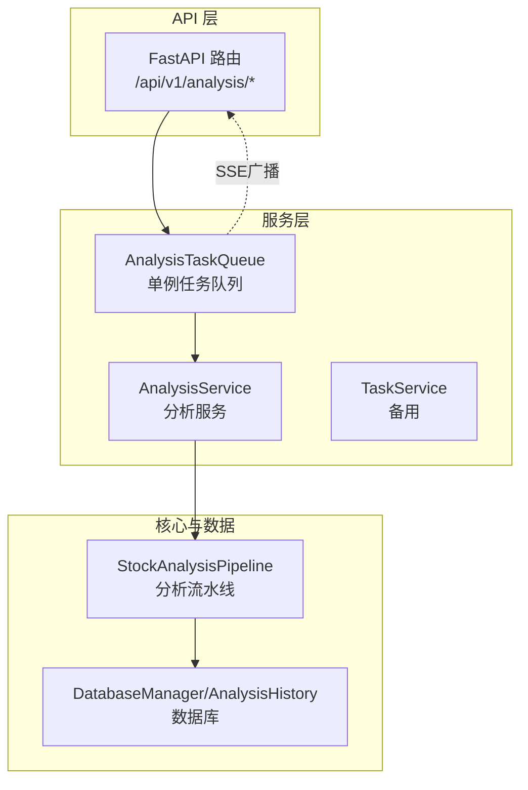
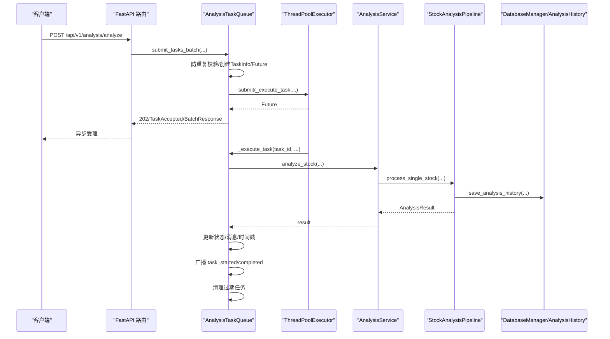
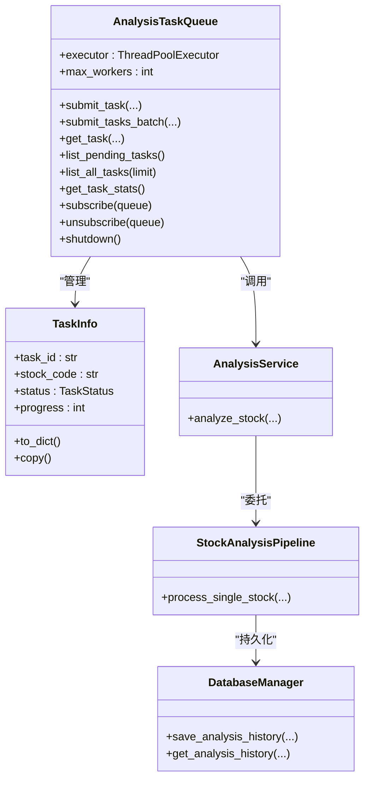

# 任务队列管理

<cite>
**本文引用的文件**
- [task_queue.py](file://src/services/task_queue.py)
- [analysis.py](file://api/v1/endpoints/analysis.py)
- [analysis.py](file://api/v1/schemas/analysis.py)
- [analysis_service.py](file://src/services/analysis_service.py)
- [pipeline.py](file://src/core/pipeline.py)
- [config.py](file://src/config.py)
- [storage.py](file://src/storage.py)
- [analysis_repo.py](file://src/repositories/analysis_repo.py)
</cite>

## 目录
1. [简介](#简介)
2. [项目结构](#项目结构)
3. [核心组件](#核心组件)
4. [架构总览](#架构总览)
5. [详细组件分析](#详细组件分析)
6. [依赖关系分析](#依赖关系分析)
7. [性能考量](#性能考量)
8. [故障排查指南](#故障排查指南)
9. [结论](#结论)
10. [附录](#附录)

## 简介
本文件面向任务队列管理系统，围绕 AnalysisTaskQueue 类展开，系统性阐述其单例模式实现、任务状态管理（PENDING、PROCESSING、COMPLETED、FAILED）、防重复提交机制、线程池执行模型、任务生命周期、TaskInfo 数据类设计与序列化、任务查询接口、统计与清理机制，并给出使用方法与最佳实践。

## 项目结构
任务队列位于服务层，对外通过 FastAPI 接口暴露，内部协调分析服务与数据库持久化，支持 SSE 实时事件推送。

图表来源
- [analysis.py:68-694](file://api/v1/endpoints/analysis.py#L68-L694)
- [task_queue.py:108-666](file://src/services/task_queue.py#L108-L666)
- [analysis_service.py:29-171](file://src/services/analysis_service.py#L29-L171)
- [pipeline.py:48-430](file://src/core/pipeline.py#L48-L430)
- [storage.py:623-746](file://src/storage.py#L623-L746)

章节来源
- [task_queue.py:1-666](file://src/services/task_queue.py#L1-L666)
- [analysis.py:68-694](file://api/v1/endpoints/analysis.py#L68-L694)

## 核心组件
- AnalysisTaskQueue：全局单例任务队列，负责任务提交、状态管理、SSE 广播、线程池执行与历史清理。
- TaskInfo：任务信息数据类，提供 to_dict 序列化与副本复制。
- AnalysisService：封装分析逻辑，调用 Pipeline 执行分析并将结果持久化。
- FastAPI 路由：提供 /analyze、/tasks、/tasks/stream、/status/{task_id} 等接口。
- 配置与存储：通过 Config.max_workers 控制并发，通过 DatabaseManager/AnalysisHistory 持久化。

章节来源
- [task_queue.py:108-666](file://src/services/task_queue.py#L108-L666)
- [analysis.py:68-694](file://api/v1/endpoints/analysis.py#L68-L694)
- [analysis_service.py:29-171](file://src/services/analysis_service.py#L29-L171)
- [config.py:32-580](file://src/config.py#L32-L580)
- [storage.py:208-270](file://src/storage.py#L208-L270)

## 架构总览
任务从 API 提交到队列，队列通过线程池执行分析服务，分析服务调用分析流水线生成结果并持久化，期间通过 SSE 广播任务状态变更；完成后按策略清理历史任务。

图表来源
- [analysis.py:161-232](file://api/v1/endpoints/analysis.py#L161-L232)
- [task_queue.py:260-533](file://src/services/task_queue.py#L260-L533)
- [analysis_service.py:40-104](file://src/services/analysis_service.py#L40-L104)
- [pipeline.py:183-429](file://src/core/pipeline.py#L183-L429)
- [storage.py:208-270](file://src/storage.py#L208-L270)

## 详细组件分析

### AnalysisTaskQueue 类与单例模式
- 单例实现：类变量 _instance 与线程锁保证全局唯一实例，__new__ 与延迟初始化防止重复构造。
- 线程池：懒加载 ThreadPoolExecutor，max_workers 默认 3，可通过 sync_max_workers 动态调整（仅空闲时应用）。
- 核心数据结构：
  - _tasks：task_id -> TaskInfo 映射，维护任务全生命周期状态。
  - _analyzing_stocks：stock_code -> task_id，防重复提交的关键索引。
  - _futures：task_id -> Future，跟踪线程池任务。
  - _subscribers：SSE 订阅者队列列表，支持多客户端事件推送。
  - _main_loop：主事件循环引用，call_soon_threadsafe 跨线程安全广播。
- 并发与锁：RLock 保障内部状态一致性；_subscribers_lock 保护订阅者列表；_data_lock 保护核心数据结构。
- 历史清理：_max_history 默认 100，按创建时间删除旧的已完成/失败任务。

章节来源
- [task_queue.py:108-159](file://src/services/task_queue.py#L108-L159)
- [task_queue.py:160-169](file://src/services/task_queue.py#L160-L169)
- [task_queue.py:175-231](file://src/services/task_queue.py#L175-L231)
- [task_queue.py:534-566](file://src/services/task_queue.py#L534-L566)

### 任务状态管理与转换逻辑
- 状态枚举：PENDING、PROCESSING、COMPLETED、FAILED。
- 转换流程：
  - 提交：TaskInfo.status=PENDING，message=“任务已加入队列”，progress=0。
  - 开始：进入线程池执行，状态变更为 PROCESSING，started_at 设置，progress=10。
  - 成功：COMPLETED，progress=100，completed_at 设置，result 写入，从 _analyzing_stocks 移除。
  - 失败：FAILED，completed_at 设置，error/message 记录，从 _analyzing_stocks 移除。
- 状态查询：get_task、list_pending_tasks、list_all_tasks、get_task_stats 提供不同粒度视图。

章节来源
- [task_queue.py:34-39](file://src/services/task_queue.py#L34-L39)
- [task_queue.py:440-533](file://src/services/task_queue.py#L440-L533)
- [task_queue.py:374-418](file://src/services/task_queue.py#L374-L418)
- [task_queue.py:419-436](file://src/services/task_queue.py#L419-L436)

### 防重复提交机制
- 核心：submit_tasks_batch 在 _analyzing_stocks 中检查 stock_code 是否已在分析中，若存在则抛出 DuplicateTaskError 并记录 existing_task_id。
- 作用：避免同一股票代码的重复分析任务，提升资源利用率与一致性。

章节来源
- [task_queue.py:296-361](file://src/services/task_queue.py#L296-L361)
- [task_queue.py:320-323](file://src/services/task_queue.py#L320-L323)
- [task_queue.py:96-106](file://src/services/task_queue.py#L96-L106)

### 线程池执行模型与调度策略
- 线程池：ThreadPoolExecutor，max_workers 默认 3，线程名前缀 analysis_task_。
- 提交：submit_tasks_batch 将 _execute_task(task_id, ...) 提交至线程池，捕获异常并回滚已创建任务，保证幂等性。
- 动态并发：sync_max_workers 在空闲时调整 max_workers，否则返回“deferred_busy”。
- 执行：_execute_task 更新状态为 PROCESSING，广播 task_started；分析成功/失败分别更新 COMPLETED/FAILED，广播对应事件；最后清理过期任务。

章节来源
- [task_queue.py:160-169](file://src/services/task_queue.py#L160-L169)
- [task_queue.py:296-361](file://src/services/task_queue.py#L296-L361)
- [task_queue.py:184-231](file://src/services/task_queue.py#L184-L231)
- [task_queue.py:440-533](file://src/services/task_queue.py#L440-L533)

### 任务生命周期管理
- 生命周期阶段：提交 -> 入队(PENDING) -> 执行(PROCESSING) -> 完成(COMPLETED)/失败(FAILED) -> 清理。
- 生命周期接口：
  - 提交：submit_task、submit_tasks_batch。
  - 查询：get_task、list_pending_tasks、list_all_tasks、get_task_stats。
  - 状态：get_analysis_status（优先队列，其次数据库历史）。
- SSE：task_stream 提供 task_created/task_started/task_completed/task_failed/heartbeat 事件流。

章节来源
- [analysis.py:307-369](file://api/v1/endpoints/analysis.py#L307-L369)
- [analysis.py:376-439](file://api/v1/endpoints/analysis.py#L376-L439)
- [analysis.py:459-570](file://api/v1/endpoints/analysis.py#L459-L570)
- [task_queue.py:374-418](file://src/services/task_queue.py#L374-L418)
- [task_queue.py:419-436](file://src/services/task_queue.py#L419-L436)

### TaskInfo 数据类设计与序列化
- 字段：task_id、stock_code、stock_name、status、progress、message、result、error、report_type、created_at、started_at、completed_at。
- 序列化：to_dict 输出标准字典，包含 ISO 时间格式化；copy 提供副本，避免外部修改内部状态。
- 用途：API 响应、SSE 事件数据、统计与查询。

章节来源
- [task_queue.py:42-94](file://src/services/task_queue.py#L42-L94)

### 任务查询接口使用方法
- /api/v1/analysis/analyze
  - 参数：stock_code 或 stock_codes（二选一）、report_type、force_refresh、async_mode。
  - 行为：async_mode=false 时单只股票同步执行；true 时批量异步提交，返回 202。
  - 返回：同步模式返回 AnalysisResultResponse；异步模式返回 TaskAccepted 或 BatchTaskAcceptedResponse；重复提交返回 409。
- /api/v1/analysis/tasks
  - 参数：status（逗号分隔）、limit。
  - 返回：TaskListResponse，包含 total/pending/processing 与任务列表。
- /api/v1/analysis/tasks/stream
  - 返回：SSE 事件流，包含 connected、task_created、task_started、task_completed、task_failed、heartbeat。
- /api/v1/analysis/status/{task_id}
  - 返回：TaskStatus；若队列无记录则查询数据库历史并构建 AnalysisResultResponse。

章节来源
- [analysis.py:72-301](file://api/v1/endpoints/analysis.py#L72-L301)
- [analysis.py:307-369](file://api/v1/endpoints/analysis.py#L307-L369)
- [analysis.py:376-439](file://api/v1/endpoints/analysis.py#L376-L439)
- [analysis.py:459-570](file://api/v1/endpoints/analysis.py#L459-L570)
- [analysis.py:27-291](file://api/v1/schemas/analysis.py#L27-L291)

### 任务统计与清理机制
- 统计：get_task_stats 返回 total/pending/processing/completed/failed 数量。
- 清理：_cleanup_old_tasks 按 _max_history（默认 100）删除最早创建的已完成/失败任务，释放内存。
- 配置：Config.max_workers 控制线程池并发；get_task_queue 读取配置动态同步并发。

章节来源
- [task_queue.py:419-436](file://src/services/task_queue.py#L419-L436)
- [task_queue.py:534-566](file://src/services/task_queue.py#L534-L566)
- [config.py:152-152](file://src/config.py#L152-L152)
- [task_queue.py:648-666](file://src/services/task_queue.py#L648-L666)

## 依赖关系分析

图表来源
- [task_queue.py:108-666](file://src/services/task_queue.py#L108-L666)
- [analysis_service.py:29-171](file://src/services/analysis_service.py#L29-L171)
- [pipeline.py:48-430](file://src/core/pipeline.py#L48-L430)
- [storage.py:623-746](file://src/storage.py#L623-L746)

章节来源
- [task_queue.py:108-666](file://src/services/task_queue.py#L108-L666)
- [analysis_service.py:29-171](file://src/services/analysis_service.py#L29-L171)
- [pipeline.py:48-430](file://src/core/pipeline.py#L48-L430)
- [storage.py:623-746](file://src/storage.py#L623-L746)

## 性能考量
- 并发控制：max_workers 默认 3，避免过度并发导致外部 API 限流与系统资源争用；可通过 sync_max_workers 在空闲时调整。
- 内存优化：_max_history=100，定期清理已完成/失败任务，降低内存占用。
- 线程安全：RLock 与 call_soon_threadsafe 确保跨线程广播与状态更新的一致性。
- I/O 与 CPU：分析流程涉及网络请求与 AI 推理，线程池避免阻塞 API 响应；建议结合外部限流策略与代理配置。

## 故障排查指南
- 重复提交：收到 409 且包含 existing_task_id，确认是否已有同股票任务在队列中。
- 任务无响应：检查线程池是否满载或 sync_max_workers 返回“deferred_busy”；确认 max_workers 配置与实际并发。
- SSE 无事件：确认 task_stream 订阅成功（connected），检查主事件循环引用与 call_soon_threadsafe 调用。
- 任务状态不一致：核对 _analyzing_stocks 与 _tasks 的一致性，确保异常分支正确移除 stock_code 映射。
- 历史缺失：get_analysis_status 在队列无记录时查询数据库历史，确认 AnalysisHistory 表存在且数据完整。

章节来源
- [task_queue.py:96-106](file://src/services/task_queue.py#L96-L106)
- [task_queue.py:184-231](file://src/services/task_queue.py#L184-L231)
- [analysis.py:376-439](file://api/v1/endpoints/analysis.py#L376-L439)
- [analysis.py:459-570](file://api/v1/endpoints/analysis.py#L459-L570)
- [storage.py:208-270](file://src/storage.py#L208-L270)

## 结论
AnalysisTaskQueue 通过单例模式、线程池执行、SSE 广播与严格的生命周期管理，提供了高可用、可观测、可扩展的任务队列能力。配合防重复提交与历史清理策略，系统在并发与内存之间取得平衡，满足异步分析场景下的稳定性与可维护性。

## 附录

### API 与数据模型摘要
- 请求模型：AnalyzeRequest（stock_code/stock_codes、report_type、force_refresh、async_mode）。
- 响应模型：TaskAccepted、BatchTaskAcceptedResponse、TaskStatus、TaskListResponse、AnalysisResultResponse。
- 事件模型：connected、task_created、task_started、task_completed、task_failed、heartbeat。

章节来源
- [analysis.py:27-291](file://api/v1/schemas/analysis.py#L27-L291)