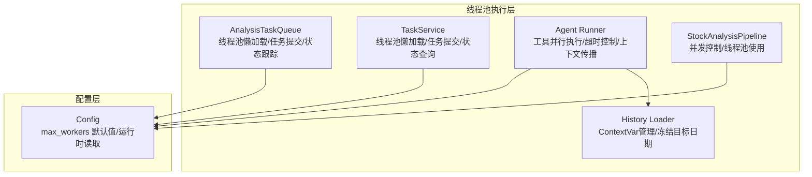
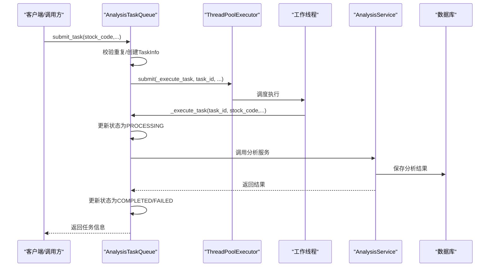
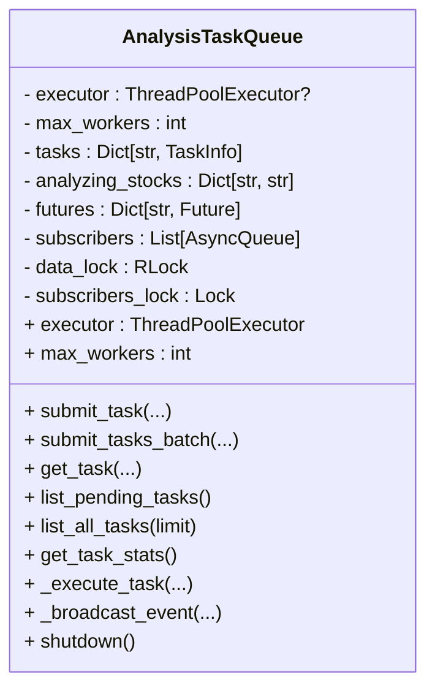
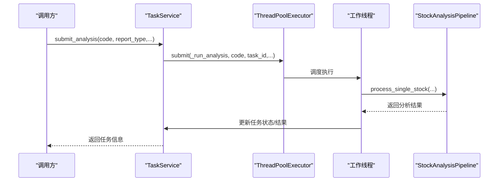
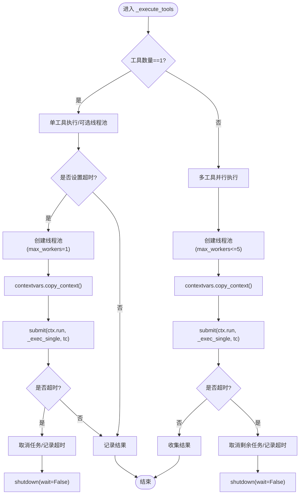
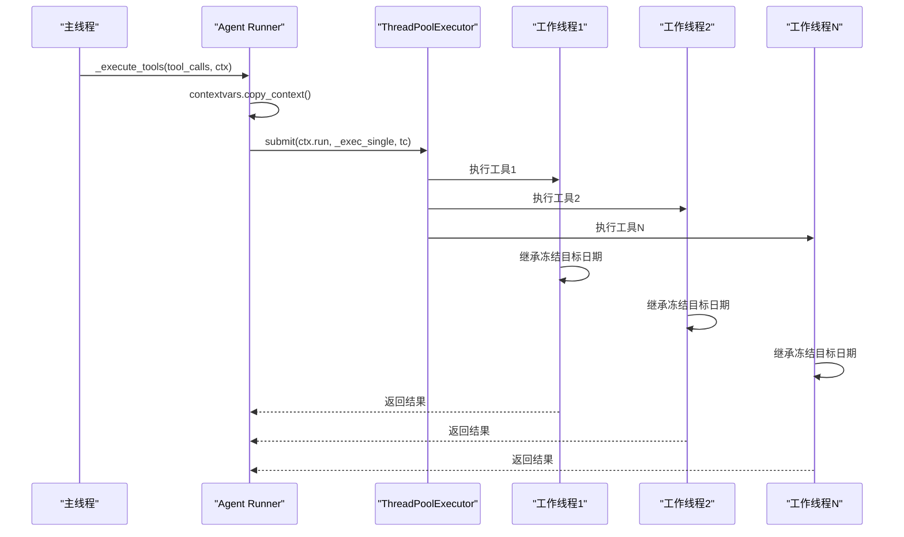

# 线程池执行模型

<cite>
**本文引用的文件**
- [task_queue.py](file://src/services/task_queue.py)
- [task_service.py](file://src/services/task_service.py)
- [runner.py](file://src/agent/runner.py)
- [pipeline.py](file://src/core/pipeline.py)
- [config.py](file://src/config.py)
- [base.py](file://data_provider/base.py)
- [history_loader.py](file://src/services/history_loader.py)
- [registry.py](file://src/agent/tools/registry.py)
- [test_agent_frozen_context.py](file://tests/test_agent_frozen_context.py)
</cite>

## 更新摘要
**变更内容**
- 更新Agent工具执行器的上下文传播机制，改进`_execute_tools`方法的`contextvars.copy_context().run()`实现
- 新增上下文变量传播的详细说明，确保`frozen_target_date`在多线程间正确传递
- 增强线程池执行模型的上下文安全性分析

## 目录
1. [简介](#简介)
2. [项目结构](#项目结构)
3. [核心组件](#核心组件)
4. [架构总览](#架构总览)
5. [详细组件分析](#详细组件分析)
6. [上下文传播机制](#上下文传播机制)
7. [依赖分析](#依赖分析)
8. [性能考量](#性能考量)
9. [故障排查指南](#故障排查指南)
10. [结论](#结论)

## 简介
本文围绕线程池执行模型展开，聚焦于任务队列与分析流水线中的线程池配置、懒加载与并发控制，以及任务提交、执行、状态更新与结果返回的完整流程。重点覆盖以下主题：
- ThreadPoolExecutor 的配置与懒加载实现
- executor 属性的延迟初始化机制
- submit_task() 如何将分析任务提交至线程池
- _execute_task() 的执行逻辑、状态更新、异常处理与结果返回
- Future 对象的管理与任务执行状态跟踪
- **新增：上下文变量传播机制，确保多线程间状态一致性**
- 性能优化建议（并发度、线程命名、资源清理）
- 线程安全与锁机制

## 项目结构
本项目的线程池执行模型主要分布在以下模块：
- 任务队列与线程池管理：AnalysisTaskQueue（线程池懒加载、任务提交、状态跟踪、事件广播）
- 任务服务与线程池：TaskService（线程池懒加载、任务提交、状态查询）
- 代理执行器：Agent Runner（工具并行执行、超时控制、线程池管理、**上下文传播**）
- 分析流水线：StockAnalysisPipeline（并发控制、线程池使用）
- 配置：Config（max_workers 默认值与运行时读取）
- **上下文管理：History Loader（ContextVar 管理、冻结目标日期）**

**图表来源**
- [task_queue.py:108-168](file://src/services/task_queue.py#L108-L168)
- [task_service.py:30-66](file://src/services/task_service.py#L30-L66)
- [runner.py:543-688](file://src/agent/runner.py#L543-L688)
- [pipeline.py:48-119](file://src/core/pipeline.py#L48-L119)
- [config.py:31-156](file://src/config.py#L31-L156)
- [history_loader.py:21-40](file://src/services/history_loader.py#L21-L40)

**章节来源**
- [task_queue.py:108-168](file://src/services/task_queue.py#L108-L168)
- [task_service.py:30-66](file://src/services/task_service.py#L30-L66)
- [runner.py:543-688](file://src/agent/runner.py#L543-L688)
- [pipeline.py:48-119](file://src/core/pipeline.py#L48-L119)
- [config.py:31-156](file://src/config.py#L31-L156)
- [history_loader.py:21-40](file://src/services/history_loader.py#L21-L40)

## 核心组件
- AnalysisTaskQueue：单例线程池管理器，负责任务提交、状态跟踪、事件广播与线程池生命周期管理。
- TaskService：服务层线程池管理器，负责异步分析任务提交与状态查询。
- Agent Runner：工具并行执行器，使用线程池执行工具调用，并支持超时控制和**上下文变量传播**。
- StockAnalysisPipeline：分析流水线，协调多模块并发执行，使用线程池控制并发度。
- Config：全局配置，提供 max_workers 默认值与运行时读取。
- **History Loader：上下文变量管理器，提供冻结目标日期的ContextVar支持**。

**章节来源**
- [task_queue.py:108-168](file://src/services/task_queue.py#L108-L168)
- [task_service.py:30-66](file://src/services/task_service.py#L30-L66)
- [runner.py:543-688](file://src/agent/runner.py#L543-L688)
- [pipeline.py:48-119](file://src/core/pipeline.py#L48-L119)
- [config.py:31-156](file://src/config.py#L31-L156)
- [history_loader.py:21-40](file://src/services/history_loader.py#L21-L40)

## 架构总览
线程池执行模型采用"懒加载 + 单例 + 线程安全 + **上下文传播**"的设计：
- 懒加载：首次访问 executor 属性时创建 ThreadPoolExecutor，避免无任务场景下的资源浪费。
- 单例：AnalysisTaskQueue 与 TaskService 均采用单例模式，保证全局唯一线程池实例。
- 线程安全：通过 RLock/RLock 与锁保护共享状态，确保多线程环境下的一致性。
- 事件广播：任务状态变更通过 asyncio 事件循环安全广播至订阅者。
- **上下文传播：使用 contextvars.copy_context().run() 确保多线程间状态一致性**。

**图表来源**
- [task_queue.py:260-361](file://src/services/task_queue.py#L260-L361)
- [task_queue.py:440-532](file://src/services/task_queue.py#L440-L532)

**章节来源**
- [task_queue.py:260-361](file://src/services/task_queue.py#L260-L361)
- [task_queue.py:440-532](file://src/services/task_queue.py#L440-L532)

## 详细组件分析

### AnalysisTaskQueue：线程池懒加载与任务执行
- 懒加载实现：executor 属性在首次访问时创建 ThreadPoolExecutor，使用 thread_name_prefix 便于监控与调试。
- 任务提交：submit_tasks_batch() 批量提交任务，校验重复、创建 TaskInfo、提交到线程池并登记 Future。
- 执行逻辑：_execute_task() 在工作线程中执行，更新状态、调用 AnalysisService.analyze_stock()、广播事件、清理过期任务。
- Future 管理：_futures 字典维护 task_id 到 Future 的映射，用于回滚与取消。
- 并发同步：sync_max_workers() 在空闲时动态调整 max_workers，必要时关闭旧线程池并重建。
- 线程安全：RLock 保护核心数据结构（任务、分析中股票、Future、事件订阅者），确保多线程一致性。

**图表来源**
- [task_queue.py:108-168](file://src/services/task_queue.py#L108-L168)
- [task_queue.py:260-361](file://src/services/task_queue.py#L260-L361)
- [task_queue.py:440-532](file://src/services/task_queue.py#L440-L532)

**章节来源**
- [task_queue.py:108-168](file://src/services/task_queue.py#L108-L168)
- [task_queue.py:260-361](file://src/services/task_queue.py#L260-L361)
- [task_queue.py:440-532](file://src/services/task_queue.py#L440-L532)

### TaskService：服务层线程池与任务状态
- 懒加载线程池：executor 属性首次访问时创建，线程名前缀便于识别。
- 任务提交：submit_analysis() 提交分析任务到线程池，内部调用 _run_analysis()。
- 状态管理：_tasks 字典与 _tasks_lock 保护任务状态，支持查询与历史记录。
- 执行流程：_run_analysis() 初始化任务状态，构建分析流水线并执行，更新任务状态与结果。

**图表来源**
- [task_service.py:68-114](file://src/services/task_service.py#L68-L114)
- [task_service.py:141-234](file://src/services/task_service.py#L141-L234)

**章节来源**
- [task_service.py:68-114](file://src/services/task_service.py#L68-L114)
- [task_service.py:141-234](file://src/services/task_service.py#L141-L234)

### Agent Runner：工具并行执行与超时控制
- 并行执行：_execute_tools() 在多工具场景下使用 ThreadPoolExecutor 并发执行，支持超时控制。
- 单工具分支：单工具时可选择直接执行或使用小规模线程池。
- 超时处理：捕获 FuturesTimeoutError，取消未完成任务，记录超时事件。
- 线程池生命周期：根据是否超时决定 shutdown(wait=...) 参数，避免阻塞。
- **上下文传播：使用 contextvars.copy_context().run() 确保冻结目标日期在多线程间正确传递**。

**图表来源**
- [runner.py:543-688](file://src/agent/runner.py#L543-L688)
- [runner.py:656-660](file://src/agent/runner.py#L656-L660)
- [runner.py:700-701](file://src/agent/runner.py#L700-L701)

**章节来源**
- [runner.py:543-688](file://src/agent/runner.py#L543-L688)
- [runner.py:656-660](file://src/agent/runner.py#L656-L660)
- [runner.py:700-701](file://src/agent/runner.py#L700-L701)

### StockAnalysisPipeline：并发控制与线程池使用
- 并发度控制：构造函数读取配置 max_workers，用于后续并发控制。
- 线程池使用：在特定场景下使用 ThreadPoolExecutor 控制并发度，避免触发反爬限制。
- 线程命名：通过 max_workers 参数控制线程池大小，结合 AnalysisTaskQueue 的线程名前缀提升可观测性。

**章节来源**
- [pipeline.py:48-119](file://src/core/pipeline.py#L48-L119)
- [pipeline.py:1178-1179](file://src/core/pipeline.py#L1178-L1179)

### 配置与运行时调整
- 默认并发：Config.max_workers 默认为 3，兼顾性能与反爬策略。
- 运行时读取：get_task_queue() 从配置读取 max_workers 并同步到任务队列。
- 动态调整：AnalysisTaskQueue.sync_max_workers() 在空闲时应用新并发设置，必要时关闭旧线程池。

**章节来源**
- [config.py:151-152](file://src/config.py#L151-L152)
- [config.py:392-393](file://src/config.py#L392-L393)
- [task_queue.py:648-665](file://src/services/task_queue.py#L648-L665)
- [task_queue.py:184-230](file://src/services/task_queue.py#L184-L230)

## 上下文传播机制

### ContextVar 设计与实现
系统引入了基于 Python ContextVar 的上下文传播机制，专门用于解决多线程环境下的状态一致性问题。核心组件包括：

- **冻结目标日期（frozen_target_date）**：通过 ContextVar 存储的日期状态，在整个 Agent 执行过程中保持一致
- **上下文复制（copy_context）**：使用 `contextvars.copy_context().run()` 确保子线程继承父线程的上下文状态
- **线程安全的状态管理**：通过 Token 机制管理 ContextVar 的设置、获取和重置

### Agent 工具执行中的上下文传播

在 `_execute_tools` 方法中，系统实现了两种不同的上下文传播策略：

#### 单工具执行路径
当只有一个工具需要执行时，系统会：
1. 创建 ThreadPoolExecutor（max_workers=1）
2. 使用 `contextvars.copy_context()` 复制当前上下文
3. 通过 `ctx.run()` 包装工具执行函数
4. 在工作线程中执行工具调用，自动继承父线程的 ContextVar 状态

#### 多工具并行执行路径
当有多个工具需要并行执行时，系统会：
1. 创建 ThreadPoolExecutor（max_workers=min(len(tool_calls), 5)）
2. 对每个工具调用使用 `contextvars.copy_context().run()` 包装
3. 并行提交到线程池执行
4. 每个工作线程都获得独立的上下文副本

**图表来源**
- [runner.py:656-660](file://src/agent/runner.py#L656-L660)
- [runner.py:700-701](file://src/agent/runner.py#L700-L701)

### 测试验证与保证
系统提供了完整的单元测试来验证上下文传播机制的正确性：

- **单工具上下文传播测试**：验证冻结目标日期在单线程工具执行中的正确传递
- **多工具并行上下文传播测试**：使用 Barrier 确保多个工作线程同时进入上下文，验证 ContextVar 的独立性
- **线程安全保证测试**：通过同步屏障确保真正的并发执行，避免共享状态问题

**章节来源**
- [history_loader.py:21-40](file://src/services/history_loader.py#L21-L40)
- [runner.py:656-660](file://src/agent/runner.py#L656-L660)
- [runner.py:700-701](file://src/agent/runner.py#L700-L701)
- [test_agent_frozen_context.py:44-67](file://tests/test_agent_frozen_context.py#L44-L67)
- [test_agent_frozen_context.py:69-109](file://tests/test_agent_frozen_context.py#L69-L109)

## 依赖分析
- AnalysisTaskQueue 依赖：
  - concurrent.futures.ThreadPoolExecutor/Future
  - asyncio（事件广播）
  - src.services.analysis_service（分析服务）
  - src.config.get_config（运行时配置）
- TaskService 依赖：
  - concurrent.futures.ThreadPoolExecutor
  - src.config.get_config、main.StockAnalysisPipeline（分析流水线）
- Agent Runner 依赖：
  - concurrent.futures.ThreadPoolExecutor/as_completed/TimeoutError
  - src.agent.tools.registry（工具注册）
  - src.storage.persist_llm_usage（用量记录）
  - **contextvars（上下文传播）**
- StockAnalysisPipeline 依赖：
  - data_provider.DataFetcherManager、src.analyzer.GeminiAnalyzer
  - src.notification.NotificationService、src.search_service.SearchService
  - src.stock_analyzer.StockTrendAnalyzer
- **History Loader 依赖**：
  - contextvars（上下文变量管理）
  - src.storage.get_db（数据库访问）

```mermaid
graph TB
ATQ["AnalysisTaskQueue"] --> CF["concurrent.futures"]
ATQ --> AS["AnalysisService"]
ATQ --> CFG["Config"]
ATQ --> ASIO["asyncio"]
TS["TaskService"] --> CF
TS --> CFG
TS --> PIPE["StockAnalysisPipeline"]
AR["Agent Runner"] --> CF
AR --> TR["ToolRegistry"]
AR --> ST["storage.persist_llm_usage"]
AR --> CV["contextvars"]
SP["StockAnalysisPipeline"] --> DFM["DataFetcherManager"]
SP --> GA["GeminiAnalyzer"]
SP --> NS["NotificationService"]
SP --> SS["SearchService"]
SP --> STA["StockTrendAnalyzer"]
HL["History Loader"] --> CV
HL --> DB["Database Access"]
```

**图表来源**
- [task_queue.py:19-31](file://src/services/task_queue.py#L19-L31)
- [task_service.py:17-26](file://src/services/task_service.py#L17-L26)
- [runner.py:22-28](file://src/agent/runner.py#L22-L28)
- [pipeline.py:24-42](file://src/core/pipeline.py#L24-L42)
- [history_loader.py:11-18](file://src/services/history_loader.py#L11-L18)

**章节来源**
- [task_queue.py:19-31](file://src/services/task_queue.py#L19-L31)
- [task_service.py:17-26](file://src/services/task_service.py#L17-L26)
- [runner.py:22-28](file://src/agent/runner.py#L22-L28)
- [pipeline.py:24-42](file://src/core/pipeline.py#L24-L42)
- [history_loader.py:11-18](file://src/services/history_loader.py#L11-L18)

## 性能考量
- 并发度设置
  - 默认 max_workers=3，兼顾性能与反爬策略。可根据 CPU 核心数与 I/O 密集程度适度调整。
  - 运行时可通过 sync_max_workers() 在空闲时动态调整，避免频繁替换线程池实例。
- 线程命名
  - AnalysisTaskQueue 使用 thread_name_prefix="analysis_task_"，TaskService 使用 "analysis_"，便于进程内线程识别与问题定位。
- 资源清理
  - AnalysisTaskQueue.shutdown() 显式关闭线程池，避免进程退出时资源泄漏。
  - Agent Runner 在超时时使用 wait=False 避免阻塞，及时释放资源。
- 事件广播
  - 使用 asyncio.call_soon_threadsafe 将事件安全地从工作线程投递到事件循环，避免阻塞。
- 超时与熔断
  - Agent Runner 对工具调用设置超时，避免长时间阻塞线程池。
  - data_provider.base 中使用信号量控制底层任务槽位，防止 worker pool 耗尽导致的超时。
- **上下文传播性能**
  - 使用 `contextvars.copy_context()` 的开销相对较小，但会增加线程间状态传递的可靠性
  - 对于大量工具并行执行的场景，建议合理设置 max_workers，避免过度的上下文复制开销

**章节来源**
- [task_queue.py:164-167](file://src/services/task_queue.py#L164-L167)
- [task_service.py:62-65](file://src/services/task_service.py#L62-L65)
- [task_queue.py:638-643](file://src/services/task_queue.py#L638-L643)
- [runner.py:590-686](file://src/agent/runner.py#L590-L686)
- [base.py:1477-1499](file://data_provider/base.py#L1477-L1499)

## 故障排查指南
- 线程池未创建
  - 现象：首次访问 executor 属性时报错或未生效。
  - 排查：确认 AnalysisTaskQueue 的 executor 属性懒加载逻辑是否被调用；检查 max_workers 初始化。
- 并发调整未生效
  - 现象：sync_max_workers() 返回 "deferred_busy"。
  - 排查：确认队列是否存在进行中任务；空闲时再次调用或等待任务完成。
- 任务状态异常
  - 现象：任务状态未更新或事件未广播。
  - 排查：检查 _data_lock 与 _subscribers_lock 的持有与释放；确认事件循环是否有效。
- 超时与取消
  - 现象：工具执行超时或任务被取消。
  - 排查：查看 _execute_tools() 的超时分支与 Future 取消逻辑；确认线程池 shutdown(wait=...) 参数。
- 资源泄漏
  - 现象：进程退出后线程池未关闭。
  - 排查：确保调用 AnalysisTaskQueue.shutdown()；在 Agent Runner 中避免阻塞关闭。
- **上下文传播问题**
  - 现象：工具执行中获取不到正确的冻结目标日期。
  - 排查：确认使用 `contextvars.copy_context().run()` 包装工具执行函数；检查 History Loader 的 ContextVar 设置和重置逻辑；验证测试用例中的同步屏障实现。

**章节来源**
- [task_queue.py:184-230](file://src/services/task_queue.py#L184-L230)
- [task_queue.py:602-634](file://src/services/task_queue.py#L602-L634)
- [runner.py:590-686](file://src/agent/runner.py#L590-L686)
- [task_queue.py:638-643](file://src/services/task_queue.py#L638-L643)
- [test_agent_frozen_context.py:44-67](file://tests/test_agent_frozen_context.py#L44-L67)
- [test_agent_frozen_context.py:69-109](file://tests/test_agent_frozen_context.py#L69-L109)

## 结论
本项目通过"懒加载 + 单例 + 线程安全 + **上下文传播**"的线程池执行模型，实现了高并发、可扩展且稳定的分析任务调度。AnalysisTaskQueue 与 TaskService 提供了清晰的任务生命周期管理与状态跟踪，Agent Runner 与 StockAnalysisPipeline 则在工具并行与分析流程中合理控制并发度与资源使用。

**关键改进**：
- **上下文传播机制**：通过 `contextvars.copy_context().run()` 实现了可靠的多线程状态传递，特别是冻结目标日期的正确传播
- **线程安全增强**：结合上下文变量和传统锁机制，确保复杂场景下的数据一致性
- **测试保障**：完整的单元测试验证了上下文传播的正确性和线程安全性

配合运行时并发调整与完善的锁机制，系统在多线程环境下保持一致性与稳定性，特别是在需要跨线程传递状态的 Agent 工具执行场景中表现尤为突出。这一改进解决了 Issue #1066 中提到的上下文传播问题，为系统的可扩展性和可靠性提供了重要保障。