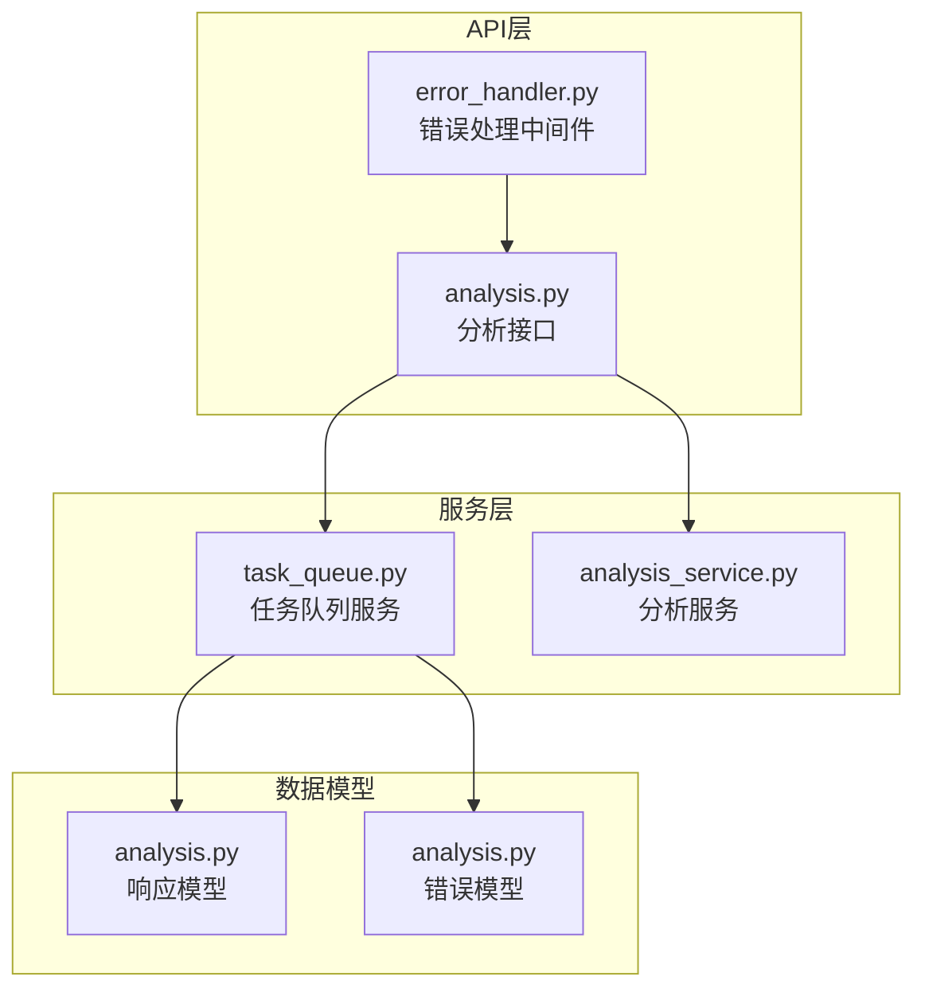
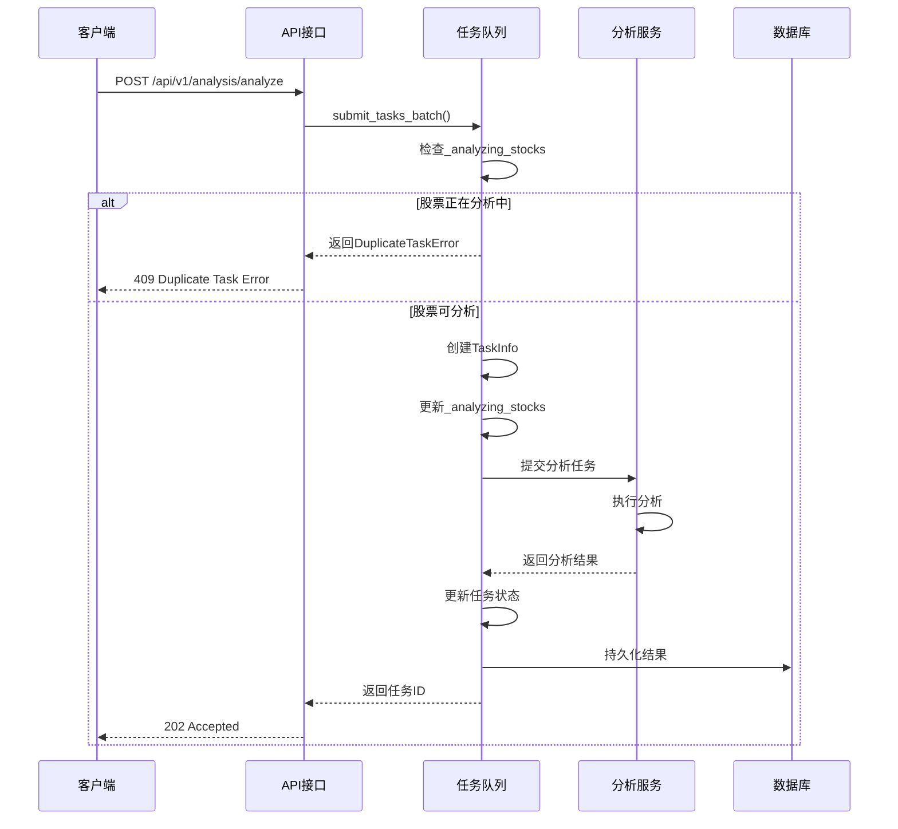
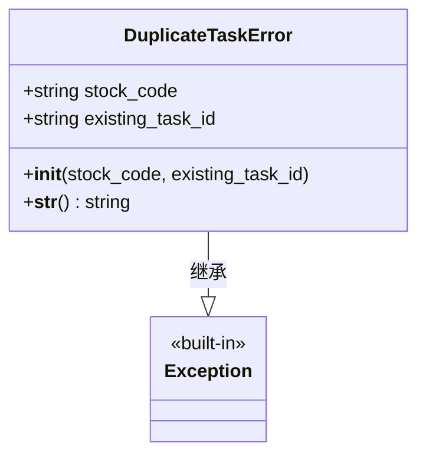
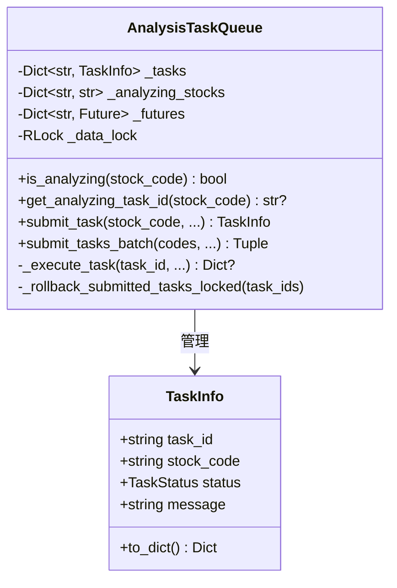
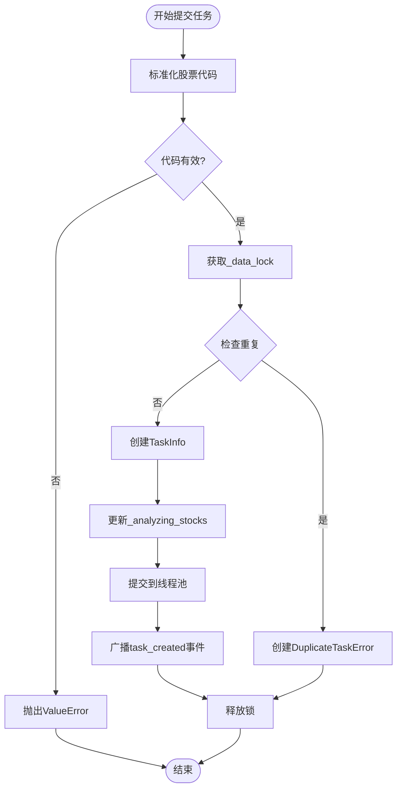
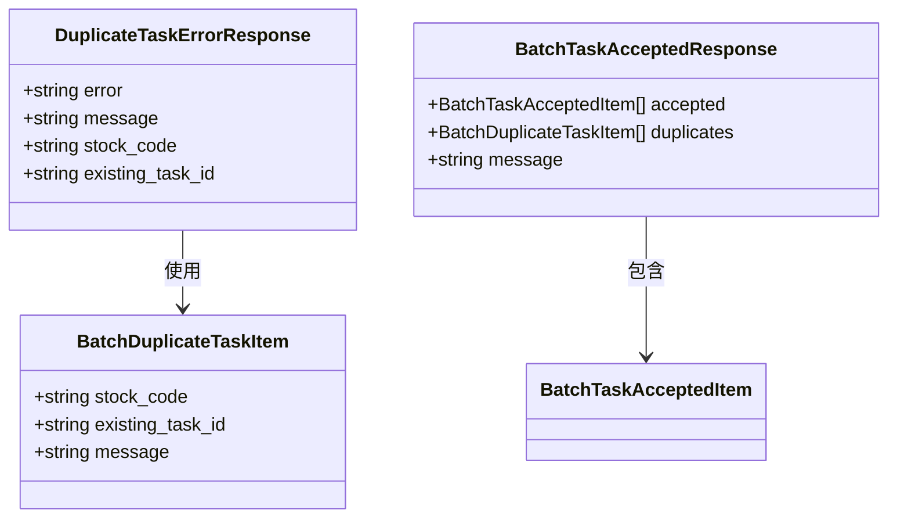
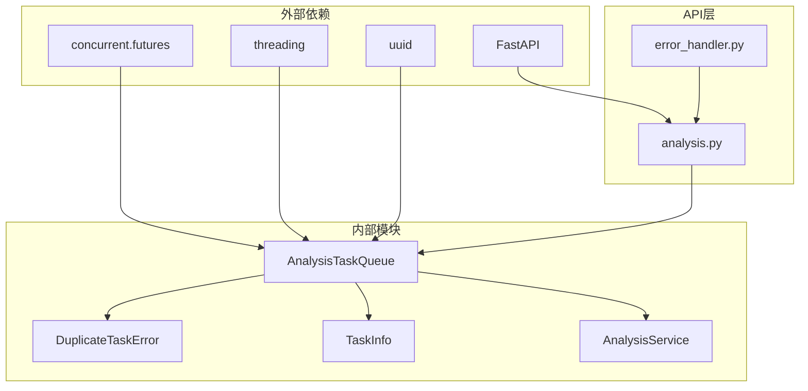

# 重复任务防护

<cite>
**本文档引用的文件**
- [task_queue.py](file://src/services/task_queue.py)
- [analysis.py](file://api/v1/endpoints/analysis.py)
- [analysis.py](file://api/v1/schemas/analysis.py)
- [error_handler.py](file://api/middlewares/error_handler.py)
- [test_analysis_api_contract.py](file://tests/test_analysis_api_contract.py)
</cite>

## 目录
1. [简介](#简介)
2. [项目结构](#项目结构)
3. [核心组件](#核心组件)
4. [架构概览](#架构概览)
5. [详细组件分析](#详细组件分析)
6. [依赖关系分析](#依赖关系分析)
7. [性能考虑](#性能考虑)
8. [故障排除指南](#故障排除指南)
9. [结论](#结论)

## 简介

重复任务防护机制是股票分析系统中的关键设计，旨在防止对同一股票代码的重复分析任务提交，避免资源浪费和数据竞争问题。该机制通过维护正在分析的股票代码到任务ID的映射关系，提供实时的重复检测和防护功能。

本机制的核心目标包括：
- 防止同一股票代码的重复分析任务提交
- 提供线程安全的并发访问控制
- 支持批量任务处理和单任务处理
- 提供清晰的错误反馈和用户提示
- 确保任务状态的一致性和完整性

## 项目结构

重复任务防护机制主要分布在以下模块中：

**图表来源**
- [task_queue.py:108-159](file://src/services/task_queue.py#L108-L159)
- [analysis.py:52-61](file://api/v1/endpoints/analysis.py#L52-L61)

**章节来源**
- [task_queue.py:1-666](file://src/services/task_queue.py#L1-L666)
- [analysis.py:1-694](file://api/v1/endpoints/analysis.py#L1-L694)

## 核心组件

重复任务防护机制由以下几个核心组件构成：

### 1. DuplicateTaskError 异常类
- **设计目的**：专门用于表示重复任务提交的业务异常
- **异常信息**：包含股票代码和现有任务ID，便于用户理解和调试
- **使用场景**：当检测到同一股票代码正在分析中时抛出

### 2. AnalysisTaskQueue 任务队列
- **单例模式**：确保全局唯一实例，维护一致的状态
- **线程安全**：使用RLock保护共享数据结构
- **核心数据结构**：`_analyzing_stocks` 字典维护分析状态

### 3. API 接口层
- **异步模式**：支持批量任务提交和重复检测
- **同步模式**：单只股票分析，自动检测重复
- **错误处理**：统一的409状态码和错误响应格式

**章节来源**
- [task_queue.py:96-106](file://src/services/task_queue.py#L96-L106)
- [task_queue.py:108-159](file://src/services/task_queue.py#L108-L159)
- [analysis.py:52-61](file://api/v1/endpoints/analysis.py#L52-L61)

## 架构概览

重复任务防护机制采用分层架构设计，确保各层职责明确：

**图表来源**
- [task_queue.py:296-361](file://src/services/task_queue.py#L296-L361)
- [analysis.py:161-232](file://api/v1/endpoints/analysis.py#L161-L232)

## 详细组件分析

### DuplicateTaskError 异常类

DuplicateTaskError 是专门为重复任务场景设计的业务异常类：

**图表来源**
- [task_queue.py:96-106](file://src/services/task_queue.py#L96-L106)

**设计特点**：
- **明确的错误语义**：专门用于重复任务场景
- **包含上下文信息**：股票代码和现有任务ID
- **友好的错误消息**：便于用户理解和处理

**章节来源**
- [task_queue.py:96-106](file://src/services/task_queue.py#L96-L106)

### AnalysisTaskQueue 核心机制

AnalysisTaskQueue 是重复任务防护的核心实现：

#### 核心数据结构

**图表来源**
- [task_queue.py:108-159](file://src/services/task_queue.py#L108-L159)
- [task_queue.py:42-94](file://src/services/task_queue.py#L42-L94)

#### 重复检测机制

重复检测通过 `_analyzing_stocks` 字典实现：

**检查逻辑**：
1. **锁保护**：使用 `_data_lock` 确保线程安全
2. **字典查找**：检查股票代码是否存在于 `_analyzing_stocks`
3. **快速返回**：存在即返回 True，不存在返回 False

**章节来源**
- [task_queue.py:234-258](file://src/services/task_queue.py#L234-L258)

#### 任务提交流程

**图表来源**
- [task_queue.py:260-361](file://src/services/task_queue.py#L260-L361)

**章节来源**
- [task_queue.py:260-361](file://src/services/task_queue.py#L260-L361)

### API 层集成

API 层提供了完整的重复任务防护接口：

#### 异步模式处理

异步模式下，API 层负责：
1. **批量处理**：支持多只股票同时分析
2. **重复检测**：实时检查每个股票的分析状态
3. **错误聚合**：将重复任务和成功任务分别返回
4. **状态码处理**：409 表示重复任务，202 表示任务已接受

#### 同步模式处理

同步模式下，API 层自动检测重复任务：
1. **单只股票限制**：同步模式仅支持单只股票
2. **即时检测**：提交前检查重复状态
3. **直接响应**：重复时立即返回 409 错误

**章节来源**
- [analysis.py:161-232](file://api/v1/endpoints/analysis.py#L161-L232)

### 错误响应模型

系统定义了专门的错误响应模型：

**图表来源**
- [analysis.py:274-291](file://api/v1/schemas/analysis.py#L274-L291)
- [analysis.py:135-180](file://api/v1/schemas/analysis.py#L135-L180)

**章节来源**
- [analysis.py:274-291](file://api/v1/schemas/analysis.py#L274-L291)
- [analysis.py:135-180](file://api/v1/schemas/analysis.py#L135-L180)

## 依赖关系分析

重复任务防护机制涉及多个模块间的复杂依赖关系：

**图表来源**
- [task_queue.py:14-31](file://src/services/task_queue.py#L14-L31)
- [analysis.py:25-61](file://api/v1/endpoints/analysis.py#L25-L61)

**依赖特点**：
- **低耦合设计**：各模块职责明确，接口清晰
- **线程安全**：通过锁机制保证并发安全性
- **错误隔离**：异常在适当层级被捕获和处理

**章节来源**
- [task_queue.py:14-31](file://src/services/task_queue.py#L14-L31)
- [analysis.py:25-61](file://api/v1/endpoints/analysis.py#L25-L61)

## 性能考虑

重复任务防护机制在设计时充分考虑了性能因素：

### 时间复杂度
- **重复检测**：O(1) 平均时间复杂度（字典查找）
- **批量处理**：O(n) 线性时间复杂度（n为股票数量）
- **锁竞争**：最小化锁持有时间，避免长时间阻塞

### 内存优化
- **增量清理**：定期清理过期任务，控制内存使用
- **弱引用**：避免循环引用导致的内存泄漏
- **数据结构选择**：使用字典提供高效的查找性能

### 并发性能
- **线程池管理**：动态调整线程池大小
- **非阻塞操作**：大部分操作不阻塞I/O
- **事件驱动**：使用SSE实现实时状态推送

## 故障排除指南

### 常见问题及解决方案

#### 1. 重复任务提交错误
**症状**：客户端收到 409 状态码和重复任务错误
**原因**：目标股票正在分析中
**解决方案**：
- 等待当前分析任务完成
- 使用 `get_analyzing_task_id()` 获取现有任务ID
- 实现重试机制，指数退避策略

#### 2. 锁死问题
**症状**：系统响应缓慢或无响应
**原因**：长时间持有锁或死锁
**解决方案**：
- 检查锁的使用范围
- 确保异常情况下也能释放锁
- 监控锁等待时间

#### 3. 内存泄漏
**症状**：内存使用持续增长
**原因**：过期任务未及时清理
**解决方案**：
- 调整 `_max_history` 设置
- 检查任务生命周期管理
- 实施定期清理机制

**章节来源**
- [task_queue.py:534-566](file://src/services/task_queue.py#L534-L566)
- [error_handler.py:24-68](file://api/middlewares/error_handler.py#L24-L68)

### 最佳实践建议

#### 用户体验优化
1. **实时状态查询**：提供任务状态查询接口
2. **进度反馈**：显示分析进度和预计完成时间
3. **错误提示**：友好的错误信息和解决建议

#### 系统稳定性
1. **超时机制**：设置合理的任务超时时间
2. **重试策略**：实现智能重试，避免雪崩效应
3. **监控告警**：建立完善的监控和告警机制

#### 开发规范
1. **异常处理**：统一的异常处理和错误响应格式
2. **日志记录**：详细的日志记录便于问题排查
3. **单元测试**：覆盖重复任务场景的测试用例

**章节来源**
- [test_analysis_api_contract.py:300-326](file://tests/test_analysis_api_contract.py#L300-L326)

## 结论

重复任务防护机制通过精心设计的架构和实现，有效地解决了股票分析系统中的重复任务问题。该机制具有以下优势：

1. **设计合理**：异常类、数据结构和API接口设计清晰
2. **性能优秀**：O(1)的重复检测时间和高效的内存管理
3. **扩展性强**：支持批量处理和异步模式
4. **用户体验好**：提供清晰的错误反馈和状态查询

通过本文档的详细分析，开发者可以深入理解重复任务防护机制的工作原理，并在此基础上进行进一步的优化和扩展。该机制为构建可靠的股票分析系统奠定了坚实的基础。