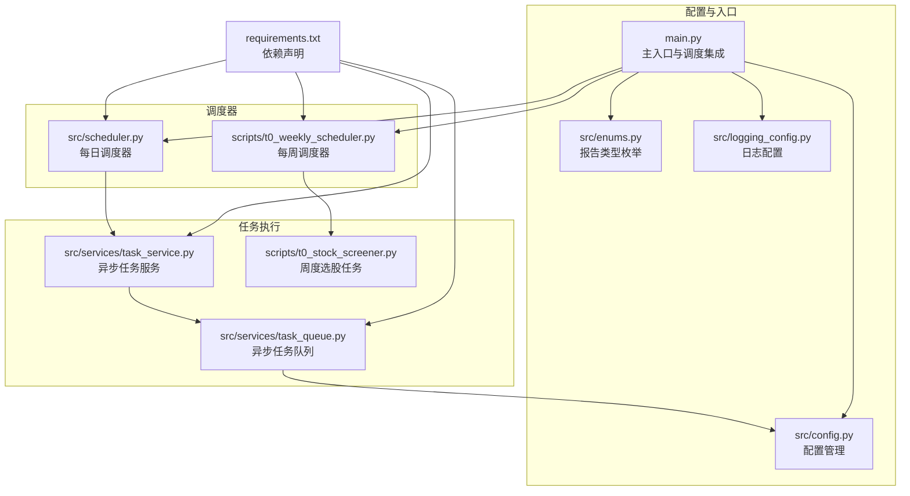
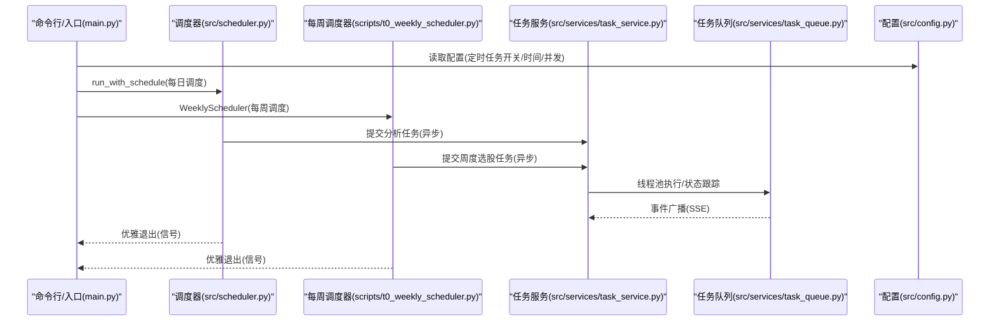
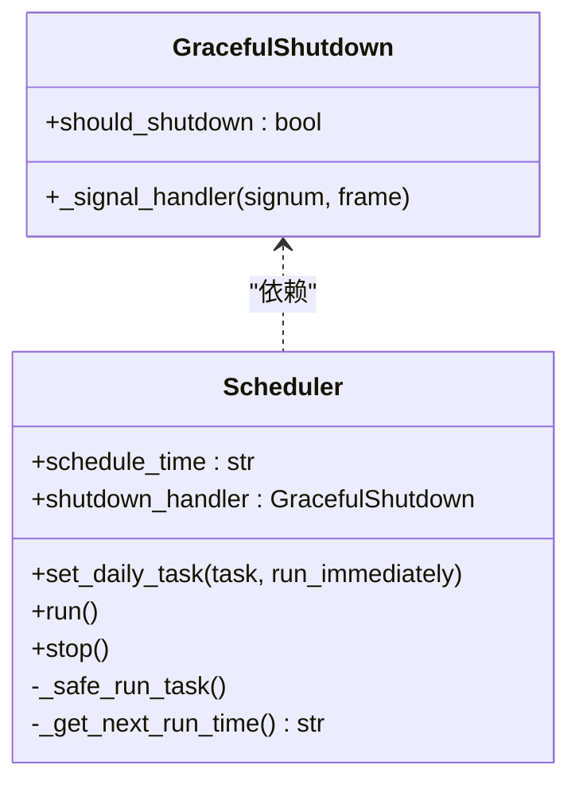
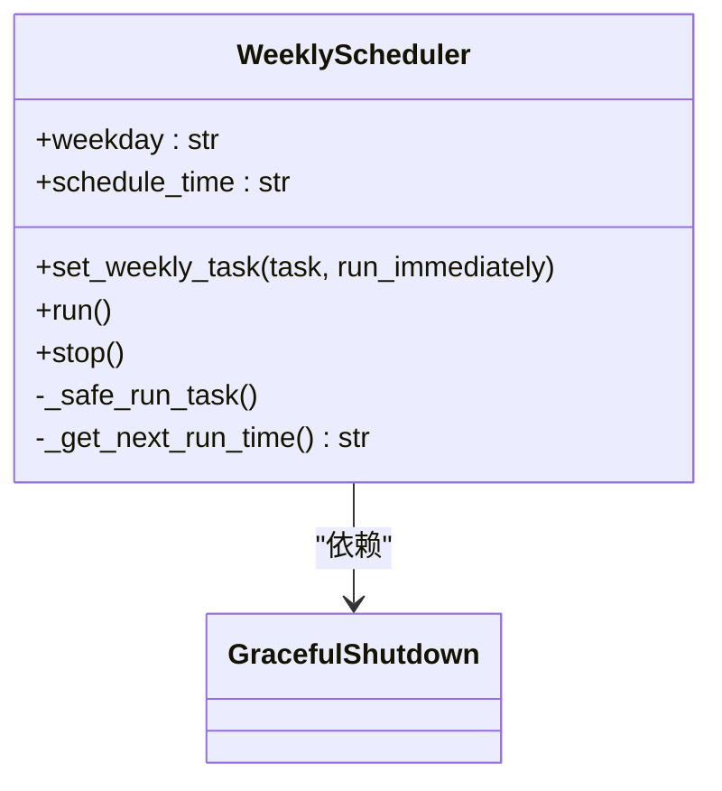
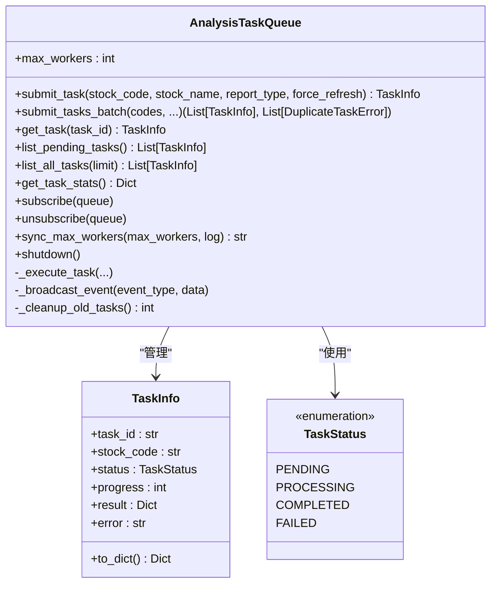
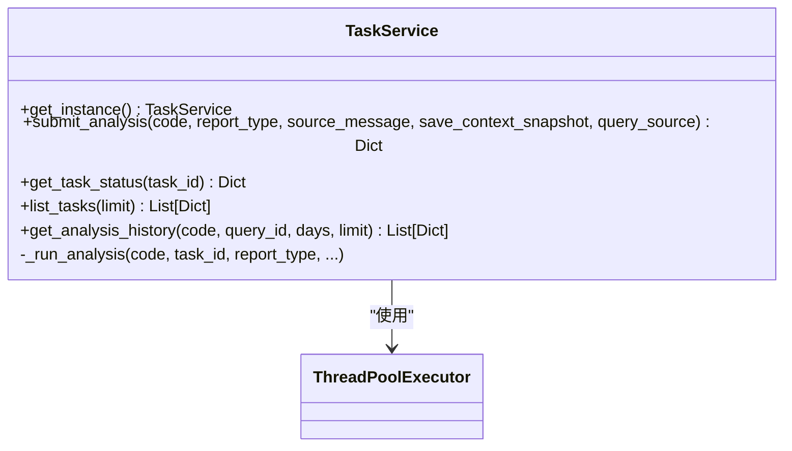
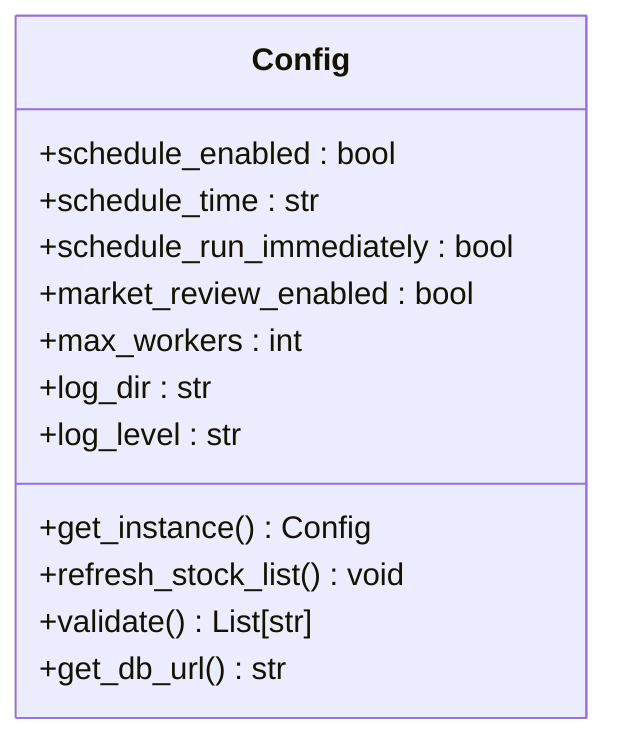
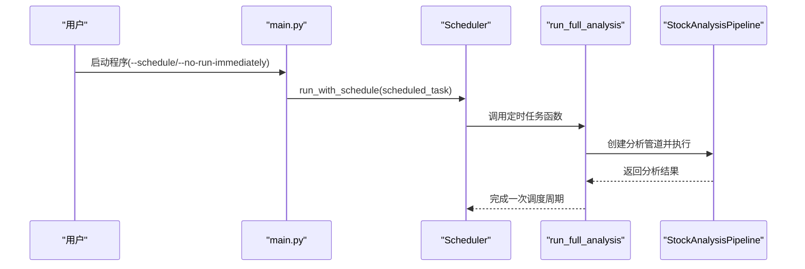
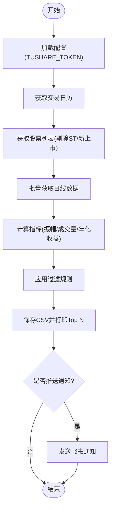
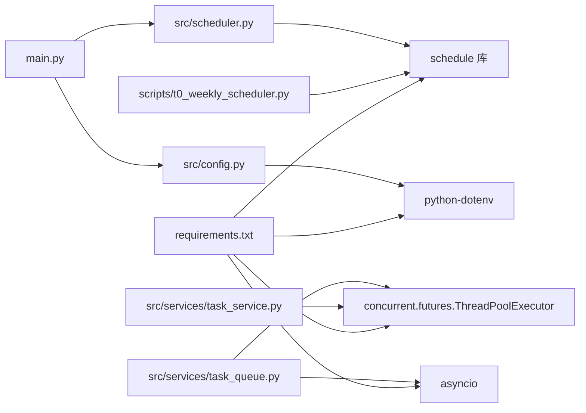

# 定时调度系统

<cite>
**本文引用的文件**
- [src/scheduler.py](file://src/scheduler.py)
- [scripts/t0_weekly_scheduler.py](file://scripts/t0_weekly_scheduler.py)
- [src/services/task_service.py](file://src/services/task_service.py)
- [src/services/task_queue.py](file://src/services/task_queue.py)
- [src/config.py](file://src/config.py)
- [main.py](file://main.py)
- [scripts/t0_stock_screener.py](file://scripts/t0_stock_screener.py)
- [src/enums.py](file://src/enums.py)
- [src/logging_config.py](file://src/logging_config.py)
- [requirements.txt](file://requirements.txt)
</cite>

## 目录
1. [简介](#简介)
2. [项目结构](#项目结构)
3. [核心组件](#核心组件)
4. [架构总览](#架构总览)
5. [详细组件分析](#详细组件分析)
6. [依赖关系分析](#依赖关系分析)
7. [性能考量](#性能考量)
8. [故障排查指南](#故障排查指南)
9. [结论](#结论)
10. [附录](#附录)

## 简介
本文件面向“定时调度系统”的技术文档，聚焦于以下目标：
- 解释定时任务的调度策略与执行计划，包括每日/每周定时执行、启动时立即执行、优雅退出机制。
- 说明调度器的初始化与配置过程，包括实例创建、参数设置与运行循环。
- 阐述任务注册与管理机制，包括任务提交、状态跟踪、并发控制与事件广播。
- 解释任务执行上下文与环境变量传递方式。
- 说明调度系统的启动与停止流程，包括优雅关闭与资源清理。
- 提供监控与日志记录方案，以及任务执行状态的可视化监控思路。
- 总结调度配置的最佳实践，包括任务优先级与资源分配策略。
- 记录扩展机制，支持自定义调度器与任务类型。

## 项目结构
定时调度系统主要分布在如下模块：
- 调度器与定时任务：src/scheduler.py、scripts/t0_weekly_scheduler.py
- 任务服务与队列：src/services/task_service.py、src/services/task_queue.py
- 配置管理：src/config.py
- 主入口与调度集成：main.py
- 周期性任务示例：scripts/t0_stock_screener.py
- 枚举与日志：src/enums.py、src/logging_config.py
- 依赖声明：requirements.txt

图表来源
- [src/scheduler.py:1-185](file://src/scheduler.py#L1-L185)
- [scripts/t0_weekly_scheduler.py:1-227](file://scripts/t0_weekly_scheduler.py#L1-L227)
- [src/services/task_queue.py:1-666](file://src/services/task_queue.py#L1-L666)
- [src/services/task_service.py:1-244](file://src/services/task_service.py#L1-L244)
- [scripts/t0_stock_screener.py:1-555](file://scripts/t0_stock_screener.py#L1-L555)
- [src/config.py:1-580](file://src/config.py#L1-L580)
- [main.py:1-723](file://main.py#L1-L723)
- [src/enums.py:1-51](file://src/enums.py#L1-L51)
- [src/logging_config.py:1-156](file://src/logging_config.py#L1-L156)
- [requirements.txt:1-65](file://requirements.txt#L1-L65)

章节来源
- [src/scheduler.py:1-185](file://src/scheduler.py#L1-L185)
- [scripts/t0_weekly_scheduler.py:1-227](file://scripts/t0_weekly_scheduler.py#L1-L227)
- [src/services/task_queue.py:1-666](file://src/services/task_queue.py#L1-L666)
- [src/services/task_service.py:1-244](file://src/services/task_service.py#L1-L244)
- [src/config.py:1-580](file://src/config.py#L1-L580)
- [main.py:1-723](file://main.py#L1-L723)
- [requirements.txt:1-65](file://requirements.txt#L1-L65)

## 核心组件
- 调度器（每日/每周）：基于轻量级 schedule 库实现，支持每日/每周定时执行、启动时立即执行、优雅退出。
- 任务队列：线程池驱动的异步任务队列，支持重复提交防护、SSE 事件广播、任务状态持久化与历史清理。
- 任务服务：封装线程池执行、任务状态管理与结果聚合，提供便捷的分析任务提交接口。
- 配置管理：单例配置类，从 .env 加载，支持定时任务开关、执行时间、并发数等关键参数。
- 主入口：解析命令行参数，集成定时任务模式，协调分析流程与通知推送。
- 日志系统：统一日志格式与输出，支持控制台与文件轮转，降低第三方库噪音。

章节来源
- [src/scheduler.py:56-184](file://src/scheduler.py#L56-L184)
- [scripts/t0_weekly_scheduler.py:67-172](file://scripts/t0_weekly_scheduler.py#L67-L172)
- [src/services/task_queue.py:108-666](file://src/services/task_queue.py#L108-L666)
- [src/services/task_service.py:30-244](file://src/services/task_service.py#L30-L244)
- [src/config.py:31-580](file://src/config.py#L31-L580)
- [main.py:510-723](file://main.py#L510-L723)
- [src/logging_config.py:52-156](file://src/logging_config.py#L52-L156)

## 架构总览
定时调度系统采用“调度器 + 任务队列/服务 + 配置 + 日志”的分层设计：
- 调度器负责时间触发与异常捕获，确保任务在指定时刻执行。
- 任务队列/服务负责并发执行、状态跟踪与事件广播，保障任务生命周期管理。
- 配置管理贯穿系统，提供定时任务开关、执行时间、并发数等参数。
- 日志系统统一输出，便于监控与排障。

图表来源
- [main.py:666-690](file://main.py#L666-L690)
- [src/scheduler.py:153-169](file://src/scheduler.py#L153-L169)
- [scripts/t0_weekly_scheduler.py:174-183](file://scripts/t0_weekly_scheduler.py#L174-L183)
- [src/services/task_service.py:68-115](file://src/services/task_service.py#L68-L115)
- [src/services/task_queue.py:338-533](file://src/services/task_queue.py#L338-L533)
- [src/config.py:397-399](file://src/config.py#L397-L399)

## 详细组件分析

### 组件A：每日调度器（Scheduler）
- 职责：每日定时执行任务，支持启动时立即执行一次，优雅退出。
- 关键点：
  - 使用 schedule 库设置每日执行时间。
  - 提供安全执行包装，捕获异常并记录日志。
  - 主循环每30秒检查一次 pending 任务，并按小时打印心跳。
  - 通过信号处理实现优雅退出。

图表来源
- [src/scheduler.py:27-54](file://src/scheduler.py#L27-L54)
- [src/scheduler.py:56-151](file://src/scheduler.py#L56-L151)

章节来源
- [src/scheduler.py:56-184](file://src/scheduler.py#L56-L184)

### 组件B：每周调度器（WeeklyScheduler）
- 职责：每周固定时间（默认周一 09:00）执行任务，支持启动时立即执行一次，优雅退出。
- 关键点：
  - 校验星期参数合法性。
  - 使用 schedule 库按星期设置执行时间。
  - 安全执行包装与异常处理。
  - 主循环与心跳日志。

图表来源
- [scripts/t0_weekly_scheduler.py:38-65](file://scripts/t0_weekly_scheduler.py#L38-L65)
- [scripts/t0_weekly_scheduler.py:67-172](file://scripts/t0_weekly_scheduler.py#L67-L172)

章节来源
- [scripts/t0_weekly_scheduler.py:67-172](file://scripts/t0_weekly_scheduler.py#L67-L172)

### 组件C：异步任务队列（AnalysisTaskQueue）
- 职责：线程池驱动的任务队列，支持重复提交防护、SSE 事件广播、任务状态持久化与历史清理。
- 关键点：
  - 单例模式，全局唯一实例。
  - 防重复提交：通过正在分析的股票集合维护。
  - 线程池并发控制：支持动态调整最大并发。
  - 事件广播：通过 asyncio 事件循环安全广播任务事件。
  - 任务状态：PENDING/PROCESSING/COMPLETED/FAILED。
  - 历史清理：保留最近若干已完成任务。

图表来源
- [src/services/task_queue.py:108-666](file://src/services/task_queue.py#L108-L666)
- [src/services/task_queue.py:34-40](file://src/services/task_queue.py#L34-L40)
- [src/services/task_queue.py:42-94](file://src/services/task_queue.py#L42-L94)

章节来源
- [src/services/task_queue.py:108-666](file://src/services/task_queue.py#L108-L666)

### 组件D：异步任务服务（TaskService）
- 职责：提供线程池执行、任务状态管理与结果聚合，支持单例模式。
- 关键点：
  - 单例获取实例，懒加载线程池。
  - 提交分析任务，返回任务信息。
  - 任务状态查询与历史记录查询。
  - 内部执行流程：创建分析管道、执行单只股票分析、更新状态、推送通知。

图表来源
- [src/services/task_service.py:30-244](file://src/services/task_service.py#L30-L244)

章节来源
- [src/services/task_service.py:30-244](file://src/services/task_service.py#L30-L244)

### 组件E：配置管理（Config）
- 职责：单例配置类，从 .env 加载配置，提供类型安全的访问接口。
- 关键点：
  - 定时任务相关参数：schedule_enabled、schedule_time、schedule_run_immediately、market_review_enabled。
  - 并发参数：max_workers。
  - 日志参数：log_dir、log_level。
  - 验证配置：缺失或无效配置项的警告列表。
  - 热读取股票列表：支持在定时任务中刷新自选股列表。

图表来源
- [src/config.py:31-580](file://src/config.py#L31-L580)

章节来源
- [src/config.py:31-580](file://src/config.py#L31-L580)

### 组件F：主入口与调度集成（main.py）
- 职责：解析命令行参数，集成定时任务模式，协调分析流程与通知推送。
- 关键点：
  - 定时任务模式：根据配置决定是否启用定时任务与执行时间。
  - 启动时立即执行：可通过命令行参数覆盖配置。
  - 协调分析流程：创建分析管道、执行个股分析与大盘复盘、合并推送、生成飞书文档、自动回测。

图表来源
- [main.py:666-690](file://main.py#L666-L690)
- [src/scheduler.py:153-169](file://src/scheduler.py#L153-L169)
- [main.py:258-443](file://main.py#L258-L443)

章节来源
- [main.py:510-723](file://main.py#L510-L723)

### 组件G：周度选股任务（scripts/t0_stock_screener.py）
- 职责：每周执行 T+0 选股策略，筛选候选股票并可推送结果。
- 关键点：
  - 使用 Tushare Pro API 获取交易日历与日线数据。
  - 计算振幅、成交量、年化收益等指标。
  - 应用过滤规则，生成候选池并保存 CSV。
  - 可选通过飞书机器人推送报告。

图表来源
- [scripts/t0_stock_screener.py:338-459](file://scripts/t0_stock_screener.py#L338-L459)

章节来源
- [scripts/t0_stock_screener.py:1-555](file://scripts/t0_stock_screener.py#L1-L555)

### 组件H：日志系统（src/logging_config.py）
- 职责：统一日志格式与输出，支持控制台 + 文件轮转，降低第三方库噪音。
- 关键点：
  - 控制台输出级别可由 debug 或 console_level 决定。
  - 常规日志文件 INFO 级别，10MB 轮转，保留 5 个备份。
  - 调试日志文件 DEBUG 级别，50MB 轮转，保留 3 个备份。
  - 降低 urllib3/sqlalchemy/google/httpx 等第三方库日志级别。

章节来源
- [src/logging_config.py:52-156](file://src/logging_config.py#L52-L156)

## 依赖关系分析
- 调度器依赖 schedule 库；weekly 调度器同样依赖 schedule。
- 任务队列依赖线程池与 asyncio 事件循环，用于跨线程安全广播事件。
- 配置管理依赖 dotenv 与 dataclass，支持从 .env 加载与热读取。
- 主入口依赖配置与调度器，协调分析流程。
- 依赖声明集中在 requirements.txt，包含 schedule、sqlalchemy、pandas、requests、fastapi 等。

图表来源
- [src/scheduler.py:74-78](file://src/scheduler.py#L74-L78)
- [scripts/t0_weekly_scheduler.py:86-90](file://scripts/t0_weekly_scheduler.py#L86-L90)
- [src/services/task_queue.py:161-168](file://src/services/task_queue.py#L161-L168)
- [src/services/task_service.py:59-66](file://src/services/task_service.py#L59-L66)
- [src/config.py:16-28](file://src/config.py#L16-L28)
- [requirements.txt:9,12-19,22,25-29,32-35,37-46,51-65](file://requirements.txt#L9,L12-L19,L22,L25-L29,L32-L35,L37-L46,L51-65)

章节来源
- [requirements.txt:1-65](file://requirements.txt#L1-L65)

## 性能考量
- 并发控制：通过配置 max_workers 控制线程池大小，避免 API 限流与系统过载。
- 动态调整并发：任务队列支持在空闲时同步调整最大并发，减少停机时间。
- 事件广播：使用 asyncio 事件循环与 call_soon_threadsafe 确保跨线程安全，避免阻塞。
- 日志轮转：合理设置文件大小与备份数量，平衡磁盘占用与日志完整性。
- 优雅退出：通过信号处理与状态标志，确保当前任务完成后再退出，避免数据损坏。

## 故障排查指南
- 定时任务未执行：
  - 检查配置 schedule_enabled 与 schedule_time 是否正确。
  - 确认主入口参数 --schedule 或 --no-run-immediately 是否符合预期。
  - 查看日志中“调度器开始运行”“下次执行时间”等信息。
- 任务执行异常：
  - 查看调度器安全执行包装中的异常日志。
  - 检查任务队列/服务的状态更新与错误字段。
- 并发过高导致限流：
  - 降低 max_workers 或增加 analysis_delay。
  - 检查外部 API 的速率限制与重试策略。
- 优雅退出问题：
  - 确认信号处理是否正常，查看“收到退出信号”日志。
  - 检查 stop() 调用与主循环退出条件。

章节来源
- [src/scheduler.py:120-139](file://src/scheduler.py#L120-L139)
- [scripts/t0_weekly_scheduler.py:141-159](file://scripts/t0_weekly_scheduler.py#L141-L159)
- [src/services/task_queue.py:440-533](file://src/services/task_queue.py#L440-L533)
- [src/services/task_service.py:141-235](file://src/services/task_service.py#L141-L235)

## 结论
定时调度系统通过“调度器 + 任务队列/服务 + 配置 + 日志”的清晰分层，实现了稳定、可扩展的定时任务执行能力。系统支持每日/每周定时、启动时立即执行、优雅退出、并发控制与事件广播，并提供了完善的日志与监控基础。通过合理的配置与最佳实践，可有效避免 API 限流与资源过载，满足生产环境的可靠性要求。

## 附录

### 定时任务配置与最佳实践
- 定时任务开关与时间：通过配置 schedule_enabled 与 schedule_time 控制。
- 启动时立即执行：可通过 --no-run-immediately 覆盖配置。
- 并发与资源分配：max_workers 控制线程池大小；analysis_delay 控制任务间延迟。
- 优雅退出：SIGINT/SIGTERM 信号被捕获，等待当前任务完成。
- 日志策略：INFO/DEBUG 双通道轮转，降低第三方库噪音。

章节来源
- [src/config.py:397-399](file://src/config.py#L397-L399)
- [main.py:666-690](file://main.py#L666-L690)
- [src/logging_config.py:52-156](file://src/logging_config.py#L52-L156)

### 任务执行上下文与环境变量
- 环境变量加载：通过 dotenv 从 .env 加载，支持热读取 STOCK_LIST。
- 上下文快照：可配置 save_context_snapshot 控制是否保存分析上下文。
- 通知渠道：支持多种通知渠道，按配置自动选择可用渠道。

章节来源
- [src/config.py:20-28](file://src/config.py#L20-L28)
- [src/config.py:474-506](file://src/config.py#L474-L506)
- [src/services/task_service.py:169-183](file://src/services/task_service.py#L169-L183)

### 监控与日志记录
- 日志输出：控制台 + 常规日志文件 + 调试日志文件三通道。
- 事件广播：任务状态变更通过 SSE 广播，便于前端实时展示。
- 心跳与状态：调度器与任务队列定期输出心跳与状态信息。

章节来源
- [src/logging_config.py:52-156](file://src/logging_config.py#L52-L156)
- [src/services/task_queue.py:602-635](file://src/services/task_queue.py#L602-L635)
- [src/scheduler.py:134-137](file://src/scheduler.py#L134-L137)

### 扩展机制
- 自定义调度器：可基于现有调度器类扩展，支持更多时间粒度与策略。
- 自定义任务类型：通过任务队列/服务扩展新的任务类型，遵循状态管理与事件广播规范。
- 插件化通知：在通知服务中新增渠道，按配置自动启用。

章节来源
- [src/services/task_queue.py:108-666](file://src/services/task_queue.py#L108-L666)
- [src/notification.py:215-3019](file://src/notification.py#L215-L3019)