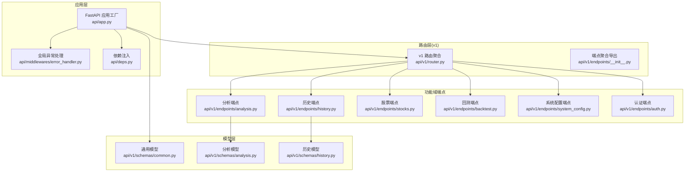
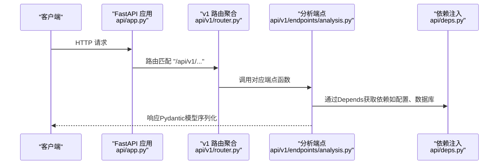
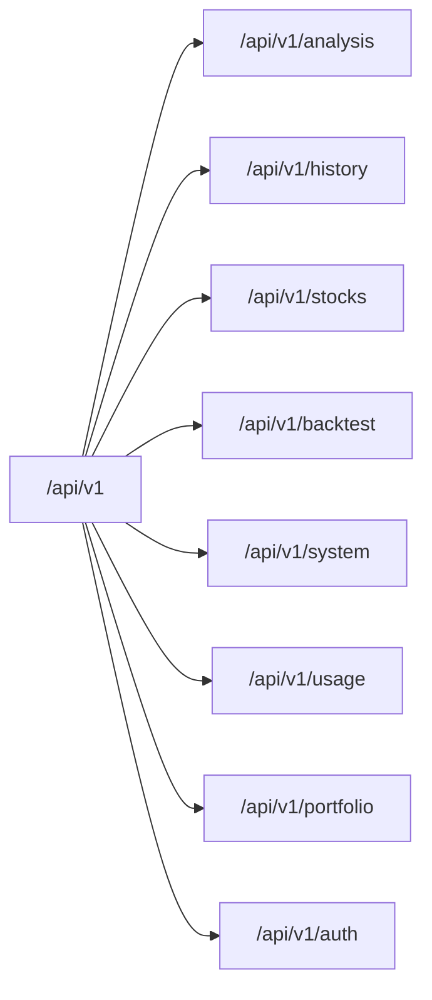
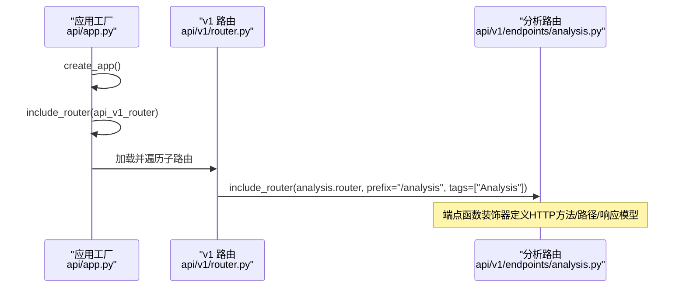
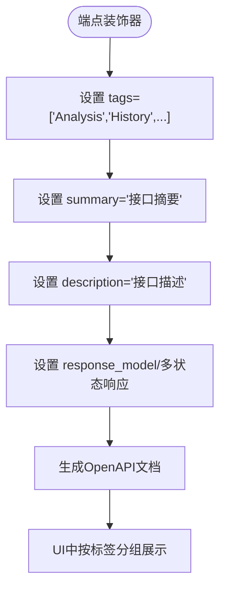
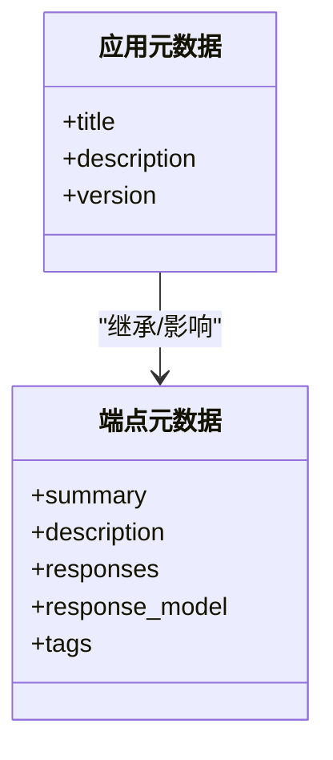
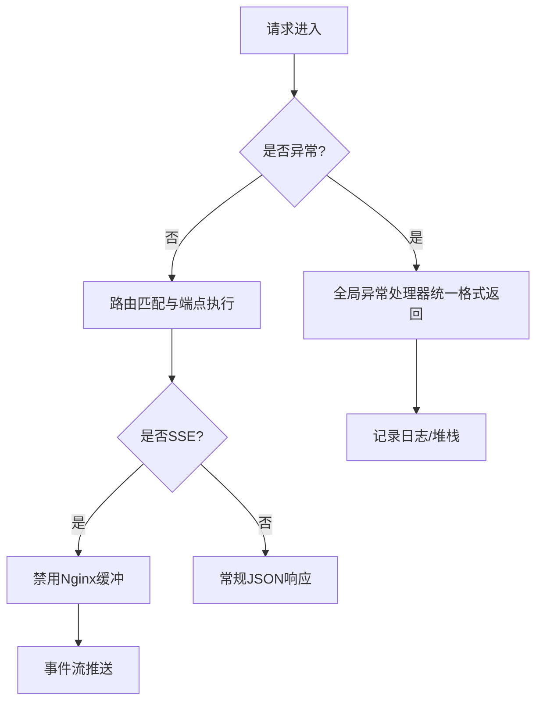
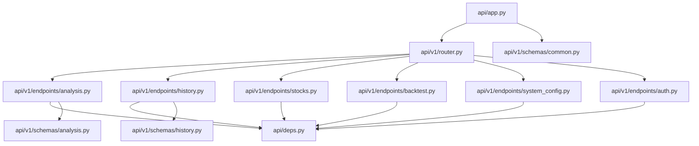

# API路由系统

<cite>
**本文档引用的文件**
- [api/app.py](file://api/app.py)
- [api/v1/router.py](file://api/v1/router.py)
- [api/v1/endpoints/__init__.py](file://api/v1/endpoints/__init__.py)
- [api/v1/endpoints/analysis.py](file://api/v1/endpoints/analysis.py)
- [api/v1/endpoints/history.py](file://api/v1/endpoints/history.py)
- [api/v1/endpoints/stocks.py](file://api/v1/endpoints/stocks.py)
- [api/v1/endpoints/backtest.py](file://api/v1/endpoints/backtest.py)
- [api/v1/endpoints/system_config.py](file://api/v1/endpoints/system_config.py)
- [api/v1/endpoints/auth.py](file://api/v1/endpoints/auth.py)
- [api/v1/schemas/common.py](file://api/v1/schemas/common.py)
- [api/v1/schemas/analysis.py](file://api/v1/schemas/analysis.py)
- [api/v1/schemas/history.py](file://api/v1/schemas/history.py)
- [api/deps.py](file://api/deps.py)
- [api/middlewares/error_handler.py](file://api/middlewares/error_handler.py)
</cite>

## 目录
1. [简介](#简介)
2. [项目结构](#项目结构)
3. [核心组件](#核心组件)
4. [架构总览](#架构总览)
5. [详细组件分析](#详细组件分析)
6. [依赖关系分析](#依赖关系分析)
7. [性能考虑](#性能考虑)
8. [故障排查指南](#故障排查指南)
9. [结论](#结论)

## 简介
本文件系统性梳理了该代码库中的API路由体系，重点覆盖以下方面：
- 版本化路由设计与v1命名空间组织
- 子路由器导入与挂载流程
- 路由标签系统与文档分组
- 路由元数据配置（描述、摘要、标签）
- 性能优化策略与最佳实践
- 调试技巧与常见问题解决

## 项目结构
API路由系统采用“版本化 + 功能域划分”的组织方式：
- 应用工厂负责创建FastAPI实例、配置CORS、注册路由与中间件、托管前端静态资源
- v1版本路由聚合器统一挂载各功能域子路由，并为每个子路由设置统一前缀与标签
- 各功能域端点模块（analysis、history、stocks、backtest、system_config、auth等）定义具体的HTTP接口
- 依赖注入模块提供数据库会话、配置与应用生命周期共享服务
- 通用与领域模型位于schemas目录，支撑接口的请求/响应校验与文档生成

**图表来源**
- [api/app.py:48-204](file://api/app.py#L48-L204)
- [api/v1/router.py:14-72](file://api/v1/router.py#L14-L72)
- [api/v1/endpoints/__init__.py:11-34](file://api/v1/endpoints/__init__.py#L11-L34)
- [api/middlewares/error_handler.py:70-129](file://api/middlewares/error_handler.py#L70-L129)
- [api/deps.py:23-72](file://api/deps.py#L23-L72)

**章节来源**
- [api/app.py:48-204](file://api/app.py#L48-L204)
- [api/v1/router.py:14-72](file://api/v1/router.py#L14-L72)
- [api/v1/endpoints/__init__.py:11-34](file://api/v1/endpoints/__init__.py#L11-L34)

## 核心组件
- 应用工厂与生命周期
  - 创建FastAPI实例，配置标题、描述、版本、生命周期钩子
  - 配置CORS中间件，支持动态来源与凭证控制
  - 注册v1路由与全局异常处理
  - 提供根路由与健康检查接口，支持SPA回退与静态资源托管
- v1路由聚合器
  - 以"/api/v1"为前缀创建主路由
  - 逐个include子路由，为每个子路由设置独立tags，实现文档分组
- 端点模块
  - 每个功能域模块定义独立APIRouter，承载具体HTTP接口
  - 使用Pydantic模型定义请求/响应，配合FastAPI自动生成OpenAPI文档
- 依赖注入
  - 提供数据库会话、配置、应用生命周期共享服务等依赖
- 异常处理
  - 统一HTTP异常、请求验证异常与通用异常的响应格式

**章节来源**
- [api/app.py:48-204](file://api/app.py#L48-L204)
- [api/v1/router.py:14-72](file://api/v1/router.py#L14-L72)
- [api/deps.py:23-72](file://api/deps.py#L23-L72)
- [api/middlewares/error_handler.py:70-129](file://api/middlewares/error_handler.py#L70-L129)

## 架构总览
下图展示了从应用工厂到各功能域端点的调用链路与数据流。

**图表来源**
- [api/app.py:114](file://api/app.py#L114)
- [api/v1/router.py:17](file://api/v1/router.py#L17)
- [api/v1/endpoints/analysis.py:65](file://api/v1/endpoints/analysis.py#L65)
- [api/deps.py:45-52](file://api/deps.py#L45-L52)

## 详细组件分析

### 版本化路由与命名空间管理
- v1路由聚合器以"/api/v1"为前缀，集中管理各功能域子路由
- 每个子路由通过prefix进一步细分命名空间，如"/analysis"、"/history"、"/stocks"等
- 通过tags为每个子路由分配功能标签，用于OpenAPI文档分组与导航

**图表来源**
- [api/v1/router.py:17-72](file://api/v1/router.py#L17-L72)

**章节来源**
- [api/v1/router.py:14-72](file://api/v1/router.py#L14-L72)

### 路由注册机制与子路由器挂载
- 应用工厂在创建FastAPI实例后，通过include_router将v1路由注册到根应用
- v1路由聚合器内部逐个include各功能域子路由，形成树状路由结构
- 子路由模块各自维护APIRouter，端点函数上使用装饰器声明HTTP方法、路径、响应模型与元数据

**图表来源**
- [api/app.py:114](file://api/app.py#L114)
- [api/v1/router.py:19-35](file://api/v1/router.py#L19-L35)
- [api/v1/endpoints/analysis.py:72-87](file://api/v1/endpoints/analysis.py#L72-L87)

**章节来源**
- [api/app.py:114](file://api/app.py#L114)
- [api/v1/router.py:19-35](file://api/v1/router.py#L19-L35)
- [api/v1/endpoints/analysis.py:72-87](file://api/v1/endpoints/analysis.py#L72-L87)

### 路由标签系统与文档生成
- 每个子路由通过tags参数为该域内的所有端点打上统一标签
- FastAPI基于端点装饰器的summary、description、response_model等元数据自动生成交互式文档
- 标签用于在Swagger/OpenAPI UI中进行功能分组，便于用户浏览与测试

**图表来源**
- [api/v1/router.py:19-71](file://api/v1/router.py#L19-L71)
- [api/v1/endpoints/analysis.py:85-87](file://api/v1/endpoints/analysis.py#L85-L87)
- [api/v1/endpoints/history.py:56-58](file://api/v1/endpoints/history.py#L56-L58)
- [api/v1/endpoints/stocks.py:55-57](file://api/v1/endpoints/stocks.py#L55-L57)

**章节来源**
- [api/v1/router.py:19-71](file://api/v1/router.py#L19-L71)
- [api/v1/endpoints/analysis.py:85-87](file://api/v1/endpoints/analysis.py#L85-L87)
- [api/v1/endpoints/history.py:56-58](file://api/v1/endpoints/history.py#L56-L58)
- [api/v1/endpoints/stocks.py:55-57](file://api/v1/endpoints/stocks.py#L55-L57)

### 路由元数据配置
- 应用工厂层面：title、description、version等作为OpenAPI顶层元数据
- 端点层面：summary、description、responses、response_model等用于细化接口元数据
- 健康检查端点：通过tags、summary、description明确其用途与分组

**图表来源**
- [api/app.py:63-76](file://api/app.py#L63-L76)
- [api/app.py:161-173](file://api/app.py#L161-L173)
- [api/v1/endpoints/analysis.py:85-87](file://api/v1/endpoints/analysis.py#L85-L87)

**章节来源**
- [api/app.py:63-76](file://api/app.py#L63-L76)
- [api/app.py:161-173](file://api/app.py#L161-L173)
- [api/v1/endpoints/analysis.py:85-87](file://api/v1/endpoints/analysis.py#L85-L87)

### 路由性能优化策略与最佳实践
- 异步与同步分离
  - 分析接口支持同步与异步两种模式，异步模式避免阻塞，提升吞吐
  - SSE实时推送用于任务状态变更，减少轮询开销
- 依赖注入与线程池
  - 通过Depends注入数据库会话与配置，避免在端点函数内手动管理
  - 非I/O密集逻辑尽量使用def而非async def，让FastAPI自动调度至线程池
- 缓存与去重
  - 异步任务队列对重复任务进行去重，避免重复计算
- 响应模型与序列化
  - 使用Pydantic模型自动序列化，减少手写JSON转换的性能损耗与错误
- CORS与静态资源
  - 生产环境谨慎放宽CORS来源，避免不必要的跨域开销
  - 前端静态资源按需挂载，SPA回退仅对非API路径生效

**章节来源**
- [api/v1/endpoints/analysis.py:146-158](file://api/v1/endpoints/analysis.py#L146-L158)
- [api/v1/endpoints/analysis.py:376-439](file://api/v1/endpoints/analysis.py#L376-L439)
- [api/v1/endpoints/stocks.py:268-297](file://api/v1/endpoints/stocks.py#L268-L297)
- [api/deps.py:23-42](file://api/deps.py#L23-L42)

### 调试技巧与常见问题
- 健康检查与根路由
  - 通过"/api/health"快速确认服务状态；根路由在前端未构建时返回引导页面
- 异常处理
  - 全局异常处理器统一返回格式，便于定位错误类型与堆栈
  - HTTP异常与验证异常分别处理，减少误报
- CORS与Cookie
  - 根据部署环境调整CORS来源与Secure Cookie属性，避免跨域与会话失效
- SSE与Nginx
  - SSE禁用缓冲头确保事件及时推送，避免反向代理缓存导致延迟

**图表来源**
- [api/middlewares/error_handler.py:113-129](file://api/middlewares/error_handler.py#L113-L129)
- [api/app.py:161-173](file://api/app.py#L161-L173)
- [api/v1/endpoints/analysis.py:431-439](file://api/v1/endpoints/analysis.py#L431-L439)

**章节来源**
- [api/app.py:161-173](file://api/app.py#L161-L173)
- [api/middlewares/error_handler.py:113-129](file://api/middlewares/error_handler.py#L113-L129)
- [api/v1/endpoints/analysis.py:431-439](file://api/v1/endpoints/analysis.py#L431-L439)

## 依赖关系分析
- 应用工厂依赖v1路由聚合器与中间件模块
- v1路由聚合器依赖各功能域端点模块
- 端点模块依赖依赖注入模块与领域模型
- 通用模型服务于各功能域响应结构

**图表来源**
- [api/app.py:30-32](file://api/app.py#L30-L32)
- [api/v1/router.py:14](file://api/v1/router.py#L14)
- [api/deps.py:18-21](file://api/deps.py#L18-L21)

**章节来源**
- [api/app.py:30-32](file://api/app.py#L30-L32)
- [api/v1/router.py:14](file://api/v1/router.py#L14)
- [api/deps.py:18-21](file://api/deps.py#L18-L21)

## 性能考虑
- I/O与CPU分离：将耗时的分析与回测逻辑置于线程池或异步队列，避免阻塞事件循环
- 响应模型校验：利用Pydantic在序列化阶段完成字段校验，减少重复校验成本
- 文档与Schema：通过明确的响应模型与状态码映射，降低客户端解析复杂度
- 缓存与幂等：对重复任务与重复请求进行去重与幂等处理，避免无效计算

## 故障排查指南
- 404未找到
  - 检查路由前缀与路径拼接是否正确
  - 确认端点函数装饰器的HTTP方法与路径一致
- 500服务器错误
  - 查看全局异常处理器日志，定位具体异常类型与堆栈
  - 关注端点函数内部的外部服务调用与数据库操作
- CORS跨域问题
  - 校验CORS_ORIGINS环境变量与CORS_ALLOW_ALL开关
  - 确认Cookie的Secure与SameSite属性与协议匹配
- SSE推送延迟
  - 确认禁用Nginx缓冲头
  - 检查任务队列订阅与事件生成逻辑

**章节来源**
- [api/middlewares/error_handler.py:113-129](file://api/middlewares/error_handler.py#L113-L129)
- [api/app.py:82-106](file://api/app.py#L82-L106)
- [api/v1/endpoints/analysis.py:431-439](file://api/v1/endpoints/analysis.py#L431-L439)

## 结论
该API路由系统通过版本化与功能域划分实现了清晰的路由组织与文档分组，结合依赖注入与统一异常处理，提供了良好的可维护性与可观测性。建议在生产环境中严格控制CORS来源、合理使用异步与线程池、完善日志与监控，以获得更稳定的性能与用户体验。