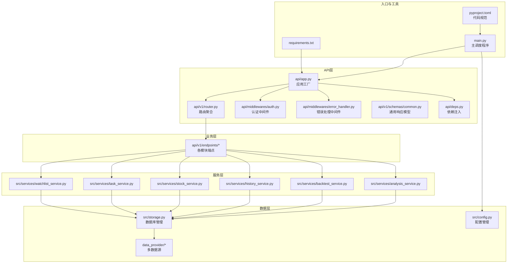
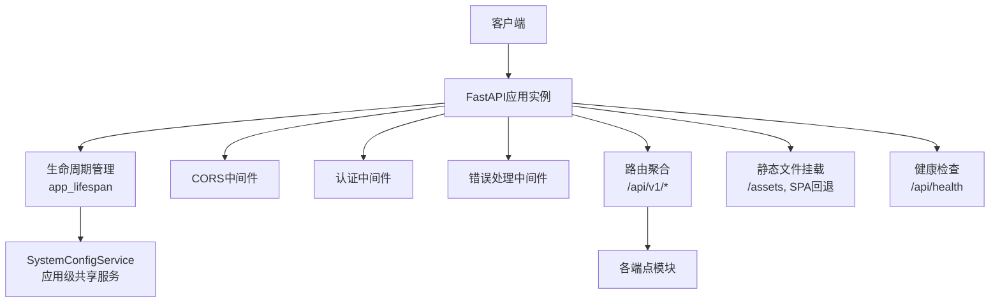
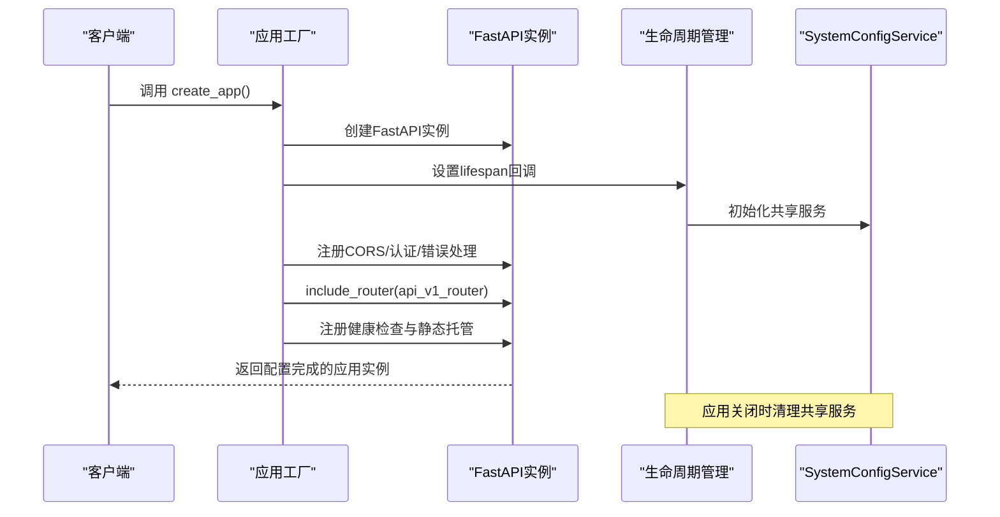
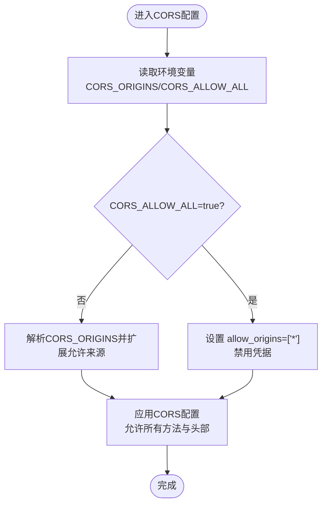
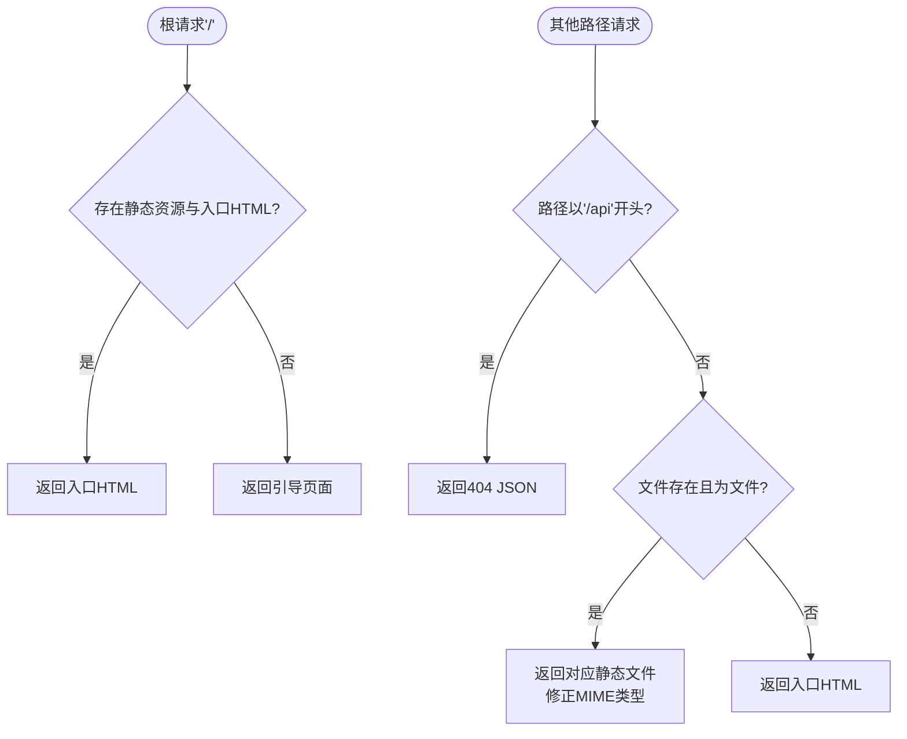
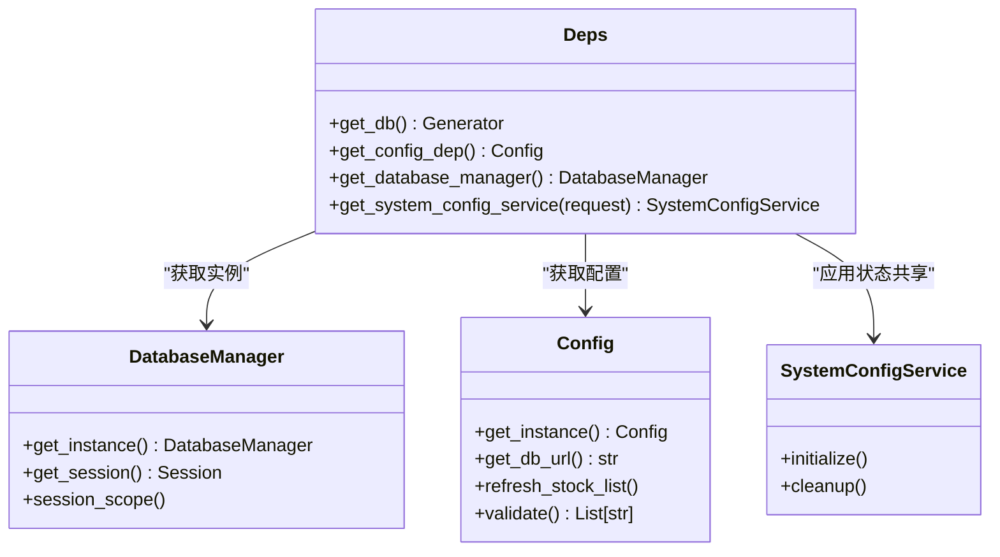
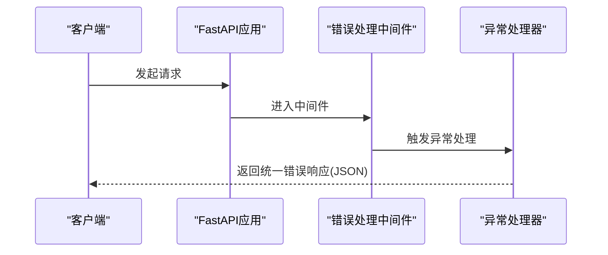
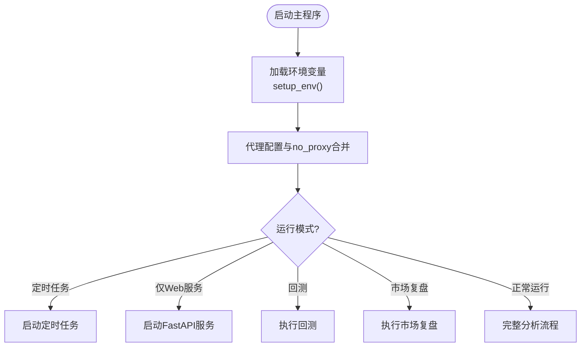

# FastAPI应用架构

<cite>
**本文档引用的文件**
- [api/app.py](file://api/app.py)
- [api/deps.py](file://api/deps.py)
- [api/middlewares/error_handler.py](file://api/middlewares/error_handler.py)
- [api/middlewares/auth.py](file://api/middlewares/auth.py)
- [api/v1/router.py](file://api/v1/router.py)
- [api/v1/schemas/common.py](file://api/v1/schemas/common.py)
- [src/config.py](file://src/config.py)
- [src/storage.py](file://src/storage.py)
- [main.py](file://main.py)
- [requirements.txt](file://requirements.txt)
- [pyproject.toml](file://pyproject.toml)
</cite>

## 目录
1. [简介](#简介)
2. [项目结构](#项目结构)
3. [核心组件](#核心组件)
4. [架构总览](#架构总览)
5. [详细组件分析](#详细组件分析)
6. [依赖关系分析](#依赖关系分析)
7. [性能考虑](#性能考虑)
8. [故障排查指南](#故障排查指南)
9. [结论](#结论)
10. [附录](#附录)

## 简介
本文件面向FastAPI应用架构，围绕应用工厂模式、CORS中间件配置、静态文件托管（含SPA路由回退）、依赖注入系统、应用启动配置与环境变量处理、以及错误处理机制进行深入技术说明，并提供配置示例与最佳实践建议。目标读者既包括需要快速上手的开发者，也包括希望深入理解系统设计的架构师。

## 项目结构
该项目采用模块化分层组织，核心模块包括：
- API层：应用工厂、路由聚合、中间件、通用Schema
- 业务层：分析、回测、历史、股票、系统配置等端点
- 服务层：分析服务、回测服务、任务队列、任务服务、Watchlist服务
- 数据层：数据提供者（多源策略）、存储（SQLite + SQLAlchemy）
- 配置与工具：配置管理、日志、调度、通知、WebUI集成

**图表来源**
- [api/app.py:1-209](file://api/app.py#L1-L209)
- [api/v1/router.py:1-72](file://api/v1/router.py#L1-L72)
- [api/middlewares/auth.py:1-75](file://api/middlewares/auth.py#L1-L75)
- [api/middlewares/error_handler.py:1-129](file://api/middlewares/error_handler.py#L1-L129)
- [api/deps.py:1-72](file://api/deps.py#L1-L72)
- [src/storage.py:1-2000](file://src/storage.py#L1-L2000)
- [src/config.py:1-580](file://src/config.py#L1-L580)
- [main.py:1-723](file://main.py#L1-L723)
- [requirements.txt:1-65](file://requirements.txt#L1-L65)
- [pyproject.toml:1-29](file://pyproject.toml#L1-L29)

**章节来源**
- [api/app.py:1-209](file://api/app.py#L1-L209)
- [api/v1/router.py:1-72](file://api/v1/router.py#L1-L72)
- [main.py:1-723](file://main.py#L1-L723)

## 核心组件
本节聚焦应用工厂模式、CORS中间件、静态文件托管、依赖注入、错误处理与启动配置。

- 应用工厂模式
  - 通过工厂函数创建并配置FastAPI实例，集中管理生命周期、中间件、路由与静态资源。
  - 支持可选的静态目录参数，便于在不同部署场景下挂载前端产物。
  - 使用异步生命周期管理共享服务（如系统配置服务），确保资源正确初始化与释放。

- CORS中间件配置
  - 默认允许本地开发常用来源（localhost与127.0.0.1的5173与3000端口）。
  - 支持通过环境变量动态扩展允许来源列表。
  - 支持通过环境变量开启“允许所有来源”的开发/演示模式，但会禁用凭据。
  - 允许所有方法与头部，便于开发阶段调试。

- 静态文件托管与SPA路由回退
  - 当检测到静态资源目录存在且包含入口HTML时，根路由返回前端页面。
  - 若未构建前端，返回引导页面，指导用户先构建前端或仅使用API文档。
  - 挂载静态资源目录（如assets），并实现SPA回退：非API路径优先返回对应静态文件，否则返回入口HTML；对/api前缀明确返回404 JSON响应。

- 依赖注入系统
  - 全局依赖：数据库Session、配置对象、数据库管理器、应用生命周期共享的系统配置服务。
  - 请求级依赖：通过请求对象访问应用状态中的共享服务实例。
  - 依赖提供器均遵循“请求结束自动清理”的原则，避免资源泄漏。

- 错误处理机制
  - 全局异常处理中间件捕获未处理异常，统一返回JSON格式错误响应。
  - FastAPI内置异常处理器：HTTP异常与请求验证异常分别包装为统一错误模型。
  - 通用异常处理器记录堆栈信息，返回标准化内部错误响应。

- 应用启动配置与环境变量
  - 配置管理模块采用单例模式，从.env文件与系统环境变量加载配置，支持默认值与类型转换。
  - 支持代理配置与国内数据源免代理白名单自动合并，避免因代理导致的行情获取失败。
  - 主程序支持多种运行模式（定时任务、仅Web服务、回测、市场复盘等），并通过命令行参数与环境变量灵活切换。

**章节来源**
- [api/app.py:48-204](file://api/app.py#L48-L204)
- [api/deps.py:23-72](file://api/deps.py#L23-L72)
- [api/middlewares/error_handler.py:70-129](file://api/middlewares/error_handler.py#L70-L129)
- [src/config.py:20-580](file://src/config.py#L20-L580)
- [main.py:510-723](file://main.py#L510-L723)

## 架构总览
下图展示应用工厂如何协调中间件、路由、静态资源与生命周期服务，形成完整的API服务架构。

**图表来源**
- [api/app.py:37-204](file://api/app.py#L37-L204)
- [api/middlewares/auth.py:36-75](file://api/middlewares/auth.py#L36-L75)
- [api/middlewares/error_handler.py:24-68](file://api/middlewares/error_handler.py#L24-L68)
- [api/v1/router.py:16-72](file://api/v1/router.py#L16-L72)

## 详细组件分析

### 应用工厂与生命周期管理
- 工厂函数负责：
  - 创建FastAPI实例并设置标题、描述、版本与生命周期回调。
  - 配置CORS策略（允许来源、凭据、方法与头部）。
  - 注册认证中间件与错误处理。
  - 聚合v1路由并注册全局异常处理器。
  - 根据静态资源存在性决定根路由行为与SPA回退策略。
  - 挂载静态资源目录并实现SPA回退逻辑。
  - 提供健康检查端点。
- 生命周期管理：
  - 在应用启动时创建系统配置服务实例并注入到应用状态。
  - 在应用关闭时清理该实例，避免内存泄漏。

**图表来源**
- [api/app.py:37-204](file://api/app.py#L37-L204)

**章节来源**
- [api/app.py:37-204](file://api/app.py#L37-L204)

### CORS中间件配置策略
- 默认允许来源：
  - 本地开发常用来源（localhost与127.0.0.1的5173与3000端口）。
- 环境变量扩展：
  - 通过环境变量添加额外来源，多个来源以逗号分隔。
- 允许所有来源：
  - 开发/演示场景可通过环境变量开启，此时允许所有来源并禁用凭据。
- 安全考虑：
  - 生产环境建议明确列出可信来源，避免使用“允许所有来源”。
  - 凭据与预检请求需谨慎配置，避免跨域凭证带来的安全风险。

**图表来源**
- [api/app.py:82-106](file://api/app.py#L82-L106)

**章节来源**
- [api/app.py:82-106](file://api/app.py#L82-L106)

### 静态文件托管与SPA路由回退
- 根路由行为：
  - 若存在静态资源目录与入口HTML：根路由返回该HTML。
  - 否则返回引导页面，提示先构建前端或仅使用API文档。
- 静态资源挂载：
  - 挂载assets目录作为静态资源。
- SPA回退策略：
  - 对/api前缀明确返回404 JSON响应。
  - 其他路径优先返回对应静态文件，若不存在则返回入口HTML。
  - 修正JS模块MIME类型以避免浏览器拒绝。

**图表来源**
- [api/app.py:121-203](file://api/app.py#L121-L203)

**章节来源**
- [api/app.py:121-203](file://api/app.py#L121-L203)

### 依赖注入系统
- 全局依赖：
  - 数据库Session：通过数据库管理器获取，请求结束后自动关闭。
  - 配置对象：通过配置管理模块获取单例配置。
  - 数据库管理器：单例，提供Session工厂与表创建。
  - 系统配置服务：通过应用生命周期注入，按需获取。
- 请求级依赖：
  - 通过请求对象访问应用状态中的共享服务实例，若不存在则创建并注入。
- 依赖提供器均遵循“生成器模式 + finally关闭”的原则，确保资源释放。

**图表来源**
- [api/deps.py:23-72](file://api/deps.py#L23-L72)
- [src/storage.py:623-746](file://src/storage.py#L623-L746)
- [src/config.py:232-580](file://src/config.py#L232-L580)

**章节来源**
- [api/deps.py:23-72](file://api/deps.py#L23-L72)
- [src/storage.py:623-746](file://src/storage.py#L623-L746)
- [src/config.py:232-580](file://src/config.py#L232-L580)

### 错误处理机制
- 全局异常处理中间件：
  - 捕获未处理异常，记录错误日志与堆栈，返回统一JSON错误响应。
- FastAPI内置异常处理器：
  - HTTP异常：将detail包装为统一错误模型。
  - 请求验证异常：返回422与统一错误模型。
  - 通用异常：记录堆栈并返回500内部错误。
- 建议：
  - 在开发阶段开启详细日志以便定位问题。
  - 在生产环境避免泄露具体堆栈细节，仅记录必要信息。

**图表来源**
- [api/middlewares/error_handler.py:24-129](file://api/middlewares/error_handler.py#L24-L129)

**章节来源**
- [api/middlewares/error_handler.py:24-129](file://api/middlewares/error_handler.py#L24-L129)

### 应用启动配置与环境变量处理
- 环境变量初始化：
  - 从指定.env文件或默认路径加载，支持通过环境变量覆盖路径。
- 配置加载与代理：
  - 自动设置国内数据源免代理白名单，避免代理导致的请求失败。
  - 支持HTTP/HTTPS代理配置，自动合并现有no_proxy列表。
- 主程序模式：
  - 支持定时任务、仅Web服务、回测、市场复盘等多种模式。
  - 通过命令行参数与环境变量控制主机、端口、日志级别等。
- 配置验证：
  - 提供验证函数，输出缺失或无效配置项的警告。

**图表来源**
- [src/config.py:20-437](file://src/config.py#L20-L437)
- [main.py:510-723](file://main.py#L510-L723)

**章节来源**
- [src/config.py:20-437](file://src/config.py#L20-L437)
- [main.py:510-723](file://main.py#L510-L723)

## 依赖关系分析
- 核心依赖：
  - FastAPI与Uvicorn：Web框架与ASGI服务器。
  - SQLAlchemy：ORM与数据库连接管理。
  - python-dotenv：环境变量加载。
  - tenacity：指数退避重试。
  - schedule：定时任务。
  - exchange-calendars：交易日历。
- 数据源与第三方：
  - 多数据源策略（efinance、akshare、tushare、pytdx、baostock、yfinance）。
  - AI分析（litellm、openai、tiktoken）。
  - 通知渠道（飞书、企业微信、Telegram、Discord、Pushover、PushPlus、Server酱等）。
- 代码质量工具：
  - black、isort、bandit：代码风格与安全扫描。

```mermaid
graph TB
FASTAPI["FastAPI"] --> UVICORN["Uvicorn"]
FASTAPI --> SQLA["SQLAlchemy"]
MAIN["main.py"] --> DOTENV["python-dotenv"]
MAIN --> TENACITY["tenacity"]
MAIN --> SCHEDULE["schedule"]
MAIN --> EXCAL["exchange-calendars"]
DATA["data_provider/*"] --> EFIN["efinance"]
DATA --> AK["akshare"]
DATA --> TS["tushare"]
DATA --> PT["pytdx"]
DATA --> BS["baostock"]
DATA --> YF["yfinance"]
AI["AI分析"] --> LITELLM["litellm"]
AI --> OPENAI["openai"]
NOTIFY["通知"] --> FEISHU["飞书"]
NOTIFY --> WECHAT["企业微信"]
NOTIFY --> TG["Telegram"]
NOTIFY --> DISCORD["Discord"]
NOTIFY --> PUSH["Pushover/PushPlus/Server酱"]
```

**图表来源**
- [requirements.txt:1-65](file://requirements.txt#L1-L65)
- [main.py:1-723](file://main.py#L1-L723)

**章节来源**
- [requirements.txt:1-65](file://requirements.txt#L1-L65)
- [main.py:1-723](file://main.py#L1-L723)

## 性能考虑
- 并发与防封禁：
  - 默认低并发（最大工作线程数），避免第三方API限流与封禁。
  - 个股分析与大盘复盘之间可配置延迟，减少请求频率。
- 数据库连接：
  - 使用连接池与pre_ping，确保连接健康检查。
  - Session按请求作用域管理，避免长时间持有连接。
- 代理与网络：
  - 自动合并no_proxy列表，避免国内数据源走代理导致超时。
  - 支持HTTP/HTTPS代理，按需启用。
- 静态资源：
  - 明确MIME类型，避免浏览器拒绝JS模块。
  - SPA回退仅在静态文件不存在时返回入口HTML，减少不必要的I/O。

[本节为通用性能建议，不涉及具体文件分析]

## 故障排查指南
- CORS相关问题：
  - 确认CORS_ORIGINS环境变量是否包含当前前端域名与端口。
  - 生产环境避免使用CORS_ALLOW_ALL，建议明确列出来源。
- 静态资源未显示：
  - 确认静态目录存在且包含入口HTML。
  - 若未构建前端，根路由将返回引导页面而非404。
- 认证失败：
  - 确认认证中间件已启用且会话有效。
  - 检查认证Cookie是否存在且通过会话校验。
- 数据库连接问题：
  - 检查数据库路径与权限，确认数据库文件可写。
  - 查看连接池配置与日志，确认无连接泄漏。
- 代理导致的网络问题：
  - 检查HTTP_PROXY/HTTPS_PROXY与no_proxy配置。
  - 确认国内数据源已加入no_proxy白名单。

**章节来源**
- [api/app.py:82-106](file://api/app.py#L82-L106)
- [api/app.py:121-203](file://api/app.py#L121-L203)
- [api/middlewares/auth.py:36-75](file://api/middlewares/auth.py#L36-L75)
- [src/storage.py:623-746](file://src/storage.py#L623-L746)
- [src/config.py:260-299](file://src/config.py#L260-L299)

## 结论
本FastAPI应用通过应用工厂模式实现了清晰的初始化与配置流程，结合CORS中间件、静态文件托管与SPA回退策略，提供了良好的前后端一体化体验。依赖注入系统确保了资源的正确管理与生命周期控制，错误处理机制保障了服务稳定性。配合完善的环境变量与配置管理，系统在开发与生产环境中均具备良好的可维护性与可扩展性。

## 附录

### 配置示例与最佳实践
- CORS配置
  - 开发环境：允许本地来源与凭据，便于调试。
  - 生产环境：明确列出可信来源，禁用凭据或仅允许特定来源。
  - 参考路径：[api/app.py:82-106](file://api/app.py#L82-L106)
- 静态文件与SPA
  - 前端构建产物放置于静态目录，根路由返回入口HTML。
  - SPA回退仅对非/api路径生效，确保API路由不被干扰。
  - 参考路径：[api/app.py:121-203](file://api/app.py#L121-L203)
- 依赖注入
  - 使用全局依赖提供数据库Session与配置对象。
  - 请求级依赖通过请求对象访问应用状态中的共享服务。
  - 参考路径：[api/deps.py:23-72](file://api/deps.py#L23-L72)
- 错误处理
  - 统一错误响应模型，记录堆栈信息，避免泄露敏感细节。
  - 参考路径：[api/middlewares/error_handler.py:70-129](file://api/middlewares/error_handler.py#L70-L129)
- 启动与运行模式
  - 通过命令行参数与环境变量控制运行模式与端口。
  - 参考路径：[main.py:510-723](file://main.py#L510-L723)
- 配置管理
  - 单例配置，支持默认值与类型转换，自动处理代理与no_proxy。
  - 参考路径：[src/config.py:20-437](file://src/config.py#L20-L437)