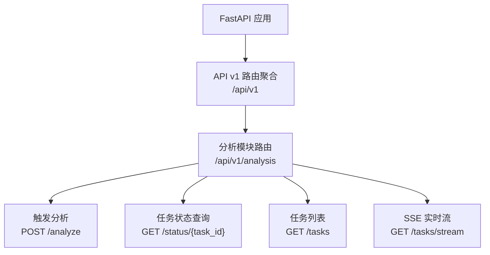
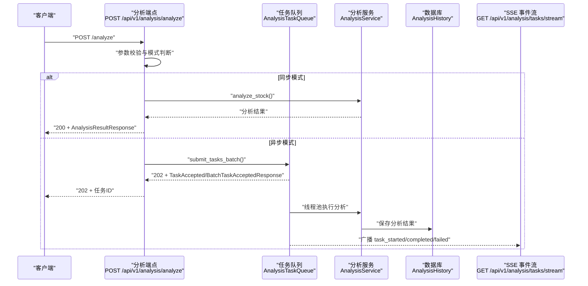
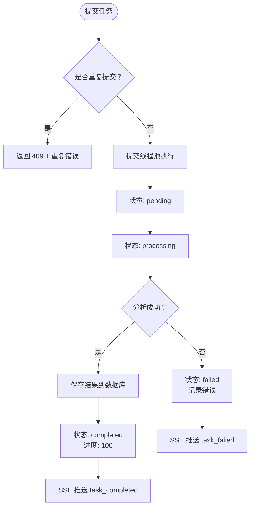
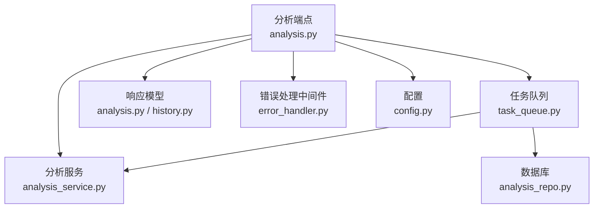

# 分析接口

<cite>
**本文档引用的文件**
- [analysis.py](file://api/v1/endpoints/analysis.py)
- [analysis.py](file://api/v1/schemas/analysis.py)
- [history.py](file://api/v1/schemas/history.py)
- [analysis_service.py](file://src/services/analysis_service.py)
- [analysis_repo.py](file://src/repositories/analysis_repo.py)
- [task_queue.py](file://src/services/task_queue.py)
- [error_handler.py](file://api/middlewares/error_handler.py)
- [router.py](file://api/v1/router.py)
- [config.py](file://src/config.py)
</cite>

## 目录
1. [简介](#简介)
2. [项目结构](#项目结构)
3. [核心组件](#核心组件)
4. [架构总览](#架构总览)
5. [详细组件分析](#详细组件分析)
6. [依赖关系分析](#依赖关系分析)
7. [性能考量](#性能考量)
8. [故障排查指南](#故障排查指南)
9. [结论](#结论)
10. [附录](#附录)

## 简介
本文件为“分析接口”的完整API文档，覆盖以下内容：
- 触发分析接口的HTTP方法、URL模式与请求参数格式
- 分析请求的schema定义（股票代码、分析类型、时间范围、异步模式等）
- 响应数据结构（分析结果、技术指标、AI评分、报告详情）
- 成功与失败场景的请求/响应示例
- 异步分析流程（任务队列、状态查询、SSE实时推送）
- 错误处理机制、状态码说明与异常情况处理
- API限流策略与性能考虑因素

## 项目结构
分析接口位于FastAPI路由体系中，采用版本化路由前缀，核心入口为分析模块的路由聚合器。

图表来源
- [router.py:17-35](file://api/v1/router.py#L17-L35)

章节来源
- [router.py:17-35](file://api/v1/router.py#L17-L35)

## 核心组件
- 触发分析端点：接收分析请求，支持同步与异步模式；异步模式下禁止重复提交同一只股票。
- 任务队列：负责异步任务的提交、执行、状态广播与持久化。
- 分析服务：封装AI分析流程，产出标准化报告结构。
- 响应模型：统一定义请求、响应、任务状态与报告结构的schema。
- 错误处理中间件：统一捕获异常并返回一致的错误响应格式。

章节来源
- [analysis.py:72-158](file://api/v1/endpoints/analysis.py#L72-L158)
- [task_queue.py:108-158](file://src/services/task_queue.py#L108-L158)
- [analysis_service.py:29-105](file://src/services/analysis_service.py#L29-L105)
- [analysis.py:27-62](file://api/v1/schemas/analysis.py#L27-L62)
- [error_handler.py:24-67](file://api/middlewares/error_handler.py#L24-L67)

## 架构总览
分析接口的调用链路如下：

图表来源
- [analysis.py:88-158](file://api/v1/endpoints/analysis.py#L88-L158)
- [task_queue.py:296-361](file://src/services/task_queue.py#L296-L361)
- [analysis_service.py:40-105](file://src/services/analysis_service.py#L40-L105)
- [analysis.py:384-439](file://api/v1/endpoints/analysis.py#L384-L439)

## 详细组件分析

### 触发分析接口（POST /api/v1/analysis/analyze）
- 方法与URL：POST /api/v1/analysis/analyze
- 功能：启动AI智能分析任务，支持同步与异步模式
- 请求参数（AnalyzeRequest）：
  - stock_code: 单只股票代码（可选）
  - stock_codes: 多只股票代码（可选，与stock_code二选一）
  - report_type: 报告类型（simple/detailed/full/brief）
  - force_refresh: 是否强制刷新（忽略缓存）
  - async_mode: 是否异步模式
- 响应：
  - 同步模式：200 + AnalysisResultResponse
  - 异步模式：202 + TaskAccepted 或 BatchTaskAcceptedResponse
  - 参数错误：400 + ErrorResponse
  - 重复提交：409 + DuplicateTaskErrorResponse
  - 其他错误：500 + ErrorResponse

请求示例（同步）
- 请求体
  - stock_code: "600519"
  - report_type: "detailed"
  - force_refresh: false
  - async_mode: false

响应示例（同步）
- 响应体
  - query_id: "abc123def456"
  - stock_code: "600519"
  - stock_name: "贵州茅台"
  - report.summary.sentiment_score: 75
  - report.summary.operation_advice: "持有"
  - created_at: "2024-01-01T12:00:00"

请求示例（异步）
- 请求体
  - stock_code: "600519"
  - report_type: "detailed"
  - force_refresh: true
  - async_mode: true

响应示例（异步）
- 成功（单只股票）
  - 202 + TaskAccepted
    - task_id: "task_abc123"
    - status: "pending"
    - message: "Analysis task accepted"
- 成功（批量）
  - 202 + BatchTaskAcceptedResponse
    - accepted: [{task_id, stock_code, status}]
    - duplicates: [{stock_code, existing_task_id, message}]
    - message: "已提交 X 个任务，Y 个重复跳过"

错误示例
- 参数缺失
  - 400 + {"error": "validation_error", "message": "..."}
- 重复提交
  - 409 + {"error": "duplicate_task", "message": "...", "stock_code": "...", "existing_task_id": "..."}

章节来源
- [analysis.py:72-158](file://api/v1/endpoints/analysis.py#L72-L158)
- [analysis.py:27-62](file://api/v1/schemas/analysis.py#L27-L62)
- [analysis.py:65-88](file://api/v1/schemas/analysis.py#L65-L88)
- [analysis.py:91-110](file://api/v1/schemas/analysis.py#L91-L110)
- [analysis.py:152-180](file://api/v1/schemas/analysis.py#L152-L180)
- [analysis.py:274-291](file://api/v1/schemas/analysis.py#L274-L291)

### 任务状态查询接口（GET /api/v1/analysis/status/{task_id}）
- 方法与URL：GET /api/v1/analysis/status/{task_id}
- 功能：根据task_id查询单个任务状态
- 响应：
  - 进行中：TaskStatus（result为空）
  - 已完成：TaskStatus（result为AnalysisResultResponse）
  - 不存在：404 + ErrorResponse

响应示例（进行中）
- 200 + TaskStatus
  - task_id: "task_abc123"
  - status: "processing"
  - progress: 50
  - result: null

响应示例（已完成）
- 200 + TaskStatus
  - task_id: "abc123def456"
  - status: "completed"
  - progress: 100
  - result.query_id: "abc123def456"
  - result.report.summary.sentiment_score: 75

章节来源
- [analysis.py:460-570](file://api/v1/endpoints/analysis.py#L460-L570)
- [analysis.py:182-204](file://api/v1/schemas/analysis.py#L182-L204)
- [analysis.py:65-88](file://api/v1/schemas/analysis.py#L65-L88)

### 任务列表接口（GET /api/v1/analysis/tasks）
- 方法与URL：GET /api/v1/analysis/tasks
- 查询参数：
  - status: 状态筛选（pending, processing, completed, failed，支持逗号分隔）
  - limit: 返回数量限制（1-100）
- 响应：TaskListResponse（统计与任务列表）

章节来源
- [analysis.py:307-369](file://api/v1/endpoints/analysis.py#L307-L369)
- [analysis.py:255-271](file://api/v1/schemas/analysis.py#L255-L271)

### SSE 实时推送接口（GET /api/v1/analysis/tasks/stream）
- 方法与URL：GET /api/v1/analysis/tasks/stream
- 功能：通过Server-Sent Events实时推送任务状态变化
- 事件类型：
  - connected：连接成功
  - task_created：新任务创建
  - task_started：任务开始执行
  - task_completed：任务完成
  - task_failed：任务失败
  - heartbeat：心跳（每30秒）
- 响应：text/event-stream

章节来源
- [analysis.py:376-439](file://api/v1/endpoints/analysis.py#L376-L439)

### 分析结果数据结构
- AnalysisResultResponse
  - query_id: 分析记录唯一标识
  - stock_code: 股票代码
  - stock_name: 股票名称
  - report: AnalysisReport（见下）
  - created_at: 创建时间
- AnalysisReport
  - meta: ReportMeta
  - summary: ReportSummary
  - strategy: ReportStrategy（可选）
  - details: ReportDetails（可选）

章节来源
- [analysis.py:65-88](file://api/v1/schemas/analysis.py#L65-L88)
- [history.py:112-197](file://api/v1/schemas/history.py#L112-L197)

### 报告字段说明
- ReportMeta
  - query_id, stock_code, stock_name, report_type, report_language, created_at, current_price, change_pct, model_used
- ReportSummary
  - analysis_summary, operation_advice, trend_prediction, sentiment_score, sentiment_label
- ReportStrategy
  - ideal_buy, secondary_buy, stop_loss, take_profit
- ReportDetails
  - news_content, raw_result, context_snapshot, financial_report, dividend_metrics

章节来源
- [history.py:112-197](file://api/v1/schemas/history.py#L112-L197)

### 同步分析流程
- 校验请求参数（单只股票 + 同步模式）
- 直接调用AnalysisService.analyze_stock()
- 构建AnalysisReport并返回AnalysisResultResponse

章节来源
- [analysis.py:235-301](file://api/v1/endpoints/analysis.py#L235-L301)
- [analysis_service.py:40-105](file://src/services/analysis_service.py#L40-L105)

### 异步分析流程
- 校验请求参数（支持批量）
- AnalysisTaskQueue.submit_tasks_batch()
  - 防重复提交：若某股票正在分析中，返回重复错误
  - 提交线程池任务，状态初始为pending
- 线程池执行AnalysisService.analyze_stock()
  - 成功：状态转为completed，进度100，保存至数据库
  - 失败：状态转为failed，记录错误信息
- SSE广播：task_created → task_started → task_completed/failed
- 任务完成后可通过status接口查询已完成结果

图表来源
- [analysis.py:161-232](file://api/v1/endpoints/analysis.py#L161-L232)
- [task_queue.py:296-361](file://src/services/task_queue.py#L296-L361)
- [task_queue.py:440-532](file://src/services/task_queue.py#L440-L532)

## 依赖关系分析

图表来源
- [analysis.py:25-61](file://api/v1/endpoints/analysis.py#L25-L61)
- [task_queue.py:108-158](file://src/services/task_queue.py#L108-L158)
- [analysis_service.py:29-39](file://src/services/analysis_service.py#L29-L39)
- [analysis_repo.py:21-36](file://src/repositories/analysis_repo.py#L21-L36)
- [error_handler.py:24-67](file://api/middlewares/error_handler.py#L24-L67)
- [config.py:32-437](file://src/config.py#L32-L437)

章节来源
- [analysis.py:25-61](file://api/v1/endpoints/analysis.py#L25-L61)
- [task_queue.py:108-158](file://src/services/task_queue.py#L108-L158)
- [analysis_service.py:29-39](file://src/services/analysis_service.py#L29-L39)
- [analysis_repo.py:21-36](file://src/repositories/analysis_repo.py#L21-L36)
- [error_handler.py:24-67](file://api/middlewares/error_handler.py#L24-L67)
- [config.py:32-437](file://src/config.py#L32-L437)

## 性能考量
- 并发与限流
  - 任务队列最大并发数由配置决定（默认3），可通过环境变量调整
  - 线程池在空闲时懒加载，避免不必要的资源占用
- 数据源限流
  - 部分外部数据源（如Tushare）具备每分钟调用限制，系统内置速率限制与等待机制
- 响应优化
  - 同步模式适合单只股票快速返回
  - 异步模式适合批量分析，避免阻塞请求
- 存储与清理
  - 任务完成后会清理过期任务，避免内存膨胀

章节来源
- [config.py:152-154](file://src/config.py#L152-L154)
- [task_queue.py:131-158](file://src/services/task_queue.py#L131-L158)
- [task_queue.py:534-566](file://src/services/task_queue.py#L534-L566)
- [tushare_fetcher.py:213-253](file://data_provider/tushare_fetcher.py#L213-L253)

## 故障排查指南
- 常见错误与处理
  - 400 参数错误：检查请求体字段是否符合schema要求
  - 409 重复提交：同一股票正在分析中，等待结束后再提交
  - 404 任务不存在：task_id无效或已过期
  - 500 内部错误：查看服务端日志，确认AI模型、数据源与网络配置
- 错误响应格式
  - 统一为包含error、message、detail的JSON对象
- 建议排查步骤
  - 确认async_mode与stock_codes/stock_code组合是否正确
  - 检查SSE连接是否正常，观察heartbeat事件
  - 查看任务列表与状态接口，确认任务生命周期

章节来源
- [analysis.py:122-154](file://api/v1/endpoints/analysis.py#L122-L154)
- [analysis.py:460-570](file://api/v1/endpoints/analysis.py#L460-L570)
- [error_handler.py:82-128](file://api/middlewares/error_handler.py#L82-L128)

## 结论
分析接口提供了灵活的同步与异步分析能力，配合任务队列与SSE推送，能够满足从单次快速分析到批量异步分析的多种场景。通过统一的schema与错误处理机制，保证了接口的一致性与可维护性。在生产环境中，建议合理配置并发与外部数据源限流策略，并结合SSE进行实时状态跟踪。

## 附录

### API定义与状态码
- POST /api/v1/analysis/analyze
  - 200：同步分析完成
  - 202：异步任务已接受
  - 400：请求参数错误
  - 409：重复提交（同一只股票正在分析中）
  - 500：分析失败
- GET /api/v1/analysis/status/{task_id}
  - 200：任务状态
  - 404：任务不存在
- GET /api/v1/analysis/tasks
  - 200：任务列表
- GET /api/v1/analysis/tasks/stream
  - 200：SSE事件流

章节来源
- [analysis.py:75-84](file://api/v1/endpoints/analysis.py#L75-L84)
- [analysis.py:463-466](file://api/v1/endpoints/analysis.py#L463-L466)