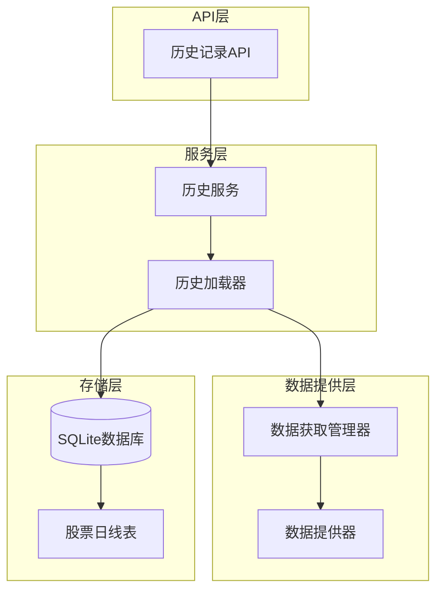
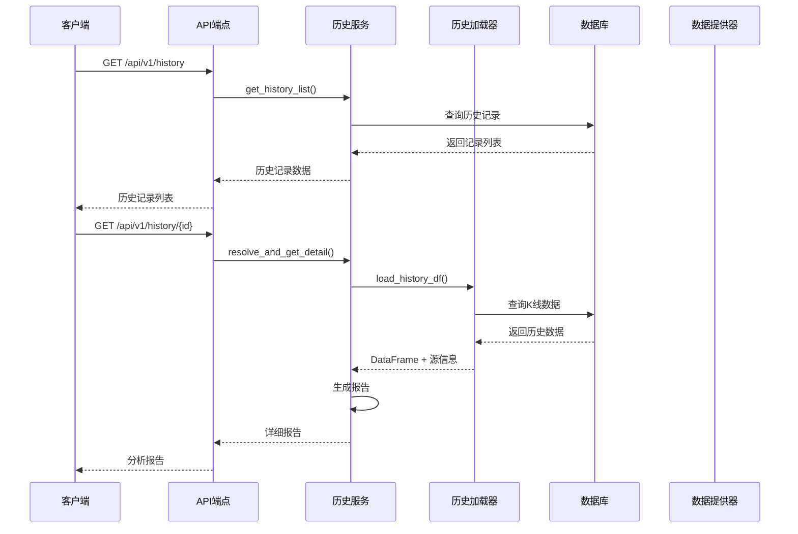
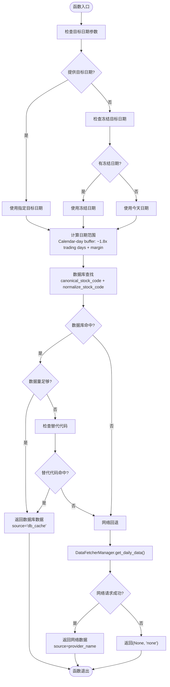
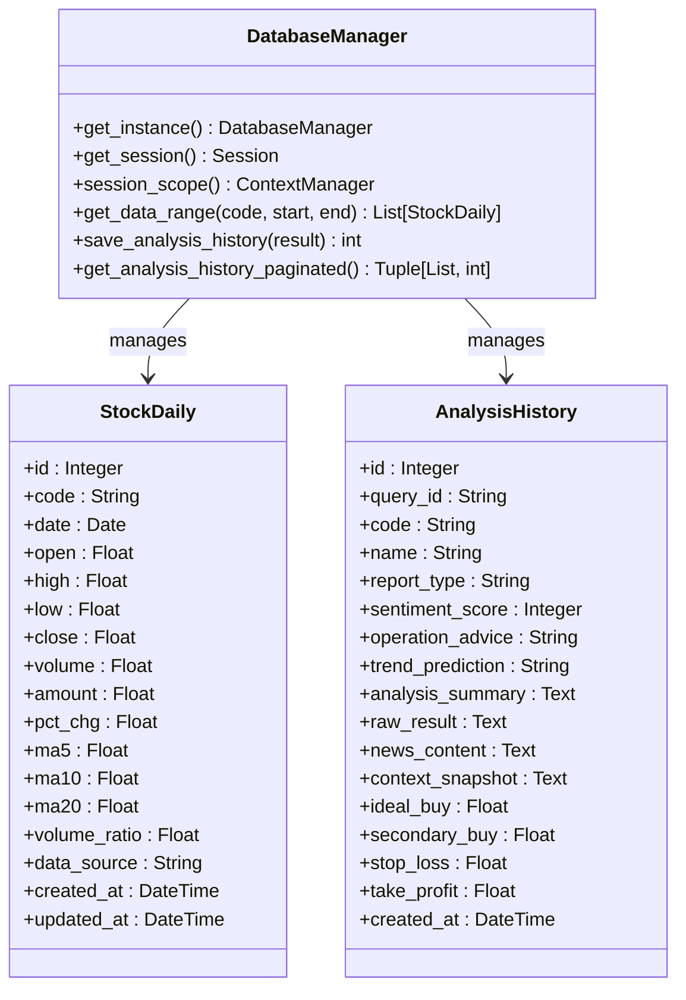
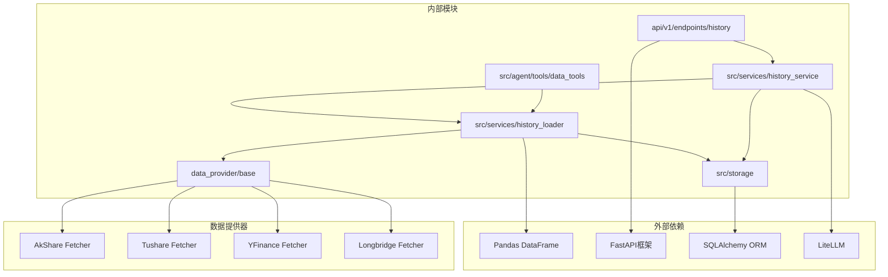

# 历史数据加载服务

<cite>
**本文档引用的文件**
- [history_loader.py](file://src/services/history_loader.py)
- [history_service.py](file://src/services/history_service.py)
- [history.py](file://api/v1/endpoints/history.py)
- [history.py](file://api/v1/schemas/history.py)
- [base.py](file://data_provider/base.py)
- [storage.py](file://src/storage.py)
- [data_tools.py](file://src/agent/tools/data_tools.py)
- [stock_index_loader.py](file://src/data/stock_index_loader.py)
- [test_history_loader.py](file://tests/test_history_loader.py)
</cite>

## 目录
1. [简介](#简介)
2. [项目结构](#项目结构)
3. [核心组件](#核心组件)
4. [架构概览](#架构概览)
5. [详细组件分析](#详细组件分析)
6. [依赖关系分析](#依赖关系分析)
7. [性能考量](#性能考量)
8. [故障排除指南](#故障排除指南)
9. [结论](#结论)

## 简介

历史数据加载服务是股票分析系统中的关键基础设施，负责为AI代理工具和历史数据分析提供高效、可靠的K线历史数据。该服务采用"数据库优先"的策略，通过智能缓存机制大幅减少网络请求，同时提供强大的数据回退机制。

该服务的核心价值在于：
- **性能优化**：通过ContextVar机制消除45+次冗余HTTP请求
- **数据一致性**：统一的标准化数据格式和质量控制
- **可靠性保障**：多层回退机制确保数据获取的稳定性
- **智能缓存**：基于时间窗口的智能数据缓存策略

## 项目结构

历史数据加载服务在整体架构中的位置如下：

**图表来源**
- [history.py:1-462](file://api/v1/endpoints/history.py#L1-462)
- [history_service.py:1-919](file://src/services/history_service.py#L1-919)
- [history_loader.py:1-115](file://src/services/history_loader.py#L1-115)

**章节来源**
- [history.py:1-462](file://api/v1/endpoints/history.py#L1-462)
- [history_service.py:1-919](file://src/services/history_service.py#L1-919)
- [history_loader.py:1-115](file://src/services/history_loader.py#L1-115)

## 核心组件

### 历史加载器 (HistoryLoader)

历史加载器是整个服务的核心组件，实现了"数据库优先"的数据获取策略：

**主要特性：**
- ContextVar上下文变量管理冻结的目标日期
- 数据库优先的双路径数据获取
- 智能代码规范化处理
- 网络回退机制

**关键实现：**
- 冻结目标日期传播：通过ContextVar在多线程环境中传递目标日期
- 双路径获取：优先数据库，失败时回退到数据提供器
- 代码标准化：支持多种股票代码格式的规范化处理

**章节来源**
- [history_loader.py:1-115](file://src/services/history_loader.py#L1-115)

### 历史服务 (HistoryService)

历史服务提供了完整的查询、管理和报告生成功能：

**核心功能：**
- 历史记录查询和分页
- 详情解析和数据转换
- Markdown报告生成
- 新闻情报关联查询

**章节来源**
- [history_service.py:1-919](file://src/services/history_service.py#L1-919)

### API端点 (API Endpoints)

提供了RESTful接口来访问历史数据：

**接口功能：**
- 历史记录列表查询
- 详情获取和删除
- Markdown报告生成
- 新闻情报关联查询

**章节来源**
- [history.py:1-462](file://api/v1/endpoints/history.py#L1-462)

## 架构概览

历史数据加载服务采用分层架构设计，确保了良好的可维护性和扩展性：

**图表来源**
- [history.py:63-222](file://api/v1/endpoints/history.py#L63-222)
- [history_service.py:64-135](file://src/services/history_service.py#L64-135)
- [history_loader.py:62-114](file://src/services/history_loader.py#L62-114)

## 详细组件分析

### 历史加载器深度分析

历史加载器实现了复杂的双路径数据获取策略：

**图表来源**
- [history_loader.py:62-114](file://src/services/history_loader.py#L62-114)

**章节来源**
- [history_loader.py:1-115](file://src/services/history_loader.py#L1-115)

### 数据提供器管理器

数据提供器管理器实现了策略模式，提供了灵活的数据源管理：

**核心特性：**
- 策略模式实现多数据源管理
- 自动故障切换机制
- 线程安全的并发控制
- 智能缓存管理

**章节来源**
- [base.py:471-630](file://data_provider/base.py#L471-630)

### 存储层设计

存储层采用了高效的ORM设计，支持完整的数据生命周期管理：

**图表来源**
- [storage.py:627-706](file://src/storage.py#L627-706)
- [storage.py:68-137](file://src/storage.py#L68-137)
- [storage.py:212-274](file://src/storage.py#L212-274)

**章节来源**
- [storage.py:1-800](file://src/storage.py#L1-800)

### API服务集成

API服务提供了完整的RESTful接口，支持历史数据的查询和管理：

**核心接口：**
- `GET /api/v1/history` - 历史记录列表查询
- `DELETE /api/v1/history` - 批量删除历史记录
- `GET /api/v1/history/{record_id}` - 历史报告详情
- `GET /api/v1/history/{record_id}/news` - 关联新闻情报
- `GET /api/v1/history/{record_id}/markdown` - Markdown格式报告

**章节来源**
- [history.py:1-462](file://api/v1/endpoints/history.py#L1-462)

## 依赖关系分析

历史数据加载服务的依赖关系体现了清晰的分层架构：

**图表来源**
- [history_loader.py:1-115](file://src/services/history_loader.py#L1-115)
- [history_service.py:1-919](file://src/services/history_service.py#L1-919)
- [history.py:1-462](file://api/v1/endpoints/history.py#L1-462)

**章节来源**
- [base.py:1-800](file://data_provider/base.py#L1-800)
- [data_tools.py:235-255](file://src/agent/tools/data_tools.py#L235-255)

## 性能考量

历史数据加载服务在性能方面采用了多项优化策略：

### 缓存策略优化
- **ContextVar上下文传播**：消除45+次冗余HTTP请求
- **智能日期缓冲**：~1.8倍交易日+假期缓冲确保数据完整性
- **数据量阈值检查**：≥30%的请求天数才使用数据库缓存

### 并发控制
- **线程安全的单例模式**：DataFetcherManager的线程安全实现
- **数据库连接池**：SQLite WAL模式和忙等待超时配置
- **智能重试机制**：SQLite写入冲突的指数退避重试

### 内存管理
- **惰性加载**：数据提供器的延迟初始化
- **上下文管理**：Session的自动清理和资源释放
- **DataFrame优化**：Pandas数据结构的高效内存使用

## 故障排除指南

### 常见问题及解决方案

**问题1：历史数据为空**
- 检查数据库连接配置
- 验证股票代码格式标准化
- 确认数据提供器可用性

**问题2：性能问题**
- 检查ContextVar上下文传播
- 验证缓存策略配置
- 监控数据库查询性能

**问题3：API调用失败**
- 检查API端点配置
- 验证认证和授权设置
- 查看详细的错误日志

**章节来源**
- [test_history_loader.py:1-142](file://tests/test_history_loader.py#L1-142)

### 调试技巧

1. **启用详细日志**：检查`DEBUG`级别的日志输出
2. **监控数据库查询**：使用SQLAlchemy的查询日志
3. **验证数据流**：跟踪从API到数据库的数据传输过程
4. **性能基准测试**：使用单元测试验证关键路径性能

## 结论

历史数据加载服务通过精心设计的架构和多项优化策略，为整个股票分析系统提供了可靠、高效的历史数据支持。其核心优势包括：

- **高性能**：通过ContextVar机制大幅减少网络请求
- **高可靠性**：多层回退机制确保数据获取的稳定性
- **高可维护性**：清晰的分层架构和模块化设计
- **高扩展性**：策略模式支持灵活的数据源管理

该服务不仅满足了当前的业务需求，还为未来的功能扩展和技术演进奠定了坚实的基础。通过持续的优化和改进，历史数据加载服务将继续为用户提供优质的股票分析体验。