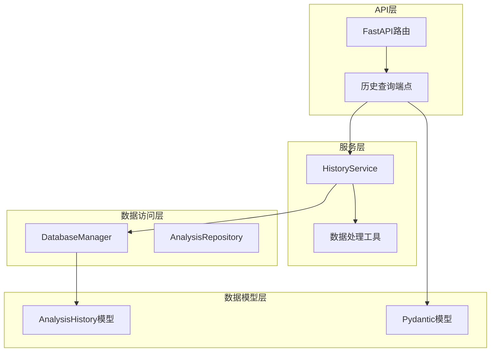
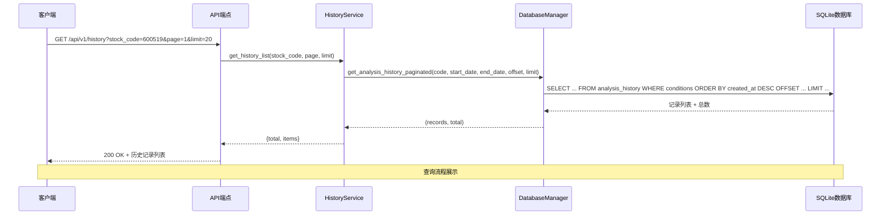
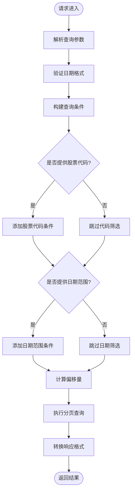
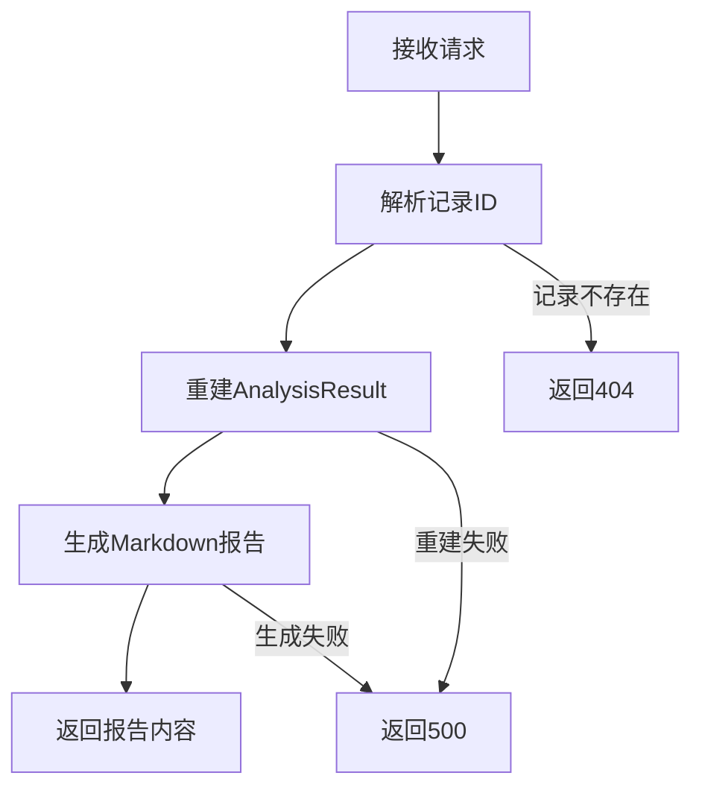
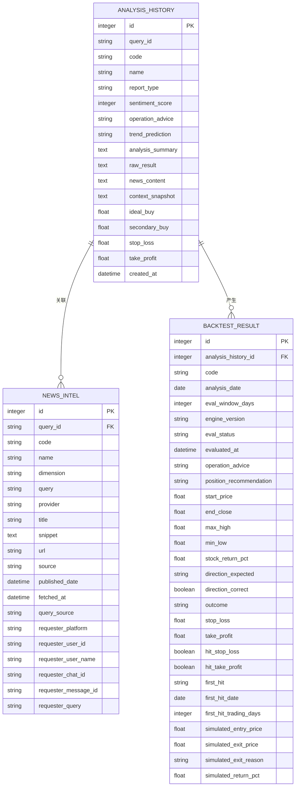

# 历史查询接口

<cite>
**本文档引用的文件**
- [api/v1/endpoints/history.py](file://api/v1/endpoints/history.py)
- [api/v1/schemas/history.py](file://api/v1/schemas/history.py)
- [src/services/history_service.py](file://src/services/history_service.py)
- [src/storage.py](file://src/storage.py)
- [src/repositories/analysis_repo.py](file://src/repositories/analysis_repo.py)
- [src/config.py](file://src/config.py)
</cite>

## 目录
1. [简介](#简介)
2. [项目结构](#项目结构)
3. [核心组件](#核心组件)
4. [架构概览](#架构概览)
5. [详细组件分析](#详细组件分析)
6. [依赖分析](#依赖分析)
7. [性能考虑](#性能考虑)
8. [故障排除指南](#故障排除指南)
9. [结论](#结论)
10. [附录](#附录)

## 简介
本文档详细说明了历史查询接口的API规范，包括HTTP方法、URL模式、分页参数、查询条件过滤机制、响应格式、搜索和排序选项、缓存策略以及性能优化策略。该接口允许用户分页查询历史分析记录，并支持按股票代码和日期范围进行筛选。

## 项目结构
历史查询接口位于API版本化路由下，采用分层架构设计：
- API端点层：处理HTTP请求和响应
- 服务层：封装业务逻辑和数据处理
- 数据访问层：提供数据库操作接口
- 数据模型层：定义ORM模型和数据结构



**图表来源**
- [api/v1/endpoints/history.py:46-452](file://api/v1/endpoints/history.py#L46-L452)
- [src/services/history_service.py:48-919](file://src/services/history_service.py#L48-L919)
- [src/storage.py:207-406](file://src/storage.py#L207-L406)

**章节来源**
- [api/v1/endpoints/history.py:1-452](file://api/v1/endpoints/history.py#L1-L452)
- [src/services/history_service.py:1-919](file://src/services/history_service.py#L1-L919)

## 核心组件
历史查询接口由以下核心组件构成：

### API端点
- GET `/api/v1/history` - 获取历史分析列表
- GET `/api/v1/history/{record_id}` - 获取历史报告详情
- GET `/api/v1/history/{record_id}/news` - 获取关联新闻
- GET `/api/v1/history/{record_id}/markdown` - 获取Markdown格式报告
- DELETE `/api/v1/history` - 删除历史分析记录

### 数据模型
- HistoryListResponse - 历史记录列表响应
- AnalysisReport - 完整分析报告
- NewsIntelResponse - 新闻情报响应
- MarkdownReportResponse - Markdown报告响应

**章节来源**
- [api/v1/endpoints/history.py:49-452](file://api/v1/endpoints/history.py#L49-L452)
- [api/v1/schemas/history.py:17-211](file://api/v1/schemas/history.py#L17-L211)

## 架构概览
历史查询接口采用经典的三层架构模式，实现了清晰的职责分离：



**图表来源**
- [api/v1/endpoints/history.py:59-126](file://api/v1/endpoints/history.py#L59-L126)
- [src/services/history_service.py:64-136](file://src/services/history_service.py#L64-L136)
- [src/storage.py:1150-1202](file://src/storage.py#L1150-L1202)

## 详细组件分析

### 历史列表查询接口
该接口提供分页查询历史分析记录的功能，支持多种筛选条件。

#### HTTP规范
- 方法：GET
- URL：`/api/v1/history`
- 查询参数：
  - `stock_code` (可选)：股票代码筛选
  - `start_date` (可选)：开始日期 (YYYY-MM-DD)
  - `end_date` (可选)：结束日期 (YYYY-MM-DD)
  - `page` (必填)：页码 (从1开始)，默认1
  - `limit` (必填)：每页数量，范围1-100，默认20

#### 过滤机制
接口支持多维度条件过滤：



**图表来源**
- [src/services/history_service.py:64-136](file://src/services/history_service.py#L64-L136)
- [src/storage.py:1150-1202](file://src/storage.py#L1150-L1202)

#### 响应格式
历史列表响应包含以下字段：
- `total`：总记录数
- `page`：当前页码
- `limit`：每页数量
- `items`：记录列表，每个项目包含：
  - `id`：主键ID
  - `query_id`：关联的查询ID
  - `stock_code`：股票代码
  - `stock_name`：股票名称
  - `report_type`：报告类型
  - `sentiment_score`：情绪评分 (0-100)
  - `operation_advice`：操作建议
  - `created_at`：创建时间

#### 排序规则
历史记录按创建时间降序排列，最新的记录排在前面。

**章节来源**
- [api/v1/endpoints/history.py:59-126](file://api/v1/endpoints/history.py#L59-L126)
- [api/v1/schemas/history.py:49-66](file://api/v1/schemas/history.py#L49-L66)
- [src/services/history_service.py:64-136](file://src/services/history_service.py#L64-L136)

### 历史详情查询接口
该接口提供完整的分析报告详情，支持通过主键ID或查询ID进行查询。

#### HTTP规范
- 方法：GET
- URL：`/api/v1/history/{record_id}`
- 参数：
  - `record_id`：分析历史记录主键ID（整数）或查询ID（字符串）

#### 查询解析机制
接口采用智能解析策略：
1. 首先尝试将参数解析为主键ID（整数）
2. 如果解析失败，则作为查询ID进行查询
3. 通过数据库查询获取完整的历史记录详情

#### 详情内容
完整报告包含四个主要部分：
- **元信息 (meta)**：包含查询ID、股票代码、报告类型、创建时间等
- **概览区 (summary)**：包含关键结论、操作建议、趋势预测、情绪评分等
- **策略点位区 (strategy)**：包含理想买入价、次级买入价、止损价、止盈价
- **详情区 (details)**：包含新闻摘要、原始分析结果、上下文快照等

**章节来源**
- [api/v1/endpoints/history.py:184-327](file://api/v1/endpoints/history.py#L184-L327)
- [api/v1/schemas/history.py:163-197](file://api/v1/schemas/history.py#L163-L197)

### 新闻情报接口
该接口获取与历史分析记录关联的新闻情报。

#### HTTP规范
- 方法：GET
- URL：`/api/v1/history/{record_id}/news`
- 参数：
  - `record_id`：分析历史记录ID
  - `limit`：返回数量限制，默认20，范围1-100

#### 新闻获取策略
接口采用双重获取策略：
1. 直接通过查询ID获取关联新闻
2. 如果直接查询无结果，则通过分析上下文进行历史兜底查询

**章节来源**
- [api/v1/endpoints/history.py:340-385](file://api/v1/endpoints/history.py#L340-L385)
- [api/v1/schemas/history.py:97-110](file://api/v1/schemas/history.py#L97-L110)

### Markdown报告接口
该接口生成与推送通知格式一致的Markdown格式报告。

#### HTTP规范
- 方法：GET
- URL：`/api/v1/history/{record_id}/markdown`

#### 报告生成流程


**图表来源**
- [src/services/history_service.py:443-498](file://src/services/history_service.py#L443-L498)

**章节来源**
- [api/v1/endpoints/history.py:399-451](file://api/v1/endpoints/history.py#L399-L451)

### 批量删除接口
该接口支持批量删除历史分析记录。

#### HTTP规范
- 方法：DELETE
- URL：`/api/v1/history`
- 请求体：包含要删除的记录ID列表

#### 删除策略
- 支持批量删除多个历史记录
- 自动清理相关的回测结果
- 返回实际删除的数量

**章节来源**
- [api/v1/endpoints/history.py:139-171](file://api/v1/endpoints/history.py#L139-L171)

## 依赖分析

### 数据模型关系


**图表来源**
- [src/storage.py:207-406](file://src/storage.py#L207-L406)

### 服务层依赖
历史服务层依赖于数据库管理器和各种工具函数：

```mermaid
classDiagram
class HistoryService {
+get_history_list()
+resolve_and_get_detail()
+get_news_intel()
+get_markdown_report()
+delete_history_records()
-_resolve_record()
-_record_to_detail_dict()
-_rebuild_analysis_result()
-_generate_single_stock_markdown()
}
class DatabaseManager {
+get_analysis_history_paginated()
+get_analysis_history_by_id()
+get_latest_analysis_by_query_id()
+delete_analysis_history_records()
+get_news_intel_by_query_id()
+get_recent_news()
}
class AnalysisHistory {
+id : int
+query_id : string
+code : string
+name : string
+report_type : string
+sentiment_score : int
+operation_advice : string
+trend_prediction : string
+analysis_summary : string
+raw_result : string
+news_content : string
+context_snapshot : string
+ideal_buy : float
+secondary_buy : float
+stop_loss : float
+take_profit : float
+created_at : datetime
}
HistoryService --> DatabaseManager : "使用"
HistoryService --> AnalysisHistory : "操作"
```



**图表来源**
- [src/services/history_service.py:48-919](file://src/services/history_service.py#L48-L919)
- [src/storage.py:1108-1267](file://src/storage.py#L1108-L1267)

**章节来源**
- [src/services/history_service.py:1-919](file://src/services/history_service.py#L1-L919)
- [src/storage.py:1-2000](file://src/storage.py#L1-L2000)

## 性能考虑

### 缓存策略
系统采用多层次缓存策略以提升查询性能：

1. **实时行情缓存**
   - 缓存时间：默认600秒（10分钟）
   - 适用场景：实时股价、涨跌幅等数据
   - 配置位置：`realtime_cache_ttl`参数

2. **数据库索引优化**
   - AnalysisHistory表建立复合索引 `(code, created_at)`
   - 支持高效的股票代码和时间范围查询
   - 优化分页查询性能

3. **查询结果缓存**
   - 历史查询结果按日期范围和股票代码进行缓存
   - 避免重复查询相同条件的数据

### 性能优化策略

#### 分页查询优化
- 使用OFFSET/LIMIT实现高效分页
- 支持最大100条记录/页的限制
- 通过数据库索引优化排序性能

#### 并发处理
- API端点使用同步函数，FastAPI自动在线程池中执行
- 避免阻塞主线程，提高并发处理能力

#### 数据库连接管理
- 使用SQLAlchemy连接池管理数据库连接
- 自动处理连接复用和释放
- 支持高并发场景下的连接管理

### 大数据量处理
对于大量历史数据的查询，系统提供了以下优化措施：

1. **时间窗口限制**：默认查询最近30天的数据
2. **分页机制**：支持每页最多100条记录
3. **索引优化**：针对常用查询条件建立索引
4. **查询优化**：使用EXPLAIN分析查询计划，优化慢查询

**章节来源**
- [src/config.py:174-177](file://src/config.py#L174-L177)
- [src/storage.py:245-247](file://src/storage.py#L245-L247)
- [src/services/history_service.py:64-136](file://src/services/history_service.py#L64-L136)

## 故障排除指南

### 常见错误及解决方案

#### 404 Not Found
**问题**：查询的历史记录不存在
**原因**：record_id参数不正确或记录已被删除
**解决方案**：确认record_id的有效性，检查数据库中是否存在对应记录

#### 500 Internal Server Error
**问题**：服务器内部错误
**原因**：数据库查询异常、数据处理错误
**解决方案**：查看服务器日志，检查数据库连接状态，验证输入参数格式

#### 参数验证错误
**问题**：查询参数格式不正确
**原因**：日期格式错误、数值超出范围
**解决方案**：确保日期格式为YYYY-MM-DD，数值在有效范围内

### 调试建议
1. **启用调试模式**：设置`debug=True`获取更多日志信息
2. **检查数据库连接**：确认SQLite数据库文件存在且可访问
3. **验证索引状态**：确保数据库索引正常工作
4. **监控查询性能**：使用EXPLAIN分析慢查询

**章节来源**
- [api/v1/endpoints/history.py:117-125](file://api/v1/endpoints/history.py#L117-L125)
- [api/v1/endpoints/history.py:210-217](file://api/v1/endpoints/history.py#L210-L217)

## 结论
历史查询接口提供了完整的历史数据分析查询功能，具有以下特点：

1. **灵活的查询能力**：支持按股票代码和日期范围的组合筛选
2. **标准化的响应格式**：统一的JSON响应结构，便于前端处理
3. **完善的错误处理**：详细的错误信息和状态码
4. **性能优化设计**：多层缓存和索引优化
5. **扩展性强**：模块化设计便于功能扩展

该接口能够满足日常股票分析的历史数据查询需求，为用户提供便捷的数据访问体验。

## 附录

### API使用示例

#### 基础查询
```
GET /api/v1/history?stock_code=600519&page=1&limit=20
```

#### 带日期范围的查询
```
GET /api/v1/history?stock_code=600519&start_date=2024-01-01&end_date=2024-12-31&page=1&limit=20
```

#### 获取详情
```
GET /api/v1/history/12345
```

#### 获取新闻情报
```
GET /api/v1/history/12345/news?limit=20
```

#### 获取Markdown报告
```
GET /api/v1/history/12345/markdown
```

### 响应格式说明

#### 历史列表响应
```json
{
  "total": 100,
  "page": 1,
  "limit": 20,
  "items": [
    {
      "id": 1234,
      "query_id": "abc123",
      "stock_code": "600519",
      "stock_name": "贵州茅台",
      "report_type": "detailed",
      "sentiment_score": 75,
      "operation_advice": "持有",
      "created_at": "2024-01-01T12:00:00"
    }
  ]
}
```

#### 完整报告响应
```json
{
  "meta": {
    "query_id": "abc123",
    "stock_code": "600519",
    "stock_name": "贵州茅台",
    "report_type": "detailed",
    "report_language": "zh",
    "created_at": "2024-01-01T12:00:00"
  },
  "summary": {
    "analysis_summary": "技术面向好，建议持有",
    "operation_advice": "持有",
    "trend_prediction": "看多",
    "sentiment_score": 75,
    "sentiment_label": "乐观"
  },
  "strategy": {
    "ideal_buy": "1800.00",
    "secondary_buy": "1750.00",
    "stop_loss": "1700.00",
    "take_profit": "2000.00"
  },
  "details": null
}
```