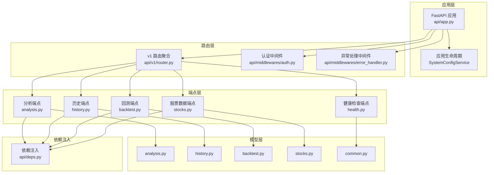
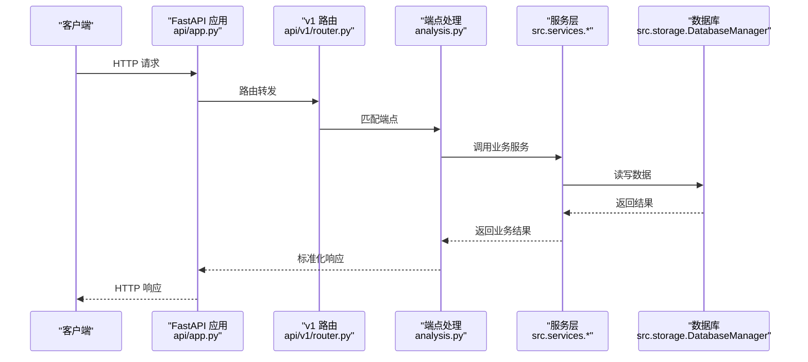
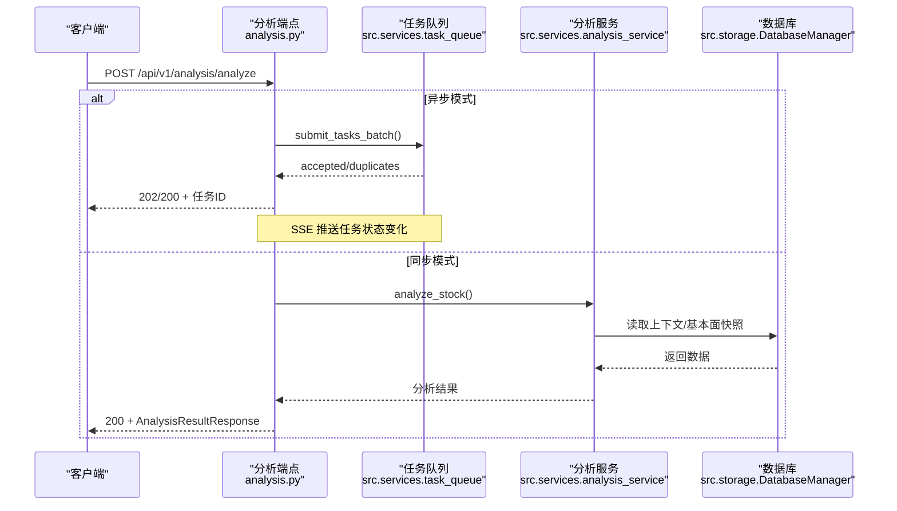
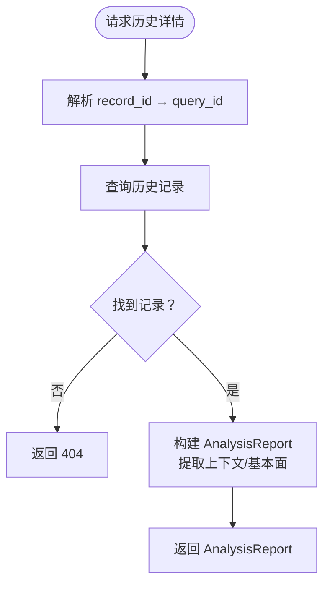
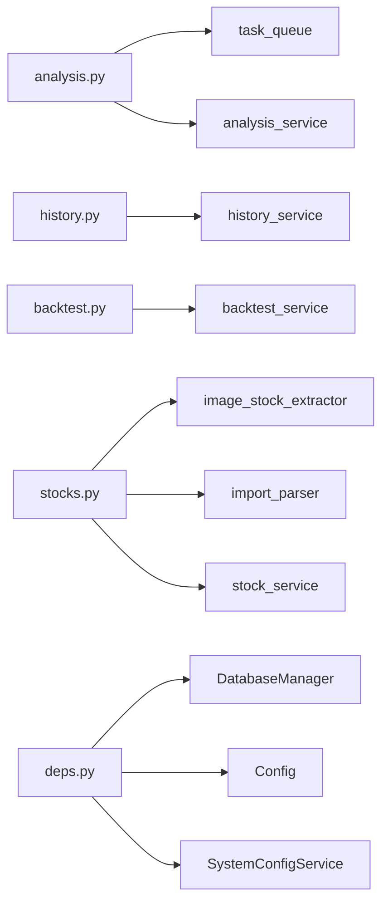

# 后端服务详解

<cite>
**本文引用的文件**
- [api/app.py](file://api/app.py)
- [api/middlewares/error_handler.py](file://api/middlewares/error_handler.py)
- [api/v1/router.py](file://api/v1/router.py)
- [api/deps.py](file://api/deps.py)
- [api/v1/endpoints/analysis.py](file://api/v1/endpoints/analysis.py)
- [api/v1/endpoints/history.py](file://api/v1/endpoints/history.py)
- [api/v1/endpoints/backtest.py](file://api/v1/endpoints/backtest.py)
- [api/v1/endpoints/stocks.py](file://api/v1/endpoints/stocks.py)
- [api/v1/endpoints/health.py](file://api/v1/endpoints/health.py)
- [api/v1/schemas/analysis.py](file://api/v1/schemas/analysis.py)
- [api/v1/schemas/history.py](file://api/v1/schemas/history.py)
- [api/v1/schemas/backtest.py](file://api/v1/schemas/backtest.py)
- [api/v1/schemas/common.py](file://api/v1/schemas/common.py)
- [api/v1/schemas/stocks.py](file://api/v1/schemas/stocks.py)
- [main.py](file://main.py)
</cite>

## 目录
1. [简介](#简介)
2. [项目结构](#项目结构)
3. [核心组件](#核心组件)
4. [架构总览](#架构总览)
5. [详细组件分析](#详细组件分析)
6. [依赖关系分析](#依赖关系分析)
7. [性能考量](#性能考量)
8. [故障排查指南](#故障排查指南)
9. [结论](#结论)
10. [附录](#附录)

## 简介
本项目是一个基于 FastAPI 的 A 股/港股/美股自选股智能分析系统后端服务。后端提供以下能力：
- 股票分析：触发 AI 智能分析，支持同步与异步两种模式；异步模式下提供任务队列、SSE 实时推送与历史查询。
- 历史记录：查询历史分析报告、删除历史记录、获取 Markdown 报告等。
- 股票数据：从图片提取股票代码、解析 CSV/Excel/剪贴板文本、获取实时行情与历史 K 线。
- 回测：对历史分析记录进行回测评估，并提供整体与单股的回测表现指标。

系统采用版本化路由（/api/v1），内置健康检查、CORS、统一异常处理与依赖注入机制，支持可选运行时认证与前端静态资源托管。

## 项目结构
后端服务主要由以下层次构成：
- 应用工厂与生命周期：创建 FastAPI 实例、注册中间件、挂载路由与静态资源。
- 路由聚合：v1 版本路由聚合，统一前缀与标签。
- 端点模块：分析、历史、回测、股票数据、健康检查等。
- 模型与响应：统一的请求/响应模型与错误格式。
- 依赖注入：数据库会话、配置、系统配置服务等。
- 中间件：全局异常处理与可选认证中间件。

**图表来源**
- [api/app.py:48-204](file://api/app.py#L48-L204)
- [api/v1/router.py:17-72](file://api/v1/router.py#L17-L72)
- [api/deps.py:23-72](file://api/deps.py#L23-L72)

**章节来源**
- [api/app.py:48-204](file://api/app.py#L48-L204)
- [api/v1/router.py:17-72](file://api/v1/router.py#L17-L72)

## 核心组件
- 应用工厂与生命周期
  - 创建 FastAPI 实例，配置标题、描述、版本与 lifespan。
  - 注册 CORS、认证中间件、v1 路由与全局异常处理器。
  - 根路由与健康检查接口，以及前端静态资源托管与 SPA 回退。
- 路由聚合
  - 统一前缀 /api/v1，按功能模块 include 子路由。
- 依赖注入
  - 数据库会话、配置、系统配置服务等，确保请求结束后自动清理。
- 中间件
  - 全局异常处理：统一错误响应格式与日志记录。
  - 认证中间件：可选运行时认证开关。

**章节来源**
- [api/app.py:48-204](file://api/app.py#L48-L204)
- [api/middlewares/error_handler.py:70-129](file://api/middlewares/error_handler.py#L70-L129)
- [api/deps.py:23-72](file://api/deps.py#L23-L72)

## 架构总览
后端采用分层架构，端到端数据流如下：
- 客户端请求进入 FastAPI 应用，经过 CORS 与认证中间件。
- 路由根据 URL 前缀 /api/v1 聚合到对应端点。
- 端点通过依赖注入获取服务与配置，调用业务服务执行分析/查询/回测等操作。
- 统一异常处理器捕获未处理异常，返回标准化错误响应。
- 响应模型由 Pydantic 定义，保证结构一致性。

**图表来源**
- [api/app.py:108-115](file://api/app.py#L108-L115)
- [api/v1/router.py:19-71](file://api/v1/router.py#L19-L71)
- [api/v1/endpoints/analysis.py:88-158](file://api/v1/endpoints/analysis.py#L88-L158)

## 详细组件分析

### API 应用与中间件
- 应用工厂
  - 创建 FastAPI 实例，设置标题、描述、版本与 lifespan。
  - 配置 CORS：支持多来源、可选允许全部来源、允许方法与头部。
  - 注册认证中间件与全局异常处理器。
  - 根路由与健康检查接口，SPA 回退与静态资源挂载。
- 全局异常处理
  - 捕获 HTTP 异常、请求验证异常与通用异常，统一返回标准错误响应。
  - 记录错误日志，便于排障。
- 认证中间件
  - 可选运行时认证，通过 WebUI 设置页面启用/关闭。

**章节来源**
- [api/app.py:48-204](file://api/app.py#L48-L204)
- [api/middlewares/error_handler.py:24-129](file://api/middlewares/error_handler.py#L24-L129)

### 路由与版本控制
- v1 路由聚合
  - 统一前缀 /api/v1，按模块 include 子路由（analysis、history、backtest、stocks、health 等）。
- 版本策略
  - 当前版本为 1.0.0，未来新增端点或变更现有行为时，建议在新版本路由下扩展，保持向后兼容。

**章节来源**
- [api/v1/router.py:17-72](file://api/v1/router.py#L17-L72)

### 依赖注入机制
- 数据库会话
  - 通过依赖注入获取 SQLAlchemy 会话，在请求结束时自动关闭。
- 配置与系统服务
  - 获取全局配置与应用生命周期共享的系统配置服务实例。
- 使用方式
  - 在端点函数签名中声明依赖，FastAPI 自动注入。

**章节来源**
- [api/deps.py:23-72](file://api/deps.py#L23-L72)

### 分析接口（触发、状态、任务流）
- 端点概览
  - POST /api/v1/analysis/analyze：触发分析（支持同步与异步，批量与去重）。
  - GET /api/v1/analysis/status/{task_id}：查询任务状态（队列中或历史记录）。
  - GET /api/v1/analysis/tasks：获取任务列表（支持状态筛选与分页）。
  - GET /api/v1/analysis/tasks/stream：SSE 实时推送任务状态。
- 关键特性
  - 异步任务队列：防重复提交、SSE 实时推送、任务统计与订阅。
  - 同步模式：单只股票直出结果。
  - 历史回溯：已完成任务从数据库重建报告结构。
- 响应模型
  - AnalyzeRequest、AnalysisResultResponse、TaskStatus、TaskListResponse 等。

**图表来源**
- [api/v1/endpoints/analysis.py:88-158](file://api/v1/endpoints/analysis.py#L88-L158)
- [api/v1/endpoints/analysis.py:307-369](file://api/v1/endpoints/analysis.py#L307-L369)
- [api/v1/endpoints/analysis.py:376-439](file://api/v1/endpoints/analysis.py#L376-L439)
- [api/v1/endpoints/analysis.py:470-570](file://api/v1/endpoints/analysis.py#L470-L570)

**章节来源**
- [api/v1/endpoints/analysis.py:88-158](file://api/v1/endpoints/analysis.py#L88-L158)
- [api/v1/endpoints/analysis.py:307-369](file://api/v1/endpoints/analysis.py#L307-L369)
- [api/v1/endpoints/analysis.py:376-439](file://api/v1/endpoints/analysis.py#L376-L439)
- [api/v1/endpoints/analysis.py:470-570](file://api/v1/endpoints/analysis.py#L470-L570)
- [api/v1/schemas/analysis.py:27-291](file://api/v1/schemas/analysis.py#L27-L291)

### 历史查询接口
- 端点概览
  - GET /api/v1/history：分页获取历史记录摘要（支持按股票代码与日期范围筛选）。
  - DELETE /api/v1/history：批量删除历史记录。
  - GET /api/v1/history/{record_id}：获取历史报告详情（支持主键 ID 或 query_id）。
  - GET /api/v1/history/{record_id}/news：获取关联新闻情报。
  - GET /api/v1/history/{record_id}/markdown：获取 Markdown 格式报告。
- 数据处理
  - 从上下文快照与数据库快照提取价格、涨跌幅、财务与分红指标。
  - 报告语言与本地化处理。
- 错误处理
  - 未找到返回 404，服务器错误返回 500。

**图表来源**
- [api/v1/endpoints/history.py:184-327](file://api/v1/endpoints/history.py#L184-L327)

**章节来源**
- [api/v1/endpoints/history.py:59-126](file://api/v1/endpoints/history.py#L59-L126)
- [api/v1/endpoints/history.py:139-171](file://api/v1/endpoints/history.py#L139-L171)
- [api/v1/endpoints/history.py:184-327](file://api/v1/endpoints/history.py#L184-L327)
- [api/v1/endpoints/history.py:340-385](file://api/v1/endpoints/history.py#L340-L385)
- [api/v1/endpoints/history.py:399-452](file://api/v1/endpoints/history.py#L399-L452)
- [api/v1/schemas/history.py:17-211](file://api/v1/schemas/history.py#L17-L211)

### 回测接口
- 端点概览
  - POST /api/v1/backtest/run：触发回测（支持按股票、评估窗口、最小天龄、数量限制）。
  - GET /api/v1/backtest/results：分页获取回测结果（支持过滤）。
  - GET /api/v1/backtest/performance：整体回测表现。
  - GET /api/v1/backtest/performance/{code}：单股回测表现。
- 数据模型
  - BacktestRunRequest/Response、BacktestResultItem、PerformanceMetrics。

**章节来源**
- [api/v1/endpoints/backtest.py:38-58](file://api/v1/endpoints/backtest.py#L38-L58)
- [api/v1/endpoints/backtest.py:70-92](file://api/v1/endpoints/backtest.py#L70-L92)
- [api/v1/endpoints/backtest.py:105-125](file://api/v1/endpoints/backtest.py#L105-L125)
- [api/v1/endpoints/backtest.py:138-160](file://api/v1/endpoints/backtest.py#L138-L160)
- [api/v1/schemas/backtest.py:11-95](file://api/v1/schemas/backtest.py#L11-L95)

### 股票数据接口
- 端点概览
  - POST /api/v1/stocks/extract-from-image：从图片提取股票代码（Vision LLM，支持多种格式与大小限制）。
  - POST /api/v1/stocks/parse-import：解析 CSV/Excel/剪贴板文本。
  - GET /api/v1/stocks/{code}/quote：实时行情。
  - GET /api/v1/stocks/{code}/history：历史 K 线（支持 daily/weekly/monthly 周期与天数限制）。
- 错误处理
  - 图片类型不支持、文件过大、JSON 解析失败、读取失败等均返回相应错误。

**章节来源**
- [api/v1/endpoints/stocks.py:58-122](file://api/v1/endpoints/stocks.py#L58-L122)
- [api/v1/endpoints/stocks.py:135-240](file://api/v1/endpoints/stocks.py#L135-L240)
- [api/v1/endpoints/stocks.py:253-308](file://api/v1/endpoints/stocks.py#L253-L308)
- [api/v1/endpoints/stocks.py:322-389](file://api/v1/endpoints/stocks.py#L322-L389)
- [api/v1/schemas/stocks.py:17-112](file://api/v1/schemas/stocks.py#L17-L112)

### 健康检查接口
- 端点概览
  - GET /api/v1/health：返回服务状态与时间戳，用于负载均衡与监控。

**章节来源**
- [api/v1/endpoints/health.py:21-35](file://api/v1/endpoints/health.py#L21-L35)

### 统一响应与错误模型
- HealthResponse：健康检查响应。
- ErrorResponse：统一错误响应（error、message、detail）。
- SuccessResponse：通用成功响应。
- 以上模型在各端点中被广泛复用，确保前后端交互一致性。

**章节来源**
- [api/v1/schemas/common.py:32-79](file://api/v1/schemas/common.py#L32-L79)

## 依赖关系分析
- 端点到服务层
  - 分析端点依赖任务队列与分析服务；历史端点依赖历史服务与数据库；回测端点依赖回测服务；股票数据端点依赖图像提取、导入解析与股票服务。
- 依赖注入
  - 通过 FastAPI 依赖注入自动提供数据库会话、配置与系统配置服务。
- 中间件
  - 全局异常处理中间件统一拦截异常，认证中间件可选启用。

**图表来源**
- [api/v1/endpoints/analysis.py:52-61](file://api/v1/endpoints/analysis.py#L52-L61)
- [api/v1/endpoints/history.py:41](file://api/v1/endpoints/history.py#L41)
- [api/v1/endpoints/backtest.py:20](file://api/v1/endpoints/backtest.py#L20)
- [api/v1/endpoints/stocks.py:27-37](file://api/v1/endpoints/stocks.py#L27-L37)
- [api/deps.py:18-21](file://api/deps.py#L18-L21)

**章节来源**
- [api/v1/endpoints/analysis.py:52-61](file://api/v1/endpoints/analysis.py#L52-L61)
- [api/v1/endpoints/history.py:41](file://api/v1/endpoints/history.py#L41)
- [api/v1/endpoints/backtest.py:20](file://api/v1/endpoints/backtest.py#L20)
- [api/v1/endpoints/stocks.py:27-37](file://api/v1/endpoints/stocks.py#L27-L37)
- [api/deps.py:18-21](file://api/deps.py#L18-L21)

## 性能考量
- 异步分析与任务队列
  - 异步模式避免阻塞请求，支持批量提交与防重复；SSE 实时推送降低轮询成本。
- 线程池执行
  - 非异步端点（如历史查询、股票数据）使用 def 而非 async def，由 FastAPI 自动在线程池中执行，适合 I/O 密集场景。
- 数据库连接
  - 依赖注入确保每个请求使用独立会话并在结束时关闭，减少连接泄漏风险。
- CORS 与静态资源
  - 生产环境建议限制允许来源，避免不必要的跨域暴露；前端静态资源挂载与 SPA 回退提升用户体验。

[本节为通用性能建议，无需特定文件引用]

## 故障排查指南
- 常见错误与定位
  - 400 参数校验失败：检查请求体与查询参数是否符合模型约束。
  - 404 资源不存在：确认任务 ID、记录 ID 或股票代码是否正确。
  - 409 重复任务：异步模式下相同股票正在分析中，等待完成或调整策略。
  - 422 不支持的周期：历史数据接口仅支持 daily/weekly/monthly。
  - 500 服务器内部错误：查看日志，确认异常已被全局异常处理器捕获并记录。
- 日志与监控
  - 全局异常处理器记录堆栈与请求上下文，便于快速定位问题。
  - 健康检查接口可用于负载均衡器与监控系统探测服务状态。

**章节来源**
- [api/middlewares/error_handler.py:113-129](file://api/middlewares/error_handler.py#L113-L129)
- [api/v1/endpoints/stocks.py:372-380](file://api/v1/endpoints/stocks.py#L372-L380)
- [api/v1/endpoints/analysis.py:197-210](file://api/v1/endpoints/analysis.py#L197-L210)

## 结论
本后端服务以 FastAPI 为核心，采用分层架构与依赖注入，提供从股票分析、历史查询、回测评估到股票数据的完整能力。通过统一的响应模型与全局异常处理，保障了接口的一致性与稳定性。版本化路由与生命周期管理为后续演进提供了清晰的扩展路径。建议在生产环境中合理配置 CORS 与认证策略，并结合健康检查与日志体系持续优化性能与可靠性。

[本节为总结性内容，无需特定文件引用]

## 附录

### API 规范总览
- 版本：v1
- 基础路径：/api/v1
- 认证：可选（通过 WebUI 设置页面启用/关闭）
- 健康检查：GET /api/v1/health

**章节来源**
- [api/app.py:74](file://api/app.py#L74)
- [api/v1/endpoints/health.py:21-35](file://api/v1/endpoints/health.py#L21-L35)

### 分析接口规范
- POST /api/v1/analysis/analyze
  - 方法：POST
  - 请求体：AnalyzeRequest
  - 响应：AnalysisResultResponse（同步）或 TaskAccepted/202（异步）
  - 错误：400/409/500
- GET /api/v1/analysis/status/{task_id}
  - 方法：GET
  - 响应：TaskStatus（队列中或历史记录）
  - 错误：404/500
- GET /api/v1/analysis/tasks
  - 方法：GET
  - 查询参数：status（逗号分隔）、limit
  - 响应：TaskListResponse
- GET /api/v1/analysis/tasks/stream
  - 方法：GET
  - 响应：text/event-stream（SSE）

**章节来源**
- [api/v1/endpoints/analysis.py:88-158](file://api/v1/endpoints/analysis.py#L88-L158)
- [api/v1/endpoints/analysis.py:307-369](file://api/v1/endpoints/analysis.py#L307-L369)
- [api/v1/endpoints/analysis.py:376-439](file://api/v1/endpoints/analysis.py#L376-L439)
- [api/v1/endpoints/analysis.py:470-570](file://api/v1/endpoints/analysis.py#L470-L570)
- [api/v1/schemas/analysis.py:27-291](file://api/v1/schemas/analysis.py#L27-L291)

### 历史查询接口规范
- GET /api/v1/history
  - 方法：GET
  - 查询参数：stock_code、start_date、end_date、page、limit
  - 响应：HistoryListResponse
- DELETE /api/v1/history
  - 方法：DELETE
  - 请求体：DeleteHistoryRequest
  - 响应：DeleteHistoryResponse
- GET /api/v1/history/{record_id}
  - 方法：GET
  - 响应：AnalysisReport
- GET /api/v1/history/{record_id}/news
  - 方法：GET
  - 查询参数：limit
  - 响应：NewsIntelResponse
- GET /api/v1/history/{record_id}/markdown
  - 方法：GET
  - 响应：MarkdownReportResponse

**章节来源**
- [api/v1/endpoints/history.py:59-126](file://api/v1/endpoints/history.py#L59-L126)
- [api/v1/endpoints/history.py:139-171](file://api/v1/endpoints/history.py#L139-L171)
- [api/v1/endpoints/history.py:184-327](file://api/v1/endpoints/history.py#L184-L327)
- [api/v1/endpoints/history.py:340-385](file://api/v1/endpoints/history.py#L340-L385)
- [api/v1/endpoints/history.py:399-452](file://api/v1/endpoints/history.py#L399-L452)
- [api/v1/schemas/history.py:17-211](file://api/v1/schemas/history.py#L17-L211)

### 回测接口规范
- POST /api/v1/backtest/run
  - 方法：POST
  - 请求体：BacktestRunRequest
  - 响应：BacktestRunResponse
- GET /api/v1/backtest/results
  - 方法：GET
  - 查询参数：code、eval_window_days、page、limit
  - 响应：BacktestResultsResponse
- GET /api/v1/backtest/performance
  - 方法：GET
  - 查询参数：eval_window_days
  - 响应：PerformanceMetrics
- GET /api/v1/backtest/performance/{code}
  - 方法：GET
  - 查询参数：eval_window_days
  - 响应：PerformanceMetrics

**章节来源**
- [api/v1/endpoints/backtest.py:38-58](file://api/v1/endpoints/backtest.py#L38-L58)
- [api/v1/endpoints/backtest.py:70-92](file://api/v1/endpoints/backtest.py#L70-L92)
- [api/v1/endpoints/backtest.py:105-125](file://api/v1/endpoints/backtest.py#L105-L125)
- [api/v1/endpoints/backtest.py:138-160](file://api/v1/endpoints/backtest.py#L138-L160)
- [api/v1/schemas/backtest.py:11-95](file://api/v1/schemas/backtest.py#L11-L95)

### 股票数据接口规范
- POST /api/v1/stocks/extract-from-image
  - 方法：POST
  - 表单字段：file（图片）
  - 查询参数：include_raw
  - 响应：ExtractFromImageResponse
- POST /api/v1/stocks/parse-import
  - 方法：POST
  - 内容类型：multipart/form-data 或 application/json
  - 响应：ExtractFromImageResponse
- GET /api/v1/stocks/{code}/quote
  - 方法：GET
  - 响应：StockQuote
- GET /api/v1/stocks/{code}/history
  - 方法：GET
  - 查询参数：period（daily/weekly/monthly）、days
  - 响应：StockHistoryResponse

**章节来源**
- [api/v1/endpoints/stocks.py:58-122](file://api/v1/endpoints/stocks.py#L58-L122)
- [api/v1/endpoints/stocks.py:135-240](file://api/v1/endpoints/stocks.py#L135-L240)
- [api/v1/endpoints/stocks.py:253-308](file://api/v1/endpoints/stocks.py#L253-L308)
- [api/v1/endpoints/stocks.py:322-389](file://api/v1/endpoints/stocks.py#L322-L389)
- [api/v1/schemas/stocks.py:17-112](file://api/v1/schemas/stocks.py#L17-L112)

### 错误码与状态码
- 400：请求参数错误（如缺少必要字段、JSON 解析失败、文件过大等）
- 404：资源不存在（任务/记录不存在）
- 409：重复任务（异步模式下相同股票正在分析中）
- 422：不支持的周期参数（历史数据接口）
- 500：服务器内部错误（统一错误响应）
- 200/202：成功（同步返回 200，异步返回 202）

**章节来源**
- [api/middlewares/error_handler.py:101-111](file://api/middlewares/error_handler.py#L101-L111)
- [api/v1/endpoints/stocks.py:372-380](file://api/v1/endpoints/stocks.py#L372-L380)
- [api/v1/endpoints/analysis.py:197-210](file://api/v1/endpoints/analysis.py#L197-L210)

### 集成指南与最佳实践
- 集成步骤
  - 启动后端服务：通过命令行参数选择模式（服务模式、定时任务、回测等）。
  - 访问 /docs 查看交互式 API 文档。
  - 如需前端界面，先构建前端再启动服务。
- 最佳实践
  - 异步分析优先：大批量分析使用异步模式并订阅 SSE。
  - 参数校验：严格遵循模型约束，避免 400 错误。
  - 错误处理：统一捕获与记录异常，结合健康检查与日志监控。
  - CORS 配置：生产环境限制允许来源，避免安全风险。
  - 依赖注入：在端点中显式声明依赖，确保资源正确释放。

**章节来源**
- [main.py:510-723](file://main.py#L510-L723)
- [api/app.py:108-115](file://api/app.py#L108-L115)