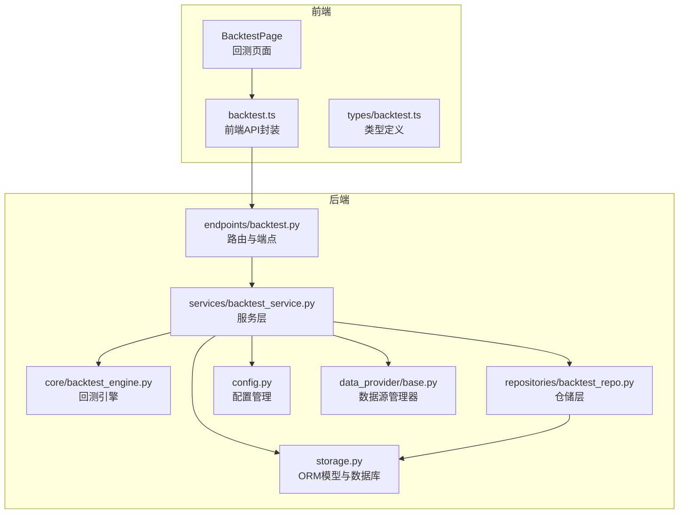
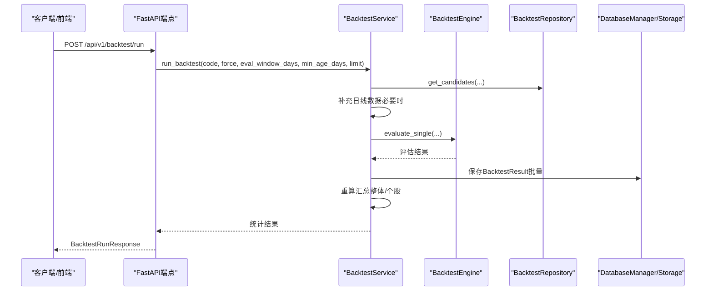
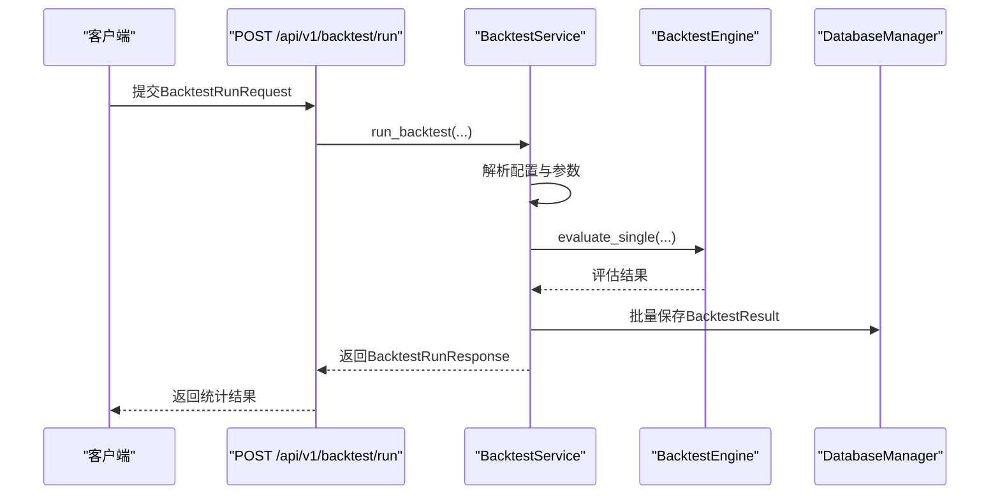
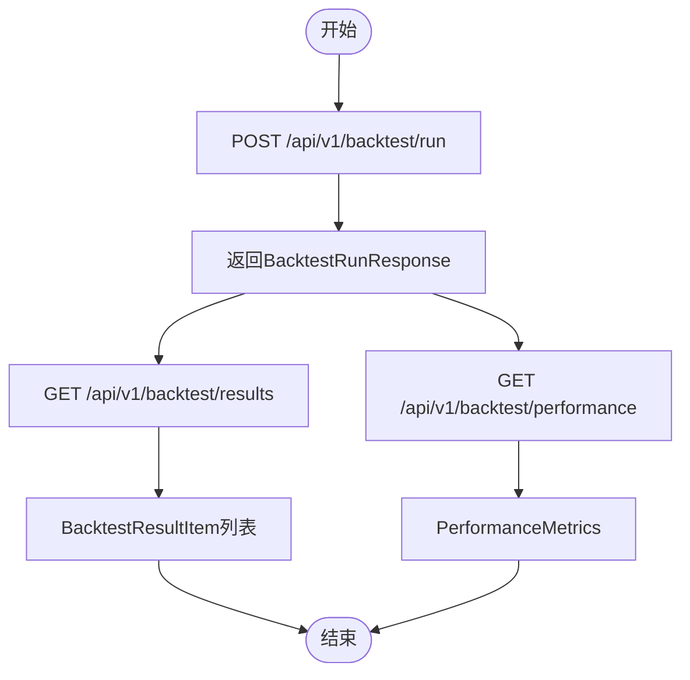
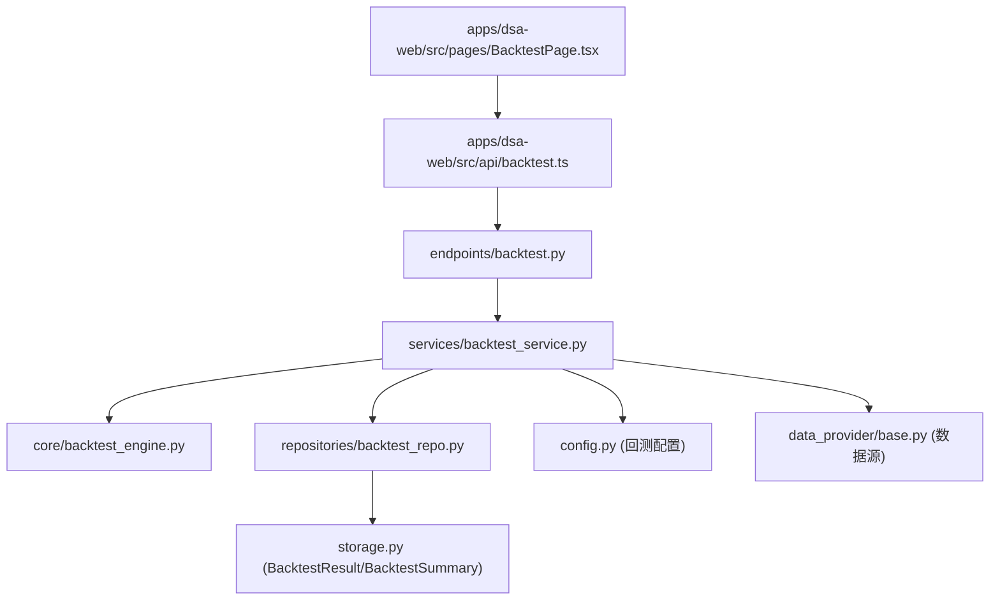

# 回测接口

<cite>
**本文档引用的文件**
- [api/v1/endpoints/backtest.py](file://api/v1/endpoints/backtest.py)
- [api/v1/schemas/backtest.py](file://api/v1/schemas/backtest.py)
- [src/services/backtest_service.py](file://src/services/backtest_service.py)
- [src/repositories/backtest_repo.py](file://src/repositories/backtest_repo.py)
- [src/core/backtest_engine.py](file://src/core/backtest_engine.py)
- [src/storage.py](file://src/storage.py)
- [src/config.py](file://src/config.py)
- [apps/dsa-web/src/api/backtest.ts](file://apps/dsa-web/src/api/backtest.ts)
- [apps/dsa-web/src/types/backtest.ts](file://apps/dsa-web/src/types/backtest.ts)
- [apps/dsa-web/src/pages/BacktestPage.tsx](file://apps/dsa-web/src/pages/BacktestPage.tsx)
- [data_provider/base.py](file://data_provider/base.py)
</cite>

## 目录
1. [简介](#简介)
2. [项目结构](#项目结构)
3. [核心组件](#核心组件)
4. [架构总览](#架构总览)
5. [详细组件分析](#详细组件分析)
6. [依赖关系分析](#依赖关系分析)
7. [性能考虑](#性能考虑)
8. [故障排查指南](#故障排查指南)
9. [结论](#结论)
10. [附录](#附录)

## 简介
本文件为回测接口的详细API文档，涵盖以下内容：
- 回测执行接口的HTTP方法、URL模式与请求参数
- 回测策略参数（时间范围、交易成本、初始资金等）与配置
- 回测结果数据结构（收益曲线、交易记录、统计指标）
- 回测任务状态查询机制（进度跟踪与结果获取）
- 单次回测与批量回测的区别与使用场景
- 回测结果可视化建议与性能分析工具
- 回测数据源与历史数据要求

## 项目结构
回测功能由后端FastAPI路由、服务层、引擎与存储层协同实现，并通过Web前端提供交互界面。

**图表来源**
- [api/v1/endpoints/backtest.py:25-161](file://api/v1/endpoints/backtest.py#L25-L161)
- [src/services/backtest_service.py:22-447](file://src/services/backtest_service.py#L22-L447)
- [src/core/backtest_engine.py:50-556](file://src/core/backtest_engine.py#L50-L556)
- [src/repositories/backtest_repo.py:21-222](file://src/repositories/backtest_repo.py#L21-L222)
- [src/storage.py:272-393](file://src/storage.py#L272-L393)
- [src/config.py:32-146](file://src/config.py#L32-L146)
- [data_provider/base.py:464-800](file://data_provider/base.py#L464-L800)
- [apps/dsa-web/src/api/backtest.ts:13-102](file://apps/dsa-web/src/api/backtest.ts#L13-L102)
- [apps/dsa-web/src/pages/BacktestPage.tsx:111-445](file://apps/dsa-web/src/pages/BacktestPage.tsx#L111-L445)

**章节来源**
- [api/v1/endpoints/backtest.py:25-161](file://api/v1/endpoints/backtest.py#L25-L161)
- [src/services/backtest_service.py:22-447](file://src/services/backtest_service.py#L22-L447)
- [src/core/backtest_engine.py:50-556](file://src/core/backtest_engine.py#L50-L556)
- [src/repositories/backtest_repo.py:21-222](file://src/repositories/backtest_repo.py#L21-L222)
- [src/storage.py:272-393](file://src/storage.py#L272-L393)
- [src/config.py:32-146](file://src/config.py#L32-L146)
- [data_provider/base.py:464-800](file://data_provider/base.py#L464-L800)
- [apps/dsa-web/src/api/backtest.ts:13-102](file://apps/dsa-web/src/api/backtest.ts#L13-L102)
- [apps/dsa-web/src/pages/BacktestPage.tsx:111-445](file://apps/dsa-web/src/pages/BacktestPage.tsx#L111-L445)

## 核心组件
- 路由与端点：提供回测执行、结果查询与整体/个股表现查询的REST接口。
- 服务层：协调候选分析记录筛选、引擎评估、数据填充、结果持久化与汇总重算。
- 引擎：基于每日OHLC数据的回测评估，计算方向预期、胜负结果、目标价命中与模拟收益。
- 仓储层：提供候选筛选、结果分页查询、汇总查询与UPSERT。
- 存储层：定义回测结果与汇总的ORM模型，支持SQLite。
- 配置：回测窗口、年龄阈值、引擎版本与中性带宽等参数。
- 数据源：统一的日线数据获取与标准化，支持多数据源自动切换与失败重试。
- 前端：提供回测页面，支持筛选、分页、运行回测与查看性能指标。

**章节来源**
- [api/v1/endpoints/backtest.py:28-161](file://api/v1/endpoints/backtest.py#L28-L161)
- [src/services/backtest_service.py:30-213](file://src/services/backtest_service.py#L30-L213)
- [src/core/backtest_engine.py:119-234](file://src/core/backtest_engine.py#L119-L234)
- [src/repositories/backtest_repo.py:27-124](file://src/repositories/backtest_repo.py#L27-L124)
- [src/storage.py:272-393](file://src/storage.py#L272-L393)
- [src/config.py:140-146](file://src/config.py#L140-L146)
- [data_provider/base.py:464-800](file://data_provider/base.py#L464-L800)
- [apps/dsa-web/src/api/backtest.ts:13-102](file://apps/dsa-web/src/api/backtest.ts#L13-L102)

## 架构总览
回测流程从历史分析记录出发，通过引擎评估未来N日收益与目标价命中情况，将结果写入backtest_results并计算backtest_summaries。前端通过API触发回测、分页查询结果与获取整体/个股性能指标。

**图表来源**
- [api/v1/endpoints/backtest.py:38-51](file://api/v1/endpoints/backtest.py#L38-L51)
- [src/services/backtest_service.py:30-213](file://src/services/backtest_service.py#L30-L213)
- [src/core/backtest_engine.py:119-234](file://src/core/backtest_engine.py#L119-L234)
- [src/repositories/backtest_repo.py:27-94](file://src/repositories/backtest_repo.py#L27-L94)
- [src/storage.py:272-393](file://src/storage.py#L272-L393)

**章节来源**
- [api/v1/endpoints/backtest.py:38-51](file://api/v1/endpoints/backtest.py#L38-L51)
- [src/services/backtest_service.py:30-213](file://src/services/backtest_service.py#L30-L213)
- [src/core/backtest_engine.py:119-234](file://src/core/backtest_engine.py#L119-L234)
- [src/repositories/backtest_repo.py:27-94](file://src/repositories/backtest_repo.py#L27-L94)
- [src/storage.py:272-393](file://src/storage.py#L272-L393)

## 详细组件分析

### 回测执行接口
- 方法与URL
  - POST /api/v1/backtest/run
- 请求体参数（BacktestRunRequest）
  - code: string（可选，仅回测指定股票）
  - force: boolean（可选，强制重新计算）
  - eval_window_days: integer（可选，评估窗口，交易日数）
  - min_age_days: integer（可选，分析记录最小天龄，0表示不限）
  - limit: integer（可选，最多处理的分析记录数）
- 响应体（BacktestRunResponse）
  - processed: number（候选记录数）
  - saved: number（写入回测结果数）
  - completed: number（完成回测数）
  - insufficient: number（数据不足数）
  - errors: number（错误数）

**图表来源**
- [api/v1/endpoints/backtest.py:28-57](file://api/v1/endpoints/backtest.py#L28-L57)
- [src/services/backtest_service.py:30-213](file://src/services/backtest_service.py#L30-L213)
- [src/core/backtest_engine.py:119-234](file://src/core/backtest_engine.py#L119-L234)

**章节来源**
- [api/v1/endpoints/backtest.py:28-57](file://api/v1/endpoints/backtest.py#L28-L57)
- [api/v1/schemas/backtest.py:11-25](file://api/v1/schemas/backtest.py#L11-L25)
- [src/services/backtest_service.py:30-213](file://src/services/backtest_service.py#L30-L213)

### 回测结果查询接口
- 方法与URL
  - GET /api/v1/backtest/results
- 查询参数
  - code: string（可选，按股票代码筛选）
  - eval_window_days: integer（可选，按评估窗口过滤）
  - page: integer（默认1，页码）
  - limit: integer（默认20，每页数量，上限200）
- 响应体（BacktestResultsResponse）
  - total: number（总数）
  - page: number（当前页）
  - limit: number（每页数量）
  - items: array（BacktestResultItem列表）

BacktestResultItem字段概览（部分）
- analysisHistoryId: number
- code: string
- analysisDate: string（可选）
- evalWindowDays: number
- engineVersion: string
- evalStatus: string
- evaluatedAt: string（可选）
- operationAdvice: string（可选）
- positionRecommendation: string（可选）
- startPrice: number（可选）
- endClose: number（可选）
- maxHigh: number（可选）
- minLow: number（可选）
- stockReturnPct: number（可选）
- directionExpected: string（可选）
- directionCorrect: boolean（可选）
- outcome: string（可选）
- stopLoss: number（可选）
- takeProfit: number（可选）
- hitStopLoss: boolean（可选）
- hitTakeProfit: boolean（可选）
- firstHit: string（可选）
- firstHitDate: string（可选）
- firstHitTradingDays: number（可选）
- simulatedEntryPrice: number（可选）
- simulatedExitPrice: number（可选）
- simulatedExitReason: string（可选）
- simulatedReturnPct: number（可选）

**章节来源**
- [api/v1/endpoints/backtest.py:60-92](file://api/v1/endpoints/backtest.py#L60-L92)
- [api/v1/schemas/backtest.py:27-62](file://api/v1/schemas/backtest.py#L27-L62)
- [src/repositories/backtest_repo.py:95-124](file://src/repositories/backtest_repo.py#L95-L124)

### 性能指标查询接口
- 方法与URL
  - GET /api/v1/backtest/performance
  - GET /api/v1/backtest/performance/{code}
- 查询参数
  - eval_window_days: integer（可选，按评估窗口过滤）
- 响应体（PerformanceMetrics）
  - scope: string
  - code: string（可选）
  - evalWindowDays: number
  - engineVersion: string
  - computedAt: string（可选）
  - totalEvaluations: number
  - completedCount: number
  - insufficientCount: number
  - longCount: number
  - cashCount: number
  - winCount: number
  - lossCount: number
  - neutralCount: number
  - directionAccuracyPct: number（可选）
  - winRatePct: number（可选）
  - neutralRatePct: number（可选）
  - avgStockReturnPct: number（可选）
  - avgSimulatedReturnPct: number（可选）
  - stopLossTriggerRate: number（可选）
  - takeProfitTriggerRate: number（可选）
  - ambiguousRate: number（可选）
  - avgDaysToFirstHit: number（可选）
  - adviceBreakdown: object（可选）
  - diagnostics: object（可选）

**章节来源**
- [api/v1/endpoints/backtest.py:95-161](file://api/v1/endpoints/backtest.py#L95-L161)
- [api/v1/schemas/backtest.py:65-95](file://api/v1/schemas/backtest.py#L65-L95)
- [src/services/backtest_service.py:220-239](file://src/services/backtest_service.py#L220-L239)

### 回测策略参数与配置
- 时间范围
  - eval_window_days：评估窗口（交易日数），默认来自配置项backtest_eval_window_days（默认10）
  - min_age_days：分析记录最小天龄（默认14），用于筛选候选
- 交易成本与中性带
  - neutral_band_pct：中性带百分比（默认2.0），用于区分胜负
  - engine_version：引擎版本（默认v1）
- 执行控制
  - code：限定股票代码
  - force：是否替换现有结果
  - limit：最大处理记录数（默认200）

**章节来源**
- [src/services/backtest_service.py:30-62](file://src/services/backtest_service.py#L30-L62)
- [src/config.py:140-146](file://src/config.py#L140-L146)

### 回测结果数据结构详解
- 单条回测结果（BacktestResultItem）
  - 基础信息：analysisHistoryId、code、analysisDate、evalWindowDays、engineVersion、evalStatus、evaluatedAt
  - 建议与方向：operationAdvice、positionRecommendation、directionExpected、directionCorrect
  - 价格与收益：startPrice、endClose、maxHigh、minLow、stockReturnPct、simulatedReturnPct
  - 结果分类：outcome（win/loss/neutral）、positionRecommendation（long/cash）
  - 止损止盈：stopLoss、takeProfit、hitStopLoss、hitTakeProfit、firstHit、firstHitDate、firstHitTradingDays
  - 模拟执行：simulatedEntryPrice、simulatedExitPrice、simulatedExitReason
- 汇总指标（PerformanceMetrics）
  - 计数：totalEvaluations、completedCount、insufficientCount、longCount、cashCount、winCount、lossCount、neutralCount
  - 准确率与胜率：directionAccuracyPct、winRatePct、neutralRatePct
  - 收益：avgStockReturnPct、avgSimulatedReturnPct
  - 目标价触发：stopLossTriggerRate、takeProfitTriggerRate、ambiguousRate、avgDaysToFirstHit
  - 诊断：adviceBreakdown、diagnostics

**章节来源**
- [api/v1/schemas/backtest.py:27-95](file://api/v1/schemas/backtest.py#L27-L95)
- [src/core/backtest_engine.py:237-349](file://src/core/backtest_engine.py#L237-L349)

### 回测任务状态查询机制
- 触发回测后，返回BacktestRunResponse，包含processed/saved/completed/insufficient/errors等统计
- 通过GET /api/v1/backtest/results分页查询回测结果
- 通过GET /api/v1/backtest/performance与GET /api/v1/backtest/performance/{code}获取整体/个股性能指标
- 前端页面BacktestPage集成上述API，支持筛选、分页与刷新

**图表来源**
- [api/v1/endpoints/backtest.py:28-161](file://api/v1/endpoints/backtest.py#L28-L161)
- [apps/dsa-web/src/pages/BacktestPage.tsx:138-191](file://apps/dsa-web/src/pages/BacktestPage.tsx#L138-L191)

**章节来源**
- [api/v1/endpoints/backtest.py:28-161](file://api/v1/endpoints/backtest.py#L28-L161)
- [apps/dsa-web/src/pages/BacktestPage.tsx:138-191](file://apps/dsa-web/src/pages/BacktestPage.tsx#L138-L191)

### 单次回测与批量回测
- 单次回测
  - 通过POST /api/v1/backtest/run触发，按参数筛选候选并评估
  - 适合快速验证策略或特定股票
- 批量回测
  - 通过limit参数扩大候选规模，结合min_age_days与eval_window_days进行大规模评估
  - 适合全市场或跨时间段的历史回测
- 使用建议
  - 单次：code+eval_window_days+force（首次或局部修正）
  - 批量：提高limit，配合分页查询与性能指标聚合

**章节来源**
- [api/v1/endpoints/backtest.py:28-57](file://api/v1/endpoints/backtest.py#L28-L57)
- [src/services/backtest_service.py:30-62](file://src/services/backtest_service.py#L30-L62)

### 回测结果可视化建议与性能分析工具
- 可视化建议
  - 收益曲线：使用折线图展示累计收益（参考T+0回测报告中的等价思路）
  - 胜负分布：柱状图展示win/loss/neutral分布
  - 目标价命中：饼图展示stop_loss/take_profit命中比例
  - 诊断热力图：按月/按股票的收益热力图
- 性能分析
  - 使用avgSimulatedReturnPct、winRatePct、stopLossTriggerRate、takeProfitTriggerRate等指标评估策略稳定性与有效性
  - 建议结合adviceBreakdown与diagnostics进行归因分析

（本节为概念性指导，不直接分析具体文件）

### 回测数据源与历史数据要求
- 数据源管理
  - DataFetcherManager统一管理多数据源，按优先级自动切换与失败重试
  - 支持A股、港股、美股等多市场日线数据获取
- 历史数据要求
  - 需要至少eval_window_days连续交易日的OHLC数据
  - 若数据不足，服务层会尝试自动补全日线数据
- 数据标准化
  - 统一列名：date、open、high、low、close、volume、amount、pct_chg
  - 计算技术指标：MA5、MA10、MA20、volume_ratio

**章节来源**
- [data_provider/base.py:464-800](file://data_provider/base.py#L464-L800)
- [src/services/backtest_service.py:271-289](file://src/services/backtest_service.py#L271-L289)
- [src/repositories/backtest_repo.py:114-124](file://src/repositories/backtest_repo.py#L114-L124)

## 依赖关系分析

**图表来源**
- [api/v1/endpoints/backtest.py:11-21](file://api/v1/endpoints/backtest.py#L11-L21)
- [src/services/backtest_service.py:22-28](file://src/services/backtest_service.py#L22-L28)
- [src/core/backtest_engine.py:14-17](file://src/core/backtest_engine.py#L14-L17)
- [src/repositories/backtest_repo.py:16-25](file://src/repositories/backtest_repo.py#L16-L25)
- [src/storage.py:272-393](file://src/storage.py#L272-L393)
- [src/config.py:32-146](file://src/config.py#L32-L146)
- [data_provider/base.py:464-800](file://data_provider/base.py#L464-L800)
- [apps/dsa-web/src/api/backtest.ts:13-102](file://apps/dsa-web/src/api/backtest.ts#L13-L102)
- [apps/dsa-web/src/pages/BacktestPage.tsx:111-191](file://apps/dsa-web/src/pages/BacktestPage.tsx#L111-L191)

**章节来源**
- [api/v1/endpoints/backtest.py:11-21](file://api/v1/endpoints/backtest.py#L11-L21)
- [src/services/backtest_service.py:22-28](file://src/services/backtest_service.py#L22-L28)
- [src/core/backtest_engine.py:14-17](file://src/core/backtest_engine.py#L14-L17)
- [src/repositories/backtest_repo.py:16-25](file://src/repositories/backtest_repo.py#L16-L25)
- [src/storage.py:272-393](file://src/storage.py#L272-L393)
- [src/config.py:32-146](file://src/config.py#L32-L146)
- [data_provider/base.py:464-800](file://data_provider/base.py#L464-L800)
- [apps/dsa-web/src/api/backtest.ts:13-102](file://apps/dsa-web/src/api/backtest.ts#L13-L102)
- [apps/dsa-web/src/pages/BacktestPage.tsx:111-191](file://apps/dsa-web/src/pages/BacktestPage.tsx#L111-L191)

## 性能考虑
- 批量写入：服务层采用批量保存BacktestResult，减少数据库往返开销
- 汇总重算：仅对受影响的股票与窗口重算汇总，避免全量重算
- 数据补全：在评估前尝试补全缺失日线数据，提高评估成功率
- 配置优化：通过配置项backtest_eval_window_days、backtest_min_age_days、backtest_neutral_band_pct等调节回测粒度与稳健性

（本节提供一般性指导）

## 故障排查指南
- 常见错误
  - 404：未找到整体/个股回测汇总
  - 500：回测执行失败，检查后端日志
- 前端处理
  - backtest.ts对404进行特殊处理（返回null），避免页面崩溃
  - BacktestPage.tsx提供错误弹窗与加载状态
- 建议排查步骤
  - 确认eval_window_days与min_age_days设置合理
  - 检查数据源可用性与网络状况
  - 查看回测结果状态（completed/insufficient/error）分布

**章节来源**
- [api/v1/endpoints/backtest.py:112-125](file://api/v1/endpoints/backtest.py#L112-L125)
- [apps/dsa-web/src/api/backtest.ts:74-79](file://apps/dsa-web/src/api/backtest.ts#L74-L79)
- [apps/dsa-web/src/pages/BacktestPage.tsx:147-153](file://apps/dsa-web/src/pages/BacktestPage.tsx#L147-L153)

## 结论
回测接口提供了从候选分析记录到回测结果与性能指标的完整链路，支持单次与批量回测、灵活的时间窗口与参数配置，并通过统一的数据源管理保障历史数据质量。前端页面提供直观的交互体验与可视化能力，便于策略验证与持续优化。

## 附录
- 前端类型定义与API封装
  - 类型定义：apps/dsa-web/src/types/backtest.ts
  - API封装：apps/dsa-web/src/api/backtest.ts
- 相关实现文件
  - 路由与端点：api/v1/endpoints/backtest.py
  - 服务层：src/services/backtest_service.py
  - 引擎：src/core/backtest_engine.py
  - 仓储层：src/repositories/backtest_repo.py
  - 存储层：src/storage.py
  - 配置：src/config.py
  - 数据源：data_provider/base.py

**章节来源**
- [apps/dsa-web/src/types/backtest.ts:8-64](file://apps/dsa-web/src/types/backtest.ts#L8-L64)
- [apps/dsa-web/src/api/backtest.ts:13-102](file://apps/dsa-web/src/api/backtest.ts#L13-L102)
- [api/v1/endpoints/backtest.py:28-161](file://api/v1/endpoints/backtest.py#L28-L161)
- [src/services/backtest_service.py:30-213](file://src/services/backtest_service.py#L30-L213)
- [src/core/backtest_engine.py:119-234](file://src/core/backtest_engine.py#L119-L234)
- [src/repositories/backtest_repo.py:27-124](file://src/repositories/backtest_repo.py#L27-L124)
- [src/storage.py:272-393](file://src/storage.py#L272-L393)
- [src/config.py:140-146](file://src/config.py#L140-L146)
- [data_provider/base.py:464-800](file://data_provider/base.py#L464-L800)