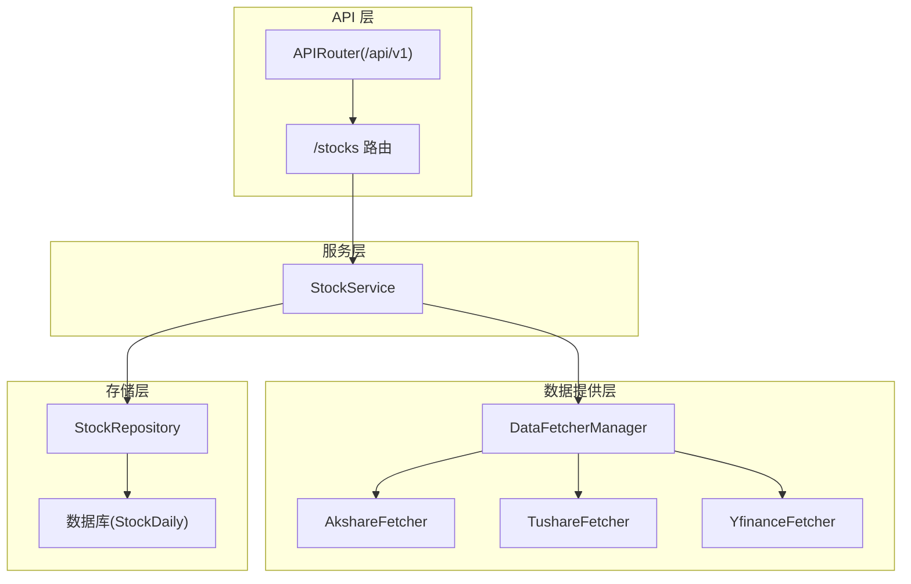
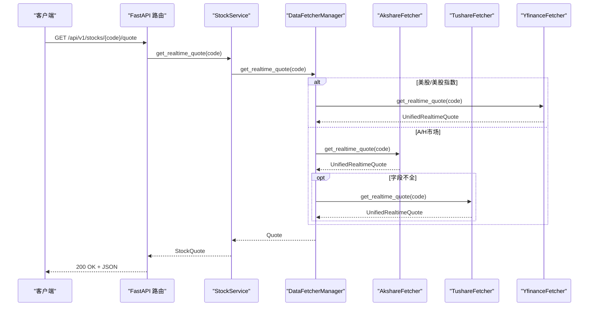
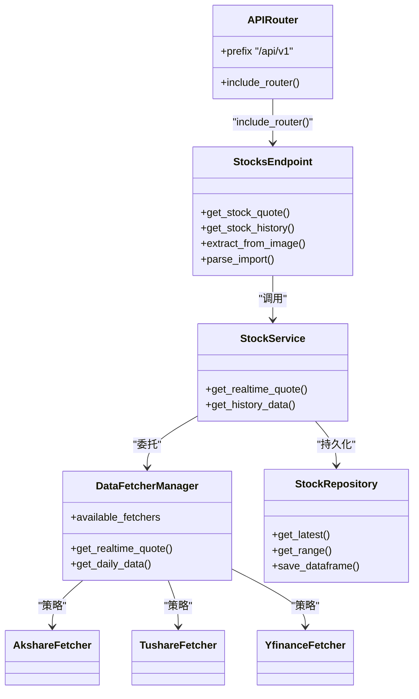

# 股票数据接口

<cite>
**本文档引用的文件**
- [api/v1/endpoints/stocks.py](file://api/v1/endpoints/stocks.py)
- [api/v1/schemas/stocks.py](file://api/v1/schemas/stocks.py)
- [api/v1/schemas/common.py](file://api/v1/schemas/common.py)
- [api/v1/router.py](file://api/v1/router.py)
- [src/services/stock_service.py](file://src/services/stock_service.py)
- [src/repositories/stock_repo.py](file://src/repositories/stock_repo.py)
- [data_provider/base.py](file://data_provider/base.py)
- [data_provider/akshare_fetcher.py](file://data_provider/akshare_fetcher.py)
- [data_provider/tushare_fetcher.py](file://data_provider/tushare_fetcher.py)
- [data_provider/yfinance_fetcher.py](file://data_provider/yfinance_fetcher.py)
- [data_provider/realtime_types.py](file://data_provider/realtime_types.py)
- [src/config.py](file://src/config.py)
</cite>

## 目录
1. [简介](#简介)
2. [项目结构](#项目结构)
3. [核心组件](#核心组件)
4. [架构总览](#架构总览)
5. [详细组件分析](#详细组件分析)
6. [依赖分析](#依赖分析)
7. [性能考虑](#性能考虑)
8. [故障排查指南](#故障排查指南)
9. [结论](#结论)
10. [附录](#附录)

## 简介
本文件为“股票数据接口”的详细API文档，面向后端服务使用者与前端集成开发者，涵盖以下内容：
- HTTP方法、URL模式与参数规范
- 股票代码格式要求与市场标识符
- 实时行情、历史K线与财务数据返回格式
- 数据精度与时间戳处理
- 数据更新频率与延迟说明
- 多市场支持（A股、港股、美股）的差异化处理
- 数据缓存策略与性能优化
- 数据订阅与增量更新机制说明

## 项目结构
后端采用FastAPI框架，API v1版本通过路由聚合器统一挂载至/api/v1前缀。股票相关接口位于/v1/stocks路径下，服务层封装数据获取逻辑，数据提供层基于策略模式管理多个数据源，并实现自动故障切换与缓存。

图表来源
- [api/v1/router.py:17-71](file://api/v1/router.py#L17-L71)
- [api/v1/endpoints/stocks.py:41-41](file://api/v1/endpoints/stocks.py#L41-L41)
- [src/services/stock_service.py:28-31](file://src/services/stock_service.py#L28-L31)
- [data_provider/base.py:464-497](file://data_provider/base.py#L464-L497)

章节来源
- [api/v1/router.py:17-71](file://api/v1/router.py#L17-L71)
- [api/v1/endpoints/stocks.py:41-41](file://api/v1/endpoints/stocks.py#L41-L41)

## 核心组件
- 股票接口路由：提供图片提取、CSV/Excel/剪贴板解析、实时行情查询、历史K线查询四个端点。
- 数据模型：定义实时行情、K线数据、提取结果与通用错误响应模型。
- 服务层：封装业务逻辑，协调数据提供层与存储层。
- 数据提供层：策略管理器统一调度多个数据源，实现自动故障切换与缓存。
- 配置中心：集中管理实时行情开关、缓存TTL、熔断冷却、数据源优先级等。

章节来源
- [api/v1/endpoints/stocks.py:14-39](file://api/v1/endpoints/stocks.py#L14-L39)
- [api/v1/schemas/stocks.py:17-112](file://api/v1/schemas/stocks.py#L17-L112)
- [src/services/stock_service.py:21-31](file://src/services/stock_service.py#L21-L31)
- [data_provider/base.py:464-497](file://data_provider/base.py#L464-L497)
- [src/config.py:162-178](file://src/config.py#L162-L178)

## 架构总览

图表来源
- [api/v1/endpoints/stocks.py:242-309](file://api/v1/endpoints/stocks.py#L242-L309)
- [src/services/stock_service.py:32-86](file://src/services/stock_service.py#L32-L86)
- [data_provider/base.py:984-1162](file://data_provider/base.py#L984-L1162)
- [data_provider/akshare_fetcher.py:1-200](file://data_provider/akshare_fetcher.py#L1-L200)
- [data_provider/tushare_fetcher.py:75-200](file://data_provider/tushare_fetcher.py#L75-L200)
- [data_provider/yfinance_fetcher.py:56-200](file://data_provider/yfinance_fetcher.py#L56-L200)

## 详细组件分析

### 实时行情接口
- HTTP方法与URL
  - 方法：GET
  - URL：/api/v1/stocks/{stock_code}/quote
  - 示例：/api/v1/stocks/600519/quote
- 路径参数
  - stock_code：股票代码（支持A股6位、港股5位及HK前缀、美股字母代码）
- 返回模型
  - StockQuote：包含股票代码、名称、当前价、涨跌额/百分比、开盘/最高/最低/昨收、成交量/成交额、更新时间等字段
- 错误处理
  - 404：未找到股票行情数据
  - 500：内部错误
- 数据精度与时间戳
  - 价格与金额为浮点数；成交量/成交额为可选；更新时间采用ISO格式字符串
- 多市场支持
  - 美股/美股指数：直接路由至YfinanceFetcher
  - A股/HK：按配置优先级选择数据源，必要时补充字段
- 缓存策略
  - 实时行情缓存TTL可通过配置项控制（默认秒级）
- 增量更新机制
  - 未实现WebSocket/Server-Sent Events的主动推送；可通过客户端轮询结合缓存TTL实现近似增量效果

章节来源
- [api/v1/endpoints/stocks.py:242-309](file://api/v1/endpoints/stocks.py#L242-L309)
- [api/v1/schemas/stocks.py:17-50](file://api/v1/schemas/stocks.py#L17-L50)
- [src/services/stock_service.py:32-86](file://src/services/stock_service.py#L32-L86)
- [data_provider/base.py:984-1162](file://data_provider/base.py#L984-L1162)
- [src/config.py:162-178](file://src/config.py#L162-L178)

### 历史K线接口
- HTTP方法与URL
  - 方法：GET
  - URL：/api/v1/stocks/{stock_code}/history
- 查询参数
  - period：K线周期，支持daily（weekly/monthly暂未实现）
  - days：获取天数，默认30，范围1~365
- 返回模型
  - StockHistoryResponse：包含股票代码/名称、周期、K线数据列表
  - K线数据：日期、开盘/最高/最低/收盘、成交量/成交额、涨跌幅
- 错误处理
  - 422：不支持的周期参数
  - 500：内部错误
- 数据精度与时间戳
  - 日期为字符串；价格/成交量为浮点数；涨跌幅百分比为浮点数
- 多市场支持
  - 美股/美股指数：通过YfinanceFetcher获取
  - A/H：通过各数据源获取并标准化
- 周期聚合
  - 当前仅支持daily；weekly/monthly聚合计划后续实现

章节来源
- [api/v1/endpoints/stocks.py:311-390](file://api/v1/endpoints/stocks.py#L311-L390)
- [api/v1/schemas/stocks.py:52-112](file://api/v1/schemas/stocks.py#L52-L112)
- [src/services/stock_service.py:88-161](file://src/services/stock_service.py#L88-L161)
- [data_provider/base.py:800-896](file://data_provider/base.py#L800-L896)

### 图片提取与导入解析接口
- 图片提取
  - 方法：POST
  - URL：/api/v1/stocks/extract-from-image
  - 表单字段：file（图片文件）
  - 查询参数：include_raw（是否包含原始LLM响应）
  - 返回：提取的股票代码列表与明细
- 导入解析
  - 方法：POST
  - URL：/api/v1/stocks/parse-import
  - 支持两种输入：
    - multipart/form-data + file：上传CSV/Excel文件
    - application/json + {"text": "..."}：粘贴文本
  - 返回：去重后的股票代码列表与明细

章节来源
- [api/v1/endpoints/stocks.py:47-122](file://api/v1/endpoints/stocks.py#L47-L122)
- [api/v1/endpoints/stocks.py:124-239](file://api/v1/endpoints/stocks.py#L124-L239)
- [api/v1/schemas/stocks.py:79-112](file://api/v1/schemas/stocks.py#L79-L112)

### 数据模型与通用响应
- 实时行情模型：StockQuote
- K线数据模型：KLineData
- 历史响应模型：StockHistoryResponse
- 通用错误模型：ErrorResponse
- 统一响应示例与字段说明见对应模型定义

章节来源
- [api/v1/schemas/stocks.py:17-112](file://api/v1/schemas/stocks.py#L17-L112)
- [api/v1/schemas/common.py:47-79](file://api/v1/schemas/common.py#L47-L79)

## 依赖分析

图表来源
- [api/v1/router.py:17-71](file://api/v1/router.py#L17-L71)
- [api/v1/endpoints/stocks.py:242-390](file://api/v1/endpoints/stocks.py#L242-L390)
- [src/services/stock_service.py:21-187](file://src/services/stock_service.py#L21-L187)
- [data_provider/base.py:464-902](file://data_provider/base.py#L464-L902)
- [src/repositories/stock_repo.py:24-162](file://src/repositories/stock_repo.py#L24-L162)

## 性能考虑
- 数据源策略与自动切换
  - 策略管理器按优先级尝试数据源，失败后自动切换，提升整体成功率与稳定性
- 缓存策略
  - 实时行情缓存：默认TTL可配置，降低重复请求与风控压力
  - 批量预取：在分析前对全量数据源进行一次性预取，提高后续查询命中率
- 防封禁与重试
  - 随机休眠、指数退避重试、熔断冷却等策略降低被反爬封禁概率
- 技术指标计算
  - 在数据标准化后计算MA与量比等指标，减少重复计算开销
- I/O与并发
  - 服务层使用线程池执行阻塞操作，避免阻塞事件循环

章节来源
- [data_provider/base.py:464-497](file://data_provider/base.py#L464-L497)
- [data_provider/base.py:572-610](file://data_provider/base.py#L572-L610)
- [data_provider/base.py:903-982](file://data_provider/base.py#L903-L982)
- [data_provider/akshare_fetcher.py:75-92](file://data_provider/akshare_fetcher.py#L75-L92)
- [data_provider/tushare_fetcher.py:115-146](file://data_provider/tushare_fetcher.py#L115-L146)
- [src/config.py:162-178](file://src/config.py#L162-L178)

## 故障排查指南
- 常见错误
  - 400：图片类型不支持、文件过大、JSON解析失败、未提供文件或text
  - 404：实时行情未找到
  - 422：历史周期参数不支持
  - 500：内部错误
- 定位步骤
  - 检查股票代码格式与市场标识符是否符合预期
  - 查看数据源优先级与可用性（可通过策略管理器查看）
  - 关注缓存命中与预取状态
  - 检查网络与代理设置、Token配置
- 建议
  - 优先使用稳定数据源（如腾讯/新浪直连）
  - 合理设置缓存TTL与预取阈值
  - 对批量请求增加退避与熔断保护

章节来源
- [api/v1/endpoints/stocks.py:67-121](file://api/v1/endpoints/stocks.py#L67-L121)
- [api/v1/endpoints/stocks.py:145-232](file://api/v1/endpoints/stocks.py#L145-L232)
- [api/v1/endpoints/stocks.py:274-308](file://api/v1/endpoints/stocks.py#L274-L308)
- [api/v1/endpoints/stocks.py:372-389](file://api/v1/endpoints/stocks.py#L372-L389)

## 结论
本API提供了完整的股票数据查询能力，覆盖实时行情与历史K线两大核心场景，并针对A股、港股、美股多市场进行了差异化处理。通过策略化数据源管理、缓存与预取、防封禁与重试等机制，系统在稳定性与性能之间取得平衡。建议在生产环境中合理配置缓存与预取策略，并结合客户端轮询实现近似增量更新体验。

## 附录

### 股票代码格式与市场标识符
- A股：6位数字（如600519、000001）
- 港股：5位数字（如00700）或带HK前缀（如HK00700）
- 美股：1-5个大写字母（如AAPL、TSLA），美股指数通过专用映射识别
- 其他：BJ920748（北交所）

章节来源
- [data_provider/base.py:65-116](file://data_provider/base.py#L65-L116)
- [data_provider/base.py:121-144](file://data_provider/base.py#L121-L144)
- [data_provider/yfinance_fetcher.py:81-152](file://data_provider/yfinance_fetcher.py#L81-L152)

### 数据返回格式要点
- 实时行情：包含价格、涨跌、量价指标、估值指标等字段，缺失字段以空值表示
- 历史K线：标准化列名（date/open/high/low/close/volume/amount/pct_chg），并计算MA与量比
- 财务数据：未在本接口直接暴露，可通过其他端点或扩展实现

章节来源
- [api/v1/schemas/stocks.py:17-112](file://api/v1/schemas/stocks.py#L17-L112)
- [data_provider/base.py:266-450](file://data_provider/base.py#L266-L450)

### 时间戳与精度说明
- 时间戳：实时行情返回为ISO格式字符串；历史K线日期为字符串
- 精度：价格与金额为浮点数；成交量/成交额为可选；涨跌幅百分比为浮点数

章节来源
- [api/v1/schemas/stocks.py:17-112](file://api/v1/schemas/stocks.py#L17-L112)
- [src/services/stock_service.py:130-147](file://src/services/stock_service.py#L130-L147)

### 更新频率与延迟
- 实时行情：缓存TTL可配置；批量预取可显著降低首次查询延迟
- 历史K线：按请求天数获取，受数据源可用性影响

章节来源
- [src/config.py:162-178](file://src/config.py#L162-L178)
- [data_provider/base.py:903-982](file://data_provider/base.py#L903-L982)

### 多市场差异化处理
- 美股/美股指数：直接路由至YfinanceFetcher，处理代码格式转换与数据差异
- A股/HK：按配置优先级选择数据源，必要时进行字段补充

章节来源
- [data_provider/base.py:814-858](file://data_provider/base.py#L814-L858)
- [data_provider/base.py:1016-1066](file://data_provider/base.py#L1016-L1066)
- [data_provider/yfinance_fetcher.py:81-152](file://data_provider/yfinance_fetcher.py#L81-L152)

### 数据订阅与增量更新
- 当前未提供WebSocket/Server-Sent Events的主动推送
- 建议客户端轮询结合缓存TTL实现近似增量更新；也可在前端使用事件流（SSE）监听任务状态变化

章节来源
- [api/v1/endpoints/stocks.py:242-309](file://api/v1/endpoints/stocks.py#L242-L309)
- [apps/dsa-web/src/hooks/useTaskStream.ts:162-213](file://apps/dsa-web/src/hooks/useTaskStream.ts#L162-L213)