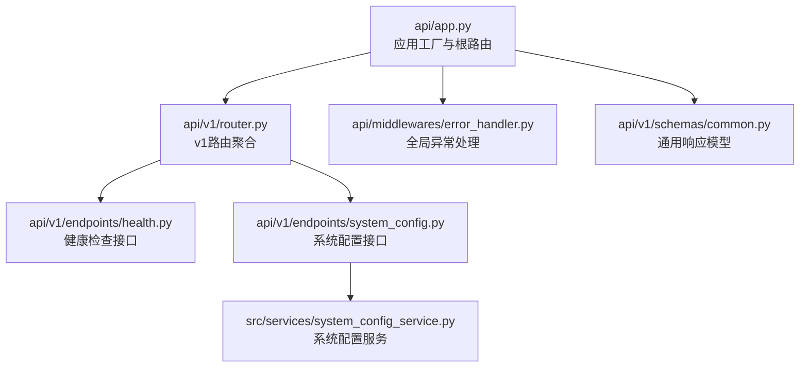
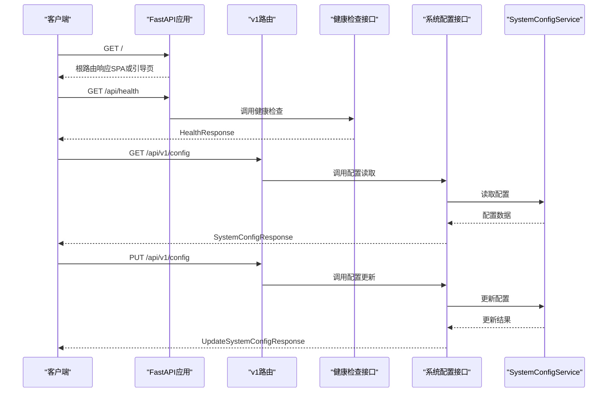

# 通用接口

<cite>
**本文引用的文件**
- [api/app.py](file://api/app.py)
- [api/v1/router.py](file://api/v1/router.py)
- [api/v1/endpoints/health.py](file://api/v1/endpoints/health.py)
- [api/v1/schemas/common.py](file://api/v1/schemas/common.py)
- [api/middlewares/error_handler.py](file://api/middlewares/error_handler.py)
- [api/v1/endpoints/system_config.py](file://api/v1/endpoints/system_config.py)
- [src/services/system_config_service.py](file://src/services/system_config_service.py)
- [main.py](file://main.py)
- [requirements.txt](file://requirements.txt)
- [README.md](file://README.md)
- [docs/DEPLOY.md](file://docs/DEPLOY.md)
</cite>

## 目录
1. [简介](#简介)
2. [项目结构](#项目结构)
3. [核心组件](#核心组件)
4. [架构总览](#架构总览)
5. [详细组件分析](#详细组件分析)
6. [依赖分析](#依赖分析)
7. [性能考虑](#性能考虑)
8. [故障排查指南](#故障排查指南)
9. [结论](#结论)
10. [附录](#附录)

## 简介
本文件为“通用接口”的API文档，聚焦于健康检查接口、系统状态监控机制、根路由的两种模式（前端SPA模式与API文档模式）、系统信息查询接口（版本信息、运行时间、配置摘要）、错误处理与异常响应格式，以及监控集成与告警配置建议，并记录API文档自动生成与Swagger集成机制。文档基于实际代码实现进行梳理，确保技术细节与使用方式准确可靠。

## 项目结构
后端采用FastAPI框架，核心入口位于api/app.py，路由在api/v1/router.py中聚合，健康检查接口在api/v1/endpoints/health.py中实现，统一响应模型在api/v1/schemas/common.py中定义，全局异常处理在api/middlewares/error_handler.py中实现。系统配置查询接口位于api/v1/endpoints/system_config.py，服务层在src/services/system_config_service.py中实现。

图表来源
- [api/app.py:48-204](file://api/app.py#L48-L204)
- [api/v1/router.py:12-72](file://api/v1/router.py#L12-L72)
- [api/v1/endpoints/health.py:18-35](file://api/v1/endpoints/health.py#L18-L35)
- [api/v1/endpoints/system_config.py:28-215](file://api/v1/endpoints/system_config.py#L28-L215)
- [api/middlewares/error_handler.py:24-129](file://api/middlewares/error_handler.py#L24-L129)
- [api/v1/schemas/common.py:17-79](file://api/v1/schemas/common.py#L17-L79)
- [src/services/system_config_service.py:55-284](file://src/services/system_config_service.py#L55-L284)

章节来源
- [api/app.py:48-204](file://api/app.py#L48-L204)
- [api/v1/router.py:12-72](file://api/v1/router.py#L12-L72)

## 核心组件
- 应用工厂与根路由：负责创建FastAPI实例、注册CORS、认证中间件、错误处理器、根路由与健康检查接口，并根据是否存在前端静态资源决定根路由行为（SPA模式或API文档模式）。
- 路由聚合：将各模块路由统一挂载到/api/v1前缀下。
- 健康检查接口：提供轻量级健康检查，返回服务状态与时间戳。
- 系统配置接口：提供读取、更新、校验与LLM通道测试能力，返回结构化配置与Schema元数据。
- 错误处理：统一捕获未处理异常与HTTP异常，返回标准化错误响应。

章节来源
- [api/app.py:48-204](file://api/app.py#L48-L204)
- [api/v1/router.py:12-72](file://api/v1/router.py#L12-L72)
- [api/v1/endpoints/health.py:18-35](file://api/v1/endpoints/health.py#L18-L35)
- [api/v1/endpoints/system_config.py:28-215](file://api/v1/endpoints/system_config.py#L28-L215)
- [api/middlewares/error_handler.py:24-129](file://api/middlewares/error_handler.py#L24-L129)

## 架构总览
后端服务启动后，通过应用工厂创建FastAPI实例，注册CORS、认证与错误处理中间件，挂载v1路由，随后注册根路由与健康检查接口。根路由根据是否存在前端静态资源决定返回SPA页面或引导页面；健康检查接口返回标准健康响应。系统配置接口通过依赖注入获取SystemConfigService，提供配置读取、更新、校验与LLM通道测试。

图表来源
- [api/app.py:121-173](file://api/app.py#L121-L173)
- [api/v1/endpoints/health.py:21-34](file://api/v1/endpoints/health.py#L21-L34)
- [api/v1/endpoints/system_config.py:42-112](file://api/v1/endpoints/system_config.py#L42-L112)
- [src/services/system_config_service.py:74-284](file://src/services/system_config_service.py#L74-L284)

## 详细组件分析

### 健康检查接口
- HTTP方法：GET
- URL模式：/api/health
- 响应格式：HealthResponse
  - 字段：status（字符串，服务状态）、timestamp（字符串，ISO时间戳，可选）
- 用途：供负载均衡器或监控系统检查服务状态
- 实现要点：返回固定状态“ok”与当前时间戳，不涉及数据库连接、外部API可用性或资源使用情况检查

章节来源
- [api/app.py:161-173](file://api/app.py#L161-L173)
- [api/v1/endpoints/health.py:21-34](file://api/v1/endpoints/health.py#L21-L34)
- [api/v1/schemas/common.py:32-45](file://api/v1/schemas/common.py#L32-L45)

### 根路由（根页面）
- 根路由：/
- 两种模式：
  - 前端SPA模式：当存在前端静态资源时，根路由返回前端入口页面（index.html），并支持SPA回退逻辑，非API路由均返回index.html。
  - API文档模式：当前端静态资源不存在时，根路由返回引导页面，提示API已运行但前端未构建，并提供API文档入口与健康检查链接。
- SPA回退：对非/api前缀的路径尝试返回对应静态文件，否则返回index.html，避免前端路由刷新404。
- 该模式与健康检查接口共同构成基础的系统状态可见性与API文档入口。

章节来源
- [api/app.py:121-203](file://api/app.py#L121-L203)

### 系统配置查询接口
- GET /api/v1/config
  - 功能：读取当前配置（可选包含Schema元数据）
  - 响应：SystemConfigResponse
  - 参数：include_schema（布尔，是否包含Schema元数据）
  - 异常：500时返回ErrorResponse
- PUT /api/v1/config
  - 功能：更新配置键值对，支持掩码保护敏感值
  - 响应：UpdateSystemConfigResponse
  - 请求体：UpdateSystemConfigRequest（包含config_version、items、mask_token、reload_now）
  - 异常：400（校验失败，返回SystemConfigValidationErrorResponse）、409（版本冲突，返回SystemConfigConflictResponse）、500（内部错误，返回ErrorResponse）
- POST /api/v1/config/validate
  - 功能：预保存校验配置值（不写入.env）
  - 响应：ValidateSystemConfigResponse
  - 异常：500时返回ErrorResponse
- POST /api/v1/config/llm/test-channel
  - 功能：测试单个LLM通道（不写入.env）
  - 响应：TestLLMChannelResponse
  - 异常：422（参数校验失败，返回ErrorResponse）、500（内部错误，返回ErrorResponse）
- GET /api/v1/config/schema
  - 功能：返回分类后的字段元数据，用于动态表单渲染
  - 响应：SystemConfigSchemaResponse
  - 异常：500时返回ErrorResponse

章节来源
- [api/v1/endpoints/system_config.py:31-215](file://api/v1/endpoints/system_config.py#L31-L215)
- [src/services/system_config_service.py:55-800](file://src/services/system_config_service.py#L55-L800)

### 错误处理与异常响应格式
- 全局异常处理中间件：捕获未处理异常，记录错误日志并返回统一格式的JSON响应（500，包含error、message、detail）。
- HTTP异常处理：将HTTPException转换为统一格式的JSON响应（包含error、message、detail）。
- 请求验证异常处理：将RequestValidationError转换为统一格式的JSON响应（422，包含error、message、detail）。
- 通用异常处理：捕获所有未处理异常，记录堆栈并返回统一格式的JSON响应（500）。

章节来源
- [api/middlewares/error_handler.py:24-129](file://api/middlewares/error_handler.py#L24-L129)

### API文档自动生成与Swagger集成机制
- FastAPI内置：应用工厂中创建FastAPI实例时，已配置title、description、version等元信息，因此Swagger/OpenAPI文档会自动生成。
- 文档入口：根路由在API文档模式下提供引导页面，其中包含指向/docs的链接；在SPA模式下，可通过/docs访问交互式API文档。
- 交互式文档：支持在浏览器中直接调用接口、查看请求/响应示例与Schema。

章节来源
- [api/app.py:63-76](file://api/app.py#L63-L76)
- [api/app.py:156-159](file://api/app.py#L156-L159)

## 依赖分析
- FastAPI与uvicorn：后端Web框架与ASGI服务器，用于提供HTTP服务与API文档。
- SQLAlchemy：ORM数据库操作，用于数据持久化。
- 数据源依赖：多源策略（efinance、akshare、tushare、pytdx、baostock、yfinance等），用于行情与新闻数据获取。
- AI分析：litellm统一客户端，支持多种LLM提供商。
- 搜索引擎：tavily-python、google-search-results等，用于新闻搜索。
- 通知渠道：飞书、Telegram、企业微信、Discord等，通过Webhook或SDK推送。

章节来源
- [requirements.txt:61-65](file://requirements.txt#L61-L65)
- [requirements.txt:8-19](file://requirements.txt#L8-L19)
- [requirements.txt:32-35](file://requirements.txt#L32-L35)
- [requirements.txt:38-39](file://requirements.txt#L38-L39)
- [requirements.txt:22,47,52](file://requirements.txt#L22,L47,L52)

## 性能考虑
- 健康检查接口为轻量级接口，不涉及数据库连接、外部API调用或资源占用，适合高频探测。
- 根路由SPA模式下，静态文件托管与MIME类型解析优化了前端资源加载体验。
- 系统配置接口在更新时可能触发运行时单例重载与配置重载，建议在低峰时段执行批量更新。
- 外部API调用（如LLM通道测试）具有网络延迟与超时风险，建议在接口中设置合理超时与重试策略。

[本节为一般性指导，不直接分析具体文件]

## 故障排查指南
- 健康检查失败
  - 检查服务进程是否正常运行（进程状态、端口占用）。
  - 使用curl或浏览器访问/health确认响应。
  - 查看应用日志定位异常。
- 根路由无法访问前端页面
  - 确认前端静态资源已构建并存在于指定目录。
  - 检查SPA回退逻辑，确认非API路由正确返回index.html。
- 系统配置接口异常
  - 400：检查请求体格式与字段类型，查看校验错误详情。
  - 409：配置版本冲突，需先重新加载配置再重试。
  - 500：查看服务端错误日志，确认配置文件写入与重载过程。
- API文档不可用
  - 确认FastAPI实例已创建并包含title、description、version等元信息。
  - 访问/docs查看交互式文档。

章节来源
- [api/middlewares/error_handler.py:82-128](file://api/middlewares/error_handler.py#L82-L128)
- [api/app.py:121-203](file://api/app.py#L121-L203)
- [docs/DEPLOY.md:250-258](file://docs/DEPLOY.md#L250-L258)

## 结论
本通用接口文档围绕健康检查、根路由模式、系统配置查询与错误处理进行了系统化梳理，并结合实际代码实现了API文档自动生成与Swagger集成机制的说明。对于系统状态监控，当前健康检查接口为轻量级状态指示，如需更全面的数据库连接、外部API可用性与资源使用情况监控，建议在业务接口中扩展相应的健康检查与指标上报机制，并结合Prometheus/Grafana等监控体系进行集成。

[本节为总结性内容，不直接分析具体文件]

## 附录

### 健康检查接口规范
- 方法：GET
- 路径：/api/health
- 成功响应：HealthResponse
  - 字段：status（固定为“ok”）、timestamp（ISO时间戳）
- 失败响应：统一错误响应格式（见“错误处理与异常响应格式”）

章节来源
- [api/app.py:161-173](file://api/app.py#L161-L173)
- [api/v1/schemas/common.py:32-45](file://api/v1/schemas/common.py#L32-L45)

### 根路由与API文档入口
- 根路由：/
  - 存在前端静态资源：返回SPA页面，支持非API路由回退至index.html
  - 不存在前端静态资源：返回引导页面，包含/docs与/api/health链接
- API文档：/docs（交互式OpenAPI文档）

章节来源
- [api/app.py:121-203](file://api/app.py#L121-L203)

### 系统配置接口一览
- GET /api/v1/config
  - 查询当前配置（可选包含Schema元数据）
- PUT /api/v1/config
  - 更新配置（支持掩码保护敏感值）
- POST /api/v1/config/validate
  - 预保存校验配置
- POST /api/v1/config/llm/test-channel
  - 测试单个LLM通道
- GET /api/v1/config/schema
  - 返回分类后的字段元数据

章节来源
- [api/v1/endpoints/system_config.py:31-215](file://api/v1/endpoints/system_config.py#L31-L215)

### 错误处理与异常响应格式
- HTTP异常：返回包含error、message、detail的JSON
- 请求验证异常：返回包含error、message、detail的JSON（422）
- 通用异常：返回包含error、message、detail的JSON（500）

章节来源
- [api/middlewares/error_handler.py:82-128](file://api/middlewares/error_handler.py#L82-L128)

### 监控集成与告警配置建议
- 健康检查：定期探测/api/health，设置成功率阈值与延迟阈值告警
- API文档：通过/docs暴露接口元信息，便于自动化测试与变更追踪
- 日志与指标：结合部署文档中的日志查看与定期维护建议，建立日志聚合与指标采集
- 外部API可用性：在业务接口中增加外部API可用性探测与降级策略，结合告警系统进行通知

章节来源
- [docs/DEPLOY.md:238-268](file://docs/DEPLOY.md#L238-L268)