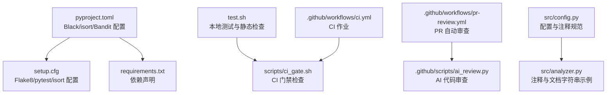
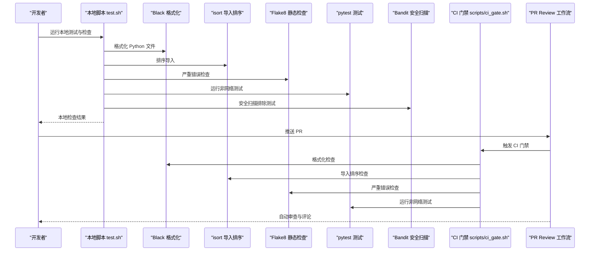
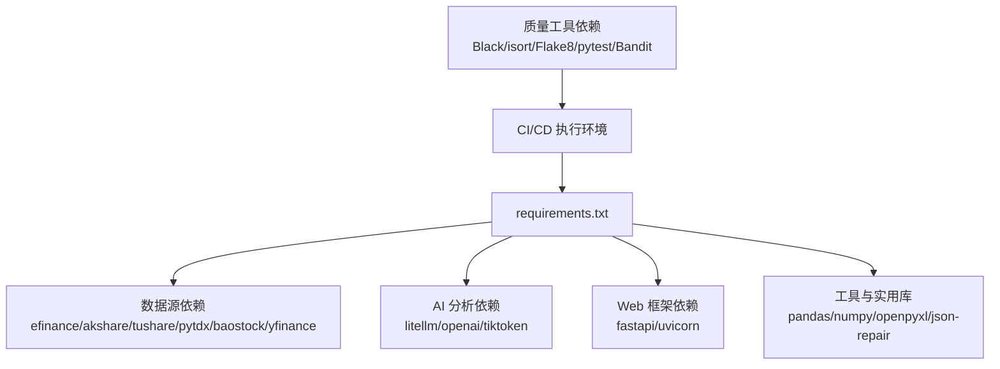

# 代码规范与质量

<cite>
**本文档引用的文件**
- [pyproject.toml](file://pyproject.toml)
- [setup.cfg](file://setup.cfg)
- [requirements.txt](file://requirements.txt)
- [test.sh](file://test.sh)
- [.github/workflows/ci.yml](file://.github/workflows/ci.yml)
- [.github/workflows/pr-review.yml](file://.github/workflows/pr-review.yml)
- [scripts/ci_gate.sh](file://scripts/ci_gate.sh)
- [.github/scripts/ai_review.py](file://.github/scripts/ai_review.py)
- [src/config.py](file://src/config.py)
- [src/analyzer.py](file://src/analyzer.py)
</cite>

## 目录
1. [引言](#引言)
2. [项目结构](#项目结构)
3. [核心组件](#核心组件)
4. [架构总览](#架构总览)
5. [详细组件分析](#详细组件分析)
6. [依赖分析](#依赖分析)
7. [性能考虑](#性能考虑)
8. [故障排查指南](#故障排查指南)
9. [结论](#结论)
10. [附录](#附录)

## 引言
本文件面向项目贡献者与维护者，系统化梳理本项目的代码规范与质量保障体系，涵盖以下方面：
- Black 代码格式化工具的配置与使用
- isort 导入排序工具的配置与使用
- Bandit 安全扫描工具的配置与策略
- 代码质量检查流程、静态分析工具使用与覆盖率要求
- 编码约定、命名规范与注释标准
- IDE 配置建议与自动化代码检查工具设置

## 项目结构
项目采用多语言混合架构，后端以 Python 为主，前端使用 TypeScript/Vue，CI/CD 通过 GitHub Actions 实现。关键的质量工具配置集中在 pyproject.toml 与 setup.cfg 中，测试与静态检查脚本位于根目录与 scripts 目录。

图表来源
- [pyproject.toml:1-29](file://pyproject.toml#L1-L29)
- [setup.cfg:1-34](file://setup.cfg#L1-L34)
- [requirements.txt:1-65](file://requirements.txt#L1-L65)
- [test.sh:1-387](file://test.sh#L1-L387)
- [scripts/ci_gate.sh:1-21](file://scripts/ci_gate.sh#L1-L21)
- [.github/workflows/ci.yml:1-109](file://.github/workflows/ci.yml#L1-L109)
- [.github/workflows/pr-review.yml:1-449](file://.github/workflows/pr-review.yml#L1-L449)
- [.github/scripts/ai_review.py:249-293](file://.github/scripts/ai_review.py#L249-L293)
- [src/config.py:1-580](file://src/config.py#L1-L580)
- [src/analyzer.py:1-1539](file://src/analyzer.py#L1-L1539)

章节来源
- [pyproject.toml:1-29](file://pyproject.toml#L1-L29)
- [setup.cfg:1-34](file://setup.cfg#L1-L34)
- [requirements.txt:1-65](file://requirements.txt#L1-L65)
- [test.sh:1-387](file://test.sh#L1-L387)
- [.github/workflows/ci.yml:1-109](file://.github/workflows/ci.yml#L1-L109)
- [.github/workflows/pr-review.yml:1-449](file://.github/workflows/pr-review.yml#L1-L449)
- [scripts/ci_gate.sh:1-21](file://scripts/ci_gate.sh#L1-L21)
- [.github/scripts/ai_review.py:249-293](file://.github/scripts/ai_review.py#L249-L293)
- [src/config.py:1-580](file://src/config.py#L1-L580)
- [src/analyzer.py:1-1539](file://src/analyzer.py#L1-L1539)

## 核心组件
- Black 代码格式化：统一缩进、引号、行长度与导入排序风格，提升一致性与可读性。
- isort 导入排序：按 profile=black 与行长度 120 排序，跳过特定目录，保证导入顺序一致。
- Flake8 静态检查：行长度 120，忽略与 Black 冲突的规则，聚焦关键错误。
- pytest 测试框架：标记单元/集成/网络测试，便于选择性执行。
- Bandit 安全扫描：排除测试目录与特定规则，聚焦生产代码安全。
- CI/CD 自动化：PR 审查与 CI 门禁，确保提交质量与安全性。

章节来源
- [pyproject.toml:1-29](file://pyproject.toml#L1-L29)
- [setup.cfg:1-34](file://setup.cfg#L1-L34)
- [.github/workflows/ci.yml:41-60](file://.github/workflows/ci.yml#L41-L60)
- [.github/workflows/pr-review.yml:82-177](file://.github/workflows/pr-review.yml#L82-L177)

## 架构总览
下图展示了从本地开发到 CI/CD 的质量检查链路，包括 Black、isort、Flake8、pytest 与 Bandit 的协同。

图表来源
- [test.sh:243-286](file://test.sh#L243-L286)
- [scripts/ci_gate.sh:5-21](file://scripts/ci_gate.sh#L5-L21)
- [.github/workflows/ci.yml:58-60](file://.github/workflows/ci.yml#L58-L60)
- [.github/workflows/pr-review.yml:136-177](file://.github/workflows/pr-review.yml#L136-L177)

## 详细组件分析

### Black 代码格式化配置与使用
- 行长度限制：120
- 目标 Python 版本：py310、py311、py312
- 包含/排除规则：包含 .py/.pyi，排除 .git、.hg、.mypy_cache、.tox、.venv、venv、_build、buck-out、build、dist、__pycache__ 等目录
- 使用方式：本地通过 Black 对 Python 文件执行格式化；CI 中可作为门禁步骤检查格式一致性

章节来源
- [pyproject.toml:1-19](file://pyproject.toml#L1-L19)
- [test.sh:248-254](file://test.sh#L248-L254)
- [scripts/ci_gate.sh:5-9](file://scripts/ci_gate.sh#L5-L9)

### isort 导入排序配置与使用
- profile：black
- 行长度：120
- 跳过目录：.git、__pycache__、.env、venv、.venv
- 首发模块分组：known_first_party = config,storage,analyzer,notification,scheduler,search_service,market_analyzer,stock_analyzer,data_provider
- 使用方式：本地执行 isort 排序；CI 中可作为门禁步骤检查导入顺序

章节来源
- [pyproject.toml:21-24](file://pyproject.toml#L21-L24)
- [setup.cfg:29-33](file://setup.cfg#L29-L33)
- [test.sh:248-254](file://test.sh#L248-L254)
- [scripts/ci_gate.sh:5-9](file://scripts/ci_gate.sh#L5-L9)

### Flake8 静态检查配置与使用
- 行长度：120
- 排除目录：.git、__pycache__、.env、venv、.venv、.venv*、build、dist、*.egg-info
- 忽略规则：E501（行过长）、W503（换行前运算符）、E203（切片前空格）、E402（模块级导入不在顶部）
- 严重错误检查：CI 中使用 --select=E9,F63,F7,F82 专项检查

章节来源
- [setup.cfg:1-17](file://setup.cfg#L1-L17)
- [.github/workflows/pr-review.yml:163-176](file://.github/workflows/pr-review.yml#L163-L176)
- [scripts/ci_gate.sh:11-12](file://scripts/ci_gate.sh#L11-L12)

### pytest 测试框架与标记
- 测试路径：当前目录
- 测试文件匹配：test_*.py
- 测试函数匹配：test_*
- 运行选项：-v --tb=short
- 标记：
  - unit：快速离线单元测试
  - integration：无外部网络依赖的服务级集成测试
  - network：需要外部网络或第三方服务的测试

章节来源
- [setup.cfg:19-28](file://setup.cfg#L19-L28)
- [scripts/ci_gate.sh:18-20](file://scripts/ci_gate.sh#L18-L20)

### Bandit 安全扫描配置与策略
- 排除目录：tests、test_*.py
- 跳过规则：B101（assert 语句在测试中允许）

章节来源
- [pyproject.toml:26-29](file://pyproject.toml#L26-L29)
- [.github/workflows/pr-review.yml:163-176](file://.github/workflows/pr-review.yml#L163-L176)

### 本地测试与静态检查流程（test.sh）
- 语法检查：py_compile 检查指定文件
- Flake8 严重错误检查：--select=F821,E999 --max-line-length=120
- 代码识别测试：股票代码识别逻辑
- YFinance 代码转换测试：代码转换逻辑
- 其他测试：dry-run、quick、full 等场景

章节来源
- [test.sh:243-286](file://test.sh#L243-L286)

### CI 门禁检查（scripts/ci_gate.sh）
- Python 语法检查：对多个模块与数据提供者文件执行 py_compile
- Flake8 严重错误检查：--select=E9,F63,F7,F82
- 本地确定性检查：代码识别与 YFinance 转换测试
- 非网络测试套件：pytest -m "not network"

章节来源
- [scripts/ci_gate.sh:5-21](file://scripts/ci_gate.sh#L5-L21)
- [.github/workflows/ci.yml:58-60](file://.github/workflows/ci.yml#L58-L60)

### PR 自动审查（.github/workflows/pr-review.yml）
- 安全检查：检测敏感文件修改（.github/workflows/*.yml、.github/scripts/*.py），必要时需要人工审核
- 静态检查：语法检查与 Flake8 严重错误检查
- AI 代码审查：基于变更差异进行语义审查，支持严格模式
- 标签与评论：自动添加标签与生成审查报告

章节来源
- [.github/workflows/pr-review.yml:40-177](file://.github/workflows/pr-review.yml#L40-L177)
- [.github/scripts/ai_review.py:252-293](file://.github/scripts/ai_review.py#L252-L293)

### 编码约定、命名规范与注释标准
- 文件头部注释：模块级文档字符串，说明模块职责与设计要点
- 类与函数注释：使用清晰的 docstring，描述用途、参数、返回值与异常
- 配置类注释：dataclass 配置类包含字段说明与默认值，便于理解
- AI 分析器注释：系统提示词与输出格式要求，强调核心结论、持仓建议、狙击点位与检查清单
- 日志注释：INFO/DEBUG 级别日志区分摘要与完整内容，便于定位问题

章节来源
- [src/config.py:1-580](file://src/config.py#L1-L580)
- [src/analyzer.py:1-1539](file://src/analyzer.py#L1-L1539)

### IDE 配置建议
- Python 格式化：配置 IDE 使用 Black，行长度 120，目标版本 py310-py312
- 导入排序：配置 isort，profile=black，行长度 120，跳过 .git/__pycache__/venv/.venv
- 静态检查：启用 Flake8，行长度 120，忽略与 Black 冲突的规则
- 测试运行：使用 pytest 标记运行 unit/integration/network 测试
- Git 钩子：在 pre-commit 钩子中集成 Black、isort、Flake8、pytest（可选）

[本节为通用建议，不直接分析具体文件]

## 依赖分析
项目依赖通过 requirements.txt 声明，核心模块包括数据源、AI 分析、Web 框架、通知与报告等。质量工具依赖（Black、isort、Flake8、pytest、Bandit）在 CI 中安装与执行。

图表来源
- [requirements.txt:1-65](file://requirements.txt#L1-L65)
- [.github/workflows/ci.yml:53-57](file://.github/workflows/ci.yml#L53-L57)

章节来源
- [requirements.txt:1-65](file://requirements.txt#L1-L65)
- [.github/workflows/ci.yml:53-57](file://.github/workflows/ci.yml#L53-L57)

## 性能考虑
- Black/isort：批量格式化与排序对大型仓库影响有限，建议在本地与 CI 中并行执行以缩短耗时
- Flake8：选择性检查（--select=E9,F63,F7,F82）减少扫描时间
- pytest：按标记运行测试，避免不必要的网络测试
- Bandit：仅对生产代码扫描，排除测试目录，降低开销
- CI 并发：GitHub Actions 中并行作业（如前端/后端/容器构建）提升整体效率

[本节提供通用指导，不直接分析具体文件]

## 故障排查指南
- Black 格式冲突：确认行长度与目标版本配置一致，必要时调整 IDE 设置
- isort 导入顺序异常：检查 known_first_party 与跳过目录配置，确保模块路径正确
- Flake8 报错：关注 E9/F63/F7/F82 等严重错误，忽略与 Black 冲突的规则
- pytest 失败：根据标记选择性运行测试，逐步定位问题模块
- Bandit 报警：检查排除规则与测试目录配置，确保仅对生产代码扫描
- CI/PR 审查：查看自动审查报告与评论，按建议修复问题

章节来源
- [.github/workflows/pr-review.yml:163-176](file://.github/workflows/pr-review.yml#L163-L176)
- [.github/scripts/ai_review.py:274-293](file://.github/scripts/ai_review.py#L274-L293)

## 结论
本项目通过 Black、isort、Flake8、pytest、Bandit 与 GitHub Actions 构建了完善的代码规范与质量保障体系。建议在本地与 CI 中严格执行格式化、导入排序、静态检查与测试，确保代码一致性、可读性与安全性。同时，结合 PR 自动审查与标签系统，进一步提升协作效率与质量门槛。

[本节为总结性内容，不直接分析具体文件]

## 附录
- 本地执行质量检查：参考 test.sh 中的语法检查、Flake8 严重错误检查与测试场景
- CI 门禁：参考 scripts/ci_gate.sh 中的语法检查、Flake8 严重错误检查与 pytest 运行
- PR 审查：参考 .github/workflows/pr-review.yml 中的安全检查、静态检查与 AI 审查流程

章节来源
- [test.sh:243-286](file://test.sh#L243-L286)
- [scripts/ci_gate.sh:5-21](file://scripts/ci_gate.sh#L5-L21)
- [.github/workflows/pr-review.yml:40-177](file://.github/workflows/pr-review.yml#L40-L177)