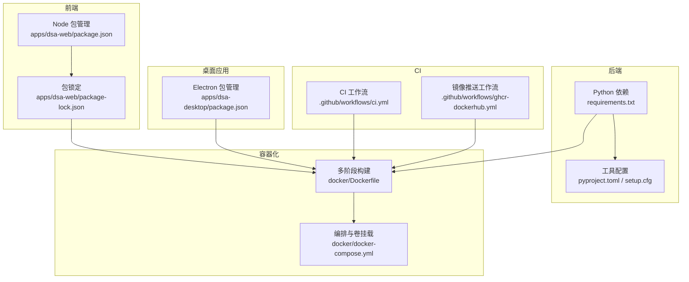
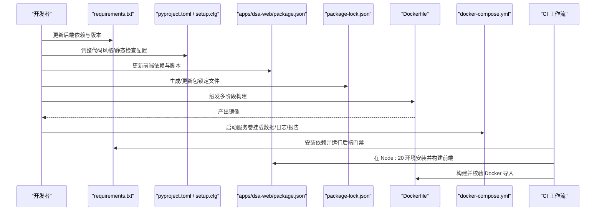
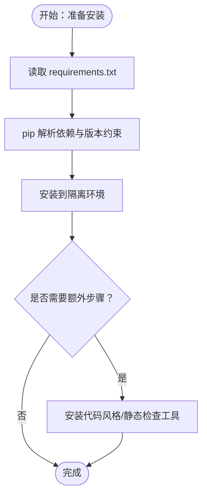
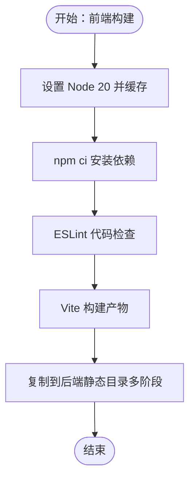
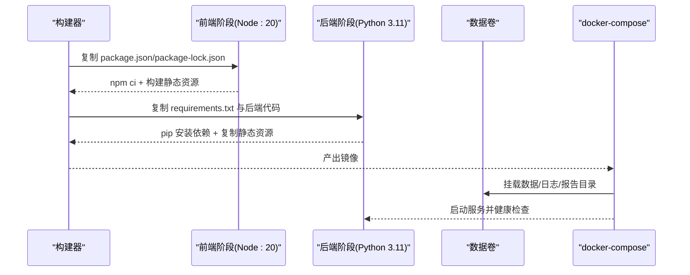
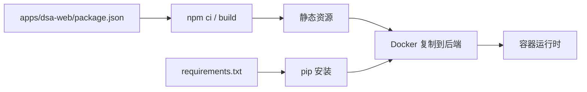

# 依赖管理与版本控制

<cite>
**本文引用的文件**
- [requirements.txt](file://requirements.txt)
- [pyproject.toml](file://pyproject.toml)
- [setup.cfg](file://setup.cfg)
- [apps/dsa-web/package.json](file://apps/dsa-web/package.json)
- [apps/dsa-web/package-lock.json](file://apps/dsa-web/package-lock.json)
- [apps/dsa-desktop/package.json](file://apps/dsa-desktop/package.json)
- [docker/Dockerfile](file://docker/Dockerfile)
- [docker/docker-compose.yml](file://docker/docker-compose.yml)
- [.github/workflows/ci.yml](file://.github/workflows/ci.yml)
- [.github/workflows/ghcr-dockerhub.yml](file://.github/workflows/ghcr-dockerhub.yml)
- [test.sh](file://test.sh)
- [README.md](file://README.md)
</cite>

## 目录
1. [引言](#引言)
2. [项目结构](#项目结构)
3. [核心组件](#核心组件)
4. [架构总览](#架构总览)
5. [详细组件分析](#详细组件分析)
6. [依赖关系分析](#依赖关系分析)
7. [性能考量](#性能考量)
8. [故障排查指南](#故障排查指南)
9. [结论](#结论)
10. [附录](#附录)

## 引言
本指南围绕本项目的依赖管理与版本控制实践，系统讲解三类依赖生态：Python 后端依赖、前端 Web 应用依赖、以及容器化运行时依赖，并结合现代打包配置与 CI 工作流，给出更新流程、安全扫描、兼容性测试、冲突解决与版本升级策略，帮助团队在多语言、多阶段构建环境中实现稳定可靠的依赖治理。

## 项目结构
项目采用“多阶段 Docker 构建 + 前后端分离”的组织方式：
- 后端 Python 依赖通过 requirements.txt 声明，配合 pyproject.toml 与 setup.cfg 提供代码风格与静态检查工具配置。
- 前端 Web 应用位于 apps/dsa-web，使用 package.json 管理依赖与脚本；桌面应用位于 apps/dsa-desktop，使用 Electron 与 package.json 管理构建配置。
- 容器化通过 docker/Dockerfile 实现多阶段构建：先在 Node:20-slim 中构建前端，再在 Python 3.11-slim-bookworm 中安装后端依赖并复制应用代码。
- CI 工作流在 GitHub Actions 中分别执行后端门禁、Docker 构建与前端门禁，确保跨语言依赖一致性与可重复构建。

图表来源
- [docker/Dockerfile:1-77](file://docker/Dockerfile#L1-L77)
- [docker/docker-compose.yml:1-69](file://docker/docker-compose.yml#L1-L69)
- [.github/workflows/ci.yml:1-109](file://.github/workflows/ci.yml#L1-L109)
- [.github/workflows/ghcr-dockerhub.yml:1-119](file://.github/workflows/ghcr-dockerhub.yml#L1-L119)
- [apps/dsa-web/package.json:1-56](file://apps/dsa-web/package.json#L1-L56)
- [apps/dsa-web/package-lock.json:1-200](file://apps/dsa-web/package-lock.json#L1-L200)
- [apps/dsa-desktop/package.json:1-43](file://apps/dsa-desktop/package.json#L1-L43)
- [requirements.txt:1-65](file://requirements.txt#L1-L65)
- [pyproject.toml:1-29](file://pyproject.toml#L1-L29)
- [setup.cfg:1-34](file://setup.cfg#L1-L34)

章节来源
- [docker/Dockerfile:1-77](file://docker/Dockerfile#L1-L77)
- [docker/docker-compose.yml:1-69](file://docker/docker-compose.yml#L1-L69)
- [.github/workflows/ci.yml:1-109](file://.github/workflows/ci.yml#L1-L109)
- [.github/workflows/ghcr-dockerhub.yml:1-119](file://.github/workflows/ghcr-dockerhub.yml#L1-L119)
- [apps/dsa-web/package.json:1-56](file://apps/dsa-web/package.json#L1-L56)
- [apps/dsa-web/package-lock.json:1-200](file://apps/dsa-web/package-lock.json#L1-L200)
- [apps/dsa-desktop/package.json:1-43](file://apps/dsa-desktop/package.json#L1-L43)
- [requirements.txt:1-65](file://requirements.txt#L1-L65)
- [pyproject.toml:1-29](file://pyproject.toml#L1-L29)
- [setup.cfg:1-34](file://setup.cfg#L1-L34)

## 核心组件
- Python 依赖与版本约束
  - 使用 requirements.txt 统一声明后端依赖与版本范围，涵盖数据源、网络请求、AI 分析、报告模板、Web 框架等模块。
  - 通过 pyproject.toml 与 setup.cfg 配置代码风格与静态检查工具，确保一致的代码质量基线。
- 前端依赖与包锁定
  - apps/dsa-web/package.json 定义生产与开发依赖，scripts 脚本覆盖开发、构建、测试与预览。
  - package-lock.json 提供确定性安装，保证跨环境一致性。
- 桌面应用依赖
  - apps/dsa-desktop/package.json 声明 Electron 与构建工具，配置构建产物与资源拷贝。
- 容器化依赖
  - Dockerfile 多阶段构建：前端在 Node:20-slim 中构建，后端在 Python 3.11-slim-bookworm 中安装依赖并复制代码。
  - docker-compose.yml 定义服务、卷挂载、环境变量与健康检查，便于本地与生产部署。

章节来源
- [requirements.txt:1-65](file://requirements.txt#L1-L65)
- [pyproject.toml:1-29](file://pyproject.toml#L1-L29)
- [setup.cfg:1-34](file://setup.cfg#L1-L34)
- [apps/dsa-web/package.json:1-56](file://apps/dsa-web/package.json#L1-L56)
- [apps/dsa-web/package-lock.json:1-200](file://apps/dsa-web/package-lock.json#L1-L200)
- [apps/dsa-desktop/package.json:1-43](file://apps/dsa-desktop/package.json#L1-L43)
- [docker/Dockerfile:1-77](file://docker/Dockerfile#L1-L77)
- [docker/docker-compose.yml:1-69](file://docker/docker-compose.yml#L1-L69)

## 架构总览
下图展示从依赖声明到最终运行时的依赖流转路径，强调多语言与多阶段构建的关键节点。

图表来源
- [requirements.txt:1-65](file://requirements.txt#L1-L65)
- [pyproject.toml:1-29](file://pyproject.toml#L1-L29)
- [setup.cfg:1-34](file://setup.cfg#L1-L34)
- [apps/dsa-web/package.json:1-56](file://apps/dsa-web/package.json#L1-L56)
- [apps/dsa-web/package-lock.json:1-200](file://apps/dsa-web/package-lock.json#L1-L200)
- [docker/Dockerfile:1-77](file://docker/Dockerfile#L1-L77)
- [docker/docker-compose.yml:1-69](file://docker/docker-compose.yml#L1-L69)
- [.github/workflows/ci.yml:1-109](file://.github/workflows/ci.yml#L1-L109)

## 详细组件分析

### Python 依赖管理与版本控制
- 依赖声明与版本约束
  - 使用明确的最小版本与可选上限版本（如对 tiktoken 的小于 0.12.0 的上限约束）以避免上游插件注册问题。
  - 对网络与代理相关依赖（httpx[socks]）采用可选扩展形式，按需启用。
- 依赖解析策略
  - 通过 requirements.txt 统一解析，CI 与本地均使用 pip install -r requirements.txt 安装，确保解析结果一致。
  - 代码风格与静态检查工具（black、isort、bandit、flake8）在 pyproject.toml 与 setup.cfg 中统一配置，减少环境差异。
- 版本兼容性
  - 目标 Python 版本为 3.10+，工具链（black、isort）目标版本包含 3.10/3.11/3.12，确保后端与工具链兼容。
- 安全与合规
  - bandit 配置排除测试目录与特定规则（如允许断言用于测试），避免误报影响测试流程。

图表来源
- [requirements.txt:1-65](file://requirements.txt#L1-L65)
- [pyproject.toml:1-29](file://pyproject.toml#L1-L29)
- [setup.cfg:1-34](file://setup.cfg#L1-L34)

章节来源
- [requirements.txt:1-65](file://requirements.txt#L1-L65)
- [pyproject.toml:1-29](file://pyproject.toml#L1-L29)
- [setup.cfg:1-34](file://setup.cfg#L1-L34)
- [.github/workflows/ci.yml:53-57](file://.github/workflows/ci.yml#L53-L57)

### 前端依赖管理（apps/dsa-web）
- 依赖与脚本
  - 生产依赖覆盖 React 19、Next Themes、Tailwind、Recharts、Axios、React Router 等，满足可视化与路由需求。
  - 开发依赖包含 Vite、TypeScript、ESLint、Playwright、Testing Library、TailwindCSS 等，覆盖开发、构建、测试与样式工具链。
- Node.js 版本与包锁定
  - CI 使用 Node 20（actions/setup-node@v6），确保与 package.json 的 Node 版本要求一致。
  - package-lock.json 提供确定性安装，避免不同机器或 CI 步骤间出现依赖漂移。
- 构建与缓存
  - CI 中启用 npm 缓存（cache-dependency-path 指向 package-lock.json），提升构建速度与稳定性。

图表来源
- [apps/dsa-web/package.json:1-56](file://apps/dsa-web/package.json#L1-L56)
- [apps/dsa-web/package-lock.json:1-200](file://apps/dsa-web/package-lock.json#L1-L200)
- [.github/workflows/ci.yml:97-108](file://.github/workflows/ci.yml#L97-L108)

章节来源
- [apps/dsa-web/package.json:1-56](file://apps/dsa-web/package.json#L1-L56)
- [apps/dsa-web/package-lock.json:1-200](file://apps/dsa-web/package-lock.json#L1-L200)
- [.github/workflows/ci.yml:97-108](file://.github/workflows/ci.yml#L97-L108)

### 桌面应用依赖管理（apps/dsa-desktop）
- Electron 与构建工具
  - 使用 Electron 31 与 electron-builder 24，配置 appId、productName、输出目录与资源拷贝，确保跨平台打包一致性。
- 构建流程
  - scripts 中提供 dev 与 build 脚本，桌面应用构建流程与后端解耦，便于独立迭代与发布。

章节来源
- [apps/dsa-desktop/package.json:1-43](file://apps/dsa-desktop/package.json#L1-L43)
- [scripts/build-all.ps1:1-9](file://scripts/build-all.ps1#L1-L9)

### 容器化依赖管理（Docker 多阶段构建）
- 多阶段策略
  - 第一阶段：基于 node:20-slim，复制并安装前端依赖，执行构建，产出静态资源。
  - 第二阶段：基于 python:3.11-slim-bookworm，安装系统依赖（如 gcc、curl、wkhtmltopdf、字体与图像库），安装 Python 依赖（pip install -r requirements.txt），复制后端代码与前端静态资源，设置环境变量、暴露端口、定义健康检查与数据卷。
- 镜像构建优化
  - 使用 --no-cache-dir 减少镜像体积；apt-get 安装后清理缓存；前端构建与后端安装分离，充分利用层缓存。
- 运行时配置
  - docker-compose.yml 将 data、logs、reports 挂载为持久卷；通过 .env 注入环境变量；设置健康检查与资源限制；支持 FastAPI 模式与定时任务模式切换。

图表来源
- [docker/Dockerfile:1-77](file://docker/Dockerfile#L1-L77)
- [docker/docker-compose.yml:1-69](file://docker/docker-compose.yml#L1-L69)

章节来源
- [docker/Dockerfile:1-77](file://docker/Dockerfile#L1-L77)
- [docker/docker-compose.yml:1-69](file://docker/docker-compose.yml#L1-L69)

## 依赖关系分析
- Python 与前端依赖耦合
  - Dockerfile 将前端构建产物复制到后端静态目录，形成前后端依赖的耦合点：前端 package.json 的变更会触发 Docker 层重建。
- CI 门禁与依赖一致性
  - CI 对后端与前端分别执行门禁：后端安装 requirements.txt 并运行脚本，前端在 Node 20 环境安装并构建。
- 容器运行时依赖
  - Dockerfile 显式安装系统依赖（如 wkhtmltopdf），确保 Markdown 转图片等功能可用；requirements.txt 与 package-lock.json 保证 Python 与 Node 依赖的确定性。

图表来源
- [requirements.txt:1-65](file://requirements.txt#L1-L65)
- [apps/dsa-web/package.json:1-56](file://apps/dsa-web/package.json#L1-L56)
- [docker/Dockerfile:43-51](file://docker/Dockerfile#L43-L51)

章节来源
- [requirements.txt:1-65](file://requirements.txt#L1-L65)
- [apps/dsa-web/package.json:1-56](file://apps/dsa-web/package.json#L1-L56)
- [docker/Dockerfile:43-51](file://docker/Dockerfile#L43-L51)

## 性能考量
- 构建缓存
  - Python：CI 使用 pip 缓存；requirements.txt 变更才会重新安装依赖。
  - Node：CI 使用 npm 缓存（cache-dependency-path 指向 package-lock.json），显著缩短前端安装时间。
- 镜像层优化
  - Dockerfile 中 apt-get 安装后清理缓存，pip 安装使用 --no-cache-dir，减少镜像体积。
- 健康检查与资源限制
  - docker-compose.yml 设置日志轮转与内存限制，避免资源争用；健康检查保障服务可用性。

章节来源
- [.github/workflows/ci.yml:52-57](file://.github/workflows/ci.yml#L52-L57)
- [.github/workflows/ci.yml:100-102](file://.github/workflows/ci.yml#L100-L102)
- [docker/Dockerfile:27-35](file://docker/Dockerfile#L27-L35)
- [docker/Dockerfile](file://docker/Dockerfile#L41)
- [docker/docker-compose.yml:42-53](file://docker/docker-compose.yml#L42-L53)

## 故障排查指南
- Python 依赖安装失败
  - 确认 requirements.txt 中版本约束是否与当前环境兼容；优先使用 pip install --upgrade pip 后再安装依赖。
  - 检查 CI 日志中后端门禁步骤，确认是否因 flake8 或 pytest 失败导致门禁中断。
- 前端依赖安装/构建失败
  - 确认 Node 版本与 package.json 一致；使用 npm ci 而非 npm install 以匹配 package-lock.json。
  - 检查 CI 中 Node 缓存配置与工作目录（defaults.working-directory: apps/dsa-web）。
- 容器运行异常
  - 查看健康检查与日志；确认数据卷挂载路径与权限；核对 .env 中环境变量（如 API 端口、日志目录）。
- 依赖冲突与版本漂移
  - 使用 pip-tools 或 pip-compile 统一锁定 Python 依赖；前端使用 package-lock.json 锁定版本；容器镜像构建时避免缓存污染。

章节来源
- [.github/workflows/ci.yml:53-57](file://.github/workflows/ci.yml#L53-L57)
- [.github/workflows/ci.yml:97-108](file://.github/workflows/ci.yml#L97-L108)
- [docker/docker-compose.yml:23-30](file://docker/docker-compose.yml#L23-L30)
- [docker/Dockerfile:70-76](file://docker/Dockerfile#L70-L76)

## 结论
本项目在 Python、前端与容器化三层依赖管理上形成了清晰的边界与协作机制：requirements.txt 与 pyproject.toml/setup.cfg 确保后端质量与一致性；apps/dsa-web/package.json 与 package-lock.json 保证前端可重复构建；Dockerfile 的多阶段构建与 docker-compose.yml 的运行时配置实现了端到端的可移植性。结合 CI 工作流的门禁与镜像推送，项目具备良好的可维护性与可扩展性。

## 附录

### 依赖更新流程（建议）
- Python
  - 使用 pip list --outdated 检查可更新包；逐项评估风险后更新 requirements.txt；在 CI 中验证后端门禁通过。
- 前端
  - 使用 npm outdated 检查可更新包；更新 package.json 后执行 npm ci 并运行 lint、build、测试；提交 package-lock.json。
- 容器化
  - 在本地或 CI 中构建镜像并进行“烟测导入”（如 Dockerfile 中的 smoke imports 步骤），确保各模块可导入且功能正常。

章节来源
- [.github/workflows/ci.yml:74-84](file://.github/workflows/ci.yml#L74-L84)
- [docker/Dockerfile:70-76](file://docker/Dockerfile#L70-L76)

### 安全漏洞扫描与合规
- Python
  - 使用 bandit（已配置排除测试目录与特定规则）进行安全检查；建议在 CI 中集成 pip-audit 或类似工具进行依赖漏洞扫描。
- 前端
  - 使用 npm audit 或 snyk 等工具定期扫描前端依赖漏洞；结合 CI 的 lint 与 build 步骤形成门禁。
- 容器
  - 使用 Trivy 或 Clair 等工具扫描镜像漏洞；在 ghcr-dockerhub.yml 中推送镜像后进行镜像签名与标签管理。

章节来源
- [pyproject.toml:26-28](file://pyproject.toml#L26-L28)
- [.github/workflows/ghcr-dockerhub.yml:1-119](file://.github/workflows/ghcr-dockerhub.yml#L1-L119)

### 兼容性测试方法
- Python
  - 使用 pytest 标记（unit/integration/network）区分测试类型；在 CI 中按需运行不同标记的测试集。
- 前端
  - 使用 Vitest 进行单元测试，Playwright 进行端到端测试；CI 中分别执行 lint、build、test 与 smoke test。
- 容器
  - 在 CI 中执行“烟测导入”，确保模块可导入；结合健康检查与日志轮转验证运行时稳定性。

章节来源
- [setup.cfg:19-27](file://setup.cfg#L19-L27)
- [.github/workflows/ci.yml:97-108](file://.github/workflows/ci.yml#L97-L108)
- [docker/Dockerfile:70-76](file://docker/Dockerfile#L70-L76)

### 依赖冲突解决与版本升级策略
- 冲突定位
  - Python：使用 pipdeptree 或 pipenv graph 查看依赖树；前端使用 npm ls 或 yarn why 查看依赖来源。
- 升级策略
  - 采用“小步快跑”策略：先升级次要版本，再进行端到端测试；对关键依赖（如 React、FastAPI、Electron）制定升级计划与回滚预案。
- 向后兼容性
  - 对 Python：在 pyproject.toml 中明确 target-version；对前端：在 package.json 中声明 Node 版本；对容器：固定基础镜像版本（如 python:3.11-slim-bookworm）。

章节来源
- [pyproject.toml:1-29](file://pyproject.toml#L1-L29)
- [apps/dsa-web/package.json:1-56](file://apps/dsa-web/package.json#L1-L56)
- [docker/Dockerfile](file://docker/Dockerfile#L17)