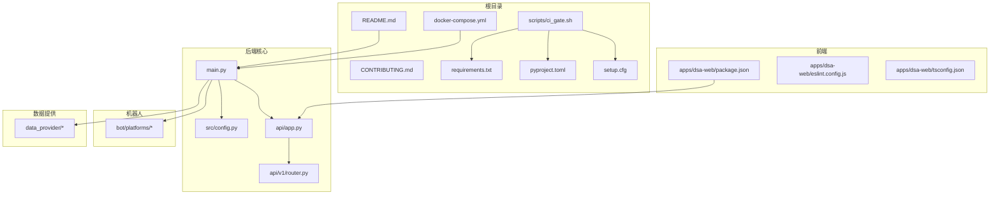
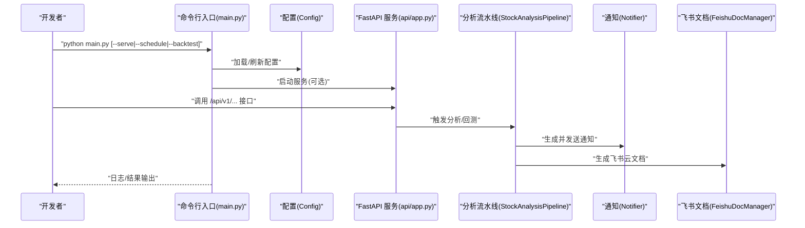
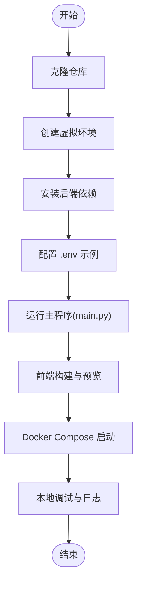
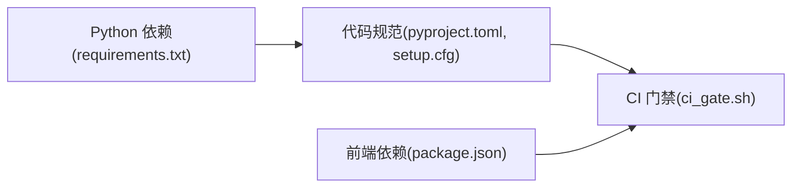

# 开发工作流程

<cite>
**本文引用的文件**
- [README.md](file://README.md)
- [CONTRIBUTING.md](file://docs/CONTRIBUTING.md)
- [PULL_REQUEST_TEMPLATE.md](file://.github/PULL_REQUEST_TEMPLATE.md)
- [bug_report.md](file://.github/ISSUE_TEMPLATE/bug_report.md)
- [feature_request.md](file://.github/ISSUE_TEMPLATE/feature_request.md)
- [config.yml](file://.github/ISSUE_TEMPLATE/config.yml)
- [ci_gate.sh](file://scripts/ci_gate.sh)
- [requirements.txt](file://requirements.txt)
- [pyproject.toml](file://pyproject.toml)
- [setup.cfg](file://setup.cfg)
- [package.json](file://apps/dsa-web/package.json)
- [eslint.config.js](file://apps/dsa-web/eslint.config.js)
- [tsconfig.json](file://apps/dsa-web/tsconfig.json)
- [docker-compose.yml](file://docker/docker-compose.yml)
- [main.py](file://main.py)
- [config.py](file://src/config.py)
</cite>

## 目录
1. [引言](#引言)
2. [项目结构](#项目结构)
3. [核心组件](#核心组件)
4. [架构总览](#架构总览)
5. [详细组件分析](#详细组件分析)
6. [依赖关系分析](#依赖关系分析)
7. [性能考量](#性能考量)
8. [故障排查指南](#故障排查指南)
9. [结论](#结论)
10. [附录](#附录)

## 引言
本文件面向项目贡献者与维护者，系统化梳理本项目的开发工作流程，涵盖：
- Git 分支管理策略（主分支保护、功能分支命名与合并）
- 代码审查流程（PR 模板、审查清单与标准）
- Issue 管理流程（Bug/功能请求模板与分类）
- 版本控制、标签与发布流程（现状与建议）
- 开发环境搭建、依赖安装与本地调试
- 协作开发最佳实践（提交信息规范、冲突解决、沟通流程）

## 项目结构
项目采用多模块组织方式，包含后端分析引擎、Web 前端、机器人平台、数据提供层、API 层与 Docker 部署配置。核心目录与职责概览如下：
- 根目录：README、贡献指南、依赖清单、CI/CD 脚本与 Docker 配置
- src：核心分析与调度逻辑、配置管理、服务层
- api：FastAPI 后端接口与路由
- apps/dsa-web：React/Vite 前端应用
- bot：多平台机器人（钉钉、飞书、Discord 等）
- data_provider：多数据源适配层
- docker：容器化与服务编排
- docs：文档与部署指南
- scripts：本地与 CI 检查脚本

**图表来源**
- [README.md](file://README.md)
- [main.py](file://main.py)
- [config.py](file://src/config.py)
- [docker-compose.yml](file://docker/docker-compose.yml)
- [ci_gate.sh](file://scripts/ci_gate.sh)
- [requirements.txt](file://requirements.txt)
- [pyproject.toml](file://pyproject.toml)
- [setup.cfg](file://setup.cfg)
- [package.json](file://apps/dsa-web/package.json)
- [eslint.config.js](file://apps/dsa-web/eslint.config.js)
- [tsconfig.json](file://apps/dsa-web/tsconfig.json)

**章节来源**
- [README.md](file://README.md)
- [docker-compose.yml](file://docker/docker-compose.yml)

## 核心组件
- 配置管理：集中式单例配置，支持 .env 加载、默认值与校验，贯穿分析、通知、定时任务与数据源选择。
- 主调度程序：统一入口，支持命令行模式（单次/定时/回测/Web 服务/API 服务）、交易日过滤、合并推送与飞书文档生成。
- API 层：FastAPI 路由与中间件，提供健康检查、历史查询、分析触发与回测接口。
- 前端应用：React + Vite，提供配置管理、任务监控与手动分析入口。
- 数据提供层：多数据源适配，含优先级与熔断策略，支持实时行情与新闻搜索。
- 机器人平台：多平台事件订阅与消息通道，支持命令与状态展示。

**章节来源**
- [config.py](file://src/config.py)
- [main.py](file://main.py)
- [config.yml](file://.github/ISSUE_TEMPLATE/config.yml)

## 架构总览
下图展示从命令行到 API、再到分析与通知的整体流程，以及容器化部署的服务编排。

**图表来源**
- [main.py](file://main.py)
- [config.py](file://src/config.py)
- [docker-compose.yml](file://docker/docker-compose.yml)

## 详细组件分析

### Git 分支管理策略
- 主分支保护
  - 保护规则建议：禁止直接推送至主分支，要求通过受保护分支策略（如仅允许管理员合并），开启“要求线程安全”与“必需的审查批准”等。
  - CI/CD：主分支合并前必须通过 CI 检查（后端门禁、Docker 构建、前端门禁等）。
- 功能分支命名规范
  - 建议采用：feature/模块名/简短描述（如 feature/api/health-endpoint）
  - 修复分支：fix/模块名/简短描述（如 fix/data-provider/timeout-handling）
  - 文档/脚本：docs/...、chore/scripts/...
- 合并策略
  - 使用 Squash Merge 以保持提交历史整洁，或 Rebase Merge 以保留线性历史；建议在 PR 合并前清理交互式变基，确保提交原子性。

**章节来源**
- [CONTRIBUTING.md](file://docs/CONTRIBUTING.md)

### 代码审查流程
- PR 模板使用
  - 使用仓库提供的 PR 模板，明确类型、背景、变更范围、关联 Issue、验证命令与结果、兼容性与风险、回滚计划等。
- 审查清单
  - 代码是否符合 Conventional Commits 规范
  - 是否通过 CI 后端门禁、Docker 构建与前端门禁
  - 是否更新相关文档与 CHANGELOG
  - 是否新增必要的单元/集成测试
  - 是否存在安全与性能隐患
- 审查标准
  - 变更最小化、可读性优先、边界条件与异常处理完备
  - 配置项与环境变量使用一致、默认值合理
  - API 变更需配套接口文档与示例

**章节来源**
- [PULL_REQUEST_TEMPLATE.md](file://.github/PULL_REQUEST_TEMPLATE.md)
- [CONTRIBUTING.md](file://docs/CONTRIBUTING.md)

### Issue 管理流程
- Bug 报告模板
  - 包含版本确认、问题描述、复现步骤、期望/实际行为、错误日志、环境信息与附加说明。
- 功能请求模板
  - 描述功能、使用场景、期望实现、备选方案与贡献意愿。
- 分类与标签
  - 默认标签：bug、enhancement；可扩展为 docs、refactor、test、chore 等。
- 沟通与跟踪
  - 优先使用模板字段，必要时在评论补充上下文；分配责任人与里程碑。

**章节来源**
- [bug_report.md](file://.github/ISSUE_TEMPLATE/bug_report.md)
- [feature_request.md](file://.github/ISSUE_TEMPLATE/feature_request.md)
- [config.yml](file://.github/ISSUE_TEMPLATE/config.yml)

### 版本控制、标签与发布流程
- 现状
  - 仓库未见明确的标签与发布工作流文件；README 提供了快速开始与部署说明。
- 建议
  - 标签规范：语义化版本（v1.2.3），与发布说明同步。
  - 发布流程：打标签 → 自动构建镜像 → 生成发布说明 → 推送至包管理/制品库。
  - 与 CI 结合：PR 合并到主分支后触发构建与测试，通过后可自动打标签与发布。

**章节来源**
- [README.md](file://README.md)

### 开发环境搭建、依赖安装与本地调试
- 后端
  - 克隆仓库、创建虚拟环境、安装依赖、复制并配置 .env 示例。
  - 运行主程序：支持本地分析、定时任务、Web 服务与 API 服务模式。
- 前端
  - 进入 apps/dsa-web，安装依赖、运行构建与预览。
- Docker
  - 使用 docker-compose 启动定时任务与 API 服务，挂载数据/日志/报告目录与 .env。
- 本地调试
  - 使用命令行参数切换模式（--debug、--dry-run、--schedule、--serve、--backtest），结合日志定位问题。
  - CI 门禁脚本：py_compile、flake8、离线测试，确保本地质量门槛一致。

**图表来源**
- [README.md](file://README.md)
- [main.py](file://main.py)
- [docker-compose.yml](file://docker/docker-compose.yml)

**章节来源**
- [README.md](file://README.md)
- [CONTRIBUTING.md](file://docs/CONTRIBUTING.md)
- [requirements.txt](file://requirements.txt)
- [main.py](file://main.py)
- [docker-compose.yml](file://docker/docker-compose.yml)

### 协作开发最佳实践
- 提交信息规范
  - 采用 Conventional Commits，类型包括 feat、fix、docs、style、refactor、perf、test、chore。
- 冲突解决
  - 频繁同步上游分支，使用 rebase 保持线性历史；冲突集中在配置与数据源时，优先协商默认值与优先级。
- 团队沟通
  - 重大变更提前在 Issue 讨论；PR 严格按模板填写；审查完成后由维护者合并。

**章节来源**
- [CONTRIBUTING.md](file://docs/CONTRIBUTING.md)

## 依赖关系分析
- 后端依赖
  - Python 核心库、数据源 SDK、AI 客户端、Web 框架、定时任务、数据库与报告模板引擎。
- 代码风格与静态检查
  - Black、isort、flake8、pytest 标记体系，CI 中统一执行。
- 前端依赖
  - React 生态、Vite、ESLint、TypeScript、TailwindCSS、测试工具链。

**图表来源**
- [requirements.txt](file://requirements.txt)
- [pyproject.toml](file://pyproject.toml)
- [setup.cfg](file://setup.cfg)
- [ci_gate.sh](file://scripts/ci_gate.sh)
- [package.json](file://apps/dsa-web/package.json)

**章节来源**
- [requirements.txt](file://requirements.txt)
- [pyproject.toml](file://pyproject.toml)
- [setup.cfg](file://setup.cfg)
- [ci_gate.sh](file://scripts/ci_gate.sh)
- [package.json](file://apps/dsa-web/package.json)

## 性能考量
- 并发与限流
  - 配置最大并发 worker 数，避免数据源限流；分析间隔参数用于缓解 API 限流。
- 缓存与熔断
  - 实时行情缓存 TTL 与熔断冷却时间，降低外部依赖抖动影响。
- 日志与可观测性
  - 统一日志目录与级别，便于定位性能瓶颈与异常。

**章节来源**
- [config.py](file://src/config.py)

## 故障排查指南
- 常见问题
  - API Key 未配置导致 AI 分析不可用；搜索引擎 Key 未配置导致新闻搜索不可用；未配置通知渠道导致无推送。
- 本地验证
  - 使用 CI 门禁脚本与 pytest 标记运行离线测试，确保语法、风格与核心逻辑通过。
- 容器化排查
  - 检查 docker-compose 映射目录与 .env 加载；确认日志卷与容器资源限制。

**章节来源**
- [config.py](file://src/config.py)
- [ci_gate.sh](file://scripts/ci_gate.sh)
- [docker-compose.yml](file://docker/docker-compose.yml)

## 结论
本项目已具备完善的贡献指南、Issue 模板与 CI 门禁机制。建议进一步完善主分支保护、标签与发布流程，并在团队内强化 Conventional Commits 与 PR 审查标准，以提升协作效率与代码质量稳定性。

## 附录
- 关键命令与入口
  - 后端：python main.py（支持多种模式）
  - 前端：cd apps/dsa-web && npm run dev/build/lint
  - Docker：docker-compose up -d analyzer/server
- 配置要点
  - .env 中的关键变量（STOCK_LIST、AI/搜索引擎/通知渠道等）
  - 定时任务与 Web 服务端口配置

**章节来源**
- [README.md](file://README.md)
- [main.py](file://main.py)
- [docker-compose.yml](file://docker/docker-compose.yml)
- [config.py](file://src/config.py)