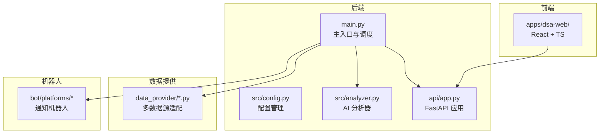
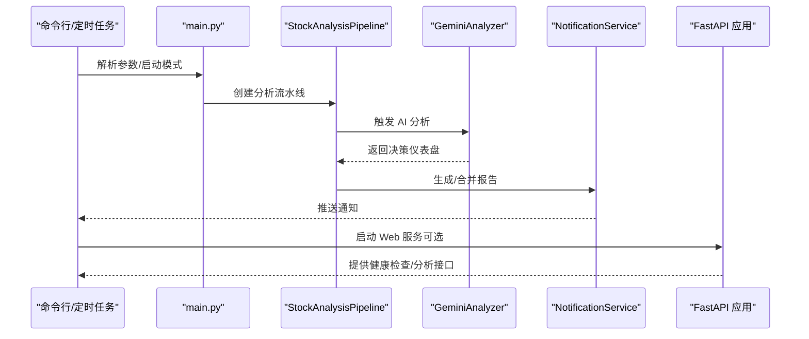
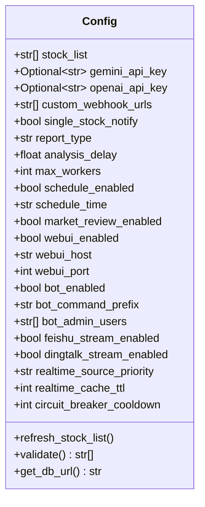
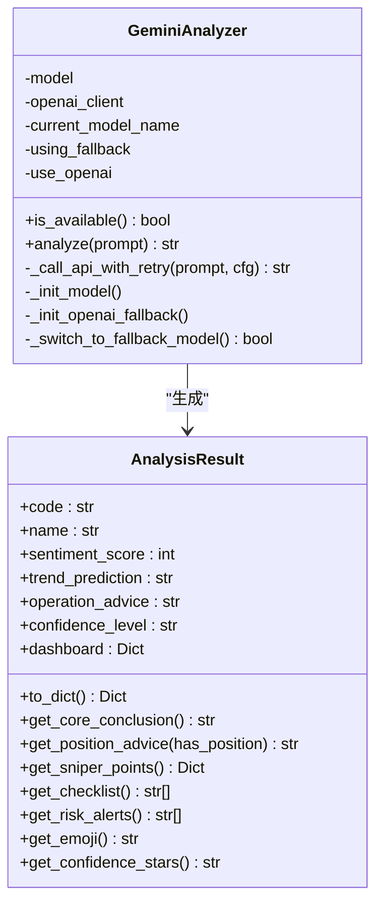
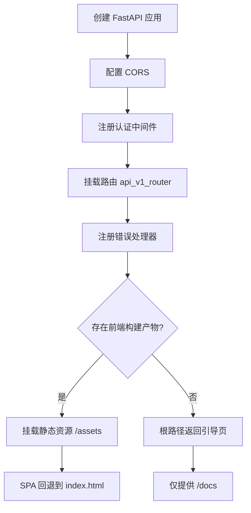
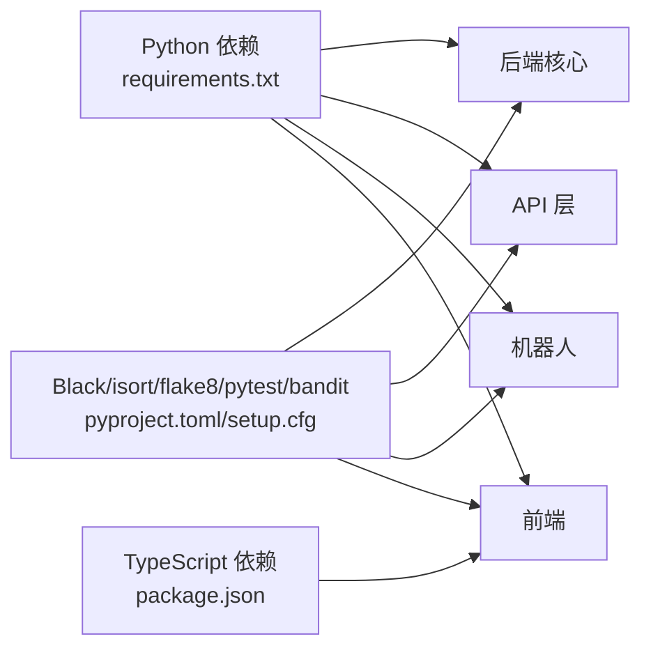

# 开发指南

<cite>
**本文引用的文件**
- [README.md](file://README.md)
- [docs/CONTRIBUTING.md](file://docs/CONTRIBUTING.md)
- [pyproject.toml](file://pyproject.toml)
- [setup.cfg](file://setup.cfg)
- [requirements.txt](file://requirements.txt)
- [test.sh](file://test.sh)
- [scripts/ci_gate.sh](file://scripts/ci_gate.sh)
- [.github/PULL_REQUEST_TEMPLATE.md](file://.github/PULL_REQUEST_TEMPLATE.md)
- [main.py](file://main.py)
- [src/config.py](file://src/config.py)
- [src/analyzer.py](file://src/analyzer.py)
- [src/enums.py](file://src/enums.py)
- [api/app.py](file://api/app.py)
- [apps/dsa-web/eslint.config.js](file://apps/dsa-web/eslint.config.js)
</cite>

## 目录
1. [简介](#简介)
2. [项目结构](#项目结构)
3. [核心组件](#核心组件)
4. [架构总览](#架构总览)
5. [详细组件分析](#详细组件分析)
6. [依赖分析](#依赖分析)
7. [性能考虑](#性能考虑)
8. [故障排查指南](#故障排查指南)
9. [结论](#结论)
10. [附录](#附录)

## 简介
本开发指南面向参与“股票智能分析系统”的开发者，系统性阐述代码规范、编码标准、测试策略、Git 工作流、分支管理与代码审查流程、依赖管理与版本控制、发布流程、开发环境搭建与 IDE 配置、调试工具使用、新功能开发与 Bug 修复、性能优化、贡献指南与 Issue/Pull Request 规范，以及扩展与二次开发指导。

## 项目结构
项目采用多模块分层组织：
- 后端核心：src/（分析流水线、服务、仓储、配置、通知、调度等）
- API 层：api/（FastAPI 应用、路由、中间件、版本化接口）
- 数据提供层：data_provider/（多数据源适配器）
- 前端应用：apps/dsa-web/（React + TypeScript 前端）
- 机器人平台：bot/（多平台通知机器人）
- 脚本与部署：scripts/、docker/、.github/ workflows
- 测试：tests/（单元与集成测试）
- 文档：docs/（完整指南、FAQ、部署说明）

图表来源
- [main.py:1-723](file://main.py#L1-L723)
- [api/app.py:1-209](file://api/app.py#L1-L209)
- [src/config.py:1-580](file://src/config.py#L1-L580)
- [src/analyzer.py:1-800](file://src/analyzer.py#L1-L800)

章节来源
- [README.md:1-284](file://README.md#L1-L284)
- [main.py:1-723](file://main.py#L1-L723)
- [api/app.py:1-209](file://api/app.py#L1-L209)

## 核心组件
- 配置管理：集中式单例配置，支持 .env 加载、类型安全访问、热读取与校验。
- AI 分析器：封装 Gemini/OpenAI 兼容 API，提供“决策仪表盘”JSON 输出与重试/降级机制。
- API 服务：FastAPI 应用工厂，CORS、认证中间件、健康检查、静态资源托管。
- 数据提供层：多数据源适配（AkShare、Tushare、Pytdx、Baostock、YFinance、Efiance 等）。
- 前端 Web 界面：Vite + React + TypeScript，提供配置管理、任务监控与手动分析。
- 机器人平台：钉钉、飞书、Discord、Telegram 等通知通道。
- 测试与 CI：Shell 测试脚本、pytest 标记、CI Gate 检查。

章节来源
- [src/config.py:1-580](file://src/config.py#L1-L580)
- [src/analyzer.py:1-800](file://src/analyzer.py#L1-L800)
- [api/app.py:1-209](file://api/app.py#L1-L209)
- [requirements.txt:1-65](file://requirements.txt#L1-L65)
- [test.sh:1-387](file://test.sh#L1-L387)
- [scripts/ci_gate.sh:1-22](file://scripts/ci_gate.sh#L1-L22)

## 架构总览
系统采用“主调度 + 多模块协作”的架构：
- 主入口负责参数解析、日程调度、Web/API 启动、通知合并与飞书文档生成。
- 分析流水线串联数据获取、AI 分析、新闻检索、报告生成与推送。
- API 层对外提供健康检查、分析触发、历史查询等接口。
- 前端通过 API 与后端交互，支持配置管理与手动分析。

图表来源
- [main.py:258-443](file://main.py#L258-L443)
- [src/analyzer.py:334-800](file://src/analyzer.py#L334-L800)
- [api/app.py:161-174](file://api/app.py#L161-L174)

## 详细组件分析

### 配置管理（Config）
- 单例模式：全局唯一配置实例，避免重复加载。
- 环境变量优先：支持 .env 与系统环境变量，提供默认值与类型转换。
- 热读取：定时任务模式下可热更新自选股列表。
- 校验：对关键配置项进行完整性与有效性检查。
- 数据库连接：自动创建目录并生成 SQLite URL。

图表来源
- [src/config.py:31-580](file://src/config.py#L31-L580)

章节来源
- [src/config.py:1-580](file://src/config.py#L1-L580)

### AI 分析器（GeminiAnalyzer）
- 系统提示词：定义严格的交易理念与输出格式（决策仪表盘 JSON）。
- 模型选择：优先 Gemini，失败则降级至 OpenAI 兼容 API。
- 重试与限流：指数退避、参数兼容性处理、429 限流应对。
- 结果解析：解析 JSON，提取核心结论、狙击点位、检查清单与风险提示。

图表来源
- [src/analyzer.py:334-800](file://src/analyzer.py#L334-L800)

章节来源
- [src/analyzer.py:1-800](file://src/analyzer.py#L1-L800)

### API 应用（FastAPI）
- 应用工厂：集中配置 CORS、认证中间件、路由注册与生命周期服务。
- 健康检查：/api/health 返回服务状态。
- 静态资源：前端未构建时提供引导页；构建后托管 SPA。
- 错误处理：统一异常处理器。

图表来源
- [api/app.py:48-204](file://api/app.py#L48-L204)

章节来源
- [api/app.py:1-209](file://api/app.py#L1-L209)

### 前端（apps/dsa-web）
- ESLint 配置：基于 @eslint/js、typescript-eslint、react-hooks、react-refresh。
- 构建与开发：Vite + React + TypeScript，支持热重载与类型检查。
- 与后端交互：通过 /api/v1/* 接口触发分析与查询。

章节来源
- [apps/dsa-web/eslint.config.js:1-24](file://apps/dsa-web/eslint.config.js#L1-L24)

### 测试与 CI
- Shell 测试脚本：覆盖语法检查、代码识别、YFinance 转换、Flake8、网络/离线测试等。
- CI Gate：后端语法检查、flake8 严重错误、本地确定性检查、离线测试套件。
- Pytest 标记：unit/integration/network，便于选择性执行。
- PR 验证：要求提供可复现命令与关键结果，评估兼容性与风险，提供回滚方案。

章节来源
- [test.sh:1-387](file://test.sh#L1-L387)
- [scripts/ci_gate.sh:1-22](file://scripts/ci_gate.sh#L1-L22)
- [setup.cfg:19-28](file://setup.cfg#L19-L28)
- [.github/PULL_REQUEST_TEMPLATE.md:1-76](file://.github/PULL_REQUEST_TEMPLATE.md#L1-L76)

## 依赖分析
- 后端依赖：dotenv、tenacity、SQLAlchemy、schedule、exchange-calendars、efinance、akshare、tushare、pytdx、baostock、yfinance、lark-oapi、pandas、numpy、json-repair、litellm、tiktoken、openai、PyYAML、tavily-python、google-search-results、requests、markdown2、imgkit、fake-useragent、httpx[socks]、discord.py、newspaper3k、jinja2、fastapi、uvicorn、python-multipart。
- 前端依赖：Vite、React、TypeScript、TailwindCSS、ESLint 配置等。
- 工具链：Black、isort、flake8、pytest、bandit。

图表来源
- [requirements.txt:1-65](file://requirements.txt#L1-L65)
- [pyproject.toml:1-29](file://pyproject.toml#L1-L29)
- [setup.cfg:1-34](file://setup.cfg#L1-L34)

章节来源
- [requirements.txt:1-65](file://requirements.txt#L1-L65)
- [pyproject.toml:1-29](file://pyproject.toml#L1-L29)
- [setup.cfg:1-34](file://setup.cfg#L1-L34)

## 性能考虑
- 并发与防封禁：max_workers 控制并发，避免高频请求导致限流。
- 请求间隔与重试：tenacity 指数退避，降低 API 限流风险。
- 缓存与熔断：实时行情缓存 TTL、熔断器冷却时间。
- 网络与限流：analysis_delay 在个股与大盘分析间增加延迟，避免限流。
- 数据源优先级：根据令牌与稳定性选择数据源优先级。

章节来源
- [src/config.py:182-194](file://src/config.py#L182-L194)
- [src/config.py:426-436](file://src/config.py#L426-L436)
- [main.py:321-330](file://main.py#L321-L330)

## 故障排查指南
- 配置校验：未配置 STOCK_LIST、API Key、搜索引擎 Key、通知渠道等会触发警告。
- 代理与 NO_PROXY：配置代理时自动排除国内金融域名，避免行情获取失败。
- AI 分析器：Gemini 初始化失败自动降级至 OpenAI 兼容 API；429 限流时指数退避与参数兼容处理。
- 前端未构建：根路径返回引导页，提示先构建前端或仅使用 API 文档。
- CI 失败：检查 backend-gate 的语法、flake8 严重错误、本地确定性检查与离线测试。

章节来源
- [src/config.py:507-546](file://src/config.py#L507-L546)
- [src/config.py:259-299](file://src/config.py#L259-L299)
- [src/analyzer.py:567-619](file://src/analyzer.py#L567-L619)
- [api/app.py:121-159](file://api/app.py#L121-L159)
- [scripts/ci_gate.sh:5-21](file://scripts/ci_gate.sh#L5-L21)

## 结论
本指南提供了从开发环境到测试、CI、部署与扩展的全流程实践。建议开发者严格遵循代码规范、测试策略与 Git 工作流，结合配置管理与性能优化策略，确保系统的稳定性与可维护性。

## 附录

### 代码规范与编码标准
- Python：PEP 8；Black 与 isort 统一格式；flake8 限制部分规则以兼容 Black。
- 文档与注释：函数/类需添加 docstring；重要逻辑添加注释。
- 提交规范：Conventional Commits，涵盖 feat/fix/docs/style/refactor/perf/test/chore 等类型。

章节来源
- [docs/CONTRIBUTING.md:68-74](file://docs/CONTRIBUTING.md#L68-L74)
- [pyproject.toml:1-29](file://pyproject.toml#L1-L29)
- [setup.cfg:1-17](file://setup.cfg#L1-L17)
- [docs/CONTRIBUTING.md:46-66](file://docs/CONTRIBUTING.md#L46-L66)

### 测试策略与编写方法
- 单元测试：pytest 标记 unit/integration/network，离线测试优先。
- 集成测试：通过 test.sh 覆盖语法检查、代码识别、YFinance 转换、Flake8、网络/离线测试。
- CI Gate：后端语法检查、flake8 严重错误、本地确定性检查、离线测试套件。

章节来源
- [setup.cfg:24-27](file://setup.cfg#L24-L27)
- [test.sh:243-286](file://test.sh#L243-L286)
- [scripts/ci_gate.sh:5-21](file://scripts/ci_gate.sh#L5-L21)

### Git 工作流程、分支管理与代码审查
- Fork 仓库，创建特性分支，提交改动并推送，创建 PR。
- Conventional Commits 提交信息，PR 模板要求背景、范围、验证命令、兼容性与回滚方案。
- CI 自动检查：backend-gate、docker-build、web-gate、network-smoke。

章节来源
- [docs/CONTRIBUTING.md:38-44](file://docs/CONTRIBUTING.md#L38-L44)
- [.github/PULL_REQUEST_TEMPLATE.md:1-76](file://.github/PULL_REQUEST_TEMPLATE.md#L1-L76)
- [docs/CONTRIBUTING.md:75-84](file://docs/CONTRIBUTING.md#L75-L84)

### 依赖管理、版本控制与发布流程
- 依赖声明：requirements.txt（后端）、apps/dsa-web/package.json（前端）。
- 工具配置：pyproject.toml（Black/isort/bandit）、setup.cfg（flake8/pytest/isort）。
- 版本控制：README 中的版本与许可证信息；发布前确保 CI 通过与文档更新。

章节来源
- [requirements.txt:1-65](file://requirements.txt#L1-L65)
- [pyproject.toml:1-29](file://pyproject.toml#L1-L29)
- [setup.cfg:19-33](file://setup.cfg#L19-L33)
- [README.md:258-263](file://README.md#L258-L263)

### 开发环境搭建、IDE 配置与调试工具
- 后端：Python 3.10+，虚拟环境，pip 安装 requirements.txt。
- 前端：Node.js，npm ci/install，npm run build。
- IDE：VSCode（Python/ESLint/TypeScript 插件），启用格式化与类型检查。
- 调试：main.py 支持 --debug、--dry-run、--schedule 等参数；FastAPI 文档 /docs。

章节来源
- [docs/CONTRIBUTING.md:19-36](file://docs/CONTRIBUTING.md#L19-L36)
- [README.md:136-152](file://README.md#L136-L152)
- [api/app.py:161-174](file://api/app.py#L161-L174)

### 新功能开发、Bug 修复与性能优化指导
- 新功能：遵循模块边界（src/api/data_provider/bot/web），补充配置项与测试。
- Bug 修复：提供最小复现步骤与验证命令；必要时更新文档。
- 性能优化：调整 max_workers、analysis_delay、缓存 TTL、熔断冷却与数据源优先级。

章节来源
- [src/config.py:182-194](file://src/config.py#L182-L194)
- [src/config.py:426-436](file://src/config.py#L426-L436)
- [main.py:321-330](file://main.py#L321-L330)

### 贡献指南、Issue 模板与 PR 规范
- Issue：先搜索，使用模板，提供复现步骤与环境信息。
- PR：明确动机与价值，提供可复现命令与结果，评估兼容性与风险，提供回滚方案，必要时更新文档。

章节来源
- [docs/CONTRIBUTING.md:5-16](file://docs/CONTRIBUTING.md#L5-L16)
- [.github/PULL_REQUEST_TEMPLATE.md:1-76](file://.github/PULL_REQUEST_TEMPLATE.md#L1-L76)

### 扩展、插件开发与二次开发
- 扩展数据源：实现 data_provider/base.py 接口，按优先级注册。
- 扩展通知渠道：在通知服务中新增通道，更新配置与校验。
- 插件化前端：在 apps/dsa-web 中新增页面与组件，保持与 API 的契约一致。
- 二次开发：遵循配置中心与单例模式，确保全局一致性与可测试性。

章节来源
- [src/config.py:31-580](file://src/config.py#L31-L580)
- [api/app.py:48-204](file://api/app.py#L48-L204)