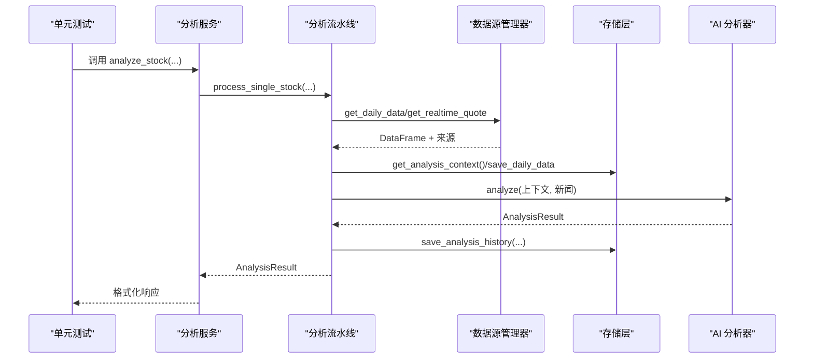
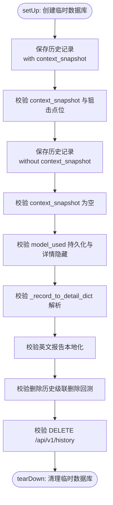
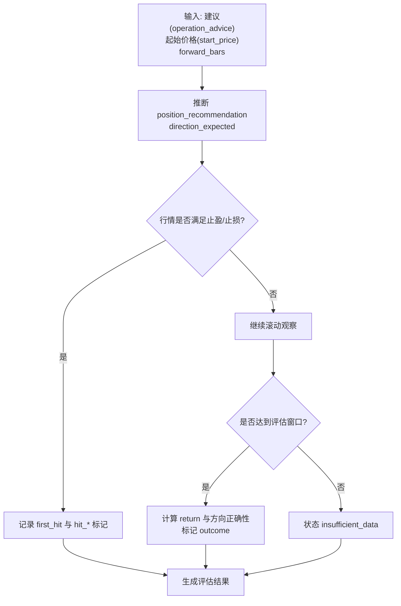
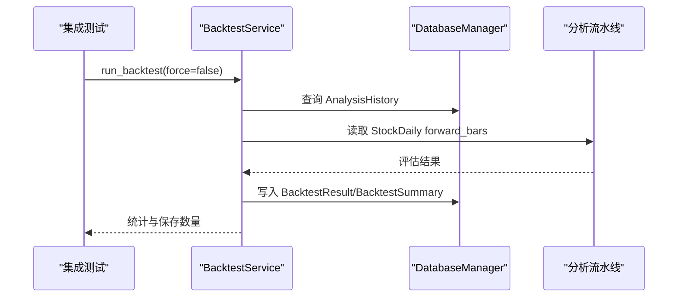
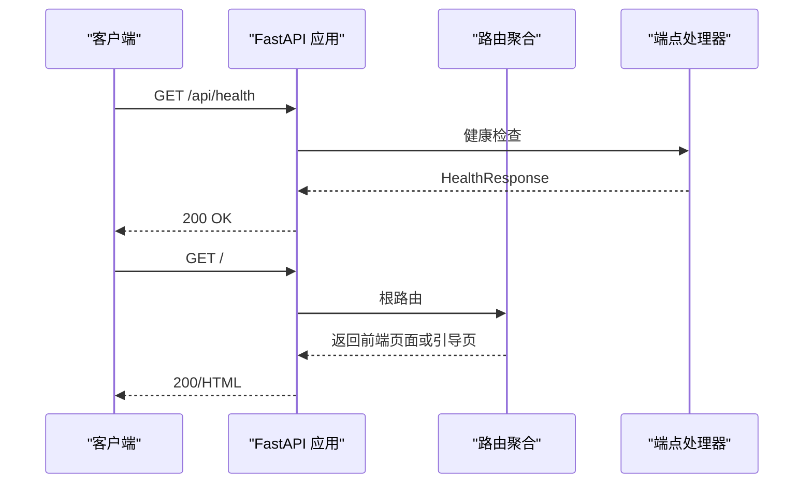
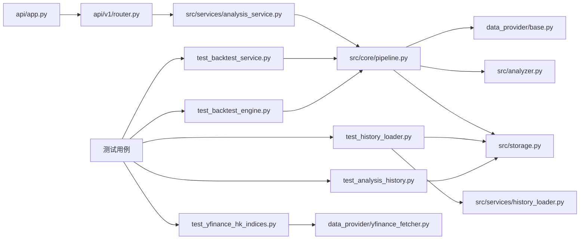

# 测试策略与实践

<cite>
**本文档引用的文件**
- [tests/test_analysis_history.py](file://tests/test_analysis_history.py)
- [tests/test_backtest_engine.py](file://tests/test_backtest_engine.py)
- [tests/test_backtest_service.py](file://tests/test_backtest_service.py)
- [tests/test_history_loader.py](file://tests/test_history_loader.py)
- [tests/test_yfinance_hk_indices.py](file://tests/test_yfinance_hk_indices.py)
- [test.sh](file://test.sh)
- [test_env.py](file://test_env.py)
- [pyproject.toml](file://pyproject.toml)
- [requirements.txt](file://requirements.txt)
- [src/analyzer.py](file://src/analyzer.py)
- [src/services/analysis_service.py](file://src/services/analysis_service.py)
- [src/services/history_loader.py](file://src/services/history_loader.py)
- [src/storage.py](file://src/storage.py)
- [src/config.py](file://src/config.py)
- [src/core/pipeline.py](file://src/core/pipeline.py)
- [data_provider/base.py](file://data_provider/base.py)
- [data_provider/yfinance_fetcher.py](file://data_provider/yfinance_fetcher.py)
- [api/app.py](file://api/app.py)
- [api/v1/router.py](file://api/v1/router.py)
</cite>

## 目录
1. [引言](#引言)
2. [项目结构](#项目结构)
3. [核心组件](#核心组件)
4. [架构总览](#架构总览)
5. [详细组件分析](#详细组件分析)
6. [依赖分析](#依赖分析)
7. [性能考虑](#性能考虑)
8. [故障排查指南](#故障排查指南)
9. [结论](#结论)
10. [附录](#附录)

## 引言
本测试策略与实践指南面向 A 股/港股/美股智能分析系统，围绕单元测试、集成测试与端到端测试的完整闭环，结合现有测试脚本与测试用例，提供可落地的测试方法论与最佳实践。内容覆盖：
- 单元测试：测试用例设计、Mock 对象使用、断言策略
- 集成测试：模块间交互、API 端到端测试
- 测试环境：环境变量、数据库、第三方依赖
- 测试覆盖率与 CI：覆盖率要求、持续集成中的测试执行与报告
- 具体示例：分析引擎、数据获取服务、API 接口测试
- TDD 与重构：测试驱动开发实践与重构过程中的测试维护

**更新** 新增历史加载服务测试和香港指数测试，覆盖 ContextVar 生命周期管理、DB-first 逻辑、网络回退场景等关键功能。

## 项目结构
项目采用分层架构与模块化组织，测试覆盖核心业务层、服务层、数据层与 API 层。

```mermaid
graph TB
subgraph "测试层"
UT1["单元测试<br/>tests/test_analysis_history.py"]
UT2["单元测试<br/>tests/test_backtest_engine.py"]
UT3["单元测试<br/>tests/test_backtest_service.py"]
UT4["单元测试<br/>tests/test_history_loader.py"]
UT5["单元测试<br/>tests/test_yfinance_hk_indices.py"]
ENV["环境验证脚本<br/>test_env.py"]
CLI["测试脚本<br/>test.sh"]
end
subgraph "应用层"
API["FastAPI 应用<br/>api/app.py"]
ROUTER["路由聚合<br/>api/v1/router.py"]
end
subgraph "服务层"
ANALYSIS_SVC["分析服务<br/>src/services/analysis_service.py"]
HISTORY_LOADER["历史加载服务<br/>src/services/history_loader.py"]
PIPELINE["分析流水线<br/>src/core/pipeline.py"]
end
subgraph "数据层"
STORAGE["存储与ORM<br/>src/storage.py"]
CONFIG["配置管理<br/>src/config.py"]
end
subgraph "数据源层"
FETCH_MGR["数据源管理器<br/>data_provider/base.py"]
YF_FET["Yfinance数据源<br/>data_provider/yfinance_fetcher.py"]
END
subgraph "AI 分析层"
ANALYZER["AI 分析器<br/>src/analyzer.py"]
end
UT1 --> STORAGE
UT2 --> PIPELINE
UT3 --> PIPELINE
UT4 --> HISTORY_LOADER
UT4 --> STORAGE
UT5 --> YF_FET
ENV --> CONFIG
ENV --> STORAGE
ENV --> ANALYZER
API --> ROUTER
ROUTER --> ANALYSIS_SVC
ANALYSIS_SVC --> PIPELINE
PIPELINE --> FETCH_MGR
PIPELINE --> STORAGE
PIPELINE --> ANALYZER
```

**图表来源**
- [tests/test_analysis_history.py:1-564](file://tests/test_analysis_history.py#L1-L564)
- [tests/test_backtest_engine.py:1-286](file://tests/test_backtest_engine.py#L1-L286)
- [tests/test_backtest_service.py:1-281](file://tests/test_backtest_service.py#L1-L281)
- [tests/test_history_loader.py:1-160](file://tests/test_history_loader.py#L1-L160)
- [tests/test_yfinance_hk_indices.py:1-206](file://tests/test_yfinance_hk_indices.py#L1-L206)
- [test_env.py:1-489](file://test_env.py#L1-L489)
- [test.sh:1-387](file://test.sh#L1-L387)
- [api/app.py:1-209](file://api/app.py#L1-L209)
- [api/v1/router.py:1-72](file://api/v1/router.py#L1-L72)
- [src/services/analysis_service.py:1-171](file://src/services/analysis_service.py#L1-L171)
- [src/services/history_loader.py:1-115](file://src/services/history_loader.py#L1-L115)
- [src/core/pipeline.py:1-800](file://src/core/pipeline.py#L1-L800)
- [src/storage.py:1-800](file://src/storage.py#L1-L800)
- [src/config.py:1-580](file://src/config.py#L1-L580)
- [data_provider/base.py:1-800](file://data_provider/base.py#L1-L800)
- [data_provider/yfinance_fetcher.py:1-777](file://data_provider/yfinance_fetcher.py#L1-L777)
- [src/analyzer.py:1-800](file://src/analyzer.py#L1-L800)

**章节来源**
- [tests/test_analysis_history.py:1-564](file://tests/test_analysis_history.py#L1-L564)
- [tests/test_backtest_engine.py:1-286](file://tests/test_backtest_engine.py#L1-L286)
- [tests/test_backtest_service.py:1-281](file://tests/test_backtest_service.py#L1-L281)
- [tests/test_history_loader.py:1-160](file://tests/test_history_loader.py#L1-L160)
- [tests/test_yfinance_hk_indices.py:1-206](file://tests/test_yfinance_hk_indices.py#L1-L206)
- [test_env.py:1-489](file://test_env.py#L1-L489)
- [test.sh:1-387](file://test.sh#L1-L387)
- [api/app.py:1-209](file://api/app.py#L1-L209)
- [api/v1/router.py:1-72](file://api/v1/router.py#L1-L72)
- [src/services/analysis_service.py:1-171](file://src/services/analysis_service.py#L1-L171)
- [src/services/history_loader.py:1-115](file://src/services/history_loader.py#L1-L115)
- [src/core/pipeline.py:1-800](file://src/core/pipeline.py#L1-L800)
- [src/storage.py:1-800](file://src/storage.py#L1-L800)
- [src/config.py:1-580](file://src/config.py#L1-L580)
- [data_provider/base.py:1-800](file://data_provider/base.py#L1-L800)
- [data_provider/yfinance_fetcher.py:1-777](file://data_provider/yfinance_fetcher.py#L1-L777)
- [src/analyzer.py:1-800](file://src/analyzer.py#L1-L800)

## 核心组件
- 分析引擎与 AI 分析器：封装 LLM 调用、新闻搜索与决策仪表盘生成，提供可测试的分析结果对象。
- 分析服务与流水线：协调数据获取、趋势分析、新闻情报、AI 分析与历史记录保存。
- 历史加载服务：提供 DB-first 的历史数据加载，支持 ContextVar 生命周期管理和网络回退。
- 存储层与数据库管理：统一 ORM、会话管理、断点续传与历史数据持久化。
- 数据源管理器与 Yfinance 数据源：策略模式的数据源选择、自动故障切换和港股指数获取。
- API 层：FastAPI 应用与路由聚合，提供对外接口与健康检查。

**更新** 新增历史加载服务和 Yfinance 数据源的测试覆盖，确保关键路径的稳定性。

**章节来源**
- [src/analyzer.py:1-800](file://src/analyzer.py#L1-L800)
- [src/services/analysis_service.py:1-171](file://src/services/analysis_service.py#L1-L171)
- [src/services/history_loader.py:1-115](file://src/services/history_loader.py#L1-L115)
- [src/core/pipeline.py:1-800](file://src/core/pipeline.py#L1-L800)
- [src/storage.py:1-800](file://src/storage.py#L1-L800)
- [data_provider/base.py:1-800](file://data_provider/base.py#L1-L800)
- [data_provider/yfinance_fetcher.py:1-777](file://data_provider/yfinance_fetcher.py#L1-L777)
- [api/app.py:1-209](file://api/app.py#L1-L209)

## 架构总览
测试策略贯穿以下层次：
- 单元测试：针对具体类与函数，使用临时数据库与 Mock 对象隔离外部依赖。
- 集成测试：验证模块间协作，如分析流水线、回测引擎与服务层。
- 端到端测试：通过测试脚本与 API 应用，验证完整流程（数据获取、AI 分析、历史记录、回测）。



**图表来源**
- [src/services/analysis_service.py:1-171](file://src/services/analysis_service.py#L1-L171)
- [src/core/pipeline.py:1-800](file://src/core/pipeline.py#L1-L800)
- [data_provider/base.py:1-800](file://data_provider/base.py#L1-L800)
- [src/storage.py:1-800](file://src/storage.py#L1-L800)
- [src/analyzer.py:1-800](file://src/analyzer.py#L1-L800)

## 详细组件分析

### 分析历史存储单元测试
目标：验证分析历史保存逻辑、上下文快照开关、详情查询与回测联动。
- 测试要点
  - 保存历史记录并写入/不写入上下文快照
  - model_used 字段持久化与详情隐藏占位符
  - dict/raw_result 场景下的详情解析
  - 英文报告的语言本地化
  - 删除历史记录时清理关联回测结果
  - DELETE /api/v1/history 的权限与删除行为
- Mock 与隔离
  - 使用临时数据库路径，重置配置与单例
  - 使用 patch 控制鉴权开关
- 断言策略
  - 核对 AnalysisHistory 字段与 JSON payload
  - 核对 HistoryService 详情字段与语言本地化结果



**图表来源**
- [tests/test_analysis_history.py:1-564](file://tests/test_analysis_history.py#L1-L564)

**章节来源**
- [tests/test_analysis_history.py:1-564](file://tests/test_analysis_history.py#L1-L564)

### 回测引擎单元测试
目标：验证回测评估逻辑、方向预期、止盈止损命中与中性带处理。
- 测试要点
  - 买入/卖出/持有/观望等建议在不同行情下的胜负与方向正确性
  - 止盈/止损命中优先级与首 hit 记录
  - 中性带与同日歧义处理
  - 数据不足场景的"insufficient_data"状态
  - 未知建议的默认"cash/flat"推断
- 断言策略
  - 核对 eval_status、outcome、direction_correct、hit_*、first_hit 等字段
  - 核对模拟开平仓与收益率



**图表来源**
- [tests/test_backtest_engine.py:1-286](file://tests/test_backtest_engine.py#L1-L286)

**章节来源**
- [tests/test_backtest_engine.py:1-286](file://tests/test_backtest_engine.py#L1-L286)

### 回测服务集成测试
目标：验证服务层对数据库的回测结果写入、汇总统计与查询。
- 测试要点
  - force 与 idempotent 语义
  - BacktestResult 字段正确性（方向、收益、目标命中）
  - 汇总统计（整体与个股）创建与字段一致性
  - get_summary 与 get_recent_evaluations 的分页与过滤
  - 多股票场景的整体聚合
- 断言策略
  - 核对 BacktestResult 与 BacktestSummary 的计数与比率
  - 核对 get_summary 的 sentinel code 转换



**图表来源**
- [tests/test_backtest_service.py:1-281](file://tests/test_backtest_service.py#L1-L281)

**章节来源**
- [tests/test_backtest_service.py:1-281](file://tests/test_backtest_service.py#L1-L281)

### 历史加载服务单元测试
目标：验证历史数据加载的 DB-first 逻辑、ContextVar 生命周期管理与网络回退机制。
- 测试要点
  - ContextVar 生命周期管理：冻结目标日期的设置、获取与重置
  - DB hit 路径：当数据库存在足够数据时直接返回缓存数据
  - DB miss → DFM 回退：数据库为空时使用数据源管理器获取数据
  - ContextVar 集成：使用冻结的目标日期作为查询结束日期
  - 代码规范化回退：对带前缀的代码进行规范化处理
  - 双路径失败优雅降级：数据库和网络都失败时返回 None
- Mock 与隔离
  - 使用 patch 隔离数据库连接和数据源管理器
  - 使用 MagicMock 构造测试数据
- 断言策略
  - 核对返回的 DataFrame 和数据源标识
  - 核对数据库查询参数（开始/结束日期）
  - 核对数据源调用次数和参数

```mermaid
flowchart TD
Start(["setUp: 创建 Mock"]) --> ContextVar["测试 ContextVar 生命周期"]
ContextVar --> DBHit["测试 DB hit 路径"]
DBHit --> DBMiss["测试 DB miss → DFM 回退"]
DBMiss --> ContextVarInteg["测试 ContextVar 集成"]
ContextVarInteg --> CodeNorm["测试代码规范化回退"]
CodeNorm --> GracefulFail["测试双路径失败优雅降级"]
GracefulFail --> End(["tearDown"])
flowchart TD
ContextVar --> SetGet["set_frozen_target_date()<br/>get_frozen_target_date()"]
SetGet --> Reset["reset_frozen_target_date()"]
flowchart TD
DBHit --> QueryDB["get_data_range() 调用"]
QueryDB --> CheckData{"数据充足?"}
CheckData --> |是| ReturnDB["返回 db_cache"]
CheckData --> |否| TryAlt["normalize_stock_code() 回退"]
flowchart TD
DBMiss --> CallDFM["get_daily_data() 调用"]
CallDFM --> CheckDFM{"数据非空?"}
CheckDFM --> |是| ReturnDFM["返回网络数据源"]
CheckDFM --> |否| ReturnNone["返回 None"]
```

**图表来源**
- [tests/test_history_loader.py:1-160](file://tests/test_history_loader.py#L1-L160)
- [src/services/history_loader.py:1-115](file://src/services/history_loader.py#L1-L115)

**章节来源**
- [tests/test_history_loader.py:1-160](file://tests/test_history_loader.py#L1-L160)
- [src/services/history_loader.py:1-115](file://src/services/history_loader.py#L1-L115)

### 港股指数数据源单元测试
目标：验证 Yfinance 数据源的港股指数获取逻辑、符号映射正确性和降级场景处理。
- 测试要点
  - 港股指数符号映射：恒生指数 (^HSI)、恒生科技 (^HSTECH.HK)、国企指数 (^HSCE)
  - 批量获取港股主要指数：HSI、HSTECH、HSCEI
  - 涨跌幅和振幅计算：基于历史数据计算当日涨跌和振幅
  - 部分失败降级：单个指数失败不影响其他指数获取
  - 全部失败处理：所有指数都失败时返回 None
  - 区域分发：region='hk' 时委托给 _get_hk_main_indices 方法
- Mock 与隔离
  - 使用 unittest.mock 模拟 yfinance 模块和 Ticker 对象
  - 构造包含历史数据的 DataFrame
- 断言策略
  - 核对返回的指数列表长度和字段完整性
  - 核对涨跌幅和振幅计算的精度
  - 核对错误符号不在调用参数中

```mermaid
flowchart TD
Start(["setUp: 创建 YfinanceFetcher"]) --> SymbolMap["测试符号映射"]
SymbolMap --> BatchGet["测试批量获取港股指数"]
BatchGet --> CalcVals["测试涨跌幅和振幅计算"]
CalcVals --> PartialFail["测试部分失败降级"]
PartialFail --> AllFail["测试全部失败处理"]
AllFail --> RegionDispatch["测试区域分发"]
flowchart TD
SymbolMap --> MakeMock["构造 mock_yf 和 mock_ticker"]
MakeMock --> CallTicker["调用 Ticker() 多次"]
CallTicker --> CheckCalls["验证调用参数包含正确符号"]
flowchart TD
BatchGet --> CreateHist["构造历史数据 DataFrame"]
CreateHist --> CallMethod["_get_hk_main_indices() 调用"]
CallMethod --> CheckResult["验证返回列表包含三个指数"]
CheckResult --> CheckFields["验证每个指数都有必需字段"]
```

**图表来源**
- [tests/test_yfinance_hk_indices.py:1-206](file://tests/test_yfinance_hk_indices.py#L1-L206)
- [data_provider/yfinance_fetcher.py:377-402](file://data_provider/yfinance_fetcher.py#L377-L402)

**章节来源**
- [tests/test_yfinance_hk_indices.py:1-206](file://tests/test_yfinance_hk_indices.py#L1-L206)
- [data_provider/yfinance_fetcher.py:307-402](file://data_provider/yfinance_fetcher.py#L307-L402)

### API 端到端测试
目标：验证 FastAPI 应用与路由聚合，以及健康检查与静态资源托管。
- 测试要点
  - CORS 配置与允许来源
  - 路由聚合与模块注册
  - 健康检查接口 /api/health
  - SPA 回退与静态资源托管
- 断言策略
  - 校验响应模型与状态码
  - 校验静态文件存在性与 MIME 类型



**图表来源**
- [api/app.py:1-209](file://api/app.py#L1-L209)
- [api/v1/router.py:1-72](file://api/v1/router.py#L1-L72)

**章节来源**
- [api/app.py:1-209](file://api/app.py#L1-L209)
- [api/v1/router.py:1-72](file://api/v1/router.py#L1-L72)

### 数据获取服务与数据源管理器
目标：验证数据源选择、标准化与技术指标计算。
- 测试要点
  - 标准化列名与清洗逻辑
  - 技术指标（MA5/MA10/MA20、量比）计算
  - 代码规范化与市场识别
  - 策略模式下的自动故障切换
- 断言策略
  - 核对 DataFrame 列名与数值精度
  - 核对 MA 与量比计算结果

**章节来源**
- [data_provider/base.py:1-800](file://data_provider/base.py#L1-L800)

### 配置与环境验证
目标：验证配置加载、数据库连接、数据源可用性、LLM 调用与通知推送。
- 测试要点
  - 配置加载与验证（令牌、模型、通知渠道）
  - 数据库连接与表结构
  - 数据源可用性与网络连通性
  - LLM 调用与错误诊断
  - 通知推送（企业微信）可用性
- 断言策略
  - 校验配置项存在与有效性
  - 校验数据库查询结果与表结构
  - 校验 LLM 返回字段与错误提示

**章节来源**
- [test_env.py:1-489](file://test_env.py#L1-L489)
- [src/config.py:1-580](file://src/config.py#L1-L580)
- [src/storage.py:1-800](file://src/storage.py#L1-L800)
- [src/analyzer.py:1-800](file://src/analyzer.py#L1-L800)

## 依赖分析
- 测试工具链
  - Python 单元测试框架 unittest
  - FastAPI TestClient（用于 API 端到端）
  - 临时数据库（SQLite）与环境变量隔离
- 外部依赖
  - LLM（Gemini/OpenAI）、搜索引擎（Tavily/SerpAPI/Brave）、数据源（Akshare/Yfinance/Tushare 等）
  - 数据库（SQLite）与 SQLAlchemy
- 依赖关系图



**图表来源**
- [tests/test_analysis_history.py:1-564](file://tests/test_analysis_history.py#L1-L564)
- [tests/test_backtest_engine.py:1-286](file://tests/test_backtest_engine.py#L1-L286)
- [tests/test_backtest_service.py:1-281](file://tests/test_backtest_service.py#L1-L281)
- [tests/test_history_loader.py:1-160](file://tests/test_history_loader.py#L1-L160)
- [tests/test_yfinance_hk_indices.py:1-206](file://tests/test_yfinance_hk_indices.py#L1-L206)
- [src/core/pipeline.py:1-800](file://src/core/pipeline.py#L1-L800)
- [data_provider/base.py:1-800](file://data_provider/base.py#L1-L800)
- [src/analyzer.py:1-800](file://src/analyzer.py#L1-L800)
- [src/storage.py:1-800](file://src/storage.py#L1-L800)
- [src/services/history_loader.py:1-115](file://src/services/history_loader.py#L1-L115)
- [data_provider/yfinance_fetcher.py:1-777](file://data_provider/yfinance_fetcher.py#L1-L777)
- [api/app.py:1-209](file://api/app.py#L1-L209)
- [api/v1/router.py:1-72](file://api/v1/router.py#L1-L72)
- [src/services/analysis_service.py:1-171](file://src/services/analysis_service.py#L1-L171)

**章节来源**
- [tests/test_analysis_history.py:1-564](file://tests/test_analysis_history.py#L1-L564)
- [tests/test_backtest_engine.py:1-286](file://tests/test_backtest_engine.py#L1-L286)
- [tests/test_backtest_service.py:1-281](file://tests/test_backtest_service.py#L1-L281)
- [tests/test_history_loader.py:1-160](file://tests/test_history_loader.py#L1-L160)
- [tests/test_yfinance_hk_indices.py:1-206](file://tests/test_yfinance_hk_indices.py#L1-L206)
- [src/core/pipeline.py:1-800](file://src/core/pipeline.py#L1-L800)
- [data_provider/base.py:1-800](file://data_provider/base.py#L1-L800)
- [src/analyzer.py:1-800](file://src/analyzer.py#L1-L800)
- [src/storage.py:1-800](file://src/storage.py#L1-L800)
- [src/services/history_loader.py:1-115](file://src/services/history_loader.py#L1-L115)
- [data_provider/yfinance_fetcher.py:1-777](file://data_provider/yfinance_fetcher.py#L1-L777)
- [api/app.py:1-209](file://api/app.py#L1-L209)
- [api/v1/router.py:1-72](file://api/v1/router.py#L1-L72)
- [src/services/analysis_service.py:1-171](file://src/services/analysis_service.py#L1-L171)

## 性能考虑
- 并发与重试
  - 数据源层内置流控与指数退避重试，避免 API 限流与封禁
  - 分析流水线使用线程池控制并发，降低网络抖动影响
  - 历史加载服务使用 ContextVar 实现线程安全的状态传递
- 数据缓存与断点续传
  - 通过 has_today_data 判断今日数据是否存在，避免重复抓取
  - 历史加载服务采用 DB-first 策略，减少网络请求
  - 技术指标在数据标准化阶段一次性计算，减少重复计算
- 回测性能
  - 评估窗口与中性带参数可配置，平衡准确性与性能
  - 汇总统计按整体与个股分别计算，避免全量扫描

**更新** 新增 ContextVar 生命周期管理和 DB-first 优化策略，显著提升 Agent 模式下的性能表现。

## 故障排查指南
- 配置问题
  - 使用环境验证脚本检查配置加载、数据库连接、数据源可用性与 LLM 调用
  - 关注令牌与代理设置，必要时设置 NO_PROXY 排除国内数据源
- 数据获取失败
  - 检查数据源优先级与 Token 配置，确认自动故障切换逻辑
  - 核对网络连通性与速率限制
  - 验证历史加载服务的 DB-first 逻辑是否正常工作
- LLM 调用异常
  - 根据错误提示区分超时、限流与 API Key 无效
  - 切换主备模型或使用 OpenAI 兼容 API
- 通知推送失败
  - 校验 Webhook URL 与认证参数
  - 检查消息长度限制与消息类型
- 港股指数获取失败
  - 验证 Yfinance 符号映射是否正确
  - 检查网络连接和 yfinance 服务可用性

**更新** 新增历史加载服务和 Yfinance 数据源的故障排查指导。

**章节来源**
- [test_env.py:1-489](file://test_env.py#L1-L489)
- [src/config.py:1-580](file://src/config.py#L1-L580)
- [src/analyzer.py:1-800](file://src/analyzer.py#L1-L800)
- [src/services/history_loader.py:1-115](file://src/services/history_loader.py#L1-L115)
- [data_provider/yfinance_fetcher.py:1-777](file://data_provider/yfinance_fetcher.py#L1-L777)

## 结论
本测试策略以"单元测试打地基、集成测试稳流程、端到端测试验全链路"为核心，结合 Mock 与临时数据库隔离外部依赖，覆盖分析引擎、数据获取、存储与 API 的关键路径。通过测试脚本与环境验证脚本，形成可重复、可自动化、可诊断的测试体系，支撑持续集成与发布流程。

**更新** 新增的历史加载服务和 Yfinance 指数测试进一步完善了测试覆盖，特别是 ContextVar 生命周期管理和 DB-first 优化策略的验证，确保系统在高并发场景下的稳定性和性能表现。

## 附录

### 测试环境搭建与测试数据准备
- 环境变量
  - 使用 .env 文件加载配置，支持 TOKEN、代理、通知渠道等
  - 通过 DATABASE_PATH 指定 SQLite 数据库路径
- 测试数据库
  - 单元测试使用临时数据库目录，避免污染生产数据
  - 通过环境变量覆盖默认路径并在测试结束后清理
- 第三方依赖
  - LLM：Gemini/OpenAI 兼容 API
  - 搜索引擎：Tavily/SerpAPI/Brave
  - 数据源：Akshare/Yfinance/Tushare 等

**章节来源**
- [test_env.py:1-489](file://test_env.py#L1-L489)
- [src/config.py:1-580](file://src/config.py#L1-L580)
- [tests/test_analysis_history.py:1-564](file://tests/test_analysis_history.py#L1-L564)

### 测试脚本与持续集成
- 测试脚本
  - 提供多种测试场景：大盘复盘、A/H/K/US 股、ETF、混合市场、单股推送、Dry-Run、快速测试等
  - 包含语法检查、Flake8 静态检查与代码识别测试
- 持续集成
  - 建议在 CI 中执行测试脚本与单元测试套件
  - 生成测试报告（JUnit/XML）并上传覆盖率（如 pytest-html 或 coverage）

**章节来源**
- [test.sh:1-387](file://test.sh#L1-L387)

### 测试覆盖率与报告
- 覆盖率要求
  - 建议核心模块（分析流水线、存储层、数据源管理器、历史加载服务）覆盖率不低于 80%
  - API 层与关键服务层不低于 70%
- 报告生成
  - 使用 pytest 生成 XML 报告，集成至 CI 平台
  - 生成 HTML 报告便于人工审查

**章节来源**
- [pyproject.toml:1-29](file://pyproject.toml#L1-L29)
- [requirements.txt:1-65](file://requirements.txt#L1-L65)

### 具体测试示例路径
- 分析引擎测试
  - [src/analyzer.py:1-800](file://src/analyzer.py#L1-L800)
- 数据获取服务测试
  - [data_provider/base.py:1-800](file://data_provider/base.py#L1-L800)
- 历史加载服务测试
  - [src/services/history_loader.py:1-115](file://src/services/history_loader.py#L1-L115)
- Yfinance 港股指数测试
  - [data_provider/yfinance_fetcher.py:377-402](file://data_provider/yfinance_fetcher.py#L377-L402)
- API 接口测试
  - [api/app.py:1-209](file://api/app.py#L1-L209)
  - [api/v1/router.py:1-72](file://api/v1/router.py#L1-L72)

**更新** 新增历史加载服务和 Yfinance 指数测试的示例路径。

**章节来源**
- [src/analyzer.py:1-800](file://src/analyzer.py#L1-L800)
- [data_provider/base.py:1-800](file://data_provider/base.py#L1-L800)
- [src/services/history_loader.py:1-115](file://src/services/history_loader.py#L1-L115)
- [data_provider/yfinance_fetcher.py:307-402](file://data_provider/yfinance_fetcher.py#L307-L402)
- [api/app.py:1-209](file://api/app.py#L1-L209)
- [api/v1/router.py:1-72](file://api/v1/router.py#L1-L72)

### 测试驱动开发（TDD）与重构
- TDD 实践
  - 先编写失败的单元测试，再实现最小功能通过测试
  - 针对分析引擎与回测引擎的关键逻辑，先写边界与异常场景
  - 新增功能时先写测试，再实现功能，确保测试驱动开发
- 重构过程中的测试维护
  - 保持测试对行为而非实现的验证
  - 重构后运行完整测试集，确保回归通过
  - 对 Mock 与数据库隔离进行回归验证
  - 特别关注 ContextVar 生命周期和 DB-first 逻辑的测试

**更新** 新增 ContextVar 生命周期和 DB-first 逻辑的 TDD 指导。

[本节为通用指导，不涉及特定文件分析]