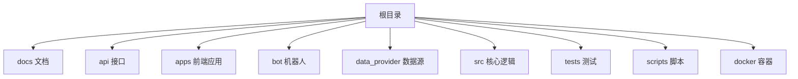
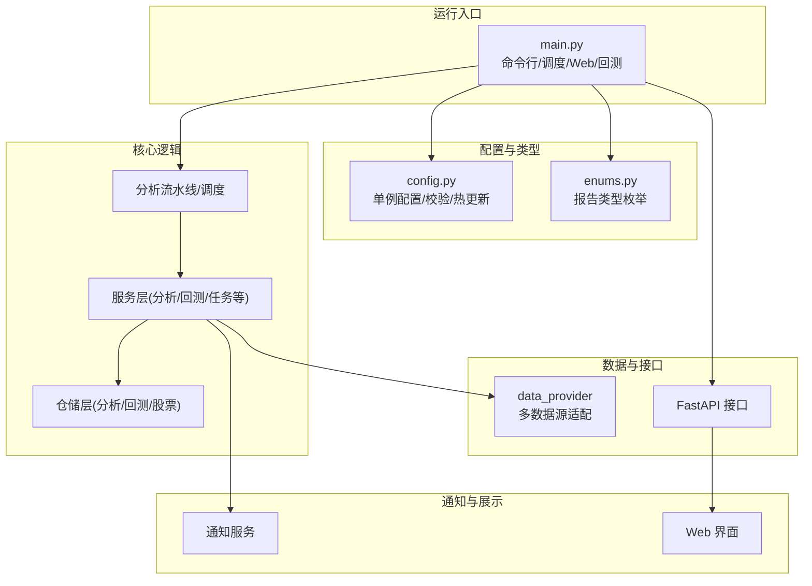
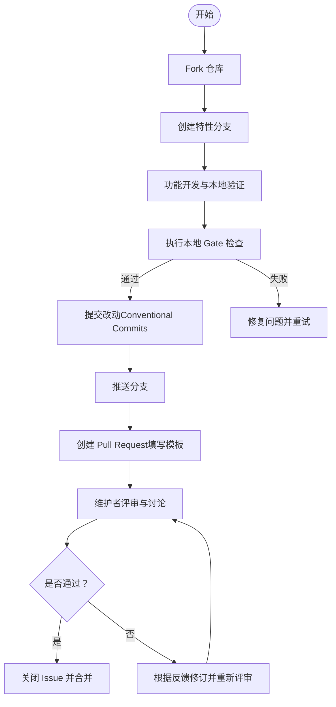
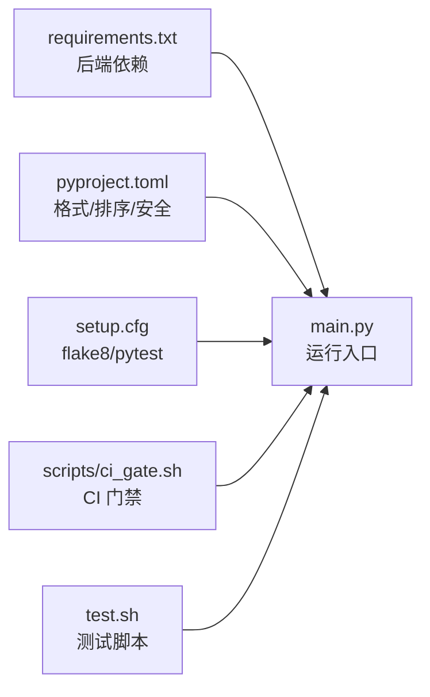

# 贡献指南

<cite>
**本文引用的文件**
- [CONTRIBUTING.md](file://docs/CONTRIBUTING.md)
- [README.md](file://README.md)
- [PULL_REQUEST_TEMPLATE.md](file://.github/PULL_REQUEST_TEMPLATE.md)
- [bug_report.md](file://.github/ISSUE_TEMPLATE/bug_report.md)
- [feature_request.md](file://.github/ISSUE_TEMPLATE/feature_request.md)
- [ci_gate.sh](file://scripts/ci_gate.sh)
- [test.sh](file://test.sh)
- [requirements.txt](file://requirements.txt)
- [pyproject.toml](file://pyproject.toml)
- [setup.cfg](file://setup.cfg)
- [main.py](file://main.py)
- [config.py](file://src/config.py)
- [enums.py](file://src/enums.py)
</cite>

## 目录
1. [简介](#简介)
2. [项目结构](#项目结构)
3. [核心组件](#核心组件)
4. [架构总览](#架构总览)
5. [详细组件分析](#详细组件分析)
6. [依赖关系分析](#依赖关系分析)
7. [性能与质量保障](#性能与质量保障)
8. [故障排查指南](#故障排查指南)
9. [结语](#结语)
10. [附录](#附录)

## 简介
本指南面向首次贡献者与长期贡献者，系统讲解如何参与本开源项目的开发与维护，涵盖 Fork 流程、本地开发环境搭建、第一次贡献步骤、代码与文档贡献流程、Issue 认领与 PR 提交规范、社区行为准则与协作原则、新贡献者入门与学习资源、贡献认可与长期权益等内容。项目采用多语言与多平台结合的架构，支持本地运行、Docker 部署与 GitHub Actions 自动化，提供 Web 界面与多种通知渠道。

## 项目结构
项目采用模块化与功能域分离的组织方式，主要目录与职责如下：
- docs：贡献指南、部署说明、常见问题与各类文档
- api：FastAPI 后端接口与路由
- apps：前端应用（Web 与桌面）
- bot：多平台机器人（钉钉、飞书、Discord 等）
- data_provider：多数据源适配层
- src：核心业务逻辑（分析、服务、仓储、调度等）
- tests：单元与集成测试
- scripts：CI 门禁脚本与部署辅助脚本
- docker：容器化与服务编排

**章节来源**
- [README.md: 1-284:1-284](file://README.md#L1-L284)

## 核心组件
- 主入口与调度：负责命令行参数解析、定时任务、Web 服务启动、分析流程编排与异常处理
- 配置管理：集中式单例配置，支持 .env 加载、类型安全访问与热更新
- 枚举与类型：统一报告类型等枚举，提升可读性与健壮性
- CI 与测试：本地 Gate 检查、pytest 标记化测试、脚本化验证

**章节来源**
- [main.py: 1-723:1-723](file://main.py#L1-L723)
- [config.py: 1-580:1-580](file://src/config.py#L1-L580)
- [enums.py: 1-51:1-51](file://src/enums.py#L1-L51)

## 架构总览
系统由“主入口调度器”驱动，贯穿“配置管理”“数据源适配”“分析引擎”“通知与报告”“Web 服务”等模块，并通过 CI 与测试保障质量。

**图表来源**
- [main.py: 510-723:510-723](file://main.py#L510-L723)
- [config.py: 31-244:31-244](file://src/config.py#L31-L244)
- [enums.py: 13-51:13-51](file://src/enums.py#L13-L51)

**章节来源**
- [main.py: 510-723:510-723](file://main.py#L510-L723)
- [config.py: 31-244:31-244](file://src/config.py#L31-L244)

## 详细组件分析

### 代码贡献流程（含 Issue 认领、开发与 PR 规范）
- Issue 认领与沟通
  - 报告 Bug：使用 Bug 报告模板，提供复现步骤、环境信息与期望/实际行为
  - 功能建议：使用 Feature Request 模板，描述使用场景、期望实现与备选方案
  - 讨论与索引：通过 Discussions 与现有 Issue 进行沟通，避免重复劳动
- 本地开发与验证
  - Fork 仓库后，创建特性分支，提交前执行本地 Gate 检查（Python 语法、flake8 严重错误、离线测试）
  - 前端变更时执行 lint 与 build 检查
- 提交与评审
  - 遵循 Conventional Commits 规范
  - PR 模板需填写背景、范围、Issue 关联、验证命令与结果、兼容性与风险、回滚计划等
  - 通过 CI 自动检查（backend-gate、docker-build、web-gate、network-smoke）

**图表来源**
- [CONTRIBUTING.md: 17-118:17-118](file://docs/CONTRIBUTING.md#L17-L118)
- [PULL_REQUEST_TEMPLATE.md: 1-76:1-76](file://.github/PULL_REQUEST_TEMPLATE.md#L1-L76)
- [ci_gate.sh: 1-22:1-22](file://scripts/ci_gate.sh#L1-L22)

**章节来源**
- [CONTRIBUTING.md: 5-118:5-118](file://docs/CONTRIBUTING.md#L5-L118)
- [.github/ISSUE_TEMPLATE/bug_report.md: 1-66:1-66](file://.github/ISSUE_TEMPLATE/bug_report.md#L1-L66)
- [.github/ISSUE_TEMPLATE/feature_request.md: 1-39:1-39](file://.github/ISSUE_TEMPLATE/feature_request.md#L1-L39)
- [PULL_REQUEST_TEMPLATE.md: 1-76:1-76](file://.github/PULL_REQUEST_TEMPLATE.md#L1-L76)
- [ci_gate.sh: 1-22:1-22](file://scripts/ci_gate.sh#L1-L22)

### 文档贡献方法（改进、翻译与示例）
- 文档改进：针对 docs/ 目录下的指南、FAQ、部署说明等进行修订，确保与最新实现一致
- 翻译工作：英文文档位于 docs/README_EN.md、docs/DEPLOY_EN.md 等，翻译需保持术语一致与上下文连贯
- 示例代码贡献：新增使用示例或最佳实践，配合 README 与 docs 说明
- PR 规范：在 PR 描述中说明文档落点与是否同步更新 README.md

**章节来源**
- [CONTRIBUTING.md: 101-118:101-118](file://docs/CONTRIBUTING.md#L101-L118)

### 社区行为准则与协作原则
- 尊重与包容：维护开放、尊重、包容的社区氛围
- 建设性反馈：以事实和数据为基础进行讨论，避免人身攻击
- 透明沟通：优先使用 Issue 与 Discussions 记录与追踪
- 代码即文档：良好的命名、注释与测试是贡献的重要组成部分

（本节为通用原则说明，不直接分析具体文件）

### 新贡献者入门、导师与学习资源
- 新贡献者入门
  - 阅读贡献指南与 README，理解项目目标与技术栈
  - 从简单 Issue（如文档改进、小修复）入手，逐步熟悉代码与流程
- 导师制度
  - 通过 Discussions 与维护者建立联系，寻求指导与反馈
- 学习资源
  - 项目内置完整指南与 FAQ
  - 相关技术栈文档（FastAPI、Python、前端构建工具链）

**章节来源**
- [README.md: 14-284:14-284](file://README.md#L14-L284)
- [CONTRIBUTING.md: 101-118:101-118](file://docs/CONTRIBUTING.md#L101-L118)

### 贡献认可与长期权益
- 贡献认可：PR 被合并后计入贡献记录，贡献者可在社区中获得认可
- 贡献者列表管理：通过提交记录与贡献统计进行维护
- 长期贡献者权益：优先邀请参与设计评审、功能规划与治理讨论

（本节为通用机制说明，不直接分析具体文件）

## 依赖关系分析
- 后端依赖：通过 requirements.txt 管理核心库（数据源、AI、网络、报告模板、Web 框架等）
- 代码风格与静态检查：pyproject.toml 配置 black/isort，setup.cfg 配置 flake8 忽略规则与 pytest 标记
- CI 门禁：scripts/ci_gate.sh 聚合语法检查、flake8 严重错误、离线测试与确定性检查

**图表来源**
- [requirements.txt: 1-65:1-65](file://requirements.txt#L1-L65)
- [pyproject.toml: 1-29:1-29](file://pyproject.toml#L1-L29)
- [setup.cfg: 1-34:1-34](file://setup.cfg#L1-L34)
- [ci_gate.sh: 1-22:1-22](file://scripts/ci_gate.sh#L1-L22)
- [test.sh: 1-387:1-387](file://test.sh#L1-L387)

**章节来源**
- [requirements.txt: 1-65:1-65](file://requirements.txt#L1-L65)
- [pyproject.toml: 1-29:1-29](file://pyproject.toml#L1-L29)
- [setup.cfg: 1-34:1-34](file://setup.cfg#L1-L34)
- [ci_gate.sh: 1-22:1-22](file://scripts/ci_gate.sh#L1-L22)
- [test.sh: 1-387:1-387](file://test.sh#L1-L387)

## 性能与质量保障
- 本地 Gate 检查
  - Python 语法检查：py_compile 指定关键模块
  - flake8 严重错误：聚焦 E9/F63/F7/F82 等
  - 离线测试：pytest 标记化测试，避免网络依赖
- 前端 Gate（如修改前端）：lint 与 build
- CI 自动检查：backend-gate、docker-build、web-gate、network-smoke（观测项）

**章节来源**
- [ci_gate.sh: 5-22:5-22](file://scripts/ci_gate.sh#L5-L22)
- [setup.cfg: 19-28:19-28](file://setup.cfg#L19-L28)
- [CONTRIBUTING.md: 75-100:75-100](file://docs/CONTRIBUTING.md#L75-L100)

## 故障排查指南
- 环境与依赖
  - 确认 Python 版本与依赖安装，参考 requirements.txt 与 README 快速开始
- 配置问题
  - 使用 config.validate() 输出缺失或无效配置项的警告，逐项补齐
- 通知渠道
  - 检查各通知渠道的必要配置项是否齐全（Webhook、Token、ID 等）
- 测试验证
  - 使用 test.sh 的不同场景快速定位问题（如 market、quick、syntax、flake8）
- CI 失败
  - 按 PR 模板要求补充验证命令与结果，确保本地 Gate 通过

**章节来源**
- [config.py: 507-546:507-546](file://src/config.py#L507-L546)
- [test.sh: 80-286:80-286](file://test.sh#L80-L286)
- [CONTRIBUTING.md: 75-100:75-100](file://docs/CONTRIBUTING.md#L75-L100)

## 结语
感谢每一位贡献者的付出。请遵循本指南完成 Fork、开发与 PR 流程，积极参与社区讨论与协作，共同推动项目演进与质量提升。

## 附录
- 快速参考
  - 本地开发：克隆仓库、创建虚拟环境、安装依赖、复制 .env.example 为 .env
  - 提交流程：Fork → 分支 → 提交 → 推送 → PR（填写模板）
  - CI 检查：backend-gate、docker-build、web-gate、network-smoke
- 相关链接
  - 贡献指南：docs/CONTRIBUTING.md
  - 完整指南与 FAQ：docs/full-guide.md、docs/FAQ.md
  - 英文文档：docs/README_EN.md、docs/DEPLOY_EN.md

**章节来源**
- [CONTRIBUTING.md: 19-118:19-118](file://docs/CONTRIBUTING.md#L19-L118)
- [README.md: 14-284:14-284](file://README.md#L14-L284)