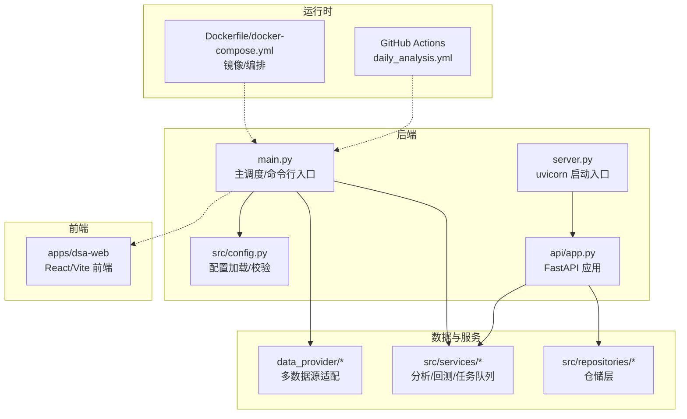
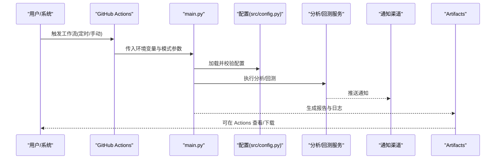
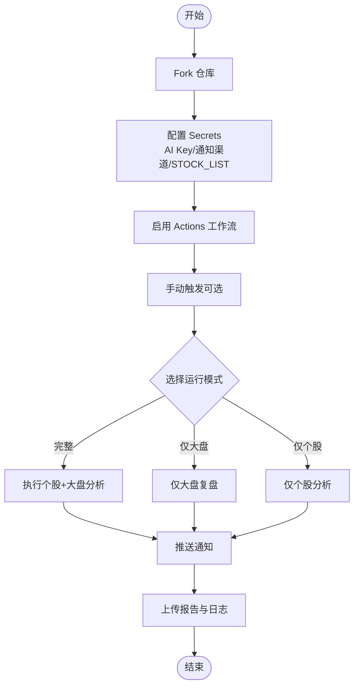
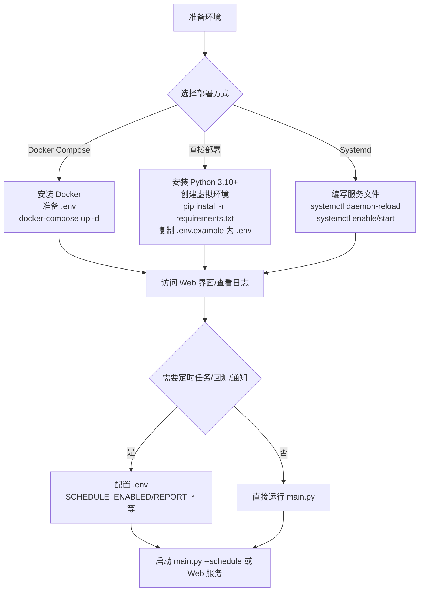
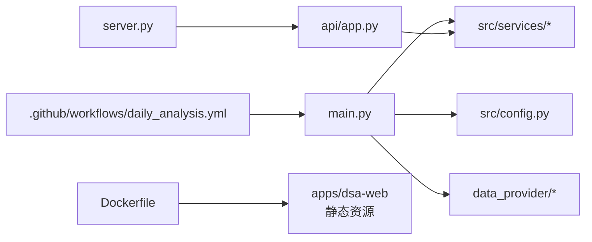

# 快速开始

<cite>
**本文引用的文件**
- [README.md](file://README.md)
- [.env.example](file://.env.example)
- [requirements.txt](file://requirements.txt)
- [pyproject.toml](file://pyproject.toml)
- [docker/Dockerfile](file://docker/Dockerfile)
- [docker/docker-compose.yml](file://docker/docker-compose.yml)
- [main.py](file://main.py)
- [server.py](file://server.py)
- [src/config.py](file://src/config.py)
- [.github/workflows/daily_analysis.yml](file://.github/workflows/daily_analysis.yml)
- [docs/DEPLOY.md](file://docs/DEPLOY.md)
- [scripts/deploy-to-synology.sh](file://scripts/deploy-to-synology.sh)
- [scripts/setup-t0-weekly-service.sh](file://scripts/setup-t0-weekly-service.sh)
- [scripts/t0_weekly_scheduler.py](file://scripts/t0_weekly_scheduler.py)
</cite>

## 目录
1. [简介](#简介)
2. [项目结构](#项目结构)
3. [核心组件](#核心组件)
4. [架构总览](#架构总览)
5. [详细组件分析](#详细组件分析)
6. [依赖关系分析](#依赖关系分析)
7. [性能与并发](#性能与并发)
8. [故障排除指南](#故障排除指南)
9. [结论](#结论)
10. [附录](#附录)

## 简介
本指南面向首次部署“股票智能分析系统”的用户，提供两种部署路径的完整步骤：GitHub Actions 自动化部署与本地/Docker 部署。文档覆盖环境变量配置、依赖安装、配置文件设置、启动与验证、以及常见问题排查，帮助新手在最短时间内完成部署并稳定运行。

## 项目结构
系统采用前后端分离与模块化设计：
- 后端主程序与调度：main.py、server.py
- 配置管理：src/config.py
- API 服务：api/app.py（由 server.py 导入）
- 数据提供层：data_provider/*（多数据源适配）
- 服务层：src/services/*（分析、回测、任务队列等）
- Web 界面：apps/dsa-web（React/Vite 前端）
- Docker 镜像与编排：docker/Dockerfile、docker/docker-compose.yml
- GitHub Actions 工作流：.github/workflows/daily_analysis.yml
- 辅助脚本：scripts/*（T+0 选股池相关）

图表来源
- [main.py:1-723](file://main.py#L1-L723)
- [server.py:1-55](file://server.py#L1-L55)
- [src/config.py:1-800](file://src/config.py#L1-L800)
- [docker/Dockerfile:1-77](file://docker/Dockerfile#L1-L77)
- [.github/workflows/daily_analysis.yml:1-286](file://.github/workflows/daily_analysis.yml#L1-L286)

章节来源
- [README.md:88-277](file://README.md#L88-L277)
- [docs/DEPLOY.md:18-140](file://docs/DEPLOY.md#L18-L140)

## 核心组件
- 配置系统（src/config.py）：统一从 .env 加载配置，提供类型安全访问与校验，支持多渠道 LLM、搜索、通知、回测、WebUI 等配置项。
- 主调度（main.py）：解析命令行参数，协调分析流程（个股+大盘复盘），支持定时任务、Web 服务、回测、强制执行等模式。
- API 服务（server.py + api/app.py）：提供健康检查、分析接口、文件上传等 RESTful 能力，支持 CORS 与托管静态资源。
- 数据提供层（data_provider/*）：多数据源（AkShare、Tushare、Pytdx、Baostock、YFinance、TickFlow）统一抽象。
- Docker 镜像与编排（docker/Dockerfile、docker/docker-compose.yml）：多阶段构建前端与后端，暴露 API 端口，挂载数据/日志/报告目录。
- GitHub Actions（.github/workflows/daily_analysis.yml）：定时执行分析，支持多渠道通知与报告归档。

章节来源
- [src/config.py:417-791](file://src/config.py#L417-L791)
- [main.py:57-214](file://main.py#L57-L214)
- [server.py:20-55](file://server.py#L20-L55)
- [docker/Dockerfile:1-77](file://docker/Dockerfile#L1-L77)
- [.github/workflows/daily_analysis.yml:1-286](file://.github/workflows/daily_analysis.yml#L1-L286)

## 架构总览
系统支持两种运行模式：
- GitHub Actions 自动化：无服务器、定时执行、推送通知、报告归档。
- 本地/Docker：可选 Web 界面、定时任务、API 服务、回测与历史管理。

图表来源
- [.github/workflows/daily_analysis.yml:31-286](file://.github/workflows/daily_analysis.yml#L31-L286)
- [main.py:510-723](file://main.py#L510-L723)
- [src/config.py:398-415](file://src/config.py#L398-L415)

## 详细组件分析

### GitHub Actions 自动化部署（零服务器）
- 适用场景：无需服务器、自动定时、推送通知、报告归档。
- 关键步骤：
  1) Fork 仓库并创建仓库 Secret（至少配置一个 AI Key 与 STOCK_LIST）。
  2) 在 Actions 中启用工作流。
  3) 可手动触发选择模式（完整/仅大盘/仅个股），支持强制运行（跳过交易日检查）。
  4) 查看运行日志与报告归档（Artifacts）。

图表来源
- [README.md:90-244](file://README.md#L90-L244)
- [.github/workflows/daily_analysis.yml:3-256](file://.github/workflows/daily_analysis.yml#L3-L256)

章节来源
- [README.md:90-244](file://README.md#L90-L244)
- [.github/workflows/daily_analysis.yml:1-286](file://.github/workflows/daily_analysis.yml#L1-L286)

### 本地/Docker 部署
- Docker Compose（推荐）：
  - 安装 Docker，准备 .env，一键启动定时分析与 Web 服务。
  - 容器内自动构建前端，数据/日志/报告目录持久化。
  - 常用命令：启动/停止/重启/进入容器/手动执行分析。
- 直接部署（Python 环境）：
  - 安装 Python 3.10+，创建虚拟环境，安装依赖，复制并编辑 .env。
  - 支持单次运行、定时任务、后台运行、Web 界面（云服务器需开放端口与设置监听地址）。
- Systemd 服务（长期稳定运行）：
  - 创建服务文件，设置开机自启与自动重启，查看状态与日志。

图表来源
- [docs/DEPLOY.md:18-190](file://docs/DEPLOY.md#L18-L190)
- [docker/docker-compose.yml:1-69](file://docker/docker-compose.yml#L1-L69)
- [docker/Dockerfile:1-77](file://docker/Dockerfile#L1-L77)
- [main.py:510-723](file://main.py#L510-L723)

章节来源
- [docs/DEPLOY.md:18-190](file://docs/DEPLOY.md#L18-L190)
- [docker/docker-compose.yml:1-69](file://docker/docker-compose.yml#L1-L69)
- [docker/Dockerfile:1-77](file://docker/Dockerfile#L1-L77)
- [main.py:510-723](file://main.py#L510-L723)

### 环境变量与配置要点
- 必填项（至少配置一个 AI Key 与 STOCK_LIST）：
  - AI 模型：GEMINI_API_KEY、OPENAI_*、ANTHROPIC_*、AIHUBMIX_KEY、OLLAMA_API_BASE 等。
  - 通知渠道：WECHAT_WEBHOOK_URL、FEISHU_WEBHOOK_URL、TELEGRAM_*、EMAIL_*、DISCORD_*、PUSHPLUS_*、SERVERCHAN3_*、CUSTOM_WEBHOOK_* 等。
  - 数据源：TUSHARE_TOKEN（可选）。
  - 自选股：STOCK_LIST（逗号分隔）。
- 可选项（按需配置）：
  - 定时任务：SCHEDULE_ENABLED、SCHEDULE_TIME、SCHEDULE_RUN_IMMEDIATELY、TRADING_DAY_CHECK_ENABLED。
  - 报告与推送：REPORT_TYPE、REPORT_LANGUAGE、REPORT_SUMMARY_ONLY、MERGE_EMAIL_NOTIFICATION、MARKDOWN_TO_IMAGE_*。
  - 并发与性能：MAX_WORKERS、ANALYSIS_DELAY、PREFETCH_REALTIME_QUOTES。
  - WebUI：WEBUI_ENABLED、WEBUI_HOST、WEBUI_PORT、WEBUI_AUTO_BUILD。
  - Agent 对话：AGENT_MODE、AGENT_LITELLM_MODEL、AGENT_MAX_STEPS、AGENT_SKILLS、AGENT_ARCH、AGENT_ORCHESTRATOR_MODE。
  - 基本面与回测：ENABLE_FUNDAMENTAL_PIPELINE、BACKTEST_*、FUNDAMENTAL_*。
  - 实时行情与数据源优先级：ENABLE_REALTIME_QUOTE、REALTIME_SOURCE_PRIORITY、YFINANCE_PRIORITY 等。

章节来源
- [.env.example:6-520](file://.env.example#L6-L520)
- [src/config.py:417-791](file://src/config.py#L417-L791)
- [README.md:111-222](file://README.md#L111-L222)

### 依赖安装与工具链
- Python 依赖：requirements.txt 列出核心库（LiteLLM、FastAPI、数据源、搜索、通知、报告模板、Markdown 转图片等）。
- 前端构建：Dockerfile 多阶段构建前端（Node 20），server.py 与 main.py 启动时可自动构建。
- 代码规范：pyproject.toml 配置 black/isort/bandit。

章节来源
- [requirements.txt:1-65](file://requirements.txt#L1-L65)
- [docker/Dockerfile:6-14](file://docker/Dockerfile#L6-L14)
- [pyproject.toml:1-29](file://pyproject.toml#L1-L29)

### 启动与验证
- GitHub Actions：手动触发后在 Actions 页面查看日志与 Artifacts。
- 本地/Docker：访问 http://127.0.0.1:8000（或云服务器公网IP:8000），查看 Web 界面与 API 文档。
- 健康检查：Dockerfile 中 HEALTHCHECK 指向 /health 或 /api/health。
- 常用命令：
  - Docker：docker-compose logs/f/ps/exec 进入容器执行分析。
  - 直接部署：python main.py --webui-only/--webui/--schedule/--serve/--serve-only。
  - Web 服务：uvicorn server:app 或 main.py --serve/--serve-only。

章节来源
- [.github/workflows/daily_analysis.yml:258-286](file://.github/workflows/daily_analysis.yml#L258-L286)
- [docker/Dockerfile:70-77](file://docker/Dockerfile#L70-L77)
- [main.py:542-581](file://main.py#L542-L581)
- [server.py:46-55](file://server.py#L46-L55)

### 高级配置与运维
- 代理：Docker 环境通过环境变量配置 http_proxy/https_proxy；本地可通过 USE_PROXY/PROXY_HOST/PROXY_PORT。
- 数据持久化：Docker 挂载 data/logs/reports 目录；直接部署需确保目录存在。
- 监控与维护：查看日志、定期清理旧日志与报告、健康检查、迁移备份。
- T+0 选股池：提供 Synology 部署脚本与 systemd 服务脚本，支持每周定时任务与飞书通知。

章节来源
- [docs/DEPLOY.md:215-320](file://docs/DEPLOY.md#L215-L320)
- [scripts/deploy-to-synology.sh:1-225](file://scripts/deploy-to-synology.sh#L1-L225)
- [scripts/setup-t0-weekly-service.sh:1-271](file://scripts/setup-t0-weekly-service.sh#L1-L271)
- [scripts/t0_weekly_scheduler.py:1-227](file://scripts/t0_weekly_scheduler.py#L1-L227)

## 依赖关系分析
- 组件耦合：
  - main.py 依赖 src/config.py 进行配置加载与校验，协调服务层与通知模块。
  - server.py 导入 api/app.py，提供 API 服务；main.py 可在 Web 模式下启动 API。
  - data_provider/* 为服务层提供统一数据访问；Dockerfile 将前端静态资源复制到 static。
- 外部依赖：
  - LLM：LiteLLM 统一调用 Gemini、OpenAI、Anthropic、AIHubMix、Ollama 等。
  - 数据源：AkShare、Tushare、Pytdx、Baostock、YFinance、TickFlow。
  - 通知：飞书、企业微信、Telegram、Discord、Pushover、PushPlus、Server酱3、自定义 Webhook。
  - 搜索：Tavily、SerpAPI、Bocha、Brave、MiniMax、SearXNG。

图表来源
- [main.py:24-51](file://main.py#L24-L51)
- [server.py:39-43](file://server.py#L39-L43)
- [docker/Dockerfile:44-51](file://docker/Dockerfile#L44-L51)
- [.github/workflows/daily_analysis.yml:50-53](file://.github/workflows/daily_analysis.yml#L50-L53)

章节来源
- [main.py:24-51](file://main.py#L24-L51)
- [server.py:39-43](file://server.py#L39-L43)
- [docker/Dockerfile:44-51](file://docker/Dockerfile#L44-L51)
- [.github/workflows/daily_analysis.yml:50-53](file://.github/workflows/daily_analysis.yml#L50-L53)

## 性能与并发
- 并发与限流：
  - MAX_WORKERS 控制异步分析任务队列并发线程数（默认 3），避免 API 限流。
  - ANALYSIS_DELAY 在个股与大盘分析间增加延迟，降低限流风险。
  - 配置层提供多渠道 LLM 与多 Key 负载均衡，提高可用性。
- 资源限制（Docker）：
  - docker-compose.yml 限制容器内存上限与保留，避免资源争用。
- 代理与网络：
  - USE_PROXY/PROXY_HOST/PROXY_PORT 仅在本地开发环境生效；Docker 通过环境变量配置代理。

章节来源
- [src/config.py:639-713](file://src/config.py#L639-L713)
- [docker/docker-compose.yml:48-54](file://docker/docker-compose.yml#L48-L54)
- [main.py:28-37](file://main.py#L28-L37)

## 故障排除指南
- GitHub Actions：
  - 无服务器环境，每次运行是新环境；定时可能有几分钟延迟；无法提供 HTTP API。
  - 查看 Artifacts 中的 reports 与 logs，核对配置 Secret 是否正确。
- Docker：
  - 构建失败：清理缓存重新构建；检查 requirements.txt 与网络。
  - 数据库锁定：停止服务后删除 lock 文件。
  - 内存不足：调整 docker-compose.yml 中的内存限制。
  - Web 界面无法访问：检查安全组放行端口、WEBUI_HOST 设置为 0.0.0.0。
- 本地部署：
  - 代理问题：国内服务器访问 Gemini 需代理；可设置 http_proxy/https_proxy。
  - 端口占用：更换 WEBUI_PORT 或停止占用进程。
  - 权限问题：确保 data/logs/reports 目录可读写。
- 通用：
  - 配置校验：运行前会输出配置警告；严格模式下错误将导致启动失败。
  - 日志查看：Docker 使用 docker-compose logs -f；直接部署查看 logs/stock_analysis_*.log。

章节来源
- [.github/workflows/daily_analysis.yml:444-452](file://.github/workflows/daily_analysis.yml#L444-L452)
- [docs/DEPLOY.md:272-320](file://docs/DEPLOY.md#L272-L320)
- [main.py:531-535](file://main.py#L531-L535)

## 结论
通过本快速开始指南，您可以：
- 选择 GitHub Actions 或本地/Docker 两种部署路径，快速完成系统部署与验证。
- 正确配置环境变量与通知渠道，确保分析与推送正常。
- 使用常见命令与运维技巧，保障系统稳定运行。
- 遇到问题时，依据故障排除指南快速定位与解决。

## 附录
- 常用命令速查：
  - Docker：docker-compose up -d、logs -f、ps、exec、restart、down。
  - 本地：python main.py --schedule/--webui/--serve/--serve-only。
  - Web：访问 http://127.0.0.1:8000（或云服务器公网IP:8000）。
- 配置模板：参考 .env.example，按需填写 AI Key、通知渠道、STOCK_LIST、定时任务等。
- 高级功能：Agent 对话、回测、WebUI 认证、Markdown 转图片、实时行情增强等。

章节来源
- [docs/DEPLOY.md:18-190](file://docs/DEPLOY.md#L18-L190)
- [.env.example:6-520](file://.env.example#L6-L520)
- [main.py:542-581](file://main.py#L542-L581)