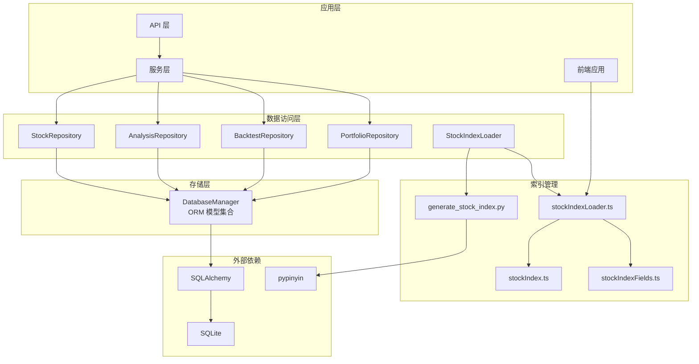
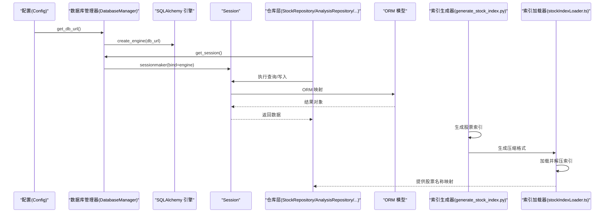
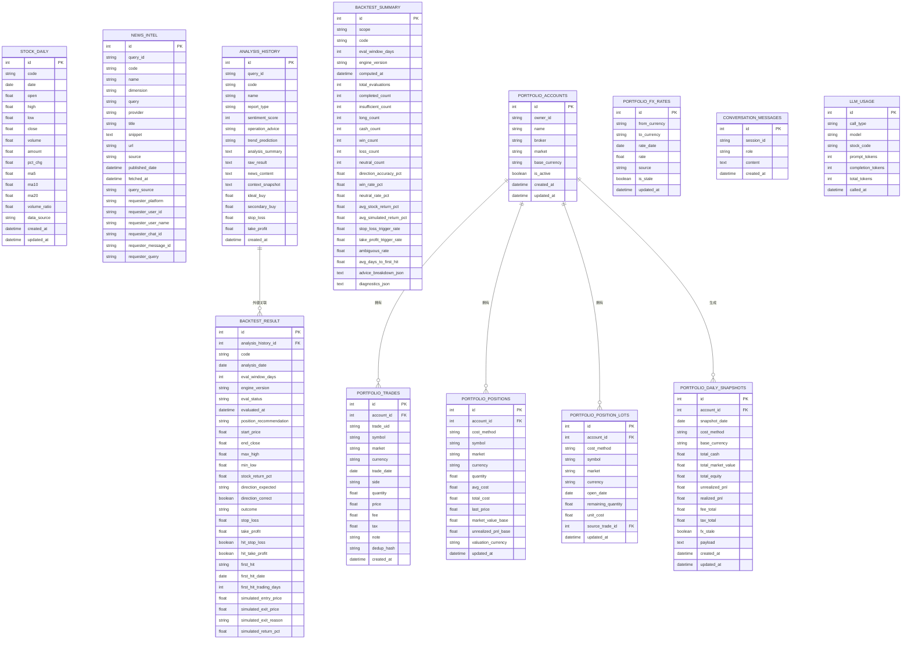
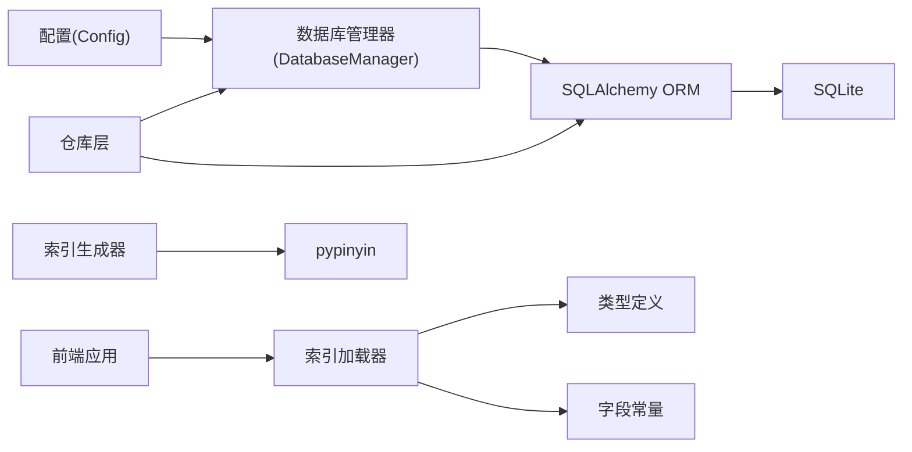

# 数据库设计

<cite>
**本文引用的文件**
- [src/storage.py](file://src/storage.py)
- [src/config.py](file://src/config.py)
- [src/repositories/stock_repo.py](file://src/repositories/stock_repo.py)
- [src/repositories/analysis_repo.py](file://src/repositories/analysis_repo.py)
- [src/repositories/portfolio_repo.py](file://src/repositories/portfolio_repo.py)
- [src/repositories/backtest_repo.py](file://src/repositories/backtest_repo.py)
- [src/data/stock_index_loader.py](file://src/data/stock_index_loader.py)
- [scripts/generate_stock_index.py](file://scripts/generate_stock_index.py)
- [apps/dsa-web/src/utils/stockIndexLoader.ts](file://apps/dsa-web/src/utils/stockIndexLoader.ts)
- [apps/dsa-web/src/types/stockIndex.ts](file://apps/dsa-web/src/types/stockIndex.ts)
- [apps/dsa-web/src/utils/stockIndexFields.ts](file://apps/dsa-web/src/utils/stockIndexFields.ts)
- [requirements.txt](file://requirements.txt)
- [docker/docker-compose.yml](file://docker/docker-compose.yml)
</cite>

## 更新摘要
**所做更改**
- 新增 SQLite 性能优化章节，包含 WAL 模式、忙等待超时和写入重试机制
- 新增股票索引管理章节，涵盖索引生成、压缩格式和前端加载机制
- 更新数据访问模式章节，反映 SQLite 特殊的批量写入和去重策略
- 新增索引字段规范和约束，包括压缩格式的字段定义
- 更新性能考量章节，重点说明 SQLite 优化策略和索引管理改进

## 目录
1. [简介](#简介)
2. [项目结构](#项目结构)
3. [核心组件](#核心组件)
4. [架构总览](#架构总览)
5. [详细组件分析](#详细组件分析)
6. [依赖分析](#依赖分析)
7. [性能考量](#性能考量)
8. [故障排查指南](#故障排查指南)
9. [结论](#结论)
10. [附录](#附录)

## 简介
本文件面向股票分析系统的数据库设计，聚焦于数据模型定义、实体关系、索引与约束策略、数据访问模式、查询优化与缓存策略、数据生命周期与迁移、备份恢复与容量规划、安全与访问控制等主题。系统采用 SQLite 作为本地存储，结合 SQLAlchemy ORM 进行模型定义与数据访问，并通过统一的数据库管理器提供连接池与事务封装。本次更新重点反映了 SQLite 性能优化改进和股票索引管理的新功能。

## 项目结构
数据库相关的核心代码集中在存储层与仓库层：
- 存储层：定义 ORM 模型、数据库引擎与会话管理、数据写入与查询辅助方法
- 仓库层：面向业务的 DAO 层，封装对具体表的查询与聚合
- 配置层：提供数据库路径与连接 URL 的构造
- 索引管理层：负责股票索引的生成、压缩和前端加载
- 依赖清单：声明 SQLAlchemy 与运行时所需依赖

**图表来源**
- [src/storage.py](file://src/storage.py)
- [src/data/stock_index_loader.py](file://src/data/stock_index_loader.py)
- [scripts/generate_stock_index.py](file://scripts/generate_stock_index.py)
- [apps/dsa-web/src/utils/stockIndexLoader.ts](file://apps/dsa-web/src/utils/stockIndexLoader.ts)
- [apps/dsa-web/src/types/stockIndex.ts](file://apps/dsa-web/src/types/stockIndex.ts)
- [apps/dsa-web/src/utils/stockIndexFields.ts](file://apps/dsa-web/src/utils/stockIndexFields.ts)

**章节来源**
- [src/storage.py](file://src/storage.py)
- [src/config.py](file://src/config.py)
- [src/data/stock_index_loader.py](file://src/data/stock_index_loader.py)
- [scripts/generate_stock_index.py](file://scripts/generate_stock_index.py)
- [apps/dsa-web/src/utils/stockIndexLoader.ts](file://apps/dsa-web/src/utils/stockIndexLoader.ts)
- [apps/dsa-web/src/types/stockIndex.ts](file://apps/dsa-web/src/types/stockIndex.ts)
- [apps/dsa-web/src/utils/stockIndexFields.ts](file://apps/dsa-web/src/utils/stockIndexFields.ts)
- [requirements.txt](file://requirements.txt)

## 核心组件
- 数据库管理器：负责创建引擎、会话工厂、表创建与生命周期管理，包含 SQLite 专用的性能优化配置
- ORM 模型：涵盖日线行情、新闻情报、分析历史、回测结果与汇总、组合账户与持仓、FX 汇率、对话与 LLM 使用统计等
- 仓库层：封装对各表的查询、分页、聚合与清理逻辑
- 配置：提供数据库路径与连接 URL 的构造，确保目录存在
- 股票索引管理器：负责索引文件的生成、压缩和前端加载，支持两种数据格式

**章节来源**
- [src/storage.py](file://src/storage.py)
- [src/config.py](file://src/config.py)
- [src/repositories/stock_repo.py](file://src/repositories/stock_repo.py)
- [src/repositories/analysis_repo.py](file://src/repositories/analysis_repo.py)
- [src/repositories/backtest_repo.py](file://src/repositories/backtest_repo.py)
- [src/repositories/portfolio_repo.py](file://src/repositories/portfolio_repo.py)
- [src/data/stock_index_loader.py](file://src/data/stock_index_loader.py)

## 架构总览
系统采用"配置驱动 + ORM + 仓库层 + 索引管理"的四层结构：
- 配置层：提供数据库路径与连接 URL
- 存储层：定义模型、建立连接、提供会话与事务，包含 SQLite 性能优化
- 仓库层：面向业务的查询封装，屏蔽底层细节
- 索引管理层：负责股票索引的生成、压缩和前端加载

**图表来源**
- [src/config.py](file://src/config.py)
- [src/storage.py](file://src/storage.py)
- [src/repositories/stock_repo.py](file://src/repositories/stock_repo.py)
- [src/repositories/analysis_repo.py](file://src/repositories/analysis_repo.py)
- [scripts/generate_stock_index.py](file://scripts/generate_stock_index.py)
- [apps/dsa-web/src/utils/stockIndexLoader.ts](file://apps/dsa-web/src/utils/stockIndexLoader.ts)

## 详细组件分析

### 数据模型与实体关系
系统围绕"股票日线行情""分析历史""新闻情报""回测结果/汇总""投资组合账户/交易/头寸/快照/FX""对话与 LLM 使用"等核心实体构建。下图展示主要实体及其关系：

**图表来源**
- [src/storage.py](file://src/storage.py)

**章节来源**
- [src/storage.py](file://src/storage.py)

### 数据模型字段规范与约束
- 股票日线表（StockDaily）
  - 主键：自增整数
  - 唯一约束：code + date
  - 索引：code、date、联合索引(code,date)
  - 字段：OHLCV、涨跌幅、MA5/10/20、量比、数据源、时间戳
- 新闻情报（NewsIntel）
  - 主键：自增整数
  - 唯一约束：url
  - 索引：query_id、code、dimension、provider、published_date、fetched_at、query_source、requester_* 等
  - 字段：查询上下文、请求者信息、标题、摘要、URL、来源、发布时间、抓取时间
- 分析历史（AnalysisHistory）
  - 主键：自增整数
  - 索引：code、created_at
  - 字段：query_id、股票信息、报告类型、情感分数、操作建议、趋势预测、摘要、原始结果、新闻内容、上下文快照、狙击点位、创建时间
- 回测结果（BacktestResult）
  - 主键：自增整数
  - 唯一约束：analysis_history_id + eval_window_days + engine_version
  - 索引：analysis_history_id、code、analysis_date
  - 字段：评估窗口、引擎版本、状态、方向与结果、价格与收益、目标价命中、模拟执行
- 回测汇总（BacktestSummary）
  - 主键：自增整数
  - 唯一约束：scope + code + eval_window_days + engine_version
  - 字段：统计计数、准确率/胜率、平均收益、目标价触发率、诊断与明细
- 组合账户（PortfolioAccount）
  - 主键：自增整数
  - 索引：owner_id、is_active、market
  - 字段：所有者、名称、券商、市场、币种、状态、时间戳
- 交易（PortfolioTrade）
  - 主键：自增整数
  - 唯一约束：account_id + trade_uid、account_id + dedup_hash
  - 索引：account_id、trade_date、symbol、trade_uid、dedup_hash
  - 字段：标的、市场、币种、交易日、买卖方向、数量、价格、费用、备注
- 持仓（PortfolioPosition）
  - 主键：自增整数
  - 唯一约束：account_id + symbol + market + currency + cost_method
  - 字段：成本法、数量、均价、总成本、最新价、市值、损益、币种、更新时间
- 持仓批次（PortfolioPositionLot）
  - 主键：自增整数
  - 索引：account_id、symbol
  - 字段：批次开仓日期、剩余数量、单位成本、来源交易
- 日终快照（PortfolioDailySnapshot）
  - 主键：自增整数
  - 唯一约束：account_id + snapshot_date + cost_method
  - 字段：现金、市值、权益、损益、费用与税、FX 状态、载荷、时间戳
- 汇率（PortfolioFxRate）
  - 主键：自增整数
  - 唯一约束：from_currency + to_currency + rate_date
  - 索引：from_currency、to_currency、rate_date
  - 字段：源、是否陈旧、更新时间
- 对话（ConversationMessage）
  - 主键：自增整数
  - 索引：session_id、created_at
  - 字段：会话、角色、内容、时间戳
- LLM 使用（LLMUsage）
  - 主键：自增整数
  - 索引：call_type、model、stock_code、called_at
  - 字段：调用类型、模型、股票代码、Token 统计、时间戳

**章节来源**
- [src/storage.py](file://src/storage.py)

### 股票索引管理与优化
系统实现了完整的股票索引管理机制，包括索引生成、压缩和前端加载：

#### 索引生成与压缩
- **索引生成器**：`generate_stock_index.py` 负责从 STOCK_NAME_MAP 生成股票索引，支持拼音字段生成和别名处理
- **压缩格式**：将对象格式转换为元组数组，显著减少文件大小
- **市场分类**：自动识别 A 股、港股、美股等市场类型
- **canonicalCode 生成**：为每个股票生成标准化代码格式

#### 前端索引加载
- **双格式支持**：同时支持对象格式和压缩元组格式
- **智能降级**：当压缩格式加载失败时自动回退到对象格式
- **查找优化**：提供高效的股票查找和流行度排序功能
- **市场分组**：支持按市场类型分组显示股票

#### 索引字段规范
- **标准格式**：canonicalCode、displayCode、nameZh、pinyinFull、pinyinAbbr、aliases、market、assetType、active、popularity
- **压缩格式**：使用固定索引位置映射标准字段
- **搜索配置**：支持精确匹配、前缀匹配、包含匹配和模糊匹配
- **性能阈值**：定义不同的匹配分数阈值

**章节来源**
- [scripts/generate_stock_index.py](file://scripts/generate_stock_index.py)
- [src/data/stock_index_loader.py](file://src/data/stock_index_loader.py)
- [apps/dsa-web/src/utils/stockIndexLoader.ts](file://apps/dsa-web/src/utils/stockIndexLoader.ts)
- [apps/dsa-web/src/types/stockIndex.ts](file://apps/dsa-web/src/types/stockIndex.ts)
- [apps/dsa-web/src/utils/stockIndexFields.ts](file://apps/dsa-web/src/utils/stockIndexFields.ts)

### 数据访问模式与查询优化
- 会话与事务
  - 使用会话工厂创建 Session，提供 session_scope 上下文管理，自动提交/回滚/关闭
  - 单例数据库管理器集中管理引擎与会话生命周期
  - SQLite 专用的写入事务管理，支持重试机制
- 查询模式
  - 仓储层封装常用查询：按 code/日期范围、按 query_id、分页、聚合统计
  - 使用索引字段进行过滤与排序，避免全表扫描
- 写入策略
  - 日线数据采用 UPSERT 逻辑：存在则更新，不存在则插入，避免重复
  - 新闻情报按 URL 去重，缺失时使用标题+来源+发布日期的哈希键兜底
  - SQLite 专用的批量写入优化，支持分块处理和去重检查
- 缓存策略
  - 搜索与基本面缓存：内存缓存 + TTL + FIFO 淘汰，降低外部 API 压力
  - SQLite 层面：合理索引与唯一约束减少重复写入与冲突
  - 股票索引缓存：前端应用层缓存生成的索引数据

**章节来源**
- [src/storage.py](file://src/storage.py)
- [src/repositories/stock_repo.py](file://src/repositories/stock_repo.py)
- [src/repositories/analysis_repo.py](file://src/repositories/analysis_repo.py)
- [src/repositories/backtest_repo.py](file://src/repositories/backtest_repo.py)
- [src/repositories/portfolio_repo.py](file://src/repositories/portfolio_repo.py)
- [src/data/stock_index_loader.py](file://src/data/stock_index_loader.py)

### SQLite 性能优化
系统针对 SQLite 实施了多项性能优化策略：

#### WAL 模式优化
- **写入并发**：启用 WAL（Write-Ahead Logging）模式，允许多个读取操作与单个写入操作并发执行
- **自动配置**：通过 PRAGMA journal_mode=WAL 自动启用
- **文件数据库专用**：仅对文件型 SQLite 数据库生效

#### 忙等待超时配置
- **busy_timeout**：设置数据库锁定等待超时时间，避免立即失败
- **动态配置**：支持通过环境变量 SQLITE_BUSY_TIMEOUT_MS 配置
- **默认值**：提供合理的默认等待时间

#### 写入重试机制
- **指数退避**：SQLite 写入冲突时采用指数退避重试策略
- **最大重试次数**：可配置的最大重试次数
- **基础延迟**：可配置的基础重试延迟时间
- **事务保护**：在 BEGIN IMMEDIATE 事务中执行写入操作

#### 批量写入优化
- **分块处理**：SQLite 语句绑定参数限制（约 999），采用 50 条记录分块处理
- **去重检查**：批量写入前先检查现有日期，仅插入新记录
- **原子操作**：使用 ON CONFLICT DO UPDATE 确保数据一致性

**章节来源**
- [src/storage.py](file://src/storage.py)
- [src/config.py](file://src/config.py)
- [tests/test_storage.py](file://tests/test_storage.py)

### 数据生命周期管理、归档与清理
- 生命周期
  - 日线数据：按交易日增量写入，按日期索引高效查询
  - 分析历史：按创建时间倒序，支持按天/按股票筛选
  - 新闻情报：按抓取时间与发布日期排序，支持近 N 天检索
  - 回测结果/汇总：按评估窗口与引擎版本聚合，支持按股票/全局维度
  - 组合数据：按账户维度维护交易、头寸、批次与日终快照
  - 股票索引：定期重新生成，支持缓存失效和自动更新
- 归档与清理
  - 未见显式的自动归档/清理策略；可通过外部脚本定期清理过期数据（建议基于 created_at/fetched_at/date 等时间字段）
  - SQLite 文件可通过压缩与 VACUUM 维护（建议在低峰期执行）
  - 股票索引文件定期重新生成，保持数据新鲜度

**章节来源**
- [src/storage.py](file://src/storage.py)
- [src/repositories/analysis_repo.py](file://src/repositories/analysis_repo.py)
- [src/repositories/backtest_repo.py](file://src/repositories/backtest_repo.py)
- [scripts/generate_stock_index.py](file://scripts/generate_stock_index.py)

### 数据迁移路径、版本管理与向后兼容
- 版本管理
  - 回测引擎版本字段（engine_version）用于区分不同回测逻辑
  - 唯一约束包含引擎版本，避免跨版本重复评估
  - 股票索引格式支持向后兼容，自动处理新旧格式
- 迁移路径
  - 新增字段：通过 UniqueConstraint/Index 扩展，保持既有查询兼容
  - 新增表：遵循现有命名与索引策略，确保查询路径稳定
  - 索引格式：支持压缩格式与对象格式双向转换
- 向后兼容
  - 读取侧使用 JSON 字段与可选字段，写入侧提供默认值，避免破坏既有流程
  - 索引加载器自动检测格式并进行相应处理

**章节来源**
- [src/storage.py](file://src/storage.py)
- [src/repositories/backtest_repo.py](file://src/repositories/backtest_repo.py)
- [apps/dsa-web/src/utils/stockIndexLoader.ts](file://apps/dsa-web/src/utils/stockIndexLoader.ts)

### 备份恢复、性能监控与容量规划
- 备份恢复
  - SQLite 文件可整体备份；建议在停止写入或使用只读模式时进行
  - Docker 模式下通过卷挂载持久化 data 目录，便于备份与恢复
  - 股票索引文件定期重新生成，支持快速恢复
- 性能监控
  - LLM 使用统计表记录 Token 使用量，可用于成本与性能分析
  - SQLite 性能监控：可通过 PRAGMA 命令监控忙等待、WAL 状态等
  - 建议引入慢查询日志与索引使用率监控（SQLite PRAGMA）
- 容量规划
  - 日线数据按股票数量线性增长；建议按年维度评估磁盘空间
  - 股票索引文件大小通过压缩算法显著减小
  - Docker Compose 默认内存限制可作为参考，生产环境建议根据负载调整

**章节来源**
- [src/storage.py](file://src/storage.py)
- [docker/docker-compose.yml](file://docker/docker-compose.yml)

### 数据安全、访问控制与隐私保护
- 认证与登录保护
  - Web 设置页与 API 接口支持管理员密码认证，启用/关闭认证需校验当前会话或当前密码
  - 密码设置与修改流程包含必要校验与错误提示
- 隐私保护
  - 对话与请求者信息字段包含最小必要原则的记录；建议对敏感字段脱敏或按需裁剪
  - 外部 API Key 通过环境变量注入，避免硬编码
  - 股票索引数据不包含敏感信息，仅包含公开的股票基本信息

**章节来源**
- [src/storage.py](file://src/storage.py)
- [apps/dsa-web/src/components/settings/AuthSettingsCard.tsx](file://apps/dsa-web/src/components/settings/AuthSettingsCard.tsx)

## 依赖分析
- 外部依赖
  - SQLAlchemy：ORM 与数据库抽象
  - SQLite：内置数据库，无需额外安装
  - pypinyin：用于生成中文股票名称的拼音索引
- 内部依赖
  - 配置层提供数据库路径与连接 URL
  - 存储层集中管理引擎与会话
  - 仓库层面向业务封装查询
  - 索引管理层提供股票数据的生成和加载

**图表来源**
- [src/config.py](file://src/config.py)
- [src/storage.py](file://src/storage.py)
- [scripts/generate_stock_index.py](file://scripts/generate_stock_index.py)
- [apps/dsa-web/src/utils/stockIndexLoader.ts](file://apps/dsa-web/src/utils/stockIndexLoader.ts)

**章节来源**
- [requirements.txt](file://requirements.txt)
- [src/config.py](file://src/config.py)
- [src/storage.py](file://src/storage.py)
- [scripts/generate_stock_index.py](file://scripts/generate_stock_index.py)

## 性能考量
- 索引策略
  - 高频过滤字段建立索引（如 code、date、query_id、created_at、published_date 等）
  - 复合索引覆盖常见查询路径（如 code+date、account_id+trade_date 等）
  - 股票索引使用压缩格式，显著减少内存占用和传输时间
- 写入优化
  - 批量写入与 UPSERT 逻辑减少重复写入
  - 去重策略（URL/唯一键）降低冲突与回滚
  - SQLite 专用的分块处理和重试机制
- 查询优化
  - 使用分页与 LIMIT 控制结果集规模
  - 聚合查询使用 group_by 与 count/sum 等函数
  - 股票索引查询使用预生成的查找键
- 缓存
  - 搜索与基本面缓存降低外部依赖压力
  - SQLite 层面通过索引与唯一约束提升一致性与性能
  - 前端应用层缓存股票索引数据

**章节来源**
- [src/storage.py](file://src/storage.py)
- [scripts/generate_stock_index.py](file://scripts/generate_stock_index.py)
- [apps/dsa-web/src/utils/stockIndexLoader.ts](file://apps/dsa-web/src/utils/stockIndexLoader.ts)

## 故障排查指南
- SQLite 锁定错误
  - 识别"database is locked/schema is locked/table is locked"等错误，进行重试或回滚
  - 检查 busy_timeout 配置是否合理
  - 使用 WAL 模式提高并发性能
- 会话与事务
  - 使用 session_scope 确保异常时自动回滚
  - SQLite 写入操作自动处理重试机制
- 数据重复与去重
  - 新闻情报按 URL 去重；URL 缺失时使用标题+来源+发布日期的哈希键兜底
  - 日线数据使用 code+date 唯一约束避免重复
- 回测幂等性
  - 通过唯一约束与 force 参数避免重复评估
- 股票索引问题
  - 索引加载失败时自动回退到对象格式
  - 检查索引文件格式和完整性
  - 验证压缩格式的字段映射正确性

**章节来源**
- [src/storage.py](file://src/storage.py)
- [src/repositories/portfolio_repo.py](file://src/repositories/portfolio_repo.py)
- [apps/dsa-web/src/utils/stockIndexLoader.ts](file://apps/dsa-web/src/utils/stockIndexLoader.ts)

## 结论
该数据库设计以 SQLite 为基础，通过 SQLAlchemy ORM 实现清晰的数据模型与访问层分离。本次更新重点加强了 SQLite 性能优化和股票索引管理功能。合理的索引与唯一约束保障了查询与写入的稳定性，仓库层封装提升了业务可维护性。SQLite 的 WAL 模式、忙等待超时和写入重试机制显著提升了并发性能和可靠性。股票索引的压缩格式和智能加载机制大幅改善了前端性能和用户体验。建议在生产环境中完善归档与清理策略、引入慢查询与容量监控，并持续评估索引与查询模式以适配数据增长。

## 附录
- 开发者扩展指引
  - 新增表：遵循现有命名、索引与唯一约束风格，补充仓库层查询方法
  - 新增字段：提供默认值与可选字段，避免破坏既有流程
  - 查询优化：优先使用索引字段过滤，避免 SELECT *，合理分页与 LIMIT
  - SQLite 优化：利用 WAL 模式、忙等待超时和写入重试机制
  - 索引管理：遵循压缩格式规范，提供完整的字段映射
- 运维建议
  - 定期备份 SQLite 文件
  - Docker 模式下通过卷挂载持久化数据
  - 低峰期执行 VACUUM 与索引维护
  - 监控 SQLite 性能指标，及时调整配置参数
  - 定期重新生成股票索引文件，保持数据新鲜度

**章节来源**
- [src/storage.py](file://src/storage.py)
- [scripts/generate_stock_index.py](file://scripts/generate_stock_index.py)
- [apps/dsa-web/src/utils/stockIndexLoader.ts](file://apps/dsa-web/src/utils/stockIndexLoader.ts)