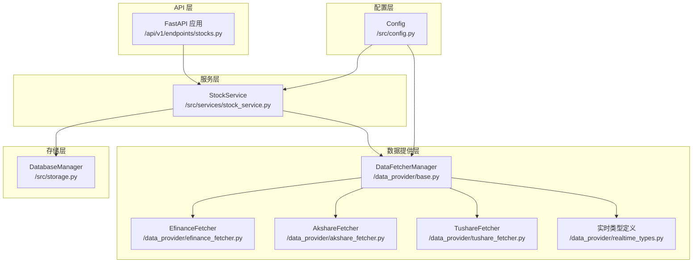
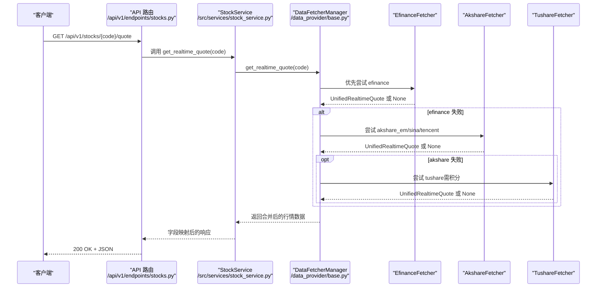
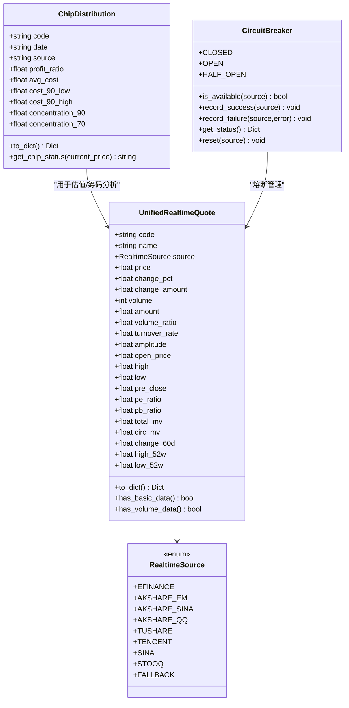
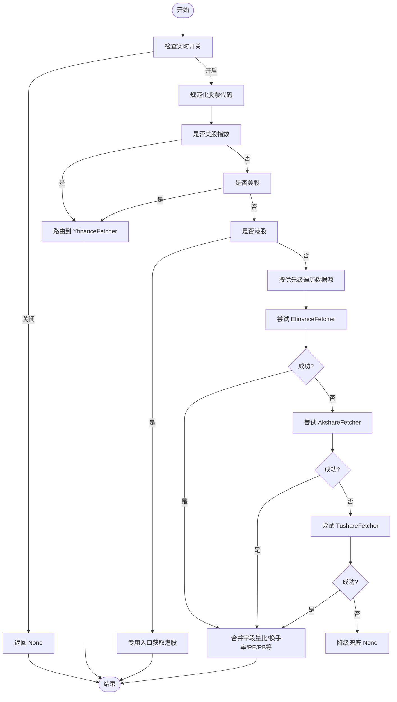
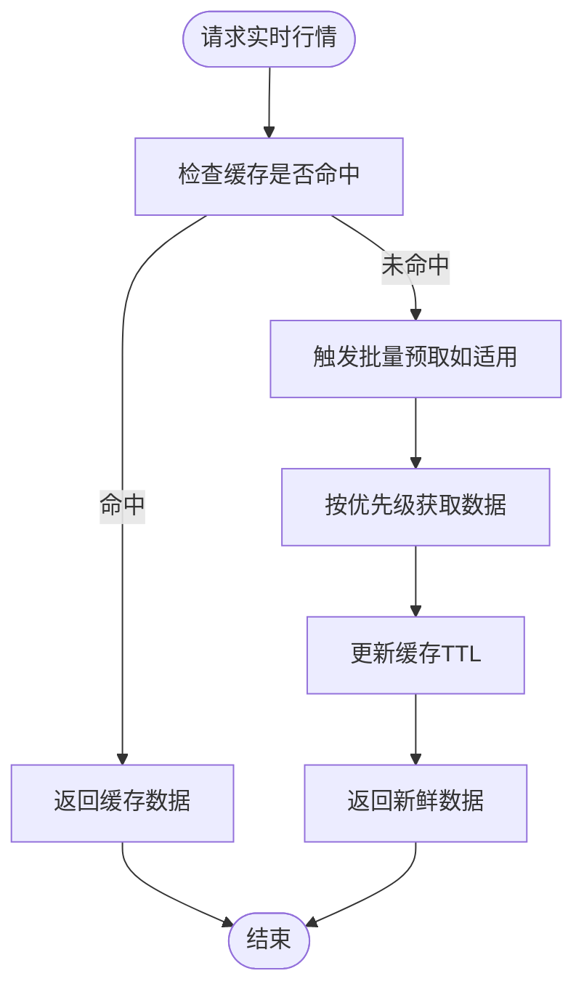
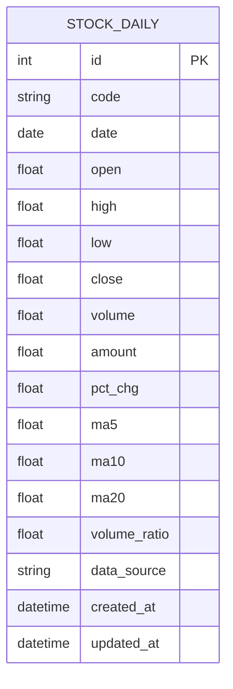
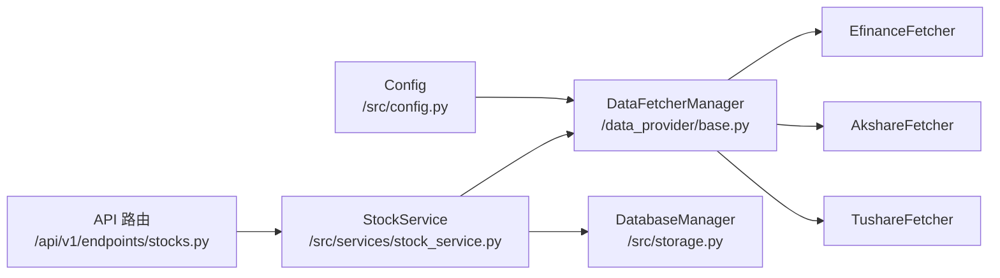

# 实时数据处理

<cite>
**本文档引用的文件**
- [realtime_types.py](file://data_provider/realtime_types.py)
- [base.py](file://data_provider/base.py)
- [efinance_fetcher.py](file://data_provider/efinance_fetcher.py)
- [akshare_fetcher.py](file://data_provider/akshare_fetcher.py)
- [tushare_fetcher.py](file://data_provider/tushare_fetcher.py)
- [stock_service.py](file://src/services/stock_service.py)
- [stocks.py](file://api/v1/endpoints/stocks.py)
- [storage.py](file://src/storage.py)
- [config.py](file://src/config.py)
- [app.py](file://api/app.py)
</cite>

## 目录
1. [引言](#引言)
2. [项目结构](#项目结构)
3. [核心组件](#核心组件)
4. [架构概览](#架构概览)
5. [详细组件分析](#详细组件分析)
6. [依赖分析](#依赖分析)
7. [性能考虑](#性能考虑)
8. [故障排查指南](#故障排查指南)
9. [结论](#结论)

## 引言
本文件面向实时数据处理系统，围绕实时行情数据的获取、传输协议、处理流程、数据结构与字段映射、缓存策略、更新频率控制、内存管理、质量保证与异常处理、数据一致性维护、订阅/推送/消费模式以及与历史数据的集成与同步机制进行全面技术说明。文档旨在帮助开发者快速理解并高效扩展实时数据能力。

## 项目结构
系统采用分层架构：
- API 层：提供 REST 接口，负责请求接入与响应封装
- 服务层：封装业务逻辑，协调数据获取与转换
- 数据提供层：统一抽象与调度多个数据源，实现故障切换与熔断
- 存储层：持久化历史数据，支撑实时与历史数据的统一视图

**图表来源**
- [stocks.py](file://api/v1/endpoints/stocks.py)
- [stock_service.py](file://src/services/stock_service.py)
- [base.py](file://data_provider/base.py)
- [efinance_fetcher.py](file://data_provider/efinance_fetcher.py)
- [akshare_fetcher.py](file://data_provider/akshare_fetcher.py)
- [tushare_fetcher.py](file://data_provider/tushare_fetcher.py)
- [realtime_types.py](file://data_provider/realtime_types.py)
- [storage.py](file://src/storage.py)
- [config.py](file://src/config.py)

**章节来源**
- [app.py](file://api/app.py)
- [stocks.py](file://api/v1/endpoints/stocks.py)
- [stock_service.py](file://src/services/stock_service.py)
- [base.py](file://data_provider/base.py)
- [realtime_types.py](file://data_provider/realtime_types.py)
- [storage.py](file://src/storage.py)
- [config.py](file://src/config.py)

## 核心组件
- 实时数据类型与熔断机制：统一行情数据结构、类型转换工具、熔断器状态机
- 数据源策略管理器：策略模式封装、自动故障切换、批量预取与缓存
- 多数据源实现：东方财富、Akshare、Tushare 等，差异化特性与缓存策略
- 服务与 API 层：统一对外接口、参数校验、响应封装与错误处理
- 存储与集成：SQLite 持久化、历史数据与实时数据的统一视图

**章节来源**
- [realtime_types.py](file://data_provider/realtime_types.py)
- [base.py](file://data_provider/base.py)
- [efinance_fetcher.py](file://data_provider/efinance_fetcher.py)
- [akshare_fetcher.py](file://data_provider/akshare_fetcher.py)
- [tushare_fetcher.py](file://data_provider/tushare_fetcher.py)
- [stock_service.py](file://src/services/stock_service.py)
- [stocks.py](file://api/v1/endpoints/stocks.py)
- [storage.py](file://src/storage.py)

## 架构概览
系统通过 DataFetcherManager 统一调度多个数据源，结合熔断器与缓存策略，在保证稳定性的同时最大化数据质量与可用性。实时数据通过统一的 UnifiedRealtimeQuote 结构对外输出，服务层进行字段映射与异常兜底，API 层负责接入与响应。

**图表来源**
- [stocks.py](file://api/v1/endpoints/stocks.py)
- [stock_service.py](file://src/services/stock_service.py)
- [base.py](file://data_provider/base.py)
- [efinance_fetcher.py](file://data_provider/efinance_fetcher.py)
- [akshare_fetcher.py](file://data_provider/akshare_fetcher.py)
- [tushare_fetcher.py](file://data_provider/tushare_fetcher.py)

## 详细组件分析

### 实时数据类型与字段映射
- 统一行情结构：UnifiedRealtimeQuote 定义核心字段（价格、涨跌幅、成交量、换手率、量比、市盈/市净等），并提供 to_dict 与基本数据校验
- 类型转换工具：safe_float/safe_int 统一处理空值、NaN、字符串与数值类型的转换
- 字段映射规则：服务层将 UnifiedRealtimeQuote 字段映射为 API 响应字段（如 code/name/price/change_amount/change_pct/open/high/low/pre_close/volume/amount/update_time）

**图表来源**
- [realtime_types.py](file://data_provider/realtime_types.py)

**章节来源**
- [realtime_types.py](file://data_provider/realtime_types.py)
- [stock_service.py](file://src/services/stock_service.py)

### 数据源策略管理器与自动故障切换
- 策略模式：BaseFetcher 抽象 + 多实现（Efinance/Akshare/Tushare），统一接口与标准化流程
- 自动切换：DataFetcherManager 按优先级尝试，失败即切换下一个，直至成功或全部失败
- 批量预取：针对全量数据源（如 efinance/akshare_em/tushare），在分析前批量预取以提升效率
- 港股/美股特殊处理：分别路由至专用入口或 YfinanceFetcher

**图表来源**
- [base.py](file://data_provider/base.py)

**章节来源**
- [base.py](file://data_provider/base.py)

### 实时数据缓存策略与更新频率控制
- 缓存粒度：按数据源与类型区分缓存（股票/ETF/全量实时行情）
- TTL 策略：不同数据源设置不同 TTL（如 efinance 10 分钟、akshare 20 分钟），平衡实时性与防封禁
- 预取机制：在分析前批量触发全量拉取，填充缓存，避免后续逐个查询
- 熔断器：失败达到阈值进入熔断状态，冷却后半开试探，成功则恢复，失败则继续熔断

**图表来源**
- [efinance_fetcher.py](file://data_provider/efinance_fetcher.py)
- [akshare_fetcher.py](file://data_provider/akshare_fetcher.py)
- [base.py](file://data_provider/base.py)

**章节来源**
- [efinance_fetcher.py](file://data_provider/efinance_fetcher.py)
- [akshare_fetcher.py](file://data_provider/akshare_fetcher.py)
- [base.py](file://data_provider/base.py)

### 数据质量保证与异常处理
- 类型转换与空值处理：统一 safe_* 工具，避免脏数据进入下游
- 错误分类与日志：HTTP/超时/限流/反爬等分类，便于定位与报警
- 降级策略：任一数据源失败自动切换；全部失败返回 None 或占位数据
- 熔断器：连续失败触发熔断，冷却后半开试探，保障系统稳定性

**章节来源**
- [realtime_types.py](file://data_provider/realtime_types.py)
- [efinance_fetcher.py](file://data_provider/efinance_fetcher.py)
- [akshare_fetcher.py](file://data_provider/akshare_fetcher.py)
- [tushare_fetcher.py](file://data_provider/tushare_fetcher.py)
- [base.py](file://data_provider/base.py)

### 实时数据与历史数据的集成与同步
- 存储层：StockDaily 模型统一存储 OHLC、成交量、涨跌幅、技术指标与数据来源
- 历史数据获取：DataFetcherManager.get_daily_data 返回 DataFrame，经标准化后入库
- 实时/历史统一视图：服务层将实时行情与历史数据整合，API 层按需返回

**图表来源**
- [storage.py](file://src/storage.py)

**章节来源**
- [storage.py](file://src/storage.py)
- [base.py](file://data_provider/base.py)
- [stock_service.py](file://src/services/stock_service.py)

### 订阅、推送与消费模式
- 订阅：系统通过 DataFetcherManager 的批量预取与缓存机制，为后续分析与展示提供数据基础
- 推送：服务层与 API 层负责将数据推送到前端或下游消费者
- 消费：前端通过 API 获取实时/历史数据，进行可视化与交互

**章节来源**
- [stocks.py](file://api/v1/endpoints/stocks.py)
- [stock_service.py](file://src/services/stock_service.py)
- [app.py](file://api/app.py)

## 依赖分析
- 配置驱动：Config 提供实时开关、数据源优先级、缓存 TTL、熔断冷却等关键参数
- 数据源依赖：EfinanceFetcher/AkshareFetcher/TushareFetcher 各自实现差异化特性与缓存策略
- 服务与 API：StockService 与 API 路由负责对外暴露统一接口与错误处理

**图表来源**
- [config.py](file://src/config.py)
- [base.py](file://data_provider/base.py)
- [efinance_fetcher.py](file://data_provider/efinance_fetcher.py)
- [akshare_fetcher.py](file://data_provider/akshare_fetcher.py)
- [tushare_fetcher.py](file://data_provider/tushare_fetcher.py)
- [stock_service.py](file://src/services/stock_service.py)
- [stocks.py](file://api/v1/endpoints/stocks.py)
- [storage.py](file://src/storage.py)

**章节来源**
- [config.py](file://src/config.py)
- [base.py](file://data_provider/base.py)
- [stock_service.py](file://src/services/stock_service.py)
- [stocks.py](file://api/v1/endpoints/stocks.py)
- [storage.py](file://src/storage.py)

## 性能考虑
- 并发与防封禁：通过随机休眠、User-Agent 轮换、指数退避重试与限流控制降低被封风险
- 缓存与预取：合理设置 TTL 与批量预取，显著降低 API 调用频次
- 熔断器：在失败高峰自动降级，保护系统与上游依赖
- 数据标准化：统一列名与类型转换，减少下游处理成本

## 故障排查指南
- 实时开关与优先级：确认 ENABLE_REALTIME_QUOTE 与 REALTIME_SOURCE_PRIORITY 配置
- 熔断状态：查看熔断器状态与冷却时间，必要时重置
- 错误分类：根据日志中的分类信息（超时/限流/反爬）定位问题
- 缓存命中：检查缓存 TTL 与命中率，必要时缩短 TTL 提升实时性
- 数据源可用性：确认 Token 与网络代理配置，确保数据源可达

**章节来源**
- [config.py](file://src/config.py)
- [base.py](file://data_provider/base.py)
- [realtime_types.py](file://data_provider/realtime_types.py)

## 结论
本系统通过统一的实时数据类型、策略化的数据源管理、完善的缓存与熔断机制，以及与历史数据的无缝集成，提供了稳定、高效、可扩展的实时数据处理能力。开发者可基于现有架构灵活扩展新的数据源与处理逻辑，同时遵循配置驱动与质量保证的最佳实践，确保系统在复杂环境下持续可靠运行。