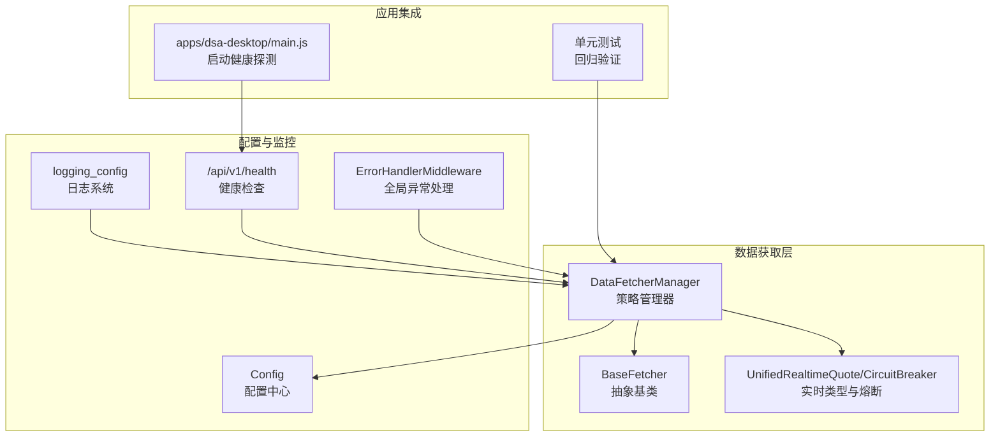
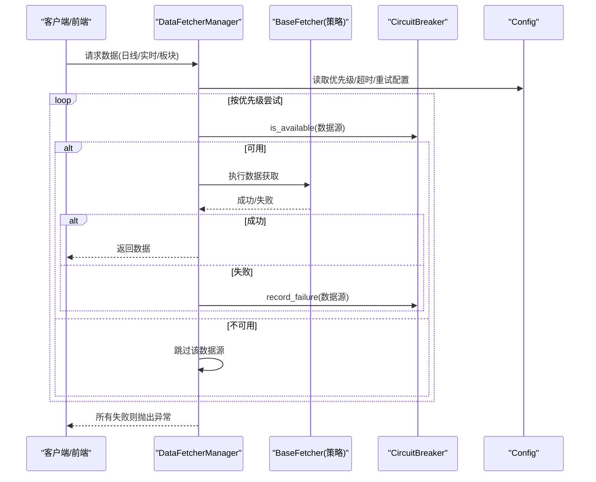
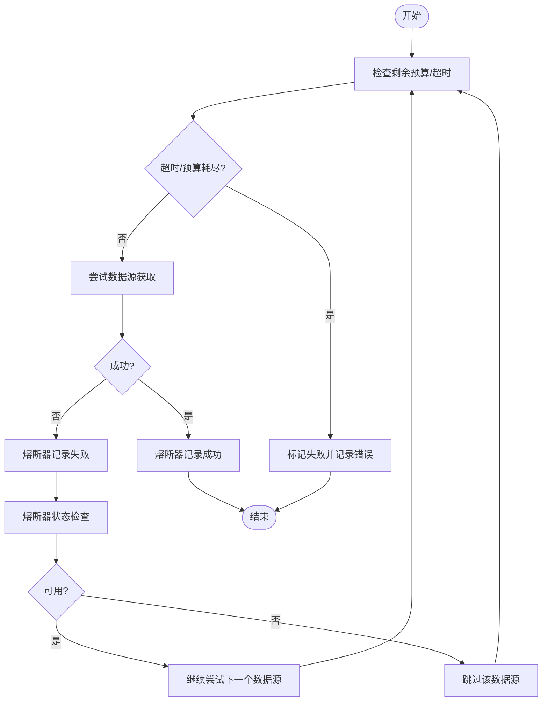
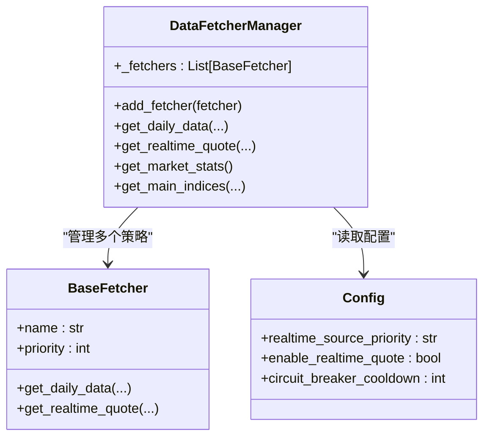
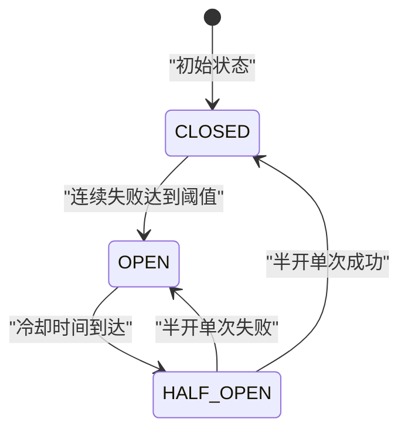
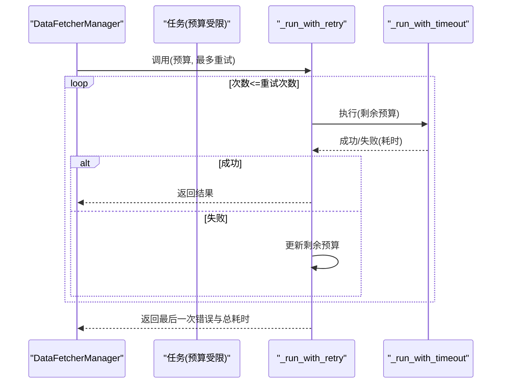
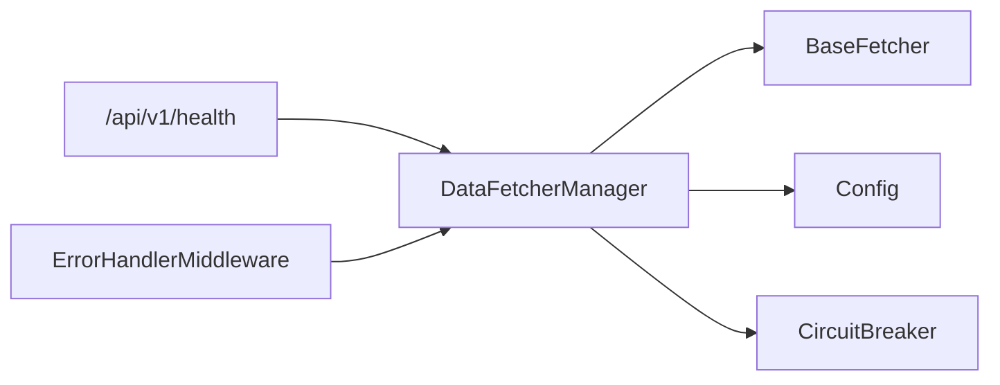

# 故障切换机制

<cite>
**本文档引用的文件**
- [data_provider/base.py](file://data_provider/base.py)
- [data_provider/realtime_types.py](file://data_provider/realtime_types.py)
- [src/config.py](file://src/config.py)
- [apps/dsa-desktop/main.js](file://apps/dsa-desktop/main.js)
- [api/v1/endpoints/health.py](file://api/v1/endpoints/health.py)
- [api/middlewares/error_handler.py](file://api/middlewares/error_handler.py)
- [src/logging_config.py](file://src/logging_config.py)
- [tests/test_multi_agent.py](file://tests/test_multi_agent.py)
- [tests/test_tickflow_market_review_fallback.py](file://tests/test_tickflow_market_review_fallback.py)
</cite>

## 目录
1. [简介](#简介)
2. [项目结构](#项目结构)
3. [核心组件](#核心组件)
4. [架构总览](#架构总览)
5. [详细组件分析](#详细组件分析)
6. [依赖关系分析](#依赖关系分析)
7. [性能考量](#性能考量)
8. [故障排查指南](#故障排查指南)
9. [结论](#结论)
10. [附录](#附录)

## 简介
本文件针对数据获取系统的故障切换机制进行深入技术解析，涵盖自动故障检测（超时检测、错误率统计、健康状态监控）、动态优先级调整算法、故障切换触发条件与策略、恢复机制、重试策略与退避算法、熔断机制、日志记录与监控指标、调试方法以及配置参数对行为的影响与调优建议。文档面向开发者与运维人员，既提供代码级细节，也给出可视化图示与实操建议。

## 项目结构
数据获取系统围绕“策略模式 + 管理器 + 多数据源 + 熔断 + 超时/重试”的架构组织，关键模块如下：
- 数据源基类与管理器：定义统一接口、封装自动切换与重试/超时逻辑
- 实时行情与熔断：统一实时行情类型、熔断器状态机
- 配置中心：集中管理超时、重试、熔断冷却、优先级等参数
- 健康检查与错误处理：对外暴露健康检查接口，统一异常处理
- 日志系统：统一日志格式与输出，便于故障定位

图表来源
- [data_provider/base.py](file://data_provider/base.py)
- [data_provider/realtime_types.py](file://data_provider/realtime_types.py)
- [src/config.py](file://src/config.py)
- [api/v1/endpoints/health.py](file://api/v1/endpoints/health.py)
- [api/middlewares/error_handler.py](file://api/middlewares/error_handler.py)
- [src/logging_config.py](file://src/logging_config.py)
- [apps/dsa-desktop/main.js](file://apps/dsa-desktop/main.js)
- [tests/test_tickflow_market_review_fallback.py](file://tests/test_tickflow_market_review_fallback.py)

章节来源
- [data_provider/base.py](file://data_provider/base.py)
- [data_provider/realtime_types.py](file://data_provider/realtime_types.py)
- [src/config.py](file://src/config.py)
- [api/v1/endpoints/health.py](file://api/v1/endpoints/health.py)
- [api/middlewares/error_handler.py](file://api/middlewares/error_handler.py)
- [src/logging_config.py](file://src/logging_config.py)
- [apps/dsa-desktop/main.js](file://apps/dsa-desktop/main.js)
- [tests/test_tickflow_market_review_fallback.py](file://tests/test_tickflow_market_review_fallback.py)

## 核心组件
- DataFetcherManager：策略管理器，负责按优先级自动切换数据源、统一异常处理、批量预取、实时行情与熔断协同
- BaseFetcher：抽象基类，定义统一接口与通用数据处理流程
- CircuitBreaker：熔断器，基于状态机管理数据源可用性，支持冷却与半开试探
- Config：配置中心，集中管理超时、重试、熔断冷却、优先级等参数
- 健康检查与错误处理：对外提供健康检查接口，统一异常捕获与日志记录

章节来源
- [data_provider/base.py](file://data_provider/base.py)
- [data_provider/realtime_types.py](file://data_provider/realtime_types.py)
- [src/config.py](file://src/config.py)
- [api/v1/endpoints/health.py](file://api/v1/endpoints/health.py)
- [api/middlewares/error_handler.py](file://api/middlewares/error_handler.py)

## 架构总览
系统采用“策略模式 + 管理器 + 熔断 + 超时/重试”的组合架构：
- 策略模式：多种数据源作为策略，按优先级排列，失败自动切换
- 熔断机制：对失败频繁的数据源实施冷却，避免雪崩
- 超时与重试：对单次任务执行超时与预算受限的任务进行重试与预算分配
- 健康检查：对外暴露健康检查接口，配合前端/负载均衡器进行存活探测

图表来源
- [data_provider/base.py](file://data_provider/base.py)
- [data_provider/realtime_types.py](file://data_provider/realtime_types.py)
- [src/config.py](file://src/config.py)

## 详细组件分析

### 自动故障检测与健康状态监控
- 超时检测：对单次任务执行设定超时，超过时限即判定失败；对预算受限的任务采用“预算 + 最多重试”的组合策略
- 错误率统计：通过熔断器记录连续失败次数与最后失败时间，结合冷却时间实现“冷却-半开-试探-恢复”的状态机
- 健康状态监控：对外提供健康检查接口，前端/负载均衡器可轮询探测；同时在启动阶段进行健康探测与进度日志

图表来源
- [data_provider/base.py](file://data_provider/base.py)
- [data_provider/realtime_types.py](file://data_provider/realtime_types.py)
- [apps/dsa-desktop/main.js](file://apps/dsa-desktop/main.js)

章节来源
- [data_provider/base.py](file://data_provider/base.py)
- [data_provider/realtime_types.py](file://data_provider/realtime_types.py)
- [apps/dsa-desktop/main.js](file://apps/dsa-desktop/main.js)

### 动态优先级调整算法
- 默认优先级：系统初始化时根据配置与令牌注入动态调整优先级（如检测到 TUSHARE_TOKEN 时将 Tushare 优先级提升）
- 运行期调整：管理器按 fetcher.priority 排序，优先尝试高优先级数据源；若失败则自动切换到下一个
- 实时行情优先级：通过配置项控制实时行情数据源优先级顺序，支持“efinance/akshare_em/tencent/akshare_sina/tushare”等

图表来源
- [data_provider/base.py](file://data_provider/base.py)
- [src/config.py](file://src/config.py)

章节来源
- [data_provider/base.py](file://data_provider/base.py)
- [src/config.py](file://src/config.py)

### 故障切换触发条件、策略与恢复机制
- 触发条件：单次请求失败、超时、熔断器处于 OPEN/HALF_OPEN 且超出冷却时间
- 切换策略：按优先级顺序尝试，失败即切换；实时行情支持字段补充（主源缺失字段时从后续源补充）
- 恢复机制：熔断器冷却完成后进入 HALF_OPEN，单次成功则完全恢复 CLOSED；失败则继续熔断

图表来源
- [data_provider/realtime_types.py](file://data_provider/realtime_types.py)

章节来源
- [data_provider/realtime_types.py](file://data_provider/realtime_types.py)
- [data_provider/base.py](file://data_provider/base.py)

### 重试策略、退避算法与熔断机制
- 重试策略：对预算受限的任务采用“预算 + 最多重试”的组合，每次尝试消耗剩余预算，失败后继续尝试直到预算耗尽
- 退避算法：未实现指数退避；当前策略为“预算分配 + 失败即切”和“熔断冷却”
- 熔断机制：基于 CircuitBreaker 的三态状态机，支持失败阈值、冷却时间与半开试探

图表来源
- [data_provider/base.py](file://data_provider/base.py)

章节来源
- [data_provider/base.py](file://data_provider/base.py)
- [data_provider/realtime_types.py](file://data_provider/realtime_types.py)

### 日志记录、监控指标与调试方法
- 日志系统：统一格式、控制台 + 常规/调试文件三层输出，降低第三方库噪音
- 监控指标：可通过日志观察“数据源尝试/失败/完成”、“熔断器状态变化”、“实时行情字段补充”等
- 调试方法：开启调试模式查看详细日志；前端健康检查接口可用于探测后端存活状态

章节来源
- [src/logging_config.py](file://src/logging_config.py)
- [api/v1/endpoints/health.py](file://api/v1/endpoints/health.py)
- [apps/dsa-desktop/main.js](file://apps/dsa-desktop/main.js)

### 配置参数对故障切换行为的影响与调优建议
- 实时行情优先级：通过配置项控制实时行情数据源顺序，影响切换路径与成功率
- 熔断冷却时间：冷却时间越长，恢复越慢但更稳健；可根据数据源稳定性调整
- 超时与重试：合理设置预算与重试次数，避免过度重试导致资源浪费
- 功能开关：实时行情与筹码分布等功能开关可快速降级，减少失败面

章节来源
- [src/config.py](file://src/config.py)
- [data_provider/base.py](file://data_provider/base.py)
- [data_provider/realtime_types.py](file://data_provider/realtime_types.py)

## 依赖关系分析
- DataFetcherManager 依赖 BaseFetcher 策略集合、Config 配置、CircuitBreaker 熔断器
- 实时行情与熔断器耦合紧密，熔断器状态直接影响实时行情切换
- 健康检查与错误处理中间件为系统提供可观测性与稳定性保障

图表来源
- [data_provider/base.py](file://data_provider/base.py)
- [data_provider/realtime_types.py](file://data_provider/realtime_types.py)
- [src/config.py](file://src/config.py)
- [api/v1/endpoints/health.py](file://api/v1/endpoints/health.py)
- [api/middlewares/error_handler.py](file://api/middlewares/error_handler.py)

章节来源
- [data_provider/base.py](file://data_provider/base.py)
- [data_provider/realtime_types.py](file://data_provider/realtime_types.py)
- [src/config.py](file://src/config.py)
- [api/v1/endpoints/health.py](file://api/v1/endpoints/health.py)
- [api/middlewares/error_handler.py](file://api/middlewares/error_handler.py)

## 性能考量
- 并发与资源限制：通过预算与信号量限制超时任务的并发，避免资源耗尽
- 预取策略：对全量数据源启用预取可显著降低实时查询开销
- 降级与快速失败：熔断与功能开关可快速降级，避免长时间阻塞

## 故障排查指南
- 健康检查：通过健康检查接口确认服务存活；前端启动阶段进行健康探测并输出进度日志
- 异常处理：全局异常中间件捕获未处理异常并统一返回，便于定位问题
- 单元测试：包含故障切换与超时场景的回归测试，可参考其断言与期望行为
- 日志分析：关注“数据源尝试/失败/完成”、“熔断器状态变化”、“实时行情字段补充”等关键日志

章节来源
- [api/v1/endpoints/health.py](file://api/v1/endpoints/health.py)
- [api/middlewares/error_handler.py](file://api/middlewares/error_handler.py)
- [tests/test_multi_agent.py](file://tests/test_multi_agent.py)
- [tests/test_tickflow_market_review_fallback.py](file://tests/test_tickflow_market_review_fallback.py)
- [apps/dsa-desktop/main.js](file://apps/dsa-desktop/main.js)

## 结论
本系统通过策略模式与管理器实现多数据源自动切换，结合熔断器与超时/重试机制，形成稳健的故障切换体系。配置中心集中管理关键参数，健康检查与日志系统提供可观测性。建议在生产环境中根据数据源稳定性调整熔断冷却与优先级，合理设置预算与重试次数，并启用预取与降级策略以提升整体性能与可靠性。

## 附录
- 相关测试用例可参考：
  - [tests/test_tickflow_market_review_fallback.py](file://tests/test_tickflow_market_review_fallback.py)
  - [tests/test_multi_agent.py](file://tests/test_multi_agent.py)