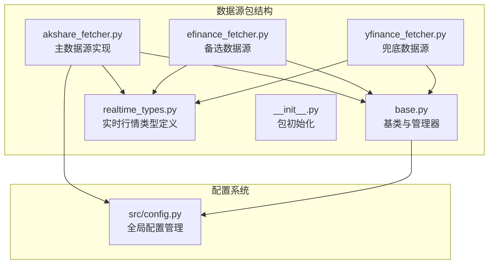
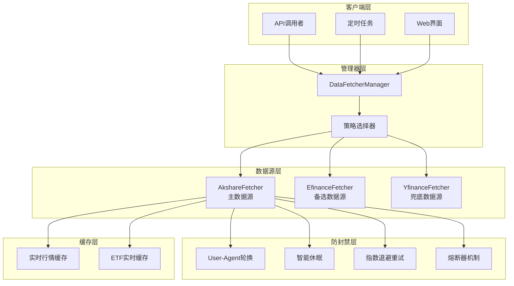
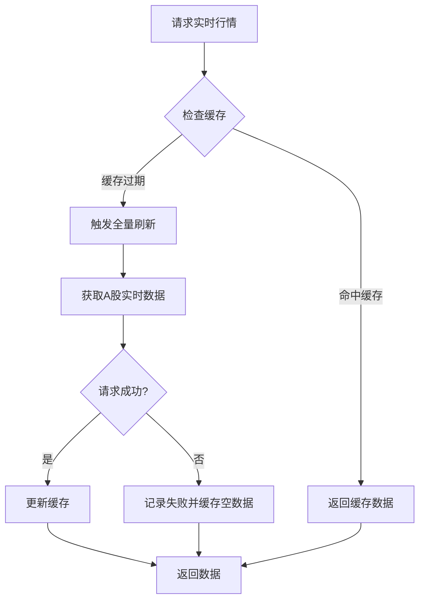
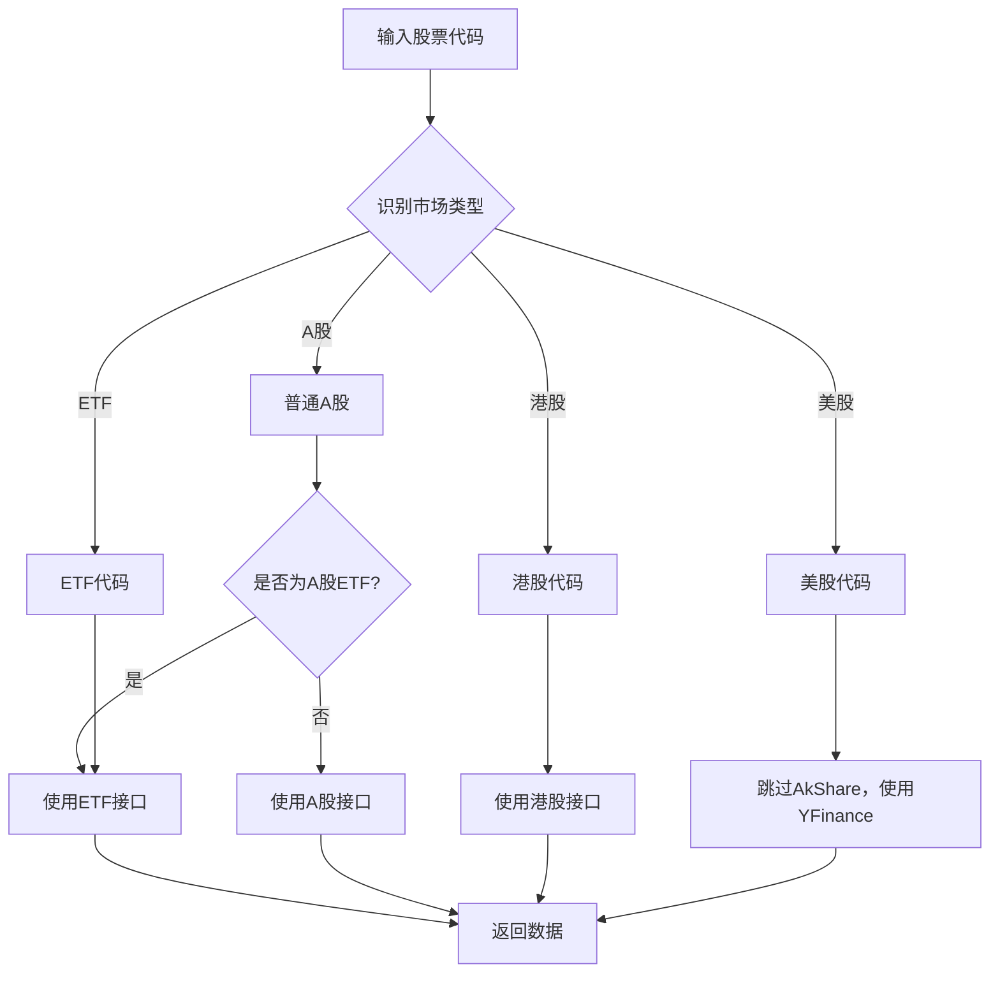
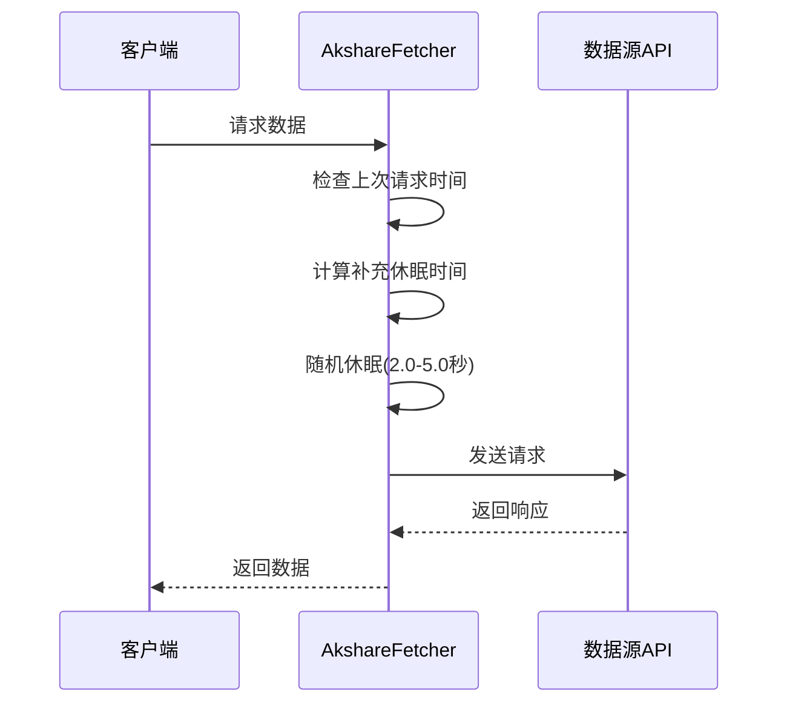
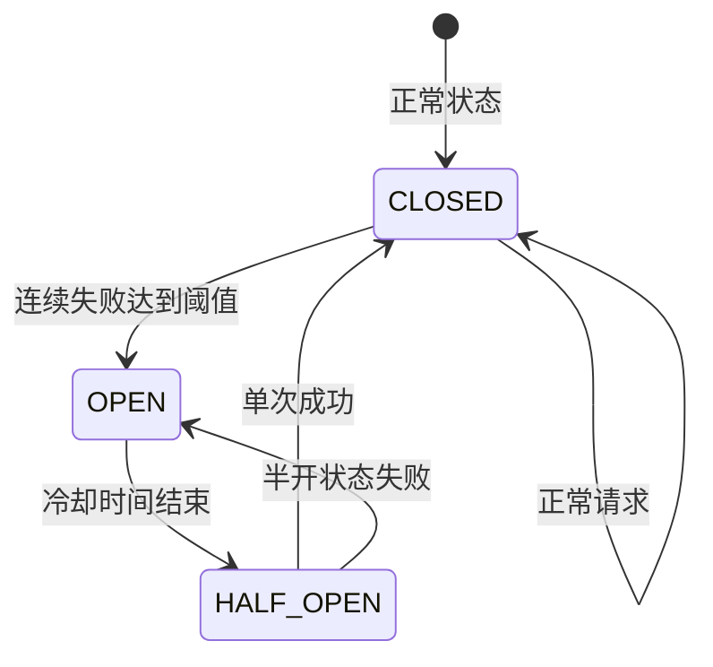
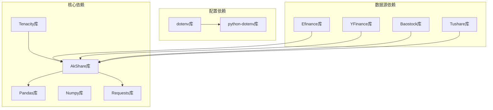

# AkShare数据源实现

<cite>
**本文档引用的文件**
- [akshare_fetcher.py](file://data_provider/akshare_fetcher.py)
- [base.py](file://data_provider/base.py)
- [realtime_types.py](file://data_provider/realtime_types.py)
- [config.py](file://src/config.py)
- [efinance_fetcher.py](file://data_provider/efinance_fetcher.py)
- [yfinance_fetcher.py](file://data_provider/yfinance_fetcher.py)
- [__init__.py](file://data_provider/__init__.py)
</cite>

## 目录
1. [简介](#简介)
2. [项目结构](#项目结构)
3. [核心组件](#核心组件)
4. [架构概览](#架构概览)
5. [详细组件分析](#详细组件分析)
6. [依赖关系分析](#依赖关系分析)
7. [性能考虑](#性能考虑)
8. [故障排除指南](#故障排除指南)
9. [结论](#结论)

## 简介

AkShare数据源实现是本股票分析系统的核心数据获取组件，基于免费的AkShare库实现。该实现提供了完整的多数据源备选方案、智能代码识别、防封禁机制和实时行情获取策略。

### 主要优势

- **免费开源**：无需Token，降低使用成本
- **数据全面**：涵盖A股、港股、美股、ETF等多种市场
- **智能识别**：自动识别不同类型的股票代码
- **防封禁策略**：多层次的反爬虫机制
- **故障切换**：多数据源自动故障转移

## 项目结构

数据源实现位于`data_provider`包中，采用策略模式设计，支持多种数据源的统一管理：



**图表来源**
- [akshare_fetcher.py:1-50](file://data_provider/akshare_fetcher.py#L1-L50)
- [base.py:1-50](file://data_provider/base.py#L1-L50)
- [realtime_types.py:1-50](file://data_provider/realtime_types.py#L1-L50)

**章节来源**
- [__init__.py:1-56](file://data_provider/__init__.py#L1-L56)

## 核心组件

### AkshareFetcher类

AkshareFetcher是主数据源实现，具有以下核心特性：

#### 数据源优先级
- **优先级1**：最高优先级，作为主数据源
- **数据来源**：东方财富网爬虫
- **支持市场**：A股、港股、美股、ETF

#### 防封禁策略
1. **随机User-Agent轮换**：5种不同浏览器UA
2. **智能休眠机制**：2.0-5.0秒随机延迟
3. **指数退避重试**：最多3次重试
4. **熔断器机制**：连续失败后自动冷却

#### 多数据源备选方案
- **东方财富**：数据最全，但易被限流
- **新浪财经**：轻量级，基本行情
- **腾讯财经**：单股票查询，负载小

**章节来源**
- [akshare_fetcher.py:254-284](file://data_provider/akshare_fetcher.py#L254-L284)
- [akshare_fetcher.py:322-358](file://data_provider/akshare_fetcher.py#L322-L358)

### BaseFetcher基类

BaseFetcher定义了统一的数据获取接口和通用功能：

#### 标准化接口
- `_fetch_raw_data()`: 获取原始数据
- `_normalize_data()`: 标准化数据格式
- `get_daily_data()`: 统一日线数据获取入口

#### 通用功能
- **数据清洗**：日期格式、数值类型转换
- **技术指标计算**：MA5、MA10、MA20、量比
- **异常处理**：统一的错误处理和日志记录

**章节来源**
- [base.py:233-450](file://data_provider/base.py#L233-L450)

### DataFetcherManager管理器

DataFetcherManager实现了策略模式的管理器：

#### 自动故障切换
- **优先级排序**：按优先级自动选择数据源
- **失败转移**：自动切换到下一个可用数据源
- **动态调整**：根据配置动态调整优先级

#### 支持的数据源
1. **EfinanceFetcher** (优先级0)
2. **AkshareFetcher** (优先级1) 
3. **TushareFetcher** (优先级2)
4. **PytdxFetcher** (优先级2)
5. **BaostockFetcher** (优先级3)
6. **YfinanceFetcher** (优先级4)

**章节来源**
- [base.py:464-779](file://data_provider/base.py#L464-L779)

## 架构概览



**图表来源**
- [base.py:464-779](file://data_provider/base.py#L464-L779)
- [akshare_fetcher.py:254-284](file://data_provider/akshare_fetcher.py#L254-L284)

## 详细组件分析

### 实时行情获取策略

#### 缓存机制
AkShareFetcher实现了两级缓存机制：



**图表来源**
- [akshare_fetcher.py:838-878](file://data_provider/akshare_fetcher.py#L838-L878)

#### 多数据源选择
实时行情支持三种数据源，按优先级自动选择：

| 数据源 | 优点 | 缺点 | 适用场景 |
|--------|------|------|----------|
| 东方财富 | 数据最全，含量比、换手率等 | 全量拉取，易超时 | 需要完整技术指标 |
| 新浪财经 | 单股票查询，负载小 | 数据字段较少 | 快速获取基本行情 |
| 腾讯财经 | 包含换手率等指标 | 无量比、PE/PB等 | 需要特定技术指标 |

**章节来源**
- [akshare_fetcher.py:825-824](file://data_provider/akshare_fetcher.py#L825-L824)

### 智能代码识别

AkShareFetcher实现了完善的股票代码识别机制：



**图表来源**
- [akshare_fetcher.py:345-357](file://data_provider/akshare_fetcher.py#L345-L357)

**章节来源**
- [akshare_fetcher.py:94-153](file://data_provider/akshare_fetcher.py#L94-L153)

### 防封禁机制详解

#### User-Agent轮换
实现5种不同浏览器的User-Agent轮换，模拟真实用户行为：

```python
USER_AGENTS = [
    'Mozilla/5.0 (Windows NT 10.0; Win64; x64) AppleWebKit/537.36',
    'Mozilla/5.0 (Macintosh; Intel Mac OS X 10_15_7) AppleWebKit/537.36',
    'Mozilla/5.0 (X11; Linux x86_64) AppleWebKit/537.36',
]
```

#### 智能休眠机制
采用2.0-5.0秒的随机休眠，避免被识别为自动化脚本：



**图表来源**
- [akshare_fetcher.py:301-321](file://data_provider/akshare_fetcher.py#L301-L321)

#### 指数退避重试
使用tenacity库实现指数退避重试，最多3次重试：

- 第1次：2秒延迟
- 第2次：4秒延迟  
- 第3次：8秒延迟（最大30秒）

**章节来源**
- [akshare_fetcher.py:322-327](file://data_provider/akshare_fetcher.py#L322-L327)
- [akshare_fetcher.py:301-321](file://data_provider/akshare_fetcher.py#L301-L321)

### 熔断器机制

熔断器实现智能的故障检测和恢复：



**状态说明**：
- **CLOSED**：正常状态，所有请求正常执行
- **OPEN**：熔断状态，跳过该数据源
- **HALF_OPEN**：半开状态，试探性请求

**章节来源**
- [realtime_types.py:268-393](file://data_provider/realtime_types.py#L268-L393)

## 依赖关系分析

### 外部依赖



**图表来源**
- [akshare_fetcher.py:34-46](file://data_provider/akshare_fetcher.py#L34-L46)
- [config.py:16](file://src/config.py#L16)

### 内部依赖关系

```mermaid
graph TB
subgraph "数据源实现"
A[AkshareFetcher]
B[EfinanceFetcher]
C[YfinanceFetcher]
end
subgraph "基础组件"
D[BaseFetcher]
E[DataFetcherManager]
F[UnifiedRealtimeQuote]
G[CircuitBreaker]
end
subgraph "配置系统"
H[Config]
I[get_config()]
end
A --> D
B --> D
C --> D
E --> D
A --> F
B --> F
C --> F
A --> G
B --> G
C --> G
A --> H
B --> H
C --> H
E --> H
I --> H
```

**图表来源**
- [base.py:233-450](file://data_provider/base.py#L233-L450)
- [config.py:32-562](file://src/config.py#L32-L562)

**章节来源**
- [base.py:464-779](file://data_provider/base.py#L464-L779)

## 性能考虑

### 缓存策略优化

| 缓存类型 | TTL设置 | 作用范围 | 性能收益 |
|----------|---------|----------|----------|
| 实时行情缓存 | 20分钟 | A股全市场 | 减少全量请求频率 |
| ETF实时缓存 | 20分钟 | ETF市场 | 避免重复获取ETF数据 |
| 基础数据缓存 | 10分钟 | 通用数据 | 提高响应速度 |

### 并发控制

系统通过以下机制控制并发：

1. **最大工作者数量**：默认3个线程
2. **智能休眠**：避免请求过于密集
3. **熔断器冷却**：失败后自动冷却

### 网络优化

1. **代理配置**：支持HTTP/HTTPS代理
2. **NO_PROXY设置**：排除国内数据源，避免代理问题
3. **超时控制**：合理的请求超时设置

**章节来源**
- [config.py:152-156](file://src/config.py#L152-L156)
- [config.py:259-299](file://src/config.py#L259-L299)

## 故障排除指南

### 常见问题及解决方案

#### 1. 数据获取失败

**症状**：AkShareFetcher抛出DataFetchError异常

**可能原因**：
- 网络连接问题
- 数据源临时不可用
- 反爬虫机制触发

**解决方案**：
1. 检查网络连接
2. 查看日志中的错误分类
3. 等待熔断器冷却
4. 切换到备选数据源

#### 2. 请求被限流

**症状**：出现RateLimitError异常

**解决方案**：
1. 增加休眠时间
2. 调整最大工作者数量
3. 使用代理IP池
4. 降低请求频率

#### 3. 数据格式不匹配

**症状**：数据标准化失败

**解决方案**：
1. 检查数据源返回格式
2. 更新标准化映射
3. 验证STANDARD_COLUMNS定义

### 调试技巧

#### 启用详细日志
```bash
export LOG_LEVEL=DEBUG
python main.py --debug
```

#### 监控熔断器状态
```python
from data_provider.realtime_types import get_realtime_circuit_breaker
breaker = get_realtime_circuit_breaker()
print(breaker.get_status())
```

**章节来源**
- [base.py:382-389](file://data_provider/base.py#L382-L389)
- [akshare_fetcher.py:191-235](file://data_provider/akshare_fetcher.py#L191-L235)

## 结论

AkShare数据源实现通过以下关键技术实现了可靠的免费数据获取：

### 核心优势
1. **多层次防封禁**：User-Agent轮换、智能休眠、指数退避重试
2. **智能故障切换**：自动检测失败并切换到备选数据源
3. **高效缓存机制**：减少重复请求，提高响应速度
4. **完整的代码识别**：支持A股、港股、美股、ETF的自动识别

### 技术创新
1. **熔断器机制**：智能的故障检测和恢复
2. **两级缓存策略**：平衡数据新鲜度和性能
3. **统一数据格式**：标准化所有数据源的输出格式
4. **动态优先级调整**：根据配置自动调整数据源优先级

### 应用场景
- **个人投资者**：免费获取高质量的股票数据
- **量化分析师**：稳定的日线数据获取
- **教育机构**：低成本的数据获取解决方案
- **小型团队**：无需昂贵订阅费用的数据源

该实现为股票分析系统提供了稳定、可靠、高效的免费数据获取能力，是整个系统的核心基础设施。