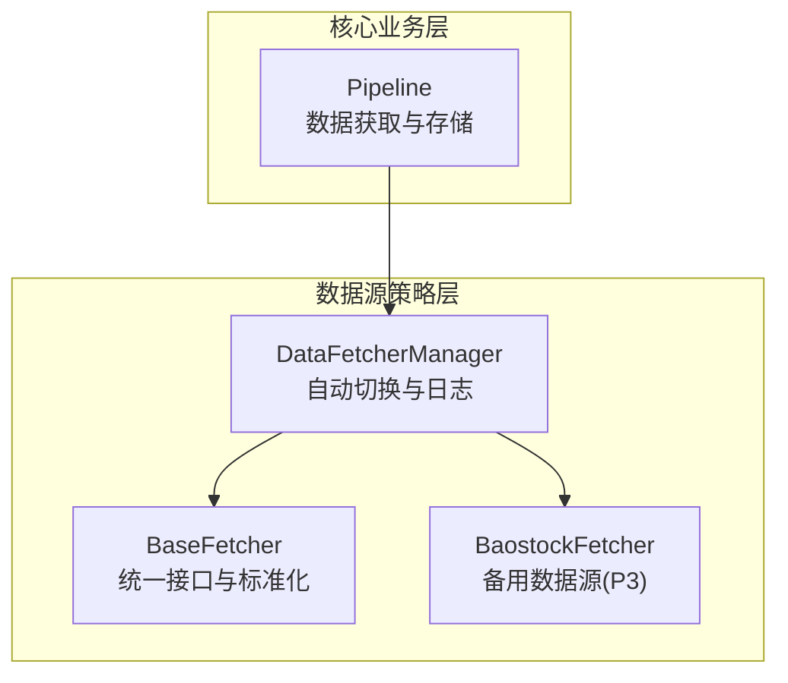
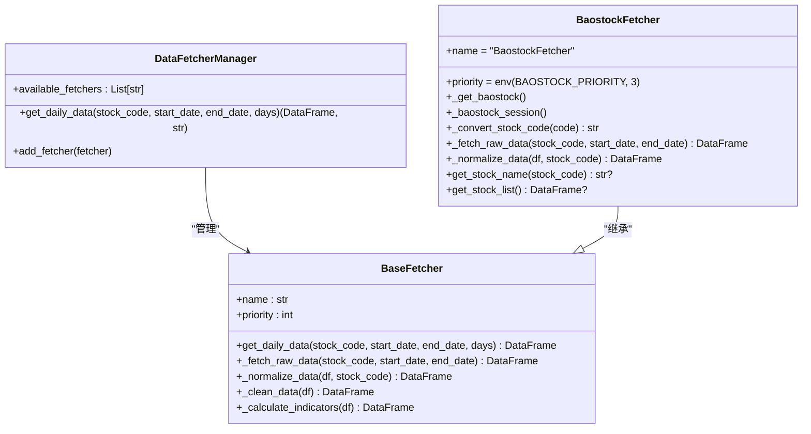
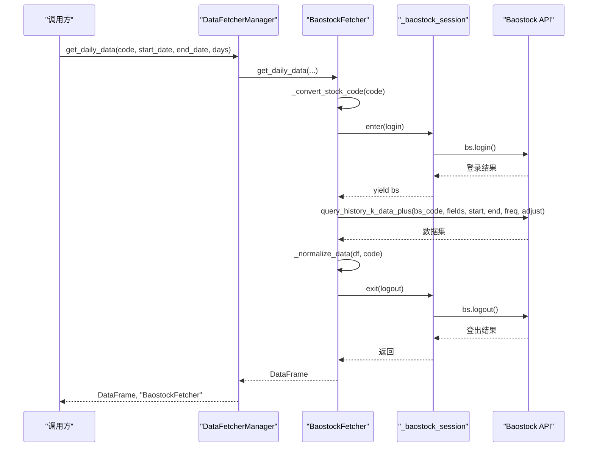
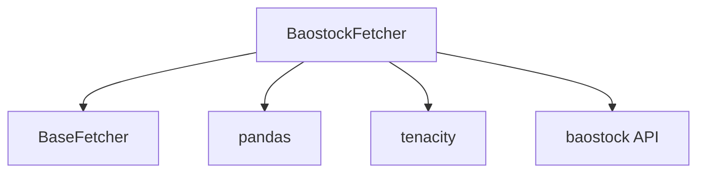

# Baostock数据源实现

<cite>
**本文档引用的文件**
- [baostock_fetcher.py](file://data_provider/baostock_fetcher.py)
- [base.py](file://data_provider/base.py)
- [__init__.py](file://data_provider/__init__.py)
- [realtime_types.py](file://data_provider/realtime_types.py)
- [pipeline.py](file://src/core/pipeline.py)
</cite>

## 目录
1. [简介](#简介)
2. [项目结构](#项目结构)
3. [核心组件](#核心组件)
4. [架构概览](#架构概览)
5. [详细组件分析](#详细组件分析)
6. [依赖分析](#依赖分析)
7. [性能考虑](#性能考虑)
8. [故障排查指南](#故障排查指南)
9. [结论](#结论)
10. [附录](#附录)

## 简介
本文件面向Baostock数据源实现，系统性阐述其作为开源金融数据获取库的实现原理、架构设计与工程实践。BaostockFetcher基于策略模式中的BaseFetcher抽象，提供免费、无需Token的A股日线数据获取能力，并通过上下文管理器确保连接生命周期安全、通过指数退避重试提升稳定性。结合DataFetcherManager的自动故障切换机制，BaostockFetcher在多数据源体系中承担“备用数据源”的角色，优先级为3，适合在主数据源不可用时进行兜底。

## 项目结构
围绕数据源实现的关键目录与文件如下：
- data_provider：数据源策略层，包含多种数据源实现与统一管理器
  - base.py：策略基类与管理器，定义统一接口、数据标准化与故障切换
  - baostock_fetcher.py：BaostockFetcher实现，封装登录/登出、代码转换、数据获取与标准化
  - __init__.py：导出数据源相关类与工具函数
  - realtime_types.py：实时行情统一类型与熔断机制
- src/core：核心业务逻辑，包含数据管道与调度
  - pipeline.py：数据获取与存储的流水线，调用DataFetcherManager获取数据

图表来源
- [base.py:233-462](file://data_provider/base.py#L233-L462)
- [base.py:464-979](file://data_provider/base.py#L464-L979)
- [baostock_fetcher.py:50-380](file://data_provider/baostock_fetcher.py#L50-L380)
- [pipeline.py:153-176](file://src/core/pipeline.py#L153-L176)

章节来源
- [base.py:1-116](file://data_provider/base.py#L1-L116)
- [__init__.py:12-30](file://data_provider/__init__.py#L12-L30)

## 核心组件
- BaostockFetcher：实现A股日线数据获取，负责登录/登出、代码格式转换、原始数据获取与标准化、股票名称与列表查询。
- BaseFetcher：定义统一接口（_fetch_raw_data/_normalize_data）、数据清洗与技术指标计算、统一入口get_daily_data。
- DataFetcherManager：按优先级管理多个数据源，实现自动故障切换与日志记录，支持美股直连YfinanceFetcher。
- 标准化列名：STANDARD_COLUMNS定义统一列名集合，确保不同数据源输出一致性。

章节来源
- [baostock_fetcher.py:50-380](file://data_provider/baostock_fetcher.py#L50-L380)
- [base.py:34-36](file://data_provider/base.py#L34-L36)
- [base.py:233-462](file://data_provider/base.py#L233-L462)
- [base.py:464-979](file://data_provider/base.py#L464-L979)

## 架构概览
BaostockFetcher遵循策略模式，作为BaseFetcher的具体实现参与DataFetcherManager的统一调度。其关键特性包括：
- 连接生命周期管理：使用上下文管理器确保每次请求都显式登录/登出，避免连接泄露。
- 失败重试：对网络异常采用指数退避重试，降低瞬时故障影响。
- 数据标准化：将Baostock返回的列名映射为标准列名，统一数值类型与缺失值处理。
- 市场与代码适配：支持A股（沪/深）ETF与股票代码转换，明确不支持港股、美股与北交所。

图表来源
- [base.py:233-462](file://data_provider/base.py#L233-L462)
- [base.py:464-979](file://data_provider/base.py#L464-L979)
- [baostock_fetcher.py:50-380](file://data_provider/baostock_fetcher.py#L50-L380)

## 详细组件分析

### BaostockFetcher类
- 角色与定位：备用数据源（优先级3），提供免费、无需Token的A股日线数据。
- 连接生命周期：通过上下文管理器自动登录/登出，异常时也确保登出，防止连接泄露。
- 代码转换：将输入代码转换为Baostock要求的格式（sh./sz.），并处理ETF与市场判断。
- 数据获取：使用query_history_k_data_plus获取日线数据，设置前复权参数；对异常进行包装与重试。
- 数据标准化：列名映射（pctChg→pct_chg），数值类型转换，添加code列，保留STANDARD_COLUMNS。
- 名称与列表：支持查询单只股票名称与全量股票列表，内部缓存提高效率。

图表来源
- [baostock_fetcher.py:86-124](file://data_provider/baostock_fetcher.py#L86-L124)
- [baostock_fetcher.py:168-237](file://data_provider/baostock_fetcher.py#L168-L237)
- [base.py:321-389](file://data_provider/base.py#L321-L389)

章节来源
- [baostock_fetcher.py:50-380](file://data_provider/baostock_fetcher.py#L50-L380)

### 数据接口设计与API使用方式
- 统一入口：BaseFetcher.get_daily_data提供日期范围计算、原始数据获取、标准化、清洗与指标计算的完整流程。
- 参数配置：支持start_date/end_date或days参数；BaostockFetcher内部固定频率为日线、复权标志为前复权。
- 返回格式：标准化后的DataFrame包含STANDARD_COLUMNS，包含技术指标（MA5/MA10/MA20、量比）。
- 错误处理：捕获并包装DataFetchError，记录详细错误类型与原因，便于上层切换与诊断。

章节来源
- [base.py:321-389](file://data_provider/base.py#L321-L389)
- [base.py:421-449](file://data_provider/base.py#L421-L449)

### 数据质量控制
- 数据清洗：确保日期列类型、数值列类型转换、关键列去空、按日期排序。
- 标准化列名：统一pctChg→pct_chg，保留STANDARD_COLUMNS，避免下游逻辑差异。
- 异常检测与重试：对ConnectionError/TimeoutError进行指数退避重试，减少瞬时网络波动影响。
- 市场与代码校验：明确不支持港股、美股与北交所，避免无效请求与错误数据。

章节来源
- [base.py:391-419](file://data_provider/base.py#L391-L419)
- [baostock_fetcher.py:168-237](file://data_provider/baostock_fetcher.py#L168-L237)
- [baostock_fetcher.py:125-166](file://data_provider/baostock_fetcher.py#L125-L166)

### 使用示例与最佳实践
- 基础使用：通过DataFetcherManager.get_daily_data获取数据，自动切换到BaostockFetcher作为备用。
- 缓存优化：BaostockFetcher内部缓存股票名称，get_stock_list同时更新缓存，减少重复查询。
- 性能调优：合理设置请求间隔（BaseFetcher.random_sleep提供随机抖动），避免触发风控。
- 日期范围：若未指定start_date，按days估算起始日期，避免一次性拉取过大范围导致超时。

章节来源
- [pipeline.py:153-176](file://src/core/pipeline.py#L153-L176)
- [base.py:452-461](file://data_provider/base.py#L452-L461)
- [baostock_fetcher.py:274-359](file://data_provider/baostock_fetcher.py#L274-L359)

### 与其他开源数据源的比较与选择建议
- 优先级与动态调整：在未配置TUSHARE_TOKEN时，BaostockFetcher优先级为3；配置后由DataFetcherManager按优先级排序。
- 适用场景：免费、无需Token、稳定可靠，适合中小规模回测与日常分析；对美股/港股/北交所不支持。
- 选择建议：主数据源优先考虑有配额保障与更及时数据的源；BaostockFetcher作为备用兜底，提升整体可用性。

章节来源
- [__init__.py:12-30](file://data_provider/__init__.py#L12-L30)
- [base.py:735-778](file://data_provider/base.py#L735-L778)

## 依赖分析
- BaostockFetcher依赖：
  - BaseFetcher：继承统一接口与标准化流程
  - pandas：数据结构与类型转换
  - tenacity：指数退避重试
  - baostock模块：实际数据获取API
  - 标准工具：STANDARD_COLUMNS、is_bse_code、_is_hk_market等

图表来源
- [baostock_fetcher.py:17-33](file://data_provider/baostock_fetcher.py#L17-L33)
- [base.py:34-36](file://data_provider/base.py#L34-L36)

章节来源
- [baostock_fetcher.py:17-33](file://data_provider/baostock_fetcher.py#L17-L33)

## 性能考虑
- 连接管理：每次请求显式登录/登出，避免长连接带来的资源泄漏风险。
- 重试策略：指数退避重试降低瞬时故障概率，提升整体成功率。
- 数据清洗：在标准化阶段统一数值类型与缺失值处理，减少下游计算开销。
- 缓存策略：股票名称缓存减少重复查询，批量获取股票列表时同步更新缓存。

章节来源
- [baostock_fetcher.py:86-124](file://data_provider/baostock_fetcher.py#L86-L124)
- [baostock_fetcher.py:274-359](file://data_provider/baostock_fetcher.py#L274-L359)
- [base.py:391-419](file://data_provider/base.py#L391-L419)

## 故障排查指南
- 登录/登出异常：检查baostock模块可用性与网络环境；确认上下文管理器是否正确执行finally分支。
- 数据为空：确认代码转换是否正确（sh./sz.前缀），以及是否命中不支持的市场（港股/美股/北交所）。
- 重试失败：查看指数退避日志与错误类型，确认是否为网络超时或API错误。
- 日志定位：通过DataFetcherManager与BaseFetcher的日志输出，定位失败数据源与错误原因。

章节来源
- [baostock_fetcher.py:86-124](file://data_provider/baostock_fetcher.py#L86-L124)
- [base.py:382-389](file://data_provider/base.py#L382-L389)
- [base.py:878-896](file://data_provider/base.py#L878-L896)

## 结论
BaostockFetcher以简洁可靠的实现方式，为A股日线数据获取提供了免费、稳定的备用通道。通过上下文管理器、指数退避重试与严格的数据标准化，显著提升了系统的鲁棒性与可维护性。在多数据源策略下，BaostockFetcher作为优先级3的兜底数据源，有效降低了整体数据获取失败的风险，适合中小规模应用与回测场景。

## 附录
- 标准化列名：date, open, high, low, close, volume, amount, pct_chg
- 技术指标：MA5, MA10, MA20, volume_ratio（量比）

章节来源
- [base.py:34-36](file://data_provider/base.py#L34-L36)
- [base.py:421-449](file://data_provider/base.py#L421-L449)