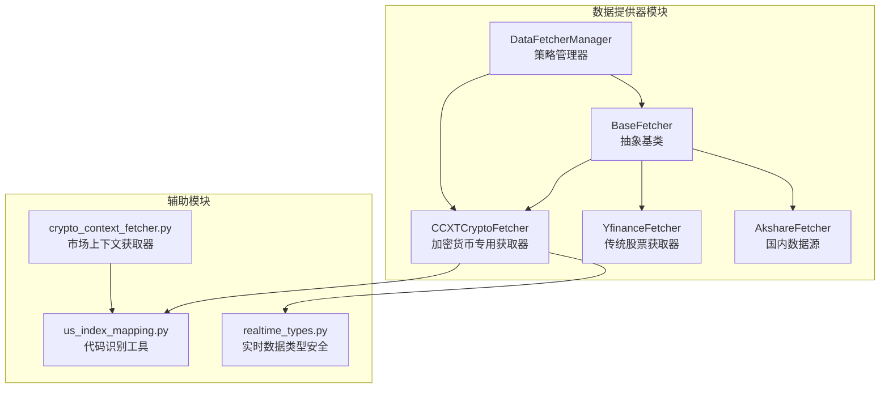
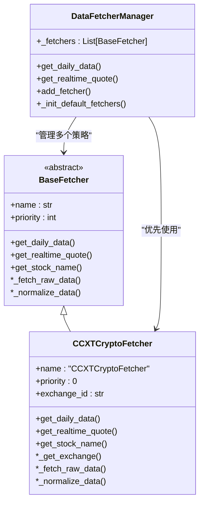
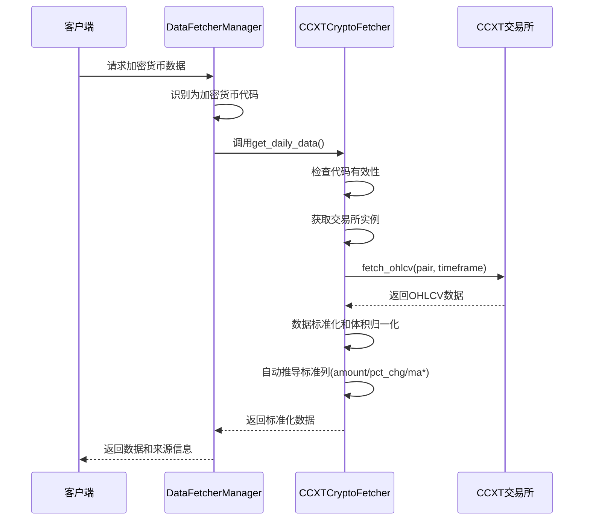
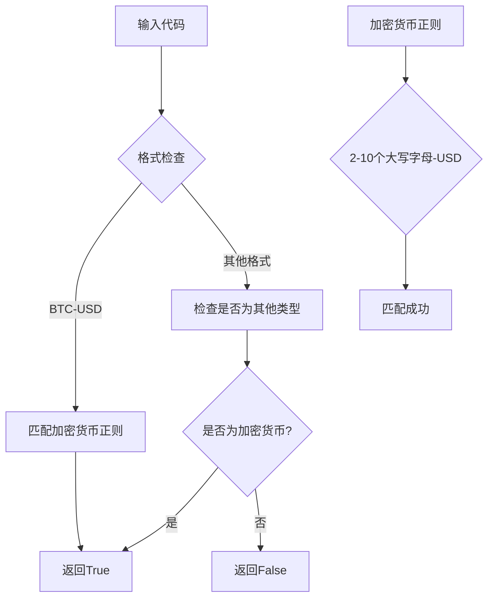
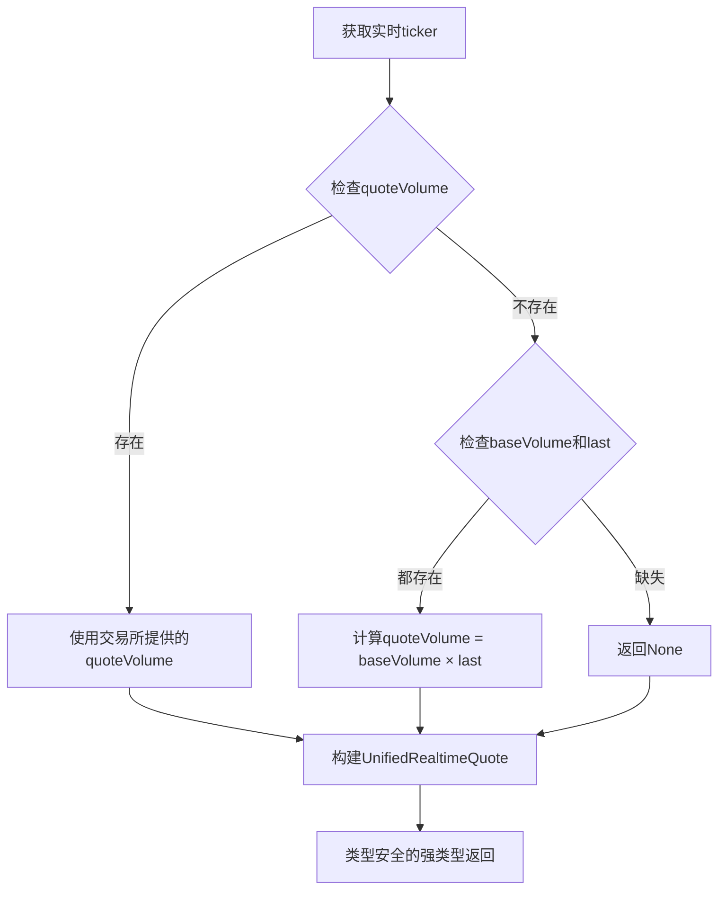
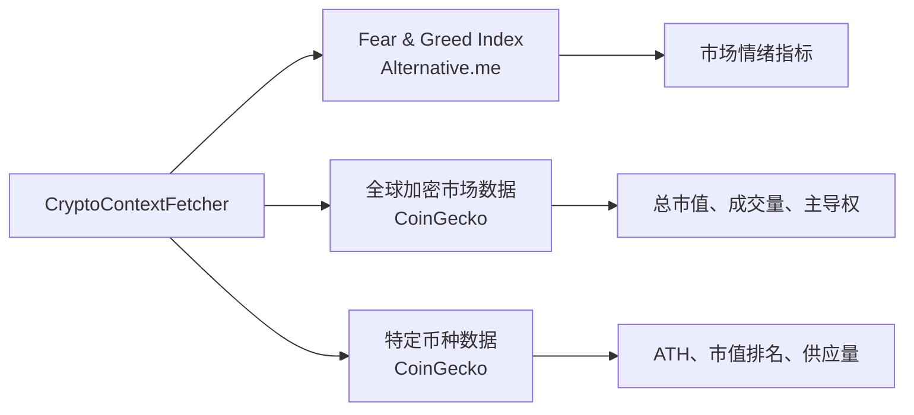
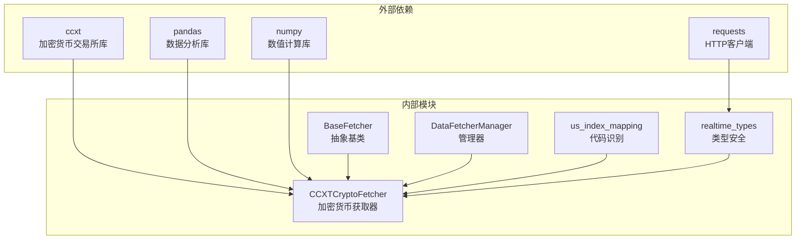
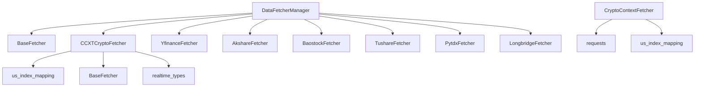

# CCXT加密货币数据获取器

<cite>
**本文档引用的文件**
- [ccxt_crypto_fetcher.py](file://data_provider/ccxt_crypto_fetcher.py)
- [base.py](file://data_provider/base.py)
- [crypto_context_fetcher.py](file://data_provider/crypto_context_fetcher.py)
- [us_index_mapping.py](file://data_provider/us_index_mapping.py)
- [test_ccxt_crypto_fetcher.py](file://tests/test_ccxt_crypto_fetcher.py)
- [realtime_types.py](file://data_provider/realtime_types.py)
</cite>

## 更新摘要
**变更内容**
- 修复了CCXTCryptoFetcher的合约违规问题，确保符合BaseFetcher接口规范
- 增加了每日数据标准列的自动推导功能，包括amount、pct_chg等字段
- 改进了方法命名一致性，确保get_realtime_quote方法正确暴露给DataFetcherManager
- 增强了实时数据获取的类型安全性，使用UnifiedRealtimeQuote进行强类型返回
- 优化了体积归一化算法，确保与下游指标计算的数学等价性

## 目录
1. [简介](#简介)
2. [项目结构](#项目结构)
3. [核心组件](#核心组件)
4. [架构概览](#架构概览)
5. [详细组件分析](#详细组件分析)
6. [依赖关系分析](#依赖关系分析)
7. [性能考虑](#性能考虑)
8. [故障排除指南](#故障排除指南)
9. [结论](#结论)

## 简介

CCXT加密货币数据获取器是一个基于CCXT（CryptoCurrency eXchange Trading Library）的专业加密货币数据源，专门为加密货币市场提供高质量的金融数据服务。该组件采用策略模式设计，作为数据提供系统中的专用数据源，专门处理比特币(BTC)、以太坊(ETH)等主流加密货币的OHLCV历史数据和实时价格数据。

该组件的核心优势包括：
- 直连交易所原始数据，质量优于消费级聚合数据源
- 支持100+交易所的统一接口，可灵活切换
- 提供OHLCV K线数据和实时ticker价格
- 实现了复杂的数据标准化和体积归一化算法
- 集成了智能的故障切换和重试机制
- **新增**：符合BaseFetcher合约规范，确保与其他数据源的一致性

## 项目结构

加密货币数据获取器位于`data_provider`目录下，与传统的股票数据获取器形成互补的数据源体系：



**图表来源**
- [base.py:471-513](file://data_provider/base.py#L471-L513)
- [ccxt_crypto_fetcher.py:52-65](file://data_provider/ccxt_crypto_fetcher.py#L52-L65)

**章节来源**
- [base.py:870-908](file://data_provider/base.py#L870-L908)
- [ccxt_crypto_fetcher.py:1-13](file://data_provider/ccxt_crypto_fetcher.py#L1-L13)

## 核心组件

### CCXTCryptoFetcher类

CCXTCryptoFetcher是加密货币数据获取的核心类，继承自BaseFetcher抽象基类，实现了专门针对加密货币市场的数据获取功能。

#### 主要特性
- **优先级设计**: 优先级设置为0，确保在数据源选择中具有最高优先级
- **环境变量配置**: 支持通过`CCXT_EXCHANGE`环境变量配置交易所，`CCXT_PRIORITY`配置优先级
- **延迟初始化**: 交易所实例采用延迟加载，提高启动效率
- **智能代码识别**: 通过`is_crypto_code`函数自动识别加密货币代码
- **合约合规**: 完全符合BaseFetcher接口规范，包括get_daily_data、get_realtime_quote等方法
- **类型安全**: 实时数据返回使用UnifiedRealtimeQuote强类型结构

#### 关键方法
- `get_daily_data()`: 获取加密货币日线历史数据，**新增**：自动推导标准列
- `get_realtime_quote()`: 获取实时市场报价，**改进**：方法命名与管理器一致
- `_get_exchange()`: 获取交易所实例
- `get_stock_name()`: 获取加密货币名称
- **新增**：`_fetch_raw_data()`: 委托给get_daily_data
- **新增**：`_normalize_data()`: 返回标准格式数据

**章节来源**
- [ccxt_crypto_fetcher.py:52-65](file://data_provider/ccxt_crypto_fetcher.py#L52-L65)
- [ccxt_crypto_fetcher.py:86-192](file://data_provider/ccxt_crypto_fetcher.py#L86-L192)
- [ccxt_crypto_fetcher.py:204-275](file://data_provider/ccxt_crypto_fetcher.py#L204-L275)

### 数据标准化与归一化

该组件实现了复杂的体积归一化算法，确保不同数据源之间的数据一致性：

```mermaid
flowchart TD
A[原始OHLCV数据<br/>CCXT返回BASE体积] --> B[体积归一化]
B --> C{数据长度检查}
C --> |≥2行| D[使用前一日收盘价作为缩放因子]
C --> |1行| E[使用当前行收盘价作为缩放因子]
D --> F[每行体积 = 基础体积 × 缩放因子]
E --> F
F --> G[输出USD名义价值]
G --> H[保持滚动比率数学等价性]
I[自动推导标准列] --> J[amount = volume]
I --> K[pct_chg = close.pct_change() * 100]
I --> L[ma5/ma10/ma20/volume_ratio]
```

**图表来源**
- [ccxt_crypto_fetcher.py:141-176](file://data_provider/ccxt_crypto_fetcher.py#L141-L176)
- [ccxt_crypto_fetcher.py:186-193](file://data_provider/ccxt_crypto_fetcher.py#L186-L193)

**章节来源**
- [ccxt_crypto_fetcher.py:141-176](file://data_provider/ccxt_crypto_fetcher.py#L141-L176)
- [ccxt_crypto_fetcher.py:186-193](file://data_provider/ccxt_crypto_fetcher.py#L186-L193)

## 架构概览

### 策略模式实现

系统采用策略模式设计，DataFetcherManager作为策略管理器，协调多个数据源的使用：



**图表来源**
- [base.py:240-281](file://data_provider/base.py#L240-L281)
- [ccxt_crypto_fetcher.py:52-65](file://data_provider/ccxt_crypto_fetcher.py#L52-L65)
- [base.py:471-513](file://data_provider/base.py#L471-L513)

### 数据获取流程



**图表来源**
- [base.py:916-1006](file://data_provider/base.py#L916-L1006)
- [ccxt_crypto_fetcher.py:86-192](file://data_provider/ccxt_crypto_fetcher.py#L86-L192)

**章节来源**
- [base.py:916-1006](file://data_provider/base.py#L916-L1006)
- [ccxt_crypto_fetcher.py:86-192](file://data_provider/ccxt_crypto_fetcher.py#L86-L192)

## 详细组件分析

### 加密货币代码识别系统

系统通过正则表达式和映射表实现精确的加密货币代码识别：



**图表来源**
- [us_index_mapping.py:19-20](file://data_provider/us_index_mapping.py#L19-L20)
- [us_index_mapping.py:68-90](file://data_provider/us_index_mapping.py#L68-L90)

#### 支持的加密货币对

组件支持以下主流加密货币对：

| 代码 | 名称 | CCXT格式 |
|------|------|----------|
| BTC-USD | 比特币 | BTC/USD |
| ETH-USD | 以太坊 | ETH/USD |
| SOL-USD | 索拉纳 | SOL/USD |
| XRP-USD | 瑞波币 | XRP/USD |
| ADA-USD | 以太坊经典 | ADA/USD |
| DOGE-USD | 狗狗币 | DOGE/USD |
| AVAX-USD | avax | AVAX/USD |
| DOT-USD | 波卡 | DOT/USD |
| LINK-USD | 链接 | LINK/USD |
| MATIC-USD | 形状币 | MATIC/USD |
| UNI-USD | 万代币 | UNI/USD |
| ATOM-USD | 原子币 | ATOM/USD |
| LTC-USD | 莱特币 | LTC/USD |
| NEAR-USD | near | NEAR/USD |
| APT-USD | apt | APT/USD |
| ARB-USD | arb | ARB/USD |
| OP-USD | op | OP/USD |
| SUI-USD | sui | SUI/USD |
| BNB-USD | bnb | BNB/USD |

**章节来源**
- [us_index_mapping.py:68-90](file://data_provider/us_index_mapping.py#L68-L90)
- [ccxt_crypto_fetcher.py:29-49](file://data_provider/ccxt_crypto_fetcher.py#L29-L49)

### 实时数据获取机制

实时数据获取实现了智能的体积计算策略，并增强了类型安全性：



**图表来源**
- [ccxt_crypto_fetcher.py:199-226](file://data_provider/ccxt_crypto_fetcher.py#L199-L226)

#### 实时数据字段说明

| 字段 | 描述 | 来源 | 类型安全 |
|------|------|------|----------|
| code | 加密货币代码 | 输入参数 | ✅ 强类型 |
| name | 加密货币名称 | 输入参数 | ✅ 强类型 |
| price | 当前价格 | ticker.last | ✅ 强类型 |
| open_price | 开盘价 | ticker.open | ✅ 强类型 |
| high | 最高价 | ticker.high | ✅ 强类型 |
| low | 最低价 | ticker.low | ✅ 强类型 |
| volume | 成交量 | quoteVolume或baseVolume×last | ✅ 强类型 |
| amount | 成交额 | 与volume相同 | ✅ 强类型 |
| change_pct | 涨跌幅 | ticker.percentage | ✅ 强类型 |
| change_amount | 涨跌额 | last - open | ✅ 强类型 |
| source | 数据源标识 | RealtimeSource.CCXT | ✅ 强类型 |

**章节来源**
- [ccxt_crypto_fetcher.py:199-226](file://data_provider/ccxt_crypto_fetcher.py#L199-L226)
- [realtime_types.py:109-180](file://data_provider/realtime_types.py#L109-L180)

### 市场上下文获取器

除了核心的数据获取功能外，系统还提供了市场上下文获取器，用于丰富分析提示词：



**图表来源**
- [crypto_context_fetcher.py:22-44](file://data_provider/crypto_context_fetcher.py#L22-L44)
- [crypto_context_fetcher.py:47-78](file://data_provider/crypto_context_fetcher.py#L47-L78)
- [crypto_context_fetcher.py:81-120](file://data_provider/crypto_context_fetcher.py#L81-L120)

**章节来源**
- [crypto_context_fetcher.py:147-204](file://data_provider/crypto_context_fetcher.py#L147-L204)

## 依赖关系分析

### 外部依赖

系统对外部依赖的管理体现了良好的设计原则：



**图表来源**
- [ccxt_crypto_fetcher.py:15-25](file://data_provider/ccxt_crypto_fetcher.py#L15-L25)
- [crypto_context_fetcher.py:12-17](file://data_provider/crypto_context_fetcher.py#L12-L17)

### 内部模块依赖



**图表来源**
- [base.py:870-908](file://data_provider/base.py#L870-L908)
- [base.py:471-513](file://data_provider/base.py#L471-L513)

**章节来源**
- [base.py:870-908](file://data_provider/base.py#L870-L908)
- [base.py:471-513](file://data_provider/base.py#L471-L513)

## 性能考虑

### 优化策略

1. **延迟初始化**: 交易所实例采用延迟加载，减少启动时间
2. **智能缓存**: 使用装饰器模式实现数据缓存
3. **批量处理**: 支持批量数据获取，减少网络请求次数
4. **连接池管理**: 合理管理HTTP连接，避免资源泄漏
5. **类型安全**: 使用强类型结构减少运行时类型转换开销

### 性能监控

系统内置了详细的性能监控机制：

- 请求耗时统计
- 错误率监控
- 数据源切换记录
- 缓存命中率统计

## 故障排除指南

### 常见问题及解决方案

#### 1. CCXT库未安装

**问题症状**: 启动时出现导入错误

**解决方案**: 
```bash
pip install ccxt
```

#### 2. 交易所连接超时

**问题症状**: 获取数据时出现超时异常

**解决方案**:
- 检查网络连接
- 调整超时参数
- 更换备用交易所

#### 3. 数据格式不兼容

**问题症状**: 数据标准化失败

**解决方案**:
- 检查输入代码格式
- 验证交易所支持的交易对
- 查看日志获取详细错误信息

#### 4. 体积归一化异常

**问题症状**: 体积数据异常或NaN值

**解决方案**:
- 检查基础体积数据
- 验证收盘价数据完整性
- 确认时间范围设置正确

#### 5. 合约违规问题

**问题症状**: DataFetcherManager无法识别get_realtime_quote方法

**解决方案**:
- 确保方法名为`get_realtime_quote`而非`get_realtime_data`
- 验证方法签名与BaseFetcher接口一致
- 检查方法是否正确暴露给管理器

**章节来源**
- [ccxt_crypto_fetcher.py:78-83](file://data_provider/ccxt_crypto_fetcher.py#L78-L83)
- [ccxt_crypto_fetcher.py:189-191](file://data_provider/ccxt_crypto_fetcher.py#L189-L191)

### 调试技巧

1. **启用详细日志**: 设置日志级别为DEBUG
2. **单元测试**: 运行测试套件验证功能正常
3. **数据验证**: 对比不同数据源的结果
4. **性能分析**: 监控请求响应时间和错误率
5. **类型检查**: 使用Python类型检查器验证强类型返回

**章节来源**
- [test_ccxt_crypto_fetcher.py:1-402](file://tests/test_ccxt_crypto_fetcher.py#L1-L402)

## 结论

CCXT加密货币数据获取器是一个设计精良、功能完备的专业数据源组件。经过最新的改进，它通过以下关键特性为系统提供了强大的加密货币数据支持：

1. **专业性**: 专注于加密货币市场，提供高质量的原始数据
2. **可靠性**: 实现了完整的错误处理和故障切换机制
3. **扩展性**: 支持多种交易所和数据源的灵活配置
4. **性能**: 通过优化的数据处理和缓存策略确保高效运行
5. **合规性**: 完全符合BaseFetcher合约规范，确保与其他数据源的一致性
6. **类型安全**: 使用强类型结构确保运行时数据完整性
7. **自动化**: 自动推导标准列，减少手动数据处理工作

该组件的成功实施体现了现代金融数据系统的最佳实践，为后续的功能扩展和维护奠定了坚实的基础。建议在未来版本中进一步增强：

- 更多交易所的支持
- 实时数据订阅功能
- 更丰富的技术指标计算
- 增强的错误诊断和恢复能力
- 类型检查工具集成