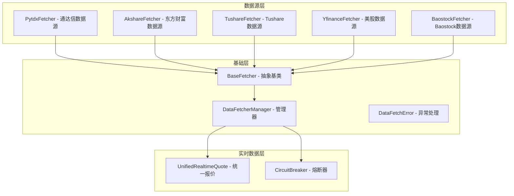
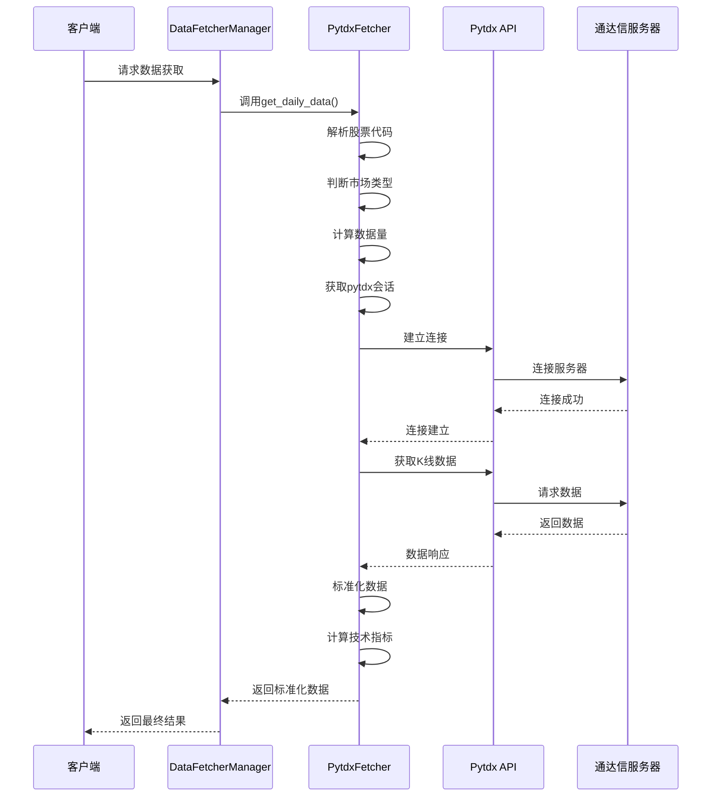
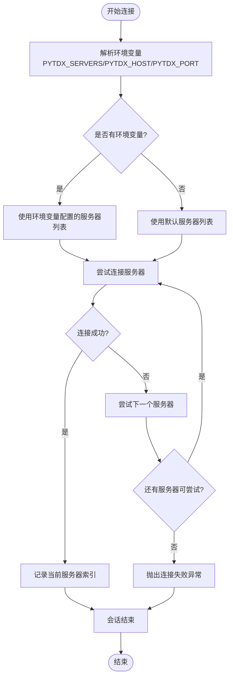
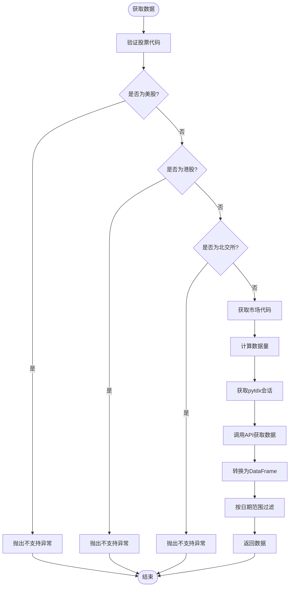
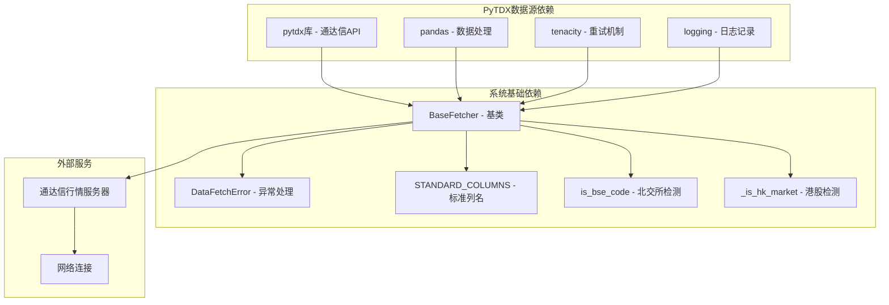
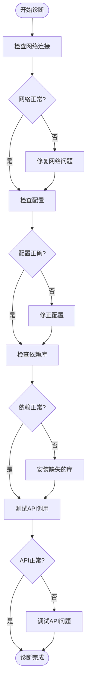

# PyTDX数据源实现

<cite>
**本文档引用的文件**
- [pytdx_fetcher.py](file://data_provider/pytdx_fetcher.py)
- [base.py](file://data_provider/base.py)
- [realtime_types.py](file://data_provider/realtime_types.py)
- [__init__.py](file://data_provider/__init__.py)
- [full-guide.md](file://docs/full-guide.md)
- [README_EN.md](file://docs/README_EN.md)
- [config_registry.py](file://src/core/config_registry.py)
</cite>

## 目录
1. [简介](#简介)
2. [项目结构](#项目结构)
3. [核心组件](#核心组件)
4. [架构概览](#架构概览)
5. [详细组件分析](#详细组件分析)
6. [依赖关系分析](#依赖关系分析)
7. [性能考虑](#性能考虑)
8. [故障排除指南](#故障排除指南)
9. [结论](#结论)

## 简介

PyTDX数据源实现是本项目中的重要组成部分，基于通达信专业金融数据终端开发。该实现提供了稳定、准确的A股数据获取能力，具有以下特点：

- **专业性**：直接连接通达信行情服务器，提供专业的金融数据
- **稳定性**：多服务器自动切换机制，确保数据获取的可靠性
- **准确性**：支持实时行情和历史数据，数据质量高
- **免费性**：无需Token，免费使用

PyTDX数据源在系统中的优先级为2，与Tushare数据源同级，作为重要的数据获取渠道之一。

## 项目结构

该项目采用模块化设计，PyTDX数据源位于`data_provider`包中，与其他数据源共同构成完整的数据获取体系：

**图表来源**
- [pytdx_fetcher.py:87-104](file://data_provider/pytdx_fetcher.py#L87-L104)
- [base.py:233-245](file://data_provider/base.py#L233-L245)
- [realtime_types.py:106-115](file://data_provider/realtime_types.py#L106-L115)

**章节来源**
- [pytdx_fetcher.py:1-15](file://data_provider/pytdx_fetcher.py#L1-L15)
- [__init__.py:12-29](file://data_provider/__init__.py#L12-L29)

## 核心组件

### PytdxFetcher类

PytdxFetcher是PyTDX数据源的核心实现，继承自BaseFetcher基类，提供了完整的数据获取功能：

#### 主要特性
- **多服务器自动切换**：支持8个默认服务器节点，自动选择最优连接
- **连接超时处理**：5秒超时机制，确保系统响应性
- **指数退避重试**：失败后采用指数退避策略进行重试
- **实时数据支持**：支持实时行情获取
- **历史数据下载**：支持日线历史数据获取

#### 关键属性
- `name`: "PytdxFetcher"
- `priority`: 通过环境变量PYTDX_PRIORITY配置，默认为2
- `DEFAULT_HOSTS`: 8个默认服务器节点列表
- `SECURITY_LIST_PAGE_SIZE`: 1000条/页的股票列表分页大小

**章节来源**
- [pytdx_fetcher.py:87-141](file://data_provider/pytdx_fetcher.py#L87-L141)

### BaseFetcher基类

BaseFetcher定义了所有数据源的统一接口和通用功能：

#### 核心功能
- **统一数据接口**：`get_daily_data()`方法提供标准化的数据获取流程
- **数据标准化**：统一列名映射和数据格式转换
- **技术指标计算**：自动计算MA5、MA10、MA20等技术指标
- **数据清洗**：自动处理空值、异常值和格式问题

#### 标准化列名
- `date`: 日期
- `open`: 开盘价
- `high`: 最高价
- `low`: 最低价
- `close`: 收盘价
- `volume`: 成交量
- `amount`: 成交额
- `pct_chg`: 涨跌幅

**章节来源**
- [base.py:233-273](file://data_provider/base.py#L233-L273)
- [base.py:34-35](file://data_provider/base.py#L34-L35)

### DataFetcherManager管理器

DataFetcherManager负责管理多个数据源，实现自动切换和故障转移：

#### 管理策略
- **优先级排序**：按优先级顺序尝试数据源
- **自动切换**：失败后自动切换到下一个数据源
- **统一接口**：对外提供统一的数据获取接口
- **错误记录**：详细记录每个数据源的失败原因

#### 数据源优先级
1. EfinanceFetcher (Priority 0)
2. AkshareFetcher (Priority 1)  
3. PytdxFetcher (Priority 2)
4. TushareFetcher (Priority 2)
5. BaostockFetcher (Priority 3)
6. YfinanceFetcher (Priority 4)

**章节来源**
- [base.py:464-497](file://data_provider/base.py#L464-L497)
- [base.py:735-771](file://data_provider/base.py#L735-L771)

## 架构概览

PyTDX数据源实现采用了清晰的分层架构设计：

**图表来源**
- [pytdx_fetcher.py:262-326](file://data_provider/pytdx_fetcher.py#L262-L326)
- [base.py:321-390](file://data_provider/base.py#L321-L390)

## 详细组件分析

### PytdxFetcher类详细分析

#### 连接管理机制

PytdxFetcher实现了智能的连接管理机制：

**图表来源**
- [pytdx_fetcher.py:156-204](file://data_provider/pytdx_fetcher.py#L156-L204)

#### 数据获取流程

PytdxFetcher的数据获取流程遵循严格的标准化过程：

**图表来源**
- [pytdx_fetcher.py:262-326](file://data_provider/pytdx_fetcher.py#L262-L326)

#### 数据标准化处理

PytdxFetcher实现了完整的数据标准化功能：

| 原始列名 | 标准化列名 | 处理方式 |
|---------|-----------|---------|
| `datetime` | `date` | 日期格式转换 |
| `vol` | `volume` | 交易量标准化 |
| `close` | `close` | 价格数据保留 |
| `open` | `open` | 价格数据保留 |
| `high` | `high` | 价格数据保留 |
| `low` | `low` | 价格数据保留 |
| `amount` | `amount` | 金额数据保留 |

**章节来源**
- [pytdx_fetcher.py:328-361](file://data_provider/pytdx_fetcher.py#L328-L361)

### 环境变量配置

PyTDX数据源支持多种环境变量配置方式：

#### 服务器配置选项

| 环境变量 | 描述 | 格式示例 | 优先级 |
|---------|------|---------|--------|
| `PYTDX_SERVERS` | 多服务器配置 | `"192.168.1.1:7709,10.0.0.1:7709"` | 最高 |
| `PYTDX_HOST` | 单服务器主机 | `"192.168.1.1"` | 中等 |
| `PYTDX_PORT` | 单服务器端口 | `"7709"` | 中等 |
| `PYTDX_PRIORITY` | 数据源优先级 | `"2"` | 最低 |

#### 默认服务器节点

系统内置了8个可靠的服务器节点：

| 地区 | IP地址 | 端口 | 服务器类型 |
|------|--------|------|-----------|
| 深圳 | 119.147.212.81 | 7709 | 主节点 |
| 深圳 | 112.74.214.43 | 7727 | 备用节点 |
| 上海 | 221.231.141.60 | 7709 | 主节点 |
| 上海 | 101.227.73.20 | 7709 | 备用节点 |
| 上海 | 101.227.77.254 | 7709 | 备用节点 |
| 广州 | 14.215.128.18 | 7709 | 备用节点 |
| 武汉 | 59.173.18.140 | 7709 | 备用节点 |
| 杭州 | 180.153.39.51 | 7709 | 备用节点 |

**章节来源**
- [pytdx_fetcher.py:37-72](file://data_provider/pytdx_fetcher.py#L37-L72)
- [pytdx_fetcher.py:110-119](file://data_provider/pytdx_fetcher.py#L110-L119)

### 实时数据获取

PyTDX数据源支持实时行情数据获取：

#### 实时数据接口

| 方法 | 参数 | 返回值 | 描述 |
|------|------|-------|------|
| `get_realtime_quote()` | `stock_code` | `dict` | 获取实时行情数据 |
| `get_stock_name()` | `stock_code` | `str` | 获取股票名称 |
| `_get_market_code()` | `stock_code` | `tuple` | 获取市场代码 |

#### 实时数据字段

| 字段名 | 类型 | 描述 |
|-------|------|------|
| `code` | `str` | 股票代码 |
| `name` | `str` | 股票名称 |
| `price` | `float` | 最新价格 |
| `open` | `float` | 开盘价 |
| `high` | `float` | 最高价 |
| `low` | `float` | 最低价 |
| `pre_close` | `float` | 昨收价 |
| `volume` | `int` | 成交量 |
| `amount` | `float` | 成交额 |
| `bid_prices` | `list` | 买价数组 |
| `ask_prices` | `list` | 卖价数组 |

**章节来源**
- [pytdx_fetcher.py:407-445](file://data_provider/pytdx_fetcher.py#L407-L445)

## 依赖关系分析

PyTDX数据源的依赖关系相对简洁，主要依赖于第三方库和系统基础组件：

**图表来源**
- [pytdx_fetcher.py:17-32](file://data_provider/pytdx_fetcher.py#L17-L32)
- [base.py:17-29](file://data_provider/base.py#L17-L29)

### 第三方库依赖

#### 核心依赖库

| 库名称 | 版本要求 | 用途 |
|-------|---------|------|
| `pytdx` | 最新版 | 通达信数据接口 |
| `pandas` | 最新版 | 数据处理和分析 |
| `tenacity` | 最新版 | 重试机制 |
| `numpy` | 最新版 | 数值计算 |

#### 系统依赖

| 依赖类型 | 说明 | 用途 |
|---------|------|------|
| `Python 3.10+` | 运行环境 | 系统要求 |
| `网络连接` | 网络访问 | 连接服务器 |
| `操作系统` | 跨平台支持 | Windows/Linux/macOS |

**章节来源**
- [pytdx_fetcher.py:17-32](file://data_provider/pytdx_fetcher.py#L17-L32)

## 性能考虑

### 连接优化策略

PyTDX数据源实现了多项性能优化措施：

#### 连接池管理
- **自动服务器切换**：8个服务器节点轮询，提高连接成功率
- **连接超时控制**：5秒超时机制，避免长时间等待
- **连接复用**：会话管理器确保连接正确释放

#### 数据缓存机制
- **股票列表缓存**：分页获取股票列表，缓存1000条/页
- **股票名称缓存**：内存缓存股票名称，减少重复查询
- **智能重试**：指数退避重试，避免雪崩效应

### 性能优化建议

#### 网络配置优化
1. **服务器选择**：优先选择地理位置较近的服务器
2. **并发控制**：合理设置并发数，避免服务器过载
3. **超时设置**：根据网络状况调整超时时间

#### 内存优化
1. **数据分页**：使用分页机制获取大量数据
2. **及时释放**：确保连接和会话及时释放
3. **缓存管理**：定期清理过期缓存数据

#### 网络优化
1. **DNS缓存**：利用系统DNS缓存减少解析时间
2. **连接复用**：尽量复用现有连接
3. **错误处理**：快速失败和重试机制

## 故障排除指南

### 常见问题及解决方案

#### 连接问题

| 问题类型 | 症状 | 解决方案 |
|---------|------|---------|
| 服务器不可达 | `无法连接任何服务器` | 检查网络连接，更换服务器节点 |
| 连接超时 | `连接超时` | 增加超时时间，检查防火墙设置 |
| 认证失败 | `认证失败` | 检查服务器配置，确认IP白名单 |

#### 数据获取问题

| 问题类型 | 症状 | 解决方案 |
|---------|------|---------|
| 数据为空 | `未查询到数据` | 检查股票代码格式，确认数据可用性 |
| 格式错误 | `数据格式异常` | 更新pytdx库版本，检查数据源 |
| 缓存问题 | `缓存数据过期` | 清理缓存，重新获取数据 |

#### 环境配置问题

| 问题类型 | 症状 | 解决方案 |
|---------|------|---------|
| 环境变量错误 | `配置无效` | 检查环境变量格式，确认值的有效性 |
| 权限问题 | `权限不足` | 检查文件权限，确认网络访问权限 |
| 依赖缺失 | `导入失败` | 安装缺失的依赖库，确认版本兼容性 |

### 调试和监控

#### 日志配置
- **调试模式**：启用详细日志记录
- **错误级别**：区分不同级别的错误信息
- **性能监控**：记录关键操作的执行时间

#### 性能监控指标
- **连接成功率**：监控服务器连接成功率
- **数据获取时间**：记录数据获取的响应时间
- **重试次数**：统计重试操作的频率

### 故障诊断流程

**图表来源**
- [pytdx_fetcher.py:156-204](file://data_provider/pytdx_fetcher.py#L156-L204)

**章节来源**
- [pytdx_fetcher.py:170-204](file://data_provider/pytdx_fetcher.py#L170-L204)
- [base.py:382-389](file://data_provider/base.py#L382-L389)

## 结论

PyTDX数据源实现展现了优秀的工程实践，具有以下突出特点：

### 技术优势
- **专业性强**：直接连接通达信专业数据终端，数据质量可靠
- **架构清晰**：采用分层设计，职责明确，易于维护
- **容错能力强**：多重重试机制和自动切换，确保服务稳定性
- **扩展性好**：模块化设计，便于功能扩展和性能优化

### 实用价值
- **A股数据获取**：专门针对A股市场的数据获取需求
- **实时数据支持**：满足实时行情分析的应用场景
- **历史数据下载**：支持长期数据研究和回测分析
- **多服务器架构**：提高数据获取的可靠性和速度

### 发展前景
随着金融数据需求的不断增长，PyTDX数据源实现为构建更加完善的数据获取体系奠定了坚实基础。通过持续的优化和改进，该实现将继续为用户提供高质量的金融数据服务。

该实现不仅满足了当前的功能需求，也为未来的功能扩展和技术演进预留了充足的空间，是一个值得借鉴的优秀数据源实现案例。