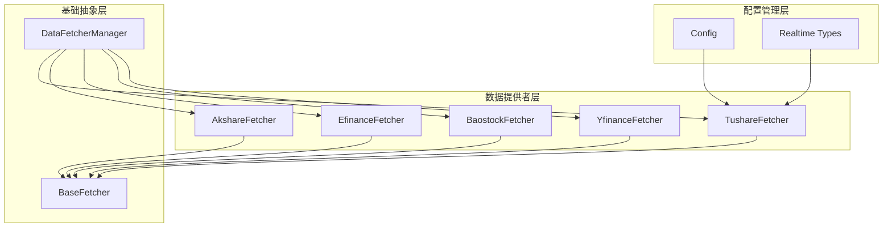
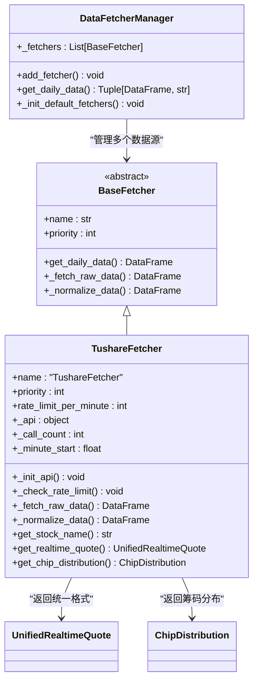
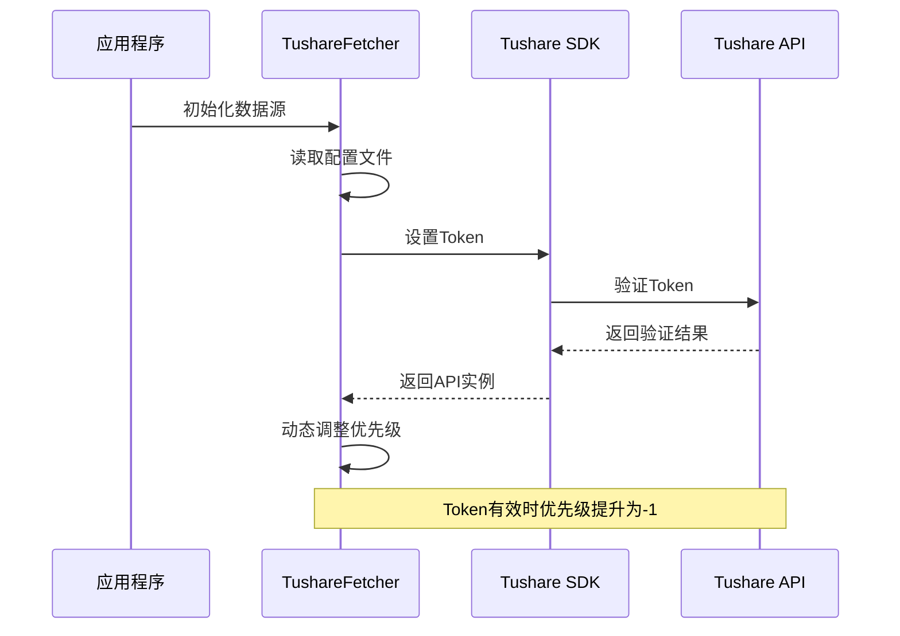
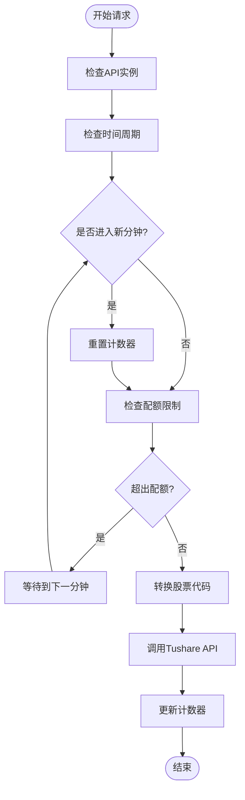
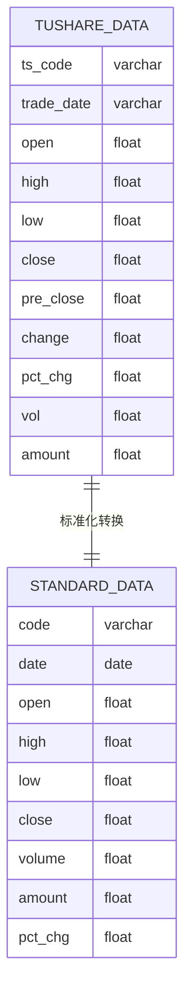
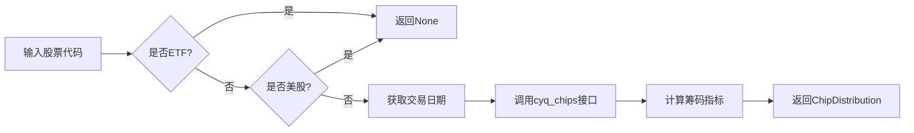
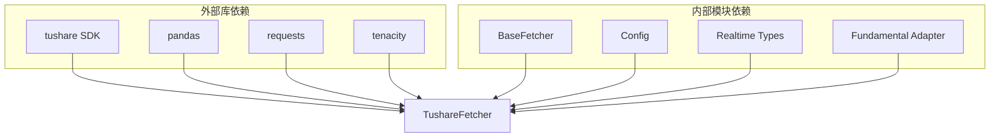
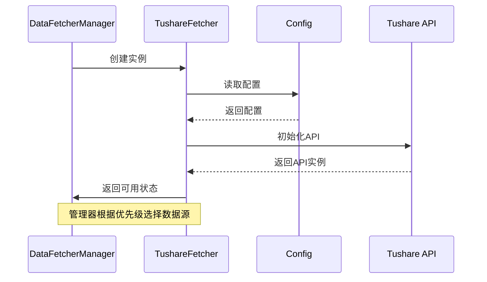
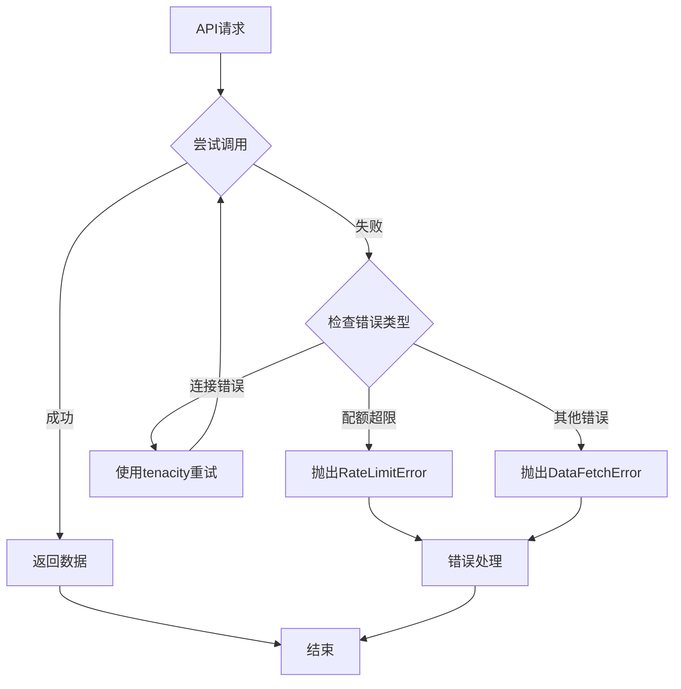

# Tushare数据源实现

<cite>
**本文档引用的文件**
- [tushare_fetcher.py](file://data_provider/tushare_fetcher.py)
- [base.py](file://data_provider/base.py)
- [config.py](file://src/config.py)
- [realtime_types.py](file://data_provider/realtime_types.py)
- [fundamental_adapter.py](file://data_provider/fundamental_adapter.py)
- [README.md](file://README.md)
- [full-guide.md](file://docs/full-guide.md)
</cite>

## 目录
1. [简介](#简介)
2. [项目结构](#项目结构)
3. [核心组件](#核心组件)
4. [架构概览](#架构概览)
5. [详细组件分析](#详细组件分析)
6. [依赖关系分析](#依赖关系分析)
7. [性能考虑](#性能考虑)
8. [故障排除指南](#故障排除指南)
9. [结论](#结论)

## 简介

Tushare数据源实现是本项目中的付费数据源，提供高质量的A股市场数据。该实现基于Tushare Pro API，具有以下特点：

- **数据质量高**：Tushare作为专业的金融数据提供商，数据准确性高
- **API稳定性强**：接口稳定可靠，适合生产环境使用
- **专业功能丰富**：支持实时行情、筹码分布、机构持股等专业功能
- **付费服务**：需要有效的Token才能使用，提供更好的服务等级

## 项目结构

该项目采用模块化设计，Tushare数据源位于`data_provider`包中，与其它数据源实现保持一致的接口规范。

**图表来源**
- [tushare_fetcher.py:75-211](file://data_provider/tushare_fetcher.py#L75-L211)
- [base.py:233-462](file://data_provider/base.py#L233-L462)
- [config.py:31-580](file://src/config.py#L31-L580)

**章节来源**
- [tushare_fetcher.py:1-1240](file://data_provider/tushare_fetcher.py#L1-L1240)
- [base.py:1-800](file://data_provider/base.py#L1-L800)

## 核心组件

### TushareFetcher类

TushareFetcher是Tushare数据源的核心实现，继承自BaseFetcher抽象基类，实现了统一的数据获取接口。

#### 主要特性
- **Token认证机制**：支持Tushare Pro API的Token认证
- **速率限制控制**：实现每分钟请求次数限制
- **自动优先级调整**：根据Token配置动态调整数据源优先级
- **多种数据接口**：支持日线数据、实时行情、筹码分布等

#### 关键配置参数
- `rate_limit_per_minute`: 默认80次/分钟（免费配额）
- `priority`: 优先级设置，Token有效时为-1（最高优先级）

**章节来源**
- [tushare_fetcher.py:75-211](file://data_provider/tushare_fetcher.py#L75-L211)
- [tushare_fetcher.py:95-114](file://data_provider/tushare_fetcher.py#L95-L114)

## 架构概览

Tushare数据源采用策略模式设计，与BaseFetcher基类保持一致的接口规范，支持自动故障切换和优先级管理。

**图表来源**
- [base.py:233-462](file://data_provider/base.py#L233-L462)
- [tushare_fetcher.py:75-211](file://data_provider/tushare_fetcher.py#L75-L211)
- [realtime_types.py:106-177](file://data_provider/realtime_types.py#L106-L177)

## 详细组件分析

### Token认证机制

TushareFetcher实现了完整的Token认证机制，确保API访问的安全性。

**图表来源**
- [tushare_fetcher.py:115-145](file://data_provider/tushare_fetcher.py#L115-L145)
- [config.py:341](file://src/config.py#L341)

#### 认证流程特点
- **配置驱动**：从环境变量读取Token配置
- **动态验证**：初始化时验证Token有效性
- **优先级提升**：Token有效时自动提升数据源优先级

**章节来源**
- [tushare_fetcher.py:115-202](file://data_provider/tushare_fetcher.py#L115-L202)
- [config.py:341](file://src/config.py#L341)

### 速率限制控制系统

TushareFetcher实现了精确的速率限制控制，确保符合Tushare的配额要求。

**图表来源**
- [tushare_fetcher.py:213-253](file://data_provider/tushare_fetcher.py#L213-L253)

#### 速率限制策略
- **每分钟80次限制**：符合Tushare免费用户的配额
- **精确计时**：基于60秒周期的精确控制
- **自动等待**：超出配额时自动等待到下一分钟

**章节来源**
- [tushare_fetcher.py:213-253](file://data_provider/tushare_fetcher.py#L213-L253)

### 数据接口和格式处理

TushareFetcher支持多种数据接口，能够处理不同的数据格式并转换为统一的标准格式。

#### 支持的数据接口
- **日线数据**：`daily()` - 普通股票日线数据
- **ETF数据**：`fund_daily()` - ETF基金日线数据
- **实时行情**：`quotation()` - Tushare Pro实时接口
- **筹码分布**：`cyq_chips()` - 筹码分布数据

#### 数据格式转换

**图表来源**
- [tushare_fetcher.py:431-472](file://data_provider/tushare_fetcher.py#L431-L472)

**章节来源**
- [tushare_fetcher.py:363-472](file://data_provider/tushare_fetcher.py#L363-L472)

### 专业功能实现

#### 实时行情获取

TushareFetcher实现了多层次的实时行情获取策略：

1. **Pro接口优先**：使用`quotation()`接口获取完整数据
2. **降级策略**：Pro接口失败时使用旧版接口
3. **统一格式**：将不同接口的数据转换为统一格式

#### 筹码分布分析

**图表来源**
- [tushare_fetcher.py:1037-1104](file://data_provider/tushare_fetcher.py#L1037-L1104)

**章节来源**
- [tushare_fetcher.py:574-694](file://data_provider/tushare_fetcher.py#L574-L694)
- [tushare_fetcher.py:1037-1172](file://data_provider/tushare_fetcher.py#L1037-L1172)

## 依赖关系分析

### 外部依赖

TushareFetcher的主要外部依赖包括：

**图表来源**
- [tushare_fetcher.py:17-38](file://data_provider/tushare_fetcher.py#L17-L38)

### 内部模块交互

TushareFetcher与系统其他模块的交互关系：

**图表来源**
- [base.py:735-778](file://data_provider/base.py#L735-L778)
- [tushare_fetcher.py:115-114](file://data_provider/tushare_fetcher.py#L115-L114)

**章节来源**
- [base.py:464-778](file://data_provider/base.py#L464-L778)
- [tushare_fetcher.py:115-114](file://data_provider/tushare_fetcher.py#L115-L114)

## 性能考虑

### 配置优化建议

1. **Token配置优化**：有效Token可提升数据源优先级
2. **速率限制调优**：根据实际需求调整每分钟请求数
3. **缓存策略**：利用内置缓存减少重复请求
4. **错误重试**：使用指数退避策略提高成功率

### 性能特征

- **响应时间**：受网络和Tushare API性能影响
- **并发控制**：通过速率限制避免API限流
- **内存使用**：合理使用pandas进行数据处理
- **CPU消耗**：数据转换和标准化操作

## 故障排除指南

### 常见问题及解决方案

#### Token配置问题
- **症状**：数据源不可用，日志显示Token未配置
- **解决方案**：在环境变量中设置正确的TUSHARE_TOKEN

#### 速率限制错误
- **症状**：出现RateLimitError异常
- **解决方案**：检查请求频率，确保不超过每分钟80次限制

#### API连接失败
- **症状**：网络连接超时或API不可用
- **解决方案**：检查网络连接，验证Token有效性

**章节来源**
- [tushare_fetcher.py:421-429](file://data_provider/tushare_fetcher.py#L421-L429)

### 错误处理策略

TushareFetcher实现了完善的错误处理机制：

**图表来源**
- [tushare_fetcher.py:357-430](file://data_provider/tushare_fetcher.py#L357-L430)

## 结论

Tushare数据源实现提供了高质量的付费数据服务，在本项目中具有重要地位：

### 主要优势
- **数据质量**：Tushare作为专业金融数据提供商，数据准确性高
- **功能完善**：支持实时行情、筹码分布、机构持股等专业功能
- **稳定性强**：API接口稳定，适合生产环境使用
- **集成便利**：与现有数据源框架无缝集成

### 适用场景
- **专业投资者**：需要高质量数据的专业用户
- **量化分析**：需要稳定API接口的量化项目
- **研究分析**：需要专业功能的研究场景
- **生产环境**：对稳定性要求较高的应用场景

### 最佳实践建议
1. **Token管理**：妥善保管和轮换TUSHARE_TOKEN
2. **速率控制**：严格遵守每分钟80次的配额限制
3. **错误处理**：实现完善的异常处理和重试机制
4. **监控告警**：建立API使用情况的监控体系

通过合理的配置和使用，Tushare数据源能够为用户提供稳定、高质量的金融数据服务，是构建专业股票分析系统的重要组成部分。