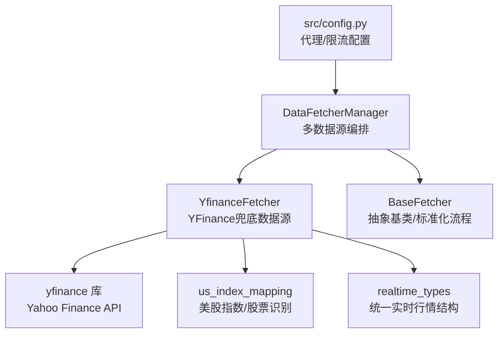
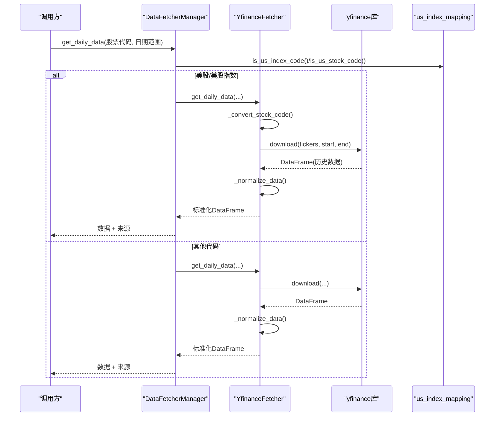
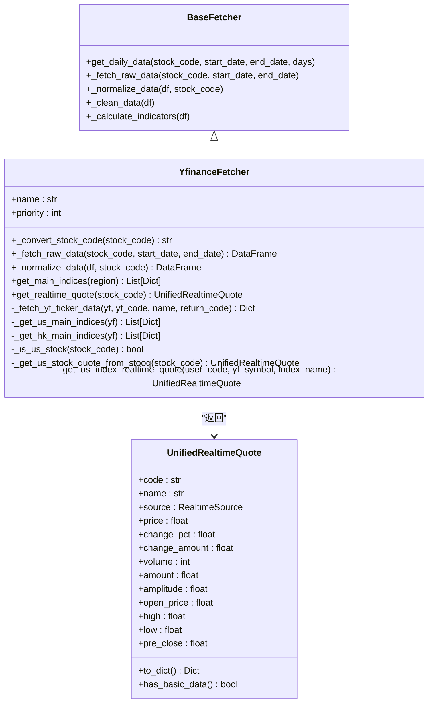
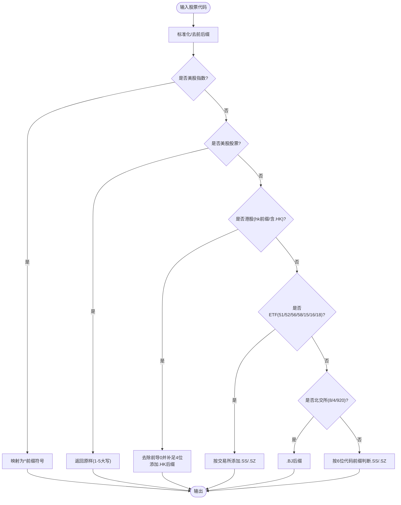
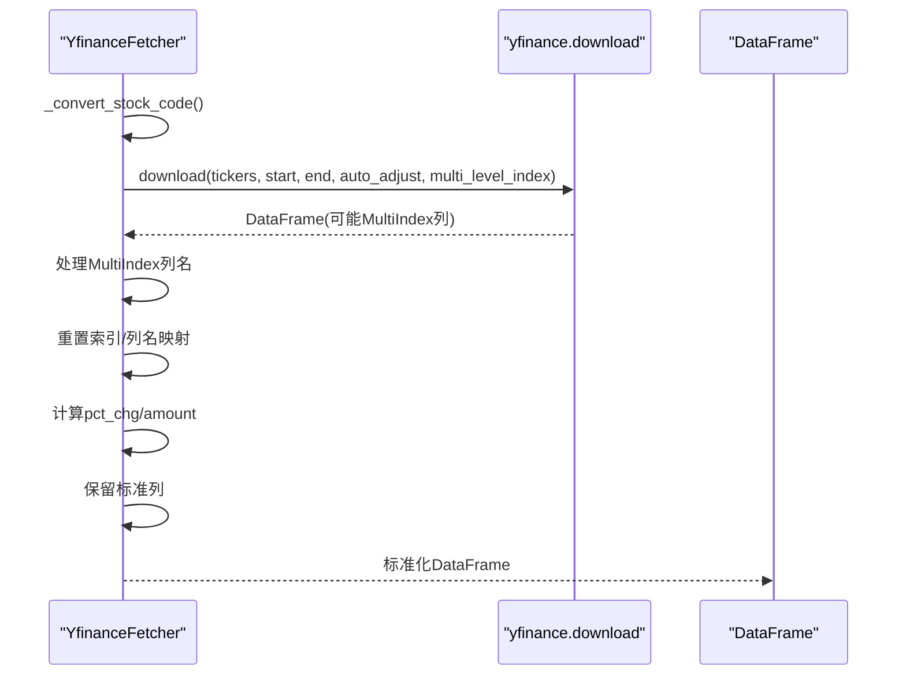
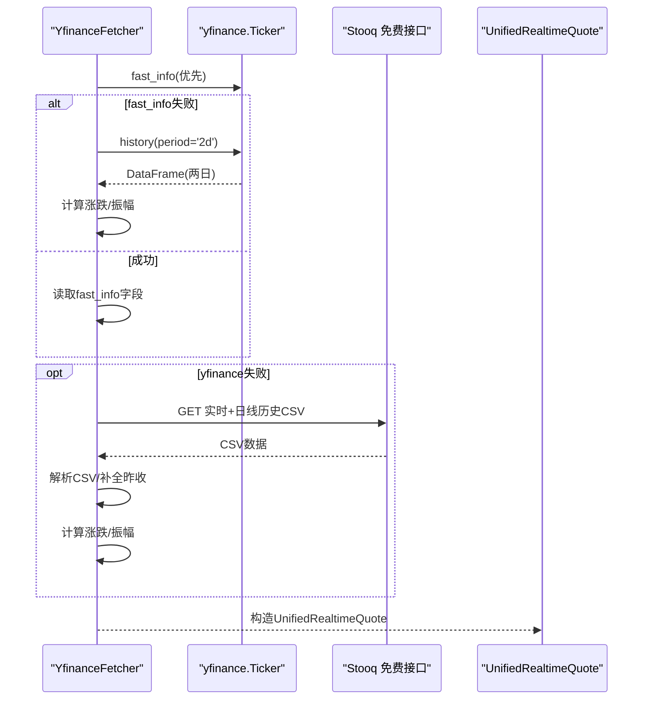
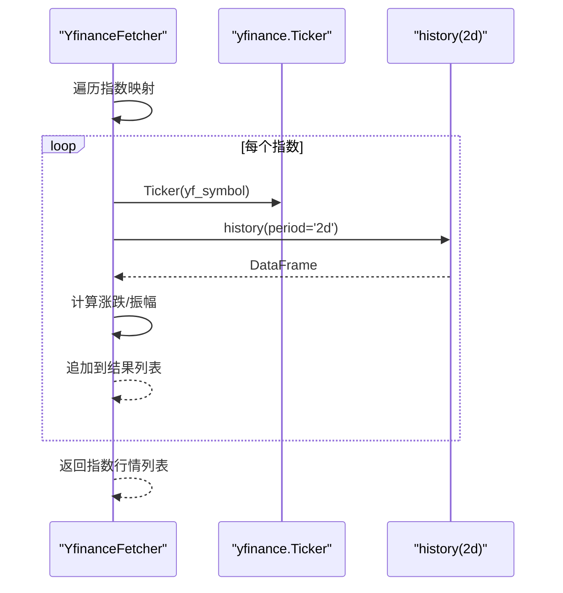
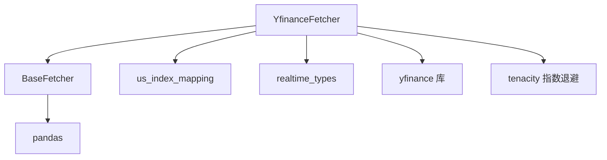

# YFinance数据源实现

<cite>
**本文档引用的文件**
- [yfinance_fetcher.py](file://data_provider/yfinance_fetcher.py)
- [base.py](file://data_provider/base.py)
- [us_index_mapping.py](file://data_provider/us_index_mapping.py)
- [realtime_types.py](file://data_provider/realtime_types.py)
- [config.py](file://src/config.py)
- [requirements.txt](file://requirements.txt)
- [README.md](file://README.md)
- [test_yfinance_us_indices.py](file://tests/test_yfinance_us_indices.py)
- [test_yfinance_hk_indices.py](file://tests/test_yfinance_hk_indices.py)
- [test_stooq_fallback.py](file://tests/test_stooq_fallback.py)
</cite>

## 更新摘要
**变更内容**
- 新增香港市场指数支持功能，包括恒生指数(HSI)、恒生科技指数(HSTECH)、国企指数(HSCEI)的获取和处理
- 扩展get_main_indices方法以支持区域参数分发，新增_hk_main_indices方法
- 完善港股指数的Yahoo Finance符号映射和批量获取逻辑
- 增强指数行情计算，包括涨跌幅和振幅的精确计算

## 目录
1. [简介](#简介)
2. [项目结构](#项目结构)
3. [核心组件](#核心组件)
4. [架构总览](#架构总览)
5. [详细组件分析](#详细组件分析)
6. [依赖关系分析](#依赖关系分析)
7. [性能考虑](#性能考虑)
8. [故障排查指南](#故障排查指南)
9. [结论](#结论)
10. [附录](#附录)

## 简介
本文件面向YFinance数据源实现，系统性阐述YfinanceFetcher类在国际股票数据获取中的角色与实现细节，重点覆盖以下方面：
- YFinanceFetcher作为兜底数据源的设计定位与优先级策略
- Yahoo Finance API的使用方式、数据格式转换与多市场支持
- 美股、港股、全球市场数据的差异化处理机制（货币转换、时区处理、交易日历）
- 配置指南（代理设置、请求限流、错误处理策略）
- 数据完整性检查与异常数据处理机制
- 实际使用示例、性能优化建议与常见问题解决方案

**更新** 新增香港市场指数支持，涵盖恒生指数(HSI)、恒生科技指数(HSTECH)、国企指数(HSCEI)的完整获取和处理流程

## 项目结构
YFinance数据源位于数据提供层，采用策略模式与管理器协作：
- YfinanceFetcher继承BaseFetcher，实现统一接口与数据标准化
- DataFetcherManager负责多数据源编排与自动切换
- us_index_mapping提供美股指数与股票代码识别
- realtime_types定义统一实时行情结构与熔断机制
- config提供代理与限流等系统级配置



**图表来源**
- [base.py:464-979](file://data_provider/base.py#L464-L979)
- [yfinance_fetcher.py:56-777](file://data_provider/yfinance_fetcher.py#L56-L777)
- [us_index_mapping.py:1-115](file://data_provider/us_index_mapping.py#L1-L115)
- [realtime_types.py:1-418](file://data_provider/realtime_types.py#L1-L418)
- [config.py:259-299](file://src/config.py#L259-L299)

**章节来源**
- [base.py:464-979](file://data_provider/base.py#L464-L979)
- [yfinance_fetcher.py:56-777](file://data_provider/yfinance_fetcher.py#L56-L777)
- [us_index_mapping.py:1-115](file://data_provider/us_index_mapping.py#L1-L115)
- [realtime_types.py:1-418](file://data_provider/realtime_types.py#L1-L418)
- [config.py:259-299](file://src/config.py#L259-L299)

## 核心组件
- YfinanceFetcher：实现YFinance数据获取、代码转换、数据标准化与实时行情获取
- BaseFetcher：定义统一接口、标准化流程、数据清洗与技术指标计算
- DataFetcherManager：多数据源策略管理、自动切换与日志记录
- us_index_mapping：美股指数与股票代码识别映射
- realtime_types：统一实时行情结构与熔断器

**章节来源**
- [yfinance_fetcher.py:56-777](file://data_provider/yfinance_fetcher.py#L56-L777)
- [base.py:233-462](file://data_provider/base.py#L233-L462)
- [base.py:464-979](file://data_provider/base.py#L464-L979)
- [us_index_mapping.py:1-115](file://data_provider/us_index_mapping.py#L1-L115)
- [realtime_types.py:106-177](file://data_provider/realtime_types.py#L106-L177)

## 架构总览
YfinanceFetcher在策略体系中承担兜底角色，优先级较低，但对美股/美股指数提供直接路由与实时行情兜底能力。



**图表来源**
- [base.py:814-896](file://data_provider/base.py#L814-L896)
- [yfinance_fetcher.py:81-198](file://data_provider/yfinance_fetcher.py#L81-L198)
- [yfinance_fetcher.py:205-262](file://data_provider/yfinance_fetcher.py#L205-L262)
- [us_index_mapping.py:46-94](file://data_provider/us_index_mapping.py#L46-L94)

**章节来源**
- [base.py:814-896](file://data_provider/base.py#L814-L896)
- [yfinance_fetcher.py:81-198](file://data_provider/yfinance_fetcher.py#L81-L198)
- [yfinance_fetcher.py:205-262](file://data_provider/yfinance_fetcher.py#L205-L262)
- [us_index_mapping.py:46-94](file://data_provider/us_index_mapping.py#L46-L94)

## 详细组件分析

### YfinanceFetcher类分析
- 代码转换：支持A股、港股、美股、美股指数的格式转换
- 历史数据获取：封装yfinance.download，自动调整复权与列筛选
- 数据标准化：统一列名、计算涨跌幅与成交额、保留标准列
- 实时行情：美股/美股指数实时行情获取，失败时Stooq兜底
- 指数行情：A股与美股主要指数批量获取，**新增港股指数批量获取**

**更新** 新增_hk_main_indices方法，支持恒生指数(HSI)、恒生科技指数(HSTECH)、国企指数(HSCEI)的批量获取



**图表来源**
- [base.py:233-462](file://data_provider/base.py#L233-L462)
- [yfinance_fetcher.py:56-777](file://data_provider/yfinance_fetcher.py#L56-L777)
- [realtime_types.py:106-177](file://data_provider/realtime_types.py#L106-L177)

**章节来源**
- [yfinance_fetcher.py:56-777](file://data_provider/yfinance_fetcher.py#L56-L777)
- [realtime_types.py:106-177](file://data_provider/realtime_types.py#L106-L177)

### 代码转换与多市场支持
- A股：600xx/601xx/603xx/688xx -> .SS；000xx/002xx/300xx -> .SZ；ETF区分上海/深圳
- 港股：hkXXXX -> .HK（补齐4位，去除前导0）
- 美股：1-5字母（可带.X后缀）原样返回；美股指数映射到^前缀符号
- 北交所(BSE)：8xxxxx/4xxxxx/920xxx -> .BJ



**图表来源**
- [yfinance_fetcher.py:81-151](file://data_provider/yfinance_fetcher.py#L81-L151)

**章节来源**
- [yfinance_fetcher.py:81-151](file://data_provider/yfinance_fetcher.py#L81-L151)

### 历史数据获取与标准化
- 调用yfinance.download，启用auto_adjust与multi_level_index
- 处理MultiIndex列名，筛选目标ticker列
- 标准列名映射：Date->date, Open->open, High->high, Low->low, Close->close, Volume->volume
- 计算pct_chg（涨跌幅）与amount（成交额=量×价）
- 保留标准列：['code','date','open','high','low','close','volume','amount','pct_chg']



**图表来源**
- [yfinance_fetcher.py:153-203](file://data_provider/yfinance_fetcher.py#L153-L203)
- [yfinance_fetcher.py:205-262](file://data_provider/yfinance_fetcher.py#L205-L262)

**章节来源**
- [yfinance_fetcher.py:153-203](file://data_provider/yfinance_fetcher.py#L153-L203)
- [yfinance_fetcher.py:205-262](file://data_provider/yfinance_fetcher.py#L205-L262)

### 实时行情与兜底机制
- 美股/美股指数：优先使用yfinance.fast_info；失败回退history取最新两日数据
- 美股股票：若yfinance失败，使用Stooq免费接口获取实时行情（CSV解析、昨日收盘补全涨跌幅与振幅）
- 统一返回UnifiedRealtimeQuote结构，包含价格、涨跌、量价、振幅等字段



**图表来源**
- [yfinance_fetcher.py:618-777](file://data_provider/yfinance_fetcher.py#L618-L777)
- [yfinance_fetcher.py:382-531](file://data_provider/yfinance_fetcher.py#L382-L531)

**章节来源**
- [yfinance_fetcher.py:618-777](file://data_provider/yfinance_fetcher.py#L618-L777)
- [yfinance_fetcher.py:382-531](file://data_provider/yfinance_fetcher.py#L382-L531)

### 指数行情批量获取
- A股：映射到yfinance代码，批量获取并返回标准字典列表
- 美股：SPX/IXIC/DJI/VIX等核心指数映射与批量获取
- **港股：HSI/恒生科技/HSTECH/HSCEI/国企指数映射与批量获取**

**更新** 新增港股指数批量获取功能，支持恒生指数(HSI)、恒生科技指数(HSTECH)、国企指数(HSCEI)的完整获取流程



**图表来源**
- [yfinance_fetcher.py:307-402](file://data_provider/yfinance_fetcher.py#L307-L402)
- [yfinance_fetcher.py:264-305](file://data_provider/yfinance_fetcher.py#L264-L305)

**章节来源**
- [yfinance_fetcher.py:307-402](file://data_provider/yfinance_fetcher.py#L307-L402)
- [yfinance_fetcher.py:264-305](file://data_provider/yfinance_fetcher.py#L264-L305)

### 港股指数批量获取详解
**新增功能** YfinanceFetcher新增_hk_main_indices方法，专门处理港股主要指数的批量获取：

- **恒生指数(HSI)**：使用'^HSI'作为Yahoo Finance符号
- **恒生科技指数(HSTECH)**：使用'HSTECH.HK'作为Yahoo Finance符号（注意：不是'^HSTECH'）
- **国企指数(HSCEI)**：使用'^HSCE'作为Yahoo Finance符号（注意：不是'^HSCEI'）

该方法复用_get_yf_ticker_data方法，确保与美股指数相同的计算逻辑和返回格式。

**章节来源**
- [yfinance_fetcher.py:377-402](file://data_provider/yfinance_fetcher.py#L377-L402)
- [test_yfinance_hk_indices.py:53-82](file://tests/test_yfinance_hk_indices.py#L53-L82)

## 依赖关系分析
- 外部依赖：yfinance、pandas、tenacity（指数退避重试）
- 内部依赖：BaseFetcher（统一接口与标准化流程）、us_index_mapping（美股识别）、realtime_types（统一结构）



**图表来源**
- [yfinance_fetcher.py:17-36](file://data_provider/yfinance_fetcher.py#L17-L36)
- [requirements.txt:18-26](file://requirements.txt#L18-L26)

**章节来源**
- [yfinance_fetcher.py:17-36](file://data_provider/yfinance_fetcher.py#L17-L36)
- [requirements.txt:18-26](file://requirements.txt#L18-L26)

## 性能考虑
- 指数退避重试：对网络异常采用指数退避，降低对上游的压力
- 数据标准化与指标计算：在内存中完成，注意大数据量时的内存占用
- 实时行情预取：Manager层对全量数据源支持批量预取，减少重复请求
- 代理与NO_PROXY：智能代理配置避免国内数据源走代理，提高成功率

**章节来源**
- [yfinance_fetcher.py:153-158](file://data_provider/yfinance_fetcher.py#L153-L158)
- [base.py:780-979](file://data_provider/base.py#L780-L979)
- [config.py:259-299](file://src/config.py#L259-L299)

## 故障排查指南
- 美股/美股指数无法获取：确认代码是否映射到正确的^前缀符号；检查yfinance接口可用性
- 美股股票实时行情失败：查看yfinance.fast_info与history回退路径；若yfinance失败，检查Stooq CSV解析逻辑
- 数据为空：确认_convert_stock_code输出是否正确；检查yfinance.download返回是否为空
- 代理问题：确保NO_PROXY包含国内金融域名，避免国内数据源走代理导致失败
- 指数测试：参考单元测试覆盖单指数取数与批量获取逻辑
- **港股指数问题**：确认Yahoo Finance符号映射正确（HSI使用'^HSI'，HSTECH使用'HSTECH.HK'，HSCEI使用'^HSCE'）

**章节来源**
- [yfinance_fetcher.py:81-198](file://data_provider/yfinance_fetcher.py#L81-L198)
- [yfinance_fetcher.py:618-777](file://data_provider/yfinance_fetcher.py#L618-L777)
- [config.py:259-299](file://src/config.py#L259-L299)
- [test_yfinance_us_indices.py:1-130](file://tests/test_yfinance_us_indices.py#L1-L130)
- [test_yfinance_hk_indices.py:1-206](file://tests/test_yfinance_hk_indices.py#L1-L206)
- [test_stooq_fallback.py:1-36](file://tests/test_stooq_fallback.py#L1-L36)

## 结论
YfinanceFetcher作为国际数据源的兜底实现，具备完善的美股/美股指数识别、代码转换、数据标准化与实时行情兜底能力。**新增的港股指数支持功能进一步扩展了其全球市场覆盖范围，特别是恒生指数(HSI)、恒生科技指数(HSTECH)、国企指数(HSCEI)的完整获取能力**。通过策略模式与管理器协作，系统在多数据源环境下实现了高可用与可维护性。结合代理与限流配置、指数退避重试与熔断机制，能够在复杂网络环境下稳定获取国际市场的高质量数据。

## 附录

### 配置指南
- 代理设置：HTTP_PROXY/HTTPS_PROXY配合NO_PROXY，确保国内数据源不走代理
- 请求限流：通过随机休眠与指数退避重试降低被限流风险
- 错误处理：统一DataFetchError异常类型，记录详细错误信息与耗时

**章节来源**
- [config.py:259-299](file://src/config.py#L259-L299)
- [base.py:452-461](file://data_provider/base.py#L452-L461)
- [yfinance_fetcher.py:153-158](file://data_provider/yfinance_fetcher.py#L153-L158)

### 实际使用示例
- 获取日线数据：调用DataFetcherManager.get_daily_data，自动路由至YfinanceFetcher（美股/美股指数）
- 获取实时行情：调用YfinanceFetcher.get_realtime_quote，优先yfinance.fast_info，失败回退Stooq
- 获取指数行情：调用YfinanceFetcher.get_main_indices，支持A股、美股与**港股**（通过region参数指定）

**更新** 新增港股指数获取示例，使用region='hk'参数获取恒生指数(HSI)、恒生科技指数(HSTECH)、国企指数(HSCEI)

**章节来源**
- [base.py:785-896](file://data_provider/base.py#L785-L896)
- [yfinance_fetcher.py:618-777](file://data_provider/yfinance_fetcher.py#L618-L777)
- [yfinance_fetcher.py:307-402](file://data_provider/yfinance_fetcher.py#L307-L402)

### 港股指数获取示例
```python
# 获取港股主要指数行情
fetcher = YfinanceFetcher()
hk_indices = fetcher.get_main_indices(region='hk')
# 返回包含 HSI、HSTECH、HSCEI 的指数行情列表
```

**章节来源**
- [yfinance_fetcher.py:307-402](file://data_provider/yfinance_fetcher.py#L307-L402)
- [test_yfinance_hk_indices.py:84-184](file://tests/test_yfinance_hk_indices.py#L84-L184)