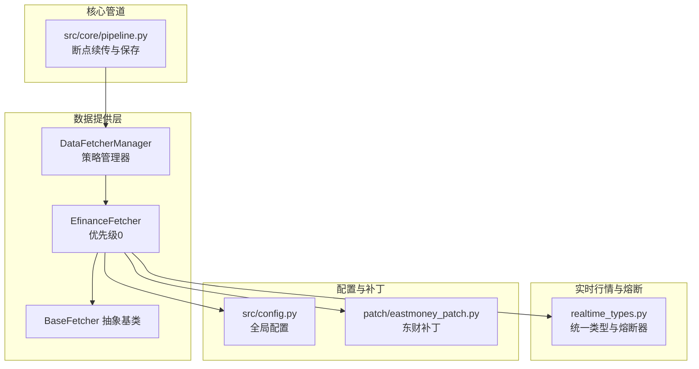
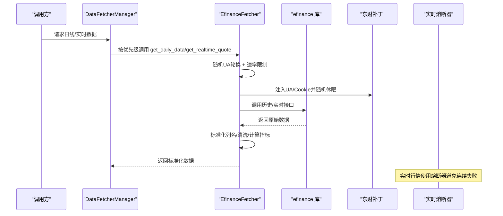
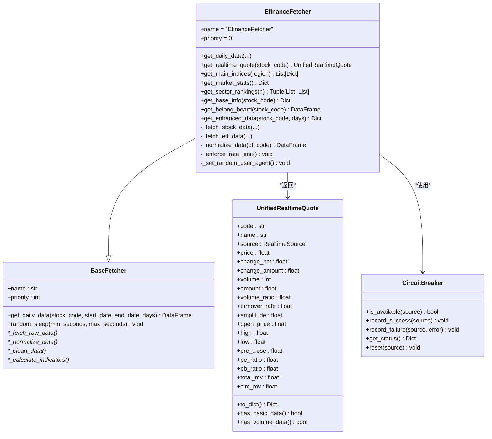
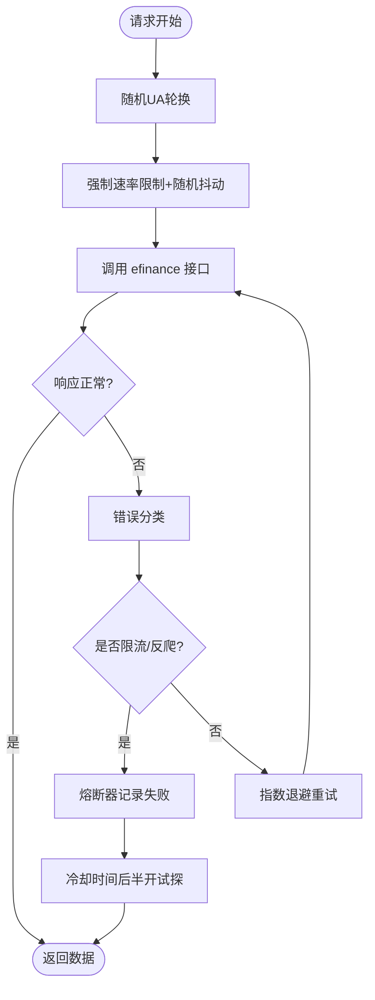
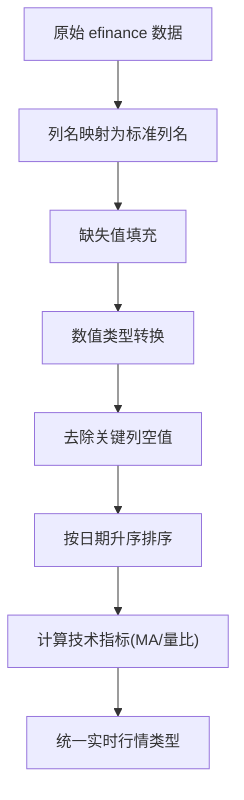
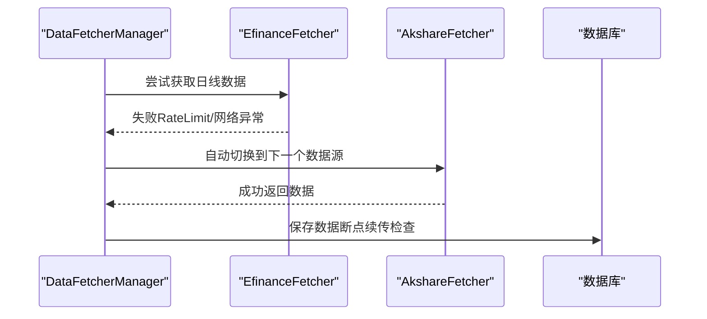
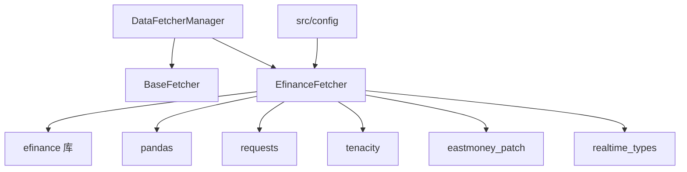

# 东方财富数据源实现

<cite>
**本文档引用的文件**
- [efinance_fetcher.py](file://data_provider/efinance_fetcher.py)
- [base.py](file://data_provider/base.py)
- [realtime_types.py](file://data_provider/realtime_types.py)
- [config.py](file://src/config.py)
- [eastmoney_patch.py](file://patch/eastmoney_patch.py)
- [pipeline.py](file://src/core/pipeline.py)
</cite>

## 目录
1. [简介](#简介)
2. [项目结构](#项目结构)
3. [核心组件](#核心组件)
4. [架构概览](#架构概览)
5. [详细组件分析](#详细组件分析)
6. [依赖分析](#依赖分析)
7. [性能考虑](#性能考虑)
8. [故障排查指南](#故障排查指南)
9. [结论](#结论)
10. [附录](#附录)

## 简介
本文件面向东方财富数据源实现，围绕 EfinanceFetcher 类展开，深入解释其基于 efinance 库的爬虫机制与数据获取策略，涵盖反爬虫对抗技术（User-Agent 轮换、请求头伪装、熔断器与指数退避重试）、数据解析与清洗流程（HTML 解析、数据提取与格式标准化）、配置参数说明（代理设置、超时配置与重试策略）、与其他数据源的数据一致性保证机制与冲突处理策略，并提供实际使用示例与常见问题解决方案。

## 项目结构
EfinanceFetcher 位于 data_provider 目录，作为最高优先级数据源（优先级 0），在 DataFetcherManager 的策略模式下与其他数据源协同工作，实现自动故障切换与统一数据接口。

**图表来源**
- [efinance_fetcher.py:236-272](file://data_provider/efinance_fetcher.py#L236-L272)
- [base.py:233-462](file://data_provider/base.py#L233-L462)
- [realtime_types.py:268-418](file://data_provider/realtime_types.py#L268-L418)
- [config.py:31-580](file://src/config.py#L31-L580)
- [eastmoney_patch.py:150-182](file://patch/eastmoney_patch.py#L150-L182)
- [pipeline.py:153-176](file://src/core/pipeline.py#L153-L176)

**章节来源**
- [efinance_fetcher.py:1-1203](file://data_provider/efinance_fetcher.py#L1-L1203)
- [base.py:464-887](file://data_provider/base.py#L464-L887)
- [realtime_types.py:1-418](file://data_provider/realtime_types.py#L1-L418)
- [config.py:1-580](file://src/config.py#L1-L580)
- [eastmoney_patch.py:150-182](file://patch/eastmoney_patch.py#L150-L182)
- [pipeline.py:153-176](file://src/core/pipeline.py#L153-L176)

## 核心组件
- EfinanceFetcher：最高优先级数据源，封装 efinance 库调用，负责历史 K 线、实时行情、指数、市场统计、板块排行、基本信息与所属板块等数据的获取与标准化。
- BaseFetcher：定义统一接口与通用流程（获取原始数据、标准化、清洗、计算指标、随机休眠）。
- DataFetcherManager：策略管理器，按优先级自动切换数据源，记录失败原因，最终返回任一成功数据源的结果。
- realtime_types：统一实时行情类型与熔断器，保障多数据源故障切换与稳定性。
- config：全局配置，包含代理、缓存、熔断器冷却时间、实时行情优先级等。
- eastmoney_patch：对 requests.Session.request 进行全局补丁，注入随机 UA 与 Cookie，降低被封概率。

**章节来源**
- [efinance_fetcher.py:236-533](file://data_provider/efinance_fetcher.py#L236-L533)
- [base.py:233-462](file://data_provider/base.py#L233-L462)
- [base.py:464-887](file://data_provider/base.py#L464-L887)
- [realtime_types.py:93-177](file://data_provider/realtime_types.py#L93-L177)
- [config.py:31-580](file://src/config.py#L31-L580)
- [eastmoney_patch.py:150-182](file://patch/eastmoney_patch.py#L150-L182)

## 架构概览
EfinanceFetcher 通过 efinance 库访问东方财富接口，结合内部防封禁策略与外部补丁，实现稳定的数据获取；实时行情采用统一类型与熔断器，避免连续失败导致的雪崩效应；配置模块提供代理、缓存与熔断器冷却时间等参数，Pipeline 层负责断点续传与持久化。

**图表来源**
- [efinance_fetcher.py:326-444](file://data_provider/efinance_fetcher.py#L326-L444)
- [efinance_fetcher.py:587-704](file://data_provider/efinance_fetcher.py#L587-L704)
- [realtime_types.py:268-418](file://data_provider/realtime_types.py#L268-L418)
- [eastmoney_patch.py:150-182](file://patch/eastmoney_patch.py#L150-L182)

## 详细组件分析

### EfinanceFetcher 类分析
- 优先级与初始化：优先级为 0，可通过环境变量覆盖；支持可插拔的东财补丁开关。
- 历史数据获取：根据股票/ETF 类型选择 ef.stock.get_quote_history，自动前复权日线数据；带超时保护与错误分类。
- 实时行情获取：支持股票与 ETF 实时行情，内置缓存与熔断器；统一返回 UnifiedRealtimeQuote。
- 指数与市场统计：获取主要指数、市场涨跌统计、板块排行等辅助数据。
- 基础信息与板块归属：获取市盈率、市净率、所属板块等增强数据。
- 标准化与清洗：将 efinance 返回的中文列名映射为标准列名，缺失值填充与数值类型转换，按日期排序。

**图表来源**
- [efinance_fetcher.py:236-533](file://data_provider/efinance_fetcher.py#L236-L533)
- [efinance_fetcher.py:800-1034](file://data_provider/efinance_fetcher.py#L800-L1034)
- [realtime_types.py:106-177](file://data_provider/realtime_types.py#L106-L177)
- [realtime_types.py:268-418](file://data_provider/realtime_types.py#L268-L418)

**章节来源**
- [efinance_fetcher.py:236-533](file://data_provider/efinance_fetcher.py#L236-L533)
- [efinance_fetcher.py:587-798](file://data_provider/efinance_fetcher.py#L587-L798)
- [efinance_fetcher.py:800-1034](file://data_provider/efinance_fetcher.py#L800-L1034)
- [efinance_fetcher.py:1036-1158](file://data_provider/efinance_fetcher.py#L1036-L1158)
- [realtime_types.py:93-177](file://data_provider/realtime_types.py#L93-L177)
- [realtime_types.py:268-418](file://data_provider/realtime_types.py#L268-L418)

### 反爬虫对抗技术
- User-Agent 轮换：每次请求前随机选择 UA，降低特征一致性。
- 请求头伪装：通过 eastmoney_patch 注入随机 UA 与 Cookie，增强请求真实性。
- 速率限制：强制最小请求间隔与随机抖动休眠，模拟人类行为。
- 指数退避重试：使用 tenacity 对连接错误、超时、编码错误等异常进行指数退避重试。
- 熔断器机制：连续失败后进入熔断状态，冷却时间后半开试探，成功则恢复，失败则继续熔断。

**图表来源**
- [efinance_fetcher.py:292-324](file://data_provider/efinance_fetcher.py#L292-L324)
- [efinance_fetcher.py:326-337](file://data_provider/efinance_fetcher.py#L326-L337)
- [efinance_fetcher.py:191-234](file://data_provider/efinance_fetcher.py#L191-L234)
- [realtime_types.py:268-418](file://data_provider/realtime_types.py#L268-L418)
- [eastmoney_patch.py:150-182](file://patch/eastmoney_patch.py#L150-L182)

**章节来源**
- [efinance_fetcher.py:292-337](file://data_provider/efinance_fetcher.py#L292-L337)
- [efinance_fetcher.py:191-234](file://data_provider/efinance_fetcher.py#L191-L234)
- [realtime_types.py:268-418](file://data_provider/realtime_types.py#L268-L418)
- [eastmoney_patch.py:150-182](file://patch/eastmoney_patch.py#L150-L182)

### 数据解析与清洗
- 列名映射：将 efinance 返回的中文列名映射为标准英文列名，缺失列进行填充。
- 数值类型转换：确保数值列转换为数值类型，去除关键列空值，按日期升序排序。
- 技术指标：计算 MA5/MA10/MA20 与量比（5日均量相对变化）。
- 实时行情统一：使用 UnifiedRealtimeQuote 统一字段，缺失字段用 None 表示，便于后续兼容处理。

**图表来源**
- [efinance_fetcher.py:534-585](file://data_provider/efinance_fetcher.py#L534-L585)
- [base.py:391-449](file://data_provider/base.py#L391-L449)
- [realtime_types.py:106-177](file://data_provider/realtime_types.py#L106-L177)

**章节来源**
- [efinance_fetcher.py:534-585](file://data_provider/efinance_fetcher.py#L534-L585)
- [base.py:391-449](file://data_provider/base.py#L391-L449)
- [realtime_types.py:106-177](file://data_provider/realtime_types.py#L106-L177)

### 配置参数说明
- 代理设置：通过 HTTP_PROXY/HTTPS_PROXY 与 NO_PROXY 控制，自动排除国内金融域名，避免代理绕行问题。
- 超时配置：EFINANCE_CALL_TIMEOUT 控制 efinance 库调用超时，防止主机不可达导致的长时间阻塞。
- 重试策略：tenacity 指数退避重试，针对连接错误、超时、编码错误等异常类型。
- 熔断器冷却：circuit_breaker_cooldown 控制熔断冷却时间，默认 300 秒。
- 实时行情缓存：realtime_cache_ttl 控制缓存有效期，默认 600 秒。
- 东财补丁：enable_eastmoney_patch 控制是否启用 eastmoney_patch，注入随机 UA 与 Cookie。

**章节来源**
- [config.py:259-299](file://src/config.py#L259-L299)
- [efinance_fetcher.py:43-52](file://data_provider/efinance_fetcher.py#L43-L52)
- [efinance_fetcher.py:326-337](file://data_provider/efinance_fetcher.py#L326-L337)
- [realtime_types.py:396-400](file://data_provider/realtime_types.py#L396-L400)
- [config.py:426-437](file://src/config.py#L426-L437)
- [eastmoney_patch.py:150-182](file://patch/eastmoney_patch.py#L150-L182)

### 数据一致性保证与冲突处理
- 多数据源策略：DataFetcherManager 按优先级依次尝试，记录每个数据源的失败原因，任一成功即返回。
- 熔断器：实时行情使用熔断器避免连续失败导致的雪崩，冷却后半开试探恢复。
- 统一类型：实时行情统一为 UnifiedRealtimeQuote，缺失字段用 None 表示，保证下游兼容性。
- 断点续传：Pipeline 层基于数据库已有数据判断今日是否已存在，避免重复拉取。

**图表来源**
- [base.py:785-887](file://data_provider/base.py#L785-L887)
- [realtime_types.py:268-418](file://data_provider/realtime_types.py#L268-L418)
- [pipeline.py:153-176](file://src/core/pipeline.py#L153-L176)

**章节来源**
- [base.py:785-887](file://data_provider/base.py#L785-L887)
- [realtime_types.py:268-418](file://data_provider/realtime_types.py#L268-L418)
- [pipeline.py:153-176](file://src/core/pipeline.py#L153-L176)

## 依赖分析
- EfinanceFetcher 依赖 efinance 库、pandas、requests、tenacity、eastmoney_patch 与统一类型定义。
- BaseFetcher 提供统一接口与通用流程，DataFetcherManager 负责策略调度。
- 配置模块提供代理、缓存与熔断器参数，影响整体稳定性与性能。

**图表来源**
- [efinance_fetcher.py:34-61](file://data_provider/efinance_fetcher.py#L34-L61)
- [base.py:233-462](file://data_provider/base.py#L233-L462)
- [base.py:464-779](file://data_provider/base.py#L464-L779)
- [config.py:31-580](file://src/config.py#L31-L580)

**章节来源**
- [efinance_fetcher.py:34-61](file://data_provider/efinance_fetcher.py#L34-L61)
- [base.py:233-462](file://data_provider/base.py#L233-L462)
- [base.py:464-779](file://data_provider/base.py#L464-L779)
- [config.py:31-580](file://src/config.py#L31-L580)

## 性能考虑
- 低并发防封禁：max_workers 默认 3，降低被封风险。
- 请求间隔抖动：随机休眠 1.5–3.0 秒，模拟人类行为。
- 缓存策略：实时行情缓存 TTL 600 秒，减少重复请求。
- 超时保护：EFINANCE_CALL_TIMEOUT 防止无限等待。
- 指数退避重试：避免频繁重试造成雪崩。

[本节为通用指导，无需特定文件来源]

## 故障排查指南
- 远程断开/连接中断：错误分类为 remote_disconnect，建议检查网络与代理配置。
- 超时/读取超时：错误分类为 timeout，建议增大 EF_CALL_TIMEOUT 或优化网络。
- 限流/反爬：错误分类为 rate_limit_or_anti_bot，建议增加休眠、更换 UA、启用熔断器。
- 请求异常：统一记录异常类型与详情，便于定位。
- 日志与熔断器：关注熔断器状态与冷却时间，避免频繁失败。

**章节来源**
- [efinance_fetcher.py:191-234](file://data_provider/efinance_fetcher.py#L191-L234)
- [efinance_fetcher.py:43-52](file://data_provider/efinance_fetcher.py#L43-L52)
- [realtime_types.py:396-400](file://data_provider/realtime_types.py#L396-L400)

## 结论
EfinanceFetcher 通过完善的反爬虫策略、统一的数据类型与熔断器机制、以及灵活的配置体系，在保证稳定性的同时提供了高质量的历史与实时数据。配合 DataFetcherManager 的自动切换与 Pipeline 的断点续传，形成可靠的数据获取链路。

[本节为总结，无需特定文件来源]

## 附录

### 实际使用示例
- 获取日线数据：调用 EfinanceFetcher.get_daily_data，自动前复权日线，返回标准化 DataFrame。
- 获取实时行情：调用 get_realtime_quote，返回 UnifiedRealtimeQuote，支持股票与 ETF。
- 获取增强数据：调用 get_enhanced_data，一次性返回日线、实时、基本信息与板块归属。

**章节来源**
- [efinance_fetcher.py:326-444](file://data_provider/efinance_fetcher.py#L326-L444)
- [efinance_fetcher.py:587-798](file://data_provider/efinance_fetcher.py#L587-L798)
- [efinance_fetcher.py:1123-1158](file://data_provider/efinance_fetcher.py#L1123-L1158)