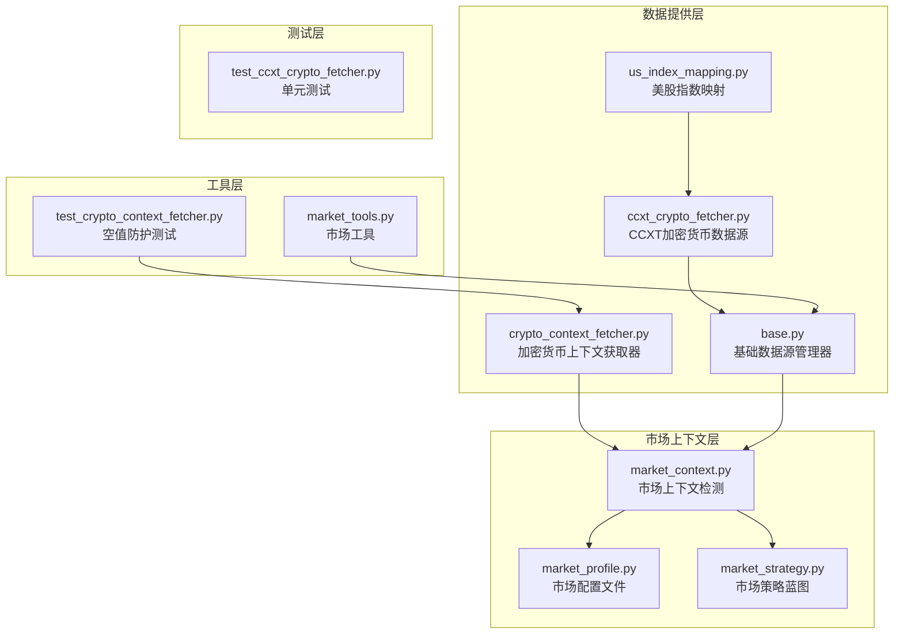
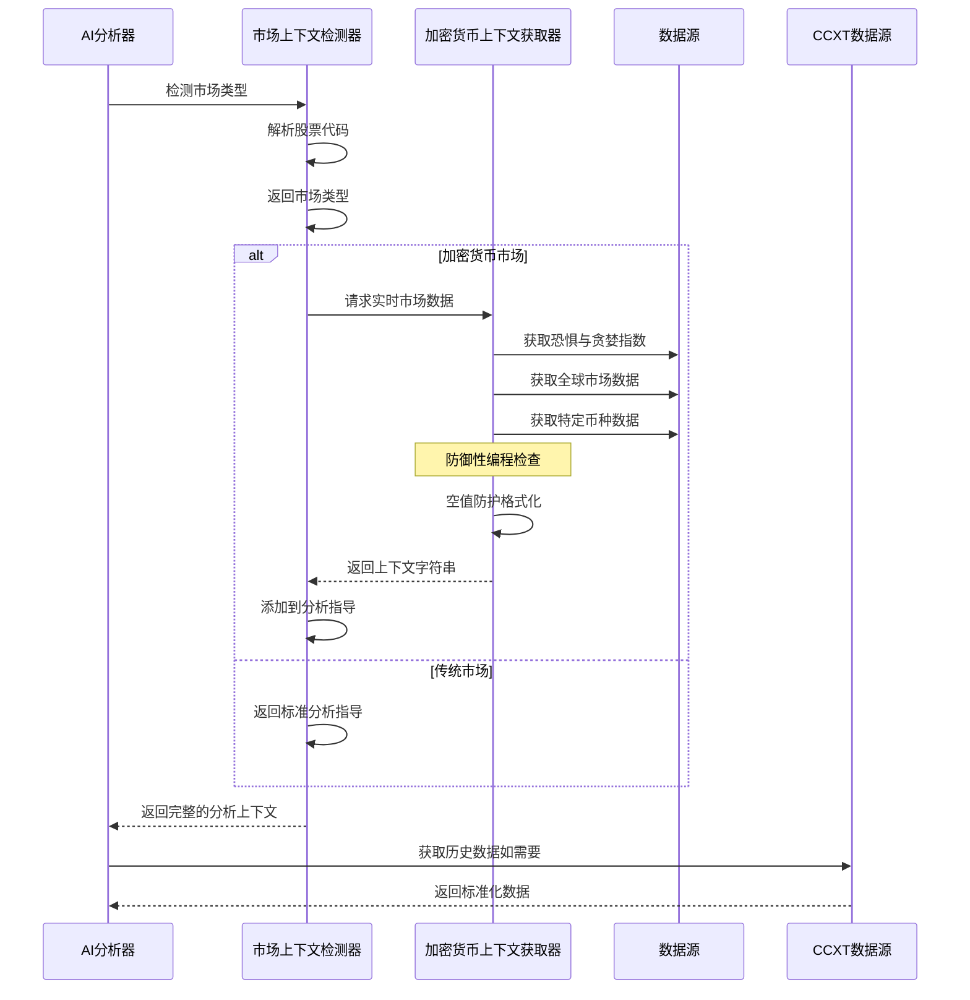
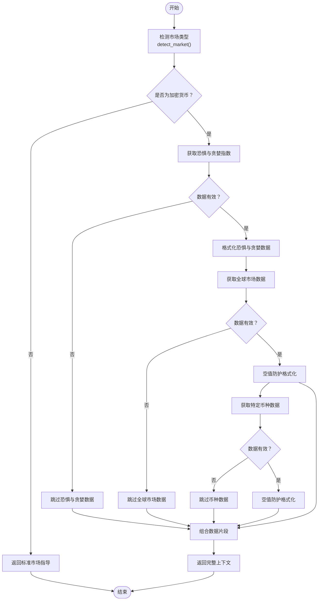
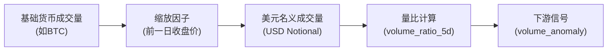
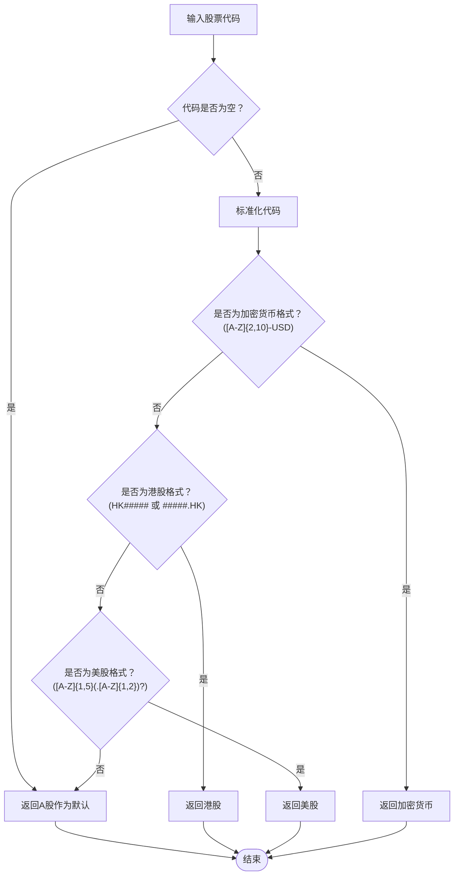
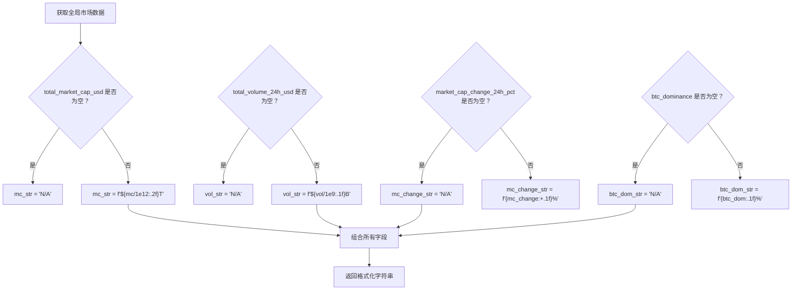
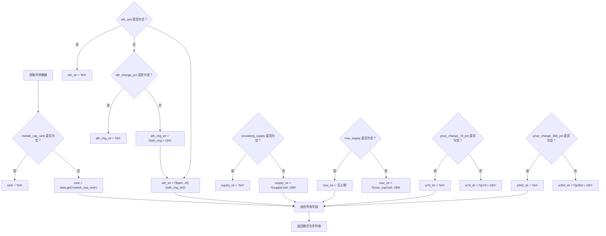
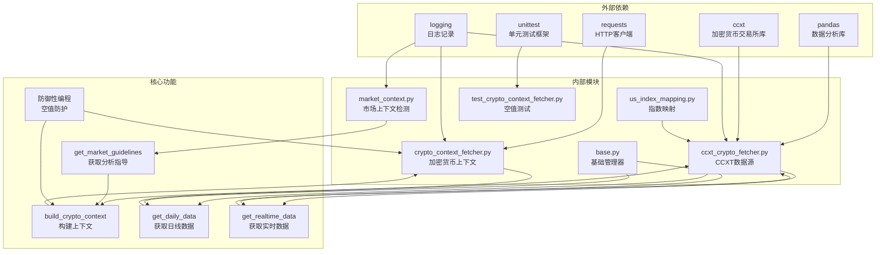

# 加密货币市场上下文获取器

<cite>
**本文档引用的文件**
- [crypto_context_fetcher.py](file://data_provider/crypto_context_fetcher.py)
- [ccxt_crypto_fetcher.py](file://data_provider/ccxt_crypto_fetcher.py)
- [market_context.py](file://src/market_context.py)
- [base.py](file://data_provider/base.py)
- [us_index_mapping.py](file://data_provider/us_index_mapping.py)
- [market_profile.py](file://src/core/market_profile.py)
- [market_strategy.py](file://src/core/market_strategy.py)
- [market_tools.py](file://src/agent/tools/market_tools.py)
- [test_ccxt_crypto_fetcher.py](file://tests/test_ccxt_crypto_fetcher.py)
- [test_crypto_context_fetcher.py](file://tests/test_crypto_context_fetcher.py)
</cite>

## 更新摘要
**变更内容**
- 增强了加密货币上下文构建器的防御性编程能力
- 改进了对CoinGecko端点空值的处理机制
- 提高了系统的稳定性和容错能力
- 新增了针对空值字段的防护性格式化逻辑

## 目录
1. [简介](#简介)
2. [项目结构](#项目结构)
3. [核心组件](#核心组件)
4. [架构概览](#架构概览)
5. [详细组件分析](#详细组件分析)
6. [防御性编程改进](#防御性编程改进)
7. [依赖关系分析](#依赖关系分析)
8. [性能考虑](#性能考虑)
9. [故障排除指南](#故障排除指南)
10. [结论](#结论)

## 简介

加密货币市场上下文获取器是一个专门设计用于为AI分析管道提供加密货币市场实时数据的系统组件。该系统集成了多个数据源，包括恐惧与贪婪指数、全球加密货币市场数据和特定加密货币的详细信息，为AI模型提供丰富的市场背景信息。

该系统的核心目标是：
- 为AI分析提供实时的加密货币市场上下文
- 支持多语言（中英文）输出
- 提供优雅的降级机制，确保即使数据源失败也不会影响整体分析流程
- 与其他数据源（如传统股票市场）无缝集成
- **新增**：具备强大的防御性编程能力，能够处理各种异常情况和空值

## 项目结构

该项目采用模块化架构，主要分为以下几个核心模块：

**图表来源**
- [crypto_context_fetcher.py:1-217](file://data_provider/crypto_context_fetcher.py#L1-L217)
- [ccxt_crypto_fetcher.py:1-275](file://data_provider/ccxt_crypto_fetcher.py#L1-L275)
- [market_context.py:1-166](file://src/market_context.py#L1-L166)

**章节来源**
- [crypto_context_fetcher.py:1-217](file://data_provider/crypto_context_fetcher.py#L1-L217)
- [ccxt_crypto_fetcher.py:1-275](file://data_provider/ccxt_crypto_fetcher.py#L1-L275)
- [market_context.py:1-166](file://src/market_context.py#L1-L166)

## 核心组件

### 加密货币上下文获取器

加密货币上下文获取器是整个系统的核心组件，负责从多个数据源获取实时市场数据并格式化为AI分析所需的上下文信息。

主要功能包括：
- 获取恐惧与贪婪指数（Fear & Greed Index）
- 获取全球加密货币市场概览数据
- 获取特定加密货币的详细市场数据
- 将数据格式化为多语言字符串
- **新增**：实施全面的空值防护机制，确保任何字段缺失都不会导致系统崩溃

### CCXT加密货币数据源

CCXT（CryptoCurrency eXchange Trading Library）数据源提供了直接连接加密货币交易所的能力，支持100多个交易所的统一接口。

关键特性：
- 直连交易所原始数据，质量优于聚合数据源
- 支持OHLCV K线图和实时价格
- 支持多种加密货币对（BTC/USD, ETH/USD等）
- 实现了智能的体积归一化算法
- **新增**：完善的错误处理和降级机制

### 市场上下文检测器

市场上下文检测器负责根据股票代码自动识别市场类型（A股、港股、美股、加密货币），并提供相应的分析指导。

支持的市场类型：
- **A股**：中国沪深交易所上市股票
- **港股**：香港交易所上市股票  
- **美股**：美国交易所上市股票
- **加密货币**：去中心化数字资产

**章节来源**
- [crypto_context_fetcher.py:22-217](file://data_provider/crypto_context_fetcher.py#L22-L217)
- [ccxt_crypto_fetcher.py:53-275](file://data_provider/ccxt_crypto_fetcher.py#L53-L275)
- [market_context.py:16-166](file://src/market_context.py#L16-L166)

## 架构概览

系统采用分层架构设计，确保各个组件之间的松耦合和高内聚：

**图表来源**
- [market_context.py:147-166](file://src/market_context.py#L147-L166)
- [crypto_context_fetcher.py:147-217](file://data_provider/crypto_context_fetcher.py#L147-L217)
- [ccxt_crypto_fetcher.py:86-275](file://data_provider/ccxt_crypto_fetcher.py#L86-L275)

## 详细组件分析

### 加密货币上下文获取器详细分析

#### 数据获取流程

**图表来源**
- [market_context.py:16-48](file://src/market_context.py#L16-L48)
- [crypto_context_fetcher.py:147-217](file://data_provider/crypto_context_fetcher.py#L147-L217)

#### 数据源集成

系统集成了两个主要的数据源：

1. **Alternative.me** - 提供恐惧与贪婪指数
   - 免费API，无需API密钥
   - 提供全球加密货币市场情绪指标
   - 更新频率：实时

2. **CoinGecko** - 提供全面的加密货币数据
   - 免费层级，30次请求/分钟限制
   - 提供全球市场概览和单个币种详情
   - 支持1000+种加密货币
   - **新增**：具备空值防护机制，能够优雅处理部分字段缺失的情况

#### 数据格式化

系统将获取的数据格式化为用户友好的字符串，包含：
- 恐惧与贪婪指数值和分类
- 全球市场总市值和成交量
- BTC主导地位百分比
- 特定币种的市值排名、ATH（历史最高价）等关键指标
- **新增**：所有数值字段都经过空值防护处理，缺失值显示为"N/A"

**章节来源**
- [crypto_context_fetcher.py:147-217](file://data_provider/crypto_context_fetcher.py#L147-L217)

### CCXT加密货币数据源详细分析

#### 体积归一化算法

CCXT数据源实现了复杂的体积归一化算法，确保与传统数据源的兼容性：

**图表来源**
- [ccxt_crypto_fetcher.py:141-176](file://data_provider/ccxt_crypto_fetcher.py#L141-L176)

#### 实时数据获取

实时数据获取遵循以下优先级：
1. 首选交易所提供的`quoteVolume`（美元名义成交量）
2. 如果不存在，则使用`baseVolume * last`（基础成交量 × 最新价格）

#### 错误处理和降级

系统实现了多层次的错误处理：
- 单个数据源失败不影响整体功能
- 自动降级到备用数据源
- 优雅的降级机制确保分析流程不受影响
- **新增**：完善的异常捕获和日志记录机制

**章节来源**
- [ccxt_crypto_fetcher.py:53-275](file://data_provider/ccxt_crypto_fetcher.py#L53-L275)
- [test_ccxt_crypto_fetcher.py:1-402](file://tests/test_ccxt_crypto_fetcher.py#L1-L402)

### 市场上下文检测器详细分析

#### 市场识别逻辑

#### 多语言支持

系统支持中英文双语输出，包括：
- 市场角色描述
- 分析指导原则
- 实时市场数据标签

**章节来源**
- [market_context.py:119-166](file://src/market_context.py#L119-L166)

## 防御性编程改进

### CoinGecko空值防护机制

**更新** 系统已增强防御性编程能力，特别针对CoinGecko端点可能出现的空值情况进行处理。

#### 全局市场数据空值防护

**图表来源**
- [crypto_context_fetcher.py:173-183](file://data_provider/crypto_context_fetcher.py#L173-L183)

#### 币种数据空值防护

**图表来源**
- [crypto_context_fetcher.py:185-214](file://data_provider/crypto_context_fetcher.py#L185-L214)

#### 完整的空值防护策略

系统实施了以下空值防护策略：

1. **字段级防护**：每个可能为空的字段都有对应的空值检查
2. **优雅降级**：当某个字段为空时，显示"N/A"而不是抛出异常
3. **类型安全**：所有格式化操作都包含类型检查
4. **异常捕获**：所有网络请求都包含异常捕获和日志记录

**章节来源**
- [crypto_context_fetcher.py:173-214](file://data_provider/crypto_context_fetcher.py#L173-L214)
- [test_crypto_context_fetcher.py:57-114](file://tests/test_crypto_context_fetcher.py#L57-L114)

## 依赖关系分析

系统的关键依赖关系如下：

**图表来源**
- [crypto_context_fetcher.py:12-16](file://data_provider/crypto_context_fetcher.py#L12-L16)
- [ccxt_crypto_fetcher.py:15-25](file://data_provider/ccxt_crypto_fetcher.py#L15-L25)
- [market_context.py:12-14](file://src/market_context.py#L12-L14)

**章节来源**
- [base.py:1-200](file://data_provider/base.py#L1-L200)
- [us_index_mapping.py:1-143](file://data_provider/us_index_mapping.py#L1-L143)

## 性能考虑

### 数据获取优化

1. **超时控制**：所有HTTP请求设置10秒超时，防止阻塞
2. **智能重试**：实现指数退避重试机制
3. **并发控制**：使用线程锁确保线程安全
4. **缓存策略**：实现基础的数据缓存机制
5. ****新增**：空值防护减少了不必要的异常处理开销

### 内存管理

1. **批量处理**：支持批量数据获取，减少内存占用
2. **数据类型优化**：使用适当的数据类型减少内存使用
3. **及时释放**：实现资源清理机制
4. ****新增**：防御性编程减少了异常堆栈的创建和销毁**

### 网络优化

1. **连接复用**：复用HTTP连接减少建立开销
2. **压缩传输**：支持gzip压缩减少带宽使用
3. **错误快速失败**：网络错误时快速失败避免资源浪费
4. ****新增**：空值防护减少了无效的网络请求重试**

## 故障排除指南

### 常见问题及解决方案

#### 数据获取失败

**症状**：加密货币数据无法获取
**可能原因**：
- API限流（CoinGecko 30次/分钟限制）
- 网络连接问题
- API接口变更
- **新增**：CoinGecko端点返回空值

**解决方案**：
1. 检查网络连接状态
2. 实现指数退避重试
3. 使用备用数据源
4. 增加请求间隔
5. **新增**：利用空值防护机制优雅处理部分字段缺失

#### 数据格式错误

**症状**：解析API响应失败
**可能原因**：
- API响应格式变更
- 空响应或错误响应
- **新增**：部分字段为空值

**解决方案**：
1. 实施健壮的错误处理
2. 添加数据验证步骤
3. 实现优雅降级
4. **新增**：使用空值防护格式化函数

#### 性能问题

**症状**：数据获取速度慢
**可能原因**：
- 网络延迟
- API响应慢
- 本地处理瓶颈
- **新增**：异常处理开销过大

**解决方案**：
1. 实现异步数据获取
2. 添加本地缓存
3. 优化数据处理算法
4. **新增**：减少异常处理次数

#### 空值处理问题

**症状**：系统在处理空值时崩溃
**可能原因**：
- 旧版本代码没有空值检查
- 格式化函数不支持None值
- 缺少异常捕获机制

**解决方案**：
1. 使用新的空值防护格式化函数
2. 确保所有字段都有空值检查
3. 实现完整的异常捕获和日志记录
4. **新增**：运行空值防护测试确保功能正常

**章节来源**
- [test_ccxt_crypto_fetcher.py:1-402](file://tests/test_ccxt_crypto_fetcher.py#L1-L402)
- [test_crypto_context_fetcher.py:1-119](file://tests/test_crypto_context_fetcher.py#L1-L119)

## 结论

加密货币市场上下文获取器是一个设计精良且高度健壮的系统组件，具有以下优势：

1. **模块化设计**：清晰的分层架构便于维护和扩展
2. **多数据源集成**：提供可靠的数据冗余和备份
3. **优雅降级**：确保系统稳定性
4. **国际化支持**：支持中英文双语输出
5. **性能优化**：实现多种性能优化策略
6. ****新增**：强大的防御性编程能力，能够处理各种异常情况**
7. ****新增**：完善的空值防护机制，确保系统在任何情况下都能正常运行**
8. ****新增**：经过充分测试的空值处理逻辑，保证数据质量和用户体验**

该系统为AI分析提供了丰富的加密货币市场上下文信息，是现代量化分析平台的重要组成部分。通过持续的优化和扩展，特别是增强的防御性编程能力，该系统能够适应不断变化的市场需求和技术环境，为用户提供更加稳定和可靠的加密货币市场分析服务。