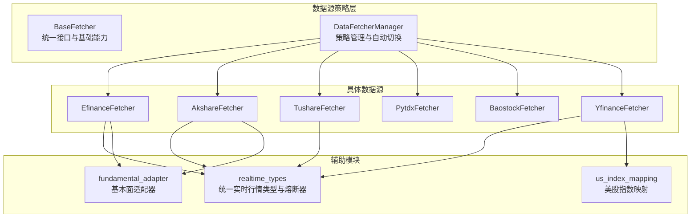
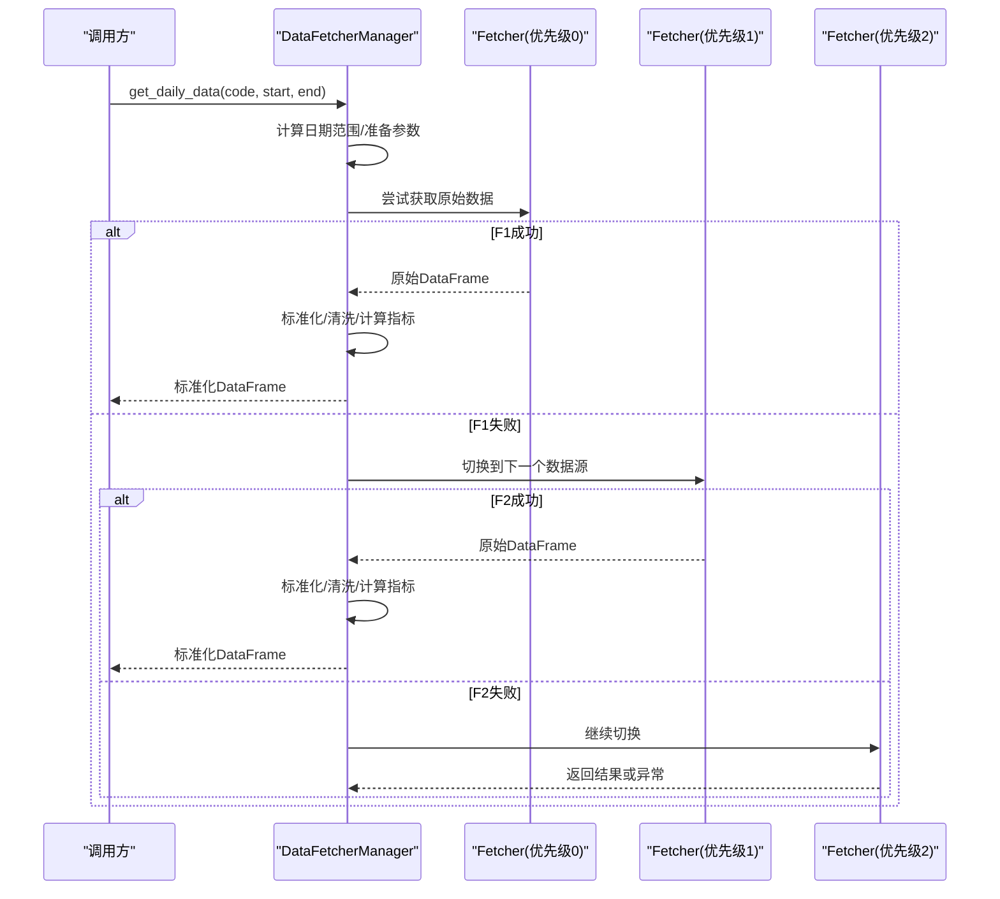
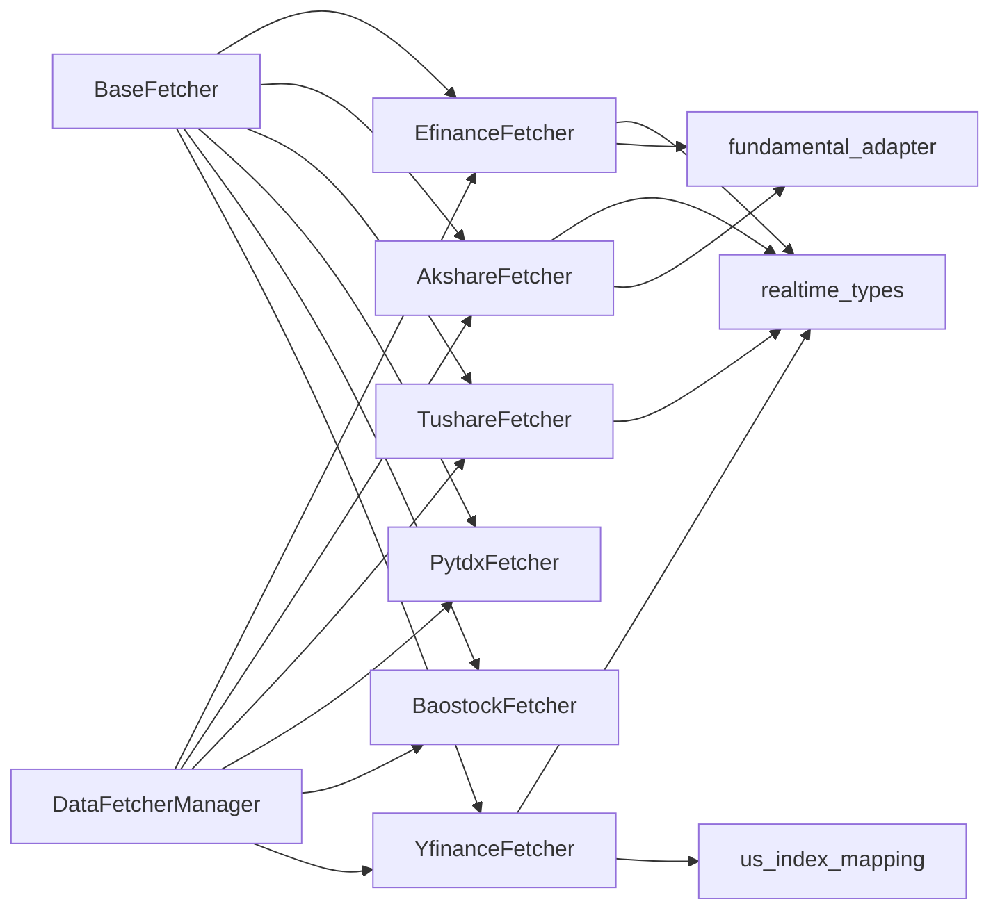
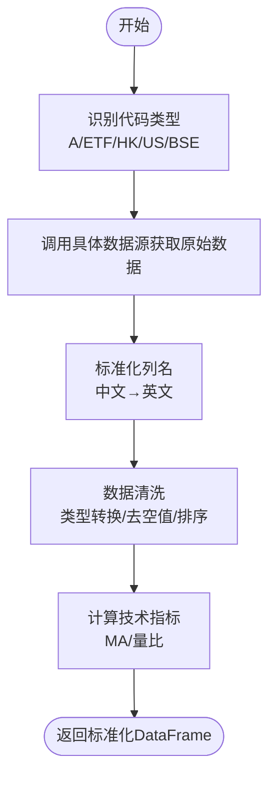

# 数据源实现

<cite>
**本文档引用的文件**
- [data_provider/__init__.py](file://data_provider/__init__.py)
- [data_provider/base.py](file://data_provider/base.py)
- [data_provider/efinance_fetcher.py](file://data_provider/efinance_fetcher.py)
- [data_provider/akshare_fetcher.py](file://data_provider/akshare_fetcher.py)
- [data_provider/tushare_fetcher.py](file://data_provider/tushare_fetcher.py)
- [data_provider/pytdx_fetcher.py](file://data_provider/pytdx_fetcher.py)
- [data_provider/baostock_fetcher.py](file://data_provider/baostock_fetcher.py)
- [data_provider/yfinance_fetcher.py](file://data_provider/yfinance_fetcher.py)
- [data_provider/realtime_types.py](file://data_provider/realtime_types.py)
- [data_provider/us_index_mapping.py](file://data_provider/us_index_mapping.py)
- [data_provider/fundamental_adapter.py](file://data_provider/fundamental_adapter.py)
</cite>

## 目录
1. [简介](#简介)
2. [项目结构](#项目结构)
3. [核心组件](#核心组件)
4. [架构概览](#架构概览)
5. [详细组件分析](#详细组件分析)
6. [依赖分析](#依赖分析)
7. [性能考虑](#性能考虑)
8. [故障排查指南](#故障排查指南)
9. [结论](#结论)
10. [附录](#附录)

## 简介
本文件面向开发者与运维人员，系统化梳理本项目中的数据源实现，涵盖以下方面：
- 各数据源的接入方式、认证机制与数据获取流程
- 防封禁策略、API 限制与请求频率控制
- 数据格式标准化与错误处理机制
- 配置参数、使用示例与性能对比
- 数据源选择策略与适用场景
- 扩展新数据源的实现指南与最佳实践

## 项目结构
数据源相关代码集中在 data_provider 包中，采用策略模式（Strategy Pattern）组织，统一抽象与管理多个数据源，实现自动故障切换与防封禁流控。

图示来源
- [data_provider/base.py](file://data_provider/base.py)
- [data_provider/__init__.py](file://data_provider/__init__.py)
- [data_provider/efinance_fetcher.py](file://data_provider/efinance_fetcher.py)
- [data_provider/akshare_fetcher.py](file://data_provider/akshare_fetcher.py)
- [data_provider/tushare_fetcher.py](file://data_provider/tushare_fetcher.py)
- [data_provider/pytdx_fetcher.py](file://data_provider/pytdx_fetcher.py)
- [data_provider/baostock_fetcher.py](file://data_provider/baostock_fetcher.py)
- [data_provider/yfinance_fetcher.py](file://data_provider/yfinance_fetcher.py)
- [data_provider/realtime_types.py](file://data_provider/realtime_types.py)
- [data_provider/us_index_mapping.py](file://data_provider/us_index_mapping.py)
- [data_provider/fundamental_adapter.py](file://data_provider/fundamental_adapter.py)

章节来源
- [data_provider/__init__.py](file://data_provider/__init__.py)
- [data_provider/base.py](file://data_provider/base.py)

## 核心组件
- BaseFetcher：定义统一接口（获取原始数据、标准化、清洗、指标计算、随机休眠等），并提供通用错误处理与日志记录。
- DataFetcherManager：策略管理器，负责按优先级管理数据源、自动故障切换、指数退避重试与熔断器协同。
- 实时行情统一类型与熔断器：统一各数据源返回结构，实现熔断/冷却机制，避免连续失败反复请求。
- 美股指数映射：将用户输入的美股指数代码映射到 Yahoo Finance 符号。
- 基本面适配器：对 AkShare 多候选接口进行探测式调用，失败开放策略，输出标准化的基本面/资金流/龙虎榜信号。

章节来源
- [data_provider/base.py](file://data_provider/base.py)
- [data_provider/realtime_types.py](file://data_provider/realtime_types.py)
- [data_provider/us_index_mapping.py](file://data_provider/us_index_mapping.py)
- [data_provider/fundamental_adapter.py](file://data_provider/fundamental_adapter.py)

## 架构概览
数据获取主流程：调用 DataFetcherManager.get_daily_data，内部按优先级依次尝试各数据源，失败自动切换，最终标准化输出统一格式的 DataFrame，并计算 MA5/MA10/MA20、量比等指标。

图示来源
- [data_provider/base.py](file://data_provider/base.py)
- [data_provider/__init__.py](file://data_provider/__init__.py)

## 详细组件分析

### EfinanceFetcher（优先数据源，优先级0）
- 数据来源：东方财富（efinance 库封装），支持批量获取，API 简洁稳定。
- 防封禁策略：随机 User-Agent、速率限制（随机休眠 1.5–3.0s）、tenacity 指数退避重试、熔断器冷却。
- 数据获取流程：根据代码类型（股票/ETF/美股）选择不同接口；历史数据通过 get_quote_history；实时行情通过 get_realtime_quotes，支持缓存与熔断。
- 标准化：将中文列名映射为标准英文列名，缺失字段填充默认值。
- 限制与注意：美股不支持；北交所不支持；实时行情有缓存 TTL（10分钟）。

章节来源
- [data_provider/efinance_fetcher.py](file://data_provider/efinance_fetcher.py)
- [data_provider/realtime_types.py](file://data_provider/realtime_types.py)

### AkshareFetcher（主数据源，优先级1）
- 数据来源：akshare 库（东方财富/新浪财经/腾讯财经），免费、无需 Token、数据全面。
- 防封禁策略：随机 UA、速率限制（2.0–5.0s 随机休眠）、tenacity 指数退避、熔断器、akshare 补丁启用。
- 数据获取流程：自动识别美股/港股/ETF/A 股，分别调用 ak.stock_zh_a_hist、ak.stock_hk_hist、ak.fund_etf_hist_em 等；美股数据由 YfinanceFetcher 处理以确保复权一致性。
- 标准化：中文列名映射为标准列名，计算涨跌幅与成交额（若缺失）。
- 限制与注意：反爬严格，可能触发限流；美股复权问题由 YfinanceFetcher 接管。

章节来源
- [data_provider/akshare_fetcher.py](file://data_provider/akshare_fetcher.py)
- [data_provider/realtime_types.py](file://data_provider/realtime_types.py)

### TushareFetcher（备用数据源1，优先级2）
- 数据来源：Tushare Pro API（挖地兔），需要 Token，有配额限制（免费用户 80 次/分钟、500 次/天）。
- 流控策略：每分钟调用计数器，超限强制等待至下一分钟；tenacity 指数退避重试。
- 数据获取流程：根据代码类型选择 daily 或 fund_daily；港股/美股不支持；自动转换代码格式（.SH/.SZ/.BJ）。
- 标准化：列名映射、单位转换（手/千元→股/元）、日期格式转换。
- 限制与注意：配额超限会抛出 RateLimitError；实时行情优先尝试 Pro 接口，失败降级到旧版接口。

章节来源
- [data_provider/tushare_fetcher.py](file://data_provider/tushare_fetcher.py)

### PytdxFetcher（通达信数据源，优先级2）
- 数据来源：通达信行情服务器（pytdx 库），免费、直连、实时稳定。
- 防封禁策略：多服务器自动切换、连接超时自动重连、tenacity 指数退避重试。
- 数据获取流程：自动选择最优服务器，使用 get_security_bars 获取日线；不支持美股/港股/北交所。
- 标准化：列名映射、计算涨跌幅、保留必要列。
- 限制与注意：仅支持上交所/深交所股票；实时行情通过 get_security_quotes 获取。

章节来源
- [data_provider/pytdx_fetcher.py](file://data_provider/pytdx_fetcher.py)

### BaostockFetcher（备用数据源2，优先级3）
- 数据来源：证券宝 Baostock，免费、无需 Token，需登录/登出。
- 防封禁策略：上下文管理器确保连接生命周期，每次请求重新登录/登出；tenacity 指数退避重试。
- 数据获取流程：query_history_k_data_plus 获取日线；不支持美股/港股/北交所。
- 标准化：列名映射（pctChg→pct_chg）、数值类型转换、保留必要列。
- 限制与注意：数据更新略有延迟（T+1）。

章节来源
- [data_provider/baostock_fetcher.py](file://data_provider/baostock_fetcher.py)

### YfinanceFetcher（兜底数据源，优先级4）
- 数据来源：Yahoo Finance（yfinance 库），国际数据源，可能有延迟或缺失。
- 防封禁策略：自动代码格式转换（.SS/.SZ/.HK），处理 MultiIndex 列名，tenacity 指数退避重试。
- 数据获取流程：自动识别美股/美股指数/港股/A 股，分别转换为 yfinance 格式；美股指数通过映射到 ^ 前缀符号；美股股票实时行情优先 fast_info，失败回退到 history；美股股票实时行情失败时使用 Stooq 兜底。
- 标准化：列名映射、MultiIndex 扁平化、计算涨跌幅与成交额（估算）。
- 限制与注意：A 股数据可能有延迟；某些股票无数据；数据精度与国内源略有差异。

章节来源
- [data_provider/yfinance_fetcher.py](file://data_provider/yfinance_fetcher.py)
- [data_provider/us_index_mapping.py](file://data_provider/us_index_mapping.py)
- [data_provider/realtime_types.py](file://data_provider/realtime_types.py)

### 统一实时行情类型与熔断器
- 统一类型：UnifiedRealtimeQuote，统一各数据源返回结构，包含价格、涨跌幅、成交量、估值指标等字段，便于主流程兼容。
- 熔断器：CircuitBreaker，实现 CLOSED/OPEN/HALF_OPEN 状态机，连续失败后熔断，冷却时间后半开试探，成功则恢复，失败则继续熔断。
- 使用：各 Fetcher 的 get_realtime_quote 返回统一类型；熔断器按数据源维度独立管理。

章节来源
- [data_provider/realtime_types.py](file://data_provider/realtime_types.py)

### 美股指数映射
- 功能：将用户输入的美股指数代码（如 SPX、DJI、IXIC 等）映射到 Yahoo Finance 符号（^GSPC、^DJI、^IXIC 等），并提供美股股票代码识别。
- 用途：YfinanceFetcher 在获取美股指数实时行情时使用该映射。

章节来源
- [data_provider/us_index_mapping.py](file://data_provider/us_index_mapping.py)

### 基本面适配器（AkShare）
- 功能：对 AkShare 多候选接口进行探测式调用，失败开放策略，输出标准化的基本面/资金流/龙虎榜信号。
- 输出：包含增长指标、盈利摘要、预测摘要、现金分红、机构持股变化、板块资金流向、近期龙虎榜信号等，支持部分数据返回。
- 用途：DataFetcherManager 内部用于增强基本面缓存与信号提取。

章节来源
- [data_provider/fundamental_adapter.py](file://data_provider/fundamental_adapter.py)

## 依赖分析
- 组件耦合与内聚
  - BaseFetcher 与各具体 Fetcher：强内聚，遵循统一接口；低耦合，通过策略管理器组合。
  - DataFetcherManager：对具体 Fetcher 仅依赖优先级与统一接口，解耦于具体实现细节。
  - 实时行情与熔断器：通过统一类型与熔断器实例解耦，便于扩展新数据源。
  - 美股指数映射与基本面适配器：作为独立模块，被 YfinanceFetcher 与 DataFetcherManager 使用，降低耦合。
- 外部依赖
  - akshare、tushare、pytdx、baostock、yfinance 等第三方库。
  - tenacity 实现指数退避重试；pandas/numpy 进行数据处理；requests/urllib 用于网络请求。
- 潜在循环依赖
  - 未发现循环依赖；模块间为单向依赖（Fetcher → 基础设施模块）。

图示来源
- [data_provider/base.py](file://data_provider/base.py)
- [data_provider/__init__.py](file://data_provider/__init__.py)
- [data_provider/efinance_fetcher.py](file://data_provider/efinance_fetcher.py)
- [data_provider/akshare_fetcher.py](file://data_provider/akshare_fetcher.py)
- [data_provider/tushare_fetcher.py](file://data_provider/tushare_fetcher.py)
- [data_provider/pytdx_fetcher.py](file://data_provider/pytdx_fetcher.py)
- [data_provider/baostock_fetcher.py](file://data_provider/baostock_fetcher.py)
- [data_provider/yfinance_fetcher.py](file://data_provider/yfinance_fetcher.py)
- [data_provider/realtime_types.py](file://data_provider/realtime_types.py)
- [data_provider/us_index_mapping.py](file://data_provider/us_index_mapping.py)
- [data_provider/fundamental_adapter.py](file://data_provider/fundamental_adapter.py)

## 性能考虑
- 请求频率控制
  - 各 Fetcher 内置随机休眠（1.5–5.0s），避免触发反爬机制。
  - TushareFetcher 实现每分钟调用计数器，超限强制等待。
  - PytdxFetcher 自动选择最优服务器，减少连接失败重试。
- 数据缓存
  - EfinanceFetcher 与 AkshareFetcher 对实时行情设置缓存 TTL（10–20分钟），降低重复请求与封禁风险。
- 指标计算
  - BaseFetcher 在标准化后计算 MA5/MA10/MA20、量比等指标，避免重复计算与数据不一致。
- 熔断器
  - 实时行情熔断器（冷却5分钟）与筹码接口熔断器（冷却10分钟）降低系统在异常状态下的压力。
- 网络与解析
  - 使用 tenacity 指数退避重试，避免瞬时网络抖动导致的失败放大。
  - YfinanceFetcher 处理 MultiIndex 列名与数据格式差异，减少二次解析成本。

## 故障排查指南
- 常见异常类型
  - DataFetchError：数据获取异常（如空数据、网络错误）。
  - RateLimitError：API 速率限制（如 Tushare 配额超限、Akshare/efinance 反爬）。
  - DataSourceUnavailableError：数据源不可用（如 pytdx 未安装、Token 未配置）。
- 日志与追踪
  - BaseFetcher.get_daily_data 记录请求耗时、返回行数与错误摘要；统一异常信息通过 summarize_exception 提取根因。
  - DataFetcherManager 记录各数据源失败原因与优先级信息，便于定位问题。
- 熔断器状态
  - 实时行情熔断器状态可通过 get_status 获取，确认是否处于熔断/半开状态。
- 配置检查
  - TushareFetcher 需要配置 TUSHARE_TOKEN；pytdx 需要 PYTDX_SERVERS 或 PYTDX_HOST/PYTDX_PORT；akshare/efinance 可通过环境变量启用补丁。
- 快速验证
  - 使用最小化代码路径调用 get_daily_data，逐步缩小问题范围（如仅使用某数据源）。

章节来源
- [data_provider/base.py](file://data_provider/base.py)
- [data_provider/realtime_types.py](file://data_provider/realtime_types.py)
- [data_provider/tushare_fetcher.py](file://data_provider/tushare_fetcher.py)
- [data_provider/akshare_fetcher.py](file://data_provider/akshare_fetcher.py)
- [data_provider/efinance_fetcher.py](file://data_provider/efinance_fetcher.py)
- [data_provider/pytdx_fetcher.py](file://data_provider/pytdx_fetcher.py)
- [data_provider/baostock_fetcher.py](file://data_provider/baostock_fetcher.py)
- [data_provider/yfinance_fetcher.py](file://data_provider/yfinance_fetcher.py)

## 结论
本项目通过策略模式将多个异构数据源整合为统一接口，结合防封禁策略、指数退避重试与熔断器机制，在稳定性与可用性上取得平衡。各数据源各有优劣：EfinanceFetcher 与 AkshareFetcher 数据全面但易被反爬；TushareFetcher 数据质量高但受配额限制；PytdxFetcher 实时性强但覆盖有限；BaostockFetcher 稳定但更新略有延迟；YfinanceFetcher 作为兜底保障国际数据。实际部署中建议优先启用 EfinanceFetcher/AkshareFetcher，配合 TushareFetcher 作为高质量补充，并在高峰期启用熔断器与缓存策略。

## 附录

### 数据源特性与限制对比
- EfinanceFetcher
  - 优点：API 简洁、批量获取、稳定性好
  - 局限：美股/北交所不支持；需防封禁策略
- AkshareFetcher
  - 优点：数据全面、免费
  - 局限：反爬严格、美股复权问题由 YfinanceFetcher 接管
- TushareFetcher
  - 优点：数据质量高、接口稳定
  - 局限：需 Token、配额限制（80次/分钟）
- PytdxFetcher
  - 优点：实时性强、无配额限制
  - 局限：仅支持 A 股，不支持美股/港股/北交所
- BaostockFetcher
  - 优点：稳定、无配额限制
  - 局限：更新略有延迟（T+1），不支持美股/港股/北交所
- YfinanceFetcher
  - 优点：兜底保障国际数据
  - 局限：A 股可能有延迟、部分股票无数据

### 配置参数与使用示例
- 环境变量
  - TUSHARE_TOKEN：启用 TushareFetcher 并提升优先级
  - PYTDX_SERVERS/PYTDX_HOST/PYTDX_PORT：配置通达信服务器
  - EFINANCE_CALL_TIMEOUT：efinance 调用超时（秒）
  - AKSHARE_PRIORITY/EFINANCE_PRIORITY/TUSHARE_PRIORITY/PYTDX_PRIORITY/BAOSTOCK_PRIORITY/YFINANCE_PRIORITY：覆盖默认优先级
- 使用示例（路径参考）
  - 获取日线数据：[data_provider/base.py](file://data_provider/base.py)
  - 获取实时行情（统一类型）：[data_provider/realtime_types.py](file://data_provider/realtime_types.py)
  - 美股指数映射：[data_provider/us_index_mapping.py](file://data_provider/us_index_mapping.py)
  - 基本面适配：[data_provider/fundamental_adapter.py](file://data_provider/fundamental_adapter.py)

### 数据格式标准化流程

图示来源
- [data_provider/base.py](file://data_provider/base.py)

### 扩展新数据源实现指南
- 实现步骤
  - 继承 BaseFetcher，实现 _fetch_raw_data 与 _normalize_data。
  - 在 __init__ 中设置 name/priority，并实现必要的速率限制与防封禁策略。
  - 如需实时行情，返回 UnifiedRealtimeQuote，并在熔断器下使用。
  - 在 data_provider/__init__.py 中注册新数据源，并在 DataFetcherManager 初始化时纳入优先级队列。
- 最佳实践
  - 统一日志格式与异常类型，便于统一追踪。
  - 为实时接口设置缓存与熔断器，避免频繁失败。
  - 对 MultiIndex/多列名场景进行兼容处理，确保下游稳定。
  - 为新数据源编写单元测试，覆盖正常/异常/边界场景。

章节来源
- [data_provider/base.py](file://data_provider/base.py)
- [data_provider/__init__.py](file://data_provider/__init__.py)
- [data_provider/realtime_types.py](file://data_provider/realtime_types.py)