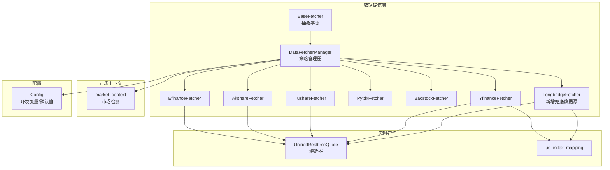
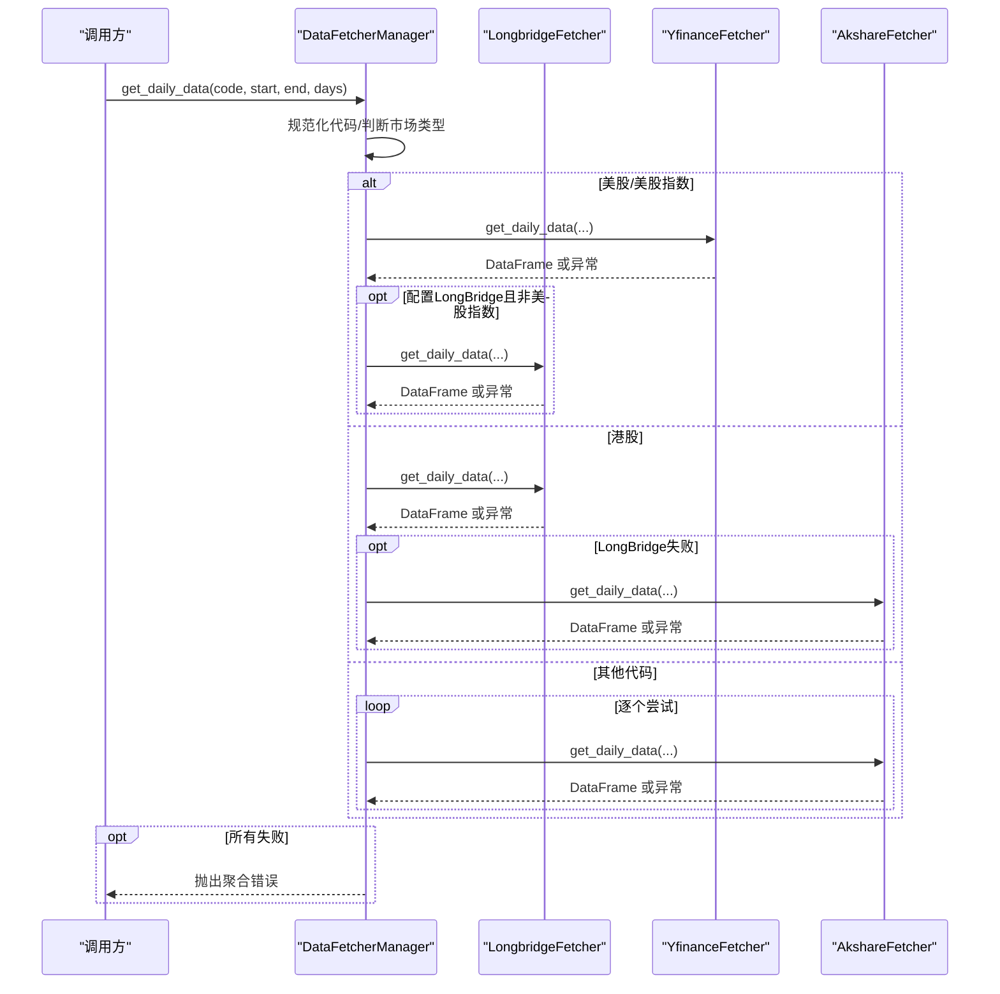
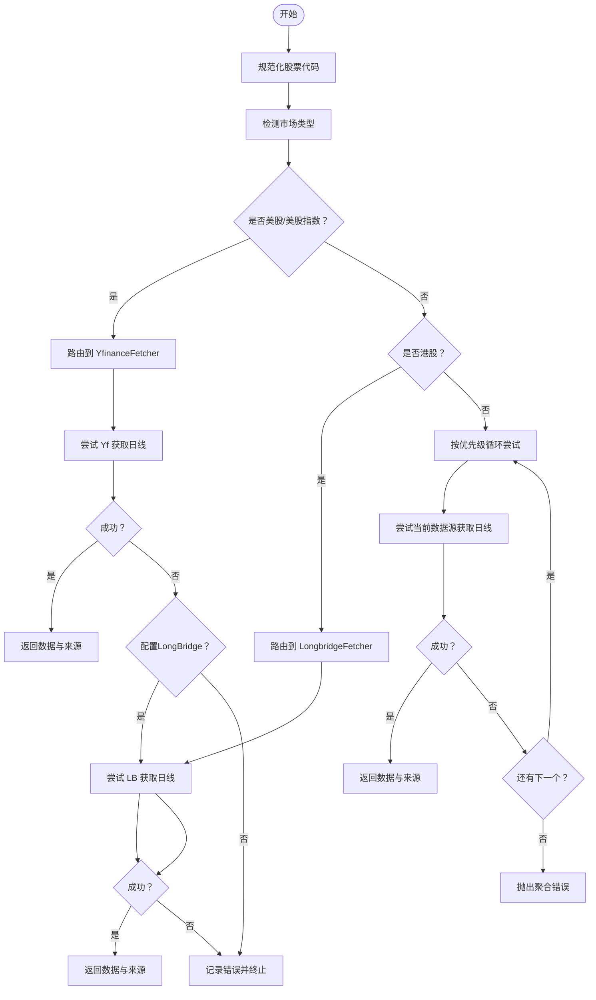
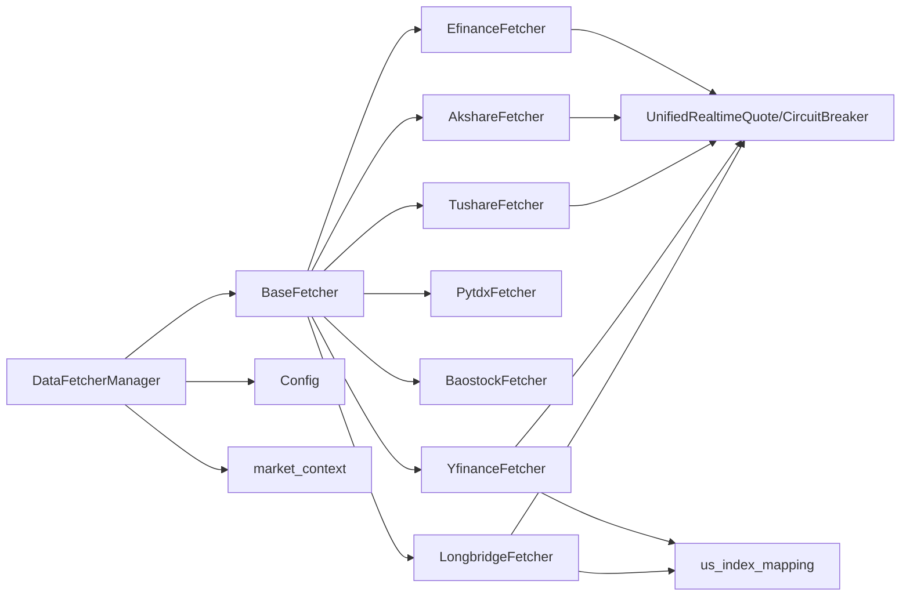

# 数据获取系统

<cite>
**本文档引用的文件**
- [data_provider/base.py](file://data_provider/base.py)
- [data_provider/__init__.py](file://data_provider/__init__.py)
- [data_provider/efinance_fetcher.py](file://data_provider/efinance_fetcher.py)
- [data_provider/akshare_fetcher.py](file://data_provider/akshare_fetcher.py)
- [data_provider/tushare_fetcher.py](file://data_provider/tushare_fetcher.py)
- [data_provider/pytdx_fetcher.py](file://data_provider/pytdx_fetcher.py)
- [data_provider/baostock_fetcher.py](file://data_provider/baostock_fetcher.py)
- [data_provider/yfinance_fetcher.py](file://data_provider/yfinance_fetcher.py)
- [data_provider/longbridge_fetcher.py](file://data_provider/longbridge_fetcher.py)
- [data_provider/realtime_types.py](file://data_provider/realtime_types.py)
- [data_provider/us_index_mapping.py](file://data_provider/us_index_mapping.py)
- [src/config.py](file://src/config.py)
- [src/market_context.py](file://src/market_context.py)
- [tests/test_longbridge_fetcher.py](file://tests/test_longbridge_fetcher.py)
- [tests/longbridge_live_smoke.py](file://tests/longbridge_live_smoke.py)
</cite>

## 目录
1. [简介](#简介)
2. [项目结构](#项目结构)
3. [核心组件](#核心组件)
4. [架构概览](#架构概览)
5. [详细组件分析](#详细组件分析)
6. [依赖分析](#依赖分析)
7. [性能考虑](#性能考虑)
8. [故障排查指南](#故障排查指南)
9. [结论](#结论)
10. [附录](#附录)

## 简介
本系统是一个多数据源数据获取平台，采用策略模式对多个数据源进行统一管理与自动故障切换。系统支持A股、港股、美股及ETF等多种资产类别，提供日线历史数据与实时行情数据的获取、标准化与增强处理。核心特性包括：
- 策略模式驱动的数据源管理与自动切换
- 防封禁流控策略（随机休眠、User-Agent轮换、指数退避重试）
- 实时行情熔断与缓存机制
- 数据标准化与技术指标计算
- 配置驱动的优先级与行为控制
- **新增**：LongBridge数据源集成，提供美股/港股兜底数据源能力
- **增强**：AKShare支持的增强功能与市场上下文检测

## 项目结构
数据获取层位于 data_provider 包，核心文件包括：
- 抽象基类与管理器：base.py
- 数据源实现：efinance_fetcher.py、akshare_fetcher.py、tushare_fetcher.py、pytdx_fetcher.py、baostock_fetcher.py、yfinance_fetcher.py、**longbridge_fetcher.py**
- 实时行情统一类型与熔断机制：realtime_types.py
- 美股指数映射：us_index_mapping.py
- 市场上下文检测：market_context.py
- 配置管理：src/config.py

**图表来源**
- [data_provider/base.py:471-501](file://data_provider/base.py#L471-L501)
- [data_provider/efinance_fetcher.py:236-256](file://data_provider/efinance_fetcher.py#L236-L256)
- [data_provider/akshare_fetcher.py:254-268](file://data_provider/akshare_fetcher.py#L254-L268)
- [data_provider/tushare_fetcher.py:75-93](file://data_provider/tushare_fetcher.py#L75-L93)
- [data_provider/pytdx_fetcher.py:87-107](file://data_provider/pytdx_fetcher.py#L87-L107)
- [data_provider/baostock_fetcher.py:50-69](file://data_provider/baostock_fetcher.py#L50-L69)
- [data_provider/yfinance_fetcher.py:56-75](file://data_provider/yfinance_fetcher.py#L56-L75)
- [data_provider/longbridge_fetcher.py:251-266](file://data_provider/longbridge_fetcher.py#L251-L266)
- [data_provider/realtime_types.py:106-148](file://data_provider/realtime_types.py#L106-L148)
- [data_provider/us_index_mapping.py:20-43](file://data_provider/us_index_mapping.py#L20-L43)
- [src/config.py:31-60](file://src/config.py#L31-L60)
- [src/market_context.py:16-44](file://src/market_context.py#L16-L44)

**章节来源**
- [data_provider/__init__.py:1-59](file://data_provider/__init__.py#L1-L59)

## 核心组件
- 抽象基类 BaseFetcher：定义统一接口（_fetch_raw_data、_normalize_data）、数据清洗、技术指标计算与防封禁策略。
- 策略管理器 DataFetcherManager：按优先级管理多个数据源，实现自动故障切换、批量实时行情预取、熔断与缓存协调，**新增**：支持LongBridge作为美股/港股兜底数据源。
- 实时行情统一类型与熔断：UnifiedRealtimeQuote 统一字段，CircuitBreaker 管理熔断/冷却/半开状态。
- 配置中心：Config 提供环境变量解析、默认值、代理与实时行情相关参数。
- **新增**：LongBridgeFetcher：提供美股/港股数据获取，支持量比、换手率、PE/PB等yfinance缺失字段计算。
- **增强**：市场上下文检测：detect_market函数根据股票代码检测市场类型（A股、港股、美股）。

**章节来源**
- [data_provider/base.py:233-472](file://data_provider/base.py#L233-L472)
- [data_provider/base.py:471-896](file://data_provider/base.py#L471-L896)
- [data_provider/longbridge_fetcher.py:251-698](file://data_provider/longbridge_fetcher.py#L251-L698)
- [src/market_context.py:16-125](file://src/market_context.py#L16-L125)

## 架构概览
系统采用策略模式，DataFetcherManager 作为调度器，按优先级依次尝试各数据源。对于美股/美股指数，直接路由到 YfinanceFetcher；对于实时行情，依据配置的优先级序列尝试不同数据源，并在主源基础上补充缺失字段。**新增**：LongBridge作为兜底数据源，提供美股/港股的量比、换手率、PE/PB等增强数据。

**图表来源**
- [data_provider/base.py:940-998](file://data_provider/base.py#L940-L998)

**章节来源**
- [data_provider/base.py:940-998](file://data_provider/base.py#L940-L998)

## 详细组件分析

### 策略管理器 DataFetcherManager
- 职责：管理多个数据源、自动故障切换、批量实时行情预取、熔断与缓存协调。
- 切换策略：优先使用高优先级数据源，失败后自动切换到下一个，所有失败时抛出详细异常。
- **增强**：美股/美股指数快速路径：直接路由到 YfinanceFetcher，**新增**：LongBridge作为兜底数据源参与美股/港股路由。
- 实时行情：按配置优先级尝试，主源优先，缺失字段从后续源补充。

**图表来源**
- [data_provider/base.py:940-998](file://data_provider/base.py#L940-L998)

**章节来源**
- [data_provider/base.py:471-1038](file://data_provider/base.py#L471-L1038)

### LongbridgeFetcher（新增兜底数据源，优先级5）
- 特点：覆盖美股 + 港股，可计算量比/换手率/PE等yfinance缺失字段，**定位**：美股/港股最后兜底数据源。
- 关键策略：
  1. 组合 quote + static_info 接口计算 turnover_rate / pe_ratio / total_mv
  2. 通过 history_candlesticks 计算 volume_ratio（近5日均量比）
  3. 懒加载 QuoteContext，首次调用时才建立连接
  4. static_info 进程内短缓存，减少重复请求（默认 24h，可调）
- 凭证配置：`LONGBRIDGE_APP_KEY` / `LONGBRIDGE_APP_SECRET` / `LONGBRIDGE_ACCESS_TOKEN`。
- **增强**：支持区域URL映射、语言设置、日志路径配置等高级选项。

**章节来源**
- [data_provider/longbridge_fetcher.py:1-698](file://data_provider/longbridge_fetcher.py#L1-L698)

### EfinanceFetcher（优先数据源，优先级0）
- 特点：免费、无需Token、API简洁、支持批量获取。
- 防封禁策略：随机休眠1.5-3秒、User-Agent轮换、指数退避重试、熔断器。
- 实时行情：全量缓存（10分钟TTL），支持股票与ETF两类实时接口。
- 数据标准化：将中文列名映射到标准列名，缺失OHLC/成交量/成交额时进行合理填充。

**章节来源**
- [data_provider/efinance_fetcher.py:236-585](file://data_provider/efinance_fetcher.py#L236-L585)
- [data_provider/efinance_fetcher.py:587-799](file://data_provider/efinance_fetcher.py#L587-L799)

### AkshareFetcher（主数据源，优先级1）
- 特点：免费、无需Token、数据全面，但反爬严格。
- 防封禁策略：随机休眠2-5秒、User-Agent轮换、指数退避重试、熔断器。
- 实时行情：支持多源（东方财富、新浪财经、腾讯财经），缓存20分钟TTL。
- 数据标准化：将中文列名映射到标准列名，缺失字段通过计算或默认值填充。
- **增强**：新增市场上下文检测功能，支持A股、港股、美股代码识别。

**章节来源**
- [data_provider/akshare_fetcher.py:1-200](file://data_provider/akshare_fetcher.py#L1-L200)
- [data_provider/akshare_fetcher.py:781-800](file://data_provider/akshare_fetcher.py#L781-L800)
- [src/market_context.py:16-44](file://src/market_context.py#L16-L44)

### TushareFetcher（备用数据源，优先级2）
- 特点：需要Token、有请求配额限制（免费用户每分钟80次）。
- 流控策略：每分钟调用计数器，超限强制等待至下一分钟。
- 实时行情：优先Pro接口（需要积分），失败降级到旧版接口。
- 数据标准化：列名映射与单位转换（手→股、千元→元）。

**章节来源**
- [data_provider/tushare_fetcher.py:75-472](file://data_provider/tushare_fetcher.py#L75-L472)
- [data_provider/tushare_fetcher.py:574-765](file://data_provider/tushare_fetcher.py#L574-L765)

### PytdxFetcher（通达信数据源，优先级2）
- 特点：免费、无需Token、直连行情服务器、实时数据稳定。
- 策略：多服务器自动切换、连接超时自动重连、指数退避重试。
- 数据标准化：列名映射与涨跌幅计算，支持股票名称查询与实时报价。

**章节来源**
- [data_provider/pytdx_fetcher.py:87-361](file://data_provider/pytdx_fetcher.py#L87-L361)
- [data_provider/pytdx_fetcher.py:363-445](file://data_provider/pytdx_fetcher.py#L363-L445)

### BaostockFetcher（备用数据源，优先级3）
- 特点：免费、无需Token、需要登录/登出、数据更新略有延迟。
- 策略：上下文管理器确保连接生命周期，指数退避重试。
- 数据标准化：列名映射与数值类型转换，支持股票名称与列表查询。

**章节来源**
- [data_provider/baostock_fetcher.py:50-272](file://data_provider/baostock_fetcher.py#L50-L272)
- [data_provider/baostock_fetcher.py:274-359](file://data_provider/baostock_fetcher.py#L274-L359)

### YfinanceFetcher（兜底数据源，优先级4）
- 特点：国际数据源、可能有延迟或缺失。
- 策略：自动转换代码格式（.SS/.SZ/.HK），处理时区与数据格式差异，指数退避重试。
- 实时行情：支持美股股票与美股指数，指数映射到Yahoo Finance符号，失败时可降级到Stooq。

**章节来源**
- [data_provider/yfinance_fetcher.py:56-262](file://data_provider/yfinance_fetcher.py#L56-L262)
- [data_provider/yfinance_fetcher.py:307-372](file://data_provider/yfinance_fetcher.py#L307-L372)
- [data_provider/yfinance_fetcher.py:618-733](file://data_provider/yfinance_fetcher.py#L618-L733)

### 实时行情统一类型与熔断机制
- UnifiedRealtimeQuote：统一字段集合，包含价格、涨跌幅、成交量、成交额、量比、换手率、振幅、估值指标等。
- CircuitBreaker：熔断器状态机（CLOSED/OPEN/HALF_OPEN），支持失败阈值、冷却时间与半开试探。
- 全局熔断器：实时行情与筹码接口分别配置不同阈值与冷却时间。

**章节来源**
- [data_provider/realtime_types.py:106-177](file://data_provider/realtime_types.py#L106-L177)
- [data_provider/realtime_types.py:268-393](file://data_provider/realtime_types.py#L268-L393)

### 美股指数映射
- 提供美股指数代码到Yahoo Finance符号的映射，以及美股股票代码识别。
- 用于实时行情与日线数据的美股路径分流。

**章节来源**
- [data_provider/us_index_mapping.py:20-43](file://data_provider/us_index_mapping.py#L20-L43)
- [data_provider/us_index_mapping.py:65-94](file://data_provider/us_index_mapping.py#L65-L94)

### 市场上下文检测（新增）
- detect_market函数：根据股票代码检测市场类型（A股、港股、美股），支持正则表达式匹配。
- 市场角色描述：提供市场特定的角色描述和分析指南，用于LLM提示词定制。
- 应用场景：在AI分析中根据股票代码自动调整分析视角和市场规则。

**章节来源**
- [src/market_context.py:16-125](file://src/market_context.py#L16-L125)

## 依赖分析
- 组件耦合：各数据源均继承 BaseFetcher，遵循统一接口；Manager 通过优先级调度，降低耦合。
- 外部依赖：各数据源依赖对应第三方库（efinance、akshare、tushare、pytdx、baostock、yfinance、**longbridge**）。
- 配置依赖：Config 提供实时行情开关、缓存TTL、熔断冷却时间、数据源优先级等参数。
- **新增**：LongBridgeFetcher依赖longbridge.openapi SDK，支持懒加载和配置化。

**图表来源**
- [data_provider/base.py:471-501](file://data_provider/base.py#L471-L501)
- [data_provider/efinance_fetcher.py:236-256](file://data_provider/efinance_fetcher.py#L236-L256)
- [data_provider/akshare_fetcher.py:254-268](file://data_provider/akshare_fetcher.py#L254-L268)
- [data_provider/tushare_fetcher.py:75-93](file://data_provider/tushare_fetcher.py#L75-L93)
- [data_provider/pytdx_fetcher.py:87-107](file://data_provider/pytdx_fetcher.py#L87-L107)
- [data_provider/baostock_fetcher.py:50-69](file://data_provider/baostock_fetcher.py#L50-L69)
- [data_provider/yfinance_fetcher.py:56-75](file://data_provider/yfinance_fetcher.py#L56-L75)
- [data_provider/longbridge_fetcher.py:251-266](file://data_provider/longbridge_fetcher.py#L251-L266)
- [data_provider/realtime_types.py:106-148](file://data_provider/realtime_types.py#L106-L148)
- [data_provider/us_index_mapping.py:20-43](file://data_provider/us_index_mapping.py#L20-L43)
- [src/config.py:31-60](file://src/config.py#L31-L60)
- [src/market_context.py:16-44](file://src/market_context.py#L16-L44)

**章节来源**
- [data_provider/__init__.py:32-59](file://data_provider/__init__.py#L32-L59)

## 性能考虑
- 防封禁与流控：随机休眠、User-Agent轮换、指数退避重试、熔断器冷却、速率限制（Tushare每分钟计数）。
- 缓存策略：实时行情缓存（efinance 10分钟、akshare 20分钟），批量预取（满足条件时一次性拉取全市场数据）。
- 数据标准化与指标计算：在统一接口中完成，避免重复转换；技术指标（MA5/MA10/MA20、量比）在清洗后计算。
- 配置驱动：通过环境变量控制并发、延迟、重试、缓存TTL与熔断冷却时间，便于在不同部署环境下优化。
- **新增**：LongBridgeFetcher的静态信息缓存（默认24小时），减少重复API调用。

**章节来源**
- [data_provider/efinance_fetcher.py:122-135](file://data_provider/efinance_fetcher.py#L122-L135)
- [data_provider/akshare_fetcher.py:75-91](file://data_provider/akshare_fetcher.py#L75-L91)
- [data_provider/tushare_fetcher.py:213-253](file://data_provider/tushare_fetcher.py#L213-L253)
- [data_provider/base.py:903-982](file://data_provider/base.py#L903-L982)
- [src/config.py:182-194](file://src/config.py#L182-L194)
- [data_provider/longbridge_fetcher.py:39-49](file://data_provider/longbridge_fetcher.py#L39-L49)

## 故障排查指南
- 错误分类与日志：统一异常类型（DataFetchError、RateLimitError），错误摘要与链路追踪，便于定位失败原因。
- 熔断器：实时行情与筹码接口分别配置熔断器，连续失败后进入OPEN状态，冷却时间后半开试探，成功则恢复正常。
- 重试机制：tenacity 指数退避重试，结合熔断器与速率限制，避免雪崩效应。
- 配置检查：确认实时行情开关、缓存TTL、熔断冷却时间、数据源优先级与代理设置（NO_PROXY排除国内数据源）。
- **新增**：LongBridge配置检查：验证LONGBRIDGE_APP_KEY、LONGBRIDGE_APP_SECRET、LONGBRIDGE_ACCESS_TOKEN环境变量。
- **新增**：市场上下文检测：确认股票代码格式正确，支持HK前缀、.HK后缀、5位数字等格式。

**章节来源**
- [data_provider/base.py:218-231](file://data_provider/base.py#L218-L231)
- [data_provider/realtime_types.py:268-393](file://data_provider/realtime_types.py#L268-L393)
- [src/config.py:259-299](file://src/config.py#L259-L299)
- [tests/test_longbridge_fetcher.py:234-299](file://tests/test_longbridge_fetcher.py#L234-L299)
- [tests/longbridge_live_smoke.py:200-254](file://tests/longbridge_live_smoke.py#L200-L254)

## 结论
本系统通过策略模式实现了多数据源的统一管理与自动故障切换，结合防封禁流控、熔断与缓存机制，在保证稳定性的同时提升了数据获取的可靠性与性能。**新增**的LongBridge数据源为美股/港股提供了强大的兜底能力，**增强**的AKShare支持和市场上下文检测功能进一步完善了系统的智能化水平。配置中心使系统具备良好的可扩展性与可维护性，适合在复杂网络环境下持续运行。

## 附录

### 数据源选择指南与配置参数
- 数据源优先级（动态调整）
  - 配置了 TUSHARE_TOKEN：TushareFetcher 优先级提升为最高（优先于 efinance/akshare）。
  - 未配置 TUSHARE_TOKEN：EfinanceFetcher 优先级最高，随后为 AkshareFetcher。
  - **新增**：LongBridgeFetcher 优先级为5，作为最后兜底数据源。
- 实时行情配置
  - enable_realtime_quote：是否启用实时行情。
  - realtime_source_priority：实时行情数据源优先级（如 tencent,akshare_sina,efinance,akshare_em）。
  - realtime_cache_ttl：实时行情缓存TTL（秒）。
  - circuit_breaker_cooldown：熔断冷却时间（秒）。
- **新增**：LongBridge配置
  - LONGBRIDGE_APP_KEY/LONGBRIDGE_APP_SECRET/LONGBRIDGE_ACCESS_TOKEN：认证凭据。
  - LONGBRIDGE_STATIC_INFO_TTL_SECONDS：静态信息缓存TTL（秒，默认86400）。
  - LONGBRIDGE_REGION：区域设置（cn/hk）。
  - LONGBRIDGE_HTTP_URL/LONGBRIDGE_QUOTE_WS_URL/LONGBRIDGE_TRADE_WS_URL：自定义端点。
- 代理与网络
  - HTTP_PROXY/HTTPS_PROXY 与 NO_PROXY：自动排除国内数据源域名，避免代理导致的失败。
- 示例参数
  - akshare_sleep_min/akshare_sleep_max：Akshare 请求间隔范围（秒）。
  - tushare_rate_limit_per_minute：Tushare 免费配额（每分钟）。
  - max_retries/retry_base_delay/retry_max_delay：重试次数与退避参数。

**章节来源**
- [data_provider/__init__.py:12-31](file://data_provider/__init__.py#L12-L31)
- [src/config.py:162-194](file://src/config.py#L162-L194)
- [src/config.py:259-299](file://src/config.py#L259-L299)
- [data_provider/longbridge_fetcher.py:17-19](file://data_provider/longbridge_fetcher.py#L17-L19)

### 各数据源特点、限制与适用场景
- EfinanceFetcher
  - 特点：免费、API简洁、支持批量。
  - 限制：反爬策略严格，需配合熔断与缓存。
  - 适用：首选A股日线与实时行情（股票/ETF）。
- AkshareFetcher
  - 特点：免费、数据全面。
  - 限制：反爬严格，易被限流。
  - 适用：A股日线与实时行情（多源备选），**增强**：支持市场上下文检测。
- TushareFetcher
  - 特点：数据质量高、接口稳定。
  - 限制：需要Token与配额限制。
  - 适用：高质量日线与实时行情（付费用户优先）。
- PytdxFetcher
  - 特点：免费、实时数据稳定。
  - 限制：不支持港股/BSE/美股。
  - 适用：A股实时行情与日线（通达信直连）。
- BaostockFetcher
  - 特点：免费、稳定。
  - 限制：需要登录/登出，更新略有延迟。
  - 适用：A股日线（备用）。
- YfinanceFetcher
  - 特点：国际数据源。
  - 限制：可能有延迟或缺失。
  - 适用：美股/美股指数日线与实时行情（兜底）。
- **新增**：LongbridgeFetcher
  - 特点：覆盖美股+港股，可计算量比/换手率/PE等yfinance缺失字段。
  - 限制：需要认证凭据，API调用成本较高。
  - 适用：美股/港股最后兜底数据源，提供增强指标。

**章节来源**
- [data_provider/efinance_fetcher.py:236-256](file://data_provider/efinance_fetcher.py#L236-L256)
- [data_provider/akshare_fetcher.py:254-268](file://data_provider/akshare_fetcher.py#L254-L268)
- [data_provider/tushare_fetcher.py:75-93](file://data_provider/tushare_fetcher.py#L75-L93)
- [data_provider/pytdx_fetcher.py:87-107](file://data_provider/pytdx_fetcher.py#L87-L107)
- [data_provider/baostock_fetcher.py:50-69](file://data_provider/baostock_fetcher.py#L50-L69)
- [data_provider/yfinance_fetcher.py:56-75](file://data_provider/yfinance_fetcher.py#L56-L75)
- [data_provider/longbridge_fetcher.py:251-266](file://data_provider/longbridge_fetcher.py#L251-L266)

### 扩展新数据源的指导与最佳实践
- 继承 BaseFetcher，实现以下方法：
  - _fetch_raw_data：从具体数据源获取原始数据。
  - _normalize_data：将原始数据标准化为统一列名。
  - 可选：get_realtime_quote、get_main_indices、get_market_stats、get_sector_rankings。
- 防封禁策略
  - 随机休眠、User-Agent轮换、指数退避重试、熔断器。
- 速率限制
  - 对有配额限制的API实现计数器与等待逻辑（参考 TushareFetcher）。
- 缓存与预取
  - 对实时行情实现缓存与批量预取（参考 EfinanceFetcher/AkshareFetcher）。
- 标准化与指标
  - 统一列名映射，必要时计算技术指标（参考 BaseFetcher 的清洗与指标计算）。
- 配置与优先级
  - 通过环境变量控制优先级与行为（如 EF_Priority、AK_Priority 等）。
- **新增**：LongBridge集成模式
  - 支持懒加载和配置化，提供静态信息缓存机制。
  - 实现统一的QuoteContext管理，处理连接错误和重连。
- **新增**：市场上下文检测
  - 实现detect_market函数，支持多种股票代码格式识别。
  - 提供市场特定的角色描述和分析指南。
- 测试与监控
  - 添加单元测试与日志记录，便于定位问题与评估性能。
  - **新增**：集成测试LongBridgeFetcher的补充分析功能。

**章节来源**
- [data_provider/base.py:233-472](file://data_provider/base.py#L233-L472)
- [data_provider/tushare_fetcher.py:213-253](file://data_provider/tushare_fetcher.py#L213-L253)
- [data_provider/efinance_fetcher.py:122-135](file://data_provider/efinance_fetcher.py#L122-L135)
- [data_provider/akshare_fetcher.py:75-91](file://data_provider/akshare_fetcher.py#L75-L91)
- [data_provider/longbridge_fetcher.py:251-698](file://data_provider/longbridge_fetcher.py#L251-L698)
- [src/market_context.py:16-125](file://src/market_context.py#L16-L125)
- [tests/test_longbridge_fetcher.py:234-299](file://tests/test_longbridge_fetcher.py#L234-L299)