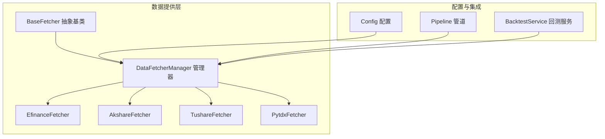
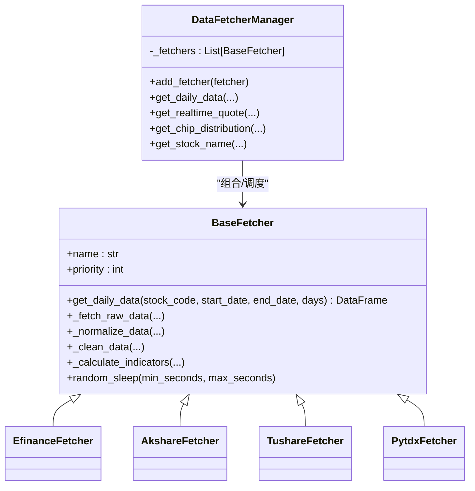
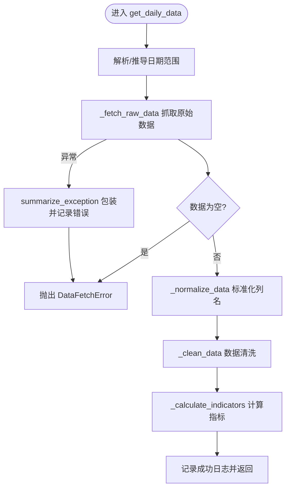
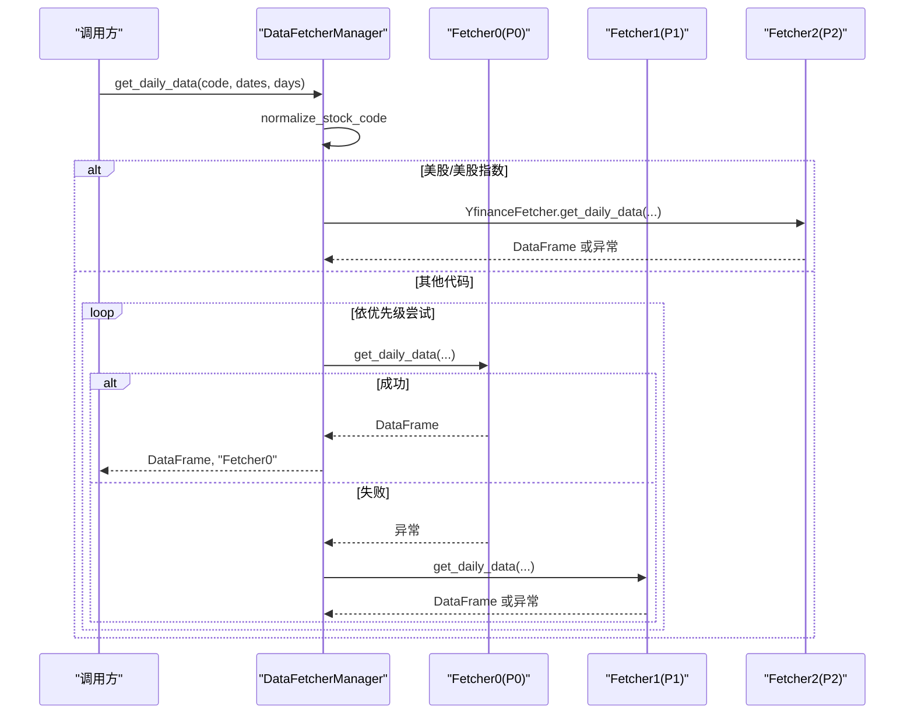
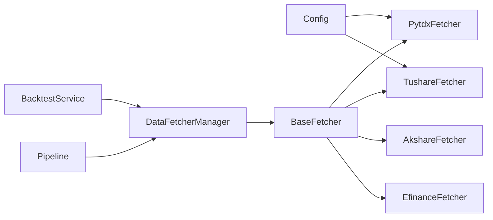

# 策略模式设计

<cite>
**本文引用的文件**
- [data_provider/base.py](file://data_provider/base.py)
- [data_provider/__init__.py](file://data_provider/__init__.py)
- [data_provider/efinance_fetcher.py](file://data_provider/efinance_fetcher.py)
- [data_provider/tushare_fetcher.py](file://data_provider/tushare_fetcher.py)
- [data_provider/akshare_fetcher.py](file://data_provider/akshare_fetcher.py)
- [data_provider/pytdx_fetcher.py](file://data_provider/pytdx_fetcher.py)
- [src/config.py](file://src/config.py)
- [src/core/pipeline.py](file://src/core/pipeline.py)
- [src/services/backtest_service.py](file://src/services/backtest_service.py)
- [tests/test_fetcher_logging.py](file://tests/test_fetcher_logging.py)
- [tests/test_tickflow_market_review_fallback.py](file://tests/test_tickflow_market_review_fallback.py)
- [tests/test_fundamental_context.py](file://tests/test_fundamental_context.py)
</cite>

## 目录
1. [引言](#引言)
2. [项目结构](#项目结构)
3. [核心组件](#核心组件)
4. [架构总览](#架构总览)
5. [详细组件分析](#详细组件分析)
6. [依赖分析](#依赖分析)
7. [性能考量](#性能考量)
8. [故障排查指南](#故障排查指南)
9. [结论](#结论)
10. [附录](#附录)

## 引言
本文件围绕数据源策略模式设计，系统阐述 BaseFetcher 抽象基类的设计理念与接口规范，DataFetcherManager 的策略管理与自动切换机制，以及优先级配置体系与动态调整策略。文档还总结了策略模式在股票数据获取场景中的优势、扩展性与性能影响，并给出最佳实践与设计决策依据。

## 项目结构
策略模式位于数据提供层（data_provider），通过统一抽象与管理器协调多个具体数据源实现，形成高内聚、低耦合的可扩展架构。核心文件包括：
- 抽象基类与管理器：data_provider/base.py
- 数据源实现：efinance_fetcher.py、tushare_fetcher.py、akshare_fetcher.py、pytdx_fetcher.py
- 配置与集成：src/config.py、src/core/pipeline.py、src/services/backtest_service.py
- 测试与验证：tests/* 相关测试

**图表来源**
- [data_provider/base.py](file://data_provider/base.py)
- [data_provider/efinance_fetcher.py](file://data_provider/efinance_fetcher.py)
- [data_provider/tushare_fetcher.py](file://data_provider/tushare_fetcher.py)
- [data_provider/akshare_fetcher.py](file://data_provider/akshare_fetcher.py)
- [data_provider/pytdx_fetcher.py](file://data_provider/pytdx_fetcher.py)
- [src/config.py](file://src/config.py)
- [src/core/pipeline.py](file://src/core/pipeline.py)
- [src/services/backtest_service.py](file://src/services/backtest_service.py)

**章节来源**
- [data_provider/base.py](file://data_provider/base.py)
- [data_provider/__init__.py](file://data_provider/__init__.py)

## 核心组件
- BaseFetcher 抽象基类：定义统一的数据获取接口、数据标准化与技术指标计算流程，提供日志与异常包装能力。
- DataFetcherManager 管理器：维护数据源列表、按优先级排序、自动故障切换、统一入口与日志记录。
- 具体数据源实现：Efinance、Akshare、Tushare、Pytdx 等，各自实现原始数据抓取与标准化。
- 配置驱动：通过环境变量与配置类决定优先级与行为（如 Tushare Token 动态提升优先级）。

**章节来源**
- [data_provider/base.py](file://data_provider/base.py)
- [data_provider/__init__.py](file://data_provider/__init__.py)

## 架构总览
策略模式在此处体现为：
- 抽象与实现分离：BaseFetcher 规范接口；各具体 Fetcher 实现差异化抓取策略。
- 管理与调度：DataFetcherManager 负责优先级排序与自动切换。
- 配置驱动：优先级与行为可通过配置动态调整，便于在不同环境灵活切换。

**图表来源**
- [data_provider/base.py](file://data_provider/base.py)
- [data_provider/efinance_fetcher.py](file://data_provider/efinance_fetcher.py)
- [data_provider/tushare_fetcher.py](file://data_provider/tushare_fetcher.py)
- [data_provider/akshare_fetcher.py](file://data_provider/akshare_fetcher.py)
- [data_provider/pytdx_fetcher.py](file://data_provider/pytdx_fetcher.py)

## 详细组件分析

### BaseFetcher 抽象基类
- 设计理念
  - 统一接口：对外暴露 get_daily_data，内部串联原始抓取、标准化、清洗与指标计算。
  - 可扩展：子类仅需实现 _fetch_raw_data 与 _normalize_data。
  - 防封禁：内置随机休眠、指数退避重试、异常摘要与日志记录。
- 关键接口
  - get_daily_data：日期范围推导、异常包装、统一返回标准列。
  - _fetch_raw_data/_normalize_data：子类必须实现。
  - _clean_data/_calculate_indicators：通用清洗与指标计算。
- 异常处理
  - DataFetchError 基类与 RateLimitError、DataSourceUnavailableError 子类。
  - summarize_exception 提取根因，统一错误日志格式。

**图表来源**
- [data_provider/base.py](file://data_provider/base.py)

**章节来源**
- [data_provider/base.py](file://data_provider/base.py)

### DataFetcherManager 策略管理器
- 职责
  - 管理多个数据源（按 priority 排序）。
  - 自动故障切换：失败即切下一个，直至成功或全部失败。
  - 统一入口：get_daily_data、get_realtime_quote、get_chip_distribution、get_stock_name 等。
- 优先级与动态调整
  - 默认初始化：按各 Fetcher 的 priority 排序。
  - Tushare 动态提升：检测到 Token 且初始化成功时，优先级降至最低（-1），否则保持默认。
- 美股/美股指数快速路径：直接路由到 YfinanceFetcher，避免无效尝试。
- 日志与可观测性：对每次尝试、失败与最终成功/失败进行记录。

**图表来源**
- [data_provider/base.py](file://data_provider/base.py)

**章节来源**
- [data_provider/base.py](file://data_provider/base.py)
- [data_provider/__init__.py](file://data_provider/__init__.py)

### 优先级配置系统与动态调整
- 默认优先级（配置了 TUSHARE_TOKEN 时）
  - TushareFetcher(-1)、EfinanceFetcher(0)、AkshareFetcher(1)、PytdxFetcher(2)、BaostockFetcher(3)、YfinanceFetcher(4)。
- 默认优先级（未配置 TUSHARE_TOKEN 时）
  - EfinanceFetcher(0)、AkshareFetcher(1)、PytdxFetcher(2)、TushareFetcher(2)（不可用）、BaostockFetcher(3)、YfinanceFetcher(4)。
- 动态调整机制
  - TushareFetcher 在初始化时检测 Token 与 API 可用性，成功则将 priority 调整为 -1，确保其成为最高优先级。
- 配置入口
  - 通过环境变量与配置类（如 TUSHARE_PRIORITY、PYTDX_PRIORITY）影响具体 Fetcher 的优先级。

**章节来源**
- [data_provider/__init__.py](file://data_provider/__init__.py)
- [data_provider/tushare_fetcher.py](file://data_provider/tushare_fetcher.py)
- [data_provider/pytdx_fetcher.py](file://data_provider/pytdx_fetcher.py)
- [src/config.py](file://src/config.py)

### 具体数据源实现要点
- EfinanceFetcher
  - 优先级：0（最高）。
  - 特点：免费、API 简洁、支持批量；具备指数退避重试与熔断器机制。
- AkshareFetcher
  - 优先级：1。
  - 特点：免费、多数据源（东财/新浪/腾讯），具备指数退避与熔断。
- TushareFetcher
  - 优先级：2（默认），但可被动态提升至 -1。
  - 特点：需要 Token、有配额限制；实现每分钟计数器与端点修复。
- PytdxFetcher
  - 优先级：2（可配置）。
  - 特点：免费、直连行情服务器、多服务器自动切换与超时重连。

**章节来源**
- [data_provider/efinance_fetcher.py](file://data_provider/efinance_fetcher.py)
- [data_provider/akshare_fetcher.py](file://data_provider/akshare_fetcher.py)
- [data_provider/tushare_fetcher.py](file://data_provider/tushare_fetcher.py)
- [data_provider/pytdx_fetcher.py](file://data_provider/pytdx_fetcher.py)

### 集成与使用场景
- 管道集成：pipeline 在每日数据获取阶段调用 DataFetcherManager，实现断点续传与入库。
- 回测服务：backtest_service 在评估窗口内调用 DataFetcherManager 获取所需数据窗口并保存。

**章节来源**
- [src/core/pipeline.py](file://src/core/pipeline.py)
- [src/services/backtest_service.py](file://src/services/backtest_service.py)

## 依赖分析
- 组件耦合
  - DataFetcherManager 与各具体 Fetcher 为组合关系，通过统一抽象解耦。
  - BaseFetcher 依赖 pandas/numpy 与内部工具函数（标准化列名、异常摘要等）。
- 外部依赖
  - 各 Fetcher 依赖第三方库（如 tushare、pytdx、requests、tenacity 等）。
- 配置依赖
  - 通过 src/config.py 的 Config 单例读取环境变量，影响优先级与行为。

**图表来源**
- [src/config.py](file://src/config.py)
- [data_provider/base.py](file://data_provider/base.py)
- [src/core/pipeline.py](file://src/core/pipeline.py)
- [src/services/backtest_service.py](file://src/services/backtest_service.py)

**章节来源**
- [src/config.py](file://src/config.py)
- [data_provider/base.py](file://data_provider/base.py)

## 性能考量
- 降低失败成本
  - 优先级排序与快速路径（美股/美股指数）减少无效尝试。
  - 自动切换与指数退避重试降低被限流与失败概率。
- 资源控制
  - Tushare 每分钟配额控制与熔断器机制避免过度调用。
  - BoundedSemaphore 控制基本面请求并发，避免阻塞。
- 缓存与预取
  - 实时行情缓存与批量预取（在满足条件时）减少重复请求。
- 日志与可观测性
  - 详细的日志记录有助于定位性能瓶颈与失败原因。

[本节为通用性能讨论，不直接分析具体文件]

## 故障排查指南
- 日志定位
  - BaseFetcher 与 Manager 的日志包含开始/成功/失败信息与耗时，便于快速定位。
- 自动切换验证
  - 测试用例验证了失败后自动切换与最终成功的日志记录。
- 资源释放
  - 管理器提供 close 与 __del__ 保障 TickFlowFetcher 等资源释放。
- 超时与并发
  - 测试用例覆盖了超时与工作池耗尽场景，帮助识别阻塞与资源不足问题。

**章节来源**
- [tests/test_fetcher_logging.py](file://tests/test_fetcher_logging.py)
- [tests/test_tickflow_market_review_fallback.py](file://tests/test_tickflow_market_review_fallback.py)
- [tests/test_fundamental_context.py](file://tests/test_fundamental_context.py)

## 结论
策略模式在此项目中有效实现了数据源的统一抽象与灵活调度。通过优先级与动态调整机制，系统在不同配置环境下具备良好的适应性；通过异常包装、指数退避与熔断器等手段，显著提升了鲁棒性与用户体验。扩展新数据源时，仅需实现 BaseFetcher 的两个抽象方法并设置合理优先级，即可无缝接入管理器的自动切换流程。

[本节为总结性内容，不直接分析具体文件]

## 附录

### 股票数据获取最佳实践
- 优先级设计
  - 在可获得高质量 Token 的情况下，优先使用 TushareFetcher 并将其优先级提升至最高。
  - 免费数据源（Efinance/Akshare/Pytdx）作为主力，Yfinance 作为美股专用。
- 防封禁策略
  - 启用随机休眠与指数退避重试；合理设置缓存 TTL 与批量预取阈值。
- 错误处理
  - 使用统一异常包装与错误摘要，结合日志定位问题；在关键路径上启用熔断器。
- 配置驱动
  - 通过环境变量与配置类集中管理优先级与行为，便于在不同环境快速切换。

[本节为通用最佳实践，不直接分析具体文件]