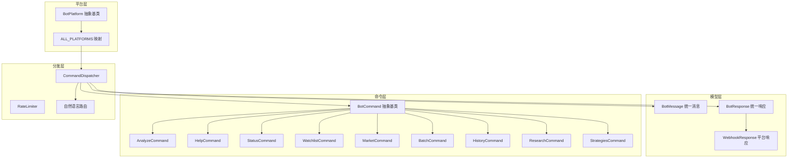
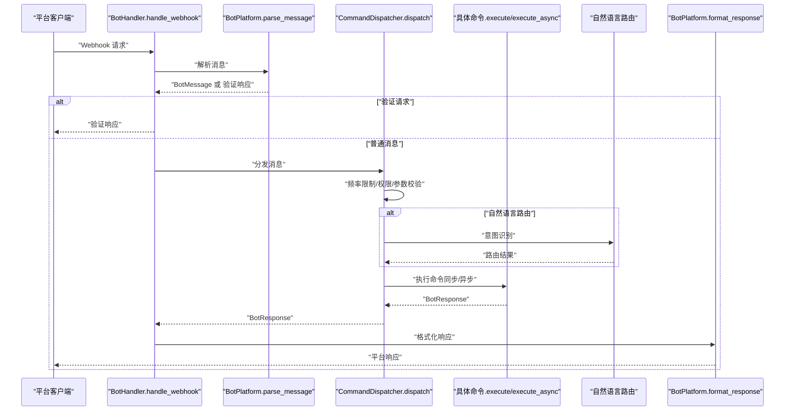
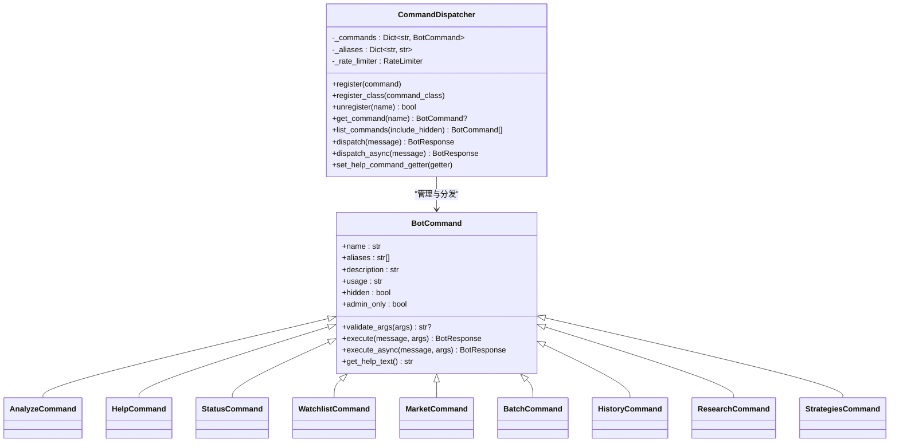
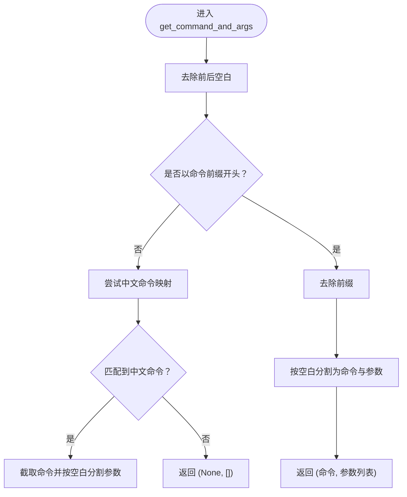
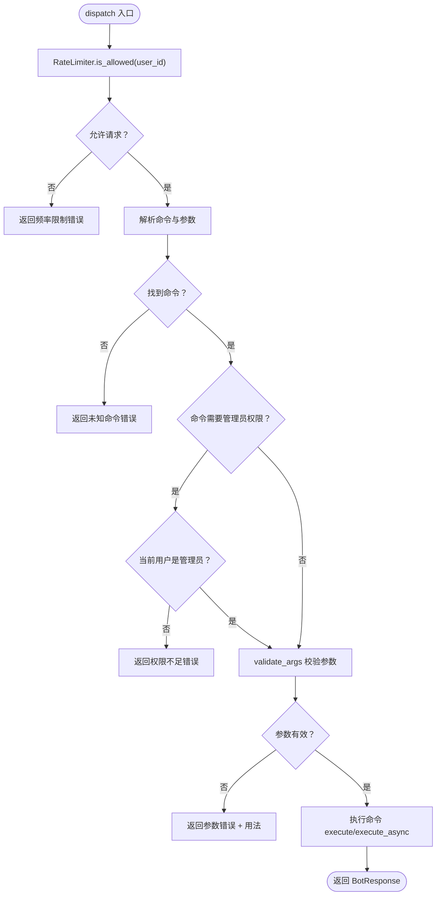
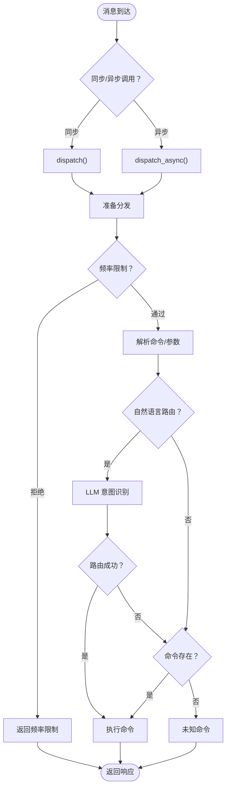
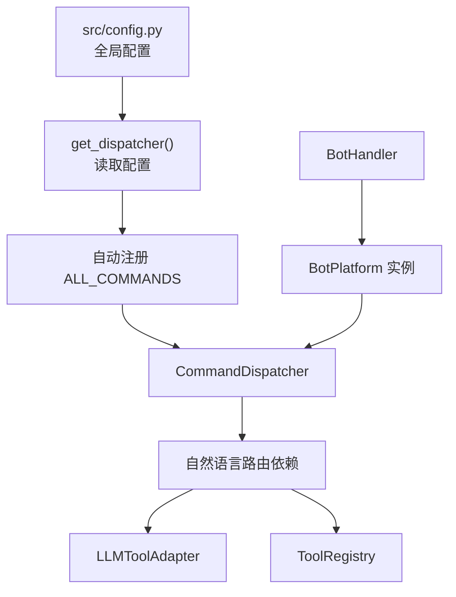

# 命令处理系统

<cite>
**本文引用的文件**
- [bot/commands/base.py](file://bot/commands/base.py)
- [bot/dispatcher.py](file://bot/dispatcher.py)
- [bot/handler.py](file://bot/handler.py)
- [bot/models.py](file://bot/models.py)
- [bot/commands/analyze.py](file://bot/commands/analyze.py)
- [bot/commands/help.py](file://bot/commands/help.py)
- [bot/commands/status.py](file://bot/commands/status.py)
- [bot/commands/watchlist.py](file://bot/commands/watchlist.py)
- [bot/commands/market.py](file://bot/commands/market.py)
- [bot/commands/batch.py](file://bot/commands/batch.py)
- [bot/commands/history.py](file://bot/commands/history.py)
- [bot/commands/research.py](file://bot/commands/research.py)
- [bot/commands/strategies.py](file://bot/commands/strategies.py)
- [bot/platforms/base.py](file://bot/platforms/base.py)
- [bot/platforms/__init__.py](file://bot/platforms/__init__.py)
- [bot/commands/__init__.py](file://bot/commands/__init__.py)
- [src/config.py](file://src/config.py)
</cite>

## 目录
1. [简介](#简介)
2. [项目结构](#项目结构)
3. [核心组件](#核心组件)
4. [架构总览](#架构总览)
5. [详细组件分析](#详细组件分析)
6. [依赖分析](#依赖分析)
7. [性能考虑](#性能考虑)
8. [故障排查指南](#故障排查指南)
9. [结论](#结论)
10. [附录](#附录)

## 简介
本技术文档面向"机器人命令处理系统"，系统围绕命令解析、参数提取与验证、权限与频率控制、并发执行策略以及内置命令实现展开，涵盖命令注册机制、帮助系统、状态展示、自选股管理、批量分析与大盘复盘等功能。**更新版本**新增了历史记录管理、深度研究分析和策略管理等高级功能，同时改进了异步命令分发器和自然语言路由能力。文档同时提供自定义命令开发指南与扩展接口说明，帮助开发者快速上手并安全地扩展系统能力。

## 项目结构
命令处理系统主要位于 bot 目录下，采用"平台无关的消息模型 + 命令处理器 + 分发器"的分层设计：
- 模型层：统一消息与响应模型，屏蔽不同平台差异
- 平台层：平台适配器抽象，负责签名验证、消息解析与响应格式化
- 命令层：命令处理器基类与具体命令实现，支持同步和异步执行
- 分发层：命令分发器，负责注册、解析、权限与频率控制、异常处理与执行调度，支持自然语言路由

**图表来源**
- [bot/platforms/base.py:16-154](file://bot/platforms/base.py#L16-L154)
- [bot/platforms/__init__.py:14-74](file://bot/platforms/__init__.py#L14-L74)
- [bot/models.py:32-185](file://bot/models.py#L32-L185)
- [bot/commands/base.py:16-137](file://bot/commands/base.py#L16-L137)
- [bot/commands/__init__.py:10-50](file://bot/commands/__init__.py#L10-L50)
- [bot/dispatcher.py:79-765](file://bot/dispatcher.py#L79-L765)

**章节来源**
- [bot/commands/__init__.py:10-50](file://bot/commands/__init__.py#L10-L50)
- [bot/platforms/__init__.py:14-74](file://bot/platforms/__init__.py#L14-L74)
- [bot/models.py:32-185](file://bot/models.py#L32-L185)
- [bot/commands/base.py:16-137](file://bot/commands/base.py#L16-L137)
- [bot/dispatcher.py:79-765](file://bot/dispatcher.py#L79-L765)

## 核心组件
- 命令基类 BotCommand：定义命令名称、别名、描述、用法、隐藏与管理员权限标志，以及参数校验与执行接口，**支持同步和异步执行**
- 命令分发器 CommandDispatcher：注册命令与别名、解析命令与参数、权限与频率控制、异常捕获与执行，**支持自然语言路由和异步分发**
- 平台适配器 BotPlatform：统一验证、解析与格式化流程
- 消息与响应模型：BotMessage、BotResponse、WebhookResponse
- 全局处理器 handle_webhook：统一入口，对接平台与分发器

**章节来源**
- [bot/commands/base.py:16-137](file://bot/commands/base.py#L16-L137)
- [bot/dispatcher.py:79-765](file://bot/dispatcher.py#L79-L765)
- [bot/handler.py:50-139](file://bot/handler.py#L50-L139)
- [bot/models.py:32-185](file://bot/models.py#L32-L185)
- [bot/platforms/base.py:16-154](file://bot/platforms/base.py#L16-L154)

## 架构总览
命令处理系统遵循"平台无关 + 命令可插拔 + 分发集中控制"的架构原则。平台适配器负责将不同平台的消息统一为 BotMessage；分发器负责解析命令、参数校验、权限与频率控制，并委派给具体命令处理器；命令处理器返回 BotResponse，再由平台适配器转换为平台特定的 WebhookResponse。**更新版本**增加了自然语言路由能力，能够智能识别用户意图并自动分发到相应命令。

**图表来源**
- [bot/handler.py:50-139](file://bot/handler.py#L50-L139)
- [bot/platforms/base.py:119-154](file://bot/platforms/base.py#L119-L154)
- [bot/dispatcher.py:322-362](file://bot/dispatcher.py#L322-L362)
- [bot/models.py:119-185](file://bot/models.py#L119-L185)

## 详细组件分析

### 命令基类与注册系统
- 设计模式：抽象基类 + 工厂式注册
- 关键点：
  - 命令名称、别名、描述、用法、隐藏与管理员权限标志
  - validate_args 可选重写，用于参数校验
  - execute 必须实现，返回 BotResponse
  - **新增 execute_async 异步执行接口，默认将同步执行下沉到线程池**
  - 注册方式：register/register_class/unregister，支持别名映射
  - 帮助命令通过回调注入命令列表

**图表来源**
- [bot/commands/base.py:16-137](file://bot/commands/base.py#L16-L137)
- [bot/commands/__init__.py:10-50](file://bot/commands/__init__.py#L10-L50)
- [bot/dispatcher.py:79-765](file://bot/dispatcher.py#L79-L765)

**章节来源**
- [bot/commands/base.py:16-137](file://bot/commands/base.py#L16-L137)
- [bot/dispatcher.py:121-200](file://bot/dispatcher.py#L121-L200)
- [bot/commands/__init__.py:18-34](file://bot/commands/__init__.py#L18-L34)

### 命令解析与参数提取
- 命令前缀与中文自然语言支持：支持"/命令 参数"与中文命令前缀匹配
- 参数分割：按空白分割，首段为命令名，其余为参数列表
- 中文命令映射：内置中文命令到英文命令的映射表

**图表来源**
- [bot/models.py:66-117](file://bot/models.py#L66-L117)

**章节来源**
- [bot/models.py:66-117](file://bot/models.py#L66-L117)

### 权限控制与频率限制
- 权限控制：admin_only 标志 + 管理员白名单
- 频率限制：基于滑动窗口的 RateLimiter，按用户维度限制单位时间内的请求次数

**图表来源**
- [bot/dispatcher.py:233-362](file://bot/dispatcher.py#L233-L362)
- [bot/dispatcher.py:21-80](file://bot/dispatcher.py#L21-L80)

**章节来源**
- [bot/dispatcher.py:21-80](file://bot/dispatcher.py#L21-L80)
- [bot/dispatcher.py:233-362](file://bot/dispatcher.py#L233-L362)

### 帮助命令（HelpCommand）
- 功能：列出可用命令、显示命令详情（含别名、权限要求）
- 交互：支持 /help 与 /help <命令名>

**章节来源**
- [bot/commands/help.py:16-128](file://bot/commands/help.py#L16-L128)
- [bot/dispatcher.py:363-373](file://bot/dispatcher.py#L363-L373)

### 状态命令（StatusCommand）
- 功能：展示系统运行状态、配置信息、AI与搜索服务可用性、通知渠道状态
- 输出：Markdown 格式，包含图标与摘要

**章节来源**
- [bot/commands/status.py:19-152](file://bot/commands/status.py#L19-L152)

### 分析命令（AnalyzeCommand）
- 功能：对指定股票代码发起分析任务，支持精简/完整报告类型
- 参数校验：支持 A 股 6 位数字、港股 HK+5 位数字、美股 1-5 大写字母（含 .US 等后缀）
- 异步执行：提交任务后立即返回任务信息

**章节来源**
- [bot/commands/analyze.py:21-108](file://bot/commands/analyze.py#L21-L108)

### 自选股命令（WatchlistCommand）
- 功能：自然语言意图识别，支持添加、删除、查看自选股
- 意图检测：从命令参数与全文中识别 list/add/remove
- 股票解析：支持代码与中文名称解析，自动识别市场（A/H/US）

**章节来源**
- [bot/commands/watchlist.py:21-265](file://bot/commands/watchlist.py#L21-L265)

### 大盘复盘命令（MarketCommand）
- 功能：后台线程执行市场复盘分析，完成后自动推送
- 并发策略：守护线程异步执行，避免阻塞

**章节来源**
- [bot/commands/market.py:20-126](file://bot/commands/market.py#L20-L126)

### 批量分析命令（BatchCommand）
- 功能：批量分析自选股，支持限制分析数量
- 并发策略：后台线程异步执行分析流水线

**章节来源**
- [bot/commands/batch.py:21-127](file://bot/commands/batch.py#L21-L127)

### 历史记录命令（HistoryCommand）
- 功能：查看和管理 Agent 对话历史，支持会话清理
- 用户隔离：每个用户只能查看自己的会话记录
- 会话管理：支持列出最近会话、查看特定会话详情、清理当前会话
- 数据持久化：基于存储模块的会话数据管理

**新增功能** - 历史记录管理

**章节来源**
- [bot/commands/history.py:41-151](file://bot/commands/history.py#L41-L151)

### 深度研究命令（ResearchCommand）
- 功能：对股票或市场主题进行深度研究分析
- 支持模式：股票代码研究、主题研究、焦点问题研究
- 智能识别：自动识别股票代码和研究主题
- 资源控制：基于配置的令牌预算和超时控制
- 错误处理：超时和部分结果处理

**新增功能** - 深度研究分析

**章节来源**
- [bot/commands/research.py:27-148](file://bot/commands/research.py#L27-L148)

### 策略管理命令（StrategiesCommand）
- 功能：查看可用交易策略及其激活状态
- 分类展示：按趋势类、形态类、反转类、框架类分组
- 状态显示：显示策略激活状态和来源（内置/自定义）
- 过滤功能：支持只显示激活的策略

**新增功能** - 策略管理

**章节来源**
- [bot/commands/strategies.py:17-104](file://bot/commands/strategies.py#L17-L104)

### 平台适配器与 Webhook 处理
- BotPlatform：统一验证、解析、格式化流程，支持挑战响应
- BotHandler：统一入口，按平台名称获取适配器，调用分发器并格式化响应

**章节来源**
- [bot/platforms/base.py:16-154](file://bot/platforms/base.py#L16-L154)
- [bot/handler.py:50-139](file://bot/handler.py#L50-L139)
- [bot/platforms/__init__.py:14-74](file://bot/platforms/__init__.py#L14-L74)

### 自然语言路由与异步分发
- **新增功能**：自然语言路由系统，基于 LLM 的意图识别
- **改进功能**：异步命令分发器，支持同步和异步执行
- **预过滤**：正则表达式快速过滤无关消息
- **意图识别**：JSON 结构化输出的意图解析
- **会话管理**：支持私聊和@提及场景

**更新** - 增强的异步命令分发器

**图表来源**
- [bot/dispatcher.py:233-362](file://bot/dispatcher.py#L233-L362)
- [bot/dispatcher.py:457-539](file://bot/dispatcher.py#L457-L539)

**章节来源**
- [bot/dispatcher.py:322-362](file://bot/dispatcher.py#L322-L362)
- [bot/dispatcher.py:457-539](file://bot/dispatcher.py#L457-L539)

## 依赖分析
- 命令注册：通过 bot/commands/__init__.py 的 ALL_COMMANDS 列表自动注册
- 配置驱动：分发器与全局处理器从 src/config.py 读取命令前缀、频率限制、管理员列表等
- 平台适配：ALL_PLATFORMS 映射平台类，BotHandler 按名称获取实例
- **新增依赖**：自然语言路由依赖 LLM 适配器和工具注册表
- **新增依赖**：深度研究依赖研究代理和令牌预算配置

**图表来源**
- [bot/dispatcher.py:730-765](file://bot/dispatcher.py#L730-L765)
- [bot/commands/__init__.py:18-34](file://bot/commands/__init__.py#L18-L34)
- [bot/handler.py:73-84](file://bot/handler.py#L73-L84)
- [src/config.py:31-200](file://src/config.py#L31-L200)

**章节来源**
- [bot/dispatcher.py:730-765](file://bot/dispatcher.py#L730-L765)
- [bot/commands/__init__.py:18-34](file://bot/commands/__init__.py#L18-L34)
- [bot/handler.py:73-84](file://bot/handler.py#L73-L84)
- [src/config.py:31-200](file://src/config.py#L31-L200)

## 性能考虑
- 频率限制：滑动窗口算法，按用户维度限制 QPS，避免滥用
- 并发策略：后台线程执行耗时任务（如市场复盘、批量分析），主线程快速返回
- **异步执行**：分析命令提交任务后立即返回，避免阻塞；默认将同步执行下沉到线程池
- **自然语言路由成本控制**：正则预过滤避免不必要的 LLM 调用
- 资源隔离：平台适配器与命令处理器解耦，便于独立优化

**更新** - 性能优化改进

## 故障排查指南
- 未知命令：检查命令是否正确注册、别名是否冲突
- 权限不足：确认命令 admin_only 标志与管理员列表配置
- 参数错误：查看 validate_args 返回的错误提示与 usage 说明
- 频繁请求：确认 RateLimiter 阈值与窗口设置
- 平台验证失败：检查 BotPlatform.verify_request 实现与签名规则
- 响应为空：确认平台适配器 format_response 是否正确生成
- **自然语言路由失败**：检查 AGENT_NL_ROUTING 和 AGENT_MODE 配置
- **深度研究超时**：调整 agent_deep_research_timeout 和 token 预算

**更新** - 新增故障排查项

**章节来源**
- [bot/dispatcher.py:233-362](file://bot/dispatcher.py#L233-L362)
- [bot/platforms/base.py:119-154](file://bot/platforms/base.py#L119-L154)

## 结论
该命令处理系统以清晰的分层设计实现了跨平台、可扩展、可配置的命令处理能力。**更新版本**通过统一的消息模型、灵活的命令注册与分发机制、完善的权限与频率控制，以及自然语言与异步执行策略，系统既满足日常运营需求，也为后续扩展提供了良好基础。新增的历史记录管理、深度研究分析和策略管理功能进一步增强了系统的智能化水平。

## 附录

### 自定义命令开发指南
- 继承 BotCommand，实现 name/aliases/description/usage/execute
- 如需参数校验，重写 validate_args 返回 None 或错误信息
- 如需管理员权限，设置 admin_only 为 True
- 如需隐藏命令，设置 hidden 为 True
- **新增**：如需异步执行，重写 execute_async 方法或使用默认的线程池执行
- 将命令类加入 bot/commands/__init__.py 的 ALL_COMMANDS 列表，或通过 register_class 自动注册

**更新** - 新增异步执行选项

**章节来源**
- [bot/commands/base.py:16-137](file://bot/commands/base.py#L16-L137)
- [bot/commands/__init__.py:18-34](file://bot/commands/__init__.py#L18-L34)

### 扩展接口说明
- 平台适配器扩展：实现 BotPlatform 的 verify_request/parse_message/format_response，并在 ALL_PLATFORMS 中注册
- 命令扩展：实现新的 BotCommand 子类并通过分发器注册
- 配置扩展：在 src/config.py 中添加新配置项，分发器与处理器按需读取
- **新增**：自然语言路由扩展：通过配置启用 AGENT_NL_ROUTING 和 AGENT_MODE
- **新增**：深度研究扩展：配置 agent_deep_research_budget 和 agent_deep_research_timeout

**更新** - 新增扩展接口

**章节来源**
- [bot/platforms/base.py:16-154](file://bot/platforms/base.py#L16-L154)
- [bot/platforms/__init__.py:14-74](file://bot/platforms/__init__.py#L14-L74)
- [src/config.py:31-200](file://src/config.py#L31-L200)

### 新增命令使用说明

#### 历史记录命令（/history）
- **功能**：查看和管理 Agent 对话历史
- **语法**：`/history [session_id | clear]`
- **示例**：
  - `/history` - 列出最近对话会话
  - `/history 12345` - 查看指定会话详情
  - `/history clear` - 清除当前会话

#### 深度研究命令（/research）
- **功能**：对股票或市场主题进行深度研究分析
- **语法**：`/research <stock_code|topic> [specific question]`
- **示例**：
  - `/research 600519` - 对贵州茅台进行全面研究
  - `/research 600519 近期风险` - 研究贵州茅台近期风险
  - `/research 新能源板块` - 研究新能源板块

#### 策略管理命令（/strategies）
- **功能**：查看可用交易策略及其激活状态
- **语法**：`/strategies [active]`
- **示例**：
  - `/strategies` - 显示所有策略
  - `/strategies active` - 只显示激活的策略

**新增** - 命令使用说明

**章节来源**
- [bot/commands/history.py:41-151](file://bot/commands/history.py#L41-L151)
- [bot/commands/research.py:27-148](file://bot/commands/research.py#L27-L148)
- [bot/commands/strategies.py:17-104](file://bot/commands/strategies.py#L17-L104)