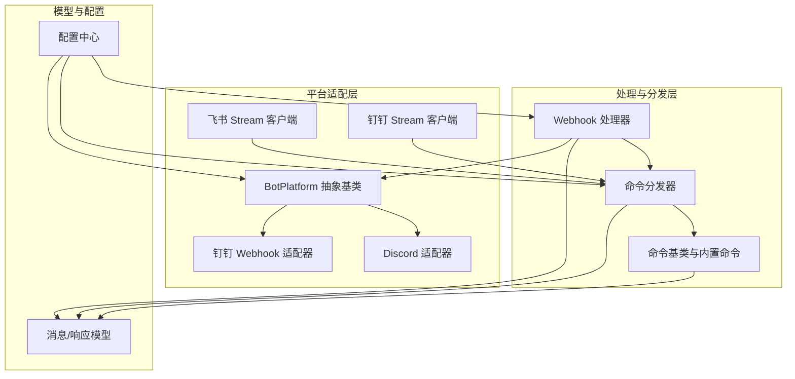
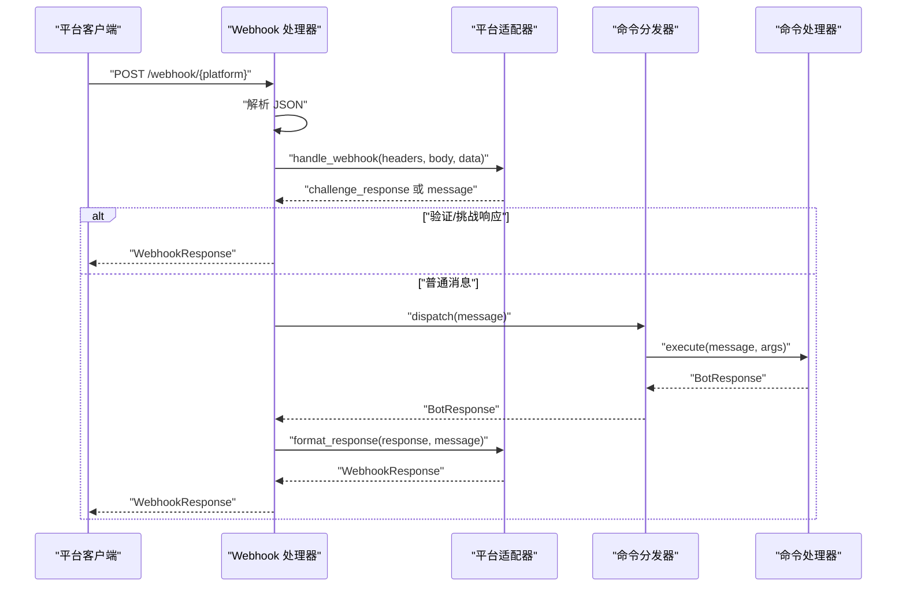
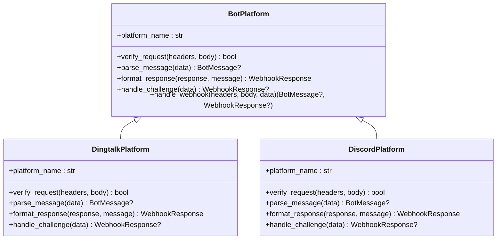
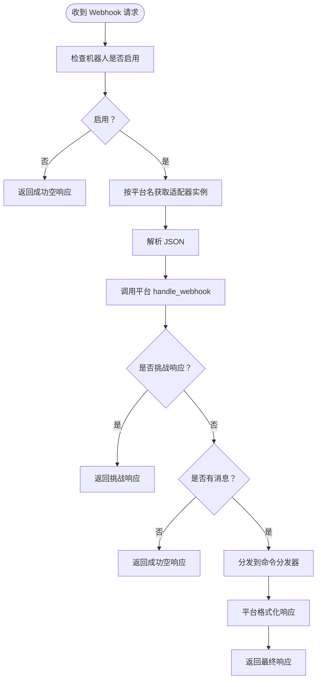
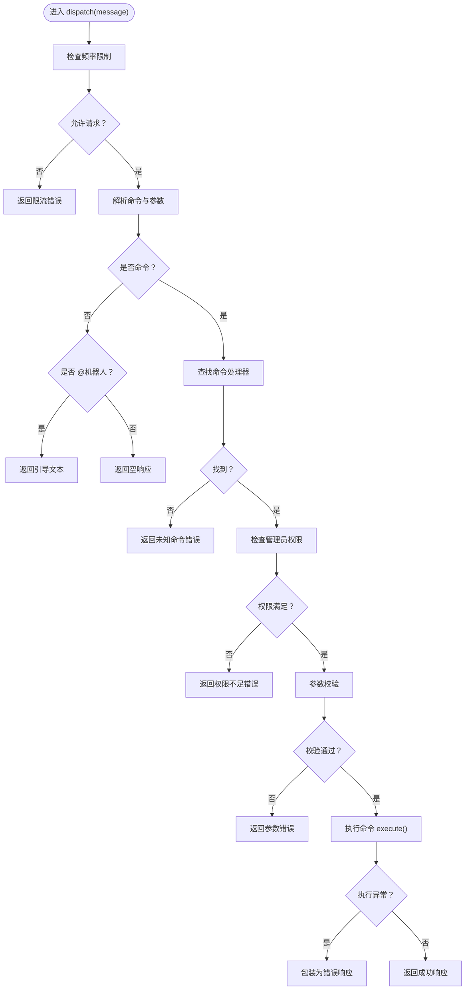
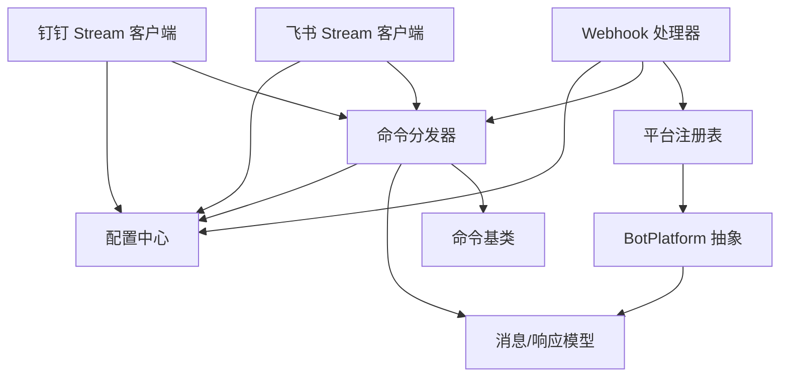

# 平台适配器设计

<cite>
**本文档引用的文件**
- [bot/platforms/base.py](file://bot/platforms/base.py)
- [bot/platforms/__init__.py](file://bot/platforms/__init__.py)
- [bot/handler.py](file://bot/handler.py)
- [bot/dispatcher.py](file://bot/dispatcher.py)
- [bot/models.py](file://bot/models.py)
- [bot/platforms/dingtalk.py](file://bot/platforms/dingtalk.py)
- [bot/platforms/discord.py](file://bot/platforms/discord.py)
- [bot/platforms/feishu_stream.py](file://bot/platforms/feishu_stream.py)
- [bot/platforms/dingtalk_stream.py](file://bot/platforms/dingtalk_stream.py)
- [bot/commands/base.py](file://bot/commands/base.py)
- [src/config.py](file://src/config.py)
- [bot/commands/analyze.py](file://bot/commands/analyze.py)
- [bot/commands/help.py](file://bot/commands/help.py)
</cite>

## 目录
1. [引言](#引言)
2. [项目结构](#项目结构)
3. [核心组件](#核心组件)
4. [架构总览](#架构总览)
5. [详细组件分析](#详细组件分析)
6. [依赖分析](#依赖分析)
7. [性能考虑](#性能考虑)
8. [故障排查指南](#故障排查指南)
9. [结论](#结论)
10. [附录](#附录)

## 引言
本文件面向机器人平台适配器的设计与实现，系统化阐述 BotPlatform 基类的设计理念、抽象接口规范，以及 Webhook 与 Stream 两种接入模式的差异、适用场景与配置要点。文档还涵盖平台适配器的注册机制与动态导入逻辑、平台能力检测、错误处理与降级策略，并提供新平台适配器开发的最佳实践与生命周期管理建议。

## 项目结构
机器人子系统位于 bot/ 目录，核心模块包括：
- 平台适配器：bot/platforms/*，统一抽象于 BotPlatform，具体平台实现于各文件
- Webhook 处理器：bot/handler.py，统一入口与平台实例缓存
- 命令分发器：bot/dispatcher.py，命令注册、解析、调度与限流
- 消息与响应模型：bot/models.py，统一 BotMessage/BotResponse/WebhookResponse
- 命令基类与内置命令：bot/commands/*
- 配置中心：src/config.py，集中管理平台与机器人相关配置

图表来源
- [bot/platforms/base.py:16-154](file://bot/platforms/base.py#L16-L154)
- [bot/platforms/dingtalk.py:28-315](file://bot/platforms/dingtalk.py#L28-L315)
- [bot/platforms/discord.py:23-162](file://bot/platforms/discord.py#L23-L162)
- [bot/platforms/feishu_stream.py:455-640](file://bot/platforms/feishu_stream.py#L455-L640)
- [bot/platforms/dingtalk_stream.py:190-347](file://bot/platforms/dingtalk_stream.py#L190-L347)
- [bot/handler.py:50-139](file://bot/handler.py#L50-L139)
- [bot/dispatcher.py:79-343](file://bot/dispatcher.py#L79-L343)
- [bot/models.py:32-185](file://bot/models.py#L32-L185)
- [src/config.py:200-225](file://src/config.py#L200-L225)

章节来源
- [bot/platforms/base.py:16-154](file://bot/platforms/base.py#L16-L154)
- [bot/platforms/__init__.py:14-74](file://bot/platforms/__init__.py#L14-L74)
- [bot/handler.py:50-139](file://bot/handler.py#L50-L139)
- [bot/dispatcher.py:79-343](file://bot/dispatcher.py#L79-L343)
- [bot/models.py:32-185](file://bot/models.py#L32-L185)
- [src/config.py:200-225](file://src/config.py#L200-L225)

## 核心组件
- BotPlatform 抽象基类：定义平台适配器的统一接口，包括平台标识、请求签名验证、消息解析、响应格式化、挑战处理与 Webhook 主流程
- Webhook 处理器：按平台名获取适配器实例，解析 JSON，调用平台 handle_webhook，再分发至命令分发器，最后格式化为平台响应
- 命令分发器：注册命令、解析命令与参数、权限与参数校验、限流、异常捕获与统一错误响应
- 模型层：BotMessage/BotResponse/WebhookResponse 三元模型，屏蔽平台差异
- 平台适配器：钉钉 Webhook、Discord、飞书/钉钉 Stream 客户端与处理器

章节来源
- [bot/platforms/base.py:16-154](file://bot/platforms/base.py#L16-L154)
- [bot/handler.py:50-139](file://bot/handler.py#L50-L139)
- [bot/dispatcher.py:79-343](file://bot/dispatcher.py#L79-L343)
- [bot/models.py:32-185](file://bot/models.py#L32-L185)

## 架构总览
Webhook 模式与 Stream 模式的统一处理流程如下：

图表来源
- [bot/handler.py:50-118](file://bot/handler.py#L50-L118)
- [bot/platforms/base.py:119-154](file://bot/platforms/base.py#L119-L154)
- [bot/dispatcher.py:230-291](file://bot/dispatcher.py#L230-L291)

## 详细组件分析

### BotPlatform 抽象基类
设计理念
- 屏蔽平台差异：统一签名验证、消息解析、响应格式化
- 可插拔扩展：子类仅需实现必要方法，其余流程由基类编排
- 挑战处理：handle_challenge 用于平台 URL 验证等场景

关键接口
- platform_name：平台标识，用于路由与日志
- verify_request：签名验证，不同平台算法不同
- parse_message：将平台消息转为统一 BotMessage；非命令消息可返回 None
- format_response：将 BotResponse 转为平台 WebhookResponse
- handle_challenge：可选，处理平台验证请求
- handle_webhook：主流程编排，含挑战、签名验证、消息解析

图表来源
- [bot/platforms/base.py:16-154](file://bot/platforms/base.py#L16-L154)
- [bot/platforms/dingtalk.py:28-315](file://bot/platforms/dingtalk.py#L28-L315)
- [bot/platforms/discord.py:23-162](file://bot/platforms/discord.py#L23-L162)

章节来源
- [bot/platforms/base.py:16-154](file://bot/platforms/base.py#L16-L154)

### Webhook 模式与 Stream 模式的区别与配置
- Webhook 模式
  - 需要公网可达的回调地址，平台将消息推送到服务端
  - 适合有公网 IP/域名的部署环境
  - 配置要点：平台 Webhook URL、签名密钥、验证 Token 等
- Stream 模式
  - 通过 WebSocket 长连接接收消息，无需公网 IP
  - 适合内网或无公网环境，依赖官方 SDK
  - 配置要点：App ID/Secret、可选加密 Key 与 Verification Token

平台能力检测与动态导入
- 平台模块通过 try/except 动态导入 Stream SDK，若缺失则标记不可用并提供降级路径
- 平台注册：ALL_PLATFORMS 映射平台名到适配器类，便于统一入口调用

章节来源
- [bot/platforms/__init__.py:14-74](file://bot/platforms/__init__.py#L14-L74)
- [bot/platforms/feishu_stream.py:34-50](file://bot/platforms/feishu_stream.py#L34-L50)
- [bot/platforms/dingtalk_stream.py:31-40](file://bot/platforms/dingtalk_stream.py#L31-L40)
- [src/config.py:200-225](file://src/config.py#L200-L225)

### Webhook 处理器与平台注册机制
- 平台实例缓存：get_platform 使用字典缓存实例，避免重复创建
- 统一入口：handle_webhook 根据平台名获取适配器，解析 JSON，调用 handle_webhook，再分发命令并格式化响应
- 平台注册：ALL_PLATFORMS 映射平台名到适配器类，便于扩展新平台

图表来源
- [bot/handler.py:50-118](file://bot/handler.py#L50-L118)
- [bot/platforms/base.py:119-154](file://bot/platforms/base.py#L119-L154)

章节来源
- [bot/handler.py:27-118](file://bot/handler.py#L27-L118)
- [bot/platforms/__init__.py:18-20](file://bot/platforms/__init__.py#L18-L20)

### 命令分发器与错误处理
- 注册与别名：register/register_class 支持命令与别名注册，冲突时覆盖并警告
- 解析与校验：get_command_and_args 支持英文命令前缀与中文命令映射
- 权限与限流：admin_only 与滑动窗口限流，超限返回统一错误
- 异常捕获：执行异常统一包装为 BotResponse.error_response
- 帮助命令：HelpCommand 动态获取命令列表，支持详细帮助

图表来源
- [bot/dispatcher.py:230-291](file://bot/dispatcher.py#L230-L291)
- [bot/models.py:119-153](file://bot/models.py#L119-L153)

章节来源
- [bot/dispatcher.py:79-343](file://bot/dispatcher.py#L79-L343)
- [bot/commands/help.py:44-128](file://bot/commands/help.py#L44-L128)

### 钉钉 Webhook 适配器
- 签名验证：基于 AppSecret 的 HMAC-SHA256，校验时间戳有效性
- 挑战处理：钉钉无需 URL 验证
- 消息解析：提取文本内容、@信息、会话类型、时间戳等，构建 BotMessage
- 响应格式化：支持 text/markdown，可选 @发送者
- 异步发送：提供 sessionWebhook 异步发送能力

章节来源
- [bot/platforms/dingtalk.py:28-315](file://bot/platforms/dingtalk.py#L28-L315)

### Discord 适配器
- 签名验证：预留接口，当前返回 True（待完善）
- 消息解析：解析事件类型、内容、作者、频道、附件等
- 响应格式化：构建 Discord 响应体
- 挑战处理：支持验证请求与命令交互验证

章节来源
- [bot/platforms/discord.py:23-162](file://bot/platforms/discord.py#L23-L162)

### 飞书/钉钉 Stream 客户端与处理器
- 飞书 Stream
  - 客户端：封装 lark-oapi WebSocket 客户端，支持阻塞/后台启动、自动重连
  - 处理器：将事件转换为 BotMessage，调用分发器并使用 FeishuReplyClient 回复
  - 回复：支持交互卡片、Markdown、分段发送与 @用户
- 钉钉 Stream
  - 客户端：封装 dingtalk-stream SDK，支持阻塞/后台启动、自动重连
  - 处理器：解析消息、构造 BotMessage，按群聊场景在文本中拼接 @用户名

章节来源
- [bot/platforms/feishu_stream.py:455-640](file://bot/platforms/feishu_stream.py#L455-L640)
- [bot/platforms/dingtalk_stream.py:190-347](file://bot/platforms/dingtalk_stream.py#L190-L347)

### 模型与统一接口
- BotMessage：统一字段包括平台、消息 ID、用户信息、会话类型、内容、@信息、时间戳与原始数据
- BotResponse：统一文本、Markdown 标识、@行为、回复行为与额外数据
- WebhookResponse：统一 HTTP 状态码、响应体与响应头

章节来源
- [bot/models.py:32-185](file://bot/models.py#L32-L185)

### 命令基类与内置命令
- BotCommand：定义命令名称、别名、描述、用法、隐藏与管理员权限等抽象接口
- 内置命令示例：AnalyzeCommand（参数校验与任务提交）、HelpCommand（帮助列表与详情）

章节来源
- [bot/commands/base.py:16-129](file://bot/commands/base.py#L16-L129)
- [bot/commands/analyze.py:21-108](file://bot/commands/analyze.py#L21-L108)
- [bot/commands/help.py:16-128](file://bot/commands/help.py#L16-L128)

## 依赖分析
- 平台适配器依赖模型层与配置中心
- Webhook 处理器依赖平台注册表与分发器
- 分发器依赖命令基类与配置中心
- Stream 客户端依赖相应 SDK 与配置中心

图表来源
- [bot/handler.py:14-20](file://bot/handler.py#L14-L20)
- [bot/platforms/__init__.py:14-20](file://bot/platforms/__init__.py#L14-L20)
- [bot/dispatcher.py:15-16](file://bot/dispatcher.py#L15-L16)
- [src/config.py:200-225](file://src/config.py#L200-L225)

章节来源
- [bot/handler.py:14-20](file://bot/handler.py#L14-L20)
- [bot/platforms/__init__.py:14-20](file://bot/platforms/__init__.py#L14-L20)
- [bot/dispatcher.py:15-16](file://bot/dispatcher.py#L15-L16)
- [src/config.py:200-225](file://src/config.py#L200-L225)

## 性能考虑
- 频率限制：滑动窗口限流，避免平台与下游服务压力过大
- 消息分段：飞书/企业微信等平台对消息大小有限制，超长内容自动分段发送
- Stream 自动重连：WebSocket 断开后自动重连，提升稳定性
- 异步任务：分析命令提交异步任务，避免阻塞 Webhook 响应链路

章节来源
- [bot/dispatcher.py:21-77](file://bot/dispatcher.py#L21-L77)
- [bot/platforms/feishu_stream.py:234-254](file://bot/platforms/feishu_stream.py#L234-L254)
- [bot/platforms/dingtalk.py:243-315](file://bot/platforms/dingtalk.py#L243-L315)
- [bot/commands/analyze.py:68-108](file://bot/commands/analyze.py#L68-L108)

## 故障排查指南
- Webhook 未触发
  - 检查机器人功能开关与平台回调地址配置
  - 核对签名验证（钉钉需 AppSecret，Discord 需完善签名验证）
- 消息未被处理
  - 确认消息是否 @机器人或符合命令前缀
  - 查看分发器日志与限流状态
- Stream 无法连接
  - 确认 SDK 是否安装与 App ID/Secret 配置正确
  - 检查网络与防火墙策略
- 响应格式异常
  - 核对平台 format_response 实现与平台限制（如飞书最大字节数）

章节来源
- [bot/handler.py:72-118](file://bot/handler.py#L72-L118)
- [bot/platforms/base.py:119-154](file://bot/platforms/base.py#L119-L154)
- [bot/platforms/feishu_stream.py:455-640](file://bot/platforms/feishu_stream.py#L455-L640)
- [bot/platforms/dingtalk_stream.py:190-347](file://bot/platforms/dingtalk_stream.py#L190-L347)

## 结论
本设计通过 BotPlatform 抽象与统一模型，实现了跨平台消息处理的一致性；Webhook 与 Stream 两种模式满足不同部署场景；分发器提供完善的命令管理、权限与限流机制；动态导入与平台注册机制保证了扩展性与健壮性。建议在新平台接入时遵循统一接口规范，完善签名验证与挑战处理，并结合配置中心进行能力开关与参数管理。

## 附录

### Webhook 与 Stream 模式对比
- Webhook
  - 优点：标准回调，平台生态成熟
  - 限制：需要公网 IP/域名
  - 适用：有公网环境的生产部署
- Stream
  - 优点：无需公网，SDK 自带重连与心跳
  - 限制：依赖官方 SDK，需安装相应包
  - 适用：内网或开发测试环境

章节来源
- [bot/platforms/__init__.py:9-12](file://bot/platforms/__init__.py#L9-L12)
- [bot/platforms/feishu_stream.py:10-22](file://bot/platforms/feishu_stream.py#L10-L22)
- [bot/platforms/dingtalk_stream.py:7-21](file://bot/platforms/dingtalk_stream.py#L7-L21)

### 新平台适配器开发最佳实践
- 继承 BotPlatform，至少实现 platform_name、verify_request、parse_message、format_response
- handle_challenge：如平台需要 URL 验证，实现挑战响应
- 签名验证：严格遵循平台规范，建议记录失败原因便于排查
- 消息解析：尽量标准化字段，保留 raw_data 便于调试
- 响应格式：遵循平台格式，注意 @用户、Markdown、分段发送等细节
- 注册与导入：在 bot/platforms/__init__.py 中注册到 ALL_PLATFORMS，或在模块层做动态导入与降级

章节来源
- [bot/platforms/base.py:16-154](file://bot/platforms/base.py#L16-L154)
- [bot/platforms/__init__.py:18-20](file://bot/platforms/__init__.py#L18-L20)

### 生命周期管理与资源清理
- 平台实例缓存：Webhook 处理器内部缓存，按需创建与复用
- Stream 客户端：提供 start/start_background/stop 方法，支持后台线程与自动重连
- 配置中心：统一读取与更新，避免硬编码

章节来源
- [bot/handler.py:23-47](file://bot/handler.py#L23-L47)
- [bot/platforms/feishu_stream.py:599-608](file://bot/platforms/feishu_stream.py#L599-L608)
- [bot/platforms/dingtalk_stream.py:306-314](file://bot/platforms/dingtalk_stream.py#L306-L314)
- [src/config.py:232-244](file://src/config.py#L232-L244)