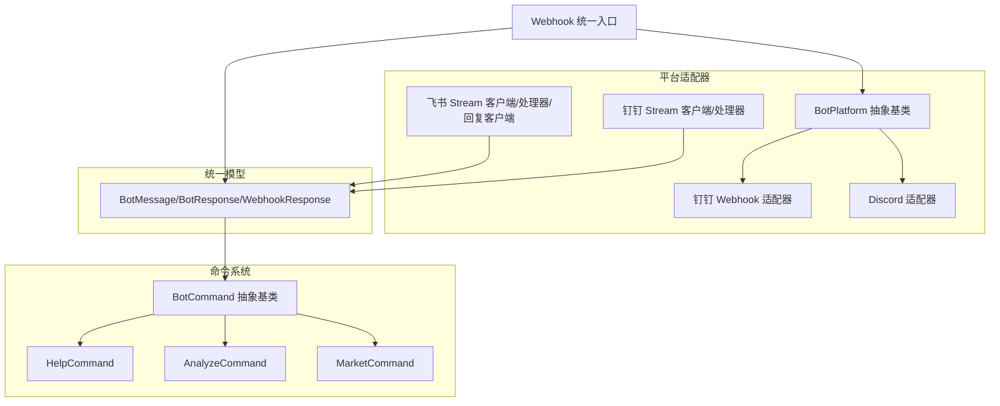
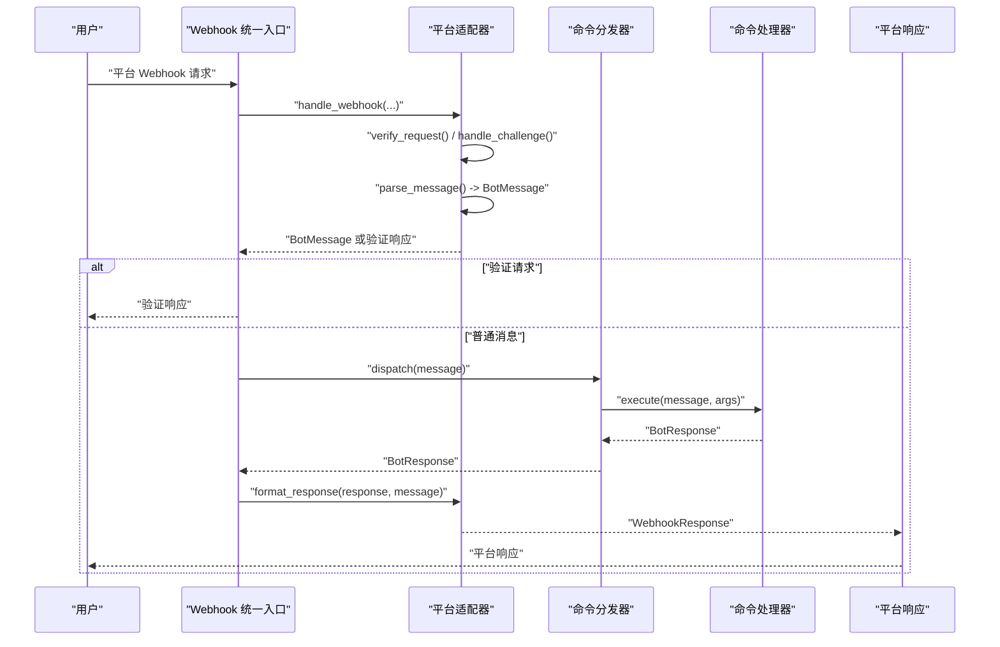
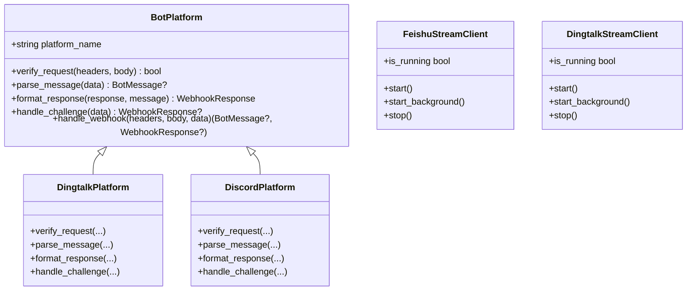
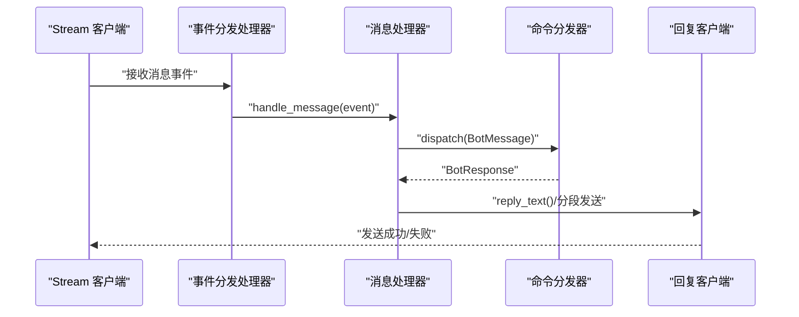
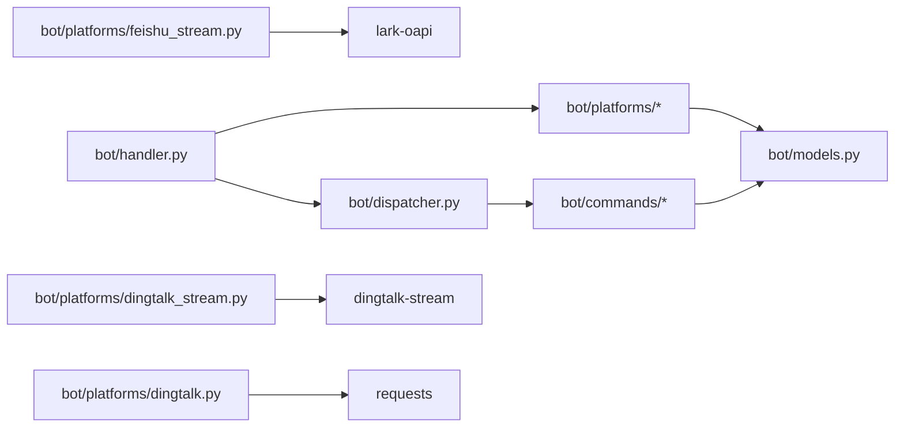

# 机器人平台集成

<cite>
**本文引用的文件**
- [bot/__init__.py](file://bot/__init__.py)
- [bot/dispatcher.py](file://bot/dispatcher.py)
- [bot/handler.py](file://bot/handler.py)
- [bot/models.py](file://bot/models.py)
- [bot/platforms/base.py](file://bot/platforms/base.py)
- [bot/platforms/__init__.py](file://bot/platforms/__init__.py)
- [bot/platforms/dingtalk.py](file://bot/platforms/dingtalk.py)
- [bot/platforms/discord.py](file://bot/platforms/discord.py)
- [bot/platforms/feishu_stream.py](file://bot/platforms/feishu_stream.py)
- [bot/platforms/dingtalk_stream.py](file://bot/platforms/dingtalk_stream.py)
- [bot/commands/__init__.py](file://bot/commands/__init__.py)
- [bot/commands/base.py](file://bot/commands/base.py)
- [bot/commands/analyze.py](file://bot/commands/analyze.py)
- [bot/commands/help.py](file://bot/commands/help.py)
- [bot/commands/market.py](file://bot/commands/market.py)
</cite>

## 目录
1. [简介](#简介)
2. [项目结构](#项目结构)
3. [核心组件](#核心组件)
4. [架构总览](#架构总览)
5. [详细组件分析](#详细组件分析)
6. [依赖关系分析](#依赖关系分析)
7. [性能考虑](#性能考虑)
8. [故障排除指南](#故障排除指南)
9. [结论](#结论)
10. [附录](#附录)

## 简介
本技术文档面向多平台机器人集成系统，围绕“平台适配器设计模式、命令处理系统与事件响应机制”展开，重点覆盖以下方面：
- 平台适配器（Webhook/Stream）如何统一消息格式与响应格式
- 命令解析器、参数验证与执行流程控制
- 机器人会话管理、状态保持与上下文处理
- 配置管理、权限控制与安全验证
- 各平台部署配置、API 密钥管理与故障排除
- 交互日志、监控指标与性能优化建议
- 扩展新平台与自定义命令的实践指南

## 项目结构
机器人相关代码集中在 bot 目录，采用“平台适配器 + 命令处理器 + 统一消息模型”的分层设计：
- 平台适配器：负责 Webhook 验证、消息解析与响应格式化（Webhook/Stream 两种模式）
- 命令系统：命令注册、解析、参数校验、权限控制与执行
- 统一模型：屏蔽平台差异，便于跨平台一致性处理



**图表来源**
- [bot/platforms/base.py:16-154](file://bot/platforms/base.py#L16-L154)
- [bot/platforms/dingtalk.py:28-315](file://bot/platforms/dingtalk.py#L28-L315)
- [bot/platforms/discord.py:23-162](file://bot/platforms/discord.py#L23-L162)
- [bot/platforms/feishu_stream.py:455-640](file://bot/platforms/feishu_stream.py#L455-L640)
- [bot/platforms/dingtalk_stream.py:190-347](file://bot/platforms/dingtalk_stream.py#L190-L347)
- [bot/commands/base.py:16-129](file://bot/commands/base.py#L16-L129)
- [bot/commands/help.py:16-128](file://bot/commands/help.py#L16-L128)
- [bot/commands/analyze.py:21-108](file://bot/commands/analyze.py#L21-L108)
- [bot/commands/market.py:20-126](file://bot/commands/market.py#L20-L126)
- [bot/models.py:32-185](file://bot/models.py#L32-L185)
- [bot/handler.py:50-139](file://bot/handler.py#L50-L139)

**章节来源**
- [bot/__init__.py:17-32](file://bot/__init__.py#L17-L32)
- [bot/platforms/__init__.py:9-12](file://bot/platforms/__init__.py#L9-L12)

## 核心组件
- 统一消息模型：BotMessage、BotResponse、WebhookResponse，屏蔽平台差异
- 平台适配器：BotPlatform 抽象类，各平台具体实现（钉钉 Webhook、Discord、飞书/钉钉 Stream）
- 命令系统：BotCommand 抽象类，CommandDispatcher 负责注册、解析、校验与执行
- Webhook 统一入口：handle_webhook，按平台路由至对应适配器

关键职责与行为：
- 消息解析：支持命令前缀与中文命令映射；识别 @ 机器人与提及列表
- 命令执行：参数校验、权限控制、异常捕获与错误响应
- 响应格式化：根据平台能力选择文本或 Markdown，必要时 @ 用户
- 安全验证：平台签名验证（钉钉）、URL 验证（Discord）

**章节来源**
- [bot/models.py:32-185](file://bot/models.py#L32-L185)
- [bot/platforms/base.py:16-154](file://bot/platforms/base.py#L16-L154)
- [bot/commands/base.py:16-129](file://bot/commands/base.py#L16-L129)
- [bot/dispatcher.py:79-291](file://bot/dispatcher.py#L79-L291)
- [bot/handler.py:50-139](file://bot/handler.py#L50-L139)

## 架构总览
系统采用“适配器 + 分发器 + 命令处理器”的分层架构，Webhook 统一入口将不同平台的消息转为统一模型，再由分发器调度命令处理器，最终由平台适配器将响应格式化为平台特定格式。



**图表来源**
- [bot/handler.py:50-139](file://bot/handler.py#L50-L139)
- [bot/platforms/base.py:119-154](file://bot/platforms/base.py#L119-L154)
- [bot/dispatcher.py:230-291](file://bot/dispatcher.py#L230-L291)
- [bot/models.py:119-185](file://bot/models.py#L119-L185)

## 详细组件分析

### 平台适配器设计模式
- 抽象基类 BotPlatform 定义统一接口：平台标识、请求验证、消息解析、响应格式化、URL 验证处理
- 具体适配器实现平台差异：钉钉 Webhook（签名验证、@机器人解析、Markdown/text 响应）、Discord（Webhook 验证占位）、飞书/钉钉 Stream（WebSocket 长连接、自动重连、分段发送）



**图表来源**
- [bot/platforms/base.py:16-154](file://bot/platforms/base.py#L16-L154)
- [bot/platforms/dingtalk.py:28-315](file://bot/platforms/dingtalk.py#L28-L315)
- [bot/platforms/discord.py:23-162](file://bot/platforms/discord.py#L23-L162)
- [bot/platforms/feishu_stream.py:455-640](file://bot/platforms/feishu_stream.py#L455-L640)
- [bot/platforms/dingtalk_stream.py:190-347](file://bot/platforms/dingtalk_stream.py#L190-L347)

**章节来源**
- [bot/platforms/base.py:16-154](file://bot/platforms/base.py#L16-L154)
- [bot/platforms/dingtalk.py:28-315](file://bot/platforms/dingtalk.py#L28-L315)
- [bot/platforms/discord.py:23-162](file://bot/platforms/discord.py#L23-L162)
- [bot/platforms/feishu_stream.py:455-640](file://bot/platforms/feishu_stream.py#L455-L640)
- [bot/platforms/dingtalk_stream.py:190-347](file://bot/platforms/dingtalk_stream.py#L190-L347)

### 命令处理系统与执行流程
- 命令注册：CommandDispatcher 支持命令类自动注册、别名注册、管理员权限控制
- 命令解析：BotMessage 支持命令前缀与中文命令映射；@机器人检测与提及列表
- 参数验证：命令类可重写 validate_args，统一错误提示与用法展示
- 执行控制：频率限制（滑动窗口）、异常捕获、错误响应

```mermaid
flowchart TD
Start(["收到消息"]) --> CheckRate["频率限制检查"]
CheckRate --> Allowed{"允许请求?"}
Allowed --> |否| RateLimitResp["返回频率限制错误"]
Allowed --> |是| ParseCmd["解析命令与参数"]
ParseCmd --> IsCmd{"是否命令?"}
IsCmd --> |否且被@| MentionResp["返回引导帮助"]
IsCmd --> |否| Noop["返回空响应"]
IsCmd --> |是| FindCmd["查找命令处理器"]
FindCmd --> Found{"找到命令?"}
Found --> |否| UnknownCmd["返回未知命令错误"]
Found --> |是| CheckAdmin["检查管理员权限"]
CheckAdmin --> AdminOk{"权限满足?"}
AdminOk --> |否| NeedAdmin["返回权限不足错误"]
AdminOk --> |是| ValidateArgs["参数验证"]
ValidateArgs --> ArgsOk{"参数有效?"}
ArgsOk --> |否| ArgErr["返回参数错误与用法"]
ArgsOk --> |是| Exec["执行命令"]
Exec --> ExecOk{"执行成功?"}
ExecOk --> |否| ExecFail["返回执行失败摘要"]
ExecOk --> |是| BuildResp["构建响应"]
BuildResp --> FormatResp["平台格式化响应"]
FormatResp --> End(["返回平台响应"])
```

**图表来源**
- [bot/dispatcher.py:230-291](file://bot/dispatcher.py#L230-L291)
- [bot/models.py:66-117](file://bot/models.py#L66-L117)
- [bot/commands/base.py:112-125](file://bot/commands/base.py#L112-L125)

**章节来源**
- [bot/dispatcher.py:79-291](file://bot/dispatcher.py#L79-L291)
- [bot/models.py:32-117](file://bot/models.py#L32-L117)
- [bot/commands/base.py:16-129](file://bot/commands/base.py#L16-L129)

### 事件响应机制（Stream 模式）
- 飞书 Stream：基于 lark-oapi WebSocket，自动重连、心跳保活；消息解析后调用分发器，回复通过交互卡片与分段发送
- 钉钉 Stream：基于 dingtalk-stream SDK，回调处理、ACK 确认、@ 用户前缀拼接



**图表来源**
- [bot/platforms/feishu_stream.py:301-332](file://bot/platforms/feishu_stream.py#L301-L332)
- [bot/platforms/feishu_stream.py:501-539](file://bot/platforms/feishu_stream.py#L501-L539)
- [bot/platforms/dingtalk_stream.py:88-121](file://bot/platforms/dingtalk_stream.py#L88-L121)

**章节来源**
- [bot/platforms/feishu_stream.py:257-332](file://bot/platforms/feishu_stream.py#L257-L332)
- [bot/platforms/feishu_stream.py:455-640](file://bot/platforms/feishu_stream.py#L455-L640)
- [bot/platforms/dingtalk_stream.py:44-125](file://bot/platforms/dingtalk_stream.py#L44-L125)
- [bot/platforms/dingtalk_stream.py:190-347](file://bot/platforms/dingtalk_stream.py#L190-L347)

### 命令解析器与参数验证
- 命令前缀：默认 “/”，支持中文命令映射（如“分析”映射到 analyze）
- 参数拆分：空格分隔；参数校验在命令类中实现
- 示例命令：
  - /analyze <股票代码> [full]：参数校验股票代码格式，提交分析任务
  - /market：后台线程执行大盘复盘
  - /help [命令名]：显示帮助或命令详情

**章节来源**
- [bot/models.py:66-117](file://bot/models.py#L66-L117)
- [bot/commands/analyze.py:48-108](file://bot/commands/analyze.py#L48-L108)
- [bot/commands/market.py:50-126](file://bot/commands/market.py#L50-L126)
- [bot/commands/help.py:44-128](file://bot/commands/help.py#L44-L128)

### 会话管理、状态保持与上下文处理
- 会话类型：群聊/私聊/未知，统一在 BotMessage 中表达
- 上下文：原始数据 raw_data 保留平台特定字段，便于扩展
- @ 机器人与提及：mentioned 与 mentions 字段，用于平台格式化与回复策略

**章节来源**
- [bot/models.py:16-65](file://bot/models.py#L16-L65)
- [bot/platforms/dingtalk.py:103-182](file://bot/platforms/dingtalk.py#L103-L182)
- [bot/platforms/feishu_stream.py:333-427](file://bot/platforms/feishu_stream.py#L333-L427)

### 配置管理、权限控制与安全验证
- 配置项（示例）：bot_enabled、bot_command_prefix、bot_rate_limit_requests、bot_rate_limit_window、bot_admin_users
- 平台密钥：钉钉（AppKey/AppSecret）、飞书（AppID/AppSecret/EncryptKey/VerificationToken）、Discord（Webhook 验证占位）
- 安全验证：钉钉签名验证（时间戳 + HMAC-SHA256），Discord Webhook 验证占位，URL 验证（Discord challenge）

**章节来源**
- [bot/handler.py:72-84](file://bot/handler.py#L72-L84)
- [bot/platforms/dingtalk.py:53-98](file://bot/platforms/dingtalk.py#L53-L98)
- [bot/platforms/discord.py:31-47](file://bot/platforms/discord.py#L31-L47)
- [bot/platforms/feishu_stream.py:489-494](file://bot/platforms/feishu_stream.py#L489-L494)
- [bot/platforms/dingtalk_stream.py:223-229](file://bot/platforms/dingtalk_stream.py#L223-L229)

## 依赖关系分析
- 模块耦合：
  - handler 依赖 platforms 与 dispatcher；platforms 依赖 models；commands 依赖 models 与 dispatcher
  - 分发器在首次使用时自动注册 ALL_COMMANDS，降低外部耦合
- 外部依赖：
  - 飞书 Stream 依赖 lark-oapi；钉钉 Stream 依赖 dingtalk-stream
  - 钉钉 Webhook 依赖 requests（sessionWebhook 异步发送）



**图表来源**
- [bot/handler.py:14-20](file://bot/handler.py#L14-L20)
- [bot/platforms/__init__.py:14-74](file://bot/platforms/__init__.py#L14-L74)
- [bot/platforms/feishu_stream.py:34-49](file://bot/platforms/feishu_stream.py#L34-L49)
- [bot/platforms/dingtalk_stream.py:31-39](file://bot/platforms/dingtalk_stream.py#L31-L39)
- [bot/platforms/dingtalk.py:28-315](file://bot/platforms/dingtalk.py#L28-L315)

**章节来源**
- [bot/commands/__init__.py:18-38](file://bot/commands/__init__.py#L18-L38)
- [bot/platforms/__init__.py:14-74](file://bot/platforms/__init__.py#L14-L74)

## 性能考虑
- 频率限制：滑动窗口限流，避免突发流量冲击
- 异步与后台线程：命令执行尽量非阻塞（如市场复盘）
- 分段发送：飞书交互卡片内容超长时自动分段，提升稳定性
- Stream 模式：WebSocket 长连接减少网络往返与配置复杂度

**章节来源**
- [bot/dispatcher.py:21-77](file://bot/dispatcher.py#L21-L77)
- [bot/commands/market.py:54-70](file://bot/commands/market.py#L54-L70)
- [bot/platforms/feishu_stream.py:234-255](file://bot/platforms/feishu_stream.py#L234-L255)
- [bot/platforms/feishu_stream.py:541-566](file://bot/platforms/feishu_stream.py#L541-L566)
- [bot/platforms/dingtalk_stream.py:245-274](file://bot/platforms/dingtalk_stream.py#L245-L274)

## 故障排除指南
- Webhook 未触发或无响应
  - 检查 bot_enabled 配置开关
  - 确认平台回调 URL 正确配置（参考 bot/__init__.py 中的示例路径）
- 签名验证失败（钉钉）
  - 检查 AppSecret 是否配置；确认时间戳在有效窗口内
- 响应未 @ 用户
  - 确认 BotResponse.at_user 与平台消息中的 user_id/mentions 一致
- Stream 模式无法启动
  - 飞书：确保安装 lark-oapi；检查 AppID/AppSecret/EncryptKey/VerificationToken
  - 钉钉：确保安装 dingtalk-stream；检查 AppKey/AppSecret
- 命令执行报错
  - 查看分发器日志与异常堆栈；确认参数校验与权限设置

**章节来源**
- [bot/handler.py:72-84](file://bot/handler.py#L72-L84)
- [bot/platforms/dingtalk.py:53-98](file://bot/platforms/dingtalk.py#L53-L98)
- [bot/platforms/feishu_stream.py:489-494](file://bot/platforms/feishu_stream.py#L489-L494)
- [bot/platforms/dingtalk_stream.py:223-229](file://bot/platforms/dingtalk_stream.py#L223-L229)
- [bot/dispatcher.py:287-290](file://bot/dispatcher.py#L287-L290)

## 结论
该系统通过“平台适配器 + 统一消息模型 + 命令分发器”的架构，实现了多平台机器人的高内聚低耦合集成。Webhook 与 Stream 两种接入模式覆盖公网与内网场景，命令系统具备完善的参数校验、权限控制与错误处理机制。配合频率限制、分段发送与自动重连等特性，整体具备良好的稳定性与可扩展性。

## 附录

### 平台 Webhook 路由与配置要点
- Webhook 路由：/bot/{platform}
  - 钉钉：/bot/dingtalk
  - 飞书：/bot/feishu
  - Discord：/bot/discord
- 配置项（示例）
  - bot_enabled、bot_command_prefix、bot_rate_limit_requests、bot_rate_limit_window、bot_admin_users
  - 平台密钥：DINGTALK_APP_KEY、DINGTALK_APP_SECRET、FEISHU_APP_ID、FEISHU_APP_SECRET、FEISHU_ENCRYPT_KEY、FEISHU_VERIFICATION_TOKEN

**章节来源**
- [bot/__init__.py:17-32](file://bot/__init__.py#L17-L32)
- [bot/handler.py:121-139](file://bot/handler.py#L121-L139)

### 扩展新平台与自定义命令指南
- 新增平台适配器
  - 继承 BotPlatform，实现 platform_name、verify_request、parse_message、format_response
  - 如需 URL 验证，重写 handle_challenge
  - 在 bot/platforms/__init__.py 中注册到 ALL_PLATFORMS 或导出
- 新增命令
  - 继承 BotCommand，实现 name、aliases、description、usage、execute
  - 如需参数校验，重写 validate_args
  - 在 bot/commands/__init__.py 的 ALL_COMMANDS 中注册，分发器将自动加载

**章节来源**
- [bot/platforms/base.py:16-154](file://bot/platforms/base.py#L16-L154)
- [bot/platforms/__init__.py:18-74](file://bot/platforms/__init__.py#L18-L74)
- [bot/commands/base.py:16-129](file://bot/commands/base.py#L16-L129)
- [bot/commands/__init__.py:18-38](file://bot/commands/__init__.py#L18-L38)