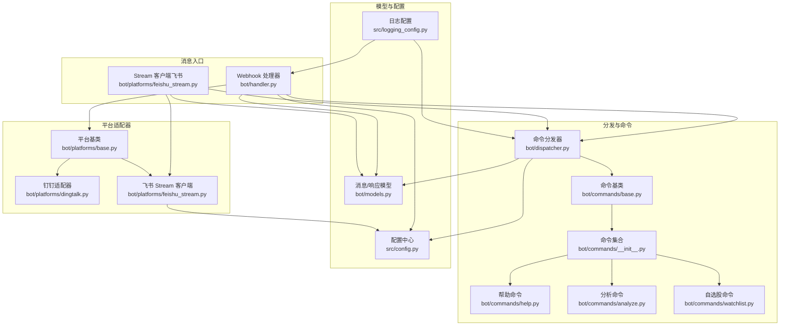
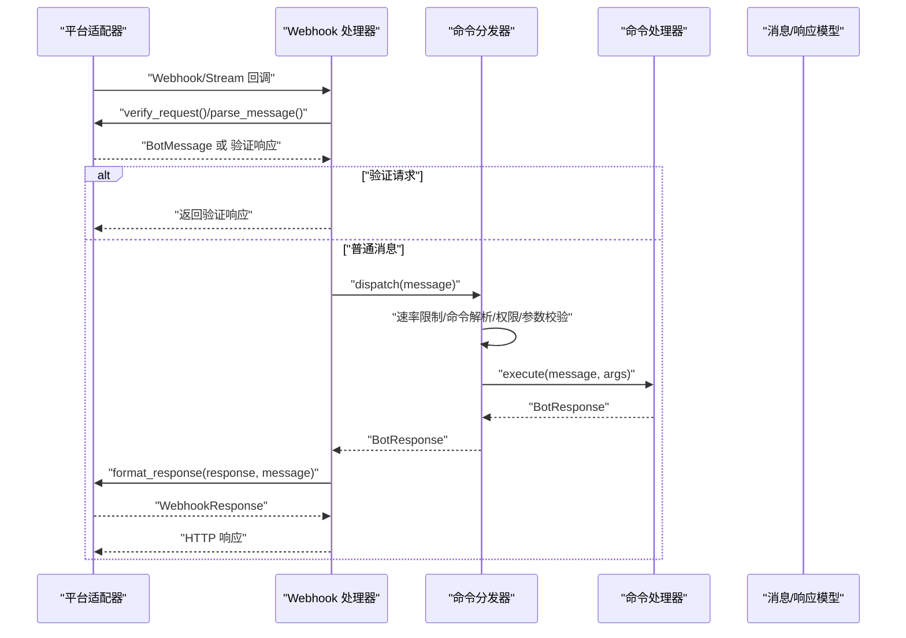
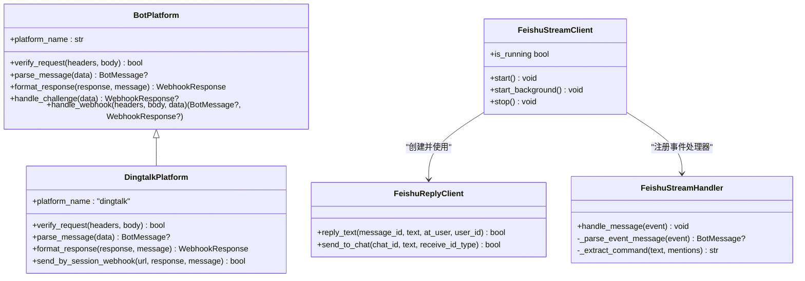
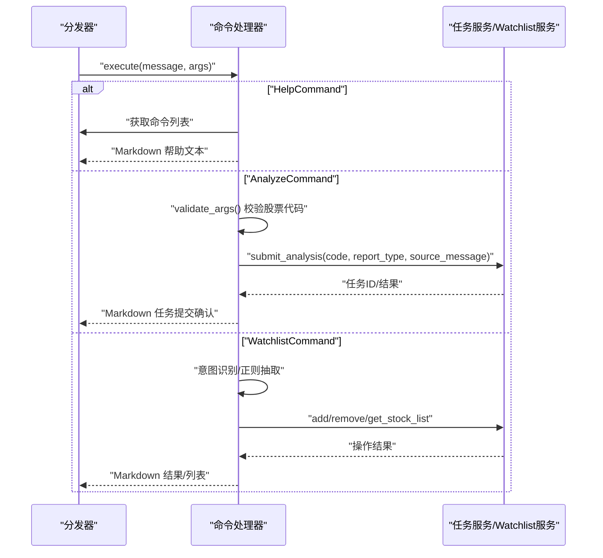
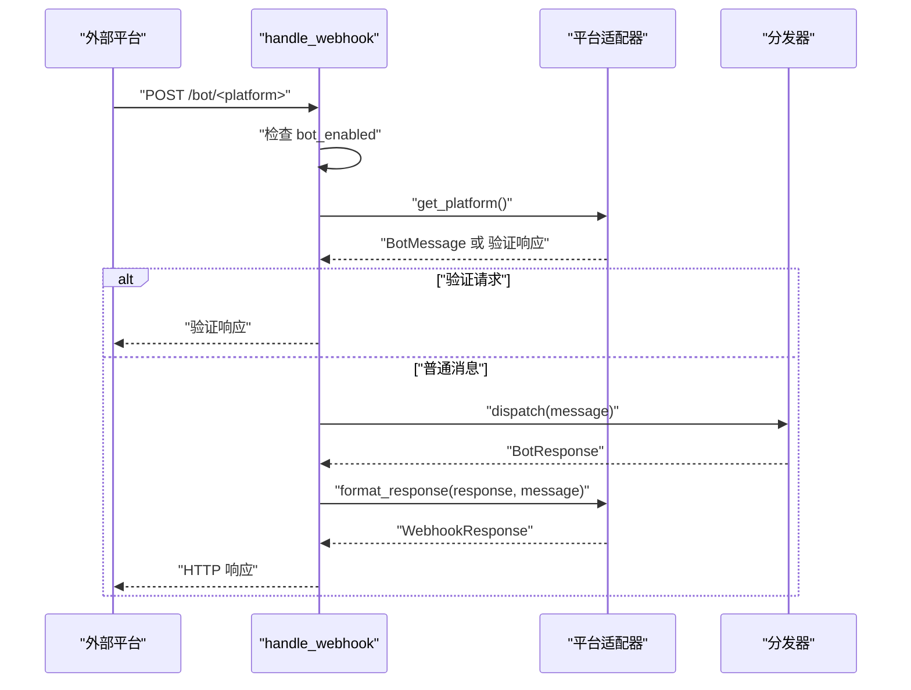
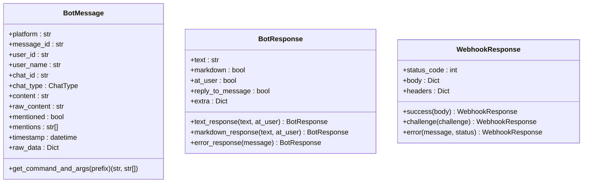
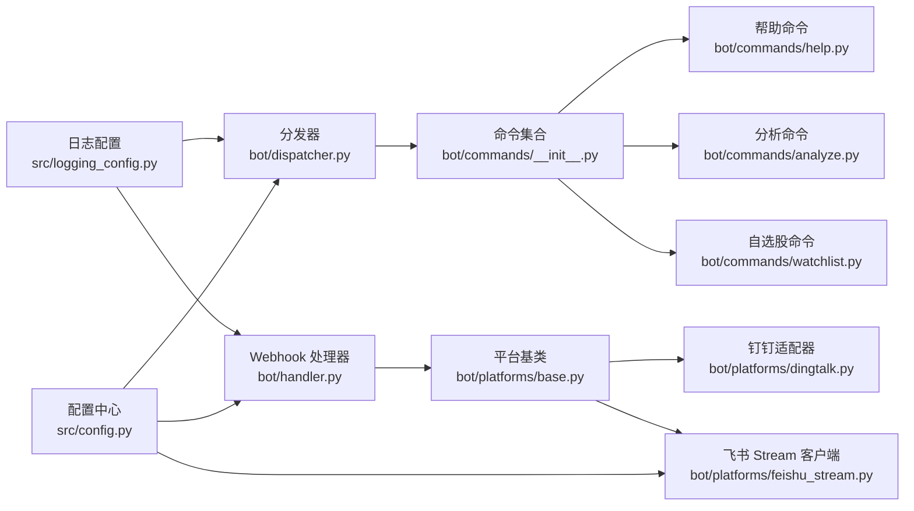

# 消息分发器

<cite>
**本文引用的文件**
- [dispatcher.py](file://bot/dispatcher.py)
- [handler.py](file://bot/handler.py)
- [models.py](file://bot/models.py)
- [base.py](file://bot/platforms/base.py)
- [dingtalk.py](file://bot/platforms/dingtalk.py)
- [feishu_stream.py](file://bot/platforms/feishu_stream.py)
- [__init__.py](file://bot/platforms/__init__.py)
- [base.py](file://bot/commands/base.py)
- [__init__.py](file://bot/commands/__init__.py)
- [help.py](file://bot/commands/help.py)
- [analyze.py](file://bot/commands/analyze.py)
- [watchlist.py](file://bot/commands/watchlist.py)
- [config.py](file://src/config.py)
- [logging_config.py](file://src/logging_config.py)
</cite>

## 目录
1. [简介](#简介)
2. [项目结构](#项目结构)
3. [核心组件](#核心组件)
4. [架构总览](#架构总览)
5. [详细组件分析](#详细组件分析)
6. [依赖关系分析](#依赖关系分析)
7. [性能考量](#性能考量)
8. [故障排查指南](#故障排查指南)
9. [结论](#结论)
10. [附录](#附录)

## 简介
本文件面向“机器人消息分发器”的技术文档，围绕以下主题展开：
- 路由机制：命令解析、别名映射、权限与参数校验
- 优先级与负载均衡：基于滑动窗口的速率限制
- 异步消息处理：命令执行与任务提交
- 队列管理与错误恢复：异常捕获与降级响应
- 消息过滤、内容解析与上下文提取：跨平台统一模型
- 性能优化、并发控制与资源管理：日志、配置与SDK集成
- 配置选项、扩展接口与故障排除

## 项目结构
消息分发相关的核心模块位于 bot 目录，配合平台适配器、命令处理器、统一消息模型以及配置中心协同工作。



**图表来源**
- [handler.py:50-139](file://bot/handler.py#L50-L139)
- [feishu_stream.py:455-640](file://bot/platforms/feishu_stream.py#L455-L640)
- [base.py:16-154](file://bot/platforms/base.py#L16-L154)
- [dingtalk.py:28-315](file://bot/platforms/dingtalk.py#L28-L315)
- [dispatcher.py:79-343](file://bot/dispatcher.py#L79-L343)
- [base.py:16-129](file://bot/commands/base.py#L16-L129)
- [__init__.py:18-38](file://bot/commands/__init__.py#L18-L38)
- [models.py:32-185](file://bot/models.py#L32-L185)
- [config.py:200-225](file://src/config.py#L200-L225)
- [logging_config.py:52-156](file://src/logging_config.py#L52-L156)

**章节来源**
- [handler.py:1-139](file://bot/handler.py#L1-L139)
- [feishu_stream.py:1-640](file://bot/platforms/feishu_stream.py#L1-L640)
- [base.py:16-154](file://bot/platforms/base.py#L16-L154)
- [dingtalk.py:1-315](file://bot/platforms/dingtalk.py#L1-L315)
- [dispatcher.py:1-343](file://bot/dispatcher.py#L1-L343)
- [base.py:16-129](file://bot/commands/base.py#L16-L129)
- [__init__.py:18-38](file://bot/commands/__init__.py#L18-L38)
- [models.py:1-185](file://bot/models.py#L1-L185)
- [config.py:1-580](file://src/config.py#L1-L580)
- [logging_config.py:1-156](file://src/logging_config.py#L1-L156)

## 核心组件
- 命令分发器：负责注册/注销命令、解析命令与参数、权限与参数校验、执行与错误处理、速率限制。
- 平台适配器：统一 Webhook/Stream 的签名验证、消息解析、响应格式化。
- 命令处理器：具体业务命令的实现，如帮助、分析、自选股等。
- 消息模型：统一跨平台的消息与响应结构，屏蔽平台差异。
- 配置中心：集中管理机器人开关、命令前缀、速率限制、平台密钥等。
- 日志系统：统一日志格式与输出，便于问题定位。

**章节来源**
- [dispatcher.py:79-343](file://bot/dispatcher.py#L79-L343)
- [base.py:16-154](file://bot/platforms/base.py#L16-L154)
- [base.py:16-129](file://bot/commands/base.py#L16-L129)
- [models.py:32-185](file://bot/models.py#L32-L185)
- [config.py:200-225](file://src/config.py#L200-L225)
- [logging_config.py:52-156](file://src/logging_config.py#L52-L156)

## 架构总览
消息从平台适配器进入，经 Webhook 或 Stream 统一解析为 BotMessage，再由分发器解析命令、校验权限与参数，最终调用对应命令处理器执行，并将响应格式化回传给平台。



**图表来源**
- [handler.py:50-139](file://bot/handler.py#L50-L139)
- [base.py:119-154](file://bot/platforms/base.py#L119-L154)
- [dispatcher.py:230-291](file://bot/dispatcher.py#L230-L291)
- [models.py:119-185](file://bot/models.py#L119-L185)

## 详细组件分析

### 命令分发器与速率限制
- 注册/注销命令：支持命令名与别名注册，冲突时覆盖并记录告警；支持类注册自动实例化。
- 命令解析：支持英文命令前缀与中文自然语言命令；支持 @机器人 场景。
- 权限控制：管理员命令需管理员身份；管理员列表来自配置。
- 参数校验：命令处理器可自定义参数校验，失败时返回错误响应。
- 执行与异常：执行过程捕获异常并返回统一错误响应，同时记录异常堆栈。
- 速率限制：基于滑动窗口的简单限流器，按用户维度统计窗口内请求数。

```mermaid
flowchart TD
Start(["进入 dispatch"]) --> RL["检查速率限制"]
RL --> Allowed{"允许请求？"}
Allowed --> |否| RLError["返回限流错误响应"]
Allowed --> |是| Parse["解析命令与参数"]
Parse --> IsCmd{"是否命令？"}
IsCmd --> |否且被@| MentionResp["返回引导帮助文本"]
IsCmd --> |否| Noop["返回空响应"]
IsCmd --> |是| Find["查找命令处理器"]
Find --> Found{"找到？"}
Found --> |否| Unknown["返回未知命令错误"]
Found --> |是| Admin{"管理员命令且非管理员？"}
Admin --> |是| NeedAdmin["返回权限不足错误"]
Admin --> |否| Argv["参数校验"]
Argv --> ArgOK{"校验通过？"}
ArgOK --> |否| ArgErr["返回参数错误与用法"]
ArgOK --> |是| Exec["执行命令 execute()"]
Exec --> ExecOK{"执行成功？"}
ExecOK --> |否| ExecErr["记录异常并返回错误响应"]
ExecOK --> |是| Done["返回 BotResponse"]
```

**图表来源**
- [dispatcher.py:230-291](file://bot/dispatcher.py#L230-L291)
- [dispatcher.py:21-77](file://bot/dispatcher.py#L21-L77)

**章节来源**
- [dispatcher.py:79-343](file://bot/dispatcher.py#L79-L343)

### 平台适配器与消息解析
- 平台基类：定义 verify_request、parse_message、format_response 三件套；统一 handle_webhook 流程。
- 钉钉适配器：实现签名验证、消息解析（文本、@信息、会话类型）、响应格式化；支持 sessionWebhook 异步发送。
- 飞书 Stream：使用 lark-oapi SDK，WebSocket 长连接；自动重连与心跳；消息解析与回复客户端；内容超长自动分段发送。



**图表来源**
- [base.py:16-154](file://bot/platforms/base.py#L16-L154)
- [dingtalk.py:28-315](file://bot/platforms/dingtalk.py#L28-L315)
- [feishu_stream.py:56-640](file://bot/platforms/feishu_stream.py#L56-L640)

**章节来源**
- [base.py:16-154](file://bot/platforms/base.py#L16-L154)
- [dingtalk.py:28-315](file://bot/platforms/dingtalk.py#L28-L315)
- [feishu_stream.py:56-640](file://bot/platforms/feishu_stream.py#L56-L640)

### 命令处理器与执行流程
- 命令基类：定义 name、aliases、description、usage、hidden、admin_only、execute、validate_args、get_help_text 等。
- 帮助命令：动态获取命令列表，支持列出与详情展示。
- 分析命令：参数校验股票代码格式，提交异步分析任务，返回任务信息。
- 自选股命令：自然语言意图识别，支持添加/删除/查看，中文别名与自然语言解析。



**图表来源**
- [base.py:16-129](file://bot/commands/base.py#L16-L129)
- [help.py:44-128](file://bot/commands/help.py#L44-L128)
- [analyze.py:68-108](file://bot/commands/analyze.py#L68-L108)
- [watchlist.py:52-265](file://bot/commands/watchlist.py#L52-L265)

**章节来源**
- [base.py:16-129](file://bot/commands/base.py#L16-L129)
- [help.py:16-128](file://bot/commands/help.py#L16-L128)
- [analyze.py:21-108](file://bot/commands/analyze.py#L21-L108)
- [watchlist.py:21-265](file://bot/commands/watchlist.py#L21-L265)

### Webhook 入口与平台路由
- Webhook 处理器：统一入口 handle_webhook，支持飞书/钉钉/企业微信/Telegram；先检查机器人开关，再获取平台适配器，解析 JSON，处理验证请求，解析消息，分发到分发器，格式化响应。
- 平台注册：平台适配器集中注册在 __init__.py，按平台名映射到类。



**图表来源**
- [handler.py:50-139](file://bot/handler.py#L50-L139)
- [__init__.py:17-74](file://bot/platforms/__init__.py#L17-L74)

**章节来源**
- [handler.py:1-139](file://bot/handler.py#L1-L139)
- [__init__.py:17-74](file://bot/platforms/__init__.py#L17-L74)

### 消息模型与上下文提取
- BotMessage：统一字段包括平台、消息ID、用户ID/名称、会话ID/类型、内容、@信息、时间戳、原始数据等；提供 get_command_and_args 支持英文前缀与中文自然语言命令解析。
- BotResponse：统一文本、Markdown、@用户、回复原消息等字段；提供便捷构造方法。
- WebhookResponse：统一 HTTP 响应结构，支持成功、挑战、错误。



**图表来源**
- [models.py:32-185](file://bot/models.py#L32-L185)

**章节来源**
- [models.py:1-185](file://bot/models.py#L1-L185)

## 依赖关系分析
- 分发器依赖命令集合与配置中心，动态注册命令并读取机器人配置。
- 平台适配器依赖配置中心读取密钥与开关；飞书 Stream 客户端依赖 lark-oapi SDK。
- 命令处理器依赖服务层（如任务服务、自选股服务）执行业务逻辑。
- 日志系统贯穿所有模块，统一输出格式与级别。



**图表来源**
- [config.py:200-225](file://src/config.py#L200-L225)
- [dispatcher.py:308-343](file://bot/dispatcher.py#L308-L343)
- [handler.py:70-118](file://bot/handler.py#L70-L118)
- [feishu_stream.py:455-640](file://bot/platforms/feishu_stream.py#L455-L640)
- [__init__.py:18-38](file://bot/commands/__init__.py#L18-L38)
- [logging_config.py:52-156](file://src/logging_config.py#L52-L156)

**章节来源**
- [config.py:1-580](file://src/config.py#L1-L580)
- [dispatcher.py:1-343](file://bot/dispatcher.py#L1-L343)
- [handler.py:1-139](file://bot/handler.py#L1-L139)
- [feishu_stream.py:1-640](file://bot/platforms/feishu_stream.py#L1-L640)
- [__init__.py:1-38](file://bot/commands/__init__.py#L1-L38)
- [logging_config.py:1-156](file://src/logging_config.py#L1-L156)

## 性能考量
- 速率限制：滑动窗口限流按用户维度统计，避免单用户刷屏；可通过配置调整窗口大小与请求数上限。
- 平台响应：钉钉支持 sessionWebhook 异步发送；飞书 Stream 客户端内置自动重连与心跳，减少网络波动影响。
- 内容分段：飞书回复客户端对超长内容按字节分段发送，避免平台限制导致失败。
- 日志级别：统一日志格式与轮转，降低第三方库噪声；调试模式可开启更详细日志。
- 并发与防封禁：配置中心提供 max_workers 等参数，用于整体并发控制与防封禁策略。

**章节来源**
- [dispatcher.py:21-77](file://bot/dispatcher.py#L21-L77)
- [dingtalk.py:243-315](file://bot/platforms/dingtalk.py#L243-L315)
- [feishu_stream.py:180-254](file://bot/platforms/feishu_stream.py#L180-L254)
- [logging_config.py:52-156](file://src/logging_config.py#L52-L156)
- [config.py:152-156](file://src/config.py#L152-L156)

## 故障排查指南
- Webhook 未触发或无响应
  - 检查机器人开关与平台密钥配置；确认回调地址与验证流程。
  - 关注 Webhook 处理器日志，确认是否返回验证响应或空响应。
- 命令无效或参数错误
  - 确认命令前缀与别名；查看帮助命令输出；检查命令参数校验。
- 速率限制频繁
  - 调整 bot_rate_limit_requests 与 bot_rate_limit_window；观察剩余配额。
- 飞书/钉钉发送失败
  - 飞书：检查 app_id/app_secret、verification_token、encrypt_key；关注分段发送日志。
  - 钉钉：检查 app_key/app_secret、时间戳有效性；确认 sessionWebhook 可用。
- 异常与错误响应
  - 分发器捕获异常并返回统一错误响应；查看日志堆栈定位问题。

**章节来源**
- [handler.py:70-118](file://bot/handler.py#L70-L118)
- [dispatcher.py:230-291](file://bot/dispatcher.py#L230-L291)
- [feishu_stream.py:541-608](file://bot/platforms/feishu_stream.py#L541-L608)
- [dingtalk.py:53-97](file://bot/platforms/dingtalk.py#L53-L97)

## 结论
本消息分发器通过统一模型与平台适配器，实现了跨平台、可扩展、可配置的消息处理链路。结合速率限制、内容分段与日志体系，能够在保证稳定性的同时提供良好的用户体验。通过命令注册机制与配置中心，系统具备清晰的扩展点与运维入口。

## 附录

### 配置选项（机器人相关）
- 机器人总开关：bot_enabled
- 命令前缀：bot_command_prefix
- 速率限制：bot_rate_limit_requests、bot_rate_limit_window
- 管理员用户：bot_admin_users
- 飞书 Stream 开关：feishu_stream_enabled
- 钉钉 Stream 开关：dingtalk_stream_enabled
- 平台密钥：feishu_app_id、feishu_app_secret、dingtalk_app_key、dingtalk_app_secret

**章节来源**
- [config.py:200-225](file://src/config.py#L200-L225)

### 扩展接口
- 新增平台适配器：继承 BotPlatform，实现 verify_request、parse_message、format_response。
- 新增命令：继承 BotCommand，实现 execute 与可选 validate_args；在命令集合中注册。

**章节来源**
- [base.py:16-154](file://bot/platforms/base.py#L16-L154)
- [base.py:16-129](file://bot/commands/base.py#L16-L129)
- [__init__.py:18-38](file://bot/commands/__init__.py#L18-L38)