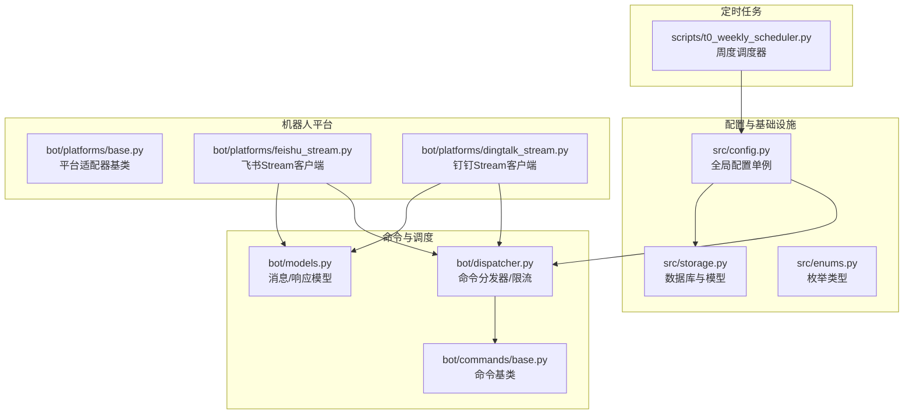
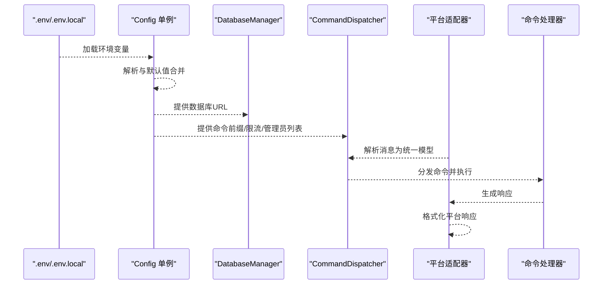
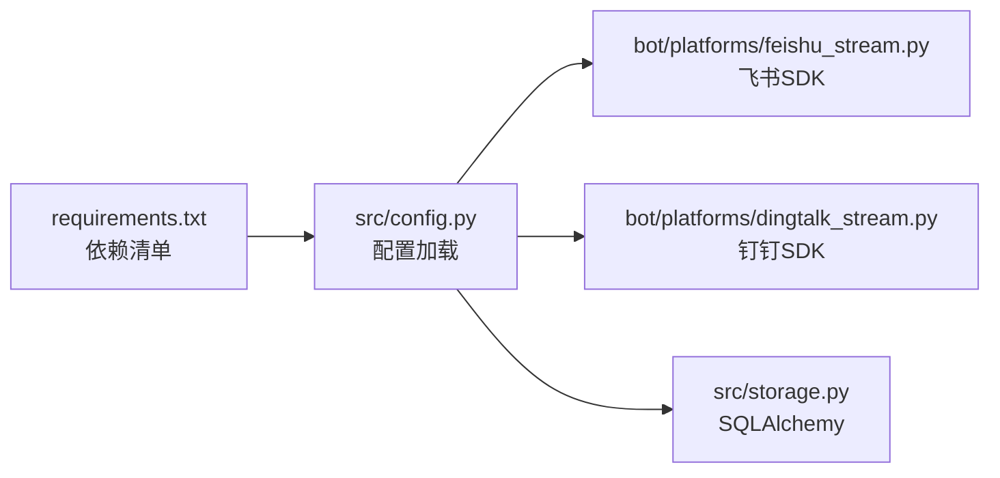

# 配置管理

<cite>
**本文引用的文件**
- [src/config.py](file://src/config.py)
- [src/storage.py](file://src/storage.py)
- [src/enums.py](file://src/enums.py)
- [bot/models.py](file://bot/models.py)
- [bot/dispatcher.py](file://bot/dispatcher.py)
- [bot/platforms/base.py](file://bot/platforms/base.py)
- [bot/platforms/feishu_stream.py](file://bot/platforms/feishu_stream.py)
- [bot/platforms/dingtalk_stream.py](file://bot/platforms/dingtalk_stream.py)
- [bot/commands/base.py](file://bot/commands/base.py)
- [scripts/t0_weekly_scheduler.py](file://scripts/t0_weekly_scheduler.py)
- [requirements.txt](file://requirements.txt)
</cite>

## 目录
1. [简介](#简介)
2. [项目结构](#项目结构)
3. [核心组件](#核心组件)
4. [架构总览](#架构总览)
5. [详细组件分析](#详细组件分析)
6. [依赖分析](#依赖分析)
7. [性能考量](#性能考量)
8. [故障排查指南](#故障排查指南)
9. [结论](#结论)
10. [附录](#附录)

## 简介
本文件面向“机器人配置管理系统”，围绕以下目标展开：  
- 全面梳理系统配置的数据模型、字段定义与验证规则  
- 解释配置项的分类管理：平台配置、命令配置、通知配置等  
- 阐述配置的动态加载、热更新与版本管理机制  
- 覆盖配置的安全存储、加密保护与访问控制策略  
- 提供配置的导入导出、备份恢复与迁移工具建议  
- 记录配置变更的日志审计、影响分析与回滚机制  
- 总结最佳实践、常见问题与故障排除指南  

## 项目结构
本项目采用“分层+功能域”混合组织方式：  
- 配置与基础设施：src/config.py、src/storage.py、src/enums.py  
- 机器人平台与命令：bot/platforms/*、bot/commands/*、bot/dispatcher.py、bot/models.py  
- 定时任务与运维：scripts/t0_weekly_scheduler.py  
- 依赖声明：requirements.txt  

图表来源
- [src/config.py:1-580](file://src/config.py#L1-L580)
- [src/storage.py:1-2000](file://src/storage.py#L1-L2000)
- [src/enums.py:1-51](file://src/enums.py#L1-L51)
- [bot/platforms/base.py:1-154](file://bot/platforms/base.py#L1-L154)
- [bot/platforms/feishu_stream.py:1-640](file://bot/platforms/feishu_stream.py#L1-L640)
- [bot/platforms/dingtalk_stream.py:1-347](file://bot/platforms/dingtalk_stream.py#L1-L347)
- [bot/commands/base.py:1-129](file://bot/commands/base.py#L1-L129)
- [bot/dispatcher.py:1-343](file://bot/dispatcher.py#L1-L343)
- [scripts/t0_weekly_scheduler.py:1-227](file://scripts/t0_weekly_scheduler.py#L1-L227)

章节来源
- [src/config.py:1-580](file://src/config.py#L1-L580)
- [src/storage.py:1-2000](file://src/storage.py#L1-L2000)
- [bot/platforms/base.py:1-154](file://bot/platforms/base.py#L1-L154)
- [bot/dispatcher.py:1-343](file://bot/dispatcher.py#L1-L343)
- [scripts/t0_weekly_scheduler.py:1-227](file://scripts/t0_weekly_scheduler.py#L1-L227)

## 核心组件
- 全局配置单例：集中管理所有系统配置，支持从 .env 加载、默认值与运行时热读取  
- 数据库与模型：封装 SQLite 连接、ORM 模型与事务管理，支撑分析历史、回测结果等持久化  
- 平台适配器：抽象统一的消息解析、签名验证与响应格式化，屏蔽平台差异  
- 命令分发器：解析命令、参数校验、权限控制、频率限制，并委派给具体命令处理器  
- 消息/响应模型：统一跨平台的消息与响应结构，便于命令处理与平台适配  
- 定时任务调度器：基于 schedule 的周度/日度任务，支持优雅退出与异常处理  

章节来源
- [src/config.py:31-580](file://src/config.py#L31-L580)
- [src/storage.py:623-746](file://src/storage.py#L623-L746)
- [bot/platforms/base.py:16-154](file://bot/platforms/base.py#L16-L154)
- [bot/dispatcher.py:79-343](file://bot/dispatcher.py#L79-L343)
- [bot/models.py:32-185](file://bot/models.py#L32-L185)
- [scripts/t0_weekly_scheduler.py:67-227](file://scripts/t0_weekly_scheduler.py#L67-L227)

## 架构总览
配置管理贯穿“加载—验证—应用—热更新—持久化—通知—调度”的闭环。

图表来源
- [src/config.py:20-473](file://src/config.py#L20-L473)
- [src/storage.py:623-746](file://src/storage.py#L623-L746)
- [bot/dispatcher.py:230-291](file://bot/dispatcher.py#L230-L291)
- [bot/platforms/base.py:119-154](file://bot/platforms/base.py#L119-L154)

## 详细组件分析

### 配置数据模型与字段定义
- 配置类采用 dataclass，字段覆盖：自选股、AI分析、搜索引擎、通知渠道、数据库、回测、日志、系统、机器人、实时行情、流控、WebUI、定时任务等  
- 关键字段示例（非完整列表）：  
  - 自选股：stock_list  
  - AI分析：gemini_*、openai_*、模型温度、请求延时与重试  
  - 搜索引擎：bocha_api_keys、tavily_api_keys、brave_api_keys、serpapi_keys  
  - 通知渠道：wechat_webhook_url、feishu_webhook_url、telegram_*、email_*、pushover_*、custom_webhook_*、discord_*、astrbot_*、pushplus_*、serverchan3_*  
  - 数据库：database_path、save_context_snapshot  
  - 回测：backtest_*  
  - 日志：log_dir、log_level  
  - 系统：max_workers、debug、http_proxy/https_proxy  
  - 定时任务：schedule_enabled、schedule_time、market_review_enabled  
  - 实时行情：enable_realtime_quote、enable_chip_distribution、realtime_source_priority、realtime_cache_ttl、circuit_breaker_cooldown  
  - 机器人：bot_enabled、bot_command_prefix、bot_rate_limit_*、bot_admin_users、feishu_*、dingtalk_*、wecom_*、telegram_webhook_secret、discord_bot_status  
  - WebUI：webui_enabled、webui_host、webui_port  

章节来源
- [src/config.py:31-468](file://src/config.py#L31-L468)

### 配置验证规则
- 验证逻辑包括：自选股列表、AI API Key、搜索引擎 Key、通知渠道等缺失时给出提示  
- 返回警告列表，便于启动阶段发现潜在风险  

章节来源
- [src/config.py:507-546](file://src/config.py#L507-L546)

### 动态加载与热更新
- 单例模式：Config.get_instance() 保证全局唯一  
- 环境变量优先：setup_env() 从 .env 加载，支持 NO_PROXY 智能注入  
- 运行时热读取：refresh_stock_list() 从 .env 文件重新读取 STOCK_LIST，支持容器内 .env 变更即时生效  
- 代理智能配置：自动为国内数据源域名设置 NO_PROXY，避免代理导致行情获取失败  

章节来源
- [src/config.py:20-473](file://src/config.py#L20-L473)

### 版本管理机制
- 配置版本未在代码中显式维护；可通过 .env 文件版本化管理（建议配合 Git）  
- 回测版本：backtest_engine_version  
- 建议：引入配置版本字段并在升级时进行兼容性检查与迁移脚本  

章节来源
- [src/config.py:144-144](file://src/config.py#L144-L144)

### 安全存储、加密保护与访问控制
- 敏感配置通过 .env 文件集中管理，建议：  
  - 使用独立 .env 文件（如 .env.production）并加入 .gitignore  
  - 在 CI/CD 中使用受控的密钥管理（如 GitHub Secrets、Vault）注入环境变量  
  - 限制 .env 文件权限（仅部署用户可读）  
- 加密保护：未见内置加密实现，建议对 .env 内容进行外部加密存储，运行时解密注入  
- 访问控制：  
  - 机器人管理员列表：bot_admin_users  
  - 平台回调签名验证：平台适配器基类提供 verify_request 抽象，需在各平台实现中完成  
  - Webhook 认证：custom_webhook_bearer_token 用于自定义 Webhook 认证  

章节来源
- [src/config.py:403-425](file://src/config.py#L403-L425)
- [bot/platforms/base.py:54-68](file://bot/platforms/base.py#L54-L68)

### 导入导出、备份恢复与迁移
- 导入导出：未见内置导入导出工具；建议通过 .env 文件与数据库备份实现  
  - .env 导出：备份 .env 文件  
  - .env 导入：替换 .env 文件并重启服务  
  - 数据库备份：SQLite 文件直接复制（建议在关闭服务时进行）  
- 备份恢复：  
  - .env 备份：版本化管理  
  - 数据库备份：定期复制 SQLite 文件  
- 迁移工具：未见专用迁移脚本；建议编写基于 .env 版本号的迁移器，或在升级流程中提供迁移说明  

章节来源
- [src/storage.py:623-746](file://src/storage.py#L623-L746)
- [requirements.txt:1-65](file://requirements.txt#L1-L65)

### 日志审计、影响分析与回滚
- 日志：日志目录与级别通过配置项控制  
- 影响分析：  
  - 通知渠道缺失时，系统会给出提示，避免静默失败  
  - 回测开关与参数影响分析结果的生成与评估  
- 回滚机制：  
  - .env 回滚：切换到上一个 .env 版本  
  - 数据库回滚：通过备份文件替换 SQLite 文件（需停服）  
  - 建议：为关键配置变更增加注释与变更记录，便于追溯  

章节来源
- [src/config.py:147-149](file://src/config.py#L147-L149)
- [src/config.py:507-546](file://src/config.py#L507-L546)

### 平台配置分类管理
- 飞书（Webhook/Stream）：feishu_app_id、feishu_app_secret、feishu_webhook_url、feishu_verification_token、feishu_encrypt_key、feishu_stream_enabled  
- 钉钉（Webhook/Stream）：dingtalk_app_key、dingtalk_app_secret、dingtalk_stream_enabled  
- 企业微信：wecom_corpid、wecom_token、wecom_encoding_aes_key、wecom_agent_id  
- Telegram：telegram_bot_token、telegram_chat_id、telegram_message_thread_id、telegram_webhook_secret  
- Discord：discord_bot_token、discord_main_channel_id、discord_webhook_url、discord_bot_status  
- 自定义 Webhook：custom_webhook_urls、custom_webhook_bearer_token  
- 通知类型：single_stock_notify、report_type  
- 企业微信消息类型与长度：wechat_msg_type、wechat_max_bytes  

章节来源
- [src/config.py:77-125](file://src/config.py#L77-L125)
- [src/config.py:200-228](file://src/config.py#L200-L228)
- [bot/platforms/feishu_stream.py:489-494](file://bot/platforms/feishu_stream.py#L489-L494)
- [bot/platforms/dingtalk_stream.py:223-229](file://bot/platforms/dingtalk_stream.py#L223-L229)

### 命令配置与权限控制
- 命令前缀：bot_command_prefix  
- 频率限制：bot_rate_limit_requests、bot_rate_limit_window  
- 管理员列表：bot_admin_users  
- 命令基类：提供名称、别名、描述、用法、隐藏与管理员权限等元信息  
- 分发器：解析命令、参数校验、权限检查、限流、异常处理与帮助命令集成  

章节来源
- [src/config.py:200-206](file://src/config.py#L200-L206)
- [bot/dispatcher.py:79-343](file://bot/dispatcher.py#L79-L343)
- [bot/commands/base.py:16-129](file://bot/commands/base.py#L16-L129)

### 通知配置与消息格式
- 通知渠道：企业微信、飞书、Telegram、邮件、Pushover、PushPlus、Server酱、Discord、自定义 Webhook、AstrBot  
- 消息长度限制：feishu_max_bytes、wechat_max_bytes  
- 消息类型：wechat_msg_type（markdown/text）  
- 消息模型：BotMessage、BotResponse、WebhookResponse，统一跨平台消息与响应结构  

章节来源
- [src/config.py:77-133](file://src/config.py#L77-L133)
- [bot/models.py:32-185](file://bot/models.py#L32-L185)

### 数据库与持久化
- 数据库管理器：DatabaseManager 单例，创建引擎、Session 工厂与表  
- 数据模型：StockDaily、NewsIntel、AnalysisHistory、BacktestResult、BacktestSummary 等  
- 事务与上下文：session_scope 提供事务作用域，has_today_data、save_daily_data、get_latest_data 等辅助方法  

章节来源
- [src/storage.py:623-746](file://src/storage.py#L623-L746)
- [src/storage.py:64-568](file://src/storage.py#L64-L568)

### 定时任务与调度
- 周度调度器：WeeklyScheduler 基于 schedule，支持每周固定时间执行、立即执行一次、优雅退出  
- 与配置联动：从 .env 加载环境变量，结合配置项 schedule_enabled、schedule_time 控制执行  

章节来源
- [scripts/t0_weekly_scheduler.py:67-227](file://scripts/t0_weekly_scheduler.py#L67-L227)

## 依赖分析
- 配置依赖：dotenv、tenacity、sqlalchemy、schedule、exchange-calendars、lark-oapi、dingtalk-stream、fastapi/uvicorn 等  
- 配置对平台与命令的影响：  
  - 平台配置决定是否启用 Stream/Webhook  
  - 机器人配置决定命令前缀、限流与管理员权限  
  - 通知配置决定消息推送渠道与格式  
  - 数据库配置决定数据持久化位置与事务行为  

图表来源
- [requirements.txt:1-65](file://requirements.txt#L1-L65)
- [src/config.py:20-473](file://src/config.py#L20-L473)
- [bot/platforms/feishu_stream.py:33-49](file://bot/platforms/feishu_stream.py#L33-L49)
- [bot/platforms/dingtalk_stream.py:30-39](file://bot/platforms/dingtalk_stream.py#L30-L39)
- [src/storage.py:623-675](file://src/storage.py#L623-L675)

章节来源
- [requirements.txt:1-65](file://requirements.txt#L1-L65)
- [src/config.py:20-473](file://src/config.py#L20-L473)

## 性能考量
- 低并发防封禁：max_workers 控制并发，避免触发上游限流  
- 请求间隔与重试：AI 分析与数据源请求的延时与重试策略  
- 实时行情缓存：realtime_cache_ttl 降低重复请求成本  
- 数据库连接池：pool_pre_ping 保持连接健康  
- 代理智能注入：NO_PROXY 自动排除国内数据源，减少失败重试与超时  

章节来源
- [src/config.py:152-194](file://src/config.py#L152-L194)
- [src/config.py:434-436](file://src/config.py#L434-L436)
- [src/storage.py:657-662](file://src/storage.py#L657-L662)

## 故障排查指南
- 配置加载失败  
  - 检查 .env 文件是否存在与权限  
  - 确认 ENV_FILE 环境变量指向正确路径  
  - 使用 validate() 输出缺失项提示  
- 代理导致行情获取失败  
  - 确认 HTTP_PROXY/HTTPS_PROXY 设置  
  - 检查 NO_PROXY 是否包含国内数据源域名  
- 通知渠道无效  
  - 检查对应渠道的 URL/Token/密钥  
  - 验证消息长度限制与消息类型  
- 机器人命令无效  
  - 检查命令前缀与管理员列表  
  - 查看限流与权限控制  
- 数据库异常  
  - 确认 database_path 可写  
  - 检查表是否创建成功  
- 定时任务未执行  
  - 检查 schedule_enabled 与 schedule_time  
  - 查看日志心跳与下次执行时间  

章节来源
- [src/config.py:20-473](file://src/config.py#L20-L473)
- [src/config.py:507-546](file://src/config.py#L507-L546)
- [bot/dispatcher.py:240-291](file://bot/dispatcher.py#L240-L291)
- [src/storage.py:623-746](file://src/storage.py#L623-L746)
- [scripts/t0_weekly_scheduler.py:141-172](file://scripts/t0_weekly_scheduler.py#L141-L172)

## 结论
本配置管理体系以 Config 单例为核心，结合 .env 文件与运行时热读取，实现了对平台、命令、通知、数据库、回测、日志、系统、机器人、实时行情、流控、WebUI、定时任务等多维度配置的集中管理。通过验证规则、代理智能注入、消息模型统一与数据库事务封装，系统在可用性、安全性与可维护性方面具备良好基础。建议进一步完善配置版本化、加密存储、导入导出与迁移工具，并在生产环境强化密钥管理与访问控制。

## 附录
- 最佳实践  
  - 将敏感配置放入独立 .env 文件并纳入版本管理（仅保留模板）  
  - 使用 CI/CD 的密钥管理注入环境变量，避免硬编码  
  - 为关键配置变更打标签与注释，形成变更记录  
  - 定期备份 .env 与 SQLite 数据库  
  - 为通知渠道与 AI API Key 设置最小权限与限额  
- 常见问题  
  - 未配置 STOCK_LIST：系统会使用默认示例股票  
  - 未配置 AI Key：AI 分析功能不可用，系统会提示  
  - 未配置通知渠道：系统会提示但不影响其他功能  
  - 代理导致国内数据源失败：检查 NO_PROXY 设置  
- 故障排除清单  
  - 检查 .env 文件与 ENV_FILE  
  - 使用 validate() 输出缺失项  
  - 核对代理与 NO_PROXY  
  - 检查数据库路径与权限  
  - 核对机器人管理员列表与限流参数  
  - 查看定时任务日志与下次执行时间