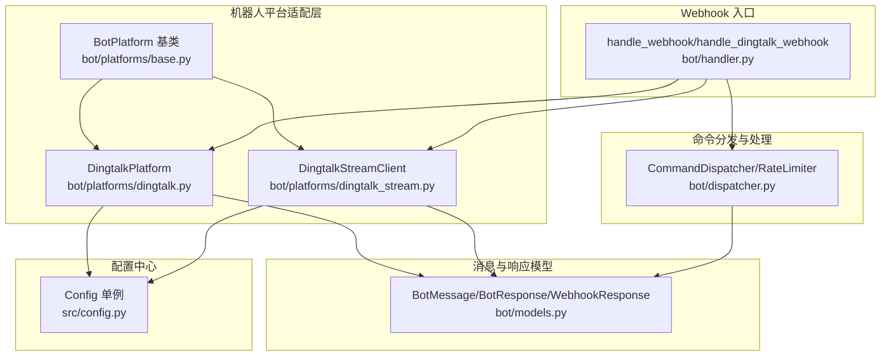
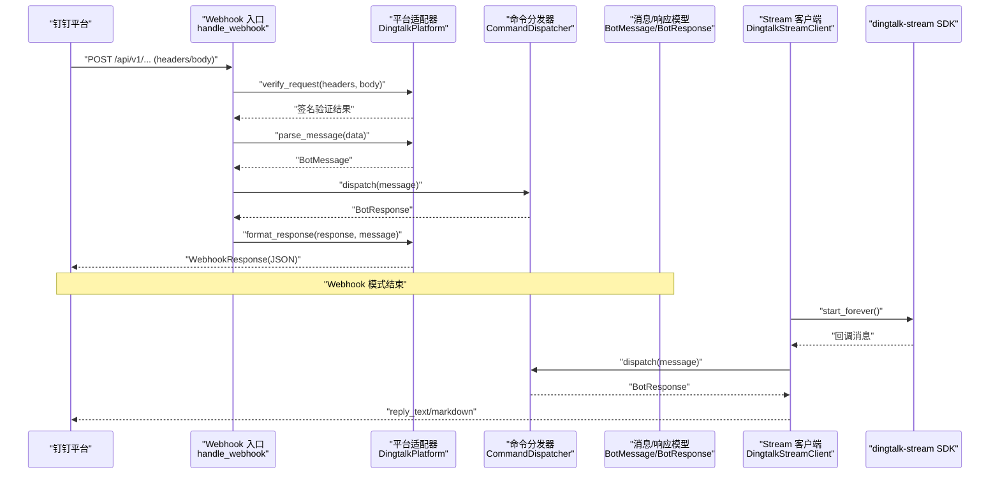
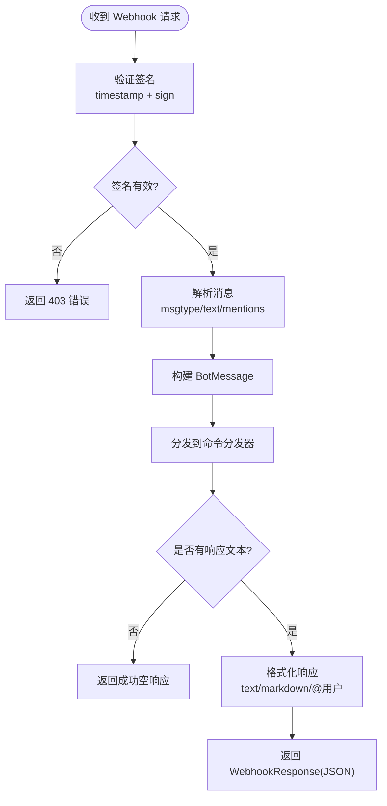
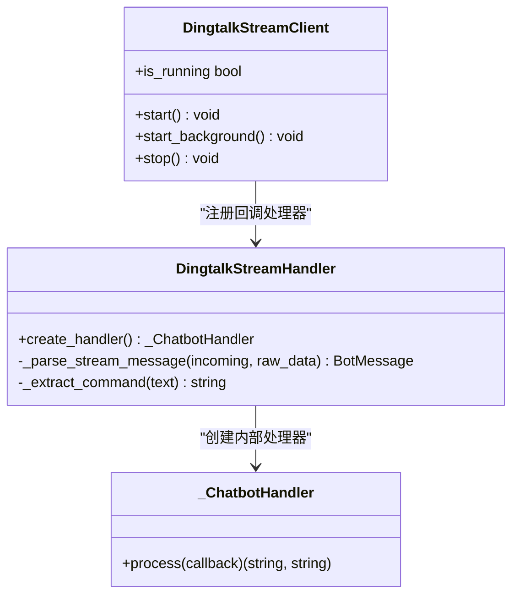
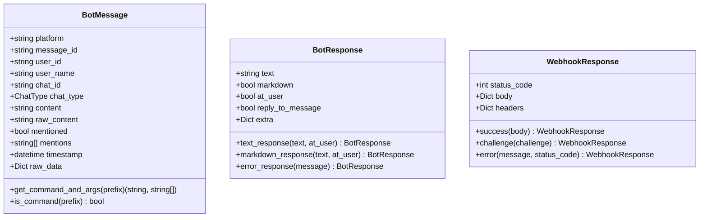
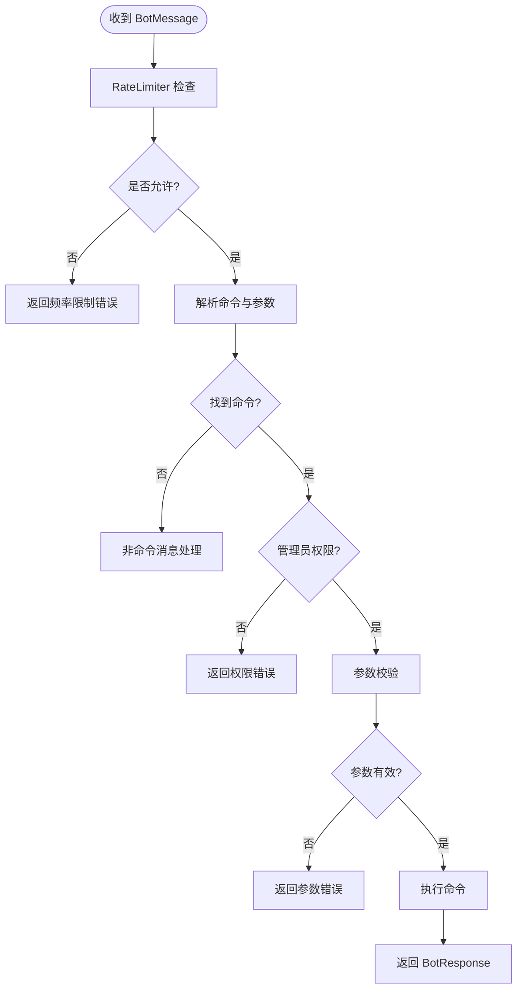
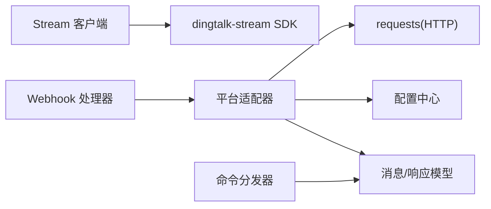

# 钉钉平台集成

<cite>
**本文档引用的文件**
- [dingtalk.py](file://bot/platforms/dingtalk.py)
- [dingtalk_stream.py](file://bot/platforms/dingtalk_stream.py)
- [models.py](file://bot/models.py)
- [dispatcher.py](file://bot/dispatcher.py)
- [handler.py](file://bot/handler.py)
- [base.py](file://bot/platforms/base.py)
- [config.py](file://src/config.py)
- [requirements.txt](file://requirements.txt)
- [dingding-bot-config.md](file://docs/bot/dingding-bot-config.md)
- [DEPLOY.md](file://docs/DEPLOY.md)
</cite>

## 目录
1. [简介](#简介)
2. [项目结构](#项目结构)
3. [核心组件](#核心组件)
4. [架构总览](#架构总览)
5. [详细组件分析](#详细组件分析)
6. [依赖关系分析](#依赖关系分析)
7. [性能考虑](#性能考虑)
8. [故障排除指南](#故障排除指南)
9. [结论](#结论)
10. [附录](#附录)

## 简介
本文件面向在钉钉平台上集成机器人的技术团队，基于现有代码库实现，提供从配置到部署、从安全验证到消息处理的完整技术文档。重点覆盖：
- 钉钉 Webhook 模式的配置方法、URL 设置与安全验证机制
- 钉钉 Stream 模式的 WebSocket 连接建立、心跳维护与消息处理流程
- 钉机器人消息格式、权限配置与群组管理
- 钉钉 API 密钥申请、应用创建与回调地址配置步骤
- 部署指南、证书配置与域名验证要求
- 消息限制、频率控制与错误码处理
- 故障排除与性能优化建议

## 项目结构
与钉钉平台集成相关的核心模块位于 bot 目录及其子模块，围绕统一的消息模型、平台适配器、命令分发器与 Webhook 处理器协同工作。

**图表来源**
- [base.py:16-154](file://bot/platforms/base.py#L16-L154)
- [dingtalk.py:28-315](file://bot/platforms/dingtalk.py#L28-L315)
- [dingtalk_stream.py:44-347](file://bot/platforms/dingtalk_stream.py#L44-L347)
- [models.py:32-185](file://bot/models.py#L32-L185)
- [dispatcher.py:79-343](file://bot/dispatcher.py#L79-L343)
- [handler.py:50-139](file://bot/handler.py#L50-L139)
- [config.py:31-437](file://src/config.py#L31-L437)

**章节来源**
- [base.py:16-154](file://bot/platforms/base.py#L16-L154)
- [dingtalk.py:28-315](file://bot/platforms/dingtalk.py#L28-L315)
- [dingtalk_stream.py:44-347](file://bot/platforms/dingtalk_stream.py#L44-L347)
- [models.py:32-185](file://bot/models.py#L32-L185)
- [dispatcher.py:79-343](file://bot/dispatcher.py#L79-L343)
- [handler.py:50-139](file://bot/handler.py#L50-L139)
- [config.py:31-437](file://src/config.py#L31-L437)

## 核心组件
- 平台适配器
  - DingtalkPlatform：处理钉钉 Webhook 回调，支持签名验证、消息解析与响应格式化，并提供 sessionWebhook 异步发送能力。
  - DingtalkStreamClient：封装钉钉 Stream SDK，提供阻塞/后台启动、自动重连与消息处理回调。
- 统一消息模型
  - BotMessage：统一跨平台消息结构，包含消息 ID、用户信息、聊天类型、内容与原始数据。
  - BotResponse：统一跨平台响应结构，支持文本/Markdown、@用户等。
  - WebhookResponse：统一 Webhook 响应结构，包含状态码、响应体与响应头。
- 命令分发器
  - CommandDispatcher：解析命令、参数校验、权限控制、频率限制与执行命令。
  - RateLimiter：基于滑动窗口的简单频率限制器。
- Webhook 处理器
  - handle_webhook：统一入口，负责平台选择、签名验证、消息解析、分发与响应格式化。
- 配置中心
  - Config：集中管理钉钉 AppKey/AppSecret、Stream 模式开关、机器人功能开关、频率限制等。

**章节来源**
- [dingtalk.py:28-315](file://bot/platforms/dingtalk.py#L28-L315)
- [dingtalk_stream.py:190-347](file://bot/platforms/dingtalk_stream.py#L190-L347)
- [models.py:32-185](file://bot/models.py#L32-L185)
- [dispatcher.py:21-77](file://bot/dispatcher.py#L21-L77)
- [handler.py:50-139](file://bot/handler.py#L50-L139)
- [config.py:212-216](file://src/config.py#L212-L216)

## 架构总览
钉钉 Webhook 与 Stream 两种接入模式的总体交互如下：

**图表来源**
- [handler.py:50-118](file://bot/handler.py#L50-L118)
- [dingtalk.py:53-97](file://bot/platforms/dingtalk.py#L53-L97)
- [dispatcher.py:230-291](file://bot/dispatcher.py#L230-L291)
- [dingtalk_stream.py:245-273](file://bot/platforms/dingtalk_stream.py#L245-L273)

## 详细组件分析

### 钉钉 Webhook 模式
- 配置要点
  - AppKey/AppSecret：用于签名验证与会话 Webhook 异步发送。
  - 机器人功能开关：通过配置中心控制是否启用机器人。
- 安全验证
  - 验证请求头中的 timestamp 与 sign，时间戳有效期为 1 小时。
  - 使用 HMAC-SHA256 对 "timestamp\napp_secret" 计算签名并与请求头中的 sign 比较。
- 消息解析
  - 仅处理 msgtype 为 text 的消息，去除 @机器人 前缀，识别群聊/私聊类型。
  - 保存 sessionWebhook 以便后续异步发送。
- 响应格式
  - 支持 text 与 markdown 两种格式，可选择是否 @发送者。
  - 若需要异步发送，可调用 send_by_session_webhook。

**图表来源**
- [dingtalk.py:53-97](file://bot/platforms/dingtalk.py#L53-L97)
- [dingtalk.py:103-181](file://bot/platforms/dingtalk.py#L103-L181)
- [dingtalk.py:195-241](file://bot/platforms/dingtalk.py#L195-L241)

**章节来源**
- [dingtalk.py:28-315](file://bot/platforms/dingtalk.py#L28-L315)
- [handler.py:50-118](file://bot/handler.py#L50-L118)
- [config.py:403-416](file://src/config.py#L403-L416)

### 钉钉 Stream 模式
- 依赖与安装
  - 通过 requirements.txt 可知需要安装 dingtalk-stream 依赖。
- 客户端启动
  - 支持阻塞启动与后台启动，具备异常捕获与自动重连机制。
  - 通过配置中心读取 AppKey/AppSecret，若缺失则抛出异常。
- 消息处理
  - 使用 dingtalk-stream SDK 的回调消息，转换为 BotMessage 并调用命令分发器。
  - 支持在群聊场景下自动拼接 @用户名 前缀进行回复。
- 会话 Webhook
  - 从原始数据中提取 sessionWebhook，便于异步推送。

**图表来源**
- [dingtalk_stream.py:190-314](file://bot/platforms/dingtalk_stream.py#L190-L314)
- [dingtalk_stream.py:80-124](file://bot/platforms/dingtalk_stream.py#L80-L124)

**章节来源**
- [dingtalk_stream.py:190-347](file://bot/platforms/dingtalk_stream.py#L190-L347)
- [requirements.txt:47-47](file://requirements.txt#L47-L47)

### 统一消息与响应模型
- BotMessage
  - 统一字段：平台标识、消息 ID、用户/聊天信息、内容、提及信息、时间戳与原始数据。
  - 提供命令解析方法，支持英文前缀与中文命令映射。
- BotResponse
  - 文本/Markdown 响应、@用户选项、错误响应工具方法。
- WebhookResponse
  - 成功/挑战/错误响应构造器，便于平台适配器返回标准格式。

**图表来源**
- [models.py:32-185](file://bot/models.py#L32-L185)

**章节来源**
- [models.py:32-185](file://bot/models.py#L32-L185)

### 命令分发与频率控制
- 命令注册与别名
  - 支持命令类注册、别名注册与帮助文本生成。
- 参数校验与权限
  - 命令可自定义参数校验，支持管理员权限控制。
- 频率限制
  - 基于滑动窗口算法，限制每个用户的请求频率，默认 60 秒内最多 10 次。

**图表来源**
- [dispatcher.py:230-291](file://bot/dispatcher.py#L230-L291)
- [dispatcher.py:21-77](file://bot/dispatcher.py#L21-L77)

**章节来源**
- [dispatcher.py:79-343](file://bot/dispatcher.py#L79-L343)

### Webhook 处理器
- 统一入口
  - handle_webhook 根据平台名称获取适配器，处理验证、解析与响应格式化。
- 平台缓存
  - 平台实例缓存避免重复创建。
- 配置联动
  - 读取配置中心判断机器人是否启用，未启用则直接返回成功响应。

**章节来源**
- [handler.py:27-118](file://bot/handler.py#L27-L118)
- [config.py:403-408](file://src/config.py#L403-L408)

## 依赖关系分析
- 平台适配器依赖
  - DingtalkPlatform 依赖配置中心读取 AppKey/AppSecret。
  - DingtalkStreamClient 依赖 dingtalk-stream SDK。
- 模块耦合
  - Webhook 处理器与平台适配器通过统一接口解耦。
  - 命令分发器与平台适配器通过消息模型解耦。
- 外部依赖
  - requests 用于 sessionWebhook 异步发送。
  - tenacity、schedule 等用于重试与定时任务（与钉钉集成无直接关系）。

**图表来源**
- [handler.py:14-16](file://bot/handler.py#L14-L16)
- [dingtalk.py:42-47](file://bot/platforms/dingtalk.py#L42-L47)
- [dingtalk_stream.py:31-38](file://bot/platforms/dingtalk_stream.py#L31-L38)
- [requirements.txt:42-46](file://requirements.txt#L42-L46)

**章节来源**
- [handler.py:14-16](file://bot/handler.py#L14-L16)
- [dingtalk.py:42-47](file://bot/platforms/dingtalk.py#L42-L47)
- [dingtalk_stream.py:31-38](file://bot/platforms/dingtalk_stream.py#L31-L38)
- [requirements.txt:42-47](file://requirements.txt#L42-L47)

## 性能考虑
- 频率限制
  - 默认每用户 60 秒最多 10 次请求，可根据业务需求调整配置项。
- 异步发送
  - Webhook 模式支持 sessionWebhook 异步发送，降低请求阻塞。
- 重连与稳定性
  - Stream 模式具备异常捕获与自动重连，提升长期运行稳定性。
- 代理与网络
  - 配置中心支持代理设置，避免网络受限影响外部 API 调用。

**章节来源**
- [dispatcher.py:28-76](file://bot/dispatcher.py#L28-L76)
- [dingtalk.py:243-315](file://bot/platforms/dingtalk.py#L243-L315)
- [dingtalk_stream.py:294-304](file://bot/platforms/dingtalk_stream.py#L294-L304)
- [config.py:259-299](file://src/config.py#L259-L299)

## 故障排除指南
- 签名验证失败
  - 检查 AppSecret 是否正确配置；确认 timestamp 与 sign 是否随请求头传递。
- 时间戳过期
  - 确认服务器时间同步，避免时差导致 1 小时有效期过期。
- 未配置 AppKey/AppSecret
  - Stream 模式启动会抛出异常；Webhook 模式签名验证会跳过。
- 机器人未启用
  - 检查配置中心 bot_enabled 开关。
- Stream 模式不可用
  - 确认已安装 dingtalk-stream 依赖；检查 AppKey/AppSecret 配置。
- 频繁请求被限制
  - 调整频率限制配置项或优化前端触发策略。

**章节来源**
- [dingtalk.py:53-97](file://bot/platforms/dingtalk.py#L53-L97)
- [dingtalk_stream.py:214-218](file://bot/platforms/dingtalk_stream.py#L214-L218)
- [config.py:403-408](file://src/config.py#L403-L408)

## 结论
本项目提供了完整的钉钉 Webhook 与 Stream 两种接入模式实现，结合统一的消息模型、命令分发与频率控制，能够满足企业内部机器人在不同网络环境下的部署需求。通过配置中心集中管理密钥与开关，配合部署文档与故障排除指南，可快速完成从开发到生产的落地。

## 附录

### 钉钉 Webhook 模式配置步骤
- 申请与创建
  - 在钉钉开放平台创建应用，获取 AppKey 与 AppSecret。
  - 在企业内部应用中添加“机器人”能力。
- 配置回调地址
  - 将 Webhook 地址指向系统的相应路由（由平台适配器处理）。
- 安全验证
  - 确保请求头包含 timestamp 与 sign，服务端将进行签名验证与时间戳有效性检查。
- 会话 Webhook 异步发送
  - 当需要异步发送或多条消息时，使用 sessionWebhook 进行发送。

**章节来源**
- [dingding-bot-config.md:1-39](file://docs/bot/dingding-bot-config.md#L1-L39)
- [dingtalk.py:53-97](file://bot/platforms/dingtalk.py#L53-L97)
- [dingtalk.py:243-315](file://bot/platforms/dingtalk.py#L243-L315)

### 钉钉 Stream 模式配置步骤
- 安装依赖
  - 确保安装 dingtalk-stream 依赖。
- 配置凭证
  - 在配置中心设置 DINGTALK_APP_KEY 与 DINGTALK_APP_SECRET。
  - 启用 DINGTALK_STREAM_ENABLED。
- 启动客户端
  - 可选择阻塞或后台启动，具备自动重连机制。
- 群组与权限
  - 机器人需加入群组并在群组中被 @ 才会触发命令。

**章节来源**
- [requirements.txt:47-47](file://requirements.txt#L47-L47)
- [config.py:413-416](file://src/config.py#L413-L416)
- [dingtalk_stream.py:245-304](file://bot/platforms/dingtalk_stream.py#L245-L304)

### 部署指南与证书要求
- 部署方案
  - 推荐使用 Docker Compose 一键部署，便于迁移与升级。
- 证书与域名
  - Webhook 模式需要公网可访问的 HTTPS 地址；Stream 模式无需公网 IP。
- 环境变量
  - 配置 DINGTALK_APP_KEY、DINGTALK_APP_SECRET、DINGTALK_STREAM_ENABLED 等。

**章节来源**
- [DEPLOY.md:18-81](file://docs/DEPLOY.md#L18-L81)
- [config.py:413-416](file://src/config.py#L413-L416)

### 消息格式与权限配置
- 消息格式
  - Webhook 模式支持 text 与 markdown；Stream 模式支持文本与 Markdown 回复。
- 权限配置
  - 通过配置中心设置管理员用户列表，命令可声明 admin_only。
- 群组管理
  - 机器人需在群组中被 @ 才会触发命令；私聊与群聊类型在消息模型中区分。

**章节来源**
- [dingtalk.py:195-241](file://bot/platforms/dingtalk.py#L195-L241)
- [dingtalk_stream.py:103-114](file://bot/platforms/dingtalk_stream.py#L103-L114)
- [models.py:16-21](file://bot/models.py#L16-L21)
- [dispatcher.py:218-228](file://bot/dispatcher.py#L218-L228)

### 频率控制与错误码处理
- 频率控制
  - 默认每用户 60 秒最多 10 次请求；可通过配置项调整。
- 错误码处理
  - Webhook 模式返回标准 HTTP 状态码与 JSON 响应体；签名失败返回 403。
  - Stream 模式异常被捕获并记录日志，随后自动重连。

**章节来源**
- [dispatcher.py:28-76](file://bot/dispatcher.py#L28-L76)
- [handler.py:140-141](file://bot/handler.py#L140-L141)
- [dingtalk.py:147-148](file://bot/platforms/dingtalk.py#L147-L148)
- [dingtalk_stream.py:299-304](file://bot/platforms/dingtalk_stream.py#L299-L304)