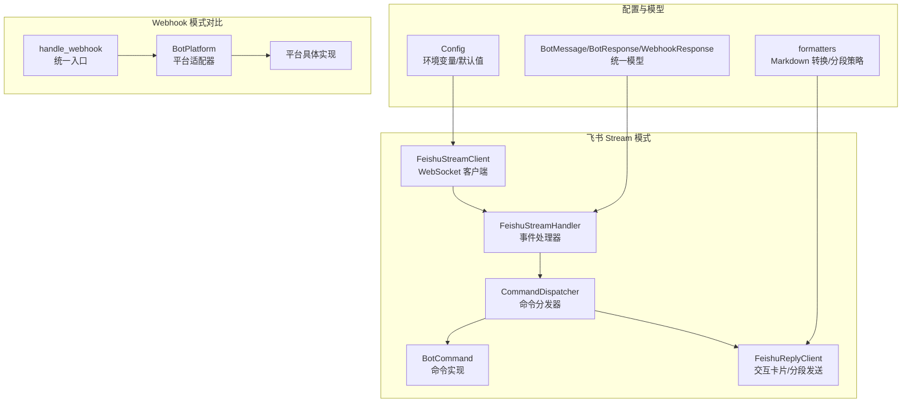
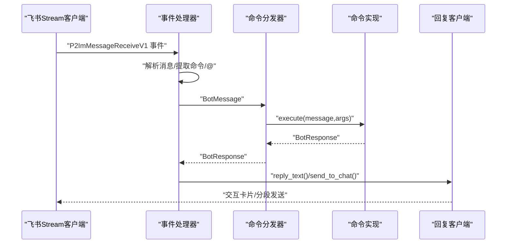
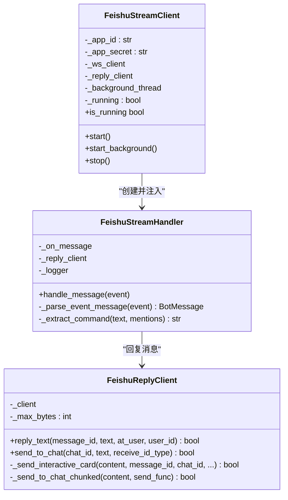
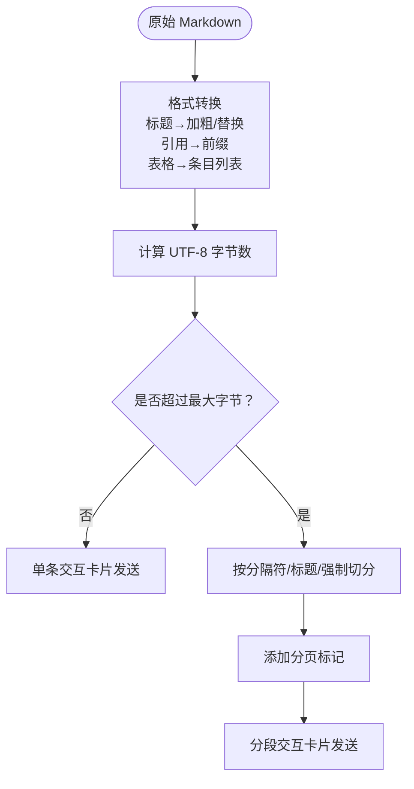
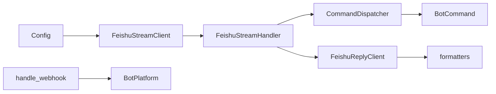

# 飞书平台集成

<cite>
**本文引用的文件**
- [bot/platforms/feishu_stream.py](file://bot/platforms/feishu_stream.py)
- [bot/platforms/base.py](file://bot/platforms/base.py)
- [bot/handler.py](file://bot/handler.py)
- [bot/dispatcher.py](file://bot/dispatcher.py)
- [bot/models.py](file://bot/models.py)
- [src/config.py](file://src/config.py)
- [src/formatters.py](file://src/formatters.py)
- [bot/platforms/__init__.py](file://bot/platforms/__init__.py)
- [bot/commands/__init__.py](file://bot/commands/__init__.py)
- [bot/commands/base.py](file://bot/commands/base.py)
- [docs/bot/feishu-bot-config.md](file://docs/bot/feishu-bot-config.md)
- [src/notification.py](file://src/notification.py)
- [src/notification_sender/feishu_sender.py](file://src/notification_sender/feishu_sender.py)
- [tests/test_feishu_stream.py](file://tests/test_feishu_stream.py)
- [tests/test_formatters.py](file://tests/test_formatters.py)
</cite>

## 目录
1. [简介](#简介)
2. [项目结构](#项目结构)
3. [核心组件](#核心组件)
4. [架构总览](#架构总览)
5. [详细组件分析](#详细组件分析)
6. [依赖分析](#依赖分析)
7. [性能考虑](#性能考虑)
8. [故障排查指南](#故障排查指南)
9. [结论](#结论)
10. [附录](#附录)

## 简介
本文件面向飞书机器人平台集成，围绕 Stream 模式的 WebSocket 长连接、事件订阅与消息路由机制展开，结合飞书应用创建、API 密钥配置与权限授权流程，系统阐述飞书机器人的消息格式、富文本与交互式卡片能力，并提供 SDK 安装配置、客户端初始化与处理器注册方法。此外，文档还涵盖部署要点（含 SSL 证书与回调地址）、速率限制与消息大小限制策略、错误处理与调试日志方法，帮助开发者快速落地飞书机器人。

## 项目结构
飞书集成位于 bot/platforms/feishu_stream.py，配合统一的消息模型、命令分发器与配置中心，形成“Stream 客户端 → 事件处理器 → 命令分发器 → 命令执行 → 回复客户端”的闭环。Webhook 模式下的处理器位于 bot/handler.py，统一入口 handle_webhook 负责平台适配与签名验证、消息解析与响应格式化。



**图表来源**
- [bot/platforms/feishu_stream.py:455-640](file://bot/platforms/feishu_stream.py#L455-L640)
- [bot/handler.py:50-139](file://bot/handler.py#L50-L139)
- [bot/dispatcher.py:79-343](file://bot/dispatcher.py#L79-L343)
- [bot/models.py:32-185](file://bot/models.py#L32-L185)
- [src/config.py:326-437](file://src/config.py#L326-L437)
- [src/formatters.py:263-428](file://src/formatters.py#L263-L428)

**章节来源**
- [bot/platforms/feishu_stream.py:1-640](file://bot/platforms/feishu_stream.py#L1-L640)
- [bot/handler.py:1-139](file://bot/handler.py#L1-L139)
- [bot/dispatcher.py:1-343](file://bot/dispatcher.py#L1-L343)
- [bot/models.py:1-185](file://bot/models.py#L1-L185)
- [src/config.py:1-580](file://src/config.py#L1-L580)
- [src/formatters.py:1-428](file://src/formatters.py#L1-L428)

## 核心组件
- 飞书 Stream 客户端：封装 lark-oapi WebSocket 客户端，自动重连与心跳保活，提供阻塞与后台两种启动方式。
- 事件处理器：将 SDK 事件转换为统一 BotMessage，过滤非文本消息，提取命令与 @ 信息，调用分发器处理并回发。
- 命令分发器：注册命令、解析命令与参数、执行命令、权限与频率限制、错误处理。
- 回复客户端：将响应内容转换为飞书交互卡片（支持 lark_md），自动分段发送与分页标记。
- 配置中心：集中管理飞书 App ID/Secret、Verification Token、Encrypt Key、消息最大字节数等。
- 模型层：统一消息与响应模型，屏蔽平台差异；支持中文命令映射与 @ 提及解析。
- 格式化工具：将通用 Markdown 转换为飞书更兼容的 lark_md 文本，提供按字节智能切分与分页标记。

**章节来源**
- [bot/platforms/feishu_stream.py:56-640](file://bot/platforms/feishu_stream.py#L56-L640)
- [bot/dispatcher.py:79-343](file://bot/dispatcher.py#L79-L343)
- [bot/models.py:32-185](file://bot/models.py#L32-L185)
- [src/config.py:326-437](file://src/config.py#L326-L437)
- [src/formatters.py:263-428](file://src/formatters.py#L263-L428)

## 架构总览
飞书 Stream 模式通过 lark-oapi SDK 建立 WebSocket 长连接，事件到达后由事件处理器解析为统一消息模型，交由命令分发器执行，最终通过回复客户端以交互卡片形式发送。配置中心贯穿始终，提供密钥、Token、消息长度限制等参数。



**图表来源**
- [bot/platforms/feishu_stream.py:301-332](file://bot/platforms/feishu_stream.py#L301-L332)
- [bot/dispatcher.py:230-291](file://bot/dispatcher.py#L230-L291)
- [bot/models.py:119-153](file://bot/models.py#L119-L153)

**章节来源**
- [bot/platforms/feishu_stream.py:301-332](file://bot/platforms/feishu_stream.py#L301-L332)
- [bot/dispatcher.py:230-291](file://bot/dispatcher.py#L230-L291)
- [bot/models.py:119-153](file://bot/models.py#L119-L153)

## 详细组件分析

### 飞书 Stream 客户端与事件处理器
- 客户端初始化：从配置读取 App ID/Secret，若未提供则抛出异常；支持传参覆盖。
- 事件处理器：注册 SDK 事件分发器，忽略非文本消息；解析 @ 提及与命令；构造 BotMessage；记录日志；调用分发器并回发。
- 启动方式：阻塞 start() 与后台 start_background()，后者具备异常捕获与自动重连。



**图表来源**
- [bot/platforms/feishu_stream.py:455-640](file://bot/platforms/feishu_stream.py#L455-L640)
- [bot/platforms/feishu_stream.py:257-453](file://bot/platforms/feishu_stream.py#L257-L453)
- [bot/platforms/feishu_stream.py:56-255](file://bot/platforms/feishu_stream.py#L56-L255)

**章节来源**
- [bot/platforms/feishu_stream.py:455-640](file://bot/platforms/feishu_stream.py#L455-L640)
- [bot/platforms/feishu_stream.py:257-453](file://bot/platforms/feishu_stream.py#L257-L453)
- [bot/platforms/feishu_stream.py:56-255](file://bot/platforms/feishu_stream.py#L56-L255)

### 命令分发器与命令模型
- 命令注册：支持类注册与实例注册，维护命令名与别名映射。
- 频率限制：基于滑动窗口算法，按用户维度限制单位时间内的请求数。
- 权限控制：管理员命令校验，支持动态增删管理员。
- 错误处理：参数校验失败、执行异常均转化为统一错误响应。
- 帮助命令：通过回调注入命令列表，支持动态生成帮助信息。

```mermaid
flowchart TD
Start(["收到 BotMessage"]) --> RL["频率限制检查"]
RL --> |超限| ER1["返回限流错误"]
RL --> |通过| Parse["解析命令与参数"]
Parse --> |非命令且未@| Skip["返回空响应"]
Parse --> |是命令| Find["查找命令处理器"]
Find --> |未找到| ER2["返回未知命令错误"]
Find --> |找到| Admin["管理员权限校验"]
Admin --> |无权限| ER3["返回权限不足错误"]
Admin --> |有权限| Validate["参数校验"]
Validate --> |失败| ER4["返回参数错误"]
Validate --> |通过| Exec["执行命令"]
Exec --> |异常| ER5["返回执行失败错误"]
Exec --> |成功| OK["返回 BotResponse"]
```

**图表来源**
- [bot/dispatcher.py:230-291](file://bot/dispatcher.py#L230-L291)
- [bot/commands/base.py:16-129](file://bot/commands/base.py#L16-L129)

**章节来源**
- [bot/dispatcher.py:79-343](file://bot/dispatcher.py#L79-L343)
- [bot/commands/base.py:16-129](file://bot/commands/base.py#L16-L129)

### 消息模型与格式化
- 统一模型：BotMessage/BotResponse/WebhookResponse，屏蔽平台差异；支持中文命令映射与 @ 提及解析。
- Markdown 转换：将通用 Markdown 转换为飞书 lark_md 更友好格式，适配标题、引用、表格等。
- 分段策略：按字节切分，确保 UTF-8 边界不被破坏；支持分页标记与智能分隔符保留。



**图表来源**
- [src/formatters.py:401-428](file://src/formatters.py#L401-L428)
- [src/formatters.py:263-383](file://src/formatters.py#L263-L383)
- [bot/platforms/feishu_stream.py:195-255](file://bot/platforms/feishu_stream.py#L195-L255)

**章节来源**
- [bot/models.py:32-185](file://bot/models.py#L32-L185)
- [src/formatters.py:263-428](file://src/formatters.py#L263-L428)
- [bot/platforms/feishu_stream.py:195-255](file://bot/platforms/feishu_stream.py#L195-L255)

### 配置与部署要点
- 配置项：FEISHU_APP_ID、FEISHU_APP_SECRET、FEISHU_VERIFICATION_TOKEN、FEISHU_ENCRYPT_KEY、FEISHU_MAX_BYTES、FEISHU_STREAM_ENABLED 等。
- SDK 安装：pip install lark-oapi。
- 部署注意：Stream 模式无需公网 IP 与 Webhook URL；若使用 Webhook 模式，需配置回调地址与验证 Token。

**章节来源**
- [src/config.py:326-437](file://src/config.py#L326-L437)
- [bot/platforms/feishu_stream.py:17-22](file://bot/platforms/feishu_stream.py#L17-L22)
- [docs/bot/feishu-bot-config.md:1-20](file://docs/bot/feishu-bot-config.md#L1-L20)

## 依赖分析
- 组件耦合：FeishuStreamClient 依赖配置中心与回复客户端；事件处理器依赖分发器；回复客户端依赖格式化工具与配置中心。
- 外部依赖：lark-oapi SDK（Stream 模式）、飞书平台事件与消息 API。
- 平台适配：Webhook 模式通过 BotPlatform 抽象与 handle_webhook 统一入口，Stream 模式独立于 Webhook。



**图表来源**
- [src/config.py:326-437](file://src/config.py#L326-L437)
- [bot/platforms/feishu_stream.py:455-640](file://bot/platforms/feishu_stream.py#L455-L640)
- [bot/handler.py:50-139](file://bot/handler.py#L50-L139)
- [bot/platforms/base.py:16-154](file://bot/platforms/base.py#L16-L154)

**章节来源**
- [bot/platforms/feishu_stream.py:455-640](file://bot/platforms/feishu_stream.py#L455-L640)
- [bot/handler.py:50-139](file://bot/handler.py#L50-L139)
- [bot/platforms/base.py:16-154](file://bot/platforms/base.py#L16-L154)

## 性能考虑
- 频率限制：默认每用户每分钟最多 10 次请求，可通过配置调整窗口与阈值。
- 消息分段：按字节切分，避免超长消息导致失败；分页标记提升可读性。
- 自动重连：Stream 客户端内置 auto_reconnect，异常时 5 秒重连一次。
- 日志级别：默认 WARNING，生产环境可降低日志级别以平衡性能与可观测性。

**章节来源**
- [bot/dispatcher.py:21-77](file://bot/dispatcher.py#L21-L77)
- [bot/platforms/feishu_stream.py:567-598](file://bot/platforms/feishu_stream.py#L567-L598)
- [src/config.py:200-225](file://src/config.py#L200-L225)

## 故障排查指南
- SDK 未安装：出现 ImportError，需安装 lark-oapi。
- 配置缺失：未设置 FEISHU_APP_ID/FEISHU_APP_SECRET，启动客户端时报错。
- 非文本消息：事件处理器仅处理 text 类型消息，其他类型会被忽略。
- 分段发送失败：检查网络与飞书 API 状态码；查看日志中的 code/msg/log_id。
- 限流与权限：命令分发器会返回限流与权限错误；检查管理员用户配置。
- 调试工具：使用测试用例验证分段与 @ 提及解析；开启 DEBUG 日志级别辅助定位问题。

**章节来源**
- [bot/platforms/feishu_stream.py:34-49](file://bot/platforms/feishu_stream.py#L34-L49)
- [bot/platforms/feishu_stream.py:491-494](file://bot/platforms/feishu_stream.py#L491-L494)
- [bot/platforms/feishu_stream.py:351-355](file://bot/platforms/feishu_stream.py#L351-L355)
- [bot/dispatcher.py:240-246](file://bot/dispatcher.py#L240-L246)
- [tests/test_feishu_stream.py:1-52](file://tests/test_feishu_stream.py#L1-L52)
- [tests/test_formatters.py:97-178](file://tests/test_formatters.py#L97-L178)

## 结论
飞书 Stream 模式通过 lark-oapi SDK 实现零公网 IP 与 Webhook 配置的长连接接入，结合统一消息模型与命令分发器，能够高效处理飞书消息并以交互卡片形式回复。配合完善的配置中心、消息分段与分页策略、频率限制与权限控制，以及测试与日志工具，可快速构建稳定可靠的飞书机器人应用。

## 附录

### 飞书应用创建与配置流程
- 创建应用、获取密钥、发布应用、在飞书中打开应用、消息交互演示。
- Webhook 模式需配置回调地址与验证 Token；Stream 模式无需公网 IP 与回调 URL。

**章节来源**
- [docs/bot/feishu-bot-config.md:1-20](file://docs/bot/feishu-bot-config.md#L1-L20)

### SDK 安装与客户端初始化
- 安装：pip install lark-oapi。
- 初始化：从配置读取 App ID/Secret；若未设置则抛出异常；支持传参覆盖。
- 启动：start() 阻塞运行；start_background() 后台运行并自动重连。

**章节来源**
- [bot/platforms/feishu_stream.py:17-22](file://bot/platforms/feishu_stream.py#L17-L22)
- [bot/platforms/feishu_stream.py:479-494](file://bot/platforms/feishu_stream.py#L479-L494)
- [bot/platforms/feishu_stream.py:541-598](file://bot/platforms/feishu_stream.py#L541-L598)

### 消息格式、富文本与交互式卡片
- 富文本：通过 lark_md 渲染，标题、引用、表格等经格式转换适配。
- 交互式卡片：以 JSON 结构发送，支持 wide_screen_mode 与 div+text+lark_md。
- 分段发送：按字节切分，保留分隔符与分页标记，确保 UTF-8 边界安全。

**章节来源**
- [bot/platforms/feishu_stream.py:82-161](file://bot/platforms/feishu_stream.py#L82-L161)
- [src/formatters.py:401-428](file://src/formatters.py#L401-L428)
- [src/formatters.py:263-383](file://src/formatters.py#L263-L383)

### 速率限制、消息大小限制与错误处理
- 速率限制：每用户每分钟最多 10 次请求（可配置）。
- 消息大小：默认约 20KB（FEISHU_MAX_BYTES），超长自动分段。
- 错误处理：命令分发器统一返回错误响应；回复客户端记录 code/msg/log_id；事件处理器捕获异常并记录堆栈。

**章节来源**
- [src/config.py:129-132](file://src/config.py#L129-L132)
- [bot/dispatcher.py:240-246](file://bot/dispatcher.py#L240-L246)
- [bot/platforms/feishu_stream.py:148-160](file://bot/platforms/feishu_stream.py#L148-L160)
- [bot/platforms/feishu_stream.py:329-332](file://bot/platforms/feishu_stream.py#L329-L332)

### 调试工具与日志分析
- 单元测试：验证分段发送、@ 提及解析、UTF-8 边界安全等。
- 日志：事件处理器记录消息摘要；回复客户端记录发送状态；客户端记录重连与异常。
- 建议：开启 DEBUG 级别日志，结合测试用例定位问题。

**章节来源**
- [tests/test_feishu_stream.py:1-52](file://tests/test_feishu_stream.py#L1-L52)
- [tests/test_formatters.py:97-178](file://tests/test_formatters.py#L97-L178)
- [bot/platforms/feishu_stream.py:287-332](file://bot/platforms/feishu_stream.py#L287-L332)