# TQQQ自动交易机器人系统

<cite>
**本文档引用的文件**
- [trading_main.py](file://trading_main.py)
- [bot.py](file://src/trading/bot.py)
- [state_machine.py](file://src/trading/state_machine.py)
- [order_manager.py](file://src/trading/order_manager.py)
- [tiger_client.py](file://src/trading/tiger_client.py)
- [tqqq_swing.py](file://src/trading/strategy/tqqq_swing.py)
- [config.py](file://src/trading/config.py)
- [monitor.py](file://src/trading/monitor.py)
- [notifier.py](file://src/trading/notifier.py)
- [trade_recorder.py](file://src/trading/trade_recorder.py)
- [base.py](file://src/trading/strategy/base.py)
- [trading.yaml](file://config/trading.yaml)
- [trading.yaml.example](file://config/trading.yaml.example)
- [tqqq_condition_order_backtest.py](file://scripts/tqqq_condition_order_backtest.py)
- [tqqq_quantity_optimize.py](file://scripts/tqqq_quantity_optimize.py)
</cite>

## 目录
1. [简介](#简介)
2. [项目结构](#项目结构)
3. [核心组件](#核心组件)
4. [架构概览](#架构概览)
5. [详细组件分析](#详细组件分析)
6. [依赖关系分析](#依赖关系分析)
7. [性能考虑](#性能考虑)
8. [故障排除指南](#故障排除指南)
9. [结论](#结论)
10. [附录](#附录)

## 简介

TQQQ自动交易机器人系统是一个专为TQQQ（ProShares UltraPro QQQ，纳斯达克1003倍杠杆ETF）设计的自动化交易系统。该系统基于摆动交易策略，结合AI智能分析和实时行情监控，实现了从信号生成到订单执行的完整自动化交易流程。

系统采用模块化设计，包含交易策略、订单管理、状态控制、通知机制等多个核心组件，支持模拟盘和实盘交易模式，具备完善的风控机制和交易记录功能。

## 项目结构

该项目采用清晰的分层架构设计，主要分为以下几个层次：

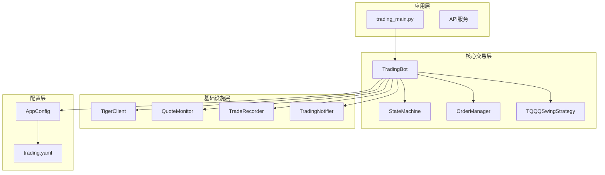

**图表来源**
- [trading_main.py:1-156](file://trading_main.py#L1-L156)
- [bot.py:25-376](file://src/trading/bot.py#L25-L376)
- [config.py:104-208](file://src/trading/config.py#L104-L208)

**章节来源**
- [trading_main.py:1-156](file://trading_main.py#L1-L156)
- [config.py:157-208](file://src/trading/config.py#L157-L208)

## 核心组件

### 交易机器人核心架构

系统的核心是TradingBot类，它整合了所有交易相关的组件，实现了完整的交易生命周期管理：

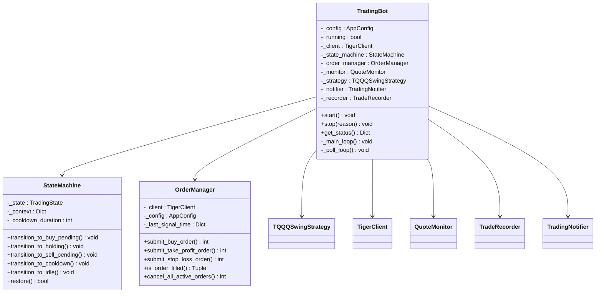

**图表来源**
- [bot.py:25-376](file://src/trading/bot.py#L25-L376)
- [state_machine.py:26-216](file://src/trading/state_machine.py#L26-L216)
- [order_manager.py:17-233](file://src/trading/order_manager.py#L17-L233)

### 交易状态机设计

系统采用有限状态机管理交易流程，确保交易过程的有序性和安全性：

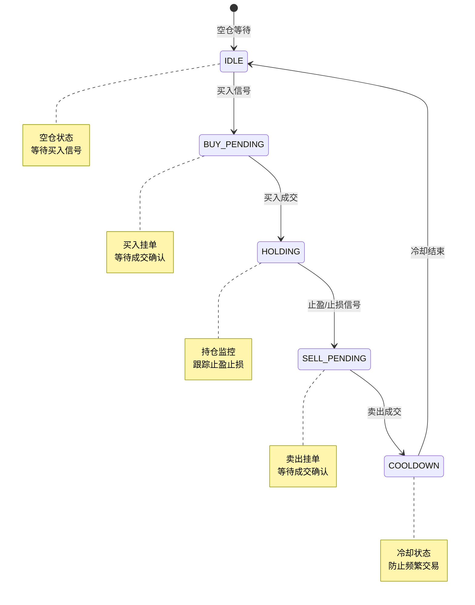

**图表来源**
- [state_machine.py:17-24](file://src/trading/state_machine.py#L17-L24)
- [state_machine.py:29-31](file://src/trading/state_machine.py#L29-L31)

**章节来源**
- [bot.py:25-376](file://src/trading/bot.py#L25-L376)
- [state_machine.py:26-216](file://src/trading/state_machine.py#L26-L216)

## 架构概览

### 系统整体架构

TQQQ自动交易机器人系统采用分层架构设计，确保各组件职责明确、耦合度低：

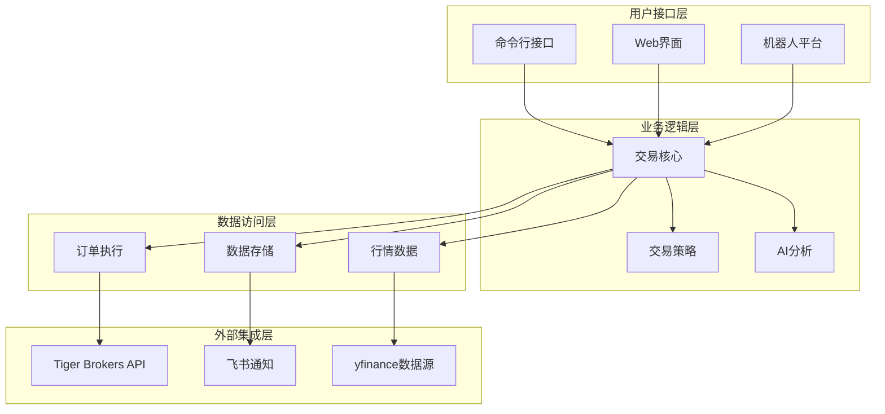

**图表来源**
- [trading_main.py:122-156](file://trading_main.py#L122-L156)
- [bot.py:54-103](file://src/trading/bot.py#L54-L103)

### 交易流程序列图

系统的核心交易流程如下所示：

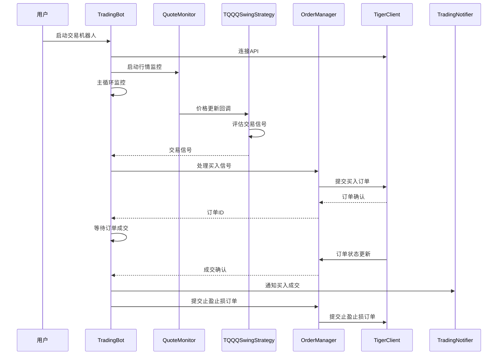

**图表来源**
- [bot.py:138-160](file://src/trading/bot.py#L138-L160)
- [order_manager.py:53-82](file://src/trading/order_manager.py#L53-L82)
- [tiger_client.py:118-143](file://src/trading/tiger_client.py#L118-L143)

**章节来源**
- [bot.py:54-103](file://src/trading/bot.py#L54-L103)
- [monitor.py:145-164](file://src/trading/monitor.py#L145-L164)

## 详细组件分析

### TQQQ摆动交易策略

TQQQ摆动交易策略是系统的核心算法，支持两种买入触发模式：

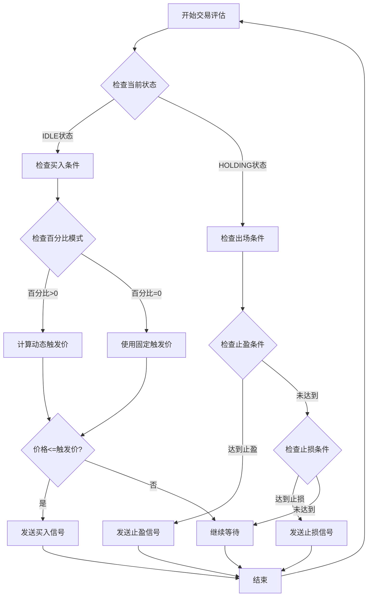

**图表来源**
- [tqqq_swing.py:40-114](file://src/trading/strategy/tqqq_swing.py#L40-L114)

#### 策略参数配置

系统支持灵活的参数配置，主要包括：

- **买入参数**：触发价格、触发百分比、交易数量、订单类型
- **止盈参数**：止盈百分比、订单类型、有效期
- **止损参数**：止损百分比、止损限价单、限价偏移、有效期

**章节来源**
- [tqqq_swing.py:24-138](file://src/trading/strategy/tqqq_swing.py#L24-L138)
- [config.py:39-73](file://src/trading/config.py#L39-L73)

### 订单管理系统

订单管理系统负责处理所有交易订单，包括下单、轮询、撤销等功能：

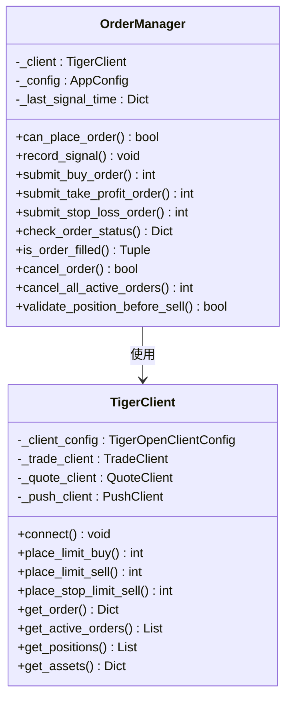

**图表来源**
- [order_manager.py:17-233](file://src/trading/order_manager.py#L17-L233)
- [tiger_client.py:23-328](file://src/trading/tiger_client.py#L23-L328)

#### 订单状态轮询机制

系统采用定时轮询机制监控订单状态变化：

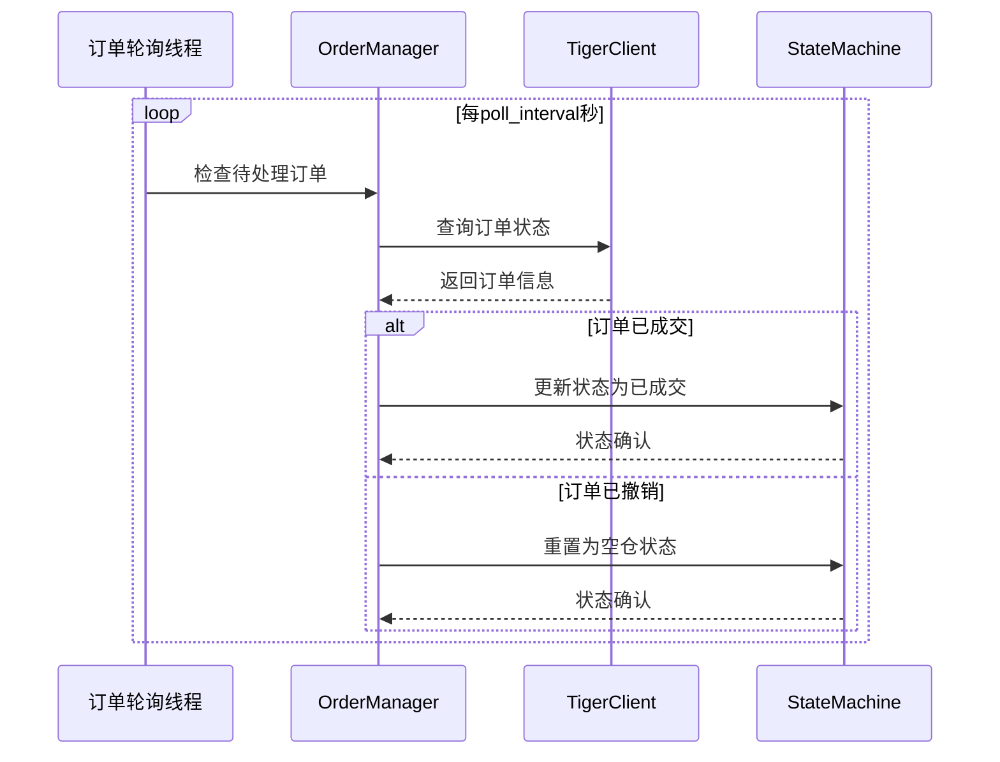

**图表来源**
- [bot.py:232-270](file://src/trading/bot.py#L232-L270)
- [order_manager.py:173-195](file://src/trading/order_manager.py#L173-L195)

**章节来源**
- [order_manager.py:17-233](file://src/trading/order_manager.py#L17-L233)
- [tiger_client.py:204-240](file://src/trading/tiger_client.py#L204-L240)

### 行情监控系统

系统采用多数据源备份的行情监控机制，确保数据获取的可靠性：

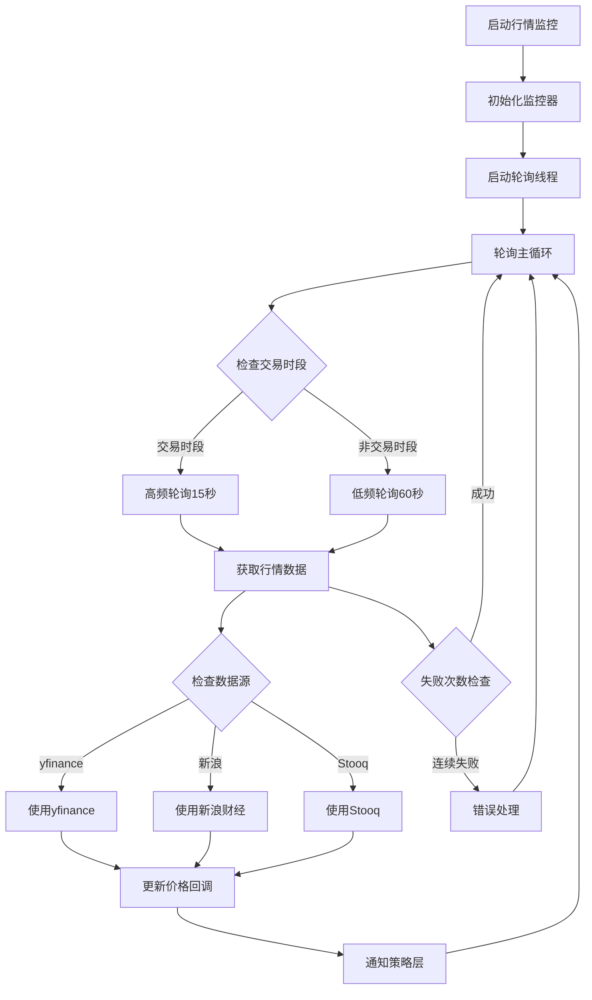

**图表来源**
- [monitor.py:124-164](file://src/trading/monitor.py#L124-L164)
- [monitor.py:165-192](file://src/trading/monitor.py#L165-L192)

#### 多数据源备份策略

系统实现三级数据源备份机制：

1. **第一优先级**：yfinance fast_info（最快，约15分钟延迟）
2. **第二优先级**：新浪财经美股接口（国内可直连）
3. **第三优先级**：Stooq CSV接口（终极兜底）

**章节来源**
- [monitor.py:165-400](file://src/trading/monitor.py#L165-L400)

### 通知系统

系统集成了飞书Webhook通知机制，提供全方位的交易事件通知：

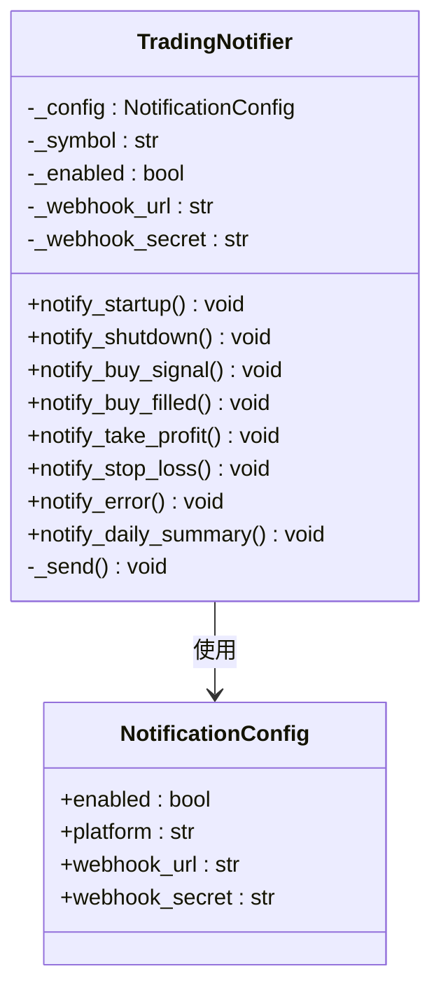

**图表来源**
- [notifier.py:20-227](file://src/trading/notifier.py#L20-L227)
- [config.py:87-93](file://src/trading/config.py#L87-L93)

**章节来源**
- [notifier.py:20-227](file://src/trading/notifier.py#L20-L227)
- [config.py:104-111](file://src/trading/config.py#L104-L111)

### 交易记录系统

系统提供完整的交易记录和分析功能：

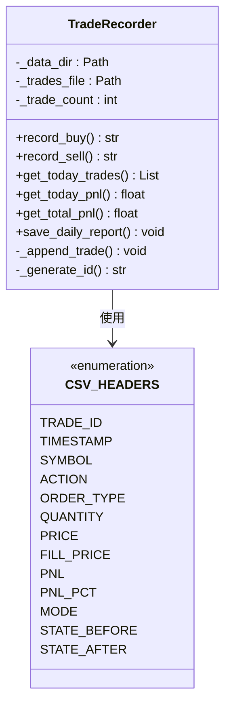

**图表来源**
- [trade_recorder.py:16-162](file://src/trading/trade_recorder.py#L16-L162)

**章节来源**
- [trade_recorder.py:16-162](file://src/trading/trade_recorder.py#L16-L162)

## 依赖关系分析

### 核心依赖关系图

系统各组件之间的依赖关系如下所示：

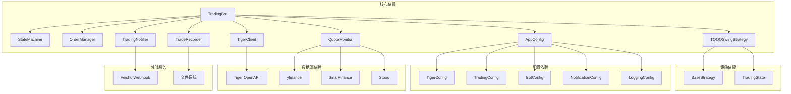

**图表来源**
- [bot.py:37-49](file://src/trading/bot.py#L37-L49)
- [config.py:20-111](file://src/trading/config.py#L20-L111)

### 配置管理

系统采用分层配置管理，支持环境变量覆盖：

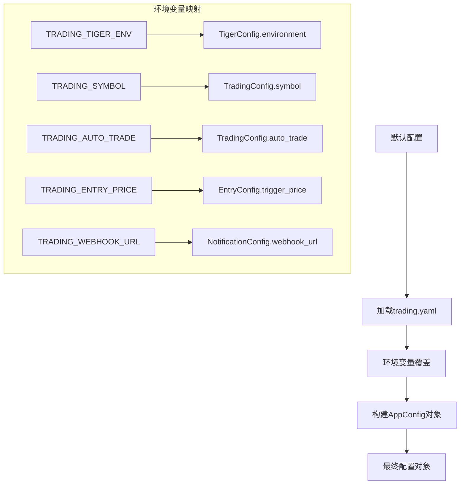

**图表来源**
- [config.py:157-208](file://src/trading/config.py#L157-L208)
- [config.py:113-155](file://src/trading/config.py#L113-L155)

**章节来源**
- [config.py:157-208](file://src/trading/config.py#L157-L208)
- [trading.yaml:1-52](file://config/trading.yaml#L1-L52)

## 性能考虑

### 系统性能优化策略

1. **异步处理**：采用多线程架构，分离行情监控、订单轮询、主循环等任务
2. **缓存机制**：状态持久化减少重启时间，配置缓存避免重复加载
3. **资源管理**：合理设置轮询间隔，交易时段高频轮询，非交易时段低频轮询
4. **错误处理**：完善的异常捕获和重试机制，确保系统稳定性

### 性能监控指标

系统提供以下关键性能指标：

- **响应时间**：行情数据获取、订单执行、通知发送的响应时间
- **吞吐量**：单位时间内处理的交易指令数量
- **可用性**：系统正常运行时间百分比
- **准确性**：交易信号准确率、订单执行成功率

## 故障排除指南

### 常见问题诊断

#### 连接问题

**症状**：系统无法连接到Tiger API或行情数据源

**排查步骤**：
1. 检查tiger_openapi_config.properties文件是否存在
2. 验证API密钥配置是否正确
3. 确认网络连接和防火墙设置
4. 检查数据源可用性

**解决方案**：
- 重新配置API密钥
- 检查代理设置
- 切换到备用数据源

#### 订单执行问题

**症状**：订单提交失败或状态异常

**排查步骤**：
1. 检查账户资金和持仓情况
2. 验证订单参数配置
3. 查看API返回的错误信息
4. 检查市场状态和交易时间

**解决方案**：
- 调整订单参数
- 等待市场开放后再试
- 联系客服解决账户问题

#### 策略参数优化

系统提供了完整的参数优化工具：

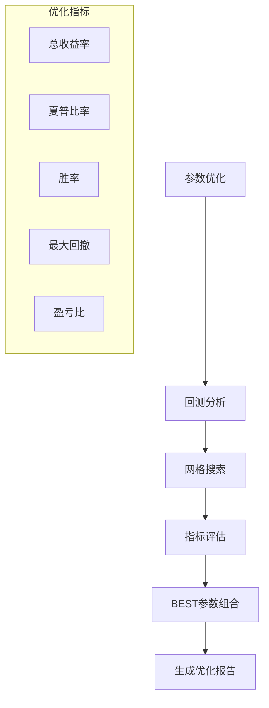

**图表来源**
- [tqqq_condition_order_backtest.py:429-466](file://scripts/tqqq_condition_order_backtest.py#L429-L466)

**章节来源**
- [tqqq_condition_order_backtest.py:1-800](file://scripts/tqqq_condition_order_backtest.py#L1-L800)
- [tqqq_quantity_optimize.py:1-223](file://scripts/tqqq_quantity_optimize.py#L1-L223)

## 结论

TQQQ自动交易机器人系统是一个功能完整、架构清晰的自动化交易解决方案。系统的主要特点包括：

1. **模块化设计**：各组件职责明确，便于维护和扩展
2. **多重保障**：多数据源备份、订单状态轮询、风控机制
3. **灵活配置**：支持丰富的参数配置和环境变量覆盖
4. **完整记录**：提供详细的交易记录和分析功能
5. **可视化监控**：通过Web界面和通知系统提供实时监控

系统经过充分的回测验证，在TQQQ标的上表现出良好的收益风险特征。建议用户根据自身风险承受能力调整参数设置，并在实盘交易前进行充分的测试和验证。

## 附录

### 配置文件说明

系统使用YAML格式的配置文件，主要包含以下配置项：

- **tiger**：Tiger Brokers API连接配置
- **trading**：交易策略配置
- **bot**：机器人行为配置
- **notification**：通知配置
- **logging**：日志配置

### 快速开始指南

1. 复制`config/trading.yaml.example`为`config/trading.yaml`
2. 填写必要的API密钥和参数配置
3. 运行`python trading_main.py`启动交易机器人
4. 通过`--dry-run`选项进行试运行验证

### 开发指南

系统提供了完整的开发接口和扩展点，开发者可以根据需要：

- 添加新的交易策略
- 扩展通知渠道
- 集成新的数据源
- 自定义风险管理规则