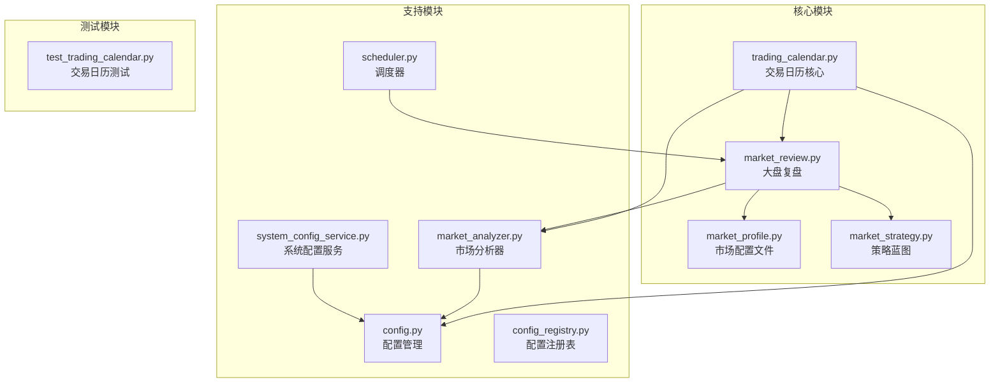
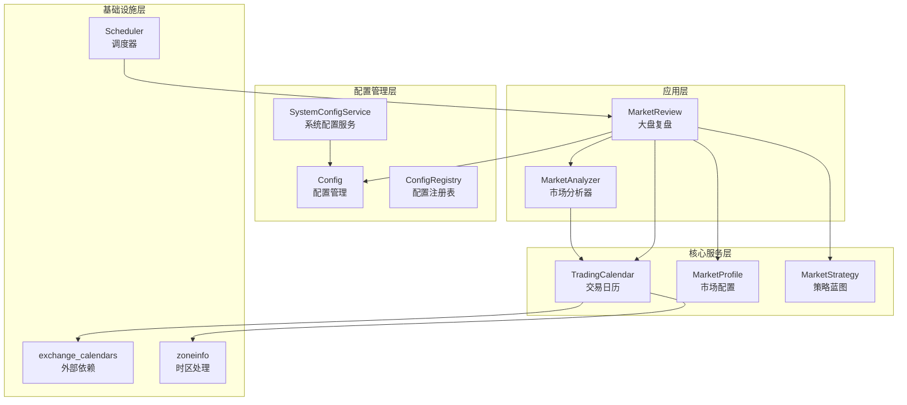
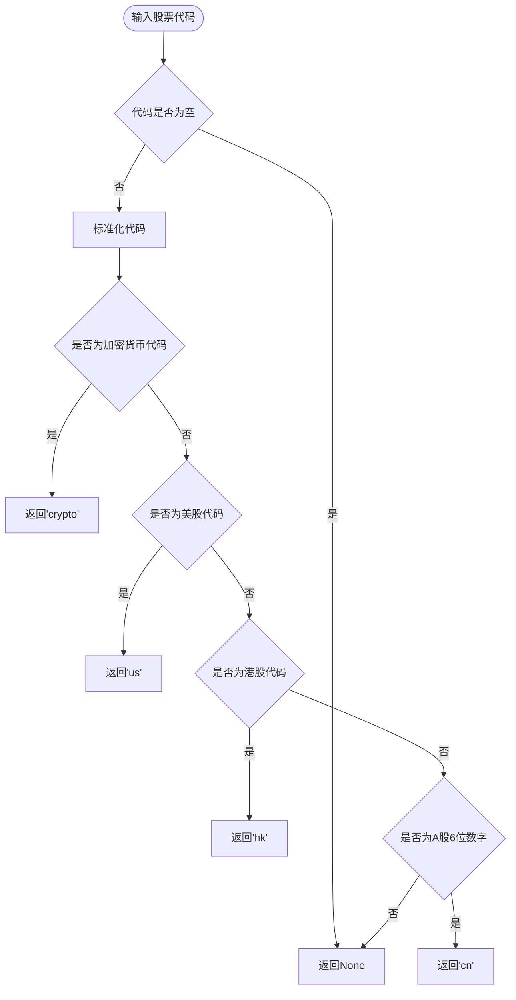
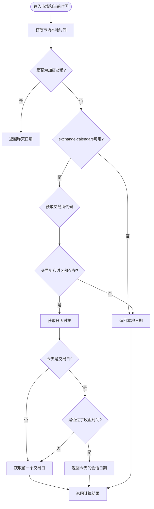
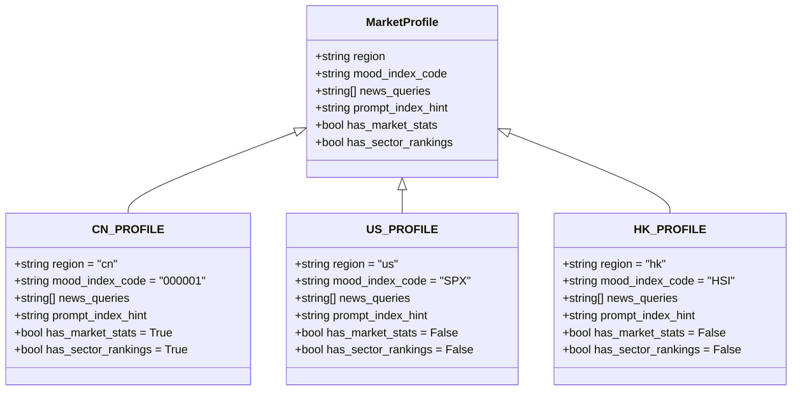
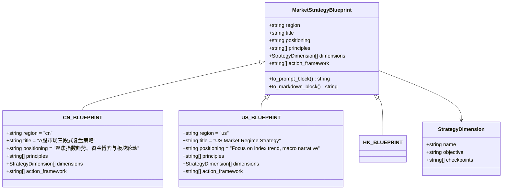
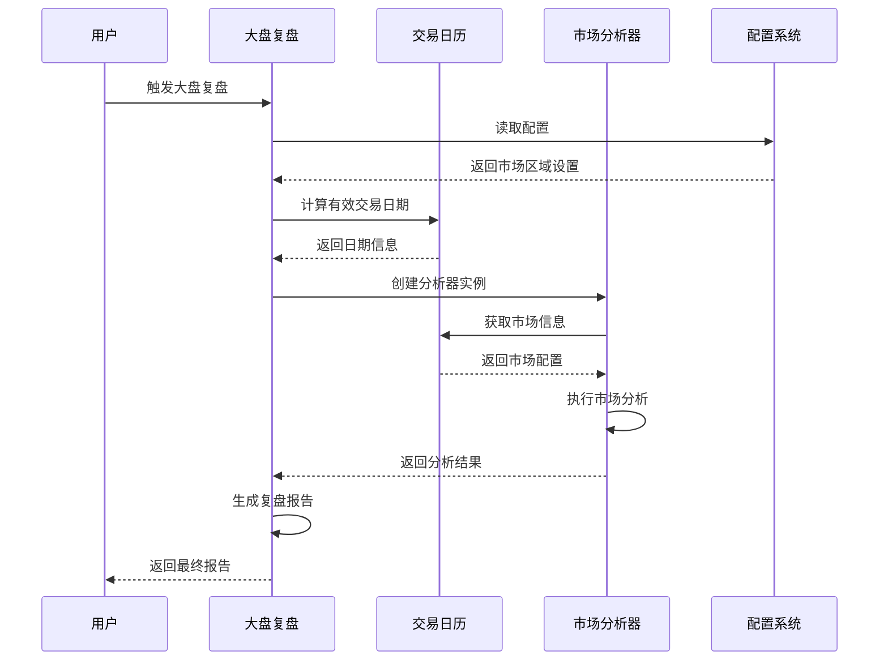
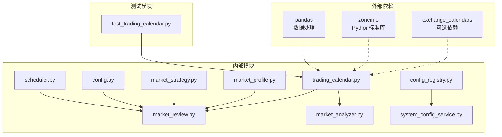
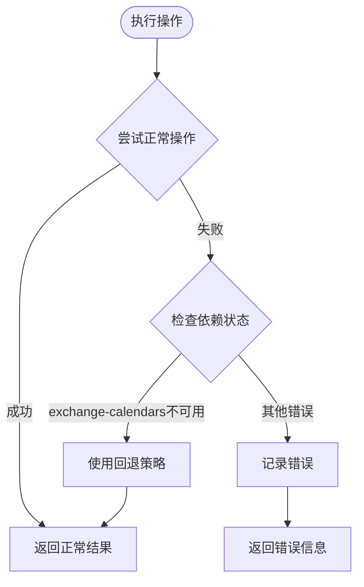

# 交易日历系统

<cite>
**本文档引用的文件**
- [trading_calendar.py](file://src/core/trading_calendar.py)
- [market_profile.py](file://src/core/market_profile.py)
- [market_strategy.py](file://src/core/market_strategy.py)
- [market_review.py](file://src/core/market_review.py)
- [market_analyzer.py](file://src/market_analyzer.py)
- [config.py](file://src/config.py)
- [config_registry.py](file://src/core/config_registry.py)
- [system_config_service.py](file://src/services/system_config_service.py)
- [scheduler.py](file://src/scheduler.py)
- [test_trading_calendar.py](file://tests/test_trading_calendar.py)
</cite>

## 目录
1. [简介](#简介)
2. [项目结构](#项目结构)
3. [核心组件](#核心组件)
4. [架构概览](#架构概览)
5. [详细组件分析](#详细组件分析)
6. [依赖关系分析](#依赖关系分析)
7. [性能考虑](#性能考虑)
8. [故障排除指南](#故障排除指南)
9. [结论](#结论)

## 简介

交易日历系统是每日股票分析系统中的核心基础设施，负责处理不同市场的交易日判断、时区转换、有效交易日期计算等功能。该系统支持A股、港股、美股以及加密货币市场的交易日历管理，为整个分析流程提供准确的时间基准。

系统的主要功能包括：
- 市场交易日判断（基于exchange-calendars库）
- 时区转换和本地时间获取
- 有效交易日期计算（考虑市场收盘时间）
- 市场区域配置和筛选
- 与大盘复盘功能的集成

## 项目结构

交易日历系统位于`src/core/`目录下，包含以下核心文件：



**图表来源**
- [trading_calendar.py:1-231](file://src/core/trading_calendar.py#L1-L231)
- [market_review.py:1-150](file://src/core/market_review.py#L1-L150)

**章节来源**
- [trading_calendar.py:1-231](file://src/core/trading_calendar.py#L1-L231)
- [market_profile.py:1-77](file://src/core/market_profile.py#L1-L77)
- [market_strategy.py:1-173](file://src/core/market_strategy.py#L1-L173)

## 核心组件

### 交易日历核心模块

交易日历核心模块提供了所有基础功能，包括市场识别、交易日判断、时区处理等。

**章节来源**
- [trading_calendar.py:74-180](file://src/core/trading_calendar.py#L74-L180)

### 市场配置模块

市场配置模块定义了不同市场的特征和配置信息，包括指数代码、新闻搜索关键词、提示语等。

**章节来源**
- [market_profile.py:13-77](file://src/core/market_profile.py#L13-L77)

### 策略蓝图模块

策略蓝图模块为不同市场区域提供了标准化的分析框架和策略指导。

**章节来源**
- [market_strategy.py:8-173](file://src/core/market_strategy.py#L8-L173)

### 大盘复盘模块

大盘复盘模块整合了交易日历功能，实现了跨市场的自动化复盘分析。

**章节来源**
- [market_review.py:49-150](file://src/core/market_review.py#L49-L150)

## 架构概览

交易日历系统采用分层架构设计，各模块职责明确，耦合度低：



**图表来源**
- [market_review.py:25-150](file://src/core/market_review.py#L25-L150)
- [trading_calendar.py:15-45](file://src/core/trading_calendar.py#L15-L45)

## 详细组件分析

### 交易日历核心算法

交易日历系统的核心算法包括三个主要功能：

#### 1. 市场识别算法

系统能够根据股票代码自动识别所属市场：



**图表来源**
- [trading_calendar.py:48-72](file://src/core/trading_calendar.py#L48-L72)

#### 2. 交易日判断算法

基于exchange-calendars库进行交易日判断，具有fail-open机制：

```mermaid
flowchart TD
Start([输入市场和日期]) --> CheckAvailable{exchange-calendars可用?}
CheckAvailable --> |否| ReturnTrue[返回True (fail-open)]
CheckAvailable --> |是| GetExchange{获取交易所代码}
GetExchange --> CheckExchange{交易所代码存在?}
CheckExchange --> |否| ReturnTrue
CheckExchange --> |是| GetCalendar[获取日历对象]
GetCalendar --> TryCal{尝试判断交易日}
TryCal --> |成功| ReturnResult[返回判断结果]
TryCal --> |异常| LogWarning[记录警告]
LogWarning --> ReturnTrue
```

**图表来源**
- [trading_calendar.py:74-99](file://src/core/trading_calendar.py#L74-L99)

#### 3. 有效交易日期计算

这是最复杂的算法，需要考虑多个因素：



**图表来源**
- [trading_calendar.py:126-179](file://src/core/trading_calendar.py#L126-L179)

**章节来源**
- [trading_calendar.py:48-180](file://src/core/trading_calendar.py#L48-L180)

### 市场配置系统

市场配置系统为不同市场区域提供了标准化的配置模板：

#### 市场配置数据结构



**图表来源**
- [market_profile.py:13-77](file://src/core/market_profile.py#L13-L77)

**章节来源**
- [market_profile.py:13-77](file://src/core/market_profile.py#L13-L77)

### 策略蓝图系统

策略蓝图系统为不同市场提供了标准化的分析框架：

#### 策略维度定义



**图表来源**
- [market_strategy.py:8-173](file://src/core/market_strategy.py#L8-L173)

**章节来源**
- [market_strategy.py:8-173](file://src/core/market_strategy.py#L8-L173)

### 大盘复盘集成

大盘复盘模块集成了交易日历功能，实现了智能化的跨市场分析：



**图表来源**
- [market_review.py:49-150](file://src/core/market_review.py#L49-L150)
- [market_analyzer.py:94-127](file://src/market_analyzer.py#L94-L127)

**章节来源**
- [market_review.py:49-150](file://src/core/market_review.py#L49-L150)
- [market_analyzer.py:94-127](file://src/market_analyzer.py#L94-L127)

## 依赖关系分析

交易日历系统具有清晰的依赖层次结构：



**图表来源**
- [trading_calendar.py:15-31](file://src/core/trading_calendar.py#L15-L31)
- [market_review.py:17-25](file://src/core/market_review.py#L17-L25)

### 关键依赖特性

1. **可选依赖处理**：exchange_calendars库采用fail-open机制，即使不可用也能正常运行
2. **时区处理**：使用Python标准库zoneinfo进行准确的时区转换
3. **配置集成**：与系统配置管理深度集成，支持动态配置更新

**章节来源**
- [trading_calendar.py:15-31](file://src/core/trading_calendar.py#L15-L31)
- [config_registry.py:1398-1411](file://src/core/config_registry.py#L1398-L1411)

## 性能考虑

### 时间复杂度分析

1. **市场识别**：O(1) - 基于字符串匹配的常数时间操作
2. **交易日判断**：O(1) - 通过exchange-calendars库进行快速查询
3. **有效日期计算**：O(1) - 基于日历对象的直接查询

### 内存使用优化

1. **懒加载**：exchange_calendars库仅在需要时导入
2. **配置缓存**：市场配置信息在进程内缓存
3. **时区信息**：使用zoneinfo的高效实现

### 错误处理机制

系统采用fail-open策略，确保在外部依赖不可用时仍能提供基本功能：



**图表来源**
- [trading_calendar.py:87-98](file://src/core/trading_calendar.py#L87-L98)

## 故障排除指南

### 常见问题及解决方案

#### 1. exchange_calendars库缺失

**症状**：系统警告"exchange-calendars not installed"，交易日检查功能不可用

**解决方案**：
```bash
pip install exchange-calendars
```

**影响**：系统将使用fail-open模式，所有市场都视为交易日

#### 2. 时区转换错误

**症状**：获取的本地时间与预期不符

**排查步骤**：
1. 检查MARKET_TIMEZONE配置
2. 验证系统时区设置
3. 确认zoneinfo库版本

#### 3. 有效交易日期计算异常

**症状**：返回的日期与实际交易日不符

**解决方案**：
1. 检查exchange_calendars库版本
2. 验证交易所代码配置
3. 确认日历数据完整性

**章节来源**
- [test_trading_calendar.py:52-187](file://tests/test_trading_calendar.py#L52-L187)

### 调试技巧

1. **启用详细日志**：设置DEBUG=true查看详细执行过程
2. **单元测试**：运行测试套件验证功能正确性
3. **配置验证**：使用系统配置服务验证配置有效性

## 结论

交易日历系统是一个设计精良、功能完备的基础设施模块，具有以下特点：

### 优势

1. **模块化设计**：清晰的职责分离和低耦合度
2. **可扩展性**：支持新市场的轻松添加
3. **健壮性**：完善的错误处理和回退机制
4. **性能优化**：高效的算法实现和资源管理

### 关键特性

1. **多市场支持**：A股、港股、美股、加密货币
2. **智能时区处理**：基于IANA时区数据库的准确转换
3. **灵活配置**：支持动态配置更新和运行时重载
4. **测试覆盖**：完整的单元测试确保代码质量

### 应用价值

该系统为整个股票分析平台提供了可靠的时间基准，确保分析结果的准确性和一致性。通过fail-open机制和完善的错误处理，系统能够在各种环境下稳定运行，为用户提供可靠的金融服务。