# 分层架构实现

<cite>
**本文档引用的文件**
- [main.py](file://main.py)
- [server.py](file://server.py)
- [api/app.py](file://api/app.py)
- [src/config.py](file://src/config.py)
- [src/enums.py](file://src/enums.py)
- [src/core/pipeline.py](file://src/core/pipeline.py)
- [src/services/analysis_service.py](file://src/services/analysis_service.py)
- [src/repositories/analysis_repo.py](file://src/repositories/analysis_repo.py)
- [api/v1/router.py](file://api/v1/router.py)
- [api/v1/endpoints/analysis.py](file://api/v1/endpoints/analysis.py)
- [data_provider/base.py](file://data_provider/base.py)
- [src/storage.py](file://src/storage.py)
- [apps/dsa-web/src/App.tsx](file://apps/dsa-web/src/App.tsx)
- [apps/dsa-desktop/main.js](file://apps/dsa-desktop/main.js)
</cite>

## 目录
1. [引言](#引言)
2. [项目结构](#项目结构)
3. [核心组件](#核心组件)
4. [架构概览](#架构概览)
5. [详细组件分析](#详细组件分析)
6. [依赖关系分析](#依赖关系分析)
7. [性能考虑](#性能考虑)
8. [故障排除指南](#故障排除指南)
9. [结论](#结论)

## 引言

本文档详细阐述股票智能分析系统的分层架构设计与实现。该系统采用清晰的分层结构，将表示层、业务层、数据访问层和数据提供层有效分离，实现了代码复用、测试便利性和维护性的显著提升。

系统支持多种用户界面：Web界面、桌面应用和API接口，所有界面都通过统一的业务逻辑层进行处理，确保了架构的一致性和可扩展性。

## 项目结构

系统采用典型的三层架构模式，结合现代Web开发的最佳实践：

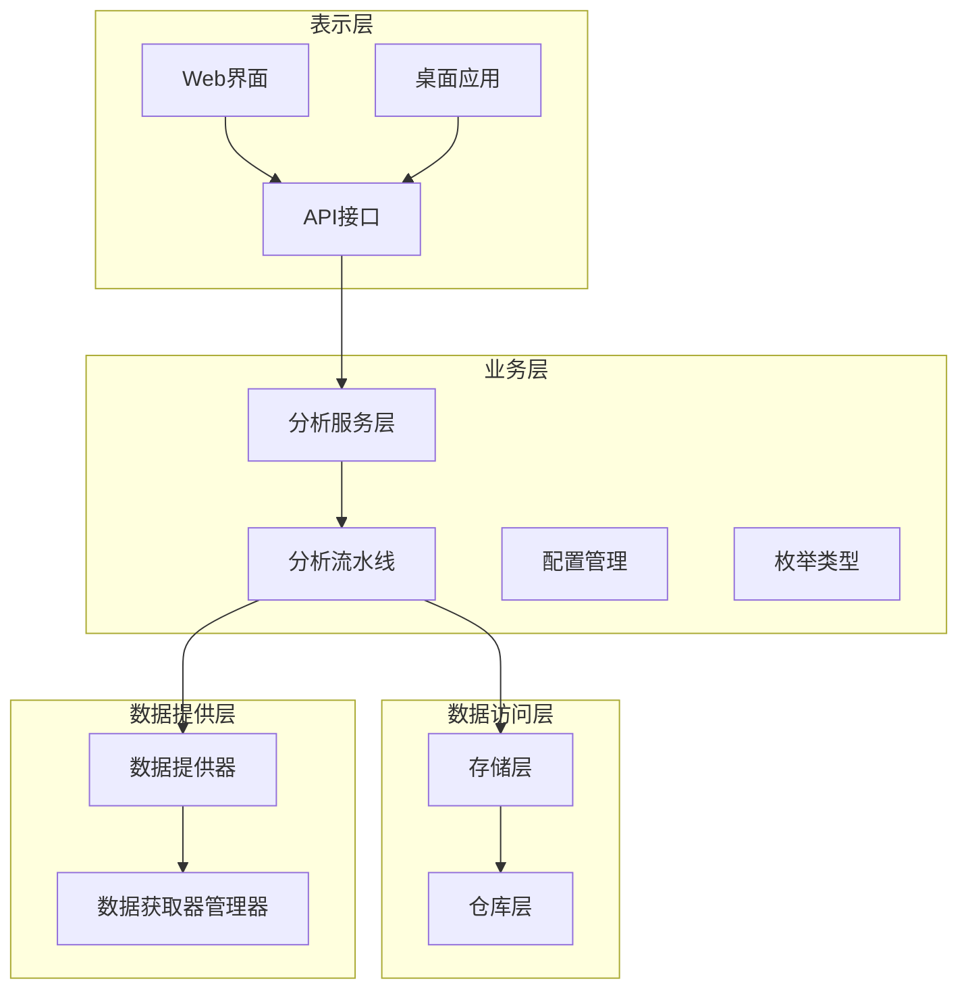

**图表来源**
- [main.py:510-723](file://main.py#L510-L723)
- [api/app.py:48-209](file://api/app.py#L48-L209)
- [src/core/pipeline.py:48-128](file://src/core/pipeline.py#L48-L128)

**章节来源**
- [main.py:1-723](file://main.py#L1-L723)
- [api/app.py:1-209](file://api/app.py#L1-L209)

## 核心组件

### 表示层组件

表示层负责与用户交互，提供多种访问方式：

**Web界面 (React)**
- 基于React的现代化前端界面
- 支持路由导航和状态管理
- 集成认证和权限控制

**桌面应用 (Electron)**
- 基于Electron的跨平台桌面应用
- 内置后端服务启动和管理
- 自动健康检查和错误处理

**API接口 (FastAPI)**
- RESTful API设计
- 支持异步任务队列
- 实时SSE事件推送

### 业务层组件

业务层封装核心分析逻辑：

**分析服务层**
- 封装股票分析业务逻辑
- 调用分析流水线执行分析
- 处理API请求和响应

**分析流水线**
- 管理完整的分析流程
- 协调数据获取、存储、分析
- 实现并发控制和异常处理

**配置管理**
- 单例模式的全局配置
- 环境变量和配置文件管理
- 类型安全的配置访问

**枚举类型**
- 定义报告类型等枚举
- 提供类型安全和代码可读性

### 数据访问层组件

数据访问层提供数据持久化支持：

**存储层**
- SQLite数据库管理
- SQLAlchemy ORM模型定义
- 数据库连接池管理

**仓库层**
- 封装数据库操作
- 提供CRUD接口
- 数据访问抽象

### 数据提供层组件

数据提供层负责外部数据获取：

**数据提供器**
- 策略模式的数据源管理
- 自动故障切换机制
- 统一的数据获取接口

**数据获取器管理器**
- 管理多个数据源
- 实现优先级排序
- 提供统一的访问接口

**章节来源**
- [src/services/analysis_service.py:29-171](file://src/services/analysis_service.py#L29-L171)
- [src/core/pipeline.py:48-800](file://src/core/pipeline.py#L48-L800)
- [src/config.py:31-580](file://src/config.py#L31-L580)
- [src/enums.py:13-51](file://src/enums.py#L13-L51)
- [src/storage.py:623-800](file://src/storage.py#L623-L800)
- [data_provider/base.py:464-800](file://data_provider/base.py#L464-L800)

## 架构概览

系统采用分层架构，各层职责明确，耦合度低，内聚性强：

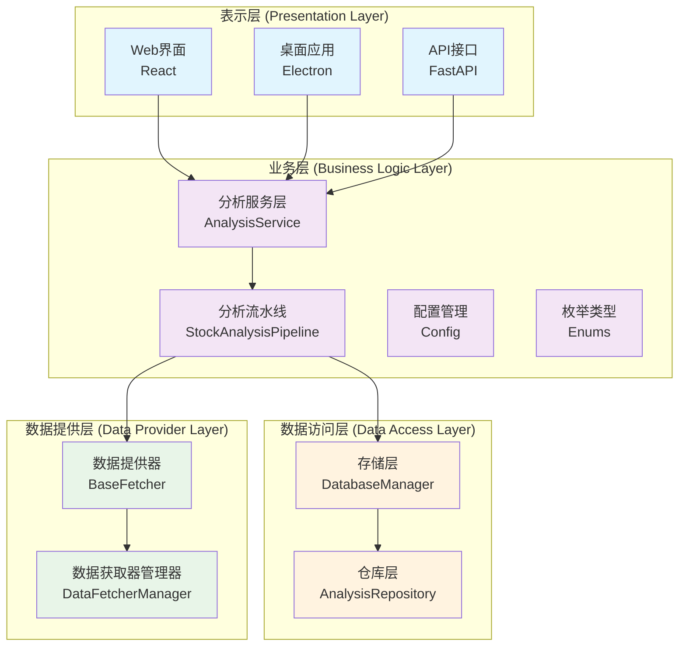

**图表来源**
- [api/v1/router.py:14-72](file://api/v1/router.py#L14-L72)
- [src/services/analysis_service.py:29-171](file://src/services/analysis_service.py#L29-L171)
- [src/core/pipeline.py:48-128](file://src/core/pipeline.py#L48-L128)
- [src/storage.py:623-686](file://src/storage.py#L623-L686)
- [data_provider/base.py:464-502](file://data_provider/base.py#L464-L502)

### 层间交互流程

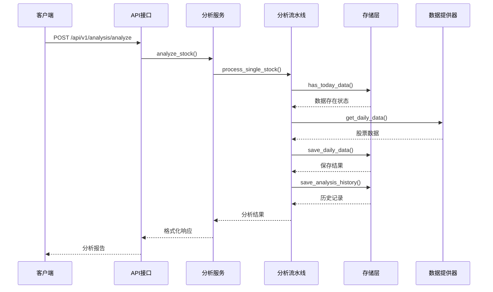

**图表来源**
- [api/v1/endpoints/analysis.py:88-301](file://api/v1/endpoints/analysis.py#L88-L301)
- [src/services/analysis_service.py:40-105](file://src/services/analysis_service.py#L40-L105)
- [src/core/pipeline.py:128-430](file://src/core/pipeline.py#L128-L430)
- [src/storage.py:747-777](file://src/storage.py#L747-L777)
- [data_provider/base.py:785-800](file://data_provider/base.py#L785-L800)

## 详细组件分析

### 表示层分析

#### Web界面组件

Web界面采用React框架构建，提供了现代化的用户交互体验：

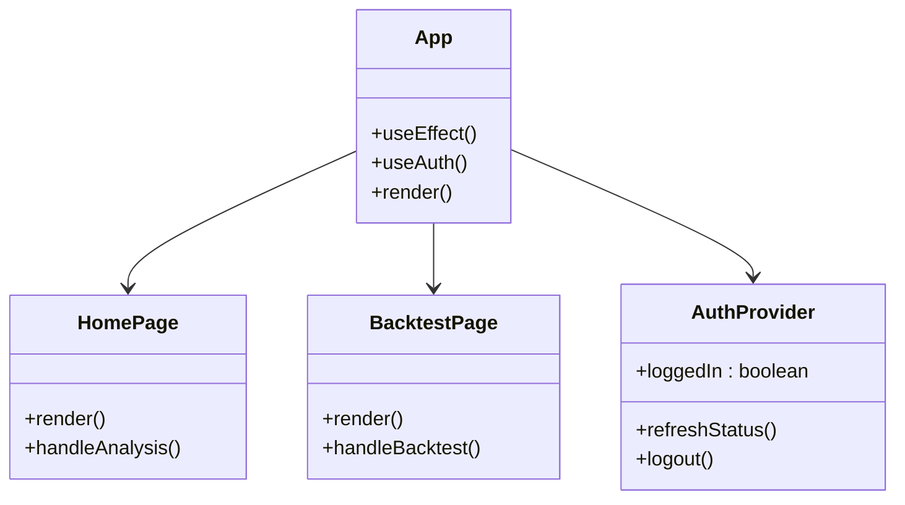

**图表来源**
- [apps/dsa-web/src/App.tsx:16-87](file://apps/dsa-web/src/App.tsx#L16-L87)

Web界面的主要特点：
- 响应式设计，支持多种设备
- 基于路由的页面导航
- 集成认证状态管理
- 实时任务状态更新

#### 桌面应用组件

桌面应用基于Electron构建，提供了原生应用体验：

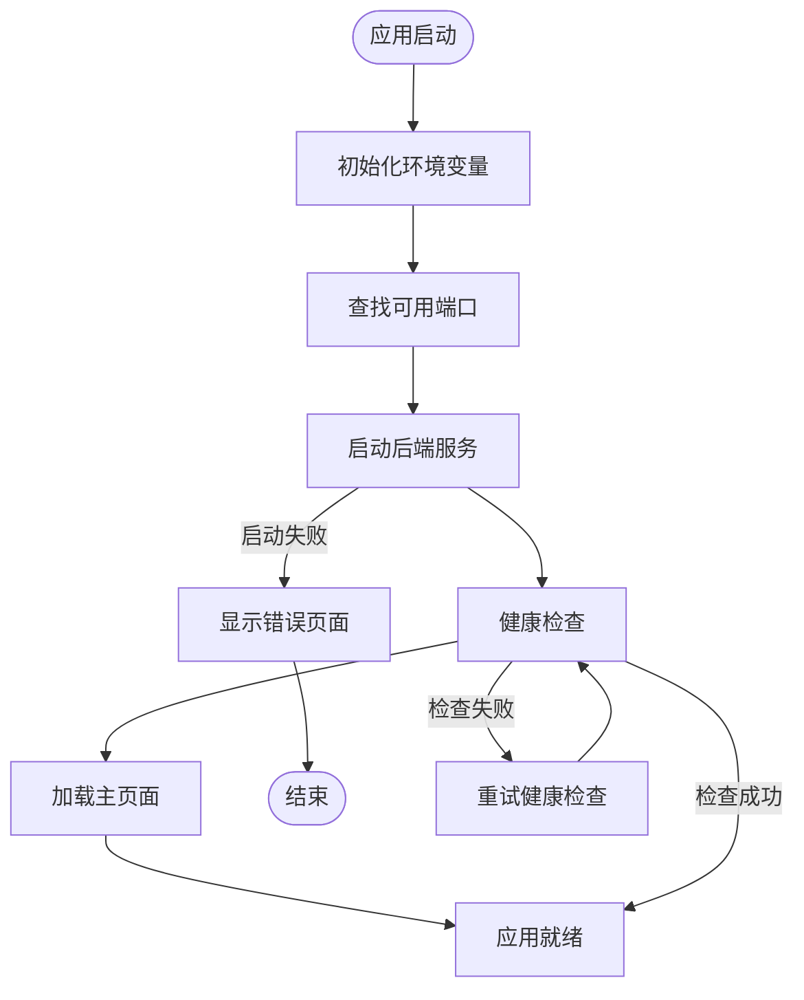

**图表来源**
- [apps/dsa-desktop/main.js:392-554](file://apps/dsa-desktop/main.js#L392-L554)

桌面应用的关键特性：
- 自动后端服务管理
- 健康检查和错误恢复
- 日志记录和调试支持
- 跨平台兼容性

#### API接口组件

API接口基于FastAPI构建，提供了高性能的RESTful服务：

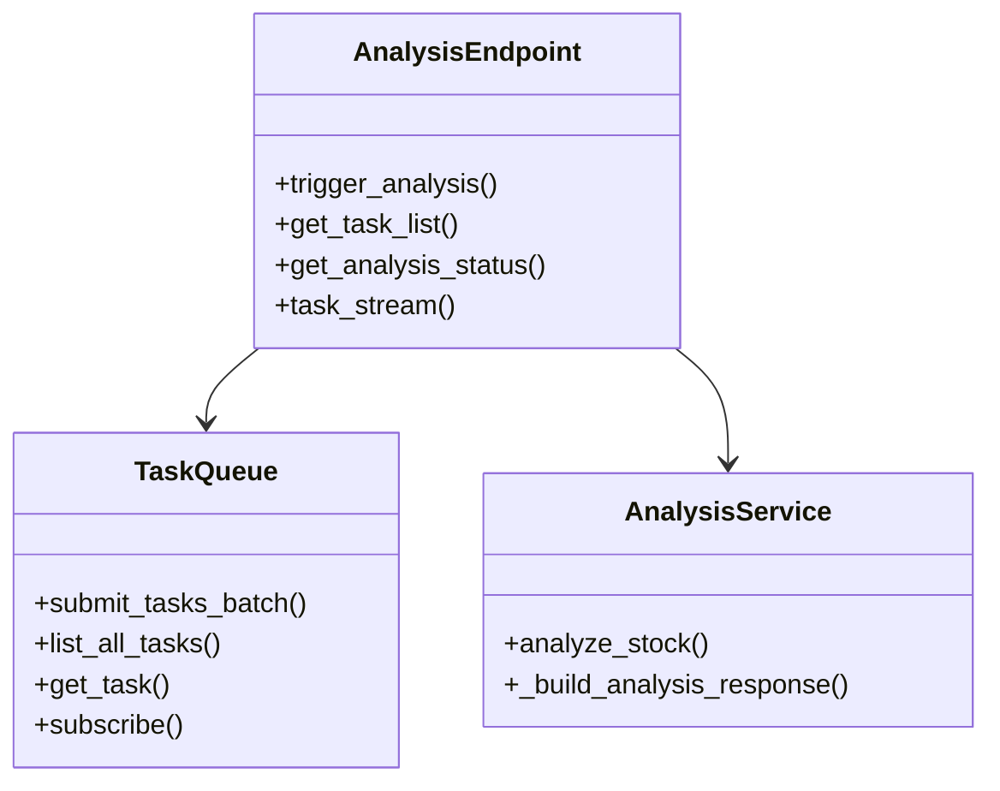

**图表来源**
- [api/v1/endpoints/analysis.py:88-571](file://api/v1/endpoints/analysis.py#L88-L571)

API接口的核心功能：
- 异步任务队列管理
- 实时SSE事件推送
- 防重复任务提交
- 任务状态跟踪

**章节来源**
- [apps/dsa-web/src/App.tsx:1-87](file://apps/dsa-web/src/App.tsx#L1-L87)
- [apps/dsa-desktop/main.js:1-574](file://apps/dsa-desktop/main.js#L1-L574)
- [api/v1/endpoints/analysis.py:1-694](file://api/v1/endpoints/analysis.py#L1-L694)

### 业务层分析

#### 分析服务层

分析服务层封装了核心的业务逻辑：

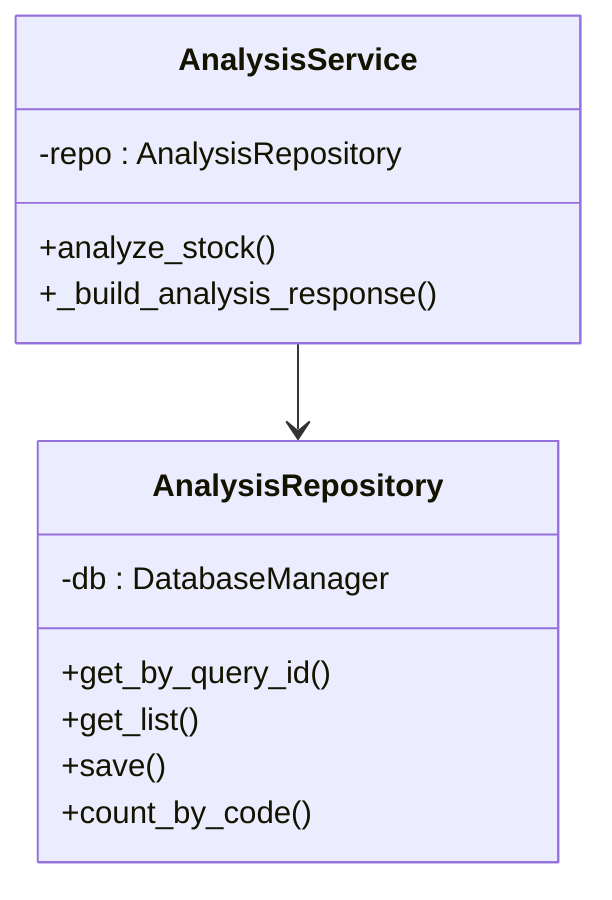

**图表来源**
- [src/services/analysis_service.py:29-171](file://src/services/analysis_service.py#L29-L171)
- [src/repositories/analysis_repo.py:21-131](file://src/repositories/analysis_repo.py#L21-L131)

分析服务层的设计优势：
- 业务逻辑与数据访问分离
- 统一的响应格式化
- 错误处理和日志记录
- 类型安全的参数验证

#### 分析流水线

分析流水线是业务层的核心组件：

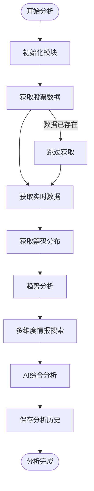

**图表来源**
- [src/core/pipeline.py:183-430](file://src/core/pipeline.py#L183-L430)

分析流水线的关键特性：
- 并发控制和线程池管理
- 多数据源自动切换
- 实时数据增强分析
- 断点续传和缓存机制

**章节来源**
- [src/services/analysis_service.py:1-171](file://src/services/analysis_service.py#L1-L171)
- [src/core/pipeline.py:1-800](file://src/core/pipeline.py#L1-L800)
- [src/repositories/analysis_repo.py:1-131](file://src/repositories/analysis_repo.py#L1-L131)

### 数据访问层分析

#### 存储层

存储层基于SQLite和SQLAlchemy构建：

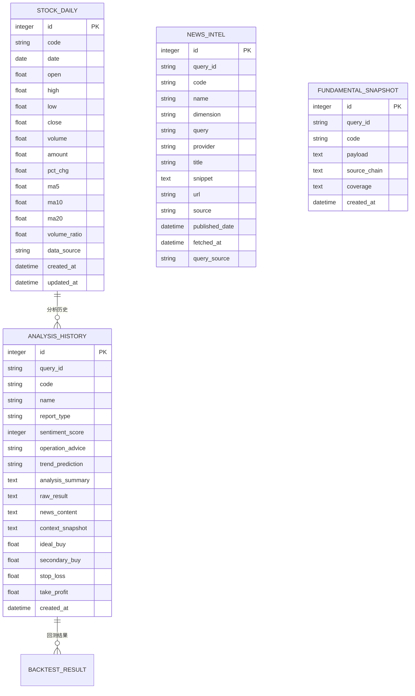

**图表来源**
- [src/storage.py:64-270](file://src/storage.py#L64-L270)
- [src/storage.py:183-206](file://src/storage.py#L183-L206)
- [src/storage.py:135-181](file://src/storage.py#L135-L181)
- [src/storage.py:183-206](file://src/storage.py#L183-L206)

存储层的设计特点：
- 完整的数据模型定义
- 多表关联和约束
- 索引优化和查询性能
- 数据一致性保证

#### 仓库层

仓库层提供了数据访问的抽象接口：

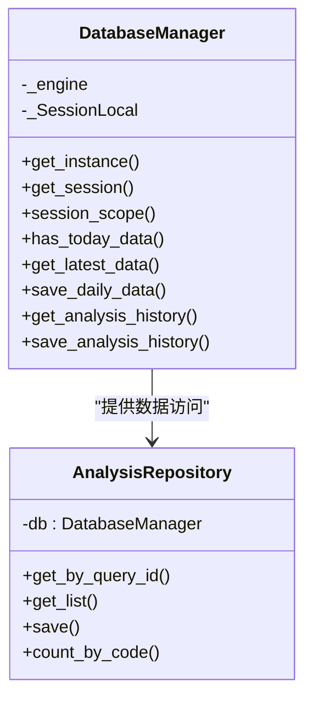

**图表来源**
- [src/storage.py:623-800](file://src/storage.py#L623-L800)
- [src/repositories/analysis_repo.py:21-131](file://src/repositories/analysis_repo.py#L21-L131)

仓库层的优势：
- 数据库操作的统一入口
- 事务管理和连接池
- 查询优化和缓存
- 错误处理和日志记录

**章节来源**
- [src/storage.py:1-800](file://src/storage.py#L1-L800)
- [src/repositories/analysis_repo.py:1-131](file://src/repositories/analysis_repo.py#L1-L131)

### 数据提供层分析

#### 数据提供器

数据提供器采用了策略模式设计：

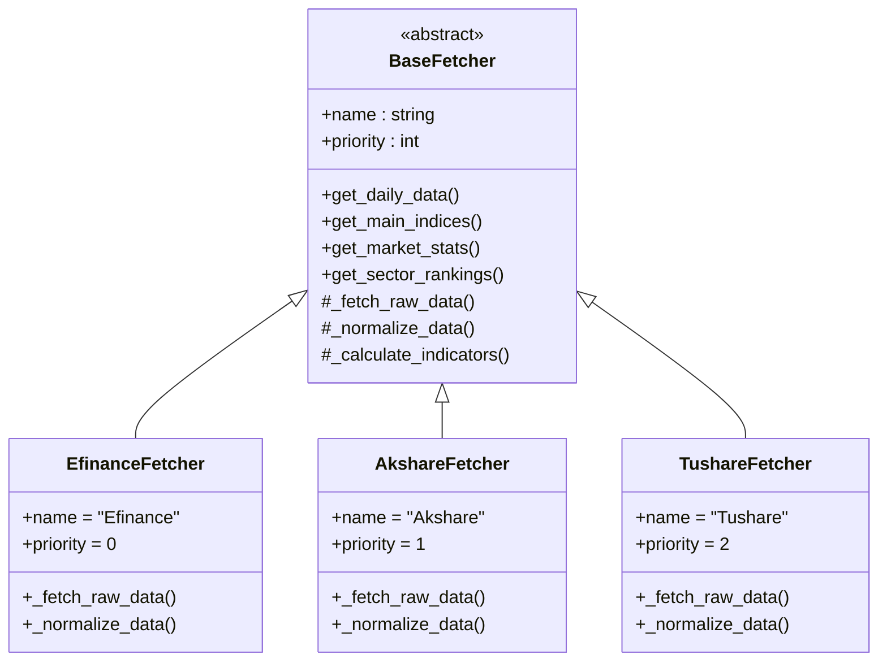

**图表来源**
- [data_provider/base.py:233-462](file://data_provider/base.py#L233-L462)

数据提供器的设计原则：
- 统一的接口规范
- 策略模式的灵活性
- 自动故障切换机制
- 数据标准化处理

#### 数据获取器管理器

数据获取器管理器负责管理多个数据源：

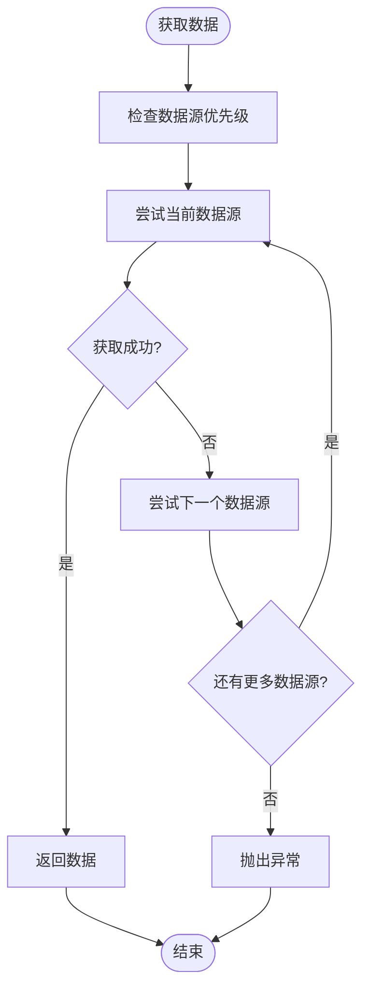

**图表来源**
- [data_provider/base.py:785-800](file://data_provider/base.py#L785-L800)

管理器的核心功能：
- 动态优先级排序
- 自动故障切换
- 超时和重试机制
- 性能监控和日志

**章节来源**
- [data_provider/base.py:1-800](file://data_provider/base.py#L1-L800)

## 依赖关系分析

系统采用清晰的依赖关系设计，遵循依赖倒置原则：

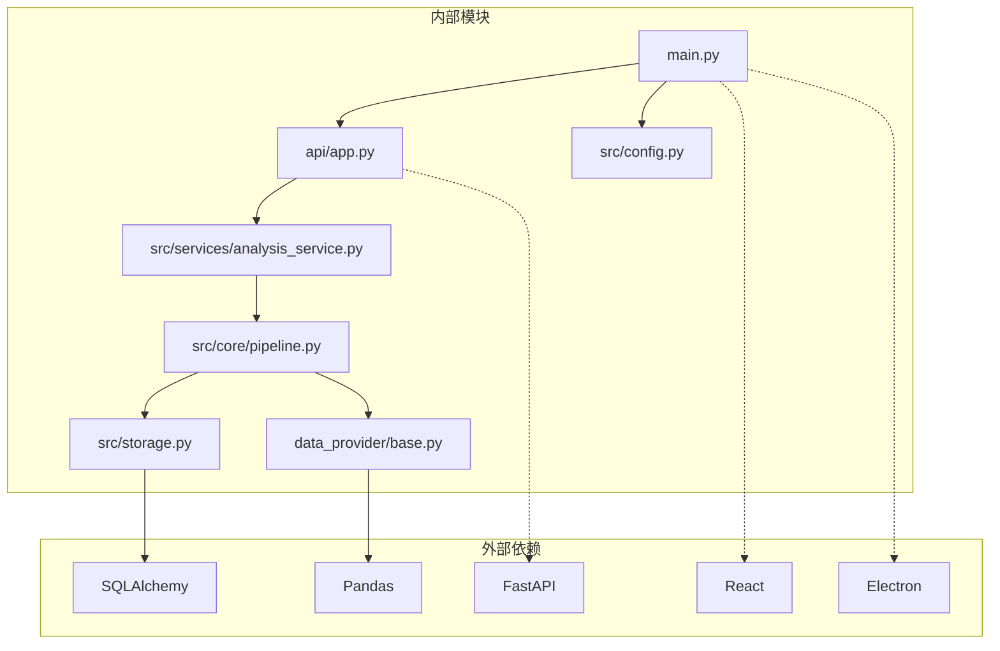

**图表来源**
- [main.py:25-52](file://main.py#L25-L52)
- [api/app.py:25-35](file://api/app.py#L25-L35)
- [src/core/pipeline.py:24-42](file://src/core/pipeline.py#L24-L42)

### 依赖注入和控制反转

系统通过依赖注入实现了松耦合：

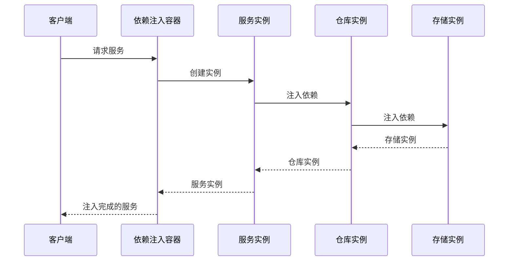

**图表来源**
- [src/services/analysis_service.py:36-40](file://src/services/analysis_service.py#L36-L40)
- [src/repositories/analysis_repo.py:28-36](file://src/repositories/analysis_repo.py#L28-L36)

**章节来源**
- [main.py:1-723](file://main.py#L1-L723)
- [api/app.py:1-209](file://api/app.py#L1-L209)
- [src/config.py:1-580](file://src/config.py#L1-L580)

## 性能考虑

系统在设计时充分考虑了性能优化：

### 并发处理
- 线程池管理（默认3个线程）
- 异步任务队列
- 防重复提交机制
- SSE实时推送

### 缓存策略
- 断点续传机制
- 实时数据缓存
- 数据库索引优化
- 查询结果缓存

### 网络优化
- 多数据源自动切换
- 智能随机休眠
- 请求间隔控制
- 代理配置支持

### 存储优化
- SQLite数据库
- 连接池管理
- 索引优化
- 批量操作

## 故障排除指南

### 常见问题及解决方案

**API服务启动失败**
- 检查端口占用情况
- 验证环境变量配置
- 查看日志文件定位问题

**数据获取异常**
- 检查网络连接状态
- 验证API密钥配置
- 查看数据源可用性

**分析结果异常**
- 检查股票代码格式
- 验证配置参数设置
- 查看历史数据完整性

**性能问题**
- 调整并发线程数
- 优化数据库查询
- 检查系统资源使用

**章节来源**
- [main.py:510-723](file://main.py#L510-L723)
- [api/v1/endpoints/analysis.py:290-301](file://api/v1/endpoints/analysis.py#L290-L301)

## 结论

股票智能分析系统采用的分层架构设计具有以下显著优势：

### 架构优势
- **代码复用**：清晰的层次分离使得组件可以在多个场景中复用
- **测试便利性**：依赖注入和接口抽象使得单元测试更加简单
- **维护性提升**：模块化设计降低了代码复杂度，便于维护和扩展
- **可扩展性**：新的功能可以轻松添加到相应的层次中

### 技术特色
- **多界面支持**：统一的业务逻辑支持Web、桌面和API多种访问方式
- **高性能设计**：并发处理、缓存策略和数据库优化确保了良好的性能表现
- **可靠性保障**：自动故障切换、健康检查和错误恢复机制提高了系统稳定性
- **现代化技术栈**：采用React、Electron、FastAPI等现代技术构建

### 未来发展
系统架构为未来的功能扩展奠定了良好基础，包括：
- 支持更多的数据源和分析算法
- 增强机器学习和AI分析能力
- 扩展到更多市场的支持
- 更丰富的可视化和报告功能

通过这种分层架构设计，系统不仅满足了当前的功能需求，还为未来的持续发展提供了坚实的技术基础。