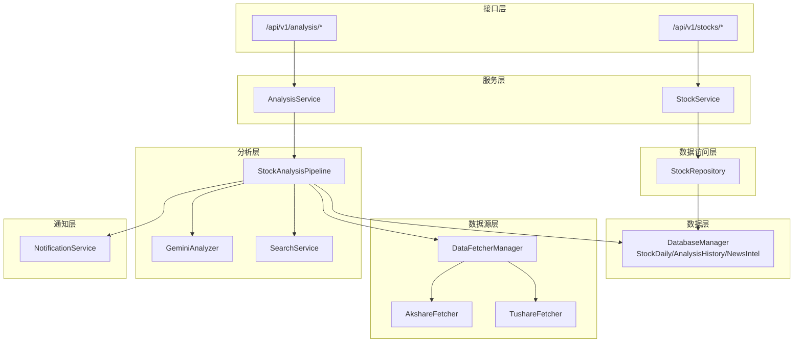
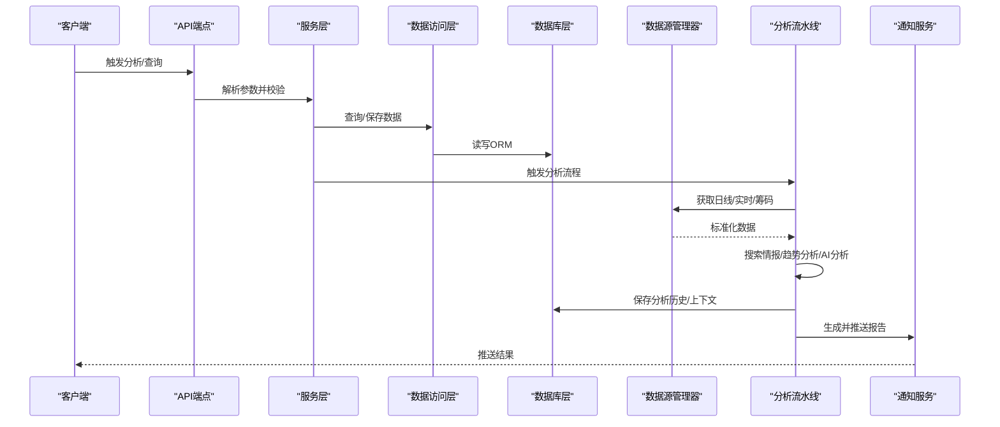
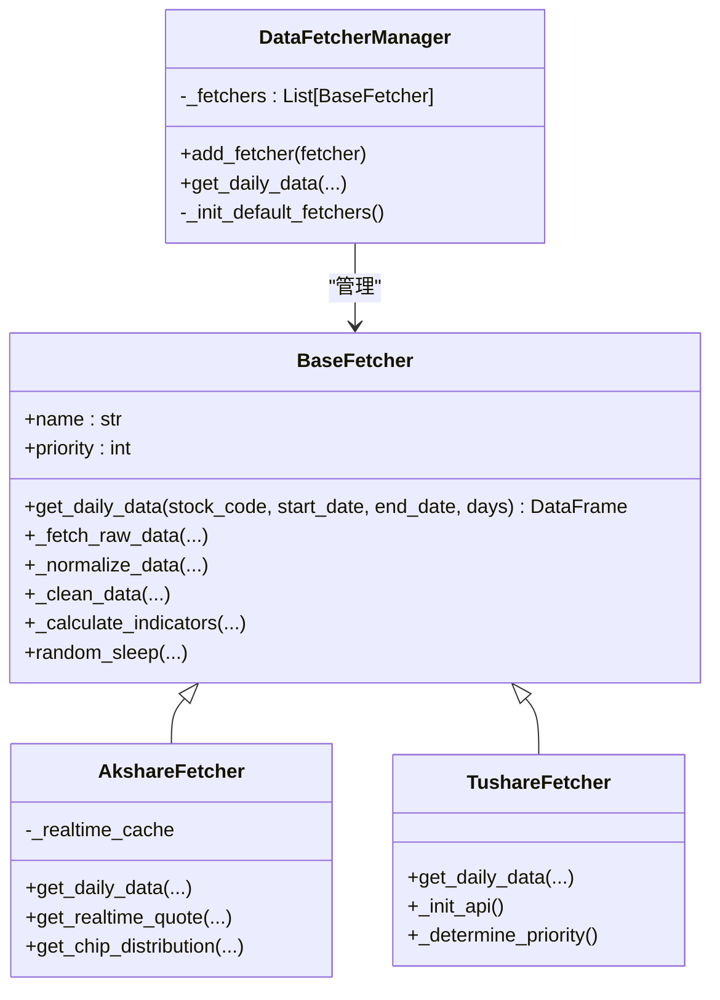
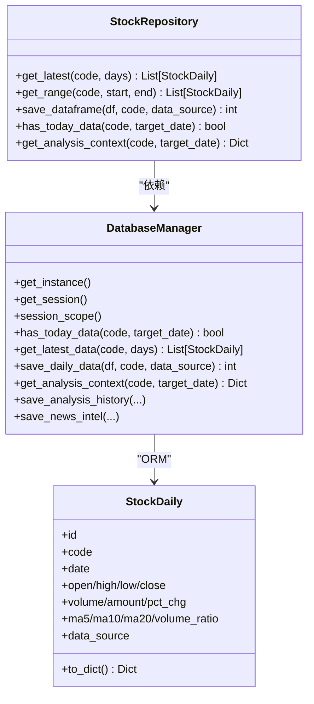
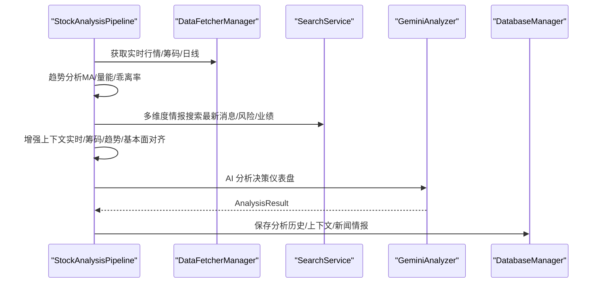
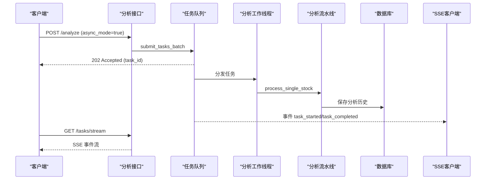
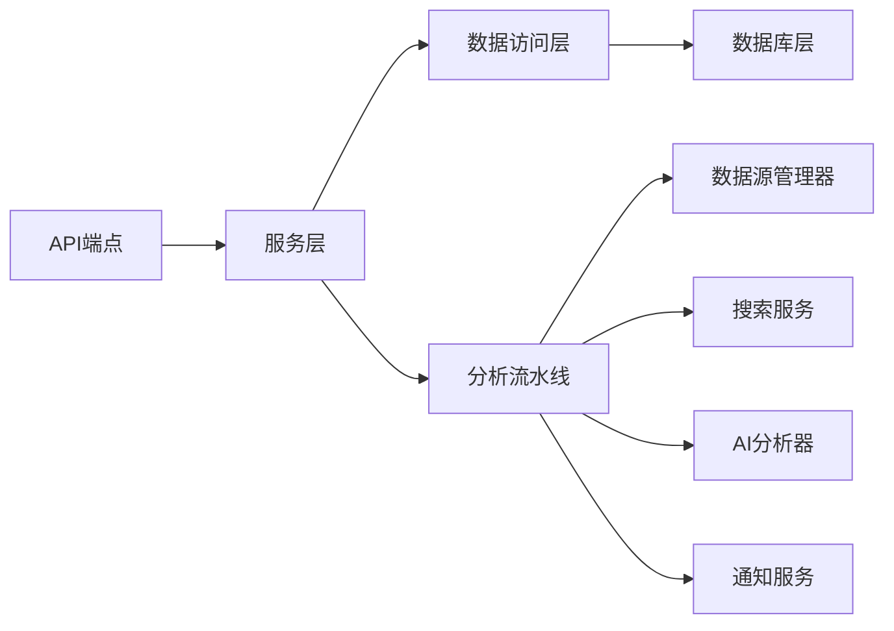

# 数据流设计

<cite>
**本文档引用的文件**
- [storage.py](file://src/storage.py)
- [stock_repo.py](file://src/repositories/stock_repo.py)
- [stock_service.py](file://src/services/stock_service.py)
- [base.py](file://data_provider/base.py)
- [akshare_fetcher.py](file://data_provider/akshare_fetcher.py)
- [tushare_fetcher.py](file://data_provider/tushare_fetcher.py)
- [analyzer.py](file://src/analyzer.py)
- [analysis_service.py](file://src/services/analysis_service.py)
- [pipeline.py](file://src/core/pipeline.py)
- [notification.py](file://src/notification.py)
- [search_service.py](file://src/search_service.py)
- [stocks.py](file://api/v1/endpoints/stocks.py)
- [analysis.py](file://api/v1/endpoints/analysis.py)
</cite>

## 目录
1. [引言](#引言)
2. [项目结构](#项目结构)
3. [核心组件](#核心组件)
4. [架构总览](#架构总览)
5. [详细组件分析](#详细组件分析)
6. [依赖关系分析](#依赖关系分析)
7. [性能考虑](#性能考虑)
8. [故障排除指南](#故障排除指南)
9. [结论](#结论)

## 引言
本文件面向股票智能分析系统，聚焦于系统的数据流设计，涵盖从数据获取、存储、分析到通知的完整路径。文档详细说明数据在各组件之间的传递方式（参数传递、返回值处理、状态管理）、数据格式标准化与转换机制（异构数据源的统一）、断点续传与增量更新策略，并提供数据流图与关键数据结构说明，帮助开发者与运维人员快速理解与优化系统。

## 项目结构
系统采用分层架构，围绕“数据获取层-数据访问层-服务层-分析层-通知层”的职责划分组织代码。API 层提供对外接口，内部通过任务队列与流水线协调异步分析；数据层通过 ORM 统一管理多种数据模型；数据源层通过策略模式整合多家数据提供商，实现自动故障切换与标准化输出。

图表来源
- [stocks.py](file://api/v1/endpoints/stocks.py)
- [analysis.py](file://api/v1/endpoints/analysis.py)
- [stock_service.py](file://src/services/stock_service.py)
- [analysis_service.py](file://src/services/analysis_service.py)
- [stock_repo.py](file://src/repositories/stock_repo.py)
- [storage.py](file://src/storage.py)
- [base.py](file://data_provider/base.py)
- [akshare_fetcher.py](file://data_provider/akshare_fetcher.py)
- [tushare_fetcher.py](file://data_provider/tushare_fetcher.py)
- [pipeline.py](file://src/core/pipeline.py)
- [analyzer.py](file://src/analyzer.py)
- [search_service.py](file://src/search_service.py)
- [notification.py](file://src/notification.py)

章节来源
- [stocks.py](file://api/v1/endpoints/stocks.py)
- [analysis.py](file://api/v1/endpoints/analysis.py)
- [stock_service.py](file://src/services/stock_service.py)
- [analysis_service.py](file://src/services/analysis_service.py)
- [stock_repo.py](file://src/repositories/stock_repo.py)
- [storage.py](file://src/storage.py)
- [base.py](file://data_provider/base.py)
- [akshare_fetcher.py](file://data_provider/akshare_fetcher.py)
- [tushare_fetcher.py](file://data_provider/tushare_fetcher.py)
- [pipeline.py](file://src/core/pipeline.py)
- [analyzer.py](file://src/analyzer.py)
- [search_service.py](file://src/search_service.py)
- [notification.py](file://src/notification.py)

## 核心组件
- 数据获取层：DataFetcherManager 作为策略管理器，封装多家数据源（Akshare、Tushare 等），提供统一接口与自动故障切换。
- 数据访问层：StockRepository 封装数据库操作，提供日线数据查询、范围查询、DataFrame 保存、断点续传检查等。
- 服务层：StockService 提供实时行情与历史数据接口；AnalysisService 封装分析业务逻辑，协调流水线与结果构建。
- 分析层：StockAnalysisPipeline 管理完整分析流程，包含实时行情、筹码分布、趋势分析、多维度情报搜索、AI 分析、上下文增强与结果落库。
- 通知层：NotificationService 生成 Markdown 报告并通过多渠道推送。
- 数据层：DatabaseManager 统一管理数据库连接与表结构，提供断点续传、历史查询、分析结果与新闻情报持久化。

章节来源
- [base.py](file://data_provider/base.py)
- [stock_repo.py](file://src/repositories/stock_repo.py)
- [stock_service.py](file://src/services/stock_service.py)
- [analysis_service.py](file://src/services/analysis_service.py)
- [pipeline.py](file://src/core/pipeline.py)
- [storage.py](file://src/storage.py)
- [notification.py](file://src/notification.py)

## 架构总览
系统数据流遵循“请求-解析-获取-存储-分析-通知-落库”的闭环。API 层接收请求后，通过服务层协调数据访问与分析流水线，最终将结果通过通知层推送到各渠道，并将分析历史与上下文快照持久化。

图表来源
- [analysis.py](file://api/v1/endpoints/analysis.py)
- [stocks.py](file://api/v1/endpoints/stocks.py)
- [stock_service.py](file://src/services/stock_service.py)
- [stock_repo.py](file://src/repositories/stock_repo.py)
- [storage.py](file://src/storage.py)
- [base.py](file://data_provider/base.py)
- [pipeline.py](file://src/core/pipeline.py)
- [notification.py](file://src/notification.py)

## 详细组件分析

### 数据获取与标准化（DataFetcherManager 与 Fetcher 实现）
- 策略模式：DataFetcherManager 维护多个 BaseFetcher 实例，按优先级自动切换，实现故障转移与负载均衡。
- 标准化流程：统一输入日期范围，调用子类获取原始数据，标准化列名，清洗数值与空值，计算技术指标（MA、量比等），并返回标准化 DataFrame。
- 防封禁策略：随机休眠、UA 轮换、指数退避重试、熔断器与缓存（如 AkshareFetcher 的实时行情缓存）。
- 实时与增强数据：统一入口获取实时行情（量比、换手率、PE/PB 等），并可获取筹码分布等增强数据。

图表来源
- [base.py](file://data_provider/base.py)
- [akshare_fetcher.py](file://data_provider/akshare_fetcher.py)
- [tushare_fetcher.py](file://data_provider/tushare_fetcher.py)

章节来源
- [base.py](file://data_provider/base.py)
- [akshare_fetcher.py](file://data_provider/akshare_fetcher.py)
- [tushare_fetcher.py](file://data_provider/tushare_fetcher.py)

### 数据访问与存储（StockRepository 与 DatabaseManager）
- StockRepository 封装 StockDaily 表的查询与保存，提供最近 N 天、范围查询、DataFrame 保存、断点续传检查、分析上下文获取等。
- DatabaseManager 提供单例数据库连接、会话管理、断点续传判断（has_today_data）、历史数据查询（get_latest_data/get_data_range）等。
- ORM 模型：StockDaily、AnalysisHistory、NewsIntel、BacktestResults 等，统一字段与索引设计，支持唯一约束与高效查询。

图表来源
- [stock_repo.py](file://src/repositories/stock_repo.py)
- [storage.py](file://src/storage.py)

章节来源
- [stock_repo.py](file://src/repositories/stock_repo.py)
- [storage.py](file://src/storage.py)

### 分析流水线与上下文增强（StockAnalysisPipeline）
- 流水线职责：断点续传检查、实时行情/筹码/趋势分析、多维度情报搜索、上下文增强、AI 分析、结果落库与通知。
- 断点续传：基于 has_today_data 判断今日数据是否存在，避免重复抓取。
- 上下文增强：将实时行情、筹码分布、趋势分析结果、股票名称、基本面对齐注入上下文，供 AI 分析器使用。
- 搜索服务：统一接入 Bocha、Tavily、SerpAPI、MiniMax、SearXNG 等，支持多 Key 负载均衡与故障转移。
- AI 分析：GeminiAnalyzer 调用 LLM 生成决策仪表盘，包含核心结论、数据透视、情报与作战计划等。

图表来源
- [pipeline.py](file://src/core/pipeline.py)
- [base.py](file://data_provider/base.py)
- [search_service.py](file://src/search_service.py)
- [analyzer.py](file://src/analyzer.py)
- [storage.py](file://src/storage.py)

章节来源
- [pipeline.py](file://src/core/pipeline.py)
- [search_service.py](file://src/search_service.py)
- [analyzer.py](file://src/analyzer.py)
- [storage.py](file://src/storage.py)

### API 接口与任务流（异步分析与 SSE）
- /api/v1/stocks/*：提供图片提取、CSV/Excel/剪贴板解析、实时行情与历史数据查询。
- /api/v1/analysis/*：触发分析（支持同步/异步）、查询任务状态、SSE 实时推送任务流。
- 任务队列：异步模式下提交任务，防重复提交，SSE 推送任务状态变化（connected/task_created/task_started/task_completed/heartbeat）。

图表来源
- [analysis.py](file://api/v1/endpoints/analysis.py)
- [stocks.py](file://api/v1/endpoints/stocks.py)

章节来源
- [analysis.py](file://api/v1/endpoints/analysis.py)
- [stocks.py](file://api/v1/endpoints/stocks.py)

### 通知与报告（Markdown 与多渠道推送）
- NotificationService：生成 Markdown 格式日报（决策仪表盘/详细版），支持企业微信、飞书、Telegram、邮件、Pushover、Discord 等渠道。
- 通知内容：核心结论、数据透视、作战计划、技术面/基本面/消息面分析、风险提示等。
- 本地保存：可将报告保存为文件，便于归档与复盘。

章节来源
- [notification.py](file://src/notification.py)

## 依赖关系分析
- 组件耦合：服务层依赖数据访问层；数据访问层依赖数据库层；分析流水线依赖数据源管理器与搜索服务；通知服务独立于分析链路，仅消费分析结果。
- 外部依赖：数据源（Akshare、Tushare 等）、搜索引擎（Bocha、Tavily、SerpAPI、MiniMax、SearXNG）、LLM（Gemini/OpenAI 兼容）、通知渠道（Webhook/SMTP/推送平台）。
- 循环依赖：未发现循环导入；各层职责清晰，接口边界明确。

图表来源
- [analysis.py](file://api/v1/endpoints/analysis.py)
- [stocks.py](file://api/v1/endpoints/stocks.py)
- [stock_service.py](file://src/services/stock_service.py)
- [analysis_service.py](file://src/services/analysis_service.py)
- [stock_repo.py](file://src/repositories/stock_repo.py)
- [storage.py](file://src/storage.py)
- [base.py](file://data_provider/base.py)
- [pipeline.py](file://src/core/pipeline.py)
- [analyzer.py](file://src/analyzer.py)
- [search_service.py](file://src/search_service.py)
- [notification.py](file://src/notification.py)

## 性能考虑
- 断点续传与增量更新
  - 断点续传：has_today_data 基于“自然日”判断，避免重复抓取；若在非交易日或跨时区场景，可能误判，建议结合“最新交易日”策略优化。
  - 增量更新：保存 DataFrame 时按唯一约束去重，避免重复入库。
- 缓存策略
  - 实时行情缓存：AkshareFetcher 对实时行情与 ETF 实时行情设置 20 分钟 TTL，降低请求频率与封禁风险。
  - 搜索结果缓存：搜索服务对瞬时网络错误进行指数退避重试，减少失败重试带来的抖动。
- 并发与限流
  - 分析流水线使用线程池并发执行；TushareFetcher 实现每分钟调用计数器，防止超配额。
  - 数据源管理器按优先级轮询，结合熔断器与错误计数，实现自愈与降级。
- I/O 与序列化
  - 使用 Pandas DataFrame 作为中间格式，统一列名与数值类型，减少解析成本。
  - ORM 操作通过 session_scope 管理事务，避免长事务锁竞争。

章节来源
- [storage.py](file://src/storage.py)
- [akshare_fetcher.py](file://data_provider/akshare_fetcher.py)
- [tushare_fetcher.py](file://data_provider/tushare_fetcher.py)
- [base.py](file://data_provider/base.py)
- [pipeline.py](file://src/core/pipeline.py)

## 故障排除指南
- 数据获取失败
  - 现象：获取日线/实时/筹码数据为空或异常。
  - 排查：检查 DataFetcherManager 的优先级与可用性；查看各数据源的错误计数与熔断状态；确认网络与代理配置。
- 搜索服务不可用
  - 现象：搜索服务未启用或返回空结果。
  - 排查：确认 API Key 配置与额度；检查瞬时网络错误重试日志；验证时间范围参数与结果截断。
- 分析结果为空
  - 现象：分析流水线返回 None 或保存失败。
  - 排查：检查上下文构建（实时/筹码/趋势）是否成功；确认 AI 分析器可用性与模型切换；查看数据库写入异常。
- 通知推送失败
  - 现象：渠道不可用或推送失败。
  - 排查：检查各渠道 Webhook/SMTP/推送平台配置；查看通知服务可用渠道列表与错误日志。

章节来源
- [base.py](file://data_provider/base.py)
- [search_service.py](file://src/search_service.py)
- [pipeline.py](file://src/core/pipeline.py)
- [notification.py](file://src/notification.py)

## 结论
本系统通过分层架构与策略模式实现了数据获取、存储、分析与通知的完整闭环。数据流以标准化与断点续传为核心，结合缓存、限流与故障转移策略，在保证稳定性的同时兼顾性能。API 层提供异步分析与实时任务流，满足批量与实时场景需求。建议在非交易日与跨时区场景下进一步完善“最新交易日”判断，以提升断点续传的准确性。