# 核心架构设计

<cite>
**本文档引用的文件**
- [README.md](file://README.md)
- [main.py](file://main.py)
- [src/config.py](file://src/config.py)
- [api/app.py](file://api/app.py)
- [api/v1/router.py](file://api/v1/router.py)
- [src/analyzer.py](file://src/analyzer.py)
- [src/market_analyzer.py](file://src/market_analyzer.py)
- [src/stock_analyzer.py](file://src/stock_analyzer.py)
- [src/core/pipeline.py](file://src/core/pipeline.py)
- [src/notification.py](file://src/notification.py)
- [src/services/task_service.py](file://src/services/task_service.py)
- [data_provider/base.py](file://data_provider/base.py)
- [requirements.txt](file://requirements.txt)
- [docker/docker-compose.yml](file://docker/docker-compose.yml)
- [src/agent/orchestrator.py](file://src/agent/orchestrator.py)
- [src/agent/factory.py](file://src/agent/factory.py)
- [src/agent/skills/__init__.py](file://src/agent/skills/__init__.py)
- [src/agent/skills/base.py](file://src/agent/skills/base.py)
- [src/agent/skills/skill_agent.py](file://src/agent/skills/skill_agent.py)
- [src/agent/skills/aggregator.py](file://src/agent/skills/aggregator.py)
- [src/agent/skills/router.py](file://src/agent/skills/router.py)
- [src/agent/skills/defaults.py](file://src/agent/skills/defaults.py)
- [src/agent/strategies/__init__.py](file://src/agent/strategies/__init__.py)
- [src/agent/strategies/router.py](file://src/agent/strategies/router.py)
- [src/agent/strategies/strategy_agent.py](file://src/agent/strategies/strategy_agent.py)
</cite>

## 更新摘要
**所做更改**
- 更新代理架构部分，反映从策略系统向技能系统的重大转变
- 新增技能管理基础设施的详细说明
- 增强多代理管道的错误处理和降级机制
- 添加技能路由器、聚合器和技能代理的架构说明
- 更新工厂模式中的技能提示状态解析流程
- 新增多代理模式下的技能选择和执行流程

## 目录
1. [引言](#引言)
2. [项目结构](#项目结构)
3. [核心组件](#核心组件)
4. [架构总览](#架构总览)
5. [详细组件分析](#详细组件分析)
6. [依赖关系分析](#依赖关系分析)
7. [性能考量](#性能考量)
8. [故障排查指南](#故障排查指南)
9. [结论](#结论)
10. [附录](#附录)

## 引言
本架构设计文档面向股票智能分析系统，聚焦于高层设计、分层架构、系统边界与核心组件交互。系统采用分层架构（表示层、业务层、数据层），结合分析流水线、数据获取层、AI分析引擎与通知系统，形成可扩展、可观测、可运维的自动化分析平台。设计强调策略模式（数据源多实现）、工厂模式（AI分析器与Agent执行器）、观察者模式（通知渠道广播）等模式的应用场景与收益。

**更新** 代理架构已从传统的策略系统完全迁移到技能系统，引入了全新的技能管理基础设施，支持自然语言定义的交易技能、智能路由选择和多代理协同分析。

## 项目结构
系统采用模块化组织，按职责划分为：
- 应用入口与调度：main.py、api/app.py、api/v1/router.py
- 核心业务：src/core/pipeline.py、src/analyzer.py、src/market_analyzer.py、src/stock_analyzer.py
- 数据与服务：data_provider/base.py、src/services/task_service.py
- 配置与通知：src/config.py、src/notification.py
- 代理系统：src/agent/orchestrator.py、src/agent/factory.py、src/agent/skills/*、src/agent/strategies/*
- 基础设施：docker/docker-compose.yml、requirements.txt

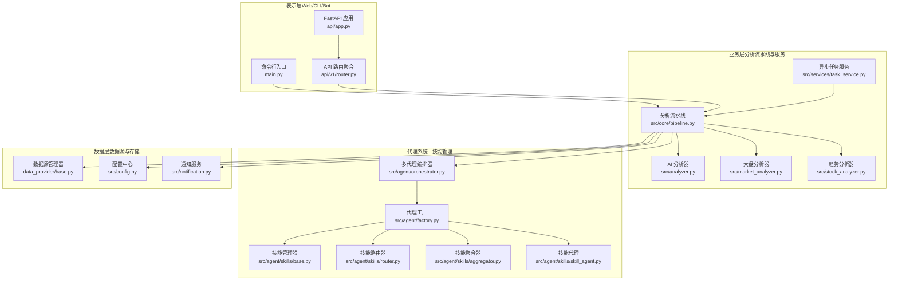

**图表来源**
- [main.py:510-723](file://main.py#L510-L723)
- [api/app.py:48-209](file://api/app.py#L48-L209)
- [api/v1/router.py:12-72](file://api/v1/router.py#L12-L72)
- [src/core/pipeline.py:48-128](file://src/core/pipeline.py#L48-L128)
- [src/analyzer.py:502-742](file://src/analyzer.py#L502-L742)
- [src/market_analyzer.py:80-139](file://src/market_analyzer.py#L80-L139)
- [src/stock_analyzer.py:171-263](file://src/stock_analyzer.py#L171-L263)
- [src/services/task_service.py:30-67](file://src/services/task_service.py#L30-L67)
- [data_provider/base.py:464-502](file://data_provider/base.py#L464-L502)
- [src/config.py:418-792](file://src/config.py#L418-L792)
- [src/notification.py:113-206](file://src/notification.py#L113-L206)
- [src/agent/orchestrator.py:73-100](file://src/agent/orchestrator.py#L73-L100)
- [src/agent/factory.py:274-358](file://src/agent/factory.py#L274-L358)
- [src/agent/skills/base.py:315-482](file://src/agent/skills/base.py#L315-L482)
- [src/agent/skills/router.py:25-165](file://src/agent/skills/router.py#L25-L165)
- [src/agent/skills/aggregator.py:40-161](file://src/agent/skills/aggregator.py#L40-L161)
- [src/agent/skills/skill_agent.py:24-119](file://src/agent/skills/skill_agent.py#L24-L119)

**章节来源**
- [main.py:510-723](file://main.py#L510-L723)
- [api/app.py:48-209](file://api/app.py#L48-L209)
- [api/v1/router.py:12-72](file://api/v1/router.py#L12-L72)

## 核心组件
- 分析流水线（StockAnalysisPipeline）：协调数据获取、趋势分析、情报搜索、AI分析、结果持久化与通知，支持并发与异常隔离。
- AI分析引擎（GeminiAnalyzer）：封装统一的LLM调用与决策仪表盘生成，支持多渠道模型与降级策略。
- 大盘复盘（MarketAnalyzer）：聚合指数、涨跌统计、板块排行与新闻，生成简明复盘报告。
- 趋势分析器（StockTrendAnalyzer）：基于交易理念的多因子评分体系，输出买入/卖出信号。
- 数据源管理器（DataFetcherManager）：策略模式实现多数据源自动切换与故障转移。
- 通知系统（NotificationService）：多渠道广播（企业微信、飞书、Telegram、Discord、邮件、Pushover等）。
- 异步任务服务（TaskService）：线程池驱动的异步分析与状态管理。
- 配置中心（Config）：单例配置，统一环境变量与运行参数。
- **新增** 多代理编排器（AgentOrchestrator）：支持技能系统的多代理协作，包含技术分析、情报分析、风险管理、技能评估和决策分析的完整流水线。
- **新增** 技能管理器（SkillManager）：管理自然语言定义的交易技能，支持内置和自定义技能加载、激活和组合。
- **新增** 技能路由器（SkillRouter）：基于市场状况和用户需求的智能技能选择系统。
- **新增** 技能聚合器（SkillAggregator）：对多个技能代理的分析结果进行加权聚合，生成最终共识意见。

**章节来源**
- [src/core/pipeline.py:48-128](file://src/core/pipeline.py#L48-L128)
- [src/analyzer.py:502-742](file://src/analyzer.py#L502-L742)
- [src/market_analyzer.py:80-139](file://src/market_analyzer.py#L80-L139)
- [src/stock_analyzer.py:171-263](file://src/stock_analyzer.py#L171-L263)
- [data_provider/base.py:464-502](file://data_provider/base.py#L464-L502)
- [src/notification.py:113-206](file://src/notification.py#L113-L206)
- [src/services/task_service.py:30-67](file://src/services/task_service.py#L30-L67)
- [src/config.py:418-792](file://src/config.py#L418-L792)
- [src/agent/orchestrator.py:73-100](file://src/agent/orchestrator.py#L73-L100)
- [src/agent/skills/base.py:315-482](file://src/agent/skills/base.py#L315-L482)
- [src/agent/skills/router.py:25-165](file://src/agent/skills/router.py#L25-L165)
- [src/agent/skills/aggregator.py:40-161](file://src/agent/skills/aggregator.py#L40-L161)

## 架构总览
系统采用分层架构与流水线模式：
- 表示层：CLI、Web API、Bot平台，统一接入分析与查询。
- 业务层：分析流水线为核心，串联AI分析、趋势分析、情报搜索与持久化。
- **新增** 代理层：技能系统作为新的业务层，提供多代理协作和智能技能分析能力。
- 数据层：策略模式的数据源管理器，统一标准化数据与指标计算。
- 通知层：多渠道广播，支持Markdown与图片转换。
- 基础设施：Docker容器化与Compose编排，支持定时与服务两种模式。

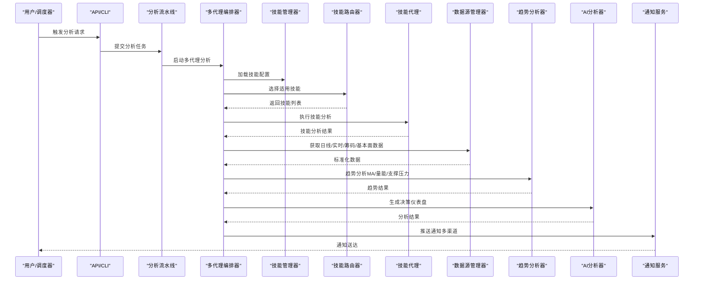

**图表来源**
- [main.py:258-443](file://main.py#L258-L443)
- [src/core/pipeline.py:183-430](file://src/core/pipeline.py#L183-L430)
- [src/agent/orchestrator.py:357-578](file://src/agent/orchestrator.py#L357-L578)
- [src/agent/factory.py:217-272](file://src/agent/factory.py#L217-L272)
- [src/analyzer.py:502-742](file://src/analyzer.py#L502-L742)
- [src/notification.py:113-206](file://src/notification.py#L113-L206)

## 详细组件分析

### 多代理编排器（AgentOrchestrator）
- **更新** 职责：管理技能系统的多代理协作，协调技术分析、情报分析、风险管理、技能评估和决策分析的完整流水线。
- **新增** 模式支持：支持快速（quick）、标准（standard）、完整（full）和专业（specialist）四种分析模式，其中专业模式专门用于技能系统。
- **新增** 技能集成：在决策阶段之前插入技能代理，对技术分析结果进行深度评估和加权聚合。
- **新增** 错误处理：实现关键阶段失败的中断机制和非关键阶段的优雅降级，确保系统稳定性。
- **新增** 超时管理：支持管道级超时控制和阶段级预算管理，防止资源浪费。

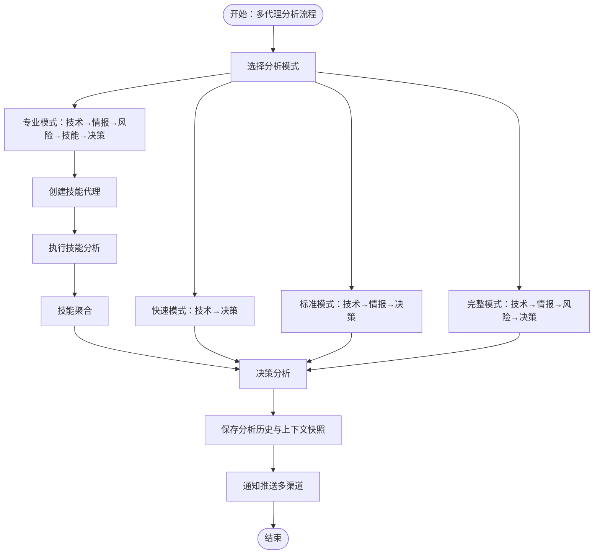

**图表来源**
- [src/agent/orchestrator.py:584-617](file://src/agent/orchestrator.py#L584-L617)
- [src/agent/orchestrator.py:618-648](file://src/agent/orchestrator.py#L618-L648)
- [src/agent/orchestrator.py:662-690](file://src/agent/orchestrator.py#L662-L690)

**章节来源**
- [src/agent/orchestrator.py:73-100](file://src/agent/orchestrator.py#L73-L100)
- [src/agent/orchestrator.py:357-578](file://src/agent/orchestrator.py#L357-L578)
- [src/agent/orchestrator.py:618-690](file://src/agent/orchestrator.py#L618-L690)

### 技能管理器（SkillManager）
- **新增** 职责：管理自然语言定义的交易技能，支持内置和自定义技能的加载、激活和组合。
- **新增** 技能加载：支持从YAML文件和Markdown SKILL.md包加载技能定义，自动解析前端元数据。
- **新增** 技能激活：支持按需激活特定技能，支持"全部激活"模式和精确选择模式。
- **新增** 指令生成：根据激活的技能生成综合指令文本，注入到AI分析器的系统提示中。
- **新增** 工具管理：自动识别和管理技能所需的工具依赖，确保分析过程的完整性。

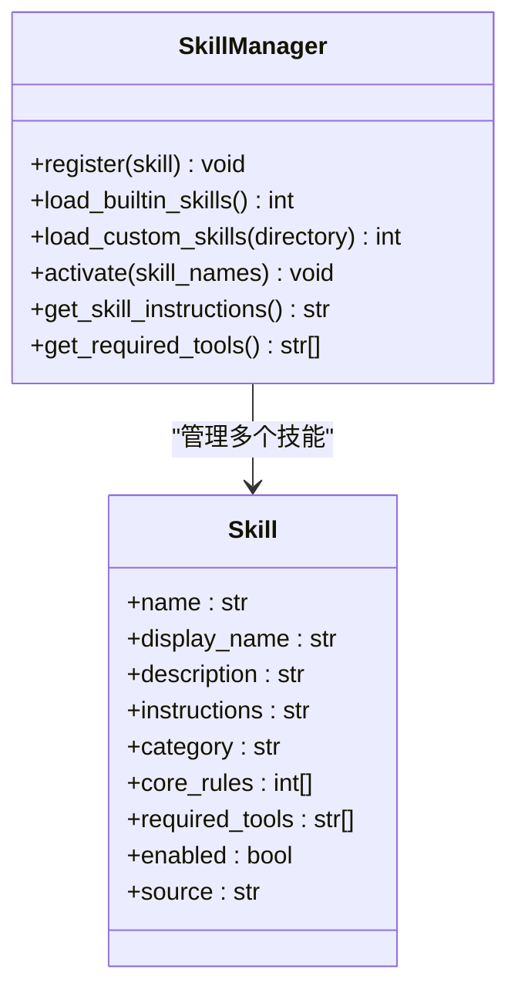

**图表来源**
- [src/agent/skills/base.py:315-482](file://src/agent/skills/base.py#L315-L482)
- [src/agent/skills/base.py:26-80](file://src/agent/skills/base.py#L26-L80)

**章节来源**
- [src/agent/skills/base.py:315-482](file://src/agent/skills/base.py#L315-L482)

### 技能路由器（SkillRouter）
- **新增** 职责：基于市场状况和用户需求智能选择适用的交易技能。
- **新增** 路由策略：支持用户显式请求、市场制度检测和中央默认回退三种路由方式。
- **新增** 市场制度：根据技术分析结果（均线排列、趋势分数、成交量状态）自动检测市场制度。
- **新增** 技能选择：为不同市场制度推荐相应的技能组合，确保分析的针对性和有效性。

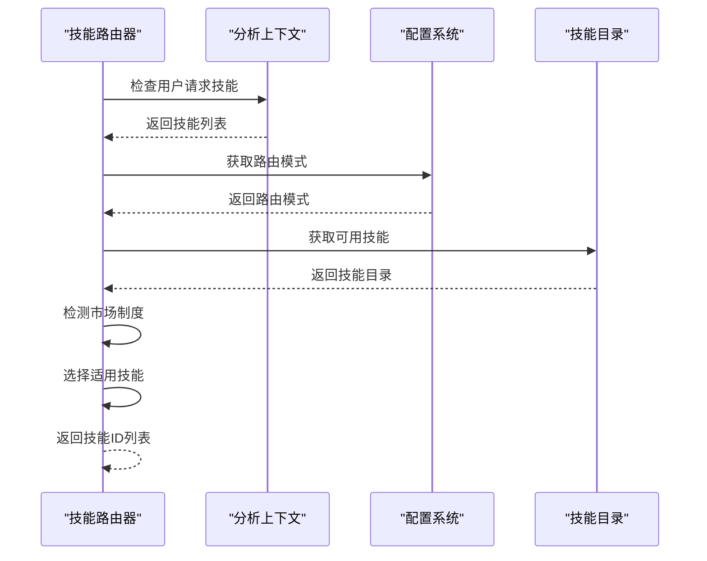

**图表来源**
- [src/agent/skills/router.py:25-165](file://src/agent/skills/router.py#L25-L165)

**章节来源**
- [src/agent/skills/router.py:25-165](file://src/agent/skills/router.py#L25-L165)

### 技能聚合器（SkillAggregator）
- **新增** 职责：对多个技能代理的分析结果进行加权聚合，生成最终共识意见。
- **新增** 权重计算：支持基于历史回测表现的自动权重计算和手动权重设置。
- **新增** 信号合成：将多个技能的买卖信号转换为加权分数，生成最终的投资建议。
- **新增** 置信度计算：综合各技能的置信度，生成聚合后的置信度评分。

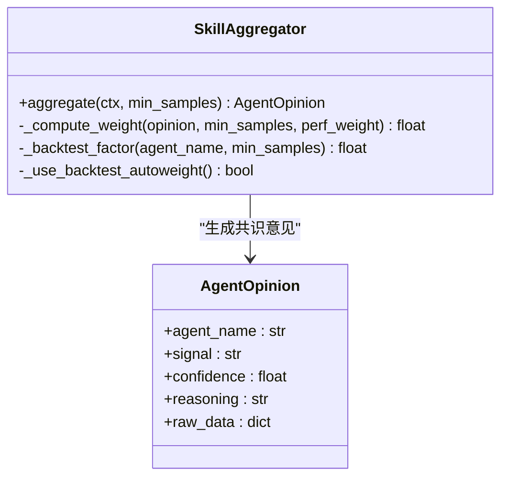

**图表来源**
- [src/agent/skills/aggregator.py:40-161](file://src/agent/skills/aggregator.py#L40-L161)

**章节来源**
- [src/agent/skills/aggregator.py:40-161](file://src/agent/skills/aggregator.py#L40-L161)

### 技能代理（SkillAgent）
- **新增** 职责：执行单个交易技能的评估，基于技能定义和当前市场条件生成分析意见。
- **新增** 输出格式：严格遵循JSON格式的输出规范，包含信号、置信度、条件满足情况等。
- **新增** 工具集成：自动识别和使用技能所需的工具，确保分析的准确性。
- **新增** 名称规则：使用标准化的代理名称格式，便于系统识别和管理。

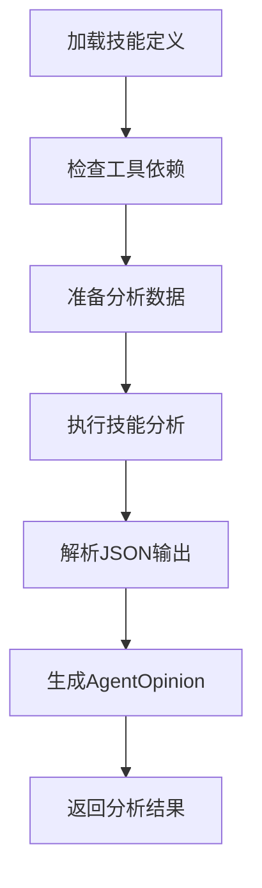

**图表来源**
- [src/agent/skills/skill_agent.py:24-119](file://src/agent/skills/skill_agent.py#L24-L119)

**章节来源**
- [src/agent/skills/skill_agent.py:24-119](file://src/agent/skills/skill_agent.py#L24-L119)

### 代理工厂（AgentFactory）
- **更新** 职责：构建配置完整的代理执行器实例，支持单代理和多代理两种模式。
- **新增** 技能提示状态：解析技能激活状态和提示片段，为分析入口点提供完整的技能信息。
- **新增** 缓存优化：实现工具注册表和技能管理器原型的模块级缓存，提升性能。
- **新增** 动态加载：支持运行时技能目录的动态变更和缓存失效。

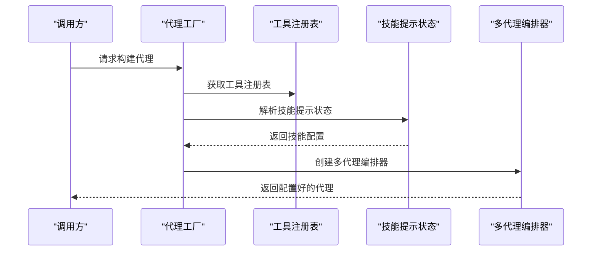

**图表来源**
- [src/agent/factory.py:274-358](file://src/agent/factory.py#L274-L358)
- [src/agent/factory.py:217-272](file://src/agent/factory.py#L217-L272)

**章节来源**
- [src/agent/factory.py:274-358](file://src/agent/factory.py#L274-L358)
- [src/agent/factory.py:217-272](file://src/agent/factory.py#L217-L272)

### 分析流水线（StockAnalysisPipeline）
- 职责：统一调度数据获取、趋势分析、情报搜索、AI分析、结果持久化与通知。
- 并发：ThreadPoolExecutor，max_workers来自配置，保障低并发防封禁。
- 异常：单股失败不影响整体，断点续传与缓存策略降低重复请求。
- 上下文增强：实时行情、筹码分布、趋势分析、基本面聚合等注入上下文。
- **更新** Agent模式：可选的Agent执行器，支持技能与工具链，具备弱完整性校验。

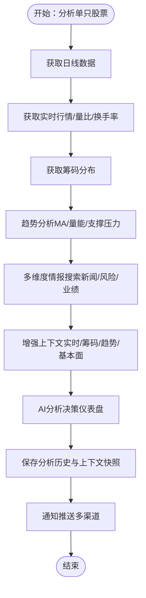

**图表来源**
- [src/core/pipeline.py:183-430](file://src/core/pipeline.py#L183-L430)

**章节来源**
- [src/core/pipeline.py:48-128](file://src/core/pipeline.py#L48-L128)
- [src/core/pipeline.py:183-430](file://src/core/pipeline.py#L183-L430)

### AI分析引擎（GeminiAnalyzer）
- 统一LLM调用：通过LiteLLM路由多提供商（Gemini/Anthropic/OpenAI/DeepSeek/Ollama等）。
- 决策仪表盘：严格JSON结构，包含核心结论、数据透视、舆情情报、作战计划。
- 语言与完整性：支持中英双语，报告完整性校验与占位填充。
- 失败降级：未配置API Key时使用模板生成报告。

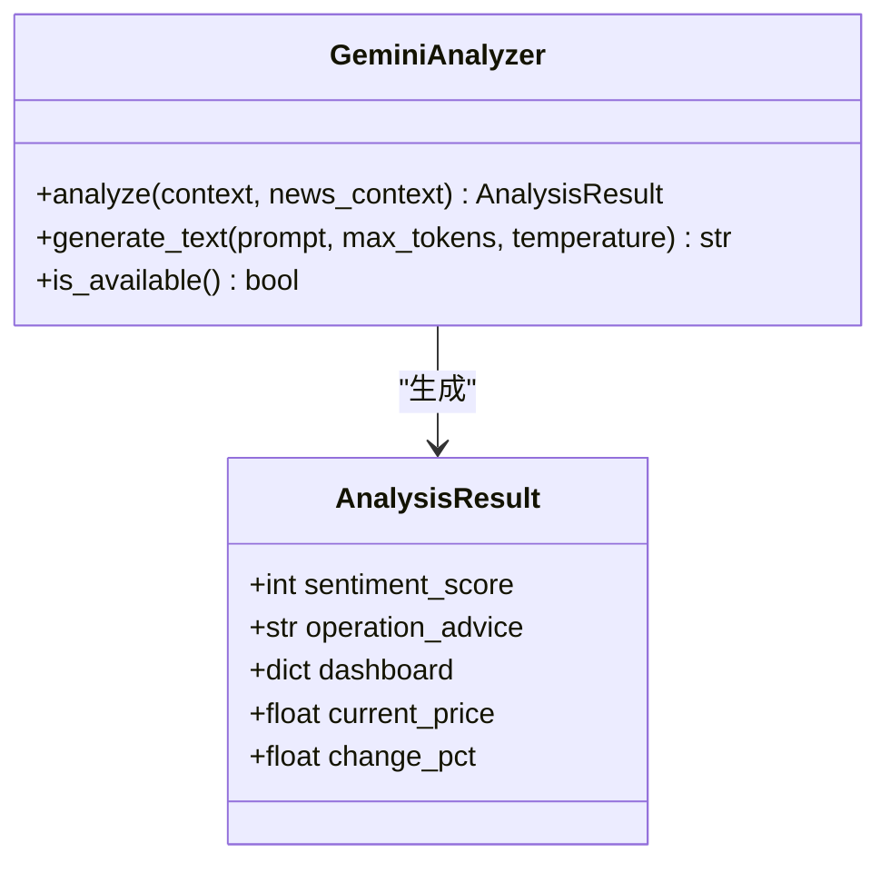

**图表来源**
- [src/analyzer.py:502-742](file://src/analyzer.py#L502-L742)

**章节来源**
- [src/analyzer.py:502-742](file://src/analyzer.py#L502-L742)

### 大盘复盘（MarketAnalyzer）
- 数据来源：指数、涨跌统计、板块排行，按区域（A股/美股）切换。
- 搜索与生成：多关键词搜索市场新闻，结合策略蓝图为Prompt生成简明复盘。
- 模板降级：LLM不可用时生成模板报告。

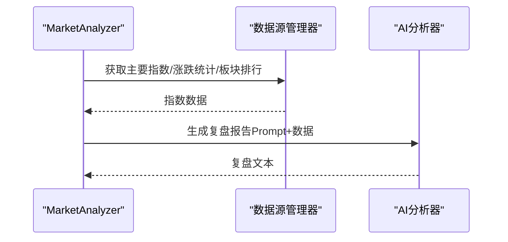

**图表来源**
- [src/market_analyzer.py:114-139](file://src/market_analyzer.py#L114-L139)
- [src/market_analyzer.py:278-307](file://src/market_analyzer.py#L278-L307)

**章节来源**
- [src/market_analyzer.py:80-139](file://src/market_analyzer.py#L80-L139)
- [src/market_analyzer.py:278-307](file://src/market_analyzer.py#L278-L307)

### 趋势分析器（StockTrendAnalyzer）
- 交易理念：严进策略、趋势交易、效率优先、买点偏好。
- 多因子评分：趋势（30分）、乖离率（20分）、量能（15分）、支撑（10分）、MACD（15分）、RSI（10分）。
- 信号输出：强烈买入/买入/持有/观望/卖出/强烈卖出。

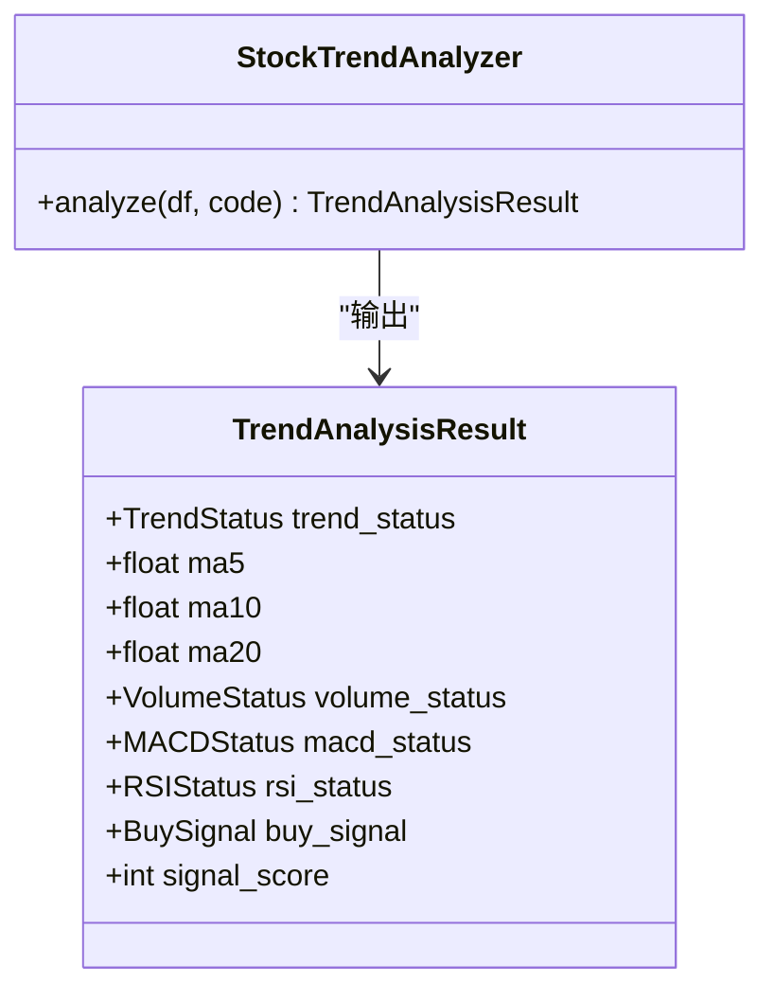

**图表来源**
- [src/stock_analyzer.py:171-263](file://src/stock_analyzer.py#L171-L263)
- [src/stock_analyzer.py:205-263](file://src/stock_analyzer.py#L205-L263)

**章节来源**
- [src/stock_analyzer.py:171-263](file://src/stock_analyzer.py#L171-L263)

### 数据获取层（DataFetcherManager）
- 策略模式：多种数据源实现（efinance/akshare/tushare/pytdx/baostock/yfinance），按优先级自动切换。
- 标准化：统一列名与技术指标（MA/量比），清洗与排序。
- 基本面聚合：统一入口与降级保护，失败返回partial/failed结构。

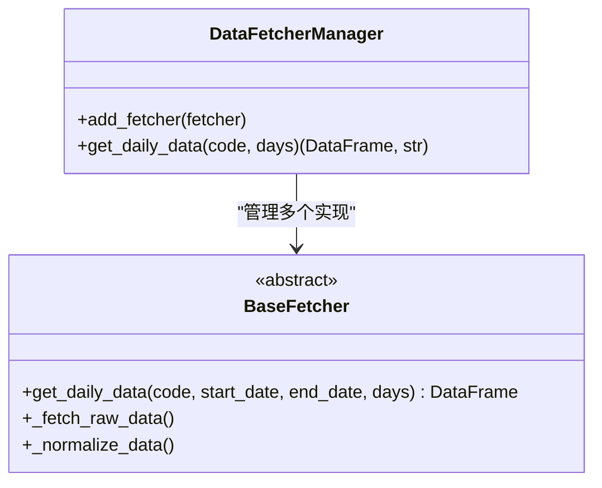

**图表来源**
- [data_provider/base.py:233-390](file://data_provider/base.py#L233-L390)
- [data_provider/base.py:464-502](file://data_provider/base.py#L464-L502)

**章节来源**
- [data_provider/base.py:233-390](file://data_provider/base.py#L233-L390)
- [data_provider/base.py:464-502](file://data_provider/base.py#L464-L502)

### 通知系统（NotificationService）
- 多渠道：企业微信、飞书、Telegram、Discord、邮件、Pushover、PushPlus、Server酱3、自定义Webhook、ASTRBOT。
- Markdown与图片：支持Markdown转图片（超长自动分批），长度限制与SSL校验可配置。
- 广播：所有已配置渠道同时推送，支持上下文渠道（如钉钉会话、飞书回复）。

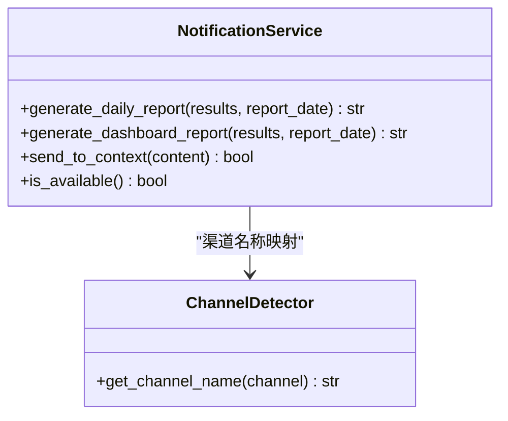

**图表来源**
- [src/notification.py:113-206](file://src/notification.py#L113-L206)
- [src/notification.py:345-538](file://src/notification.py#L345-L538)

**章节来源**
- [src/notification.py:113-206](file://src/notification.py#L113-L206)
- [src/notification.py:345-538](file://src/notification.py#L345-L538)

### 异步任务服务（TaskService）
- 单例线程池：max_workers可配置，提交分析任务并跟踪状态。
- 任务生命周期：running/completed/failed，支持查询与历史记录。

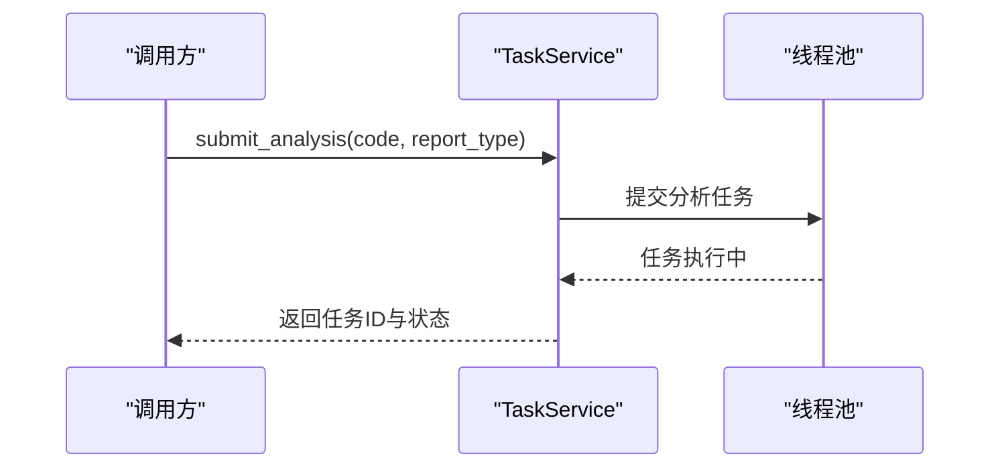

**图表来源**
- [src/services/task_service.py:68-115](file://src/services/task_service.py#L68-L115)
- [src/services/task_service.py:141-235](file://src/services/task_service.py#L141-L235)

**章节来源**
- [src/services/task_service.py:30-67](file://src/services/task_service.py#L30-L67)
- [src/services/task_service.py:68-115](file://src/services/task_service.py#L68-L115)
- [src/services/task_service.py:141-235](file://src/services/task_service.py#L141-L235)

## 依赖关系分析
- 技术栈与第三方依赖：Python生态（dotenv、tenacity、SQLAlchemy、schedule、exchange-calendars、pandas、numpy、litellm、tiktoken、requests、markdown2、imgkit、httpx、fastapi、uvicorn、jinja2等）。
- 数据源：多源策略（efinance/akshare/tushare/pytdx/baostock/yfinance），优先级动态调整。
- Web框架：FastAPI + Uvicorn，支持CORS与认证中间件。
- 容器化：Docker Compose，支持定时与服务两种模式。
- **新增** 技能系统依赖：YAML解析、Markdown处理、缓存管理等新依赖项。

```mermaid
graph TB
Req["requirements.txt"] --> Dotenv["python-dotenv"]
Req --> Tenacity["tenacity"]
Req --> SQLAlchemy["sqlalchemy"]
Req --> Schedule["schedule"]
Req --> ExCal["exchange-calendars"]
Req --> Pandas["pandas"]
Req --> Numpy["numpy"]
Req --> LiteLLM["litellm"]
Req --> TikToken["tiktoken"]
Req --> Requests["requests"]
Req --> Markdown2["markdown2"]
Req --> ImgKit["imgkit"]
Req --> Httpx["httpx"]
Req --> FastAPI["fastapi"]
Req --> Uvicorn["uvicorn"]
Req --> Jinja2["jinja2"]
Req --> PyYaml["PyYAML"]
Req --> Markdown["markdown"]
Req --> LRU_Cache["functools.lru_cache"]
```

**图表来源**
- [requirements.txt:1-65](file://requirements.txt#L1-L65)

**章节来源**
- [requirements.txt:1-65](file://requirements.txt#L1-L65)

## 性能考量
- 并发与防封禁：max_workers低并发，随机休眠（Jitter）与指数退避重试。
- 数据缓存与断点续传：数据库缓存日线数据，按自然日判断"今日数据"，避免重复拉取。
- 实时行情增强：可选启用，按配置优先级自动切换，避免API限流。
- 报告完整性与降级：LLM不可用时模板生成，必要字段占位补全，保证可用性。
- **新增** 技能系统性能：技能管理器原型缓存、工具注册表共享、技能目录LRU缓存等优化措施。

## 故障排查指南
- 配置校验：Config提供validate方法，支持warn/strict模式，启动前输出警告或终止。
- 交易日检查：可按股票/市场区域过滤休市，支持--force-run强制执行。
- 通知失败：检查渠道配置（URL/Token/SSL），查看日志与长度限制。
- 数据源失败：查看数据源优先级与切换日志，确认网络与代理设置。
- **新增** 技能系统故障：检查技能文件格式、技能目录权限、技能激活状态，查看技能加载日志。
- **新增** 多代理模式：检查代理配置、技能路由器选择、技能聚合结果，查看代理执行日志。
- Agent模式：检查技能配置与模型可用性，必要时回退到传统分析路径。

**章节来源**
- [src/config.py:31-48](file://src/config.py#L31-L48)
- [src/config.py:750-775](file://src/config.py#L750-L775)
- [main.py:216-256](file://main.py#L216-L256)
- [src/notification.py:195-206](file://src/notification.py#L195-L206)
- [src/agent/skills/base.py:344-396](file://src/agent/skills/base.py#L344-L396)
- [src/agent/skills/router.py:101-110](file://src/agent/skills/router.py#L101-L110)

## 结论
系统通过分层架构与分析流水线实现了从数据获取、趋势与情报分析到AI决策与多渠道通知的完整闭环。**更新** 代理架构已完全迁移到技能系统，引入了多代理协作和智能技能分析能力，显著提升了分析的深度和准确性。策略模式与工厂模式提升了扩展性与可维护性；观察者模式保障了通知的高可用广播。结合容器化与定时/服务双模式，系统具备良好的可扩展性、可观测性与可运维性。

## 附录
- 部署拓扑：Docker Compose支持定时任务与FastAPI服务分离部署，分别挂载数据/日志/报告目录与技能目录。
- 安全性：Web认证可运行时开关，CORS可配置，通知渠道支持SSL校验；建议生产环境关闭非必要通道。
- 监控与灾备：日志分级与文件轮转，异常降级与占位补全，建议结合外部监控与告警系统。
- **新增** 技能系统配置：支持自定义技能目录、技能激活策略、路由模式配置等高级功能。

**章节来源**
- [docker/docker-compose.yml:1-69](file://docker/docker-compose.yml#L1-L69)
- [src/agent/factory.py:175-214](file://src/agent/factory.py#L175-L214)
- [src/agent/skills/defaults.py:92-99](file://src/agent/skills/defaults.py#L92-L99)