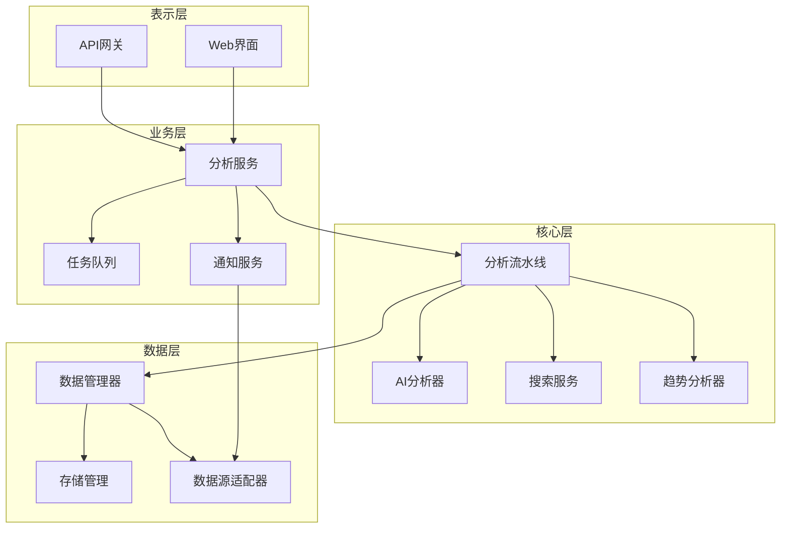
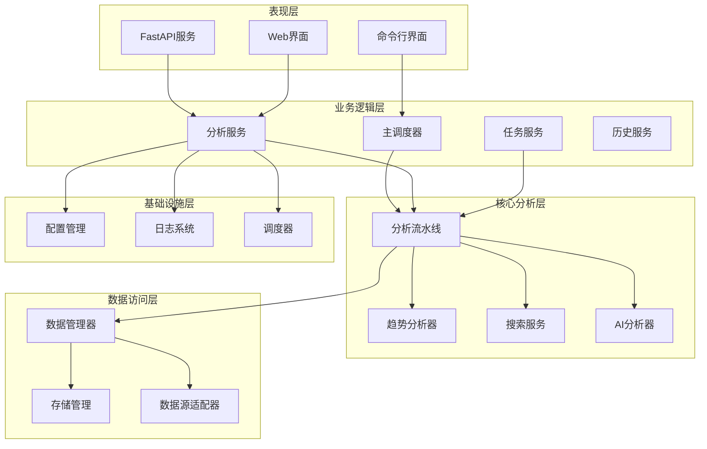
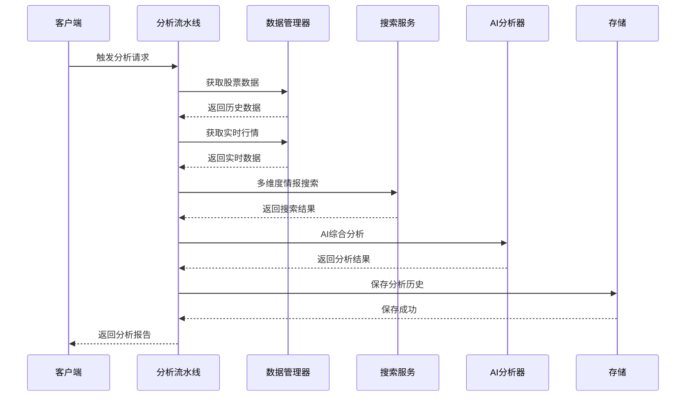
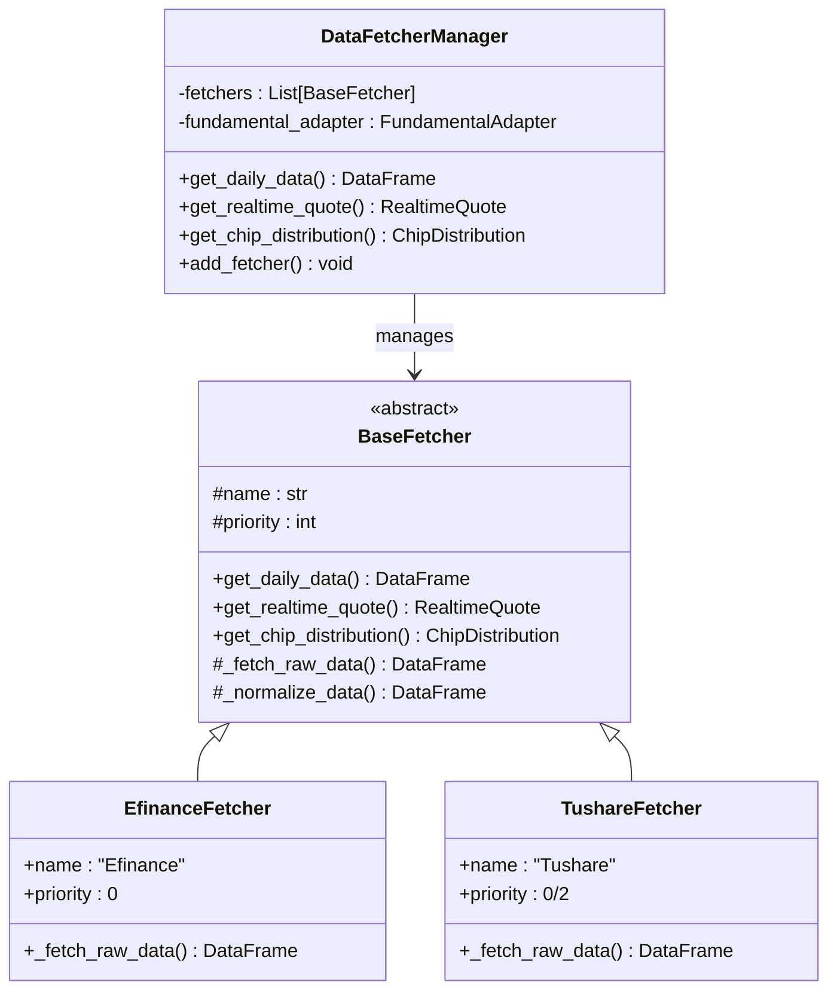
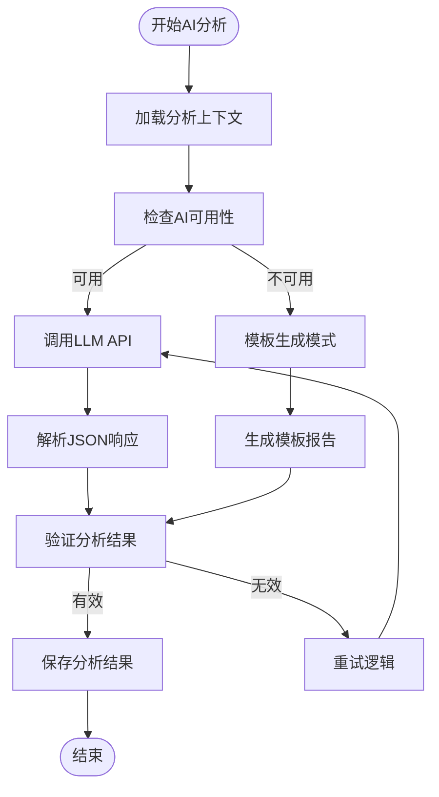
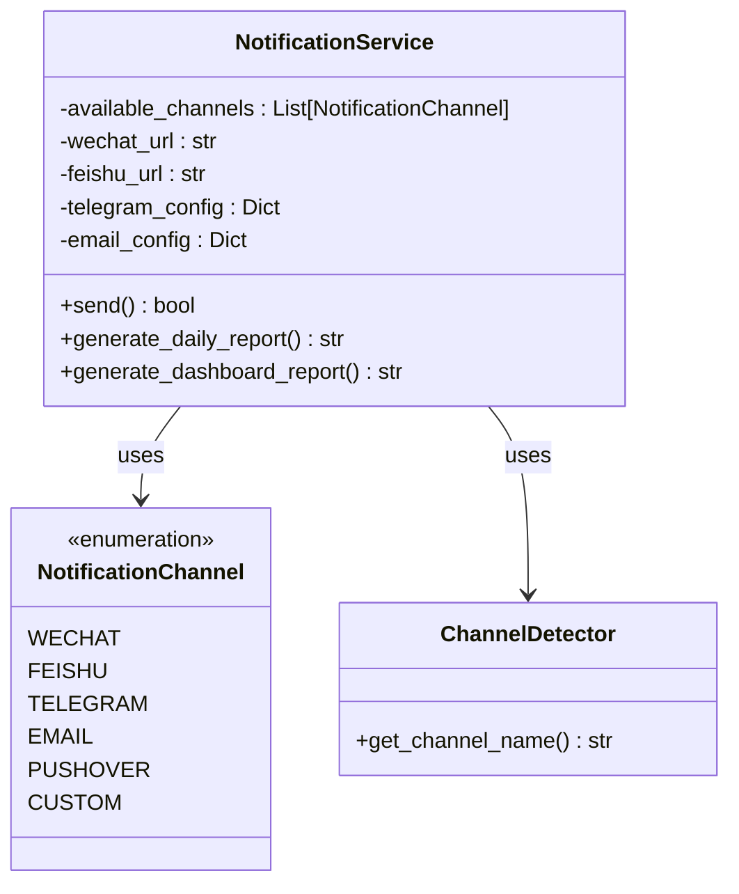
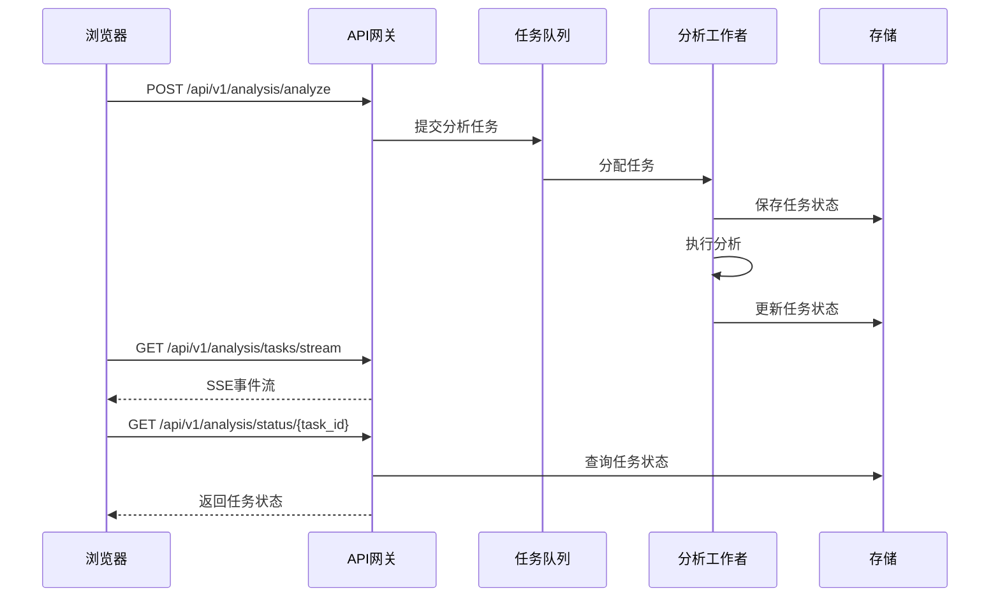
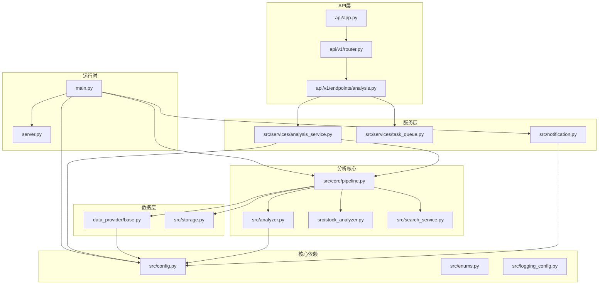

# 系统设计概览

<cite>
**本文档引用的文件**
- [main.py](file://main.py)
- [server.py](file://server.py)
- [src/config.py](file://src/config.py)
- [src/enums.py](file://src/enums.py)
- [api/app.py](file://api/app.py)
- [src/core/pipeline.py](file://src/core/pipeline.py)
- [src/services/analysis_service.py](file://src/services/analysis_service.py)
- [src/notification.py](file://src/notification.py)
- [data_provider/base.py](file://data_provider/base.py)
- [api/v1/router.py](file://api/v1/router.py)
- [src/analyzer.py](file://src/analyzer.py)
- [src/search_service.py](file://src/search_service.py)
- [src/stock_analyzer.py](file://src/stock_analyzer.py)
- [api/v1/endpoints/analysis.py](file://api/v1/endpoints/analysis.py)
- [src/core/market_review.py](file://src/core/market_review.py)
</cite>

## 目录
1. [引言](#引言)
2. [项目结构](#项目结构)
3. [核心组件](#核心组件)
4. [架构概览](#架构概览)
5. [详细组件分析](#详细组件分析)
6. [依赖关系分析](#依赖关系分析)
7. [性能考虑](#性能考虑)
8. [故障排查指南](#故障排查指南)
9. [结论](#结论)
10. [附录](#附录)

## 引言

本系统是一个面向A股/港股/美股市场的智能股票分析平台，提供从数据采集、技术面与消息面分析、AI决策生成到多渠道通知推送的完整自动化流程。系统采用分层架构设计，将表示层、业务层、数据层清晰分离，并通过统一的分析流水线协调各模块协作。

系统支持多种运行模式：
- 命令行模式：本地执行分析与推送
- Web服务模式：提供RESTful API与Web界面
- 定时任务模式：每日自动执行分析
- 批量分析模式：支持多股票并行分析

## 项目结构

系统采用模块化分层架构，主要目录结构如下：

**图表来源**
- [main.py:510-723](file://main.py#L510-L723)
- [api/app.py:48-209](file://api/app.py#L48-L209)
- [src/core/pipeline.py:48-120](file://src/core/pipeline.py#L48-L120)

**章节来源**
- [main.py:1-723](file://main.py#L1-L723)
- [api/app.py:1-209](file://api/app.py#L1-L209)

## 核心组件

### 配置管理模块
配置管理采用单例模式，集中管理全局配置参数，支持从.env文件、环境变量和代码默认值的多层次加载机制。

关键配置类别：
- **系统配置**：并发数、日志级别、代理设置
- **数据源配置**：Tushare Token、实时行情优先级
- **AI分析配置**：Gemini/OpenAI API Key、模型参数
- **通知配置**：多渠道推送参数
- **定时任务配置**：执行时间、合并推送设置

### 分析流水线
分析流水线是系统的核心调度器，负责协调数据获取、技术分析、消息搜索和AI分析等各个环节。

主要流程：
1. **数据获取**：统一通过DataFetcherManager管理多个数据源
2. **技术分析**：基于用户交易理念的多指标分析
3. **消息搜索**：集成多种搜索引擎获取实时新闻
4. **AI分析**：调用Gemini/OpenAI生成决策仪表盘
5. **结果保存**：持久化分析结果和上下文快照

### 通知系统
支持多种通知渠道的统一管理，包括企业微信、飞书、Telegram、邮件、Pushover等。

通知特点：
- **多渠道并发推送**：所有已配置渠道同时发送
- **智能格式化**：Markdown格式报告自动生成
- **长度限制处理**：针对不同渠道的消息长度限制
- **上下文通道**：支持基于消息上下文的临时回复通道

**章节来源**
- [src/config.py:31-580](file://src/config.py#L31-L580)
- [src/core/pipeline.py:48-430](file://src/core/pipeline.py#L48-L430)
- [src/notification.py:113-800](file://src/notification.py#L113-L800)

## 架构概览

系统采用分层架构设计，各层职责明确，耦合度低，便于维护和扩展。

**图表来源**
- [main.py:510-723](file://main.py#L510-L723)
- [src/services/analysis_service.py:29-171](file://src/services/analysis_service.py#L29-L171)
- [src/core/pipeline.py:48-120](file://src/core/pipeline.py#L48-L120)

### 系统边界

系统边界定义清晰，主要对外接口包括：

**外部系统接口**：
- 股票数据源API（Tushare、Akshare等）
- 搜索引擎API（Tavily、Bocha、SerpAPI等）
- AI模型API（Gemini、OpenAI等）
- 通知渠道API（企业微信、飞书、Telegram等）

**内部模块边界**：
- 表示层与业务层通过API接口通信
- 业务层与数据层通过统一的数据管理器接口
- 核心分析层独立于数据源实现

## 详细组件分析

### 分析流水线组件

分析流水线是系统的核心，负责协调各个分析模块的工作流程。

**图表来源**
- [src/core/pipeline.py:183-430](file://src/core/pipeline.py#L183-L430)
- [src/analyzer.py:334-800](file://src/analyzer.py#L334-L800)

#### 数据获取层

数据获取层采用策略模式，通过DataFetcherManager统一管理多个数据源，实现自动故障切换和负载均衡。

**图表来源**
- [data_provider/base.py:464-800](file://data_provider/base.py#L464-L800)

#### AI分析引擎

AI分析引擎基于决策仪表盘模式，结合技术面和消息面数据生成专业的分析报告。

**图表来源**
- [src/analyzer.py:531-800](file://src/analyzer.py#L531-L800)

#### 通知系统组件

通知系统支持多种推送渠道，采用统一接口管理不同平台的差异化实现。

**图表来源**
- [src/notification.py:113-800](file://src/notification.py#L113-L800)

**章节来源**
- [src/core/pipeline.py:128-430](file://src/core/pipeline.py#L128-L430)
- [src/analyzer.py:164-800](file://src/analyzer.py#L164-L800)
- [src/notification.py:47-800](file://src/notification.py#L47-L800)

### API服务组件

API服务层提供RESTful接口，支持异步任务队列和实时状态推送。

**图表来源**
- [api/v1/endpoints/analysis.py:88-571](file://api/v1/endpoints/analysis.py#L88-L571)
- [api/app.py:48-209](file://api/app.py#L48-L209)

**章节来源**
- [api/v1/endpoints/analysis.py:1-694](file://api/v1/endpoints/analysis.py#L1-L694)
- [api/v1/router.py:12-72](file://api/v1/router.py#L12-L72)

## 依赖关系分析

系统采用模块化设计，各组件间的依赖关系清晰明确。

**图表来源**
- [main.py:24-723](file://main.py#L24-L723)
- [api/app.py:25-209](file://api/app.py#L25-L209)

### 关键依赖关系

1. **配置依赖**：所有模块都依赖Config.get_instance()获取统一配置
2. **数据依赖**：分析流水线依赖数据管理器获取数据
3. **AI依赖**：分析模块依赖AI分析器进行智能分析
4. **通知依赖**：通知服务依赖配置管理不同渠道参数

**章节来源**
- [src/config.py:232-580](file://src/config.py#L232-L580)
- [src/core/pipeline.py:24-120](file://src/core/pipeline.py#L24-L120)

## 性能考虑

系统在设计时充分考虑了性能优化和可扩展性：

### 并发控制
- **低并发设计**：默认最大并发数为3，避免API限流和封禁
- **线程池管理**：使用ThreadPoolExecutor控制并发度
- **任务队列**：支持异步任务队列，避免阻塞请求

### 缓存策略
- **实时数据缓存**：实时行情数据缓存10分钟
- **搜索结果缓存**：搜索结果进行缓存处理
- **基本面数据缓存**：定期缓存基本面数据

### 网络优化
- **智能代理配置**：自动配置代理并排除国内数据源
- **指数退避重试**：网络请求采用指数退避策略
- **熔断保护**：数据源失败时自动熔断保护

### 可扩展性设计
- **插件化架构**：支持新增数据源和分析算法
- **配置驱动**：通过配置文件控制各种行为
- **模块化设计**：各模块职责明确，易于扩展

## 故障排查指南

### 常见问题及解决方案

**数据获取失败**
- 检查网络连接和代理配置
- 验证数据源API Key有效性
- 查看数据源优先级配置

**AI分析不可用**
- 确认Gemini/OpenAI API Key配置
- 检查API配额和限流设置
- 验证模型参数配置

**通知推送失败**
- 检查各通知渠道的配置参数
- 验证网络连接和权限设置
- 查看通知服务的错误日志

**性能问题**
- 调整并发数配置
- 检查缓存配置和命中率
- 监控API限流情况

**章节来源**
- [src/config.py:507-547](file://src/config.py#L507-L547)
- [src/notification.py:281-284](file://src/notification.py#L281-L284)

## 结论

本系统通过清晰的分层架构设计，实现了从数据获取到智能分析再到通知推送的完整自动化流程。系统具有以下优势：

1. **架构清晰**：分层设计使得各模块职责明确，便于维护和扩展
2. **可靠性高**：多重容错机制和熔断保护确保系统稳定性
3. **性能优秀**：合理的并发控制和缓存策略保证系统响应速度
4. **可扩展性强**：模块化设计支持功能扩展和定制化需求
5. **用户体验好**：支持多种运行模式和通知渠道

系统为股票智能分析提供了完整的技术解决方案，既适合个人使用，也适合团队协作和企业部署。

## 附录

### 系统配置参考

**核心配置参数**：
- `max_workers`: 最大并发数（默认3）
- `analysis_delay`: 分析间隔时间（秒）
- `enable_realtime_quote`: 实时行情开关
- `enable_chip_distribution`: 筹码分布分析开关

**通知配置示例**：
- 企业微信：`WECHAT_WEBHOOK_URL`
- 飞书：`FEISHU_WEBHOOK_URL`
- Telegram：`TELEGRAM_BOT_TOKEN`, `TELEGRAM_CHAT_ID`
- 邮件：`EMAIL_SENDER`, `EMAIL_PASSWORD`

**章节来源**
- [src/config.py:152-437](file://src/config.py#L152-L437)