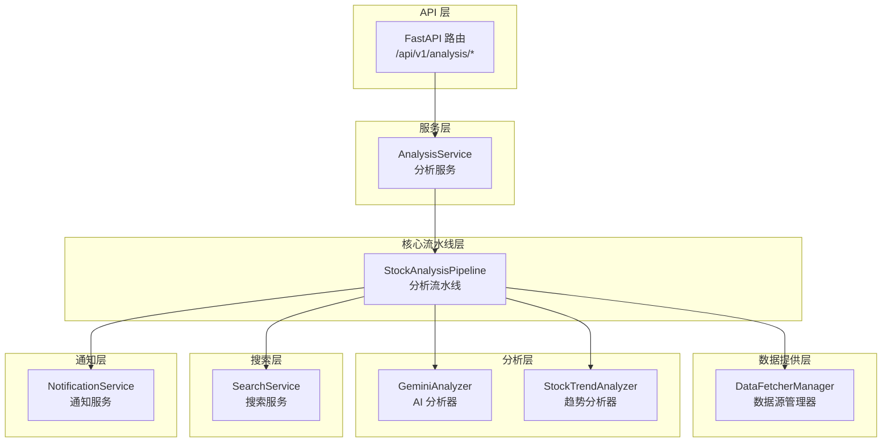
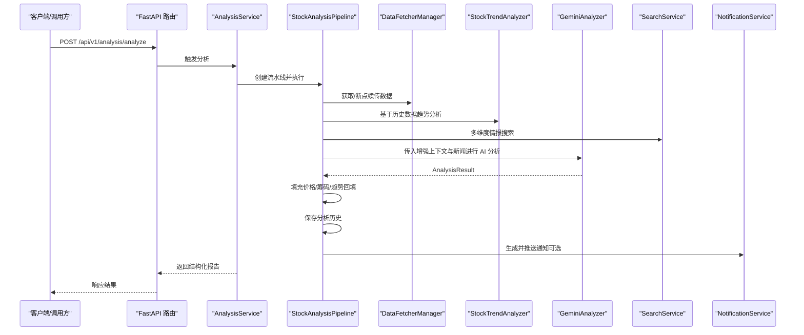
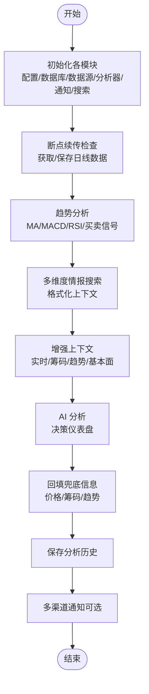
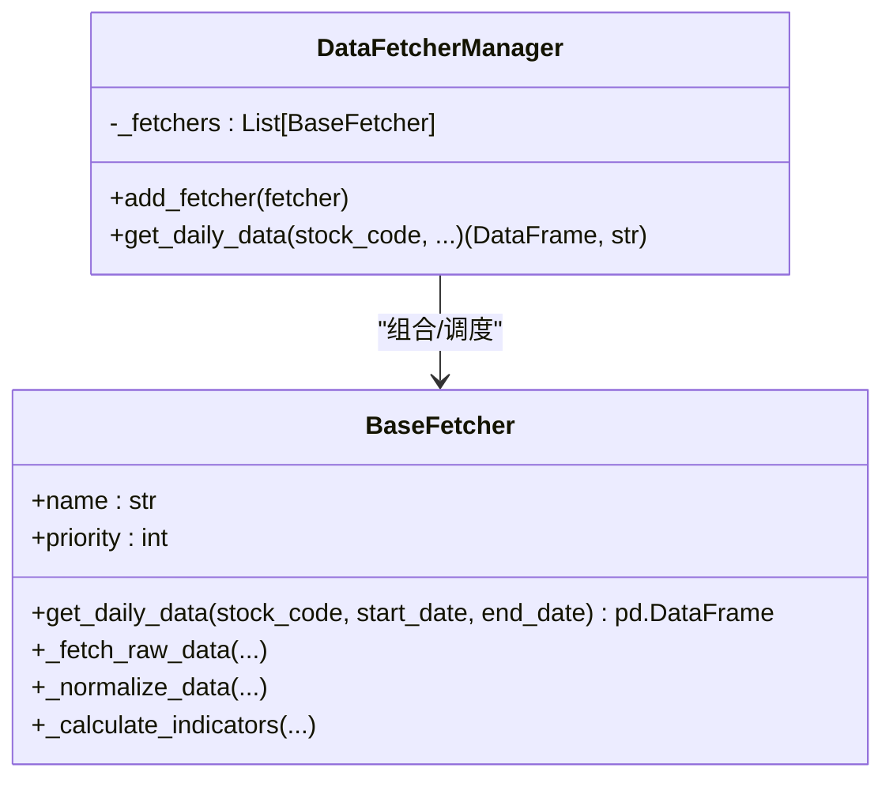
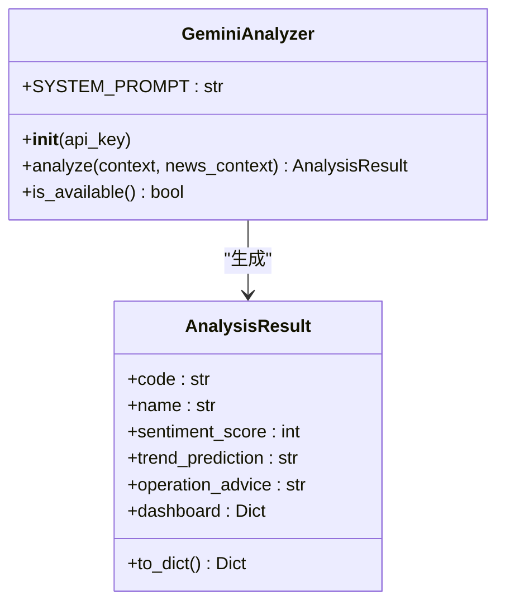
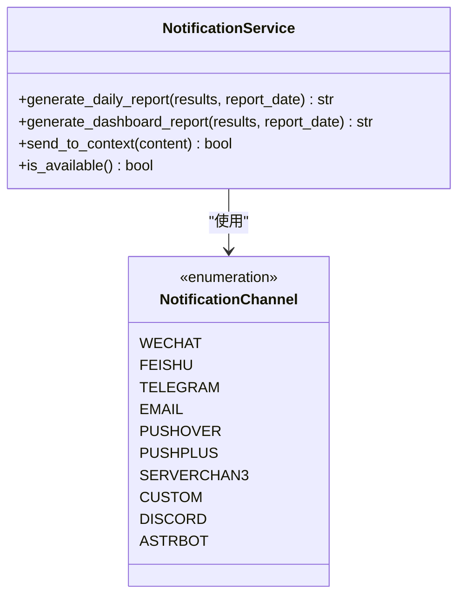
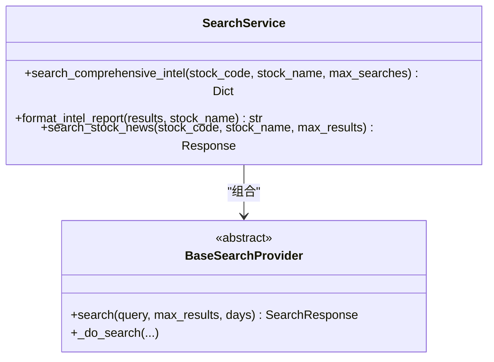
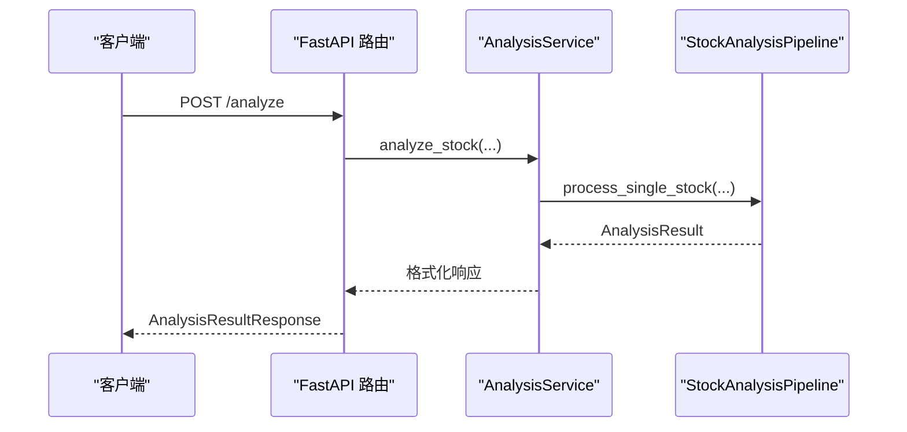
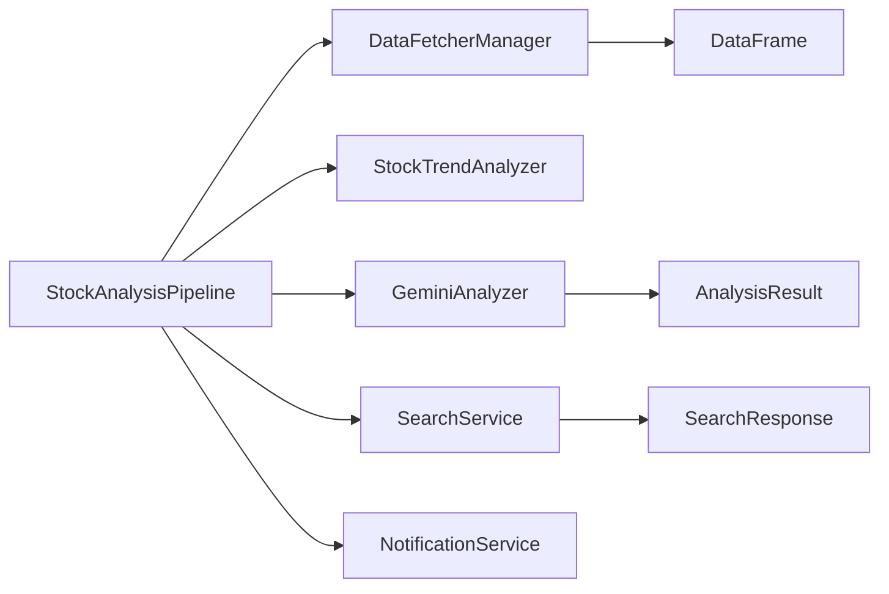

# 组件交互关系

<cite>
**本文引用的文件**
- [src/core/pipeline.py](file://src/core/pipeline.py)
- [src/analyzer.py](file://src/analyzer.py)
- [src/notification.py](file://src/notification.py)
- [data_provider/base.py](file://data_provider/base.py)
- [src/stock_analyzer.py](file://src/stock_analyzer.py)
- [src/search_service.py](file://src/search_service.py)
- [api/v1/endpoints/analysis.py](file://api/v1/endpoints/analysis.py)
- [src/services/analysis_service.py](file://src/services/analysis_service.py)
- [src/enums.py](file://src/enums.py)
- [src/config.py](file://src/config.py)
</cite>

## 目录
1. [简介](#简介)
2. [项目结构](#项目结构)
3. [核心组件](#核心组件)
4. [架构总览](#架构总览)
5. [详细组件分析](#详细组件分析)
6. [依赖关系分析](#依赖关系分析)
7. [性能考量](#性能考量)
8. [故障排查指南](#故障排查指南)
9. [结论](#结论)

## 简介
本文面向“股票智能分析系统”，聚焦于组件交互关系与通信机制，重点阐述 StockAnalysisPipeline 如何协调 DataFetcherManager、GeminiAnalyzer、NotificationService 等模块协同工作；解释组件间的依赖关系、调用顺序与数据传递方式；提供组件交互时序图与关键接口说明；并总结模块化与解耦设计原则及实践。

## 项目结构
系统采用分层架构：
- API 层：提供 REST 接口，封装任务提交、状态查询与实时推送
- 服务层：封装业务逻辑，协调流水线与持久化
- 核心流水线层：StockAnalysisPipeline 作为主调度器，编排数据获取、趋势分析、AI 分析与通知
- 数据提供层：DataFetcherManager 统一管理多数据源，实现自动故障切换
- 分析层：GeminiAnalyzer 负责 AI 分析；StockTrendAnalyzer 基于交易理念进行技术面分析
- 搜索层：SearchService 统一新闻与情报搜索，支持多搜索引擎
- 通知层：NotificationService 负责多渠道推送与日报生成

图表来源
- [api/v1/endpoints/analysis.py:1-694](file://api/v1/endpoints/analysis.py#L1-694)
- [src/services/analysis_service.py:1-171](file://src/services/analysis_service.py#L1-171)
- [src/core/pipeline.py:1-1464](file://src/core/pipeline.py#L1-1464)
- [data_provider/base.py:1-2286](file://data_provider/base.py#L1-2286)
- [src/stock_analyzer.py:1-848](file://src/stock_analyzer.py#L1-848)
- [src/analyzer.py:1-1539](file://src/analyzer.py#L1-1539)
- [src/search_service.py:1-2568](file://src/search_service.py#L1-2568)
- [src/notification.py:1-3255](file://src/notification.py#L1-3255)

章节来源
- [api/v1/endpoints/analysis.py:1-694](file://api/v1/endpoints/analysis.py#L1-694)
- [src/services/analysis_service.py:1-171](file://src/services/analysis_service.py#L1-171)
- [src/core/pipeline.py:1-1464](file://src/core/pipeline.py#L1-1464)

## 核心组件
- StockAnalysisPipeline：主调度器，负责协调数据获取、趋势分析、新闻情报、AI 分析与历史保存，并在 Agent 模式与传统模式间切换
- DataFetcherManager：策略模式的数据源管理器，统一入口、自动故障切换与熔断保护
- StockTrendAnalyzer：基于交易理念的技术面分析器，输出趋势状态、买卖信号与评分
- GeminiAnalyzer：封装 Gemini/OpenAI 调用，生成决策仪表盘式分析结果
- SearchService：统一新闻与情报搜索，支持多搜索引擎与多 Key 负载均衡
- NotificationService：多渠道通知与日报生成
- AnalysisService：对外暴露的分析服务封装，对接 API 层
- AnalysisReport/ReportType：报告类型与结构化输出

章节来源
- [src/core/pipeline.py:48-120](file://src/core/pipeline.py#L48-120)
- [data_provider/base.py:464-799](file://data_provider/base.py#L464-799)
- [src/stock_analyzer.py:171-848](file://src/stock_analyzer.py#L171-848)
- [src/analyzer.py:334-800](file://src/analyzer.py#L334-800)
- [src/search_service.py:1-2568](file://src/search_service.py#L1-2568)
- [src/notification.py:113-3255](file://src/notification.py#L113-3255)
- [src/services/analysis_service.py:29-171](file://src/services/analysis_service.py#L29-171)
- [src/enums.py:13-51](file://src/enums.py#L13-51)

## 架构总览
StockAnalysisPipeline 作为核心枢纽，串联数据、分析与通知三大模块。其内部通过上下文增强与结果回填实现数据闭环，并在 Agent 模式与传统模式间灵活切换，保证分析能力与成本控制的平衡。

图表来源
- [api/v1/endpoints/analysis.py:88-301](file://api/v1/endpoints/analysis.py#L88-301)
- [src/services/analysis_service.py:40-105](file://src/services/analysis_service.py#L40-105)
- [src/core/pipeline.py:183-430](file://src/core/pipeline.py#L183-430)
- [src/analyzer.py:334-800](file://src/analyzer.py#L334-800)
- [src/stock_analyzer.py:205-262](file://src/stock_analyzer.py#L205-262)
- [src/search_service.py:1-2568](file://src/search_service.py#L1-2568)
- [src/notification.py:113-3255](file://src/notification.py#L113-3255)

## 详细组件分析

### StockAnalysisPipeline 协调机制
- 初始化阶段：注入配置、数据库、数据源管理器、趋势分析器、AI 分析器、通知服务、搜索服务与社交舆情服务
- 数据获取：断点续传逻辑优先使用数据库今日数据，避免重复网络请求；否则通过 DataFetcherManager 获取并保存
- 趋势分析：基于历史数据计算 MA、MACD、RSI 等指标，输出趋势状态与买卖信号
- 情报搜索：多搜索引擎聚合，格式化为上下文并持久化
- AI 分析：构建增强上下文（实时行情、筹码、趋势、基本面等），调用 GeminiAnalyzer 生成决策仪表盘
- 结果回填：填充价格位置、筹码结构等兜底信息，保存分析历史
- 通知：按配置多渠道推送

图表来源
- [src/core/pipeline.py:128-430](file://src/core/pipeline.py#L128-430)
- [src/stock_analyzer.py:205-745](file://src/stock_analyzer.py#L205-745)
- [src/analyzer.py:334-800](file://src/analyzer.py#L334-800)
- [src/search_service.py:1-2568](file://src/search_service.py#L1-2568)
- [src/notification.py:113-3255](file://src/notification.py#L113-3255)

章节来源
- [src/core/pipeline.py:48-120](file://src/core/pipeline.py#L48-120)
- [src/core/pipeline.py:128-430](file://src/core/pipeline.py#L128-430)

### DataFetcherManager（数据源策略管理器）
- 设计模式：策略模式 + 自动故障切换
- 职责：统一数据获取接口、按优先级自动切换、失败熔断与重试、标准化列名与技术指标
- 优势：屏蔽底层数据源差异，提升稳定性与可维护性

图表来源
- [data_provider/base.py:233-462](file://data_provider/base.py#L233-462)
- [data_provider/base.py:464-799](file://data_provider/base.py#L464-799)

章节来源
- [data_provider/base.py:1-2286](file://data_provider/base.py#L1-2286)

### GeminiAnalyzer（AI 分析器）
- 职责：封装 Gemini/OpenAI 调用，系统提示词驱动的决策仪表盘输出
- 特性：主备模型切换、指数退避重试、参数兼容适配、错误降级

图表来源
- [src/analyzer.py:334-800](file://src/analyzer.py#L334-800)
- [src/analyzer.py:164-285](file://src/analyzer.py#L164-285)

章节来源
- [src/analyzer.py:334-800](file://src/analyzer.py#L334-800)

### NotificationService（通知服务）
- 职责：多渠道推送（企业微信、飞书、Telegram、邮件、Pushover、Discord、自定义 Webhook 等）
- 特性：渠道检测、Markdown 格式、日报生成、长度限制与并发推送

图表来源
- [src/notification.py:113-3255](file://src/notification.py#L113-3255)

章节来源
- [src/notification.py:113-3255](file://src/notification.py#L113-3255)

### SearchService（搜索服务）
- 职责：统一新闻与情报搜索，支持 Bocha、Tavily、Brave、SerpAPI、MiniMax 等
- 特性：多 Key 负载均衡、瞬时网络错误重试、结果缓存与格式化

图表来源
- [src/search_service.py:1-2568](file://src/search_service.py#L1-2568)

章节来源
- [src/search_service.py:1-2568](file://src/search_service.py#L1-2568)

### AnalysisService 与 API 层
- AnalysisService：封装分析服务，创建 Pipeline 并构建响应结构
- API 层：提供触发分析、查询任务状态、SSE 实时推送等接口

图表来源
- [api/v1/endpoints/analysis.py:88-301](file://api/v1/endpoints/analysis.py#L88-301)
- [src/services/analysis_service.py:40-105](file://src/services/analysis_service.py#L40-105)

章节来源
- [api/v1/endpoints/analysis.py:1-694](file://api/v1/endpoints/analysis.py#L1-694)
- [src/services/analysis_service.py:1-171](file://src/services/analysis_service.py#L1-171)

## 依赖关系分析
- 组件耦合与内聚
  - Pipeline 与 DataFetcherManager：通过统一接口解耦数据源差异，内聚于“断点续传 + 自动切换”
  - Pipeline 与 Analyzer/GeminiAnalyzer：通过上下文与 AnalysisResult 解耦，便于替换模型或分析策略
  - Pipeline 与 SearchService：通过“情报上下文”解耦，支持多搜索引擎与降级
  - Pipeline 与 NotificationService：通过“分析历史 + 报告生成”解耦，支持异步通知
- 外部依赖与集成点
  - 数据源：AkShare、Tushare、PyTDX、Baostock、YFinance、TickFlow 等
  - 搜索引擎：Bocha、Tavily、Brave、SerpAPI、MiniMax
  - 通知渠道：企业微信、飞书、Telegram、邮件、Pushover、Discord、自定义 Webhook
- 接口契约
  - DataFetcherManager：统一 get_daily_data(stock_code, ...) 返回 DataFrame 与来源标识
  - SearchService：统一 search_comprehensive_intel(...) 返回维度化结果
  - GeminiAnalyzer：统一 analyze(context, news_context) 返回 AnalysisResult
  - NotificationService：统一 generate_daily_report()/generate_dashboard_report() 返回 Markdown

图表来源
- [src/core/pipeline.py:1-1464](file://src/core/pipeline.py#L1-1464)
- [data_provider/base.py:1-2286](file://data_provider/base.py#L1-2286)
- [src/analyzer.py:1-1539](file://src/analyzer.py#L1-1539)
- [src/search_service.py:1-2568](file://src/search_service.py#L1-2568)
- [src/notification.py:1-3255](file://src/notification.py#L1-3255)

章节来源
- [src/core/pipeline.py:1-1464](file://src/core/pipeline.py#L1-1464)
- [src/analyzer.py:1-1539](file://src/analyzer.py#L1-1539)
- [src/search_service.py:1-2568](file://src/search_service.py#L1-2568)
- [src/notification.py:1-3255](file://src/notification.py#L1-3255)

## 性能考量
- 并发与限流
  - Pipeline 使用 ThreadPoolExecutor 控制最大并发，避免 API 限流与封禁
  - DataFetcherManager 内置随机休眠与指数退避，降低被封概率
- 缓存与断点续传
  - 断点续传避免重复抓取，显著降低网络与存储压力
  - 实时行情缓存 TTL 与熔断器冷却时间，平衡新鲜度与稳定性
- 搜索与分析
  - 搜索服务多 Key 负载均衡与瞬时错误重试，提升成功率
  - AI 分析主备模型切换与参数兼容，提高可用性

## 故障排查指南
- 数据获取失败
  - 检查 DataFetcherManager 的优先级与可用性，确认是否触发自动切换
  - 查看断点续传逻辑与数据库保存状态
- AI 分析不可用
  - 检查 Gemini/OpenAI Key 配置与网络代理设置
  - 关注重试与模型切换日志
- 搜索服务异常
  - 核对多 Key 配置与配额状态，查看瞬时错误重试记录
- 通知失败
  - 检查各渠道配置与可用性，关注长度限制与并发推送
- 配置校验
  - 使用配置校验函数输出缺失或无效项提示

章节来源
- [src/config.py:507-546](file://src/config.py#L507-546)
- [data_provider/base.py:1-2286](file://data_provider/base.py#L1-2286)
- [src/analyzer.py:567-786](file://src/analyzer.py#L567-786)
- [src/search_service.py:1-2568](file://src/search_service.py#L1-2568)
- [src/notification.py:113-3255](file://src/notification.py#L113-3255)

## 结论
StockAnalysisPipeline 通过清晰的模块划分与接口抽象，实现了数据、分析与通知的高效协同。其策略模式的数据源管理、多搜索引擎的搜索服务、以及可插拔的通知通道，共同构成了高可用、可扩展的股票智能分析体系。通过断点续传、并发控制、熔断与重试等机制，系统在稳定性与性能之间取得良好平衡；通过上下文增强与结果回填，确保分析质量与可追溯性。