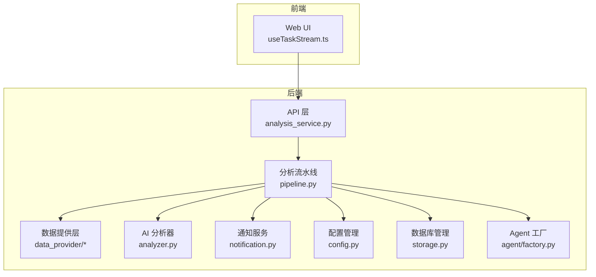
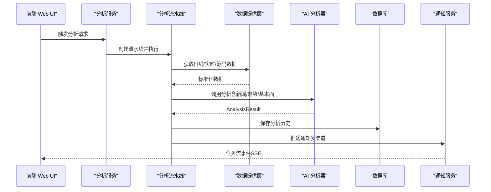
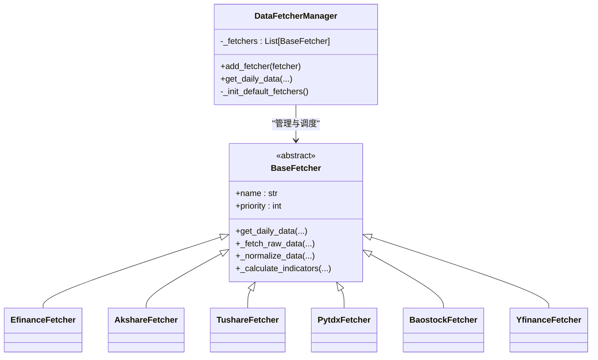
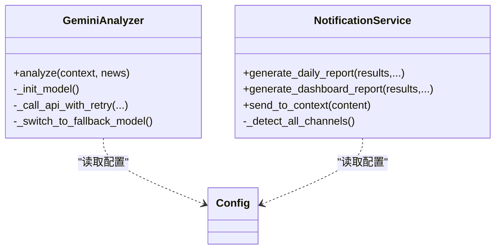
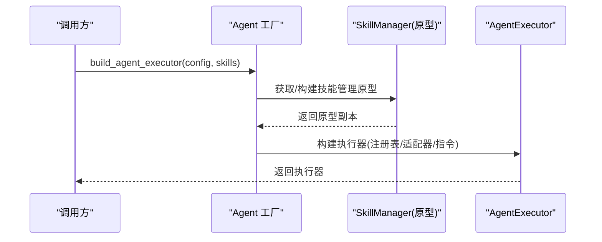
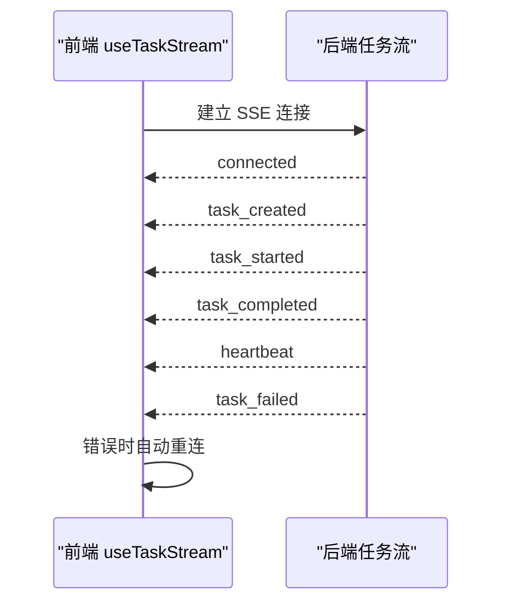
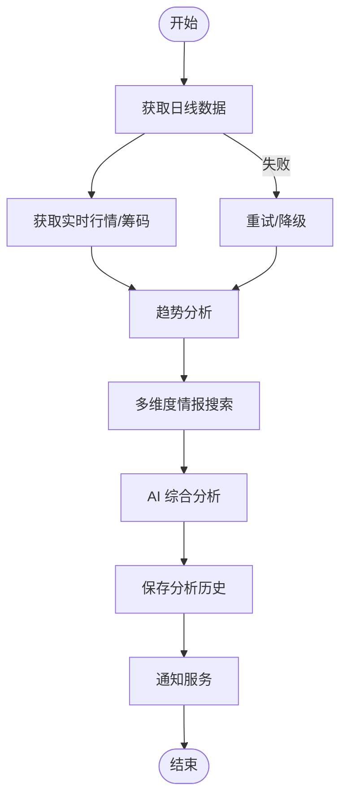
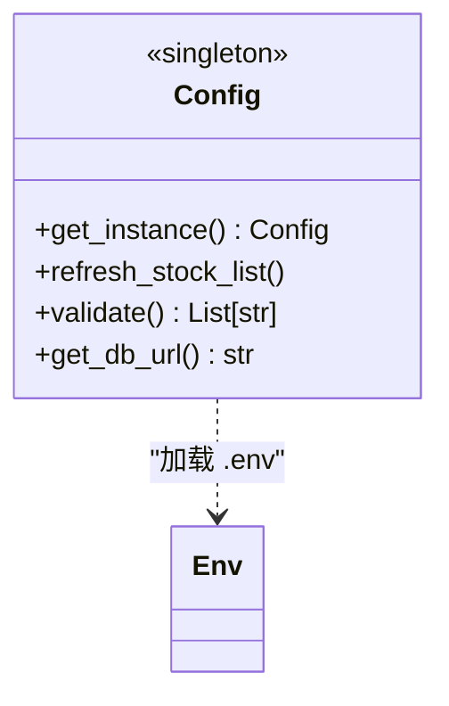
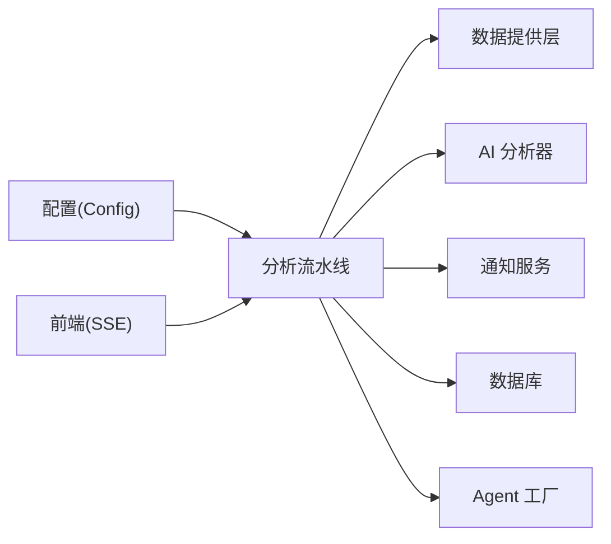

# 设计模式应用

<cite>
**本文档引用的文件**
- [src/config.py](file://src/config.py)
- [data_provider/base.py](file://data_provider/base.py)
- [data_provider/__init__.py](file://data_provider/__init__.py)
- [src/analyzer.py](file://src/analyzer.py)
- [src/notification.py](file://src/notification.py)
- [src/core/pipeline.py](file://src/core/pipeline.py)
- [src/agent/factory.py](file://src/agent/factory.py)
- [apps/dsa-web/src/hooks/useTaskStream.ts](file://apps/dsa-web/src/hooks/useTaskStream.ts)
- [src/enums.py](file://src/enums.py)
- [src/core/trading_calendar.py](file://src/core/trading_calendar.py)
</cite>

## 目录
1. [引言](#引言)
2. [项目结构](#项目结构)
3. [核心组件](#核心组件)
4. [架构总览](#架构总览)
5. [详细组件分析](#详细组件分析)
6. [依赖分析](#依赖分析)
7. [性能考虑](#性能考虑)
8. [故障排查指南](#故障排查指南)
9. [结论](#结论)

## 引言
本文件聚焦于股票智能分析系统中设计模式的应用与实践，围绕策略模式、工厂模式、观察者模式、责任链模式与单例模式展开，结合代码实现与架构图示，帮助读者快速理解各模式在系统中的落地方式、优势与适用场景，并提供替代方案对比与最佳实践建议。

## 项目结构
系统采用分层架构：前端 Web UI 通过 API 触发分析；后端由服务层、核心分析流水线、数据提供层、通知层与配置层组成；Agent 多智能体体系提供可插拔的策略执行能力。关键设计模式贯穿于数据源管理、分析执行、通知分发与配置管理等环节。

图表来源
- [src/core/pipeline.py](file://src/core/pipeline.py)
- [src/analyzer.py](file://src/analyzer.py)
- [src/notification.py](file://src/notification.py)
- [src/config.py](file://src/config.py)
- [data_provider/base.py](file://data_provider/base.py)
- [src/agent/factory.py](file://src/agent/factory.py)

章节来源
- [src/core/pipeline.py](file://src/core/pipeline.py)
- [src/analyzer.py](file://src/analyzer.py)
- [src/notification.py](file://src/notification.py)
- [src/config.py](file://src/config.py)
- [data_provider/base.py](file://data_provider/base.py)
- [src/agent/factory.py](file://src/agent/factory.py)

## 核心组件
- 配置管理（单例模式）：全局配置集中管理，提供类型安全访问与热更新能力。
- 数据源策略（策略模式）：统一抽象与自动切换，提升鲁棒性与可扩展性。
- AI 分析器（策略模式）：统一分析接口与备选模型切换，保障可用性。
- 通知服务（策略模式）：多渠道推送统一入口，自动识别与并发发送。
- 分析流水线（责任链模式）：串联数据获取、趋势分析、情报搜索、AI 分析、历史保存等步骤。
- Agent 工厂（工厂模式）：统一构建多智能体执行器，支持缓存与可插拔策略。
- 任务流观察者（观察者模式）：前端通过 SSE 订阅任务状态事件，实现实时更新。

章节来源
- [src/config.py](file://src/config.py)
- [data_provider/base.py](file://data_provider/base.py)
- [src/analyzer.py](file://src/analyzer.py)
- [src/notification.py](file://src/notification.py)
- [src/core/pipeline.py](file://src/core/pipeline.py)
- [src/agent/factory.py](file://src/agent/factory.py)
- [apps/dsa-web/src/hooks/useTaskStream.ts](file://apps/dsa-web/src/hooks/useTaskStream.ts)

## 架构总览
系统通过“配置中心 + 数据策略 + 分析流水线 + AI + 通知 + 数据库”的组合，形成高内聚、低耦合的分析闭环。设计模式在此过程中分别承担“统一接口与可替换性”、“可扩展构建”、“事件驱动更新”、“流程编排”与“全局状态”。

图表来源
- [src/services/analysis_service.py](file://src/services/analysis_service.py)
- [src/core/pipeline.py](file://src/core/pipeline.py)
- [data_provider/base.py](file://data_provider/base.py)
- [src/analyzer.py](file://src/analyzer.py)
- [src/notification.py](file://src/notification.py)
- [apps/dsa-web/src/hooks/useTaskStream.ts](file://apps/dsa-web/src/hooks/useTaskStream.ts)

## 详细组件分析

### 策略模式：数据源管理器
- 目标：统一数据获取接口，自动故障切换，降低对单一数据源的依赖。
- 实现要点
  - 抽象基类定义统一接口与标准化流程（获取日线、清洗、指标计算、异常封装）。
  - 管理器维护优先级列表，按优先级尝试，失败自动切换，记录失败原因。
  - 动态优先级：当配置了特定 Token 时，相应数据源优先级提升。
  - 扩展性：新增数据源只需实现基类接口并声明优先级，即可无缝接入。
- 优势
  - 提升可用性与稳定性，避免单点故障。
  - 便于灰度与A/B策略（不同优先级组合）。
- 适用场景
  - 多数据源并存、API 限流与封禁风险高的场景。
- 替代方案
  - 简单 if/else 判断：可读性差、扩展困难。
  - 状态机：复杂度更高，策略模式更贴合“可替换算法族”的场景。

图表来源
- [data_provider/base.py](file://data_provider/base.py)
- [data_provider/__init__.py](file://data_provider/__init__.py)

章节来源
- [data_provider/base.py](file://data_provider/base.py)
- [data_provider/__init__.py](file://data_provider/__init__.py)

### 策略模式：AI 分析器与通知服务
- AI 分析器（策略模式）
  - 统一分析接口，优先使用主模型，失败自动切换备选模型，必要时回退到兼容 API。
  - 通过配置决定模型与温度、重试策略，保证稳定性与一致性。
- 通知服务（策略模式）
  - 统一生成 Markdown 报告，自动检测可用渠道并并发推送。
  - 支持多种渠道（企业微信、飞书、Telegram、邮件、Pushover、Discord 等），按配置启用。

图表来源
- [src/analyzer.py](file://src/analyzer.py)
- [src/notification.py](file://src/notification.py)
- [src/config.py](file://src/config.py)

章节来源
- [src/analyzer.py](file://src/analyzer.py)
- [src/notification.py](file://src/notification.py)
- [src/config.py](file://src/config.py)

### 工厂模式：Agent 工厂与分析服务
- Agent 工厂（工厂模式）
  - 统一构建 Agent 执行器，缓存工具注册表与技能管理原型，按需复制克隆，兼顾性能与线程安全。
  - 支持多智能体编排（多 Agent 模式）与单智能体执行器，按配置切换。
- 分析服务（工厂模式）
  - 封装分析流程，创建分析流水线并归一化报告类型，对外暴露简洁接口。

图表来源
- [src/agent/factory.py](file://src/agent/factory.py)

章节来源
- [src/agent/factory.py](file://src/agent/factory.py)
- [src/services/analysis_service.py](file://src/services/analysis_service.py)

### 观察者模式：任务流事件与前端订阅
- 前端通过 SSE 订阅任务状态事件（创建、开始、完成、失败、心跳），实现无侵入的实时更新。
- 后端在分析流水线中按阶段推送事件，前端 Hook 负责解析与重连。

图表来源
- [apps/dsa-web/src/hooks/useTaskStream.ts](file://apps/dsa-web/src/hooks/useTaskStream.ts)

章节来源
- [apps/dsa-web/src/hooks/useTaskStream.ts](file://apps/dsa-web/src/hooks/useTaskStream.ts)

### 责任链模式：分析流水线
- 分析流水线将“数据获取 → 实时行情/筹码 → 趋势分析 → 情报搜索 → AI 分析 → 历史保存 → 通知”串联为链式处理。
- 每个阶段可独立失败与降级，不影响整体流程；支持 Agent 模式与传统模式双通道。

图表来源
- [src/core/pipeline.py](file://src/core/pipeline.py)

章节来源
- [src/core/pipeline.py](file://src/core/pipeline.py)

### 单例模式：配置管理
- 全局配置类通过单例模式确保唯一实例与环境变量一次性加载，避免重复 IO 与状态不一致。
- 提供便捷访问函数与热读取能力，支持运行时刷新自选股列表。

图表来源
- [src/config.py](file://src/config.py)

章节来源
- [src/config.py](file://src/config.py)

## 依赖分析
- 配置层：被分析流水线、通知服务、AI 分析器、Agent 工厂广泛依赖，是系统中枢。
- 数据层：策略模式解耦具体数据源，管理器集中调度，便于扩展与灰度。
- 分析层：流水线串联各模块，既可走传统路径，也可走 Agent 路径，具备可插拔性。
- 通知层：策略模式统一多渠道，自动识别与并发发送，降低耦合。
- 前端：通过 SSE 订阅任务事件，实现观察者模式的前端落地。

图表来源
- [src/config.py](file://src/config.py)
- [src/core/pipeline.py](file://src/core/pipeline.py)
- [src/analyzer.py](file://src/analyzer.py)
- [src/notification.py](file://src/notification.py)
- [src/agent/factory.py](file://src/agent/factory.py)
- [apps/dsa-web/src/hooks/useTaskStream.ts](file://apps/dsa-web/src/hooks/useTaskStream.ts)

章节来源
- [src/config.py](file://src/config.py)
- [src/core/pipeline.py](file://src/core/pipeline.py)
- [src/analyzer.py](file://src/analyzer.py)
- [src/notification.py](file://src/notification.py)
- [src/agent/factory.py](file://src/agent/factory.py)
- [apps/dsa-web/src/hooks/useTaskStream.ts](file://apps/dsa-web/src/hooks/useTaskStream.ts)

## 性能考虑
- 并发与限流
  - 分析流水线使用线程池控制最大并发，避免 API 限流与封禁风险。
  - 数据源层内置随机抖动与指数退避重试，降低集中请求概率。
- 缓存与降级
  - 数据提供层对基本面与实时数据进行缓存与熔断保护。
  - AI 分析器支持主备模型切换与兼容 API 回退。
- I/O 优化
  - 配置单例避免重复读取 .env；数据库连接池与预检减少连接开销。
- 前端体验
  - SSE 自动重连与事件解析，降低轮询成本，提升交互流畅度。

## 故障排查指南
- 数据源不可用
  - 检查配置中数据源 Token 与优先级；确认管理器日志中失败原因与切换记录。
  - 参考：[data_provider/base.py](file://data_provider/base.py)
- AI 分析不可用
  - 检查主/备模型配置与 API Key；查看回退逻辑与兼容 API 初始化日志。
  - 参考：[src/analyzer.py](file://src/analyzer.py)
- 通知未送达
  - 检查各渠道配置与可用性检测；确认并发发送与长度限制。
  - 参考：[src/notification.py](file://src/notification.py)
- 任务流无更新
  - 检查 SSE 连接状态、事件解析与自动重连策略。
  - 参考：[apps/dsa-web/src/hooks/useTaskStream.ts](file://apps/dsa-web/src/hooks/useTaskStream.ts)
- 配置异常
  - 使用配置校验函数输出警告；必要时重置单例实例进行测试。
  - 参考：[src/config.py](file://src/config.py)

章节来源
- [data_provider/base.py](file://data_provider/base.py)
- [src/analyzer.py](file://src/analyzer.py)
- [src/notification.py](file://src/notification.py)
- [apps/dsa-web/src/hooks/useTaskStream.ts](file://apps/dsa-web/src/hooks/useTaskStream.ts)
- [src/config.py](file://src/config.py)

## 结论
本系统通过策略模式、工厂模式、观察者模式、责任链模式与单例模式，构建了高可用、可扩展、可观测的智能分析平台。策略模式确保数据与分析路径的可替换性；工厂模式统一构建与缓存，提升性能与一致性；观察者模式实现前端实时更新；责任链模式清晰编排分析流程；单例模式保障配置的全局一致性与稳定性。这些设计模式共同提升了系统的可维护性与演进弹性，适合在复杂数据与多渠道场景下推广使用。