# 桌面应用

<cite>
**本文档引用的文件**
- [apps/dsa-desktop/main.js](file://apps/dsa-desktop/main.js)
- [apps/dsa-desktop/preload.js](file://apps/dsa-desktop/preload.js)
- [apps/dsa-desktop/package.json](file://apps/dsa-desktop/package.json)
- [apps/dsa-desktop/renderer/loading.html](file://apps/dsa-desktop/renderer/loading.html)
- [apps/dsa-desktop/installer.nsh](file://apps/dsa-desktop/installer.nsh)
- [apps/dsa-desktop/tests/main.test.js](file://apps/dsa-desktop/tests/main.test.js)
- [apps/dsa-web/vite.config.ts](file://apps/dsa-web/vite.config.ts)
- [apps/dsa-web/src/App.tsx](file://apps/dsa-web/src/App.tsx)
- [apps/dsa-web/src/api/index.ts](file://apps/dsa-web/src/api/index.ts)
- [apps/dsa-web/src/hooks/useTaskStream.ts](file://apps/dsa-web/src/hooks/useTaskStream.ts)
- [apps/dsa-web/src/pages/SettingsPage.tsx](file://apps/dsa-web/src/pages/SettingsPage.tsx)
- [api/v1/endpoints/system_config.py](file://api/v1/endpoints/system_config.py)
- [api/v1/schemas/system_config.py](file://api/v1/schemas/system_config.py)
- [src/services/system_config_service.py](file://src/services/system_config_service.py)
- [src/core/config_manager.py](file://src/core/config_manager.py)
- [scripts/build-desktop.ps1](file://scripts/build-desktop.ps1)
- [scripts/run-desktop.ps1](file://scripts/run-desktop.ps1)
- [main.py](file://main.py)
</cite>

## 更新摘要
**所做更改**
- 新增自动更新系统章节，详细说明基于 electron-updater 的自动更新实现
- 新增更新备份功能章节，涵盖运行时状态备份与恢复机制
- 新增安全增强章节，重点说明路径遍历漏洞修复和 URL 安全验证
- 更新改进的 IPC 通信章节，详细说明新的更新状态事件和 API
- 新增自动更新测试章节，展示完整的更新流程测试用例
- 更新打包配置和安装程序安全机制
- 增强系统配置管理的安全性和可靠性

## 目录
1. [简介](#简介)
2. [项目结构](#项目结构)
3. [核心组件](#核心组件)
4. [架构总览](#架构总览)
5. [详细组件分析](#详细组件分析)
6. [自动更新系统](#自动更新系统)
7. [更新备份功能](#更新备份功能)
8. [安全增强](#安全增强)
9. [改进的IPC通信](#改进的ipc通信)
10. [Windows 安装程序增强](#windows-安装程序增强)
11. [环境备份/恢复功能](#环境备份恢复功能)
12. [依赖关系分析](#依赖关系分析)
13. [性能考虑](#性能考虑)
14. [故障排查指南](#故障排查指南)
15. [结论](#结论)
16. [附录](#附录)

## 简介
本项目是一个基于 Electron 的桌面应用，采用"主进程 + 渲染进程 + 预加载脚本"的经典架构。主进程负责应用生命周期、窗口管理、本地资源准备与后端服务启动；渲染进程承载 Web UI；预加载脚本通过 contextBridge 安全地向渲染进程暴露有限的桌面能力。后端服务由 Python 主程序提供，桌面应用通过本地 HTTP 与之通信，并以静态资源形式集成前端构建产物。

**更新** 本版本重大改进包括：新增基于 electron-updater 的自动更新系统、完整的更新备份与恢复功能、安全增强（路径遍历漏洞修复）、改进的 IPC 通信机制，显著提升了桌面应用的用户体验和安全性。

## 项目结构
桌面应用相关的核心目录与文件如下：
- apps/dsa-desktop：Electron 应用源码，包含主进程、预加载脚本、加载页、安装程序配置与打包配置
- apps/dsa-web：React/Vite 前端源码，构建后输出至仓库根目录 static 目录，供桌面应用内嵌
- scripts：构建与运行脚本，支持 Windows 平台的打包与开发调试

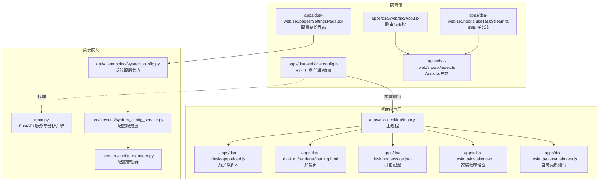

**图表来源**
- [apps/dsa-desktop/main.js:1-1624](file://apps/dsa-desktop/main.js#L1-L1624)
- [apps/dsa-desktop/preload.js:1-63](file://apps/dsa-desktop/preload.js#L1-L63)
- [apps/dsa-desktop/installer.nsh:1-46](file://apps/dsa-desktop/installer.nsh#L1-L46)
- [apps/dsa-desktop/tests/main.test.js:1-707](file://apps/dsa-desktop/tests/main.test.js#L1-L707)
- [apps/dsa-web/src/pages/SettingsPage.tsx:160-359](file://apps/dsa-web/src/pages/SettingsPage.tsx#L160-L359)
- [api/v1/endpoints/system_config.py:140-242](file://api/v1/endpoints/system_config.py#L140-L242)
- [src/services/system_config_service.py:208-239](file://src/services/system_config_service.py#L208-L239)

**章节来源**
- [apps/dsa-desktop/main.js:1-1624](file://apps/dsa-desktop/main.js#L1-L1624)
- [apps/dsa-desktop/package.json:1-60](file://apps/dsa-desktop/package.json#L1-L60)
- [apps/dsa-web/vite.config.ts:1-30](file://apps/dsa-web/vite.config.ts#L1-L30)

## 核心组件
- 主进程（main.js）
  - 窗口创建与主题适配、加载页展示、外部链接拦截
  - 环境文件准备、日志初始化、端口选择与健康检查
  - 后端服务启动与停止（可执行或 Python 脚本），进程监控与日志
  - 生命周期事件处理（窗口关闭、退出前清理）
  - **新增** 自动更新系统：基于 electron-updater 的自动更新检查、下载、安装
  - **新增** 更新备份功能：运行时状态备份与恢复，确保更新过程中的数据安全

- 预加载脚本（preload.js）
  - 通过 contextBridge.exposeInMainWorld 暴露受控 API（版本信息、更新状态查询、更新操作）
  - **新增** 更新状态事件监听：支持桌面端更新状态的实时通知

- 加载页（loading.html）
  - 展示启动进度与错误提示，支持从 URL 查询参数接收错误信息

- 打包配置（package.json）
  - Electron Builder 配置：目标平台、产物目录、额外资源、安装包格式
  - **新增** electron-updater 依赖：支持自动更新功能

- 安装程序增强（installer.nsh）
  - Windows 安装程序的安全增强，包括安装目录验证和系统保护目录阻止

- 前端构建与代理（vite.config.ts）
  - Vite 开发服务器允许公网访问，配置 /api 代理到本地后端
  - 构建输出到仓库根目录 static，供桌面应用内嵌

- 前端路由与鉴权（src/App.tsx）
  - 基于 React Router 的路由体系，登录态校验与重定向

- API 客户端（src/api/index.ts）
  - Axios 客户端封装，统一超时、凭证与错误处理

- 任务流订阅（src/hooks/useTaskStream.ts）
  - 基于 EventSource 的 SSE 订阅，处理任务生命周期事件

- 配置备份界面（src/pages/SettingsPage.tsx）
  - 提供 .env 文件的导出和导入功能，支持桌面端配置管理

**章节来源**
- [apps/dsa-desktop/main.js:1-1624](file://apps/dsa-desktop/main.js#L1-L1624)
- [apps/dsa-desktop/preload.js:1-63](file://apps/dsa-desktop/preload.js#L1-L63)
- [apps/dsa-desktop/renderer/loading.html:1-143](file://apps/dsa-desktop/renderer/loading.html#L1-L143)
- [apps/dsa-desktop/package.json:1-60](file://apps/dsa-desktop/package.json#L1-L60)
- [apps/dsa-desktop/installer.nsh:1-46](file://apps/dsa-desktop/installer.nsh#L1-L46)
- [apps/dsa-web/vite.config.ts:1-30](file://apps/dsa-web/vite.config.ts#L1-L30)
- [apps/dsa-web/src/App.tsx:1-87](file://apps/dsa-web/src/App.tsx#L1-L87)
- [apps/dsa-web/src/api/index.ts:1-30](file://apps/dsa-web/src/api/index.ts#L1-L30)
- [apps/dsa-web/src/hooks/useTaskStream.ts:1-255](file://apps/dsa-web/src/hooks/useTaskStream.ts#L1-L255)
- [apps/dsa-web/src/pages/SettingsPage.tsx:160-359](file://apps/dsa-web/src/pages/SettingsPage.tsx#L160-L359)

## 架构总览
桌面应用采用"主进程 + 渲染进程 + 预加载脚本 + 前端静态资源 + 后端服务 + 自动更新系统"的分层架构。主进程负责应用生命周期与后端服务管理，渲染进程承载 Web UI，预加载脚本提供受限的桌面能力桥接，前端通过 Axios 与 SSE 与后端交互，**新增**的自动更新系统提供无缝的应用更新体验。

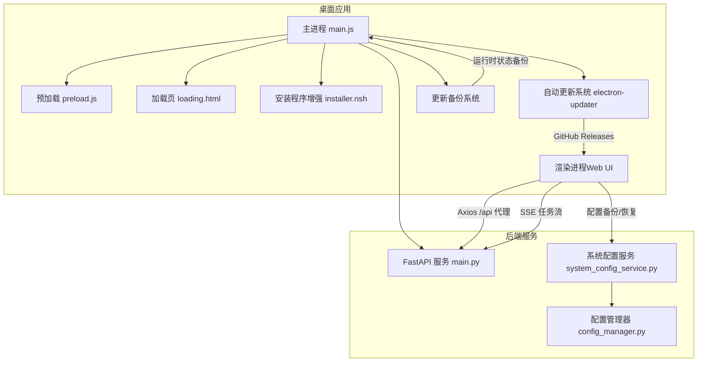

**图表来源**
- [apps/dsa-desktop/main.js:1-1624](file://apps/dsa-desktop/main.js#L1-L1624)
- [apps/dsa-desktop/preload.js:1-63](file://apps/dsa-desktop/preload.js#L1-L63)
- [apps/dsa-desktop/installer.nsh:1-46](file://apps/dsa-desktop/installer.nsh#L1-L46)
- [apps/dsa-web/src/pages/SettingsPage.tsx:160-359](file://apps/dsa-web/src/pages/SettingsPage.tsx#L160-L359)
- [src/services/system_config_service.py:208-239](file://src/services/system_config_service.py#L208-L239)

## 详细组件分析

### 主进程（Electron 主进程）
- 窗口与主题
  - 创建 BrowserWindow，设置最小尺寸、背景色与 webPreferences（禁用 nodeIntegration、启用 contextIsolation）
  - 监听系统主题变化，动态更新窗口背景色
  - 外链打开通过 shell.openExternal 拦截，防止在应用内打开外部链接

- 启动流程
  - 初始化日志与环境文件（.env），选择可用端口（8000–8100）
  - 启动后端服务：优先使用打包后的可执行文件，否则使用 Python 脚本
  - 健康检查：轮询 /api/health，支持进度回调与超时控制
  - 成功后加载本地 http://127.0.0.1:<port>/ 作为主页面

- 进程管理
  - 后端进程 stdout/stderr 日志记录，错误捕获与退出处理
  - 优雅退出：窗口全部关闭与 before-quit 时停止后端进程

- **新增** 自动更新管理
  - 条件加载 electron-updater，仅在 Windows NSIS 安装模式下启用
  - 配置自动下载和安装策略，处理更新状态事件
  - 实现更新检查、下载进度跟踪、安装确认和错误处理

- **新增** 更新备份管理
  - 定义运行时相对文件列表，包括 .env、数据库文件和日志文件
  - 实现备份清单管理，支持增量恢复和失败重试
  - 提供更新前的数据备份和更新后的状态恢复

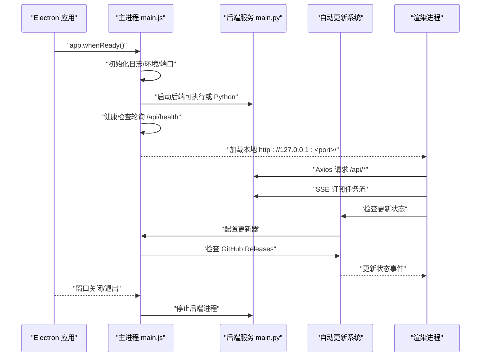

**图表来源**
- [apps/dsa-desktop/main.js:1-1624](file://apps/dsa-desktop/main.js#L1-L1624)
- [main.py:1-200](file://main.py#L1-L200)

**章节来源**
- [apps/dsa-desktop/main.js:1-1624](file://apps/dsa-desktop/main.js#L1-L1624)

### 预加载脚本（安全桥接）
- 作用
  - 通过 contextBridge.exposeInMainWorld 在渲染进程的 window 对象上暴露受控 API
  - **新增** 支持桌面端更新状态查询、更新检查、更新安装等操作
  - **新增** 更新状态事件监听机制，实现实时状态同步

- 安全性
  - 严格限制暴露接口，避免直接注入 Node.js 能力
  - 与 webPreferences.contextIsolation 配合，降低 XSS 与权限提升风险

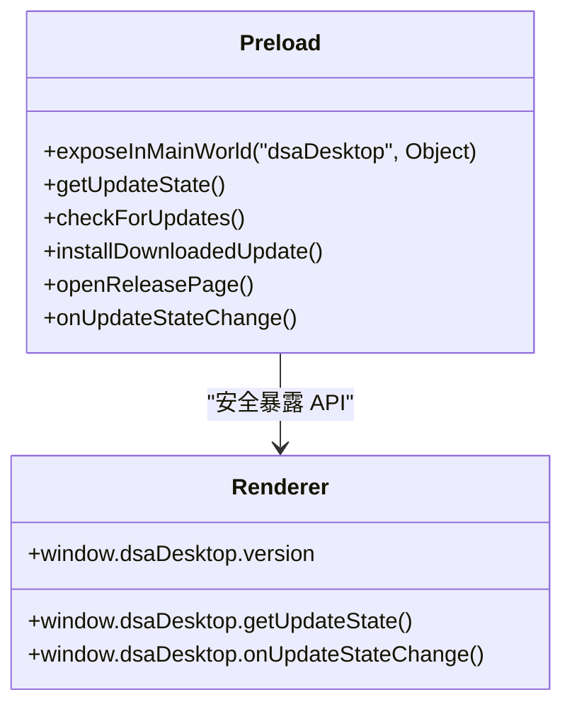

**图表来源**
- [apps/dsa-desktop/preload.js:1-63](file://apps/dsa-desktop/preload.js#L1-L63)

**章节来源**
- [apps/dsa-desktop/preload.js:1-63](file://apps/dsa-desktop/preload.js#L1-L63)

### 加载页（loading.html）
- 功能
  - 展示启动进度与脉冲动画
  - 支持从 URL 查询参数接收错误信息并显示
  - 适配深浅色主题

- 流程
  - 应用启动时先加载该页面，等待后端健康就绪后再切换到主页面

**章节来源**
- [apps/dsa-desktop/renderer/loading.html:1-143](file://apps/dsa-desktop/renderer/loading.html#L1-L143)

### 打包与跨平台配置
- 打包配置（apps/dsa-desktop/package.json）
  - appId、productName、输出目录
  - files 包含 main.js、preload.js、renderer/**/*
  - extraResources：复制 .env.example 与打包后的后端二进制
  - 平台目标：Windows（nsis）、macOS（dmg）
  - **新增** electron-updater 依赖：支持自动更新功能

- 构建脚本（scripts/build-desktop.ps1）
  - Windows 平台要求启用开发者模式以支持符号链接缓存
  - 校验后端产物是否存在，否则报错
  - 清理旧构建产物，安装依赖并执行 electron-builder

- 开发运行脚本（scripts/run-desktop.ps1）
  - 先构建前端静态资源到 static，再启动 Electron 开发模式

**章节来源**
- [apps/dsa-desktop/package.json:1-60](file://apps/dsa-desktop/package.json#L1-L60)
- [scripts/build-desktop.ps1:1-63](file://scripts/build-desktop.ps1#L1-L63)
- [scripts/run-desktop.ps1:1-18](file://scripts/run-desktop.ps1#L1-L18)

### 前端构建与代理（Vite）
- 开发代理
  - 将 /api 前缀代理到本地后端（http://127.0.0.1:8000），便于前后端联调
  - 允许公网访问（host: 0.0.0.0），方便多设备联调

- 构建输出
  - 输出到仓库根目录 static，供桌面应用内嵌加载

**章节来源**
- [apps/dsa-web/vite.config.ts:1-30](file://apps/dsa-web/vite.config.ts#L1-L30)

### 路由与鉴权（React Router）
- 登录态控制
  - 未登录时重定向到 /login，并携带 redirect 参数
  - 登录页命中时自动重定向到首页
  - 加载失败时展示错误提示与重试按钮

**章节来源**
- [apps/dsa-web/src/App.tsx:1-87](file://apps/dsa-web/src/App.tsx#L1-L87)

### API 客户端与错误处理
- Axios 客户端
  - 统一基础路径、超时、凭证与请求头
  - 响应拦截器中处理 401 重定向到登录页

**章节来源**
- [apps/dsa-web/src/api/index.ts:1-30](file://apps/dsa-web/src/api/index.ts#L1-L30)

### 任务流订阅（SSE）
- 功能
  - 基于 EventSource 订阅任务生命周期事件（connected、task_created、task_started、task_completed、task_failed、heartbeat）
  - 支持自动重连、手动断开/重连、启用/禁用开关

- 性能与可靠性
  - 使用 ref 缓存回调，避免频繁重连
  - 错误时自动重连，保持连接稳定性

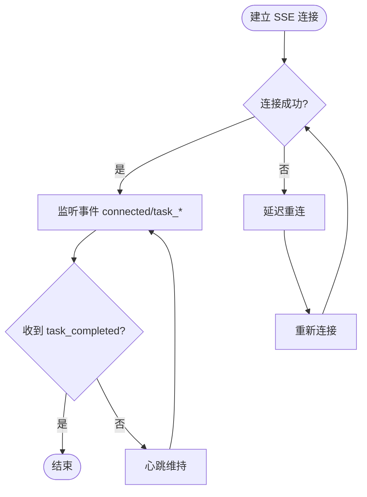

**图表来源**
- [apps/dsa-web/src/hooks/useTaskStream.ts:1-255](file://apps/dsa-web/src/hooks/useTaskStream.ts#L1-L255)

**章节来源**
- [apps/dsa-web/src/hooks/useTaskStream.ts:1-255](file://apps/dsa-web/src/hooks/useTaskStream.ts#L1-L255)

## 自动更新系统

### 更新架构设计
桌面应用集成了基于 electron-updater 的自动更新系统，提供无缝的应用更新体验。系统支持两种更新模式：自动更新和手动更新，确保用户可以选择最适合的更新方式。

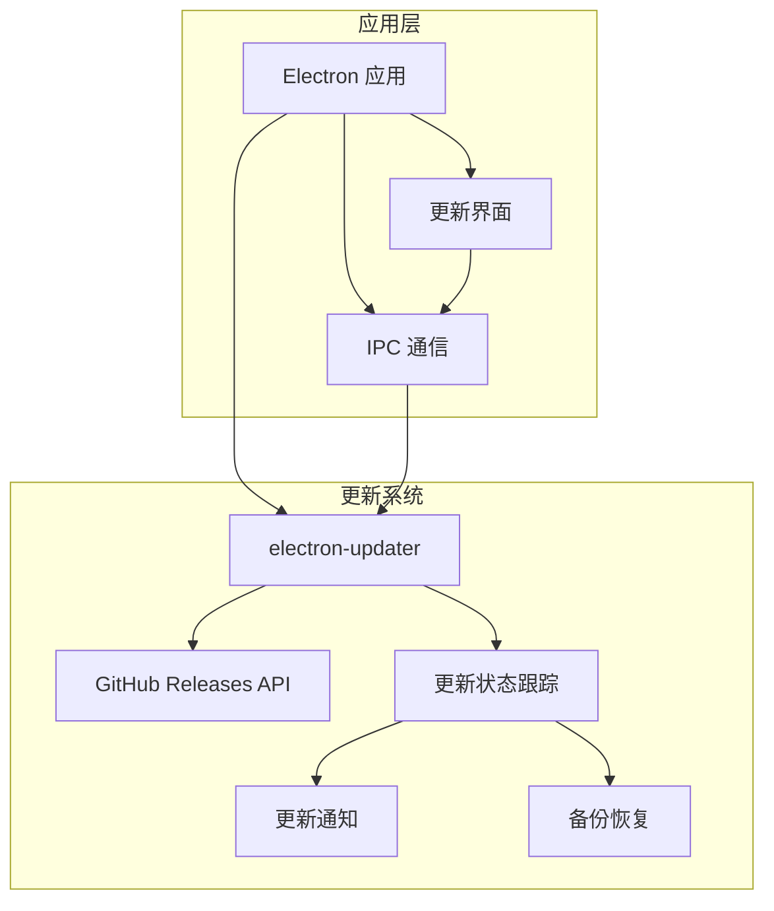

**图表来源**
- [apps/dsa-desktop/main.js:1008-1343](file://apps/dsa-desktop/main.js#L1008-L1343)
- [apps/dsa-desktop/preload.js:17-49](file://apps/dsa-desktop/preload.js#L17-L49)

### 更新状态管理
系统定义了完整的更新状态枚举和状态转换机制：

- **状态类型**
  - IDLE：空闲状态
  - CHECKING：检查更新中
  - UP_TO_DATE：已是最新版本
  - UPDATE_AVAILABLE：发现新版本
  - DOWNLOADING：下载中
  - UPDATE_DOWNLOADED：更新已下载
  - INSTALLING：安装中
  - ERROR：发生错误

- **更新模式**
  - AUTO：自动更新模式，支持静默下载和安装
  - MANUAL：手动更新模式，需要用户确认后下载

**章节来源**
- [apps/dsa-desktop/main.js:42-56](file://apps/dsa-desktop/main.js#L42-L56)
- [apps/dsa-desktop/main.js:53-56](file://apps/dsa-desktop/main.js#L53-L56)

### GitHub Releases 集成
系统通过 GitHub Releases API 获取最新的版本信息，支持语义化版本解析和比较：

- **版本解析**
  - 支持标准语义化版本（如 v3.13.0）
  - 支持预发布版本（如 beta.1）
  - 自动去除版本前缀和后缀标识

- **版本比较**
  - 正确处理主版本、次版本、修订版本比较
  - 支持预发布版本的优先级排序
  - 提供详细的版本比较结果

**章节来源**
- [apps/dsa-desktop/main.js:58-144](file://apps/dsa-desktop/main.js#L58-L144)
- [apps/dsa-desktop/main.js:183-204](file://apps/dsa-desktop/main.js#L183-L204)

### 更新检查流程
系统提供两种更新检查方式：基于 electron-updater 的自动检查和基于 GitHub API 的手动检查。

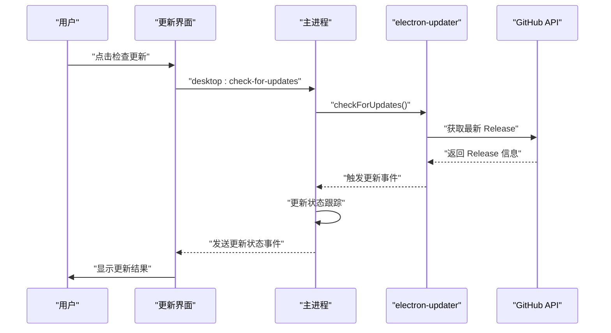

**图表来源**
- [apps/dsa-desktop/main.js:1309-1387](file://apps/dsa-desktop/main.js#L1309-L1387)
- [apps/dsa-desktop/main.js:1389-1395](file://apps/dsa-desktop/main.js#L1389-L1395)

**章节来源**
- [apps/dsa-desktop/main.js:1309-1387](file://apps/dsa-desktop/main.js#L1309-L1387)

### 更新下载与安装
系统支持自动下载和手动安装两种模式，提供完整的下载进度跟踪和错误处理机制。

- **自动下载**
  - 启动时自动检查更新
  - 后台下载新版本
  - 下载完成后提示用户安装

- **手动安装**
  - 用户主动检查更新
  - 下载完成后需要用户确认安装

- **安装流程**
  - 停止后端服务
  - 备份运行时状态
  - 执行更新安装
  - 恢复运行时状态

**章节来源**
- [apps/dsa-desktop/main.js:1224-1307](file://apps/dsa-desktop/main.js#L1224-L1307)
- [apps/dsa-desktop/main.js:1125-1180](file://apps/dsa-desktop/main.js#L1125-L1180)

### URL 安全验证
为防止路径遍历攻击和恶意链接，系统实现了严格的 URL 安全验证机制：

- **域名验证**
  - 仅允许 github.com 域名
  - 仅允许指定仓库的 releases 路径

- **路径验证**
  - 检查路径前缀是否为 `/owner/repo/releases`
  - 防止 ../ 等路径遍历攻击

- **回退机制**
  - 不符合安全规则的 URL 自动回退到默认 releases 页面

**章节来源**
- [apps/dsa-desktop/main.js:1059-1075](file://apps/dsa-desktop/main.js#L1059-L1075)

## 更新备份功能

### 备份架构设计
系统实现了完整的运行时状态备份与恢复机制，确保更新过程中的数据安全。备份系统针对 Windows NSIS 安装模式进行了专门优化。

```mermaid
graph TB
subgraph "备份系统"
BR["备份根目录"]
RM["备份清单"]
RF["相对文件列表"]
end
subgraph "运行时文件"
ENV[".env 配置文件"]
DB["stock_analysis.db 数据库"]
WAL["stock_analysis.db-wal WAL文件"]
SHM["stock_analysis.db-shm SHM文件"]
LOG["desktop.log 日志文件"]
end
subgraph "恢复系统"
RR["恢复根目录"]
RS["恢复状态"]
RF --> BR
ENV --> BR
DB --> BR
WAL --> BR
SHM --> BR
LOG --> BR
BR --> RR
RR --> RS
```

**图表来源**
- [apps/dsa-desktop/main.js:34-40](file://apps/dsa-desktop/main.js#L34-L40)
- [apps/dsa-desktop/main.js:444-562](file://apps/dsa-desktop/main.js#L444-L562)

### 备份文件管理
系统定义了需要备份的关键运行时文件，确保更新后能够恢复所有重要数据：

- **配置文件**
  - .env：应用配置文件
  - data/stock_analysis.db：SQLite 数据库文件

- **数据库文件**
  - stock_analysis.db-wal：WAL 模式下的写入日志
  - stock_analysis.db-shm：共享内存映射文件

- **日志文件**
  - logs/desktop.log：桌面应用日志文件

**章节来源**
- [apps/dsa-desktop/main.js:34-40](file://apps/dsa-desktop/main.js#L34-L40)
- [apps/dsa-desktop/main.js:444-473](file://apps/dsa-desktop/main.js#L444-L473)

### 备份清单机制
系统使用 JSON 格式的备份清单记录备份状态和文件列表：

- **清单内容**
  - backedAt：备份时间戳
  - appVersion：备份时的应用版本
  - files：备份的文件列表

- **增量备份**
  - 支持部分文件备份失败的场景
  - 失败的文件会在下次备份时重试

- **版本控制**
  - 比较备份版本与当前版本
  - 如果版本相同则跳过备份

**章节来源**
- [apps/dsa-desktop/main.js:407-428](file://apps/dsa-desktop/main.js#L407-L428)
- [apps/dsa-desktop/main.js:475-562](file://apps/dsa-desktop/main.js#L475-L562)

### 恢复机制
系统提供了完整的备份恢复机制，支持部分文件恢复和失败重试：

- **恢复流程**
  - 读取备份清单
  - 比较备份版本与当前版本
  - 恢复成功文件并从清单中移除
  - 保留失败文件以便下次重试

- **错误处理**
  - 备份目录保留用于手动恢复
  - 记录详细的错误信息
  - 支持多次重试机制

**章节来源**
- [apps/dsa-desktop/main.js:475-562](file://apps/dsa-desktop/main.js#L475-L562)

## 安全增强

### 路径遍历漏洞修复
系统实现了严格的文件路径验证，防止路径遍历攻击：

- **路径规范化**
  - 使用 path.join 确保路径安全拼接
  - 避免直接使用用户输入的文件路径
  - 限制文件访问范围在应用目录内

- **文件操作安全**
  - 所有文件操作前进行存在性检查
  - 使用绝对路径而非相对路径
  - 防止 .. 路径遍历攻击

**章节来源**
- [apps/dsa-desktop/main.js:391-405](file://apps/dsa-desktop/main.js#L391-L405)
- [apps/dsa-desktop/main.js:455-462](file://apps/dsa-desktop/main.js#L455-L462)

### URL 安全验证
系统对所有外部链接进行严格的安全验证：

- **域名白名单**
  - 仅允许 github.com 域名
  - 仅允许指定仓库的 releases 页面

- **路径验证**
  - 检查路径前缀是否为 `/owner/repo/releases`
  - 防止恶意路径注入

- **协议安全**
  - 仅允许 https 协议
  - 防止 http 劫持攻击

**章节来源**
- [apps/dsa-desktop/main.js:1059-1075](file://apps/dsa-desktop/main.js#L1059-L1075)

### 更新安全机制
自动更新系统采用了多重安全措施：

- **签名验证**
  - 仅从官方 GitHub 仓库下载更新
  - 验证更新包的完整性

- **权限控制**
  - 仅在安装模式下启用自动更新
  - 防止便携版应用自动更新

- **回滚机制**
  - 更新失败时自动回滚
  - 保留备份目录用于手动恢复

**章节来源**
- [apps/dsa-desktop/main.js:1018-1026](file://apps/dsa-desktop/main.js#L1018-L1026)
- [apps/dsa-desktop/main.js:1141-1180](file://apps/dsa-desktop/main.js#L1141-L1180)

## 改进的IPC通信

### 更新状态事件系统
系统新增了完整的更新状态事件通信机制，实现主进程与渲染进程之间的实时状态同步：

- **事件类型**
  - desktop:update-state：更新状态事件
  - desktop:get-update-state：获取更新状态
  - desktop:check-for-updates：检查更新
  - desktop:install-downloaded-update：安装更新
  - desktop:open-release-page：打开发布页面

- **状态广播**
  - 主进程通过 mainWindow.webContents.send 广播更新状态
  - 渲染进程通过 onUpdateStateChange 监听状态变化
  - 支持实时更新进度和错误信息

**章节来源**
- [apps/dsa-desktop/preload.js:3-8](file://apps/dsa-desktop/preload.js#L3-L8)
- [apps/dsa-desktop/preload.js:35-47](file://apps/dsa-desktop/preload.js#L35-L47)
- [apps/dsa-desktop/main.js:1077-1091](file://apps/dsa-desktop/main.js#L1077-L1091)

### IPC API 设计
系统提供了完整的 IPC API 接口，支持桌面端更新操作：

- **查询接口**
  - getUpdateState()：获取当前更新状态
  - checkForUpdates()：检查更新（支持手动模式）

- **操作接口**
  - installDownloadedUpdate()：安装已下载的更新
  - openReleasePage()：打开发布页面

- **事件监听**
  - onUpdateStateChange()：注册更新状态变化监听器
  - 返回值用于取消监听

**章节来源**
- [apps/dsa-desktop/preload.js:17-49](file://apps/dsa-desktop/preload.js#L17-L49)
- [apps/dsa-desktop/main.js:1389-1395](file://apps/dsa-desktop/main.js#L1389-L1395)

### 安全通信机制
系统确保 IPC 通信的安全性和可靠性：

- **参数验证**
  - 所有 IPC 调用参数进行类型检查
  - 防止恶意参数注入

- **错误处理**
  - IPC 调用异常被捕获并转换为错误消息
  - 支持异步错误传播

- **权限控制**
  - 仅暴露必要的 IPC 接口
  - 防止越权操作

**章节来源**
- [apps/dsa-desktop/main.js:1389-1395](file://apps/dsa-desktop/main.js#L1389-L1395)

## Windows 安装程序增强

### 安装目录安全验证
Windows 安装程序通过 NSIS 脚本实现了多层次的安装目录安全验证，防止将应用程序安装到系统受保护的目录中：

- **系统保护目录阻止**
  - 阻止安装到 Program Files（包括 x64 和 x86 版本）
  - 阻止安装到 Windows 系统目录及其子目录
  - 使用 .onVerifyInstDir 函数实时验证用户选择的安装路径

- **强制用户级安装**
  - 通过 customInstallMode 宏强制执行 per-user 安装
  - 确保运行时文件写入到用户可写的位置
  - 避免 .env、data/ 和 logs/ 目录的写入失败

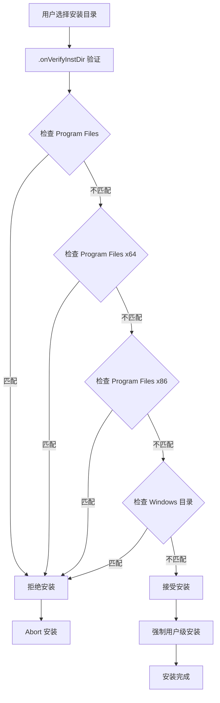

**图表来源**
- [apps/dsa-desktop/installer.nsh:7-44](file://apps/dsa-desktop/installer.nsh#L7-L44)

### 安装程序宏定义
- **customInstallMode 宏**
  - 设置 isForceCurrentInstall=1 强制当前用户安装
  - 确保运行时文件位于用户可写位置

- **customHeader 宏**
  - 定义 .onVerifyInstDir 函数
  - 实现完整的目录验证逻辑

**章节来源**
- [apps/dsa-desktop/installer.nsh:1-46](file://apps/dsa-desktop/installer.nsh#L1-L46)

## 环境备份/恢复功能

### 桌面端配置管理架构
系统实现了完整的桌面端环境备份和恢复功能，通过专门的 API 端点和前端界面提供用户友好的配置管理体验：

- **桌面模式限制**
  - 所有备份/恢复操作仅在桌面运行模式下可用
  - 通过 DSA_DESKTOP_MODE 环境变量控制功能可用性
  - 防止 Web 版本意外访问敏感的配置文件操作

- **配置版本控制**
  - 使用乐观并发控制防止配置冲突
  - 基于文件状态生成唯一版本标识符
  - 支持配置变更检测和冲突解决

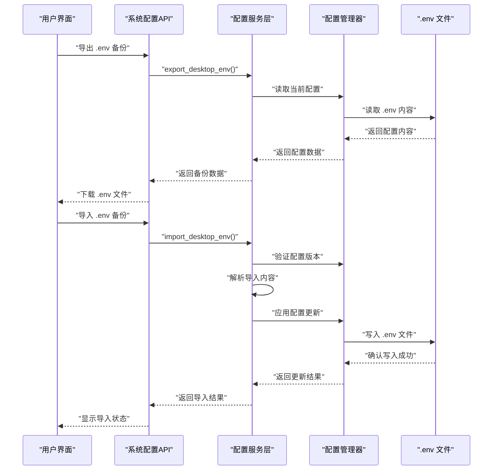

**图表来源**
- [api/v1/endpoints/system_config.py:149-242](file://api/v1/endpoints/system_config.py#L149-L242)
- [src/services/system_config_service.py:208-239](file://src/services/system_config_service.py#L208-L239)
- [src/core/config_manager.py:93-141](file://src/core/config_manager.py#L93-L141)

### API 端点设计
系统提供了两个专门的桌面端 API 端点：

- **导出端点** (`/config/export`)
  - 返回当前激活的 .env 文件内容
  - 包含配置版本信息和最后更新时间
  - 仅在桌面模式下可用

- **导入端点** (`/config/import`)
  - 接收原始 .env 文本内容
  - 验证配置版本一致性
  - 支持立即重载配置选项

**章节来源**
- [api/v1/endpoints/system_config.py:140-242](file://api/v1/endpoints/system_config.py#L140-L242)
- [api/v1/schemas/system_config.py:74-122](file://api/v1/schemas/system_config.py#L74-L122)

### 前端用户界面
SettingsPage 提供了直观的配置备份管理界面：

- **导出功能**
  - 下载当前已保存的 .env 备份文件
  - 自动生成带时间戳的文件名
  - 显示导出成功状态

- **导入功能**
  - 文件选择对话框导入 .env 备份
  - 支持脏配置状态确认
  - 导入后自动重新加载配置

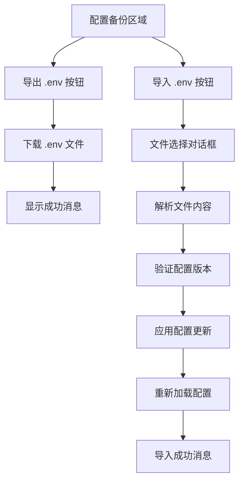

**图表来源**
- [apps/dsa-web/src/pages/SettingsPage.tsx:161-228](file://apps/dsa-web/src/pages/SettingsPage.tsx#L161-L228)

**章节来源**
- [apps/dsa-web/src/pages/SettingsPage.tsx:160-359](file://apps/dsa-web/src/pages/SettingsPage.tsx#L160-L359)

### 配置管理器实现
ConfigManager 提供了安全可靠的配置文件读写能力：

- **原子写入操作**
  - 支持原子替换和降级回写机制
  - 处理挂载文件系统的特殊情况
  - 确保配置文件完整性

- **版本控制**
  - 基于文件修改时间和内容哈希生成版本
  - 支持配置冲突检测
  - 提供最后更新时间追踪

- **配置解析**
  - 解析 .env 文件中的键值对
  - 保留注释和空行格式
  - 支持敏感信息掩码

**章节来源**
- [src/core/config_manager.py:69-200](file://src/core/config_manager.py#L69-L200)
- [src/services/system_config_service.py:208-239](file://src/services/system_config_service.py#L208-L239)

## 依赖关系分析
- 主进程依赖
  - child_process：启动后端进程
  - http/net：健康检查与端口探测
  - fs/path：资源路径解析、日志与环境文件管理
  - nativeTheme：主题监听与背景色适配
  - **新增** electron-updater：自动更新功能
  - **新增** crypto：更新包完整性验证

- 前端依赖
  - axios：HTTP 客户端
  - react-router-dom：路由与鉴权
  - zustand：状态管理（在本节不展开）
  - recharts、lucide-react 等 UI 组件库

- 构建与打包
  - electron/electron-builder：桌面应用打包
  - vite + @vitejs/plugin-react：前端构建与开发代理

- 安装程序依赖
  - NSIS：Windows 安装程序构建
  - 自定义 NSIS 脚本：安全安装验证

- 配置管理依赖
  - python-dotenv：.env 文件解析
  - hashlib：配置版本哈希计算
  - threading：线程安全的配置操作

- **新增** 测试依赖
  - node:test：单元测试框架
  - node:assert：断言工具
  - electron-updater stub：更新功能测试

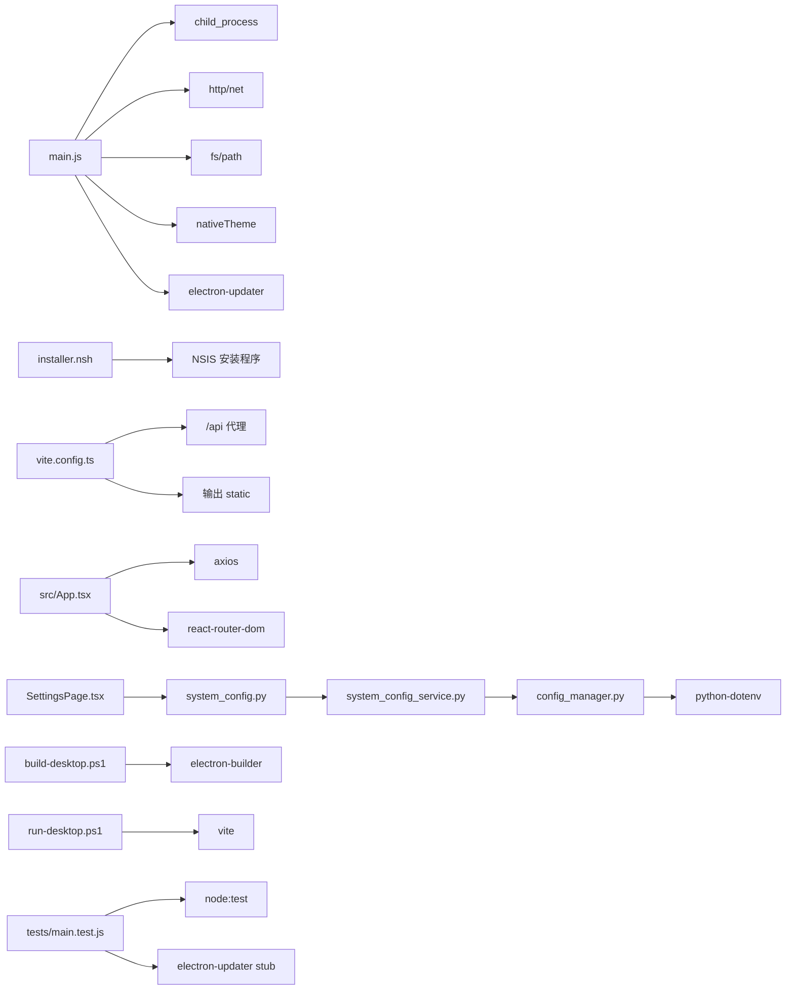

**图表来源**
- [apps/dsa-desktop/main.js:1-1624](file://apps/dsa-desktop/main.js#L1-L1624)
- [apps/dsa-desktop/installer.nsh:1-46](file://apps/dsa-desktop/installer.nsh#L1-L46)
- [apps/dsa-web/vite.config.ts:1-30](file://apps/dsa-web/vite.config.ts#L1-L30)
- [apps/dsa-web/src/App.tsx:1-87](file://apps/dsa-web/src/App.tsx#L1-L87)
- [apps/dsa-web/src/pages/SettingsPage.tsx:160-359](file://apps/dsa-web/src/pages/SettingsPage.tsx#L160-L359)
- [api/v1/endpoints/system_config.py:140-242](file://api/v1/endpoints/system_config.py#L140-L242)
- [src/services/system_config_service.py:208-239](file://src/services/system_config_service.py#L208-L239)
- [src/core/config_manager.py:69-200](file://src/core/config_manager.py#L69-L200)
- [apps/dsa-desktop/tests/main.test.js:1-707](file://apps/dsa-desktop/tests/main.test.js#L1-L707)

**章节来源**
- [apps/dsa-desktop/main.js:1-1624](file://apps/dsa-desktop/main.js#L1-L1624)
- [apps/dsa-desktop/installer.nsh:1-46](file://apps/dsa-desktop/installer.nsh#L1-L46)
- [apps/dsa-web/vite.config.ts:1-30](file://apps/dsa-web/vite.config.ts#L1-L30)
- [apps/dsa-web/src/App.tsx:1-87](file://apps/dsa-web/src/App.tsx#L1-L87)
- [apps/dsa-web/src/pages/SettingsPage.tsx:160-359](file://apps/dsa-web/src/pages/SettingsPage.tsx#L160-L359)
- [api/v1/endpoints/system_config.py:140-242](file://api/v1/endpoints/system_config.py#L140-L242)
- [src/services/system_config_service.py:208-239](file://src/services/system_config_service.py#L208-L239)
- [src/core/config_manager.py:69-200](file://src/core/config_manager.py#L69-L200)
- [apps/dsa-desktop/tests/main.test.js:1-707](file://apps/dsa-desktop/tests/main.test.js#L1-L707)

## 性能考虑
- 启动阶段
  - 健康检查轮询间隔与超时合理设置，避免长时间阻塞
  - 首屏加载优先显示加载页，减少白屏时间
  - **新增** 自动更新检查采用后台模式，不影响应用启动速度

- 网络与 IO
  - Axios 超时与重试策略需结合业务场景调整
  - SSE 自动重连延迟可按网络状况优化
  - **新增** 更新下载使用 electron-updater 内置的高效下载机制

- 构建与打包
  - 前端构建输出到 static，减少运行时编译开销
  - 打包时排除不必要的资源，缩小安装包体积
  - **新增** electron-updater 依赖仅在需要时加载

- 主进程与渲染进程
  - 保持 IPC 通道简洁，避免传输大对象
  - 合理使用 contextBridge 暴露能力，避免过度耦合
  - **新增** 更新状态事件采用轻量级消息传递

- 安装程序性能
  - 安装目录验证采用快速字符串匹配算法
  - 避免复杂的文件系统查询操作

- 配置管理性能
  - .env 文件读写采用原子操作，减少磁盘竞争
  - 配置版本哈希计算使用高效算法

- **新增** 更新备份性能
  - 备份操作在应用启动时异步执行
  - 支持增量备份，避免重复备份已存在的文件
  - 恢复操作采用并行处理提高效率

## 故障排查指南
- 后端未启动或无法健康检查
  - 检查端口占用（8000–8100），确认后端可执行文件或 Python 环境可用
  - 查看主进程日志（桌面应用根目录 logs/desktop.log），定位启动错误

- Windows 打包失败
  - 确认已启用开发者模式，满足 electron-builder 符号链接缓存需求
  - 确保已先构建后端产物，再执行打包脚本

- 前端代理无效
  - 确认 Vite 开发服务器已启动且端口正确
  - 检查 /api 代理配置是否指向正确的本地后端地址

- 登录态问题
  - 401 时会自动重定向到登录页，检查鉴权状态与凭证传递

- 安装程序错误
  - 检查安装目录是否被系统保护（Program Files、Windows 等）
  - 确认用户具有目标目录的写入权限
  - 验证 NSIS 脚本语法正确性

- 配置备份/恢复失败
  - 检查 DSA_DESKTOP_MODE 环境变量设置
  - 验证 .env 文件格式和权限
  - 确认配置版本一致性检查通过

- **新增** 自动更新问题
  - 检查 electron-updater 是否正确加载
  - 验证 GitHub API 可访问性
  - 查看更新日志文件了解具体错误原因
  - 确认应用是否为 Windows NSIS 安装模式

- **新增** 更新备份问题
  - 检查备份目录权限和磁盘空间
  - 验证备份清单文件完整性
  - 查看备份日志了解失败原因
  - 确认恢复操作的文件锁定情况

**章节来源**
- [apps/dsa-desktop/main.js:1-1624](file://apps/dsa-desktop/main.js#L1-L1624)
- [apps/dsa-desktop/installer.nsh:1-46](file://apps/dsa-desktop/installer.nsh#L1-L46)
- [scripts/build-desktop.ps1:1-63](file://scripts/build-desktop.ps1#L1-L63)
- [apps/dsa-web/vite.config.ts:1-30](file://apps/dsa-web/vite.config.ts#L1-L30)
- [apps/dsa-web/src/App.tsx:1-87](file://apps/dsa-web/src/App.tsx#L1-L87)

## 结论
该桌面应用通过清晰的分层设计与严格的预加载安全机制，实现了稳定的本地服务与 Web UI 一体化体验。主进程负责应用生命周期与后端服务管理，渲染进程承载现代化前端界面，预加载脚本提供受控的桌面能力桥接。配合 Vite 代理与 SSE 任务流，形成高效的开发与运行闭环。

**更新** 本版本的重要改进包括：
- **自动更新系统**：基于 electron-updater 的无缝更新体验，支持自动下载和手动安装
- **更新备份功能**：完整的运行时状态备份与恢复机制，确保更新过程中的数据安全
- **安全增强**：路径遍历漏洞修复、URL 安全验证、更新包完整性检查
- **改进的 IPC 通信**：实时更新状态事件、安全的桌面端 API 暴露
- **Windows 安装程序增强**：多层次的安装目录验证和系统保护目录阻止
- **完整的环境备份/恢复功能**：提供桌面端专用的 .env 文件管理能力

这些改进显著提升了桌面应用的用户体验、安全性和可靠性，为用户提供了更加稳定和便捷的应用更新体验。

## 附录
- 开发调试
  - 使用 run-desktop.ps1 同步构建前端并启动 Electron 开发模式
  - 通过 Vite 代理与后端联调，观察网络面板与 SSE 事件
  - **新增** 使用 npm test 运行自动更新测试套件

- 打包与发布
  - 使用 build-desktop.ps1 执行打包，生成 Windows（nsis）与 macOS（dmg）安装包
  - 确保后端产物与 .env.example 已正确复制到打包资源中
  - **新增** electron-updater 配置已在 package.json 中正确设置

- 安装程序配置
  - customInstallMode 宏强制用户级安装，避免系统目录写入权限问题
  - customHeader 宏实现完整的安装目录验证逻辑

- 配置管理
  - 导出 .env 备份文件，包含当前配置状态和版本信息
  - 导入 .env 备份，支持版本冲突检测和自动重载

- **新增** 自动更新配置
  - GitHub 发布配置已在 package.json 中设置
  - 支持自动下载和手动安装两种模式
  - 更新状态通过 IPC 事件实时同步

- **新增** 安全加固建议
  - 严格限制 contextBridge 暴露的 API
  - 启用 CSP、禁用 eval、最小化权限
  - 对用户输入与外部链接进行严格校验与拦截
  - 使用桌面模式限制防止 Web 版本访问配置文件操作
  - 实施路径遍历防护和 URL 安全验证

- **新增** 测试覆盖
  - 自动更新功能的完整单元测试
  - 更新备份和恢复机制的测试用例
  - 安全验证和错误处理的测试场景